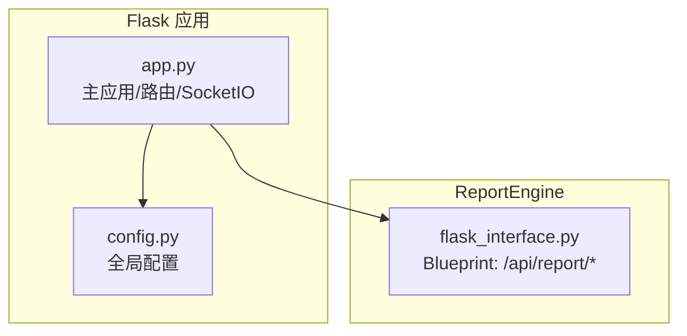
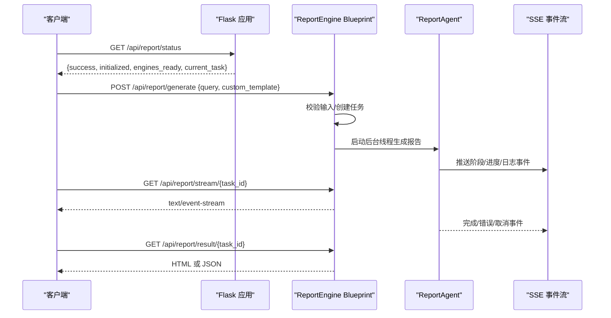
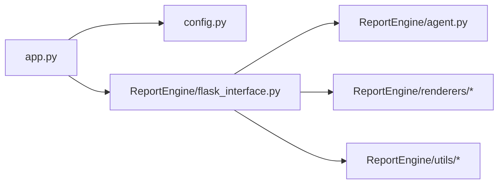

# API参考文档

<cite>
**本文引用的文件**
- [app.py](file://app.py)
- [config.py](file://config.py)
- [ReportEngine/flask_interface.py](file://ReportEngine/flask_interface.py)
- [README.md](file://README.md)
</cite>

## 目录
1. [简介](#简介)
2. [项目结构](#项目结构)
3. [核心组件](#核心组件)
4. [架构总览](#架构总览)
5. [详细组件分析](#详细组件分析)
6. [依赖关系分析](#依赖关系分析)
7. [性能考量](#性能考量)
8. [故障排查指南](#故障排查指南)
9. [结论](#结论)
10. [附录](#附录)

## 简介
本文件为 BettaFish 系统的完整 API 参考文档，涵盖：
- RESTful API 接口规范（HTTP 方法、URL 模式、请求/响应格式、错误处理）
- WebSocket 通信协议与消息格式（SSE/Socket.IO）
- 数据模型与事件结构
- 认证与安全机制
- API 版本管理与演进策略
- 实际调用示例与参数说明

系统采用 Flask + SocketIO + SSE 的混合架构，提供统一的 Web 控制台与实时交互能力，同时通过 Blueprint 对 ReportEngine 的任务流进行统一暴露。

## 项目结构
- 主应用入口：Flask 应用与 SocketIO 服务
- 配置中心：集中管理数据库、LLM、网络工具等配置
- 报告引擎：通过 Blueprint 暴露任务队列、SSE 流、模板与导出能力
- 前端模板与静态资源：提供控制台界面与示例报告

**图表来源**
- [app.py](file://app.py#L41-L83)
- [config.py](file://config.py#L23-L115)
- [ReportEngine/flask_interface.py](file://ReportEngine/flask_interface.py#L26-L27)

**章节来源**
- [app.py](file://app.py#L41-L83)
- [config.py](file://config.py#L23-L115)
- [README.md](file://README.md#L118-L297)

## 核心组件
- Flask 主应用与 SocketIO
  - 提供系统状态、组件启停、配置读写、论坛日志实时推送等能力
  - 使用 SocketIO 广播控制台输出与论坛消息
- ReportEngine Blueprint
  - 提供报告生成任务的生命周期管理（创建、进度查询、SSE 流、取消、结果获取、模板与导出）
  - 内置日志流转发与 SSE 心跳保活机制
- 配置中心
  - 通过 Pydantic Settings 管理 .env 与环境变量，支持运行时重载

**章节来源**
- [app.py](file://app.py#L1212-L1242)
- [ReportEngine/flask_interface.py](file://ReportEngine/flask_interface.py#L578-L704)
- [config.py](file://config.py#L23-L115)

## 架构总览
系统通过 Flask 路由与 Blueprint 统一对外暴露 REST API，同时通过 SocketIO 提供实时事件推送。ReportEngine 的任务通过 SSE 流式传输，结合心跳与断线重连机制，确保前端稳定接收。

**图表来源**
- [ReportEngine/flask_interface.py](file://ReportEngine/flask_interface.py#L578-L704)
- [ReportEngine/flask_interface.py](file://ReportEngine/flask_interface.py#L750-L867)

## 详细组件分析

### REST API 规范

- 基础路径
  - /api/config：配置读取与更新
  - /api/system/*：系统状态与启停
  - /api/report/*：报告引擎任务与导出
  - /api/graph/*：GraphRAG 知识图谱相关接口

- 认证与安全
  - 当前实现未内置鉴权层，建议在反向代理层或网关处统一接入认证（如 JWT、API Key）
  - 配置读取接口返回敏感字段时需谨慎处理

- 错误处理
  - 统一返回 JSON 结构：{success: bool, message?: string, error?: string}
  - 4xx：参数错误、资源不存在、权限不足等
  - 5xx：服务器内部错误

- 响应格式约定
  - 成功响应：{success: true, ...}
  - 失败响应：{success: false, error: string}

- 接口一览

  1) 配置管理
  - GET /api/config
    - 返回：{success: true, config: {HOST, PORT, DB_* 等}}
  - POST /api/config
    - 请求体：{key: value, ...}（仅允许白名单内的键）
    - 返回：{success: true, config: 更新后的配置}

  2) 系统管理
  - GET /api/system/status
    - 返回：{success: true, started: bool, starting: bool, shutdown_in_progress: bool}
  - POST /api/system/start
    - 请求体：{targets: ["insight","media","query","forum"]}
    - 返回：{success: true, message: string, ports: [number,...]}
  - POST /api/system/shutdown
    - 请求体：{ports?: [number,...]}
    - 返回：{success: true, message: string, ports: [number,...]}

  3) Streamlit 应用启停与日志
  - GET /api/status
    - 返回：{success: true, processes: {insight/media/query/forum: {status, port?}}}
  - POST /api/start/<app_name>
    - 返回：{success: true, message: string}
  - POST /api/stop/<app_name>
    - 返回：{success: true, message: string}
  - GET /api/output/<app_name>
    - 返回：{success: true, lines: [string,...]}
  - GET /api/test_log/<app_name>
    - 返回：{success: true, lines: [string,...]}

  4) 论坛日志
  - POST /api/forum/start
    - 返回：{success: true, message: string}
  - POST /api/forum/stop
    - 返回：{success: true, message: string}
  - GET /api/forum/log
    - 返回：{success: true, lines: [string,...]}
  - POST /api/forum/log/history
    - 请求体：{tail_lines?: number}
    - 返回：{success: true, lines: [string,...]}

  5) 搜索（示例）
  - POST /api/search
    - 请求体：{query: string, ...}
    - 返回：{success: true, query: string, results: [...]}

  6) GraphRAG
  - GET /api/graph/<report_id>
    - 返回：{nodes:[...], edges:[...]}（Vis.js 兼容结构）
  - GET /api/graph/latest
    - 返回：{success: true, report_id: string}
  - POST /api/graph/query
    - 请求体：{report_id: string, query: string, depth?: number}
    - 返回：{success: true, results: [...]}

- 请求/响应示例（路径引用）
  - 配置读取：[GET /api/config](file://app.py#L1212-L1221)
  - 配置更新：[POST /api/config](file://app.py#L1223-L1242)
  - 系统状态：[GET /api/system/status](file://app.py#L1246-L1256)
  - 启动系统：[POST /api/system/start](file://app.py#L1257-L1283)
  - 关闭系统：[POST /api/system/shutdown](file://app.py#L1284-L1325)
  - 应用启停：[POST /api/start/<app_name>](file://app.py#L957-L989), [POST /api/stop/<app_name>](file://app.py#L990-L1007)
  - 日志接口：[GET /api/output/<app_name>](file://app.py#L1008-L1033), [GET /api/test_log/<app_name>](file://app.py#L1034-L1054)
  - 论坛日志：[POST /api/forum/start](file://app.py#L1055-L1067), [POST /api/forum/stop](file://app.py#L1068-L1077), [GET /api/forum/log](file://app.py#L1078-L1110), [POST /api/forum/log/history](file://app.py#L1111-L1161)
  - 搜索接口：[POST /api/search](file://app.py#L1162-L1209)
  - GraphRAG：[GET /api/graph/<report_id>](file://app.py#L1330-L1398), [GET /api/graph/latest](file://app.py#L1399-L1462), [POST /api/graph/query](file://app.py#L1479-L1599)

**章节来源**
- [app.py](file://app.py#L939-L1636)

### ReportEngine Blueprint API

- 基础路径：/api/report
- 任务生命周期
  - 创建任务：POST /generate
  - 查询进度：GET /progress/<task_id>
  - 实时流：GET /stream/<task_id>（SSE）
  - 取消任务：POST /cancel/<task_id>
  - 获取结果：GET /result/<task_id>（HTML）、GET /result/<task_id>/json（JSON）
  - 下载报告：GET /download/<task_id>
  - 模板列表：GET /templates
  - 日志接口：GET /log、POST /log/clear
  - 导出：GET /export/md/<task_id>、GET /export/pdf/<task_id>、POST /export/pdf-from-ir

- 请求/响应示例（路径引用）
  - 状态查询：[GET /status](file://ReportEngine/flask_interface.py#L578-L602)
  - 创建任务：[POST /generate](file://ReportEngine/flask_interface.py#L605-L703)
  - 进度查询：[GET /progress/<task_id>](file://ReportEngine/flask_interface.py#L706-L747)
  - SSE 流：[GET /stream/<task_id>](file://ReportEngine/flask_interface.py#L750-L867)
  - 取消任务：[POST /cancel/<task_id>](file://ReportEngine/flask_interface.py#L988-L1034)
  - 获取结果：[GET /result/<task_id>](file://ReportEngine/flask_interface.py#L870-L906), [GET /result/<task_id>/json](file://ReportEngine/flask_interface.py#L909-L938)
  - 下载报告：[GET /download/<task_id>](file://ReportEngine/flask_interface.py#L941-L985)
  - 模板列表：[GET /templates](file://ReportEngine/flask_interface.py#L1037-L1083)
  - 日志接口：[GET /log](file://ReportEngine/flask_interface.py#L1136-L1198), [POST /log/clear](file://ReportEngine/flask_interface.py#L1201-L1220)
  - 导出 Markdown：[GET /export/md/<task_id>](file://ReportEngine/flask_interface.py#L1223-L1287)
  - 导出 PDF：[GET /export/pdf/<task_id>](file://ReportEngine/flask_interface.py#L1290-L1376), [POST /export/pdf-from-ir](file://ReportEngine/flask_interface.py#L1379-L1453)

- SSE 事件类型
  - status：任务状态与进度
  - stage：阶段推进（prepare/io_ready/data_loaded/agent_running/persist/completed 等）
  - progress：进度百分比
  - log：日志行（级别、时间戳、消息）
  - warning：警告事件
  - error：错误事件
  - cancelled：任务取消
  - html_ready：HTML 渲染完成
  - completed：任务完成

- 心跳与断线重连
  - SSE 心跳间隔：15 秒
  - 终态后保活：120 秒
  - Last-Event-ID 支持断线重连

**章节来源**
- [ReportEngine/flask_interface.py](file://ReportEngine/flask_interface.py#L578-L1453)

### WebSocket 与实时通信

- Socket.IO 事件
  - connect：客户端连接
  - request_status：请求系统状态
  - status：服务端返回连接状态
  - status_update：系统状态更新
  - forum_message：论坛日志解析后的消息
  - console_output：控制台输出（按应用分类）

- 消息格式
  - forum_message：{type, sender, content, timestamp, source}
  - console_output：{app, line}
  - status_update：{app_name: {status, port}}

- 断线处理
  - eventlet 下的连接中断异常已做防御性包裹
  - SSE 侧对 BrokenPipe/ConnectionReset/ConnectionAborted 做异常捕获

**章节来源**
- [app.py](file://app.py#L443-L507)
- [app.py](file://app.py#L1604-L1619)

### 数据模型与事件结构

- ReportTask（任务模型）
  - 字段：task_id, query, custom_template, status, progress, error_message, created_at, updated_at, html_content, report_file_* 等
  - 方法：update_status(status, progress?, error_message?), to_dict(), publish_event(type, payload), history_since(last_event_id)

- SSE 事件结构
  - id: 事件序号
  - type: 事件类型（status/stage/progress/log/warning/error/...）
  - task_id: 关联任务ID
  - timestamp: UTC ISO8601
  - payload: 事件载荷

- GraphRAG 数据结构
  - nodes: [{id, label, group, title, properties}]
  - edges: [{from, to, label}]

**章节来源**
- [ReportEngine/flask_interface.py](file://ReportEngine/flask_interface.py#L274-L405)
- [ReportEngine/flask_interface.py](file://ReportEngine/flask_interface.py#L215-L231)
- [app.py](file://app.py#L1330-L1398)

### 认证与安全

- 当前实现
  - 未内置认证/授权层
  - 建议在反向代理或网关层接入 API Key/JWT
- 配置敏感信息
  - 配置读取接口返回值已做字符串化处理，避免直接暴露敏感类型
  - 建议仅在受信网络内暴露 /api/config

**章节来源**
- [app.py](file://app.py#L1212-L1242)

### API 版本管理

- 当前版本
  - 项目版本：v1.2.1（README）
- 版本策略
  - 未发现显式的 API 版本前缀（如 /api/v1）
  - 建议后续在路由前添加版本前缀，以兼容未来不兼容变更

**章节来源**
- [README.md](file://README.md#L18-L18)

## 依赖关系分析

**图表来源**
- [app.py](file://app.py#L34-L83)
- [ReportEngine/flask_interface.py](file://ReportEngine/flask_interface.py#L21-L23)

**章节来源**
- [app.py](file://app.py#L34-L83)
- [ReportEngine/flask_interface.py](file://ReportEngine/flask_interface.py#L21-L23)

## 性能考量
- SSE 心跳与保活
  - 心跳间隔 15 秒，终态后保活 120 秒，避免孤儿连接
- 事件历史缓存
  - ReportTask 使用 deque 缓存最近事件，支持断线重连补发
- 日志流转发
  - 使用 loguru 钩子将日志同步到 SSE，注意前端实时渲染压力
- PDF 导出依赖
  - 需要系统依赖（Pango），缺失时返回 503 并附带帮助链接

[本节为通用指导，不直接分析具体文件]

## 故障排查指南
- 常见错误与返回
  - 400：请求体为空、任务已在运行、输入文件未就绪
  - 404：任务不存在、报告文件不存在
  - 403：日志读取权限不足
  - 500：服务器内部错误
  - 503：PDF 导出依赖缺失
- 日志定位
  - 使用 /api/report/log 与 /api/report/log/clear
  - 使用 /api/output/<app_name> 与 /api/test_log/<app_name>
- 断线重连
  - SSE 使用 Last-Event-ID 补发历史事件
  - 心跳与保活机制避免长时间阻塞

**章节来源**
- [ReportEngine/flask_interface.py](file://ReportEngine/flask_interface.py#L1136-L1198)
- [ReportEngine/flask_interface.py](file://ReportEngine/flask_interface.py#L1290-L1376)

## 结论
本参考文档梳理了 BettaFish 的 REST API 与实时通信能力，明确了接口规范、数据模型与错误处理策略。建议在生产环境中补充认证与授权层，并在未来引入 API 版本前缀以支持演进。对于 PDF 导出等可选能力，需确保系统依赖正确安装。

[本节为总结性内容，不直接分析具体文件]

## 附录

### API 调用示例（路径引用）
- 配置读取：[GET /api/config](file://app.py#L1212-L1221)
- 配置更新：[POST /api/config](file://app.py#L1223-L1242)
- 创建报告任务：[POST /api/report/generate](file://ReportEngine/flask_interface.py#L605-L703)
- 订阅事件流：[GET /api/report/stream/<task_id>](file://ReportEngine/flask_interface.py#L750-L867)
- 获取结果：[GET /api/report/result/<task_id>](file://ReportEngine/flask_interface.py#L870-L906)
- 下载报告：[GET /api/report/download/<task_id>](file://ReportEngine/flask_interface.py#L941-L985)
- 导出 PDF：[GET /api/report/export/pdf/<task_id>](file://ReportEngine/flask_interface.py#L1290-L1376)

### WebSocket 事件示例（路径引用）
- 连接与状态：[connect/request_status](file://app.py#L1604-L1619)
- 论坛消息：[forum_message](file://app.py#L443-L495)
- 控制台输出：[console_output](file://app.py#L484-L490)