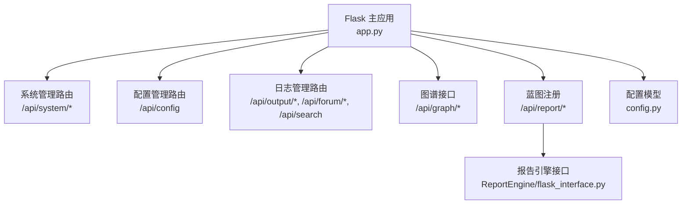
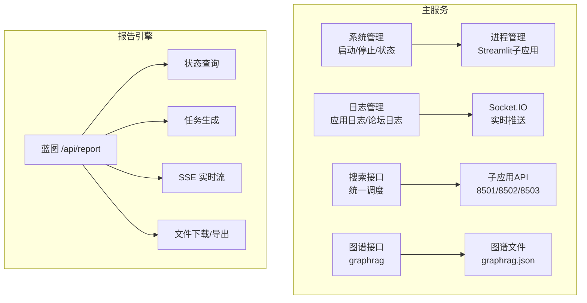
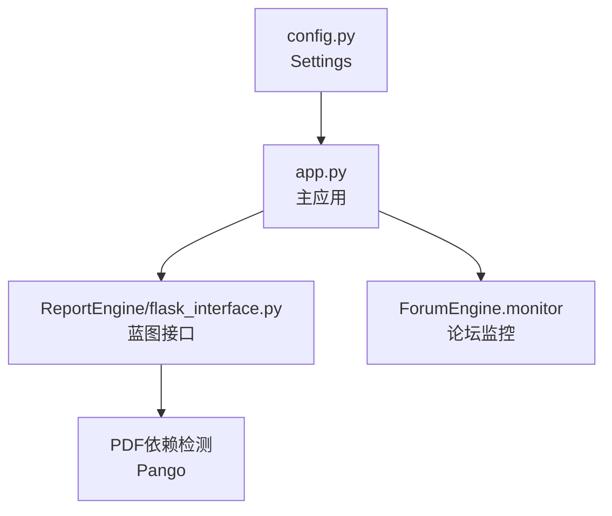

# RESTful API接口

<cite>
**本文档引用的文件**
- [app.py](file://app.py)
- [config.py](file://config.py)
- [ReportEngine/flask_interface.py](file://ReportEngine/flask_interface.py)
</cite>

## 目录
1. [简介](#简介)
2. [项目结构](#项目结构)
3. [核心组件](#核心组件)
4. [架构总览](#架构总览)
5. [详细组件分析](#详细组件分析)
6. [依赖分析](#依赖分析)
7. [性能考虑](#性能考虑)
8. [故障排除指南](#故障排除指南)
9. [结论](#结论)

## 简介
本文件为 BettaFish 系统的 RESTful API 接口文档，覆盖以下核心能力：
- 系统配置管理接口：读取与修改配置
- 系统状态管理接口：启动、停止、健康检查、状态查询
- 日志管理接口：读取应用日志、论坛日志、报告日志
- 报告引擎接口：状态查询、任务生成、SSE 实时流、模板列表、文件下载与导出
- 图谱查询接口：知识图谱数据获取与查询

文档提供各接口的 URL、方法、请求参数、响应格式、状态码、错误处理策略，并给出请求示例与最佳实践。

## 项目结构
BettaFish 采用 Flask 作为主服务，注册多个蓝图与路由：
- 主应用路由集中于 app.py，包含系统管理、日志读取、搜索、图谱接口等
- 报告引擎接口位于 ReportEngine/flask_interface.py，通过蓝图注册到 /api/report 前缀
- 配置模型位于 config.py，使用 Pydantic Settings 管理

图表来源
- [app.py](file://app.py#L41-L84)
- [ReportEngine/flask_interface.py](file://ReportEngine/flask_interface.py#L26-L81)
- [config.py](file://config.py#L17-L21)

章节来源
- [app.py](file://app.py#L41-L84)
- [ReportEngine/flask_interface.py](file://ReportEngine/flask_interface.py#L26-L81)
- [config.py](file://config.py#L17-L21)

## 核心组件
- Flask 主应用与蓝图
  - 主应用 app.py 注册 ReportEngine 蓝图，前缀 /api/report
  - 主应用集中管理系统状态、日志、搜索、图谱等路由
- 配置管理
  - 通过 config.py 的 Settings 模型读取 .env 或环境变量
  - app.py 提供配置读取与写入接口，持久化到 .env
- 报告引擎
  - 提供状态查询、任务生成、SSE 实时流、模板列表、文件下载与导出
  - 使用任务队列与事件历史，支持断线重连与心跳

章节来源
- [app.py](file://app.py#L41-L84)
- [config.py](file://config.py#L23-L136)
- [ReportEngine/flask_interface.py](file://ReportEngine/flask_interface.py#L26-L81)

## 架构总览
系统采用“主服务 + 引擎子系统”的架构：
- 主服务负责统一入口、系统生命周期管理、日志聚合与转发
- 报告引擎独立运行，通过蓝图暴露接口并与主服务协作
- 图谱接口依赖报告引擎生成的图谱文件

图表来源
- [app.py](file://app.py#L509-L521)
- [app.py](file://app.py#L755-L797)
- [ReportEngine/flask_interface.py](file://ReportEngine/flask_interface.py#L578-L703)

## 详细组件分析

### 系统配置管理接口
- GET /api/config
  - 功能：读取当前配置值（仅暴露白名单字段）
  - 请求参数：无
  - 成功响应字段：success、config（键值对）
  - 失败响应字段：success、message
  - 状态码：200、500
  - 示例请求：curl -X GET http://host:port/api/config
  - 示例响应：{"success":true,"config":{"HOST":"0.0.0.0","PORT":5000,...}}
  - 错误处理：读取异常返回 500
- POST /api/config
  - 功能：更新配置并持久化到 .env
  - 请求体字段：任意键值对（仅白名单字段生效）
  - 成功响应字段：success、config（更新后的配置）
  - 失败响应字段：success、message
  - 状态码：200、400、500
  - 示例请求：curl -X POST http://host:port/api/config -H "Content-Type: application/json" -d '{"HOST":"0.0.0.0","PORT":5000}'
  - 示例响应：{"success":true,"config":{"HOST":"0.0.0.0","PORT":5000,...}}
  - 错误处理：请求体为空或无有效字段返回 400；写入异常返回 500

章节来源
- [app.py](file://app.py#L1212-L1244)
- [config.py](file://config.py#L23-L136)

### 系统状态管理接口
- GET /api/system/status
  - 功能：查询系统启动状态
  - 成功响应字段：success、started、starting
  - 状态码：200
- POST /api/system/start
  - 功能：启动完整系统（包含子应用与论坛引擎）
  - 成功响应字段：success、message、logs
  - 失败响应字段：success、message、logs、errors
  - 状态码：200、400、500
- POST /api/system/shutdown
  - 功能：优雅关闭系统
  - 成功响应字段：success、message、ports
  - 状态码：200、400、500

章节来源
- [app.py](file://app.py#L1247-L1284)

### 日志管理接口
- GET /api/output/<app_name>
  - 功能：读取指定应用日志（insight/media/query/forum）
  - 成功响应字段：success、output（数组，每行字符串）
  - 失败响应字段：success、message
  - 状态码：200、400
- GET /api/test_log/<app_name>
  - 功能：向指定应用写入测试日志并推送 Socket.IO
  - 成功响应字段：success、message
  - 状态码：200、400
- GET /api/forum/start
  - 功能：手动启动论坛监控
  - 成功响应字段：success、message
  - 状态码：200、400
- GET /api/forum/stop
  - 功能：手动停止论坛监控
  - 成功响应字段：success、message
  - 状态码：200、400
- GET /api/forum/log
  - 功能：读取论坛日志并解析为对话消息
  - 成功响应字段：success、log_lines、parsed_messages、total_lines
  - 状态码：200、400
- POST /api/forum/log/history
  - 功能：分页读取论坛历史日志
  - 请求体字段：position（起始位置）、max_lines（最大行数）
  - 成功响应字段：success、log_lines、position、has_more
  - 状态码：200、400

章节来源
- [app.py](file://app.py#L1009-L1161)

### 搜索接口
- POST /api/search
  - 功能：统一搜索接口，向运行中的子应用转发查询
  - 请求体字段：query（字符串）
  - 成功响应字段：success、query、results（各子应用结果）
  - 状态码：200、400
  - 注意：若无运行中的应用，返回错误

章节来源
- [app.py](file://app.py#L1163-L1209)

### 图谱接口
- GET /api/graph/<report_id>
  - 功能：获取指定报告的知识图谱数据（Vis.js 格式）
  - 成功响应字段：success、graph（nodes、edges、stats）
  - 状态码：200、404、500
- GET /api/graph/latest
  - 功能：获取最近一次生成的知识图谱数据
  - 成功响应字段：success、report_id、graph
  - 状态码：200、404、500
- POST /api/graph/query
  - 功能：查询知识图谱
  - 请求体字段：report_id（可选）、keywords、node_types、depth、engine_filter
  - 成功响应字段：success、result（matched_*、total_nodes、query_params、summary）
  - 状态码：200、404、500

章节来源
- [app.py](file://app.py#L1331-L1581)

### 报告引擎接口（蓝图 /api/report）
- GET /status
  - 功能：获取报告引擎状态（初始化、引擎就绪、当前任务）
  - 成功响应字段：success、initialized、engines_ready、files_found、missing_files、current_task
  - 状态码：200、500
- POST /generate
  - 功能：开始生成报告（SSE 实时流）
  - 请求体字段：query（可选）、custom_template（可选）
  - 成功响应字段：success、task_id、message、task、stream_url
  - 状态码：200、400、500
- GET /progress/<task_id>
  - 功能：获取任务进度
  - 成功响应字段：success、task
  - 状态码：200、500
- GET /stream/<task_id>
  - 功能：SSE 实时事件流（支持 Last-Event-ID 补发）
  - 成功响应：text/event-stream
  - 状态码：200、404
- GET /templates
  - 功能：获取可用模板列表
  - 成功响应字段：success、templates、template_dir
  - 状态码：200、500
- GET /download/<task_id>
  - 功能：下载HTML报告
  - 成功响应：HTML 文件下载
  - 状态码：200、400、404、500
- GET /export/pdf/<task_id>
  - 功能：导出PDF（基于IR JSON）
  - 查询参数：optimize（是否启用布局优化）
  - 成功响应：PDF 文件下载
  - 状态码：200、400、404、503、500
- POST /export/pdf-from-ir
  - 功能：直接从IR JSON导出PDF
  - 请求体字段：document_ir（必需）、optimize（可选）
  - 成功响应：PDF 文件下载
  - 状态码：200、400、500

章节来源
- [ReportEngine/flask_interface.py](file://ReportEngine/flask_interface.py#L578-L747)
- [ReportEngine/flask_interface.py](file://ReportEngine/flask_interface.py#L750-L803)
- [ReportEngine/flask_interface.py](file://ReportEngine/flask_interface.py#L1037-L1083)
- [ReportEngine/flask_interface.py](file://ReportEngine/flask_interface.py#L940-L985)
- [ReportEngine/flask_interface.py](file://ReportEngine/flask_interface.py#L1290-L1453)

## 依赖分析
- 主应用依赖
  - config.py：提供 Settings 读取与重载
  - ReportEngine/flask_interface.py：蓝图注册与报告引擎接口
  - ForumEngine.monitor：论坛监控启动/停止
- 报告引擎依赖
  - 任务队列与事件历史：支持断线重连与心跳
  - PDF 导出依赖：Pango（系统依赖）

图表来源
- [config.py](file://config.py#L118-L136)
- [app.py](file://app.py#L79-L83)
- [ReportEngine/flask_interface.py](file://ReportEngine/flask_interface.py#L1307-L1317)

章节来源
- [config.py](file://config.py#L118-L136)
- [app.py](file://app.py#L79-L83)
- [ReportEngine/flask_interface.py](file://ReportEngine/flask_interface.py#L1307-L1317)

## 性能考虑
- 日志读取
  - 论坛日志采用分页读取（POST /api/forum/log/history），避免一次性读取大文件
  - 报告日志读取限制最大大小（约10MB），超过则从末尾截取
- SSE 实时流
  - 使用事件队列与历史事件补发，支持 Last-Event-ID
  - 心跳与空闲超时避免孤儿连接
- 健康检查
  - 对子应用端口进行健康检查，避免无效请求
- 并发与锁
  - 任务状态与事件历史使用锁保护，避免竞态

## 故障排除指南
- 配置接口
  - 读取失败：检查 config.py 与 .env 文件权限与格式
  - 更新失败：检查 .env 写入权限与键名合法性
- 系统启动/停止
  - 启动失败：查看 logs 与 errors 字段定位具体子应用
  - 停止卡住：确认子进程是否正常退出，必要时强制结束
- 日志接口
  - 论坛日志为空：确认论坛监控已启动且日志文件存在
  - 应用日志为空：确认子应用已启动并写入日志
- 报告引擎
  - 任务无法生成：检查引擎就绪状态与输入文件
  - PDF 导出失败：确认 Pango 依赖已安装
- 图谱接口
  - 未找到图谱：确认报告已生成并存在 graphrag.json

章节来源
- [app.py](file://app.py#L1266-L1281)
- [ReportEngine/flask_interface.py](file://ReportEngine/flask_interface.py#L1307-L1317)

## 结论
本文档梳理了 BettaFish 的 RESTful API 接口，涵盖配置、系统状态、日志、报告与图谱等核心能力。建议在生产环境中：
- 明确 .env 与环境变量优先级，确保配置一致性
- 使用 SSE 时正确处理 Last-Event-ID 与心跳
- 对大文件日志与PDF导出进行容量与依赖检查
- 通过 /api/system/status 与 /api/report/status 实时监控系统与任务状态