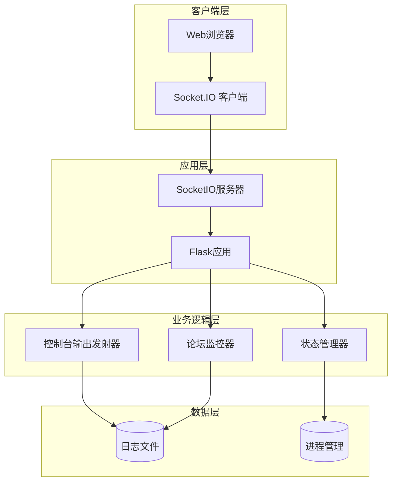
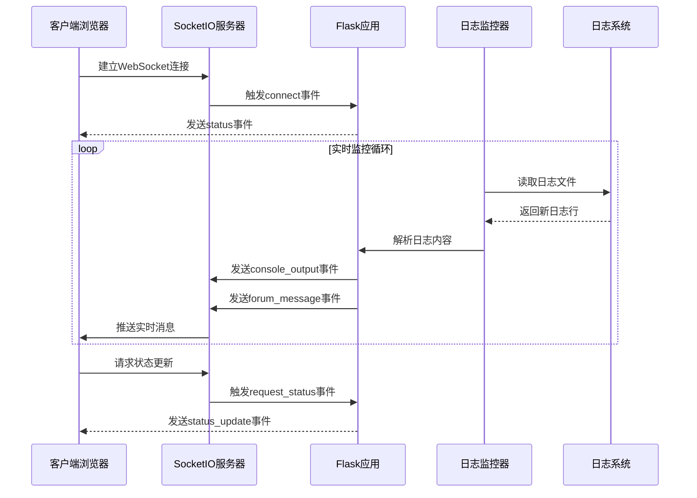
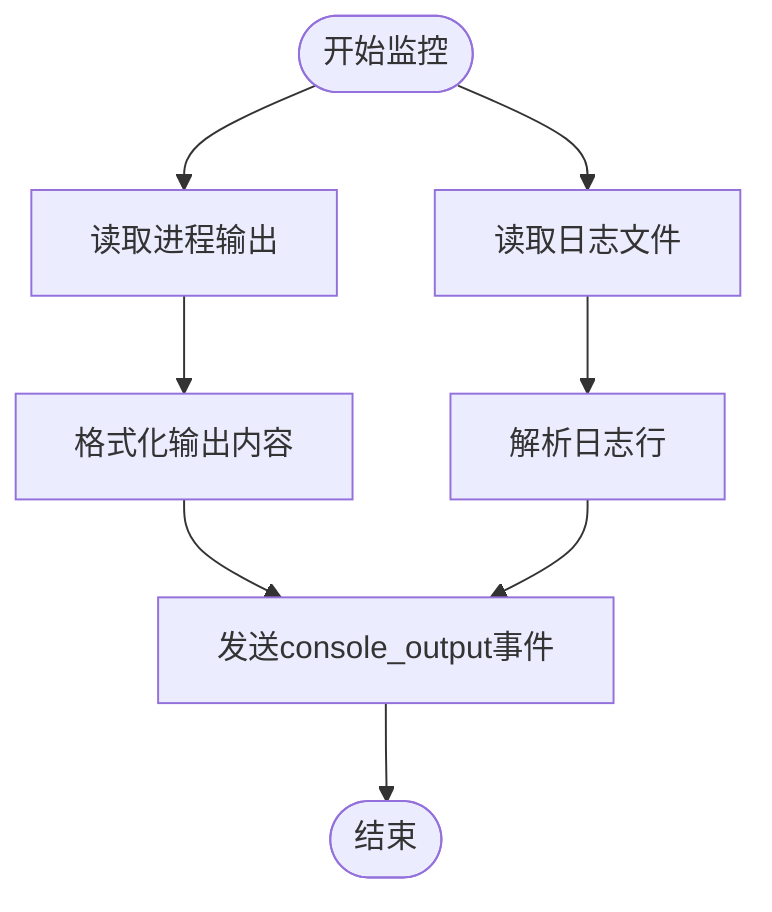
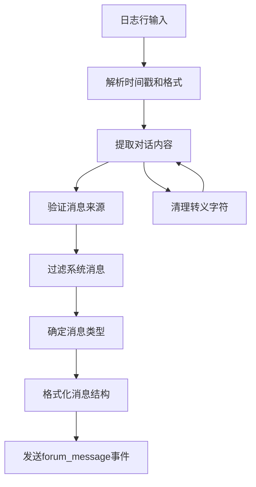
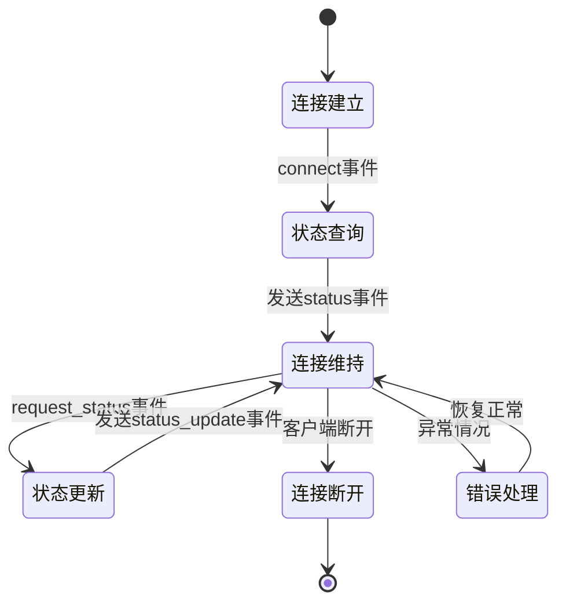
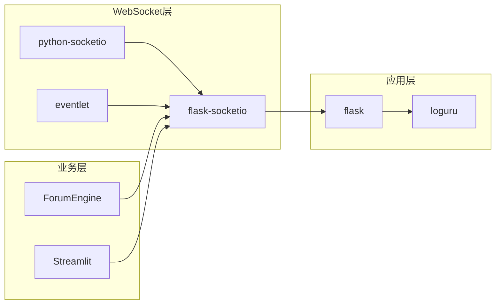
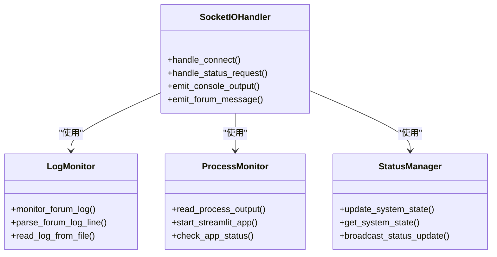

# WebSocket通信协议

<cite>
**本文档引用的文件**
- [app.py](file://app.py)
- [config.py](file://config.py)
- [ForumEngine/monitor.py](file://ForumEngine/monitor.py)
- [templates/index.html](file://templates/index.html)
- [requirements.txt](file://requirements.txt)
</cite>

## 目录
1. [简介](#简介)
2. [项目结构](#项目结构)
3. [核心组件](#核心组件)
4. [架构概览](#架构概览)
5. [详细组件分析](#详细组件分析)
6. [依赖关系分析](#依赖关系分析)
7. [性能考虑](#性能考虑)
8. [故障排除指南](#故障排除指南)
9. [结论](#结论)

## 简介

BettaFish系统采用Flask-SocketIO实现WebSocket实时通信，为用户提供多智能体系统的实时监控和协作功能。系统通过WebSocket实现以下核心功能：

- 实时控制台输出推送（console_output事件）
- 论坛协作消息推送（forum_message事件）
- 系统状态管理和连接生命周期管理
- 多应用进程的实时日志监控

## 项目结构

BettaFish系统的WebSocket通信架构基于Flask框架和SocketIO扩展，采用模块化设计：

**图表来源**
- [app.py](file://app.py#L41-L43)
- [app.py](file://app.py#L1604-L1619)

**章节来源**
- [app.py](file://app.py#L1-L80)
- [requirements.txt](file://requirements.txt#L7-L11)

## 核心组件

### SocketIO服务器配置

系统使用Flask-SocketIO扩展实现WebSocket通信，核心配置包括：

- **服务器实例化**：创建SocketIO实例并与Flask应用绑定
- **跨域配置**：允许所有来源的连接
- **事件处理**：定义连接建立和状态查询事件处理器

### 实时日志监控系统

系统实现了多层日志监控机制：

- **控制台输出监控**：实时读取各应用进程的标准输出
- **论坛日志监控**：监控forum.log文件变化并解析对话内容
- **进程状态监控**：跟踪Streamlit应用的运行状态

### 事件类型定义

系统定义了以下WebSocket事件类型：

1. **console_output**：实时控制台输出事件
2. **forum_message**：论坛协作消息事件  
3. **status**：连接状态事件
4. **status_update**：系统状态更新事件

**章节来源**
- [app.py](file://app.py#L41-L43)
- [app.py](file://app.py#L1604-L1619)

## 架构概览

BettaFish系统的WebSocket通信架构采用分层设计，确保实时性和可靠性：

**图表来源**
- [app.py](file://app.py#L1604-L1619)
- [app.py](file://app.py#L443-L507)
- [app.py](file://app.py#L574-L644)

## 详细组件分析

### 控制台输出事件（console_output）

#### 事件结构定义

控制台输出事件包含以下数据结构：

| 字段名 | 类型 | 描述 | 示例 |
|--------|------|------|------|
| app | string | 应用程序标识 | "insight", "media", "query", "forum" |
| line | string | 控制台输出内容 | "[14:30:25] 应用启动成功" |

#### 实现机制

系统通过两个主要途径产生控制台输出事件：

1. **进程输出监控**：实时读取Streamlit应用的标准输出
2. **日志文件监控**：监控各应用的日志文件变化

**图表来源**
- [app.py](file://app.py#L574-L644)
- [app.py](file://app.py#L443-L507)

#### 数据格式规范

控制台输出遵循以下格式规范：

- **时间戳格式**：HH:mm:ss
- **内容编码**：UTF-8
- **换行符**：\n
- **最大长度**：无限制（建议每行不超过1000字符）

**章节来源**
- [app.py](file://app.py#L574-L644)
- [app.py](file://app.py#L443-L507)

### 论坛协作消息事件（forum_message）

#### 事件结构定义

论坛消息事件包含完整的对话信息结构：

| 字段名 | 类型 | 描述 | 示例 |
|--------|------|------|------|
| type | string | 消息类型 | "agent", "host" |
| sender | string | 发送者标识 | "Query Engine", "Forum Host" |
| content | string | 消息内容 | "分析结果摘要..." |
| timestamp | string | 消息时间戳 | "14:30:25" |
| source | string | 来源标识 | "QUERY", "HOST" |

#### 消息解析流程

系统通过复杂的解析流程处理论坛日志：

**图表来源**
- [app.py](file://app.py#L398-L437)
- [ForumEngine/monitor.py](file://ForumEngine/monitor.py#L106-L122)

#### 消息来源分类

系统支持以下消息来源：

| 来源标识 | 类型 | 发送者 | 描述 |
|----------|------|--------|------|
| QUERY | agent | Query Engine | 查询引擎消息 |
| INSIGHT | agent | Insight Engine | 智能分析引擎消息 |
| MEDIA | agent | Media Engine | 媒体分析引擎消息 |
| HOST | host | Forum Host | 主持人消息 |
| SYSTEM | system | System | 系统消息 |

**章节来源**
- [app.py](file://app.py#L398-L437)
- [ForumEngine/monitor.py](file://ForumEngine/monitor.py#L106-L122)

### 连接状态管理

#### 连接生命周期

系统实现了完整的WebSocket连接生命周期管理：

**图表来源**
- [app.py](file://app.py#L1604-L1619)

#### 系统状态监控

系统实时监控以下状态信息：

- **进程状态**：running, starting, stopped
- **端口状态**：HTTP服务器端口可用性
- **健康检查**：Streamlit应用健康状况
- **内存使用**：系统资源使用情况

**章节来源**
- [app.py](file://app.py#L1604-L1619)
- [app.py](file://app.py#L778-L800)

## 依赖关系分析

### 核心依赖组件

系统WebSocket通信依赖以下关键组件：

**图表来源**
- [requirements.txt](file://requirements.txt#L7-L11)
- [app.py](file://app.py#L19-L25)

### 事件处理流程

系统实现了清晰的事件处理架构：

**图表来源**
- [app.py](file://app.py#L1604-L1619)
- [app.py](file://app.py#L443-L507)
- [app.py](file://app.py#L574-L644)

**章节来源**
- [requirements.txt](file://requirements.txt#L7-L11)
- [app.py](file://app.py#L1604-L1619)

## 性能考虑

### 实时性优化

系统采用了多项优化措施确保实时性能：

- **非阻塞I/O**：使用eventlet提供异步I/O支持
- **内存映射**：日志文件监控使用高效的文件位置跟踪
- **去重机制**：防止重复消息的发送和处理
- **批量处理**：合并多个日志行的处理和发送

### 资源管理

系统实施了严格的资源管理策略：

- **连接池管理**：限制同时连接数量
- **内存泄漏防护**：定期清理哈希表和事件队列
- **文件句柄管理**：正确关闭和重用文件句柄
- **线程安全**：使用锁保护共享资源

## 故障排除指南

### 常见连接问题

| 问题症状 | 可能原因 | 解决方案 |
|----------|----------|----------|
| 连接超时 | 网络延迟或防火墙 | 检查网络连接和防火墙设置 |
| 连接断开 | 客户端主动断开 | 实现重连机制和断线恢复 |
| 事件丢失 | 网络不稳定 | 使用Socket.IO的重连和确认机制 |
| 内存泄漏 | 事件监听器未清理 | 确保正确移除事件处理器 |

### 日志监控问题

| 问题症状 | 可能原因 | 解决方案 |
|----------|----------|----------|
| 日志不更新 | 文件权限问题 | 检查日志文件读取权限 |
| 消息重复 | 去重机制失效 | 检查processed_lines集合管理 |
| 解析失败 | 日志格式变化 | 更新日志解析正则表达式 |
| 性能下降 | 监控频率过高 | 调整监控间隔和批处理大小 |

### 状态同步问题

系统实现了完善的错误处理机制：

- **异常捕获**：所有异步操作都包含异常处理
- **状态恢复**：自动恢复到一致的状态
- **日志记录**：详细的错误日志便于诊断
- **优雅降级**：部分功能失效时保持核心功能

**章节来源**
- [app.py](file://app.py#L45-L75)
- [app.py](file://app.py#L500-L504)

## 结论

BettaFish系统的WebSocket通信协议设计合理，实现了高效、可靠的实时通信。系统通过精心设计的事件架构、完善的状态管理和健壮的错误处理机制，为用户提供了流畅的多智能体协作体验。

### 主要优势

1. **实时性强**：采用Socket.IO实现实时双向通信
2. **扩展性好**：模块化设计支持功能扩展
3. **稳定性高**：完善的错误处理和恢复机制
4. **性能优异**：优化的I/O处理和资源管理

### 技术特点

- 基于Flask-SocketIO的成熟技术栈
- 支持多应用进程的统一监控
- 完整的消息格式标准化
- 丰富的状态管理和错误处理

该协议为BettaFish系统的实时监控和协作功能奠定了坚实的技术基础，为后续的功能扩展和性能优化提供了良好的架构支撑。