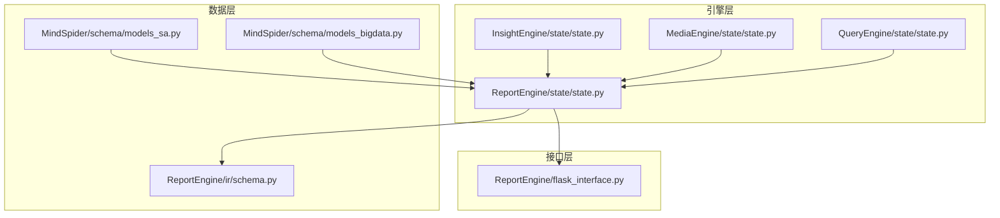
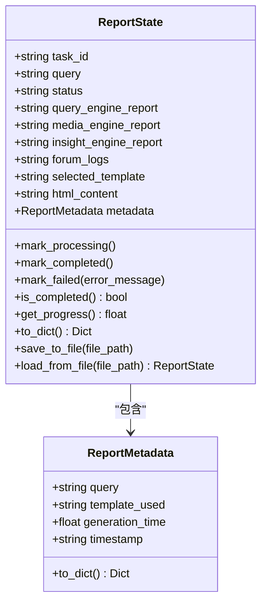
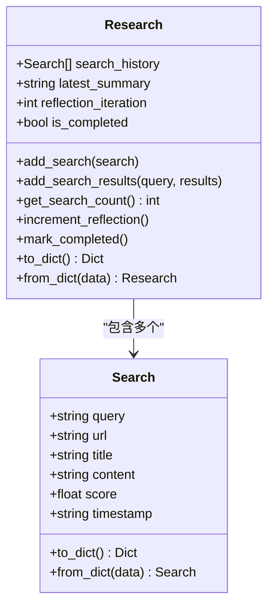
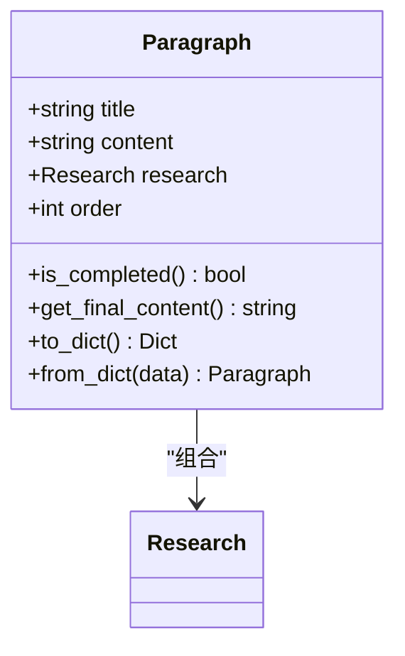
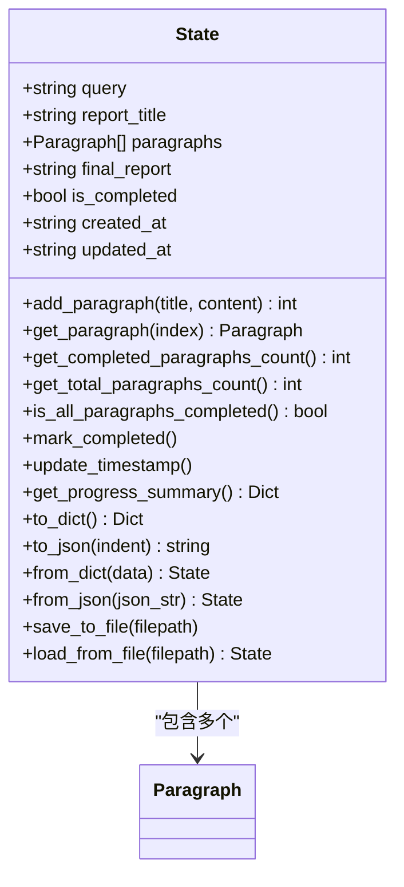
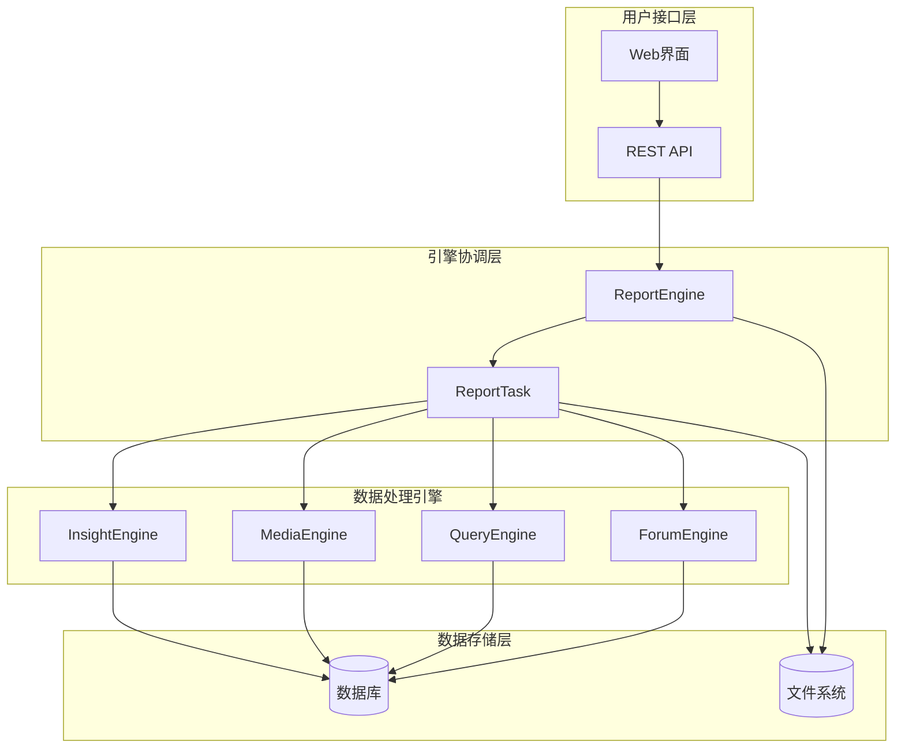
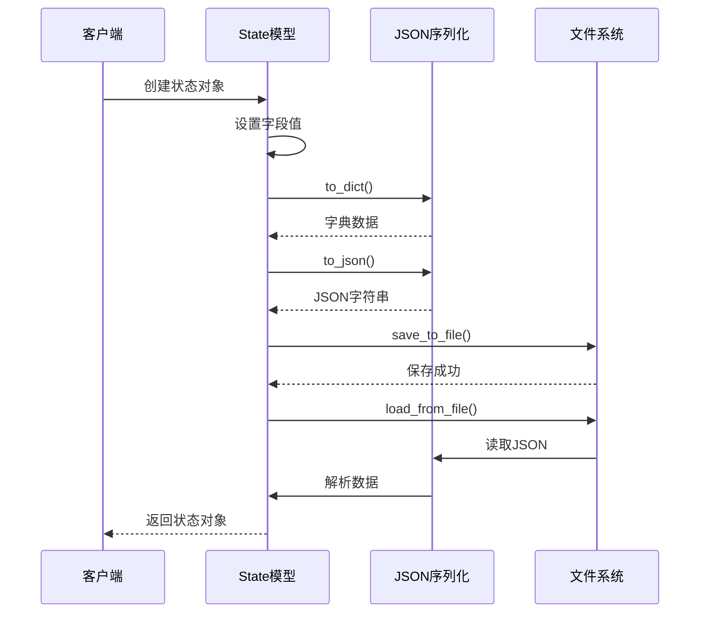
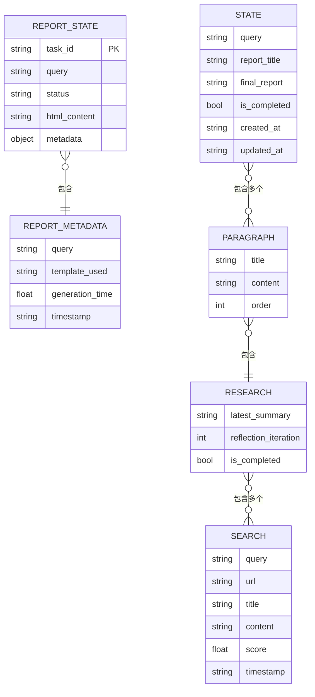
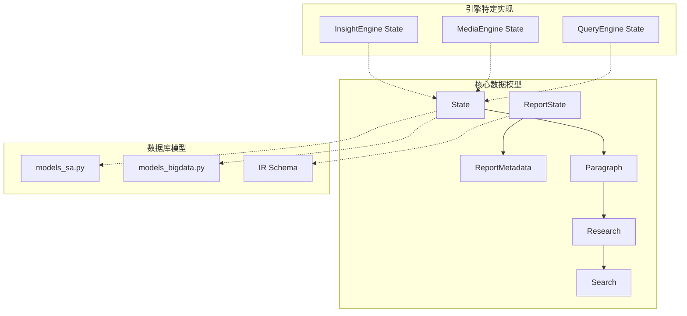

# 数据模型定义

<cite>
**本文档引用的文件**
- [InsightEngine/state/state.py](file://InsightEngine/state/state.py)
- [QueryEngine/state/state.py](file://QueryEngine/state/state.py)
- [MediaEngine/state/state.py](file://MediaEngine/state/state.py)
- [ReportEngine/state/state.py](file://ReportEngine/state/state.py)
- [ReportEngine/ir/schema.py](file://ReportEngine/ir/schema.py)
- [MindSpider/schema/models_sa.py](file://MindSpider/schema/models_sa.py)
- [MindSpider/schema/models_bigdata.py](file://MindSpider/schema/models_bigdata.py)
- [ReportEngine/flask_interface.py](file://ReportEngine/flask_interface.py)
</cite>

## 目录
1. [简介](#简介)
2. [项目结构](#项目结构)
3. [核心数据模型](#核心数据模型)
4. [架构概览](#架构概览)
5. [详细组件分析](#详细组件分析)
6. [依赖关系分析](#依赖关系分析)
7. [性能考虑](#性能考虑)
8. [故障排除指南](#故障排除指南)
9. [结论](#结论)

## 简介

BettaFish系统是一个多引擎协作的智能报告生成平台，包含InsightEngine、MediaEngine、QueryEngine和ReportEngine四个核心引擎。本文档详细定义了系统中的所有核心数据模型，包括报告状态模型、数据库响应模型、段落结构模型和研究过程状态模型等。

系统采用数据类（dataclasses）设计，提供了完整的序列化和反序列化机制，支持JSON格式的数据交换。每个引擎都有独立的状态管理模型，但遵循统一的数据结构规范。

## 项目结构

BettaFish系统采用模块化架构，每个引擎都有独立的状态管理模块：

**图表来源**
- [InsightEngine/state/state.py](file://InsightEngine/state/state.py#L1-L259)
- [MediaEngine/state/state.py](file://MediaEngine/state/state.py#L1-L293)
- [QueryEngine/state/state.py](file://QueryEngine/state/state.py#L1-L259)
- [ReportEngine/state/state.py](file://ReportEngine/state/state.py#L1-L143)
- [ReportEngine/ir/schema.py](file://ReportEngine/ir/schema.py#L1-L546)

**章节来源**
- [InsightEngine/state/state.py](file://InsightEngine/state/state.py#L1-L259)
- [MediaEngine/state/state.py](file://MediaEngine/state/state.py#L1-L293)
- [QueryEngine/state/state.py](file://QueryEngine/state/state.py#L1-L259)
- [ReportEngine/state/state.py](file://ReportEngine/state/state.py#L1-L143)

## 核心数据模型

### ReportState 报告状态模型

ReportState是ReportEngine的核心状态管理模型，用于跟踪报告生成任务的完整生命周期。

**图表来源**
- [ReportEngine/state/state.py](file://ReportEngine/state/state.py#L30-L143)

**字段定义与约束**：
- `task_id`: 任务唯一标识符，自动生成
- `query`: 用户查询语句，必填
- `status`: 任务状态，枚举值：pending、processing、completed、failed
- `html_content`: 最终HTML内容，完成后必填
- `metadata`: 报告元数据，包含查询、模板使用情况和生成时间

**数据类型与验证规则**：
- 字符串字段：UTF-8编码，长度限制由具体使用场景决定
- 数值字段：浮点数精度为小数点后2位
- 状态字段：严格枚举验证
- 序列化：支持JSON格式，排除大型HTML内容以控制文件大小

### Research 研究过程状态模型

Research模型跟踪单个段落的研究过程，包含搜索历史和总结信息。

**图表来源**
- [InsightEngine/state/state.py](file://InsightEngine/state/state.py#L47-L100)
- [MediaEngine/state/state.py](file://MediaEngine/state/state.py#L56-L134)

**字段定义与约束**：
- `search_history`: 搜索历史记录列表，支持多次搜索
- `latest_summary`: 当前段落的最新总结，完成后必填
- `reflection_iteration`: 反思迭代次数，用于控制生成质量
- `is_completed`: 完成标志，标记研究过程结束

**数据类型与验证规则**：
- `score`: 浮点数，范围0-1之间
- `timestamp`: ISO 8601格式的时间戳
- `reflection_iteration`: 非负整数

### Paragraph 段落结构模型

Paragraph模型定义报告中单个段落的状态和内容。

**图表来源**
- [InsightEngine/state/state.py](file://InsightEngine/state/state.py#L103-L139)
- [MediaEngine/state/state.py](file://MediaEngine/state/state.py#L137-L173)

**字段定义与约束**：
- `title`: 段落标题，必填
- `content`: 预期内容，初始规划阶段使用
- `research`: 研究进度对象，组合关系
- `order`: 段落顺序，用于确定报告结构

**业务约束**：
- `is_completed()`方法检查研究是否完成且有最新总结
- `get_final_content()`优先返回最新总结，否则返回预期内容

### State 报告状态模型

State模型管理整个报告的状态，包含多个段落和最终报告内容。

**图表来源**
- [InsightEngine/state/state.py](file://InsightEngine/state/state.py#L142-L259)
- [MediaEngine/state/state.py](file://MediaEngine/state/state.py#L176-L293)

**字段定义与约束**：
- `query`: 原始查询语句
- `report_title`: 报告标题
- `paragraphs`: 段落列表，支持动态添加
- `final_report`: 最终生成的完整报告内容
- `is_completed`: 整体完成标志

**业务逻辑**：
- 自动更新时间戳
- 提供进度统计功能
- 支持完整的序列化/反序列化

## 架构概览

系统采用分层架构，各引擎独立运行并通过ReportEngine进行协调：

**图表来源**
- [ReportEngine/flask_interface.py](file://ReportEngine/flask_interface.py#L274-L405)

## 详细组件分析

### 数据序列化与反序列化

所有核心数据模型都实现了完整的序列化机制：

**图表来源**
- [InsightEngine/state/state.py](file://InsightEngine/state/state.py#L211-L259)
- [ReportEngine/state/state.py](file://ReportEngine/state/state.py#L93-L143)

### 数据模型关系图

**图表来源**
- [ReportEngine/state/state.py](file://ReportEngine/state/state.py#L30-L143)
- [InsightEngine/state/state.py](file://InsightEngine/state/state.py#L142-L259)

### 数据流转说明

系统中的数据流转遵循以下模式：

1. **引擎生成阶段**：各引擎生成独立的报告内容
2. **状态收集阶段**：ReportEngine收集各引擎状态
3. **内容整合阶段**：合并多个报告源的内容
4. **模板应用阶段**：应用选择的报告模板
5. **输出生成阶段**：生成最终的HTML/PDF报告

**章节来源**
- [ReportEngine/flask_interface.py](file://ReportEngine/flask_interface.py#L436-L576)

## 依赖关系分析

系统中的依赖关系主要体现在数据模型的继承和组合关系上：

**图表来源**
- [InsightEngine/state/state.py](file://InsightEngine/state/state.py#L1-L259)
- [MediaEngine/state/state.py](file://MediaEngine/state/state.py#L1-L293)
- [QueryEngine/state/state.py](file://QueryEngine/state/state.py#L1-L259)
- [MindSpider/schema/models_sa.py](file://MindSpider/schema/models_sa.py#L1-L127)
- [MindSpider/schema/models_bigdata.py](file://MindSpider/schema/models_bigdata.py#L1-L468)
- [ReportEngine/ir/schema.py](file://ReportEngine/ir/schema.py#L1-L546)

**章节来源**
- [MindSpider/schema/models_sa.py](file://MindSpider/schema/models_sa.py#L1-L127)
- [MindSpider/schema/models_bigdata.py](file://MindSpider/schema/models_bigdata.py#L1-L468)

## 性能考虑

### 序列化优化

1. **ReportState文件保存优化**：自动排除大型HTML内容以控制文件大小
2. **增量序列化**：支持部分字段的序列化，减少I/O开销
3. **内存管理**：使用dataclasses减少内存占用

### 数据库模型优化

1. **索引设计**：为常用查询字段建立索引
2. **唯一约束**：防止重复数据
3. **外键关系**：维护数据完整性

## 故障排除指南

### 常见问题与解决方案

1. **状态序列化失败**
   - 检查JSON序列化兼容性
   - 验证字段类型和格式
   - 确认编码设置为UTF-8

2. **数据库连接问题**
   - 验证数据库配置参数
   - 检查网络连接状态
   - 确认权限设置正确

3. **引擎间通信问题**
   - 检查文件系统权限
   - 验证路径配置正确性
   - 确认文件格式符合预期

**章节来源**
- [ReportEngine/state/state.py](file://ReportEngine/state/state.py#L106-L143)
- [InsightEngine/state/state.py](file://InsightEngine/state/state.py#L248-L259)

## 结论

BettaFish系统的数据模型设计体现了良好的软件工程实践，具有以下特点：

1. **模块化设计**：每个引擎都有独立的状态管理，便于维护和扩展
2. **标准化接口**：统一的数据结构和序列化机制
3. **强类型约束**：严格的字段类型和验证规则
4. **可扩展性**：支持新的数据模型和业务需求
5. **性能优化**：合理的数据结构设计和序列化策略

这些数据模型为系统的稳定运行和后续功能扩展奠定了坚实的基础。