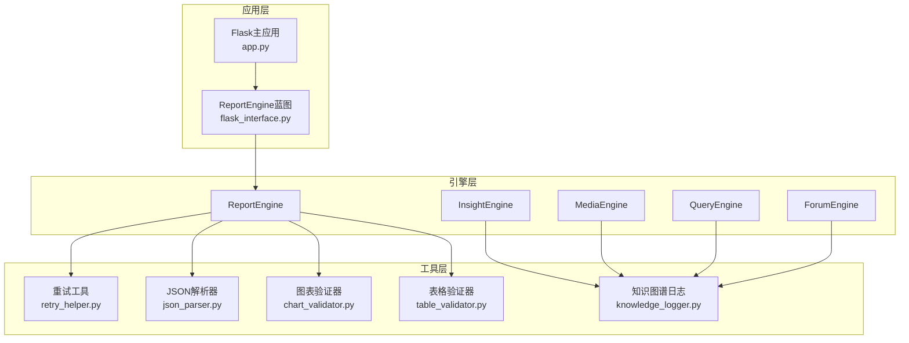
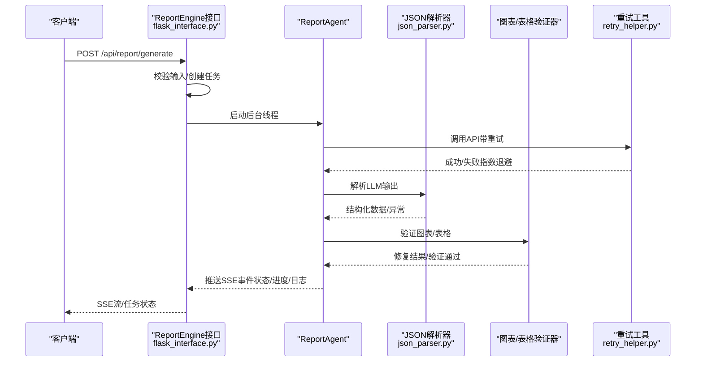
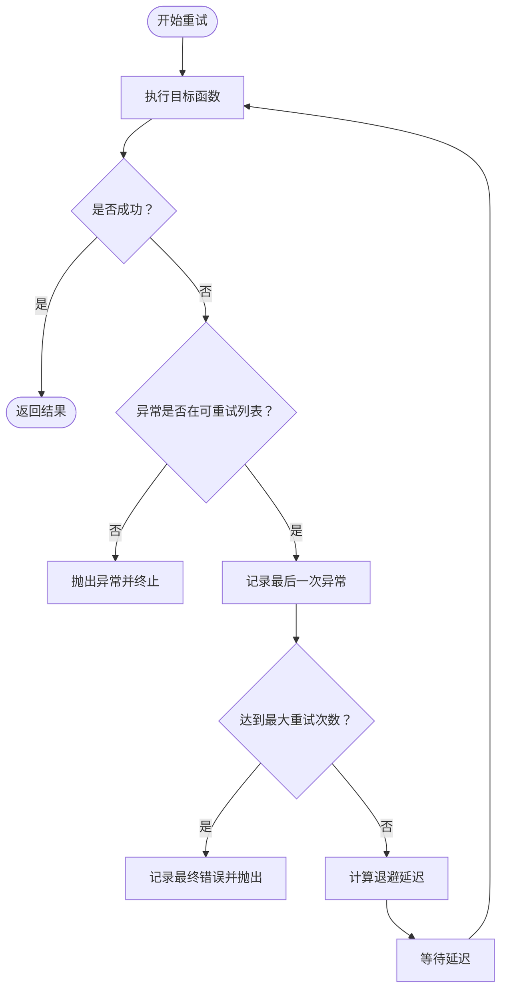
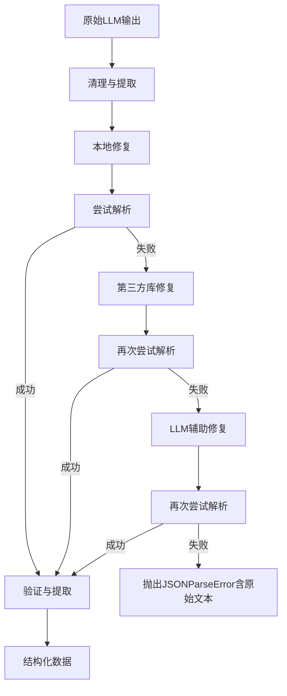
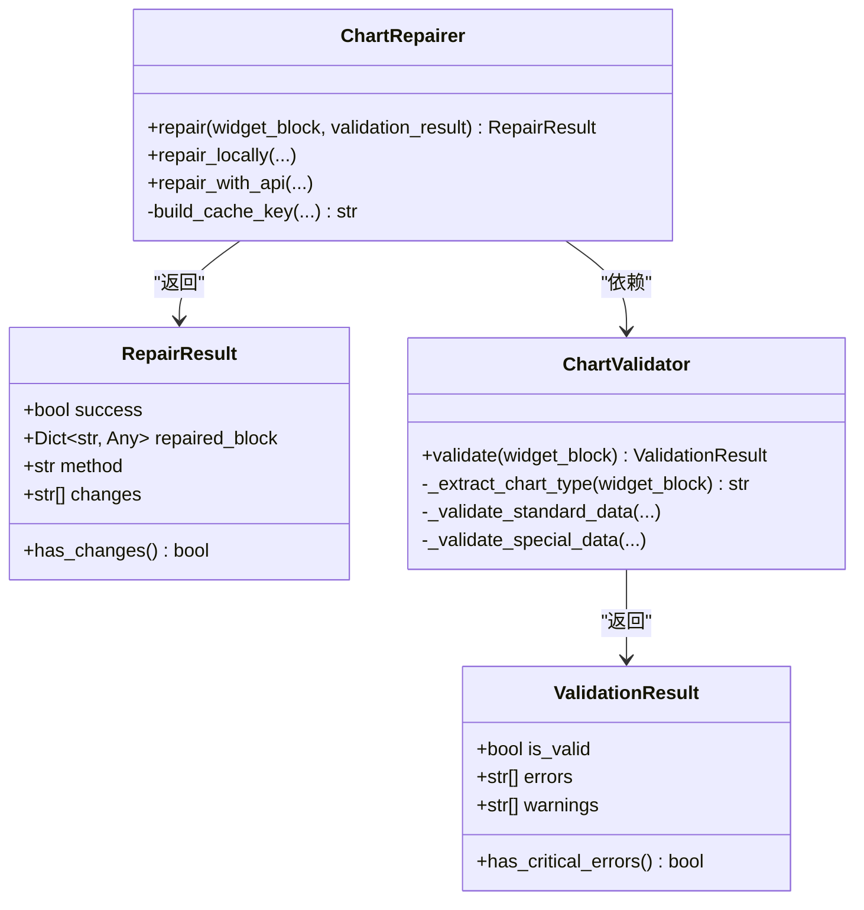
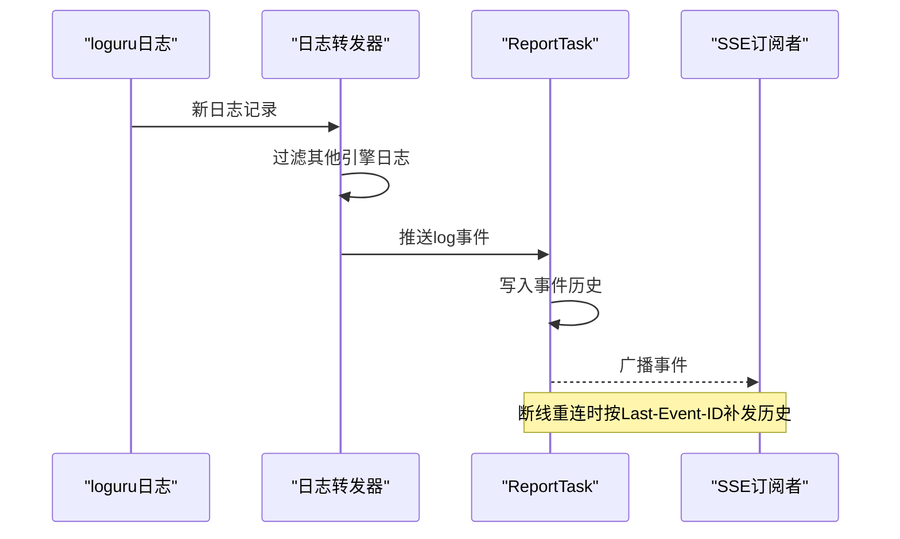
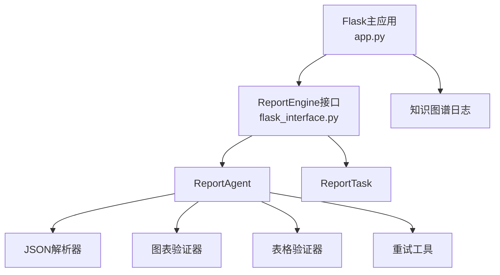

# 错误处理机制

<cite>
**本文档引用的文件**
- [utils/retry_helper.py](file://utils/retry_helper.py)
- [ReportEngine/utils/json_parser.py](file://ReportEngine/utils/json_parser.py)
- [ReportEngine/utils/chart_validator.py](file://ReportEngine/utils/chart_validator.py)
- [ReportEngine/utils/table_validator.py](file://ReportEngine/utils/table_validator.py)
- [ReportEngine/flask_interface.py](file://ReportEngine/flask_interface.py)
- [app.py](file://app.py)
- [utils/knowledge_logger.py](file://utils/knowledge_logger.py)
- [config.py](file://config.py)
- [tests/test_monitor.py](file://tests/test_monitor.py)
</cite>

## 目录
1. [简介](#简介)
2. [项目结构](#项目结构)
3. [核心组件](#核心组件)
4. [架构总览](#架构总览)
5. [详细组件分析](#详细组件分析)
6. [依赖关系分析](#依赖关系分析)
7. [性能考虑](#性能考虑)
8. [故障排除指南](#故障排除指南)
9. [结论](#结论)

## 简介
本文件系统性梳理BettaFish系统的错误处理与故障排除机制，涵盖错误分类、重试策略、日志记录、异常传播与恢复、以及针对网络连接、API调用失败、文件读写错误等典型场景的处理方法。文档旨在帮助开发者与运维人员快速定位问题、理解系统行为，并提供可操作的调试与优化建议。

## 项目结构
BettaFish采用多引擎协同架构，ReportEngine提供统一的Flask接口，负责任务编排、流式事件推送与日志转发；各子引擎（Insight/Media/Query）通过日志文件向论坛引擎传递结构化输出；系统通过重试工具、鲁棒JSON解析器、图表/表格验证器保障数据质量与稳定性。

**图表来源**
- [app.py](file://app.py#L41-L84)
- [ReportEngine/flask_interface.py](file://ReportEngine/flask_interface.py#L26-L46)
- [utils/retry_helper.py](file://utils/retry_helper.py#L57-L112)
- [ReportEngine/utils/json_parser.py](file://ReportEngine/utils/json_parser.py#L40-L50)
- [ReportEngine/utils/chart_validator.py](file://ReportEngine/utils/chart_validator.py#L57-L67)
- [ReportEngine/utils/table_validator.py](file://ReportEngine/utils/table_validator.py#L47-L57)
- [utils/knowledge_logger.py](file://utils/knowledge_logger.py#L15-L18)

**章节来源**
- [app.py](file://app.py#L41-L84)
- [ReportEngine/flask_interface.py](file://ReportEngine/flask_interface.py#L26-L46)

## 核心组件
- 重试机制工具：提供统一的指数退避重试、可配置异常类型、优雅降级返回等能力，覆盖网络请求、数据库访问、LLM调用等场景。
- 鲁棒JSON解析器：针对LLM输出的不规范JSON提供多阶段修复策略（清理、本地修复、第三方库修复、LLM辅助修复），并输出详细错误上下文。
- 图表/表格验证器：对Chart.js图表与IR表格数据进行结构与语义验证，提供本地修复与API辅助修复能力。
- 日志与事件系统：统一日志格式、过滤无关引擎日志、SSE事件流、任务状态管理与历史事件补发。
- 配置与环境：基于Pydantic Settings的配置加载与热重载，支持.env与环境变量。

**章节来源**
- [utils/retry_helper.py](file://utils/retry_helper.py#L13-L55)
- [ReportEngine/utils/json_parser.py](file://ReportEngine/utils/json_parser.py#L25-L38)
- [ReportEngine/utils/chart_validator.py](file://ReportEngine/utils/chart_validator.py#L32-L51)
- [ReportEngine/utils/table_validator.py](file://ReportEngine/utils/table_validator.py#L20-L41)
- [ReportEngine/flask_interface.py](file://ReportEngine/flask_interface.py#L112-L123)
- [config.py](file://config.py#L23-L115)

## 架构总览
系统通过Flask蓝图暴露ReportEngine接口，任务在后台线程执行，期间通过SSE向客户端推送状态、进度与日志事件。ReportEngine内部串联各子引擎输出，使用鲁棒解析器与验证器确保数据质量，并在必要时触发重试或降级策略。

**图表来源**
- [ReportEngine/flask_interface.py](file://ReportEngine/flask_interface.py#L605-L703)
- [ReportEngine/flask_interface.py](file://ReportEngine/flask_interface.py#L436-L576)
- [utils/retry_helper.py](file://utils/retry_helper.py#L57-L112)
- [ReportEngine/utils/json_parser.py](file://ReportEngine/utils/json_parser.py#L86-L164)
- [ReportEngine/utils/chart_validator.py](file://ReportEngine/utils/chart_validator.py#L366-L500)
- [ReportEngine/utils/table_validator.py](file://ReportEngine/utils/table_validator.py#L301-L375)

## 详细组件分析

### 重试机制（网络/数据库/LLM）
- 配置项：最大重试次数、初始延迟、退避因子、最大延迟、需重试的异常类型集合。
- 策略：指数退避，支持“优雅重试”（失败返回默认值而非抛出异常），适用于非关键API。
- 预置配置：LLM_RETRY_CONFIG、SEARCH_API_RETRY_CONFIG、DB_RETRY_CONFIG，分别面向不同场景优化延迟与上限。
- 异常分类：默认包含网络相关异常（连接、超时、HTTP错误、TooManyRedirects）、连接超时、通用异常等。

**图表来源**
- [utils/retry_helper.py](file://utils/retry_helper.py#L70-L112)
- [utils/retry_helper.py](file://utils/retry_helper.py#L141-L199)

**章节来源**
- [utils/retry_helper.py](file://utils/retry_helper.py#L13-L55)
- [utils/retry_helper.py](file://utils/retry_helper.py#L227-L247)

### 鲁棒JSON解析器（LLM输出修复）
- 多阶段修复策略：
  1) 清理markdown包裹与思考内容
  2) 本地修复（括号平衡、逗号补全、控制字符转义、尾随逗号移除、数组扁平化）
  3) 第三方库修复（json_repair）
  4) LLM辅助修复（可选）
- 验证与恢复：提取包裹键、数组最佳匹配、键别名映射、缺失键恢复。
- 异常设计：JSONParseError携带原始文本，便于定位问题。

**图表来源**
- [ReportEngine/utils/json_parser.py](file://ReportEngine/utils/json_parser.py#L86-L164)
- [ReportEngine/utils/json_parser.py](file://ReportEngine/utils/json_parser.py#L290-L341)
- [ReportEngine/utils/json_parser.py](file://ReportEngine/utils/json_parser.py#L598-L647)

**章节来源**
- [ReportEngine/utils/json_parser.py](file://ReportEngine/utils/json_parser.py#L25-L38)
- [ReportEngine/utils/json_parser.py](file://ReportEngine/utils/json_parser.py#L40-L85)

### 图表验证与修复（Chart.js）
- 验证范围：widgetType、props.type、data结构、labels/datasets一致性、数值类型、特殊数据格式（scatter/bubble）。
- 修复策略：本地规则修复（补全字段、构造datasets、生成默认labels、数据类型转换、长度对齐）、API修复（多Engine LLM）。
- 结果缓存：避免重复调用LLM，提升性能。

**图表来源**
- [ReportEngine/utils/chart_validator.py](file://ReportEngine/utils/chart_validator.py#L32-L51)
- [ReportEngine/utils/chart_validator.py](file://ReportEngine/utils/chart_validator.py#L57-L169)
- [ReportEngine/utils/chart_validator.py](file://ReportEngine/utils/chart_validator.py#L366-L500)

**章节来源**
- [ReportEngine/utils/chart_validator.py](file://ReportEngine/utils/chart_validator.py#L57-L91)

### 表格验证与修复（IR表格）
- 验证范围：type字段、rows/cells结构、嵌套cells检测、列数一致性、空单元格统计。
- 修复策略：展平嵌套结构、补全blocks、规范化单元格、默认内容填充。
- 快速判断：can_render提供快速有效性检查。

**章节来源**
- [ReportEngine/utils/table_validator.py](file://ReportEngine/utils/table_validator.py#L47-L57)
- [ReportEngine/utils/table_validator.py](file://ReportEngine/utils/table_validator.py#L301-L375)

### 日志与事件系统（SSE/任务状态）
- 日志转发：过滤其他引擎日志，仅转发ReportEngine相关日志到SSE。
- 任务管理：ReportTask维护状态、进度、事件历史、SSE事件广播与历史补发。
- 异常处理：生成过程异常统一上报并标记任务状态为error，清理当前任务引用。

**图表来源**
- [ReportEngine/flask_interface.py](file://ReportEngine/flask_interface.py#L74-L110)
- [ReportEngine/flask_interface.py](file://ReportEngine/flask_interface.py#L274-L405)

**章节来源**
- [ReportEngine/flask_interface.py](file://ReportEngine/flask_interface.py#L48-L71)
- [ReportEngine/flask_interface.py](file://ReportEngine/flask_interface.py#L274-L390)

### 配置与环境（Pydantic Settings）
- 自动加载：优先当前工作目录.env，其次项目根目录.env。
- 热重载：reload_settings重新加载配置，支持运行时动态更新。
- 关键配置：数据库、LLM API密钥与BaseURL、搜索引擎、GraphRAG开关等。

**章节来源**
- [config.py](file://config.py#L17-L21)
- [config.py](file://config.py#L122-L135)

## 依赖关系分析
- ReportEngine接口依赖ReportAgent与各类验证/解析工具。
- 重试工具被广泛用于网络请求与API调用，降低瞬时故障影响。
- 日志系统通过钩子与过滤器实现跨引擎日志隔离与SSE事件推送。
- 配置系统为各组件提供统一的运行时参数来源。

**图表来源**
- [ReportEngine/flask_interface.py](file://ReportEngine/flask_interface.py#L246-L271)
- [utils/retry_helper.py](file://utils/retry_helper.py#L57-L112)
- [utils/knowledge_logger.py](file://utils/knowledge_logger.py#L15-L18)
- [app.py](file://app.py#L41-L84)

**章节来源**
- [ReportEngine/flask_interface.py](file://ReportEngine/flask_interface.py#L246-L271)
- [utils/retry_helper.py](file://utils/retry_helper.py#L57-L112)
- [utils/knowledge_logger.py](file://utils/knowledge_logger.py#L15-L18)
- [app.py](file://app.py#L41-L84)

## 性能考虑
- 事件历史限制：ReportEngine接口使用有界deque缓存最近事件，避免长时间运行占用内存。
- 日志转发优化：过滤无关引擎日志，减少SSE事件数量与前端压力。
- 修复策略优先级：优先本地修复与第三方库修复，避免不必要的LLM调用。
- 重试退避：指数退避配合最大延迟，平衡恢复速度与系统压力。
- 缓存与去重：图表修复器缓存修复结果，避免重复调用LLM。

**章节来源**
- [ReportEngine/flask_interface.py](file://ReportEngine/flask_interface.py#L34-L43)
- [ReportEngine/flask_interface.py](file://ReportEngine/flask_interface.py#L180-L195)
- [ReportEngine/utils/chart_validator.py](file://ReportEngine/utils/chart_validator.py#L393-L413)

## 故障排除指南

### 通用排查步骤
- 检查ReportEngine初始化状态与依赖检测结果。
- 查看SSE事件流中的状态、进度与日志，确认任务生命周期。
- 核对.env与配置热重载是否生效，关注数据库与API密钥配置。
- 检查日志文件（logs/）与知识图谱日志（logs/knowledge_query.log）是否可写。

**章节来源**
- [ReportEngine/flask_interface.py](file://ReportEngine/flask_interface.py#L246-L271)
- [app.py](file://app.py#L34-L39)
- [utils/knowledge_logger.py](file://utils/knowledge_logger.py#L60-L76)

### 网络连接错误
- 现象：API调用失败、超时、连接中断。
- 处理：使用重试装饰器（with_retry、retry_on_network_error、with_graceful_retry），配置合适的max_retries、initial_delay、backoff_factor与max_delay。
- 建议：对关键API使用指数退避，对非关键API使用优雅重试返回默认值。

**章节来源**
- [utils/retry_helper.py](file://utils/retry_helper.py#L57-L112)
- [utils/retry_helper.py](file://utils/retry_helper.py#L141-L199)
- [utils/retry_helper.py](file://utils/retry_helper.py#L227-L247)

### API调用失败（LLM/搜索引擎）
- 现象：LLM返回不规范JSON、图表/表格数据结构异常。
- 处理：使用鲁棒JSON解析器进行多阶段修复；图表/表格验证器进行结构验证与本地修复；必要时调用LLM辅助修复。
- 建议：为不同场景选择合适重试配置（LLM_RETRY_CONFIG、SEARCH_API_RETRY_CONFIG），并监控错误日志定位根本原因。

**章节来源**
- [ReportEngine/utils/json_parser.py](file://ReportEngine/utils/json_parser.py#L86-L164)
- [ReportEngine/utils/chart_validator.py](file://ReportEngine/utils/chart_validator.py#L415-L500)
- [ReportEngine/utils/table_validator.py](file://ReportEngine/utils/table_validator.py#L321-L375)

### 文件读写错误
- 现象：日志文件无法写入、知识图谱日志初始化失败。
- 处理：检查日志目录权限与磁盘空间；初始化日志文件时进行可写性验证；知识图谱日志写入失败时记录警告但不中断主流程。
- 建议：确保logs目录存在且具备写权限；在容器/CI环境中明确卷挂载与权限。

**章节来源**
- [app.py](file://app.py#L546-L572)
- [utils/knowledge_logger.py](file://utils/knowledge_logger.py#L60-L95)

### JSON解析失败
- 现象：LLM输出包含思考内容、代码块标记、语法错误或不完整结构。
- 处理：鲁棒解析器自动清理与修复，若仍失败则抛出JSONParseError并附带原始文本，便于定位。
- 建议：在上游增加输出约束（如要求JSON包裹、禁用思考内容），或提高LLM上下文与算力。

**章节来源**
- [ReportEngine/utils/json_parser.py](file://ReportEngine/utils/json_parser.py#L86-L164)

### 图表/表格渲染失败
- 现象：labels缺失、datasets长度不匹配、数值类型错误、嵌套结构异常。
- 处理：验证器输出详细错误与警告；本地修复器自动补全字段、构造数据、类型转换；必要时调用LLM修复。
- 建议：在数据生成阶段严格遵循schema，减少下游修复成本。

**章节来源**
- [ReportEngine/utils/chart_validator.py](file://ReportEngine/utils/chart_validator.py#L203-L291)
- [ReportEngine/utils/table_validator.py](file://ReportEngine/utils/table_validator.py#L153-L272)

### 论坛日志解析异常
- 现象：日志格式变化、错误日志混入、SearchNode输出误捕获。
- 处理：LogMonitor过滤非目标节点与错误日志，优先提取updated_paragraph_latest_state或paragraph_latest_state，支持旧/新格式与混合场景。
- 建议：统一日志格式与节点标识，避免无关输出进入论坛。

**章节来源**
- [tests/test_monitor.py](file://tests/test_monitor.py#L246-L281)
- [tests/test_monitor.py](file://tests/test_monitor.py#L297-L327)

### 调试技巧与日志分析
- 使用SSE事件流观察任务状态与进度，结合Last-Event-ID进行断线重连。
- 在ReportEngine接口中开启日志转发，过滤无关引擎日志，聚焦关键事件。
- 对异常进行分类与重试，记录最终错误与原始上下文，便于回溯。
- 使用测试用例验证日志解析与JSON提取逻辑，确保边界条件处理正确。

**章节来源**
- [ReportEngine/flask_interface.py](file://ReportEngine/flask_interface.py#L74-L110)
- [ReportEngine/flask_interface.py](file://ReportEngine/flask_interface.py#L750-L800)
- [tests/test_monitor.py](file://tests/test_monitor.py#L1-L341)

## 结论
BettaFish系统通过多层次的错误处理与故障排除机制，实现了对网络波动、API不稳定、数据格式异常与文件系统问题的有效应对。重试工具、鲁棒解析器、验证器与完善的日志/事件系统共同构成了高可靠性的运行基础。建议在生产环境中结合配置热重载、严格的日志过滤与SSE事件监控，持续优化重试策略与修复链路，以获得更好的稳定性与可观测性。