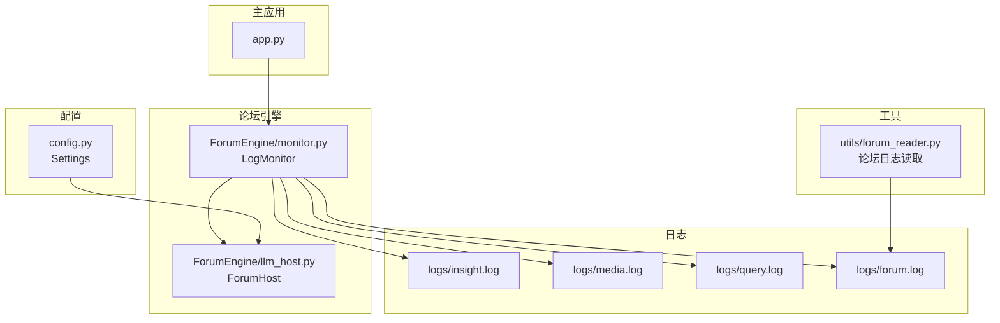
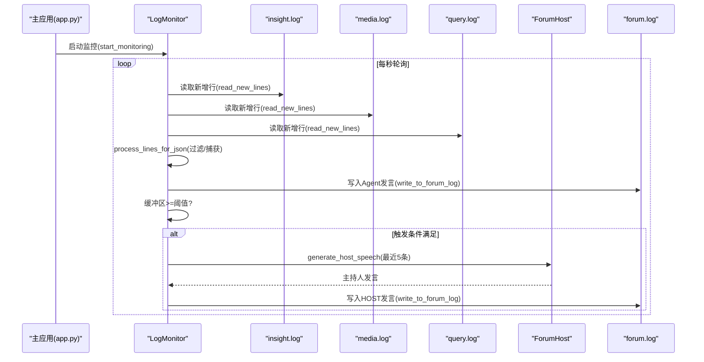
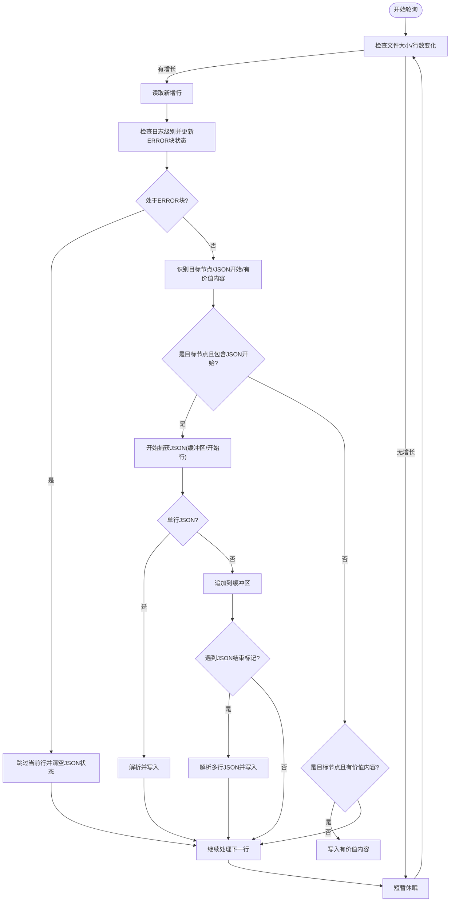
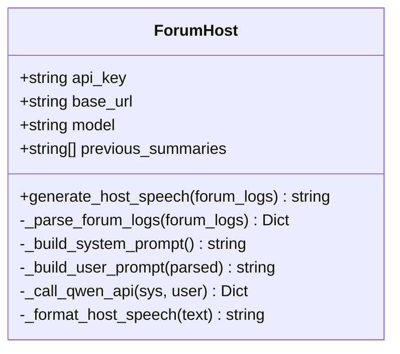
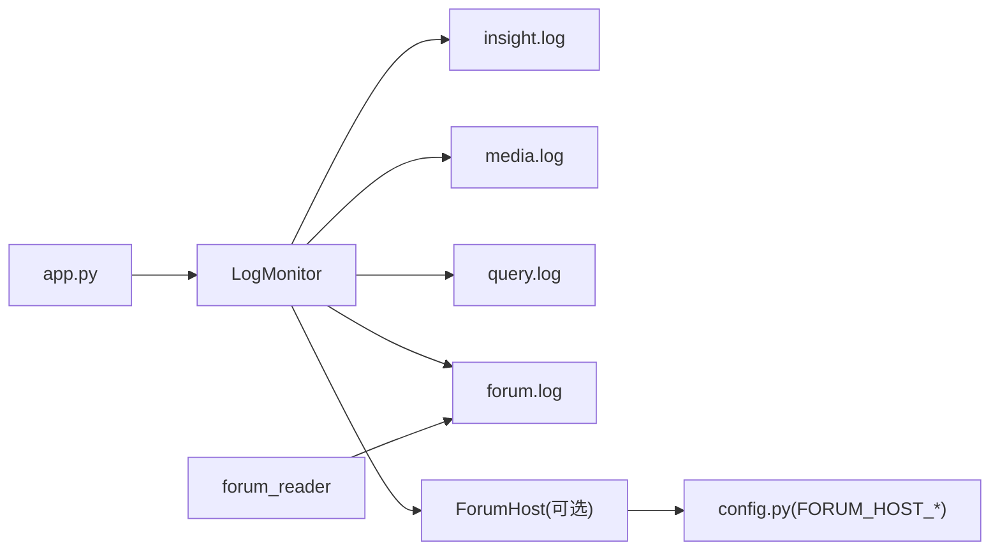

# Forum Engine（Agent论坛协作）

<cite>
**本文引用的文件**   
- [ForumEngine/monitor.py](file://ForumEngine/monitor.py)
- [ForumEngine/llm_host.py](file://ForumEngine/llm_host.py)
- [utils/forum_reader.py](file://utils/forum_reader.py)
- [app.py](file://app.py)
- [config.py](file://config.py)
- [tests/test_monitor.py](file://tests/test_monitor.py)
- [tests/forum_log_test_data.py](file://tests/forum_log_test_data.py)
- [README.md](file://README.md)
</cite>

## 目录
1. [简介](#简介)
2. [项目结构](#项目结构)
3. [核心组件](#核心组件)
4. [架构总览](#架构总览)
5. [详细组件分析](#详细组件分析)
6. [依赖关系分析](#依赖关系分析)
7. [性能考量](#性能考量)
8. [故障排除指南](#故障排除指南)
9. [结论](#结论)
10. [附录](#附录)

## 简介
本文件为 Forum Engine（Agent论坛协作）的详细技术文档，聚焦于：
- 日志监控器 LogMonitor 的核心功能与多线程监控架构
- JSON 内容提取算法与多行 JSON 捕获状态管理
- 主持人模型集成与触发逻辑
- 日志文件监控策略（insight.log、media.log、query.log）
- 目标节点识别模式、ERROR 块过滤机制
- 缓冲区管理与线程安全设计
- 配置选项、性能优化建议与故障排除指南
- 实际使用示例与集成指导

## 项目结构
Forum Engine 位于项目根目录的 ForumEngine 子目录中，配合主应用 app.py 启动与集成，utils/forum_reader.py 提供论坛日志读取工具，config.py 提供 LLM 与论坛主持人的配置项。

**图表来源**
- [app.py](file://app.py#L375-L394)
- [ForumEngine/monitor.py](file://ForumEngine/monitor.py#L24-L77)
- [ForumEngine/llm_host.py](file://ForumEngine/llm_host.py#L27-L56)
- [utils/forum_reader.py](file://utils/forum_reader.py#L11-L51)
- [config.py](file://config.py#L69-L72)

**章节来源**
- [README.md](file://README.md#L205-L208)
- [app.py](file://app.py#L375-L394)

## 核心组件
- LogMonitor：基于文件变化的智能日志监控器，负责实时监控 insight.log、media.log、query.log，识别目标节点（SummaryNode）输出，提取 JSON 内容，写入 forum.log，并在合适时机触发主持人发言。
- ForumHost：论坛主持人 LLM 模块，负责解析论坛日志并生成主持人引导发言。
- forum_reader：提供从 forum.log 读取最新 HOST 发言、全部 HOST 发言、最近 Agent 发言的能力。
- app.py：主应用入口，负责初始化 forum.log、启动/停止 ForumEngine，并提供 API 接口读取论坛日志。
- config.py：提供 FORUM_HOST_* 配置项，供 ForumHost 使用。

**章节来源**
- [ForumEngine/monitor.py](file://ForumEngine/monitor.py#L24-L77)
- [ForumEngine/llm_host.py](file://ForumEngine/llm_host.py#L27-L56)
- [utils/forum_reader.py](file://utils/forum_reader.py#L11-L51)
- [app.py](file://app.py#L375-L394)
- [config.py](file://config.py#L69-L72)

## 架构总览
Forum Engine 的整体工作流如下：
- 主应用启动时初始化 logs 目录与 forum.log，并启动 LogMonitor 线程。
- LogMonitor 同时监控 insight.log、media.log、query.log 的新增行。
- 识别目标节点（SummaryNode）输出，过滤 ERROR 块与非目标节点，提取 JSON 内容并写入 forum.log。
- 当缓冲区累积足够发言后，触发 ForumHost 生成主持人发言并写回 forum.log。
- 外部工具（如 utils/forum_reader）可读取 forum.log 获取最新 HOST 发言或最近 Agent 发言。

**图表来源**
- [app.py](file://app.py#L375-L394)
- [ForumEngine/monitor.py](file://ForumEngine/monitor.py#L584-L702)
- [ForumEngine/monitor.py](file://ForumEngine/monitor.py#L425-L522)
- [ForumEngine/llm_host.py](file://ForumEngine/llm_host.py#L57-L94)

## 详细组件分析

### LogMonitor：日志监控与内容提取
- 多线程监控：使用守护线程执行 monitor_logs，每秒轮询三个日志文件，检测文件大小变化与行数变化，读取新增内容。
- 目标节点识别：支持多种模式（类名、模块路径、标识文本），并排除 ERROR 级别与包含错误关键词的日志。
- 多行 JSON 捕获：维护 per-app 的捕获状态、缓冲区与开始行，支持 loguru 时间戳与旧格式时间戳的清理。
- ERROR 块过滤：遇到 ERROR 级别日志进入 ERROR 块状态，期间拒绝处理所有内容；遇到 INFO 级别退出 ERROR 块。
- JSON 内容提取：优先提取 updated_paragraph_latest_state，否则回退 paragraph_latest_state；对单行/多行 JSON 均可处理，并尝试修复常见 JSON 语法问题。
- 写入与线程安全：使用写入锁确保对 forum.log 的并发写入安全；将内容转换为单行字符串以便在一行中记录。
- 主持人触发：当缓冲区累计达到阈值（默认5条）且未在生成中时，同步触发主持人发言。
- 会话生命周期：通过首次检测到 FirstSummaryNode 标识行触发搜索会话，日志变短或长时间无活动自动结束会话。

**图表来源**
- [ForumEngine/monitor.py](file://ForumEngine/monitor.py#L425-L522)
- [ForumEngine/monitor.py](file://ForumEngine/monitor.py#L584-L702)

**章节来源**
- [ForumEngine/monitor.py](file://ForumEngine/monitor.py#L24-L77)
- [ForumEngine/monitor.py](file://ForumEngine/monitor.py#L138-L171)
- [ForumEngine/monitor.py](file://ForumEngine/monitor.py#L210-L234)
- [ForumEngine/monitor.py](file://ForumEngine/monitor.py#L235-L301)
- [ForumEngine/monitor.py](file://ForumEngine/monitor.py#L302-L323)
- [ForumEngine/monitor.py](file://ForumEngine/monitor.py#L324-L371)
- [ForumEngine/monitor.py](file://ForumEngine/monitor.py#L425-L522)
- [ForumEngine/monitor.py](file://ForumEngine/monitor.py#L524-L560)
- [ForumEngine/monitor.py](file://ForumEngine/monitor.py#L584-L702)

### ForumHost：主持人模型集成
- LLM 客户端：基于 OpenAI 兼容接口，使用 SiliconFlow 提供的 Qwen3 模型（默认 FORUM_HOST_MODEL_NAME）。
- 输入解析：从 forum.log 的最近 N 条 Agent 发言中解析时间戳、来源与内容，过滤 SYSTEM/HOST。
- Prompt 构建：系统提示强调事件梳理、引导讨论、纠正错误、整合观点、趋势预测与推进分析；用户提示汇总最近发言并要求结构化输出。
- 输出格式化：清理多余空行与引号，返回可直接写入 forum.log 的内容。
- 重试机制：通过装饰器包装 API 调用，提供优雅重试与默认返回。

**图表来源**
- [ForumEngine/llm_host.py](file://ForumEngine/llm_host.py#L27-L94)
- [ForumEngine/llm_host.py](file://ForumEngine/llm_host.py#L133-L208)
- [ForumEngine/llm_host.py](file://ForumEngine/llm_host.py#L210-L238)

**章节来源**
- [ForumEngine/llm_host.py](file://ForumEngine/llm_host.py#L27-L56)
- [ForumEngine/llm_host.py](file://ForumEngine/llm_host.py#L57-L94)
- [ForumEngine/llm_host.py](file://ForumEngine/llm_host.py#L133-L208)
- [ForumEngine/llm_host.py](file://ForumEngine/llm_host.py#L210-L238)

### forum_reader：论坛日志读取工具
- 获取最新 HOST 发言：从 forum.log 从后向前查找，匹配 [时间] [HOST] 格式，还原转义换行。
- 获取全部 HOST 发言：返回包含时间戳与内容的列表。
- 获取最近 Agent 发言：匹配 [时间] [INSIGHT|MEDIA|QUERY] 格式，限定数量。

**章节来源**
- [utils/forum_reader.py](file://utils/forum_reader.py#L11-L51)
- [utils/forum_reader.py](file://utils/forum_reader.py#L54-L92)
- [utils/forum_reader.py](file://utils/forum_reader.py#L95-L136)
- [utils/forum_reader.py](file://utils/forum_reader.py#L139-L160)

### 主应用集成与 API
- 初始化：启动时创建 logs 目录，初始化 forum.log 并写入开始标记。
- 启动/停止：通过 start_forum_engine()/stop_forum_engine() 控制 LogMonitor 生命周期。
- API：提供 /api/forum/start、/api/forum/stop、/api/forum/log 等接口，返回解析后的论坛消息。

**章节来源**
- [app.py](file://app.py#L350-L370)
- [app.py](file://app.py#L375-L394)
- [app.py](file://app.py#L1069-L1105)

## 依赖关系分析
- LogMonitor 依赖：
  - 日志文件：insight.log、media.log、query.log、forum.log
  - 主持人模块：llm_host.py（可选，未找到时以纯监控模式运行）
  - 线程与锁：threading.Lock 保证写入安全
- ForumHost 依赖：
  - config.py 中 FORUM_HOST_* 配置项
  - retry_helper 装饰器（在 llm_host.py 中导入）
- forum_reader 依赖：
  - forum.log 文件
- 主应用依赖：
  - ForumEngine.monitor 的启动/停止函数
  - Flask 路由与 SocketIO（此处仅展示论坛相关接口）

**图表来源**
- [ForumEngine/monitor.py](file://ForumEngine/monitor.py#L27-L37)
- [ForumEngine/monitor.py](file://ForumEngine/monitor.py#L17-L22)
- [ForumEngine/llm_host.py](file://ForumEngine/llm_host.py#L13-L24)
- [config.py](file://config.py#L69-L72)
- [utils/forum_reader.py](file://utils/forum_reader.py#L21-L28)
- [app.py](file://app.py#L375-L394)

**章节来源**
- [ForumEngine/monitor.py](file://ForumEngine/monitor.py#L17-L22)
- [ForumEngine/llm_host.py](file://ForumEngine/llm_host.py#L13-L24)
- [config.py](file://config.py#L69-L72)
- [utils/forum_reader.py](file://utils/forum_reader.py#L21-L28)
- [app.py](file://app.py#L375-L394)

## 性能考量
- 轮询频率：默认每秒轮询一次，适合中小规模日志输出；若日志量极大，可考虑降低轮询间隔或采用更高效的文件监控方案（如 inotify/fswatch）。
- JSON 解析与修复：对多行 JSON 的解析与修复会带来额外开销；建议确保上游日志输出格式稳定，减少修复路径。
- 线程安全：写入锁确保并发安全，但在高吞吐场景下可能成为瓶颈；可考虑批量写入或异步写入队列。
- 缓冲区阈值：host_speech_threshold 默认为5，可根据论坛节奏调整；过高会延迟主持人发言，过低会频繁触发 API。
- 文件大小与位置：LogMonitor 通过记录文件大小与位置实现增量读取，避免全量扫描；若日志文件被清空，会重置状态并重新开始。

[本节为通用性能建议，不直接分析具体文件]

## 故障排除指南
- 主持人模块未找到：当 llm_host.py 无法导入时，LogMonitor 会降级为纯监控模式并记录异常日志。请检查 FORUM_HOST_* 配置项与依赖安装。
- JSON 解析失败：LogMonitor 会尝试修复常见 JSON 语法问题；若修复失败，建议检查上游节点输出格式或日志截断。
- ERROR 块导致内容丢失：ERROR 级别日志会触发 ERROR 块状态，期间所有内容被拒绝处理；确保上游日志正确区分 ERROR/INFO 级别。
- 多行 JSON 未结束：若 JSON 多行未正确闭合，捕获状态会持续；请检查上游节点输出完整性。
- 主持人发言未触发：确认缓冲区累计达到阈值且未处于生成中；检查 is_host_generating 标志。
- API 调用失败：ForumHost 使用重试装饰器，若多次失败会返回默认错误；检查 FORUM_HOST_* 配置与网络连通性。

**章节来源**
- [ForumEngine/monitor.py](file://ForumEngine/monitor.py#L17-L22)
- [ForumEngine/monitor.py](file://ForumEngine/monitor.py#L289-L301)
- [ForumEngine/monitor.py](file://ForumEngine/monitor.py#L444-L467)
- [ForumEngine/monitor.py](file://ForumEngine/monitor.py#L524-L560)
- [ForumEngine/llm_host.py](file://ForumEngine/llm_host.py#L210-L238)

## 结论
Forum Engine 通过 LogMonitor 实现对三个 Agent 引擎日志的实时监控与内容提取，并在合适的时机触发 ForumHost 生成主持人引导发言，形成“Agent 讨论 + 主持人引导”的协作机制。其设计兼顾了多行 JSON 捕获、ERROR 块过滤、缓冲区管理与线程安全，适用于多轮深度研究与报告生成的场景。通过合理的配置与性能优化，可进一步提升稳定性与响应速度。

[本节为总结性内容，不直接分析具体文件]

## 附录

### 配置选项
- FORUM_HOST_API_KEY：论坛主持人 LLM API 密钥
- FORUM_HOST_BASE_URL：论坛主持人 LLM Base URL
- FORUM_HOST_MODEL_NAME：论坛主持人模型名称（如 qwen-plus）

**章节来源**
- [config.py](file://config.py#L69-L72)

### 使用示例与集成指导
- 启动主应用：启动后会初始化 logs 目录与 forum.log，并自动启动 ForumEngine 监控。
- 手动控制论坛：
  - 启动：/api/forum/start
  - 停止：/api/forum/stop
  - 读取日志：/api/forum/log
- 读取最新 HOST 发言：使用 utils/forum_reader.get_latest_host_speech()
- 读取最近 Agent 发言：使用 utils/forum_reader.get_recent_agent_speeches()

**章节来源**
- [app.py](file://app.py#L350-L370)
- [app.py](file://app.py#L375-L394)
- [app.py](file://app.py#L1069-L1105)
- [utils/forum_reader.py](file://utils/forum_reader.py#L11-L51)
- [utils/forum_reader.py](file://utils/forum_reader.py#L95-L136)

### 测试与验证
- 单元测试覆盖：
  - 目标节点识别（旧/新格式）
  - JSON 开始/结束行识别
  - 单行/多行 JSON 提取
  - 优先字段提取（updated_paragraph_latest_state）
  - 节点内容提取与清理
  - 混合格式处理
  - 过滤 SearchNode 输出
  - 过滤 ERROR 日志
- 测试数据包含多种日志格式与边界情况，确保解析鲁棒性。

**章节来源**
- [tests/test_monitor.py](file://tests/test_monitor.py#L21-L341)
- [tests/forum_log_test_data.py](file://tests/forum_log_test_data.py#L1-L158)