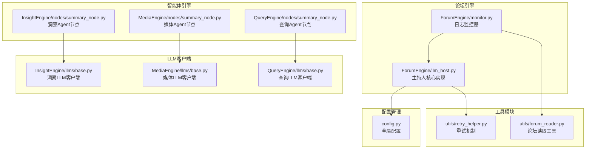
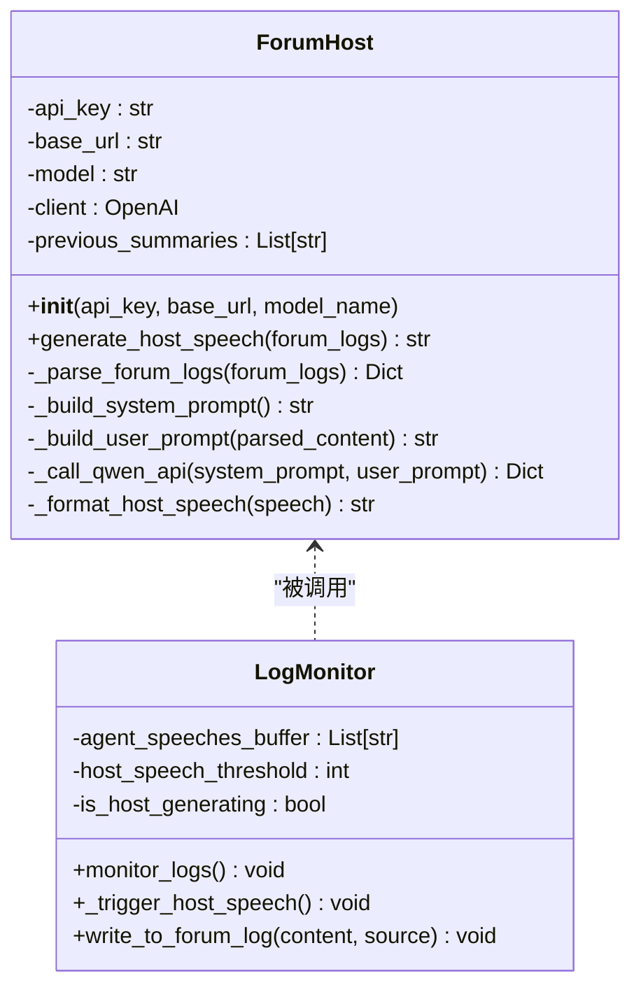
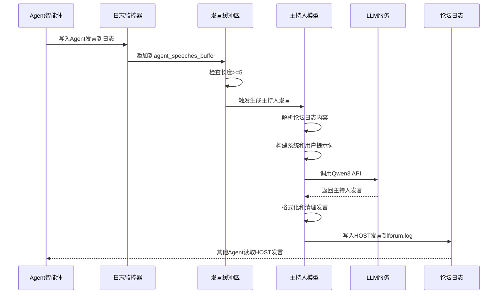
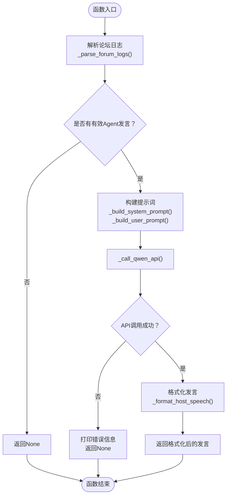
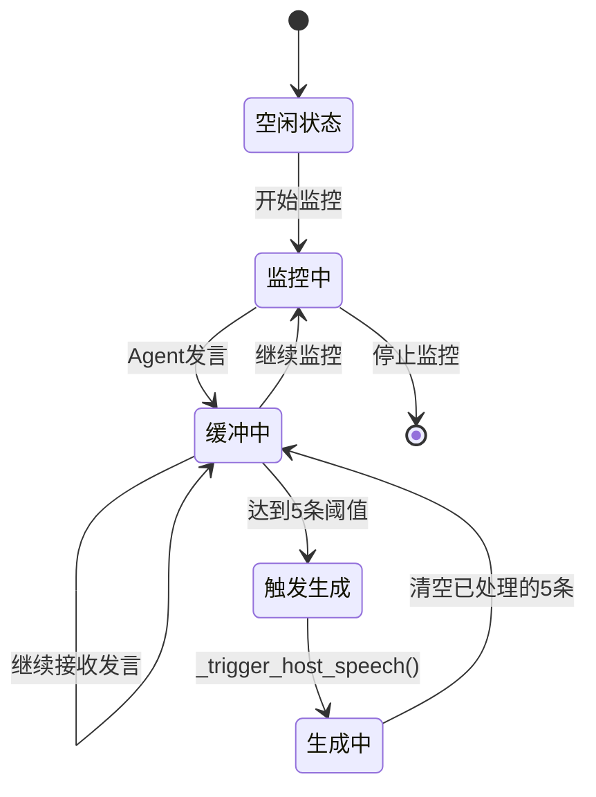
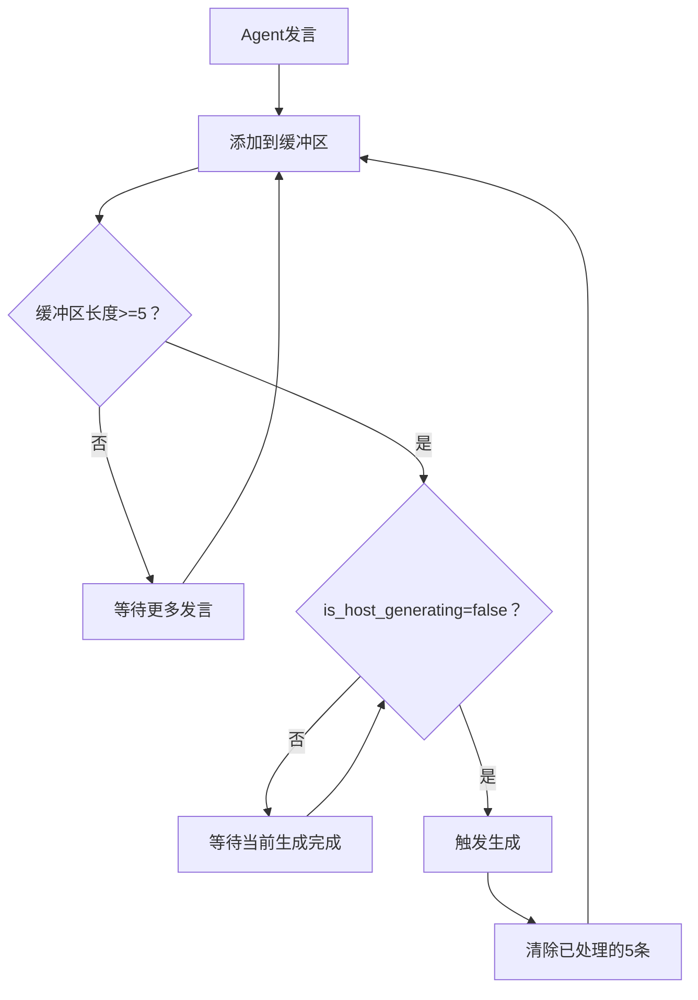
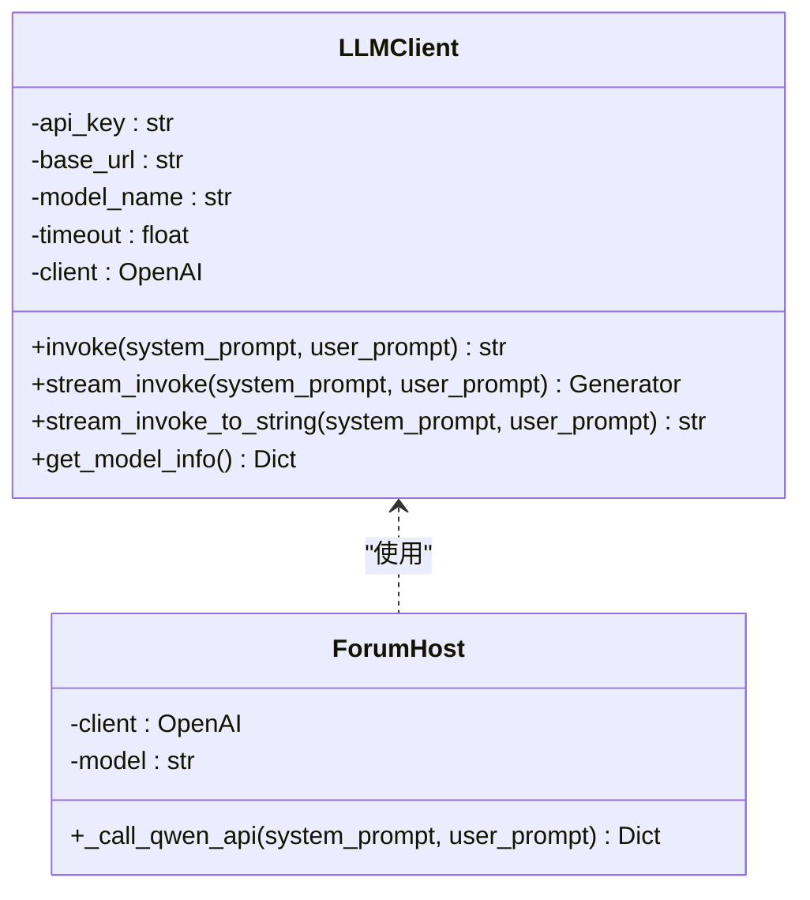
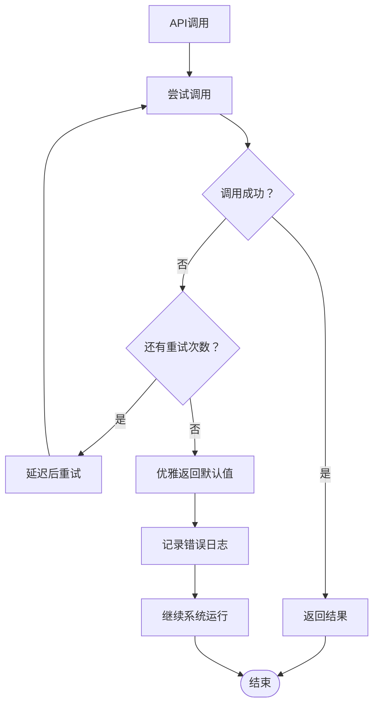
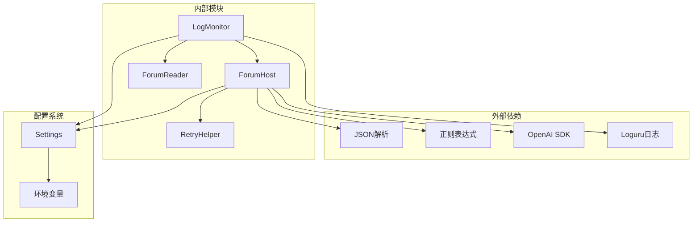

# LLM主持人模型

<cite>
**本文档引用的文件**
- [ForumEngine/llm_host.py](file://ForumEngine/llm_host.py)
- [ForumEngine/monitor.py](file://ForumEngine/monitor.py)
- [utils/retry_helper.py](file://utils/retry_helper.py)
- [config.py](file://config.py)
- [utils/forum_reader.py](file://utils/forum_reader.py)
- [InsightEngine/nodes/summary_node.py](file://InsightEngine/nodes/summary_node.py)
- [MediaEngine/nodes/summary_node.py](file://MediaEngine/nodes/summary_node.py)
- [QueryEngine/nodes/summary_node.py](file://QueryEngine/nodes/summary_node.py)
- [InsightEngine/llms/base.py](file://InsightEngine/llms/base.py)
- [MediaEngine/llms/base.py](file://MediaEngine/llms/base.py)
- [QueryEngine/llms/base.py](file://QueryEngine/llms/base.py)
</cite>

## 目录
1. [简介](#简介)
2. [项目结构](#项目结构)
3. [核心组件](#核心组件)
4. [架构概览](#架构概览)
5. [详细组件分析](#详细组件分析)
6. [依赖关系分析](#依赖关系分析)
7. [性能考虑](#性能考虑)
8. [故障排除指南](#故障排除指南)
9. [结论](#结论)
10. [附录](#附录)

## 简介

LLM主持人模型是BettaFish多智能体舆情分析系统中的关键组件，负责在三个Agent（Insight、Media、Query）之间引导多轮对话讨论。该系统通过实时监控日志文件，自动识别Agent的发言内容，当达到预设阈值时触发主持人生成综合性的引导性发言。

主持人模型的核心功能包括：
- **多轮对话上下文管理**：维护Agent发言缓冲区，实现智能的触发机制
- **LLM集成**：通过OpenAI兼容接口调用Qwen3模型进行对话生成
- **内容格式化**：对生成的发言进行格式化和清理处理
- **错误处理**：采用优雅重试机制确保系统稳定性

## 项目结构

BettaFish项目采用模块化的架构设计，LLM主持人模型主要分布在以下目录：



**图表来源**
- [ForumEngine/llm_host.py](file://ForumEngine/llm_host.py#L1-L263)
- [ForumEngine/monitor.py](file://ForumEngine/monitor.py#L1-L859)
- [utils/retry_helper.py](file://utils/retry_helper.py#L1-L248)

**章节来源**
- [ForumEngine/llm_host.py](file://ForumEngine/llm_host.py#L1-L263)
- [ForumEngine/monitor.py](file://ForumEngine/monitor.py#L1-L859)

## 核心组件

### 主持人核心类（ForumHost）

ForumHost是主持人模型的核心类，负责LLM调用、内容解析和格式化处理：



**图表来源**
- [ForumEngine/llm_host.py](file://ForumEngine/llm_host.py#L27-L263)
- [ForumEngine/monitor.py](file://ForumEngine/monitor.py#L24-L859)

### 日志监控器（LogMonitor）

LogMonitor负责实时监控三个Agent的日志文件，实现智能的触发机制：

- **缓冲区管理**：维护agent_speeches_buffer，存储最近的Agent发言
- **触发阈值**：host_speech_threshold设置为5，每5条Agent发言触发一次主持人发言
- **同步执行**：is_host_generating标志确保主持人发言生成的同步性
- **多文件监控**：同时监控insight.log、media.log、query.log三个文件

**章节来源**
- [ForumEngine/monitor.py](file://ForumEngine/monitor.py#L24-L859)

## 架构概览

LLM主持人模型的整体架构采用事件驱动的设计模式：



**图表来源**
- [ForumEngine/monitor.py](file://ForumEngine/monitor.py#L524-L560)
- [ForumEngine/llm_host.py](file://ForumEngine/llm_host.py#L57-L94)

## 详细组件分析

### generate_host_speech函数实现

generate_host_speech是主持人模型的核心入口函数，实现了完整的发言生成流程：



**图表来源**
- [ForumEngine/llm_host.py](file://ForumEngine/llm_host.py#L57-L94)

#### 实现细节分析

1. **日志解析阶段**：
   - 使用正则表达式解析日志格式`[时间戳][发言者]内容`
   - 过滤SYSTEM和HOST自身的消息
   - 提取INSIGHT、MEDIA、QUERY三个Agent的有效发言

2. **提示词构建**：
   - 系统提示词包含6项核心职责：事件梳理、引导讨论、纠正错误、整合观点、趋势预测、推进分析
   - 用户提示词包含最近Agent发言的完整内容

3. **API调用封装**：
   - 使用@with_graceful_retry装饰器实现优雅重试
   - 自动添加当前时间信息到用户提示词
   - 统一的错误处理和返回格式

**章节来源**
- [ForumEngine/llm_host.py](file://ForumEngine/llm_host.py#L57-L238)

### 多轮对话上下文管理

主持人模型通过LogMonitor实现智能的上下文管理：



**图表来源**
- [ForumEngine/monitor.py](file://ForumEngine/monitor.py#L524-L560)

#### 缓冲区处理机制

1. **智能阈值触发**：每5条Agent发言触发一次主持人发言
2. **同步执行保护**：is_host_generating标志防止并发触发
3. **自动清理**：生成成功后自动清除已处理的发言记录
4. **错误恢复**：异常情况下重置生成状态

**章节来源**
- [ForumEngine/monitor.py](file://ForumEngine/monitor.py#L48-L560)

### Agent发言缓冲区处理

Agent发言缓冲区是主持人模型的核心数据结构：

| 属性名 | 类型 | 描述 | 默认值 |
|--------|------|------|--------|
| agent_speeches_buffer | List[str] | 存储Agent发言的缓冲区 | [] |
| host_speech_threshold | int | 触发阈值 | 5 |
| is_host_generating | bool | 生成状态标志 | False |

缓冲区处理流程：
1. **内容格式化**：将发言转换为`[时间戳][来源]内容`格式
2. **自动追加**：新发言自动添加到缓冲区末尾
3. **阈值检查**：当长度达到阈值时触发生成
4. **批量处理**：每次生成处理最近的5条发言
5. **状态更新**：成功生成后清除已处理的发言

**章节来源**
- [ForumEngine/monitor.py](file://ForumEngine/monitor.py#L48-L648)

### 主持人触发条件

主持人触发机制采用"阈值触发 + 同步保护"的设计：



**图表来源**
- [ForumEngine/monitor.py](file://ForumEngine/monitor.py#L646-L648)

#### 触发条件详解

1. **5条Agent发言阈值**：经过测试验证，5条发言能够提供足够的上下文信息
2. **同步执行机制**：防止多个主持人发言同时生成造成资源竞争
3. **自动重置机制**：生成完成后自动清理缓冲区，准备下一轮

**章节来源**
- [ForumEngine/monitor.py](file://ForumEngine/monitor.py#L524-L560)

### LLM集成方式

主持人模型采用OpenAI兼容的接口进行LLM集成：



**图表来源**
- [InsightEngine/llms/base.py](file://InsightEngine/llms/base.py#L30-L168)
- [ForumEngine/llm_host.py](file://ForumEngine/llm_host.py#L48-L238)

#### API调用封装特性

1. **统一接口**：所有引擎使用相同的LLMClient接口
2. **重试机制**：集成优雅重试装饰器，提高API调用稳定性
3. **超时管理**：支持可配置的请求超时时间
4. **流式处理**：支持流式响应处理，避免大文本截断问题

**章节来源**
- [InsightEngine/llms/base.py](file://InsightEngine/llms/base.py#L57-L154)
- [ForumEngine/llm_host.py](file://ForumEngine/llm_host.py#L210-L238)

### 错误处理策略

主持人模型采用多层次的错误处理机制：



**图表来源**
- [utils/retry_helper.py](file://utils/retry_helper.py#L141-L199)

#### 错误处理层次

1. **API层错误**：使用@with_graceful_retry装饰器处理
2. **解析层错误**：日志解析失败时返回None
3. **格式化层错误**：内容格式化异常时返回原始内容
4. **系统层错误**：监控线程异常时自动重启

**章节来源**
- [utils/retry_helper.py](file://utils/retry_helper.py#L141-L199)
- [ForumEngine/llm_host.py](file://ForumEngine/llm_host.py#L89-L94)

### 主持人发言内容格式化

主持人发言的格式化处理确保输出质量和一致性：

| 处理步骤 | 正则表达式 | 功能描述 |
|----------|------------|----------|
| 多余空行清理 | `\n{3,}` | 将3个及以上连续换行替换为2个 |
| 引号移除 | `'"\'""‘’'` | 移除开头和结尾的引号 |
| 首尾空白处理 | `.strip()` | 清理前后空白字符 |

格式化后的发言具有以下特点：
- 统一的段落结构
- 清晰的标题层级
- 适当的空白间距
- 标准化的标点符号

**章节来源**
- [ForumEngine/llm_host.py](file://ForumEngine/llm_host.py#L239-L247)

## 依赖关系分析

### 组件耦合度分析



**图表来源**
- [ForumEngine/llm_host.py](file://ForumEngine/llm_host.py#L6-L24)
- [ForumEngine/monitor.py](file://ForumEngine/monitor.py#L14-L22)

### 关键依赖关系

1. **LLM供应商抽象**：通过LLMClient抽象屏蔽具体供应商差异
2. **配置管理**：集中式的配置管理确保部署灵活性
3. **重试机制**：统一的重试策略提高系统稳定性
4. **日志系统**：完善的日志记录便于问题诊断

**章节来源**
- [config.py](file://config.py#L23-L136)
- [utils/retry_helper.py](file://utils/retry_helper.py#L1-L248)

## 性能考虑

### 内存使用优化

1. **缓冲区大小控制**：仅保留最近的Agent发言，避免内存泄漏
2. **增量处理**：采用增量读取方式，减少内存占用
3. **及时清理**：生成完成后立即清理已处理的发言记录

### 网络请求优化

1. **连接池复用**：OpenAI客户端自动管理连接池
2. **超时配置**：合理的超时设置避免请求阻塞
3. **重试策略**：智能的退避算法减少服务器压力

### 并发处理优化

1. **线程安全**：使用Lock确保多线程环境下的数据一致性
2. **异步I/O**：日志文件读取采用异步方式
3. **资源限制**：设置合理的资源使用上限

## 故障排除指南

### 常见问题及解决方案

| 问题类型 | 症状描述 | 可能原因 | 解决方案 |
|----------|----------|----------|----------|
| API调用失败 | 主持人发言为空 | LLM服务不可用 | 检查API密钥和网络连接 |
| 触发不生效 | 5条发言后无主持人发言 | is_host_generating标志异常 | 重启监控进程 |
| 日志解析错误 | Agent发言未被识别 | 日志格式不匹配 | 检查日志文件编码和格式 |
| 内存泄漏 | 系统内存持续增长 | 缓冲区未及时清理 | 检查缓冲区清理逻辑 |

### 调试技巧

1. **日志级别调整**：将日志级别设置为DEBUG获取详细信息
2. **API响应监控**：检查LLM API的响应时间和错误码
3. **内存使用监控**：使用系统监控工具观察内存使用情况
4. **网络连接测试**：验证API端点的连通性

### 性能监控指标

- **API调用成功率**：监控LLM API的调用成功率
- **平均响应时间**：跟踪API响应的平均耗时
- **缓冲区长度**：监控Agent发言缓冲区的长度变化
- **系统资源使用**：监控CPU和内存的使用情况

**章节来源**
- [utils/retry_helper.py](file://utils/retry_helper.py#L141-L199)
- [ForumEngine/monitor.py](file://ForumEngine/monitor.py#L696-L700)

## 结论

LLM主持人模型通过精心设计的架构实现了多智能体对话系统的智能化管理。其核心优势包括：

1. **智能触发机制**：基于5条发言阈值的触发设计，确保主持人发言的质量和时机
2. **稳定的LLM集成**：通过OpenAI兼容接口和优雅重试机制，提供可靠的LLM服务集成
3. **完善的错误处理**：多层次的错误处理策略确保系统在异常情况下的稳定性
4. **灵活的配置管理**：集中式的配置管理支持多种部署场景

该模型为多智能体系统的协调和引导提供了有效的解决方案，为后续的功能扩展和性能优化奠定了坚实的基础。

## 附录

### 配置选项说明

| 配置项 | 类型 | 描述 | 默认值 |
|--------|------|------|--------|
| FORUM_HOST_API_KEY | str | 主持人LLM API密钥 | None |
| FORUM_HOST_BASE_URL | str | 主持人LLM基础URL | None |
| FORUM_HOST_MODEL_NAME | str | 主持人LLM模型名称 | None |
| host_speech_threshold | int | 触发阈值 | 5 |
| SEARCH_API_RETRY_CONFIG | dict | 搜索API重试配置 | 预定义配置 |

### 使用示例

```python
# 基本使用
from ForumEngine.llm_host import generate_host_speech

# 生成主持人发言
forum_logs = [
    "[14:30:25] [INSIGHT] 通过对历史数据的分析，发现...",
    "[14:31:10] [MEDIA] 媒体报道显示...",
    "[14:31:45] [QUERY] 网络搜索结果显示..."
]

host_speech = generate_host_speech(forum_logs)
if host_speech:
    print("主持人发言:", host_speech)
```

### 集成指导

1. **环境配置**：设置FORUM_HOST相关的环境变量
2. **日志格式**：确保Agent智能体按照标准格式输出日志
3. **监控启动**：启动LogMonitor开始监听Agent发言
4. **API测试**：验证LLM API的连通性和响应质量