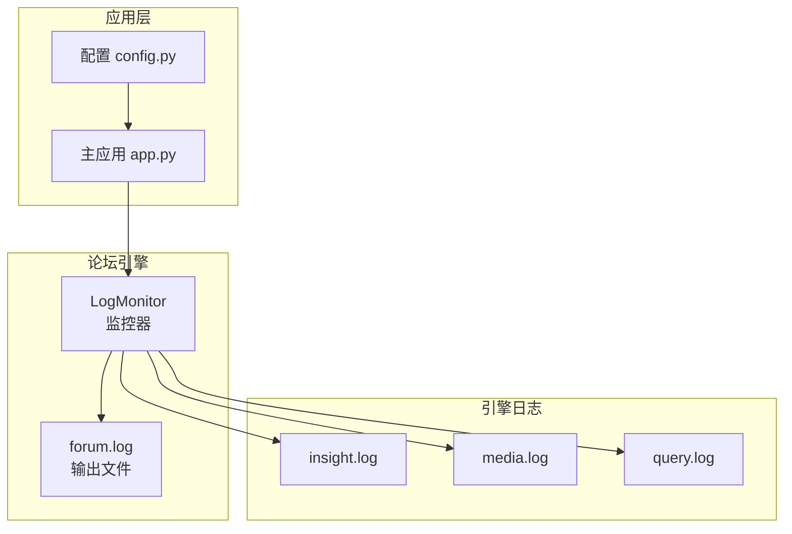
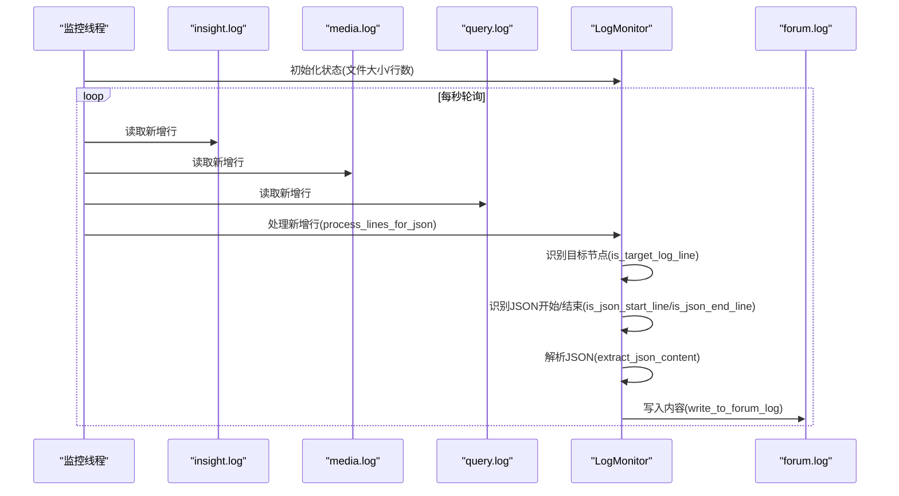
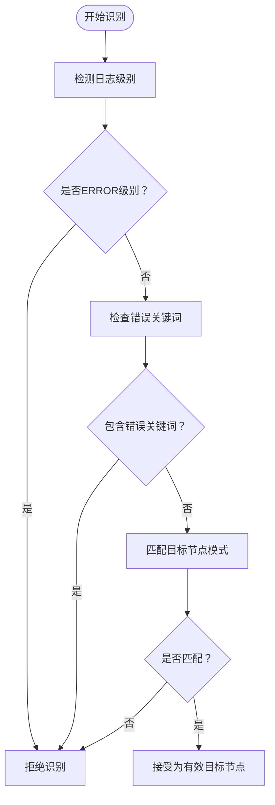
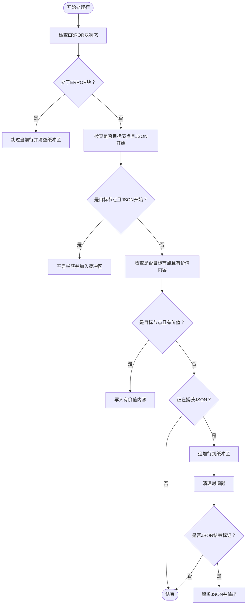
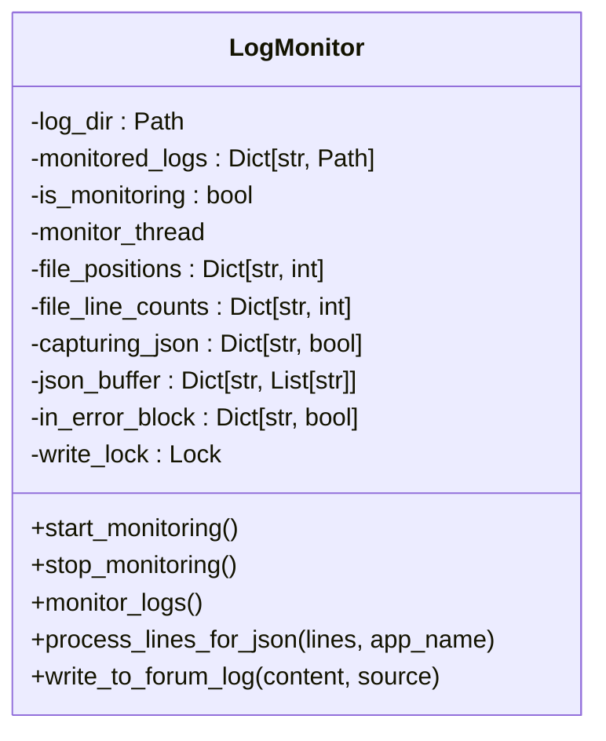
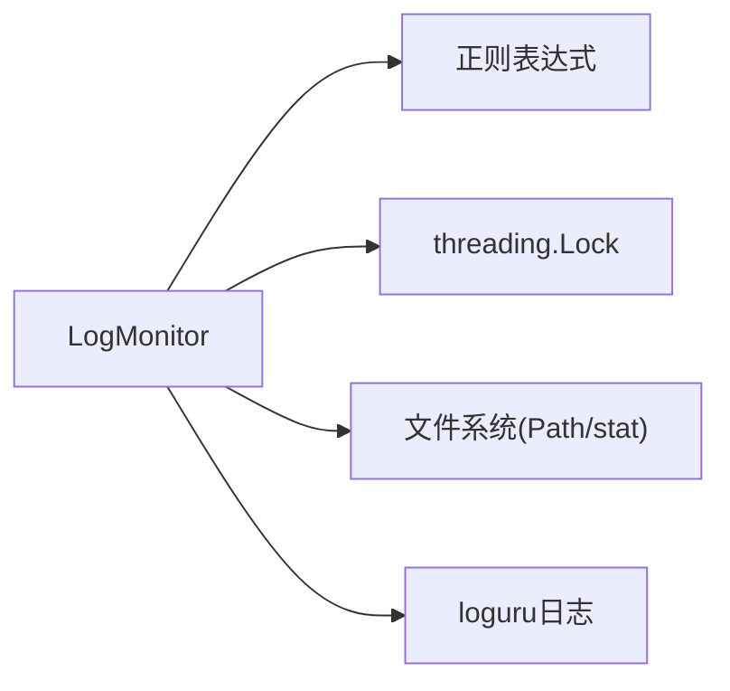

# 日志监控器

<cite>
**本文档引用的文件**
- [ForumEngine/monitor.py](file://ForumEngine/monitor.py)
- [tests/test_monitor.py](file://tests/test_monitor.py)
- [tests/forum_log_test_data.py](file://tests/forum_log_test_data.py)
- [app.py](file://app.py)
- [config.py](file://config.py)
- [ReportEngine/agent.py](file://ReportEngine/agent.py)
</cite>

## 目录
1. [简介](#简介)
2. [项目结构](#项目结构)
3. [核心组件](#核心组件)
4. [架构总览](#架构总览)
5. [详细组件分析](#详细组件分析)
6. [依赖关系分析](#依赖关系分析)
7. [性能考虑](#性能考虑)
8. [故障排除指南](#故障排除指南)
9. [结论](#结论)
10. [附录](#附录)

## 简介
本文件为LogMonitor日志监控器的详细技术文档，聚焦于多线程实时监控insight.log、media.log、query.log三个引擎日志文件的架构设计与实现细节。文档深入解释目标节点识别算法（FirstSummaryNode与ReflectionSummaryNode的识别模式、正则表达式匹配策略与兼容性处理）、多行JSON内容捕获的状态管理（开始/结束检测、缓冲区管理、错误块过滤机制）、线程安全设计、文件大小检测与位置追踪、并发控制策略，并提供配置选项、性能优化建议与故障排除指南。

## 项目结构
LogMonitor位于ForumEngine模块中，负责从三个引擎的日志文件中抽取目标节点（SummaryNode）的输出，将其写入forum.log并触发主持人发言。监控器通过独立线程扫描日志文件，维护每个文件的行数与文件大小位置，实现增量读取与多行JSON捕获。

**图表来源**
- [ForumEngine/monitor.py](file://ForumEngine/monitor.py#L24-L77)
- [app.py](file://app.py#L375-L396)

**章节来源**
- [ForumEngine/monitor.py](file://ForumEngine/monitor.py#L24-L77)
- [app.py](file://app.py#L375-L396)

## 核心组件
- LogMonitor：多线程日志监控器，负责扫描、识别、解析与输出目标节点内容。
- 目标节点识别：支持FirstSummaryNode与ReflectionSummaryNode的多种识别模式。
- 多行JSON捕获：基于状态机的开始/结束检测与缓冲区管理。
- 错误块过滤：基于日志级别的ERROR块过滤，避免错误日志进入论坛。
- 线程安全：使用Lock保护写入操作，避免并发写入冲突。
- 文件追踪：基于文件大小与行数的增量读取与位置追踪。

**章节来源**
- [ForumEngine/monitor.py](file://ForumEngine/monitor.py#L24-L77)
- [ForumEngine/monitor.py](file://ForumEngine/monitor.py#L138-L171)
- [ForumEngine/monitor.py](file://ForumEngine/monitor.py#L425-L522)
- [ForumEngine/monitor.py](file://ForumEngine/monitor.py#L106-L122)

## 架构总览
LogMonitor采用多线程架构，主线程持续扫描三个目标日志文件，识别目标节点输出并写入forum.log。监控器内部维护每个应用的捕获状态、缓冲区与错误块状态，确保只捕获有效内容并过滤错误日志。

**图表来源**
- [ForumEngine/monitor.py](file://ForumEngine/monitor.py#L584-L702)
- [ForumEngine/monitor.py](file://ForumEngine/monitor.py#L425-L522)
- [ForumEngine/monitor.py](file://ForumEngine/monitor.py#L106-L122)

## 详细组件分析

### 目标节点识别算法
LogMonitor通过多种模式识别目标节点（FirstSummaryNode与ReflectionSummaryNode）：
- 类名匹配：FirstSummaryNode、ReflectionSummaryNode
- 完整模块路径：InsightEngine.nodes.summary_node、MediaEngine.nodes.summary_node、QueryEngine.nodes.summary_node
- 部分模块路径：nodes.summary_node（兼容性）
- 关键标识文本：正在生成首次段落总结、正在生成反思总结

同时，识别过程排除错误日志与错误关键词，确保只捕获有效输出。

**图表来源**
- [ForumEngine/monitor.py](file://ForumEngine/monitor.py#L138-L171)

**章节来源**
- [ForumEngine/monitor.py](file://ForumEngine/monitor.py#L53-L67)
- [ForumEngine/monitor.py](file://ForumEngine/monitor.py#L138-L171)

### 多行JSON内容捕获状态管理
LogMonitor维护每个应用的捕获状态与缓冲区：
- capturing_json：是否正在捕获JSON
- json_buffer：当前JSON缓冲区
- json_start_line：JSON开始行
- in_error_block：是否处于ERROR块

处理流程：
- 识别目标节点且包含JSON开始标记时，开启捕获并将行加入缓冲区
- 单行JSON：若行以}结尾，立即解析并输出
- 多行JSON：持续追加行，清理时间戳后判断是否为结束标记
- 错误块过滤：遇到ERROR级别进入错误块，遇到INFO级别退出错误块；在错误块中拒绝处理所有内容

**图表来源**
- [ForumEngine/monitor.py](file://ForumEngine/monitor.py#L425-L522)
- [ForumEngine/monitor.py](file://ForumEngine/monitor.py#L210-L234)

**章节来源**
- [ForumEngine/monitor.py](file://ForumEngine/monitor.py#L69-L74)
- [ForumEngine/monitor.py](file://ForumEngine/monitor.py#L425-L522)

### 线程安全设计与并发控制
- 写入锁：使用threading.Lock保护forum.log写入，避免并发写入冲突
- 监控线程：守护线程，随应用启动/停止
- 状态隔离：每个应用独立维护捕获状态、缓冲区与错误块状态

**图表来源**
- [ForumEngine/monitor.py](file://ForumEngine/monitor.py#L24-L77)
- [ForumEngine/monitor.py](file://ForumEngine/monitor.py#L106-L122)

**章节来源**
- [ForumEngine/monitor.py](file://ForumEngine/monitor.py#L46-L46)
- [ForumEngine/monitor.py](file://ForumEngine/monitor.py#L106-L122)

### 文件大小检测与位置追踪
- 基线初始化：启动时记录每个文件的行数与文件大小作为基线
- 增量读取：比较当前文件大小与上次位置，定位新增内容
- 文件回滚处理：若文件大小小于上次位置，视为文件被清空，重置状态
- 行数变化检测：用于判断是否存在新增内容

**章节来源**
- [ForumEngine/monitor.py](file://ForumEngine/monitor.py#L588-L595)
- [ForumEngine/monitor.py](file://ForumEngine/monitor.py#L389-L423)
- [ForumEngine/monitor.py](file://ForumEngine/monitor.py#L400-L407)

### JSON解析与修复
- 单行/多行JSON：支持loguru新格式与旧格式时间戳清理
- 优先字段提取：优先提取updated_paragraph_latest_state，否则回退到paragraph_latest_state
- JSON修复：使用状态机修复未转义的双引号等常见问题

**章节来源**
- [ForumEngine/monitor.py](file://ForumEngine/monitor.py#L235-L301)
- [ForumEngine/monitor.py](file://ForumEngine/monitor.py#L758-L837)

### 主持人发言触发机制
- 缓冲区：收集最近agent发言，达到阈值后触发主持人发言
- 同步触发：_trigger_host_speech同步执行，避免并发问题
- 输出格式：将主持人发言写入forum.log并标注来源

**章节来源**
- [ForumEngine/monitor.py](file://ForumEngine/monitor.py#L524-L560)
- [ForumEngine/monitor.py](file://ForumEngine/monitor.py#L561-L582)

## 依赖关系分析
LogMonitor依赖于：
- 日志格式：支持loguru默认格式（YYYY-MM-DD HH:mm:ss.SSS | LEVEL | ...）与旧格式（[HH:MM:SS]）
- 正则表达式：用于时间戳清理、JSON开始/结束判断、内容提取
- 线程同步：Lock用于写入安全
- 文件系统：Path用于路径管理，stat用于文件大小检测

**图表来源**
- [ForumEngine/monitor.py](file://ForumEngine/monitor.py#L10-L14)
- [ForumEngine/monitor.py](file://ForumEngine/monitor.py#L210-L234)

**章节来源**
- [ForumEngine/monitor.py](file://ForumEngine/monitor.py#L10-L14)
- [ForumEngine/monitor.py](file://ForumEngine/monitor.py#L210-L234)

## 性能考虑
- 增量读取：基于文件大小与行数变化，避免全量扫描
- 行缓冲：loguru配置为同步写入与行缓冲，确保日志实时输出
- 状态机解析：多行JSON解析采用状态机，减少回溯与重试
- 并发控制：仅在写入时加锁，其他操作保持轻量

**章节来源**
- [ReportEngine/agent.py](file://ReportEngine/agent.py#L309-L325)
- [ForumEngine/monitor.py](file://ForumEngine/monitor.py#L372-L387)

## 故障排除指南
- 目标节点未被捕获
  - 检查日志级别是否为ERROR（ERROR级别会被拒绝）
  - 确认日志中包含目标节点模式或标识文本
  - 排查是否包含错误关键词（如JSON解析失败、Traceback等）

- JSON解析失败
  - 确认日志格式为loguru新格式或旧格式，并确保包含"清理后的输出: {"标记
  - 检查多行JSON是否正确闭合，或尝试使用内置修复机制

- 错误块导致内容丢失
  - 确认日志中ERROR级别是否持续存在，直到出现INFO级别才恢复处理

- 线程安全问题
  - 确保使用写入锁保护写入操作
  - 检查守护线程是否正常运行

**章节来源**
- [tests/test_monitor.py](file://tests/test_monitor.py#L282-L328)
- [tests/test_monitor.py](file://tests/test_monitor.py#L185-L229)
- [ForumEngine/monitor.py](file://ForumEngine/monitor.py#L443-L466)
- [ForumEngine/monitor.py](file://ForumEngine/monitor.py#L106-L122)

## 结论
LogMonitor通过多线程增量读取、目标节点识别与多行JSON捕获状态机，实现了对insight.log、media.log、query.log的实时监控。其错误块过滤与线程安全设计确保了输出质量与稳定性。配合loguru的实时写入配置，能够满足生产环境对日志实时性的需求。

## 附录

### 配置选项
- 日志目录：默认logs，可通过构造函数参数修改
- 主持人发言阈值：host_speech_threshold，默认为5条
- 写入编码：UTF-8，确保中文内容正确显示

**章节来源**
- [ForumEngine/monitor.py](file://ForumEngine/monitor.py#L27-L27)
- [ForumEngine/monitor.py](file://ForumEngine/monitor.py#L49-L50)
- [ForumEngine/monitor.py](file://ForumEngine/monitor.py#L106-L118)

### 使用示例与集成指导
- 启动监控：通过start_forum_monitoring启动LogMonitor
- 停止监控：通过stop_forum_monitoring停止LogMonitor
- 获取输出：通过get_forum_log获取forum.log内容

**章节来源**
- [app.py](file://app.py#L375-L396)
- [ForumEngine/monitor.py](file://ForumEngine/monitor.py#L849-L859)