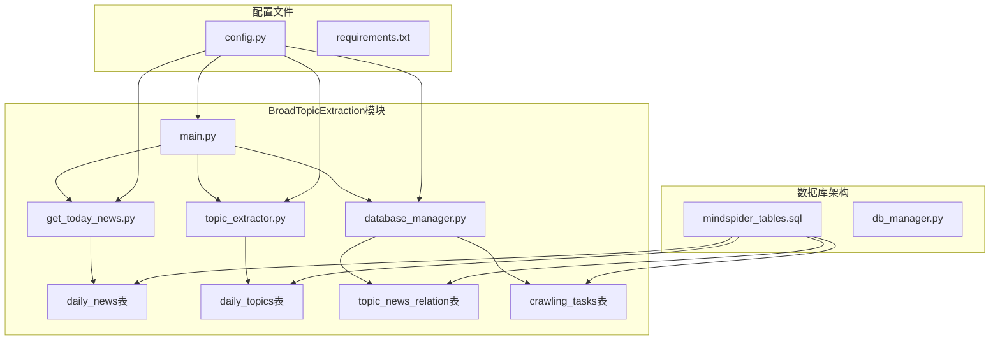
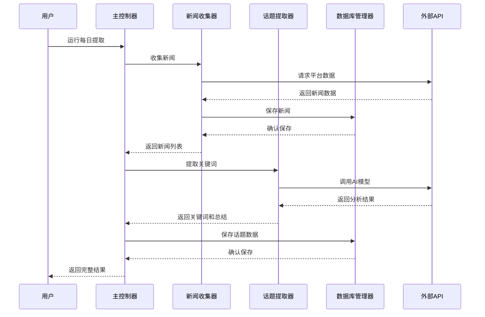
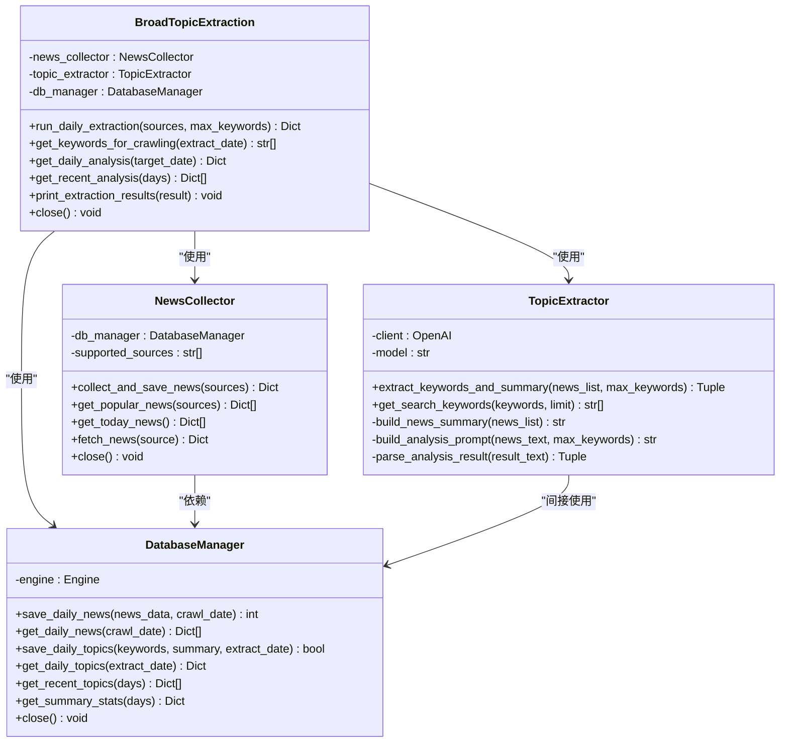
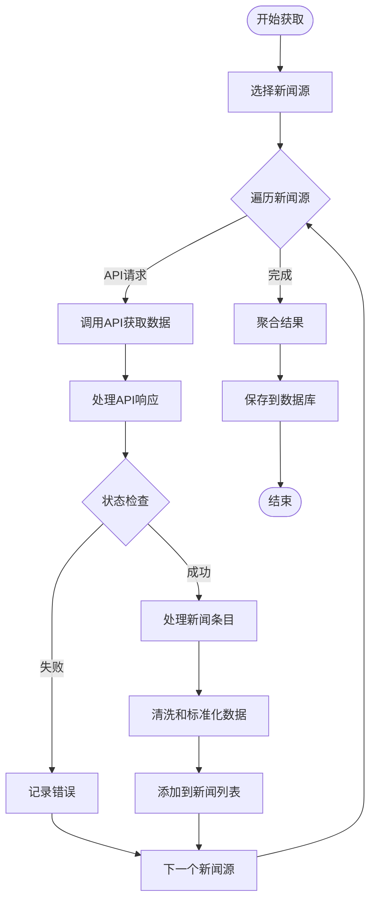
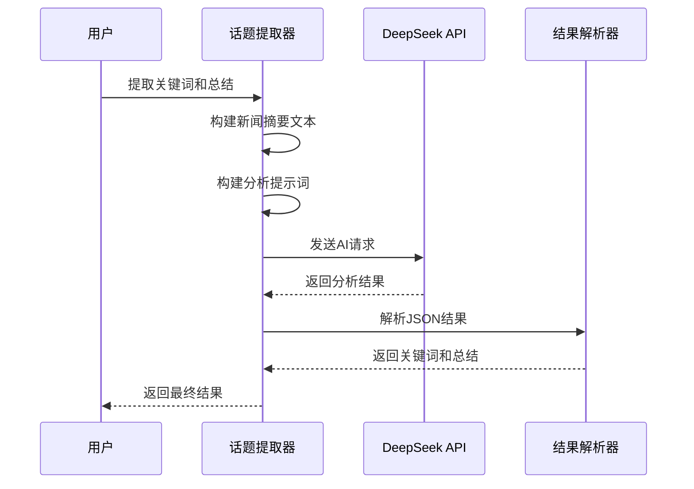
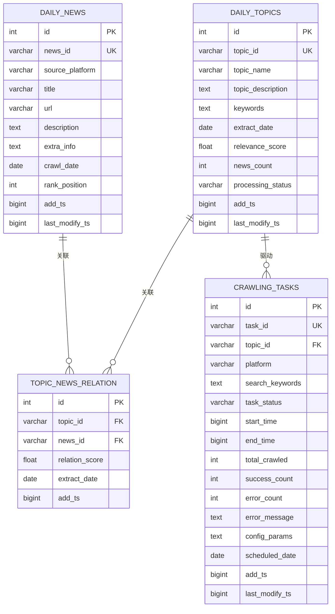
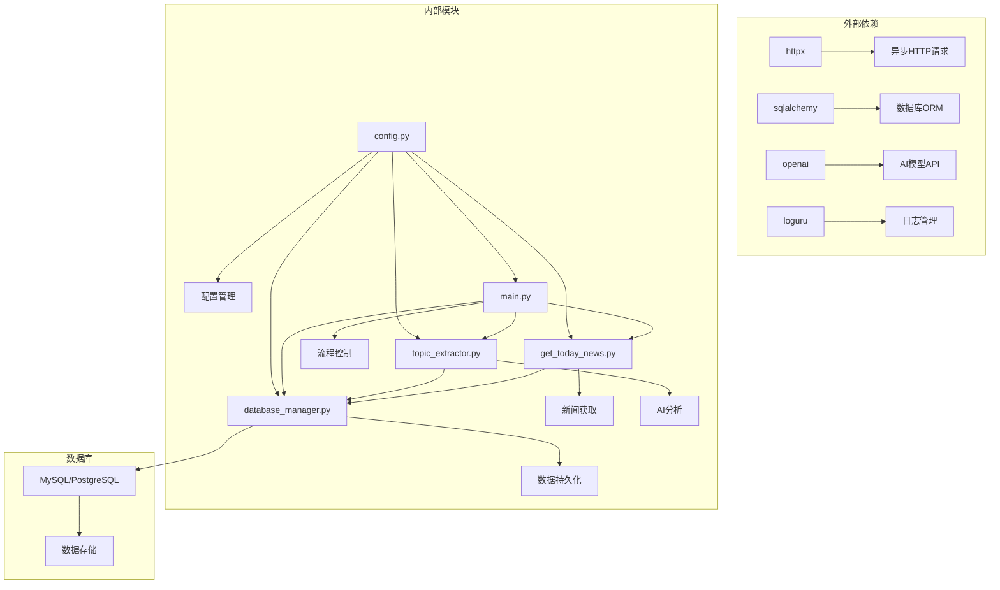

# BroadTopicExtraction 话题提取模块

<cite>
**本文档引用的文件**
- [main.py](file://MindSpider/BroadTopicExtraction/main.py)
- [get_today_news.py](file://MindSpider/BroadTopicExtraction/get_today_news.py)
- [topic_extractor.py](file://MindSpider/BroadTopicExtraction/topic_extractor.py)
- [database_manager.py](file://MindSpider/BroadTopicExtraction/database_manager.py)
- [config.py](file://MindSpider/config.py)
- [mindspider_tables.sql](file://MindSpider/schema/mindspider_tables.sql)
- [db_manager.py](file://MindSpider/schema/db_manager.py)
- [requirements.txt](file://MindSpider/requirements.txt)
- [README.md](file://MindSpider/README.md)
</cite>

## 目录
1. [简介](#简介)
2. [项目结构](#项目结构)
3. [核心组件](#核心组件)
4. [架构概览](#架构概览)
5. [详细组件分析](#详细组件分析)
6. [依赖关系分析](#依赖关系分析)
7. [性能考虑](#性能考虑)
8. [故障排除指南](#故障排除指南)
9. [结论](#结论)
10. [附录](#附录)

## 简介

BroadTopicExtraction（广话题提取）模块是MindSpider AI爬虫系统的核心组件之一，专门负责从多个社交媒体平台自动收集热点新闻并提取关键话题。该模块实现了完整的每日话题提取工作流程，包括新闻获取、AI分析、关键词提取、话题分类和数据存储等功能。

该模块支持13个主流社交媒体平台的热点新闻采集，包括微博热搜、知乎热榜、B站热搜、今日头条等，并通过DeepSeek AI模型进行智能分析，自动生成关键词和新闻总结。提取的结果会被安全地存储到MySQL数据库中，为后续的深度爬取模块提供数据支撑。

## 项目结构

BroadTopicExtraction模块位于MindSpider项目的核心目录中，采用清晰的模块化设计：



**图表来源**
- [main.py](file://MindSpider/BroadTopicExtraction/main.py#L1-L326)
- [get_today_news.py](file://MindSpider/BroadTopicExtraction/get_today_news.py#L1-L309)
- [topic_extractor.py](file://MindSpider/BroadTopicExtraction/topic_extractor.py#L1-L290)
- [database_manager.py](file://MindSpider/BroadTopicExtraction/database_manager.py#L1-L323)

**章节来源**
- [main.py](file://MindSpider/BroadTopicExtraction/main.py#L1-L50)
- [README.md](file://MindSpider/README.md#L31-L71)

## 核心组件

BroadTopicExtraction模块由四个核心组件构成，每个组件都有明确的职责和功能：

### 1. 主控制器 (BroadTopicExtraction)
- **职责**: 协调整个话题提取流程
- **功能**: 管理新闻收集器、话题提取器和数据库管理器的生命周期
- **特性**: 支持异步操作、资源管理和错误处理

### 2. 新闻收集器 (NewsCollector)
- **职责**: 从多个社交媒体平台获取热点新闻
- **功能**: 支持13个平台的API调用、数据处理和存储
- **特性**: 异步并发请求、错误恢复和数据清洗

### 3. 话题提取器 (TopicExtractor)
- **职责**: 使用AI模型提取关键词和生成新闻总结
- **功能**: 基于DeepSeek API的智能分析、JSON结果解析和回退机制
- **特性**: 支持多种输出格式、关键词过滤和质量控制

### 4. 数据库管理器 (DatabaseManager)
- **职责**: 管理新闻和话题数据的持久化存储
- **功能**: 支持MySQL和PostgreSQL、事务处理和查询优化
- **特性**: 唯一性约束、索引优化和批量操作

**章节来源**
- [main.py](file://MindSpider/BroadTopicExtraction/main.py#L29-L58)
- [get_today_news.py](file://MindSpider/BroadTopicExtraction/get_today_news.py#L45-L69)
- [topic_extractor.py](file://MindSpider/BroadTopicExtraction/topic_extractor.py#L25-L35)
- [database_manager.py](file://MindSpider/BroadTopicExtraction/database_manager.py#L29-L36)

## 架构概览

BroadTopicExtraction模块采用分层架构设计，实现了清晰的职责分离和良好的可扩展性：



**图表来源**
- [main.py](file://MindSpider/BroadTopicExtraction/main.py#L59-L155)
- [get_today_news.py](file://MindSpider/BroadTopicExtraction/get_today_news.py#L154-L208)
- [topic_extractor.py](file://MindSpider/BroadTopicExtraction/topic_extractor.py#L36-L81)

模块的架构特点：
- **异步并发**: 使用asyncio实现高效的网络请求和数据处理
- **模块化设计**: 每个组件职责单一，便于维护和测试
- **错误处理**: 完善的异常捕获和回退机制
- **配置驱动**: 通过环境变量和配置文件管理参数

## 详细组件分析

### 主控制器 (BroadTopicExtraction)

主控制器是整个模块的协调中心，负责管理其他组件的生命周期和工作流程：

#### 核心功能
- **初始化管理**: 创建和配置新闻收集器、话题提取器和数据库管理器
- **流程编排**: 协调三个主要步骤：新闻收集、话题提取、数据保存
- **资源管理**: 实现上下文管理器接口，确保资源正确释放
- **结果聚合**: 将各个组件的结果整合为统一的输出格式

#### 关键方法
- `run_daily_extraction()`: 执行完整的每日提取流程
- `get_keywords_for_crawling()`: 生成用于深度爬取的关键词
- `get_daily_analysis()`: 获取指定日期的分析结果
- `get_recent_analysis()`: 获取最近几天的分析结果



**图表来源**
- [main.py](file://MindSpider/BroadTopicExtraction/main.py#L29-L58)
- [get_today_news.py](file://MindSpider/BroadTopicExtraction/get_today_news.py#L45-L69)
- [topic_extractor.py](file://MindSpider/BroadTopicExtraction/topic_extractor.py#L25-L35)
- [database_manager.py](file://MindSpider/BroadTopicExtraction/database_manager.py#L29-L36)

**章节来源**
- [main.py](file://MindSpider/BroadTopicExtraction/main.py#L29-L233)

### 新闻获取机制 (NewsCollector)

新闻收集器负责从13个不同的社交媒体平台获取热点新闻数据：

#### 支持的新闻源
模块支持以下13个主要新闻源：
- 微博热搜 (weibo)
- 知乎热榜 (zhihu)
- B站热搜 (bilibili-hot-search)
- 今日头条 (toutiao)
- 抖音热榜 (douyin)
- GitHub趋势 (github-trending-today)
- 酷安热榜 (coolapk)
- 百度贴吧 (tieba)
- 华尔街见闻 (wallstreetcn)
- 澎湃新闻 (thepaper)
- 财联社 (cls-hot)
- 雪球热榜 (xueqiu)

#### 数据获取流程


**图表来源**
- [get_today_news.py](file://MindSpider/BroadTopicExtraction/get_today_news.py#L122-L151)
- [get_today_news.py](file://MindSpider/BroadTopicExtraction/get_today_news.py#L209-L241)

#### 数据处理策略
- **标题清洗**: 移除特殊字符和多余空格
- **ID生成**: 创建全局唯一的新闻ID
- **数据标准化**: 统一数据格式和字段结构
- **错误处理**: 对异常数据进行降级处理

**章节来源**
- [get_today_news.py](file://MindSpider/BroadTopicExtraction/get_today_news.py#L30-L43)
- [get_today_news.py](file://MindSpider/BroadTopicExtraction/get_today_news.py#L154-L208)

### 话题提取算法 (TopicExtractor)

话题提取器使用DeepSeek AI模型进行智能分析，实现关键词提取和新闻总结生成：

#### AI分析流程


**图表来源**
- [topic_extractor.py](file://MindSpider/BroadTopicExtraction/topic_extractor.py#L36-L81)

#### 关键词提取策略
1. **AI主导**: 使用DeepSeek模型进行智能分析
2. **JSON格式**: 强制要求AI输出标准JSON格式
3. **回退机制**: 当AI失败时使用简单关键词提取
4. **质量控制**: 过滤重复、过短或过长的关键词

#### 提示词工程
提示词包含以下关键要素：
- **任务描述**: 明确提取关键词和生成总结的要求
- **数据格式**: 规定输入新闻列表的格式
- **输出规范**: 要求严格的JSON输出格式
- **质量标准**: 设定关键词长度、数量和相关性的要求

**章节来源**
- [topic_extractor.py](file://MindSpider/BroadTopicExtraction/topic_extractor.py#L36-L171)

### 数据库管理功能 (DatabaseManager)

数据库管理器提供完整的数据持久化解决方案，支持MySQL和PostgreSQL两种数据库：

#### 数据表设计


**图表来源**
- [mindspider_tables.sql](file://MindSpider/schema/mindspider_tables.sql#L12-L54)

#### 数据存储策略
- **覆盖模式**: 每天重新获取新闻，覆盖前一天的数据
- **唯一性保证**: 通过复合主键确保数据唯一性
- **索引优化**: 为常用查询字段建立索引
- **事务处理**: 使用事务确保数据一致性

**章节来源**
- [database_manager.py](file://MindSpider/BroadTopicExtraction/database_manager.py#L75-L142)
- [database_manager.py](file://MindSpider/BroadTopicExtraction/database_manager.py#L166-L215)

## 依赖关系分析

BroadTopicExtraction模块的依赖关系体现了清晰的分层架构：



**图表来源**
- [requirements.txt](file://MindSpider/requirements.txt#L7-L34)
- [config.py](file://MindSpider/config.py#L16-L35)

### 核心依赖分析

#### 数据库依赖
- **SQLAlchemy**: 提供ORM功能和数据库连接管理
- **MySQL驱动**: 支持MySQL数据库连接
- **PostgreSQL驱动**: 支持PostgreSQL数据库连接

#### 网络依赖
- **HTTPX**: 异步HTTP客户端，支持超时和重定向
- **Cryptography**: 提供加密和安全功能

#### AI依赖
- **OpenAI SDK**: 与DeepSeek API集成
- **Pydantic**: 数据验证和配置管理

#### 工具依赖
- **Loguru**: 现代化的日志记录
- **Regex**: 高级正则表达式支持
- **NumPy/Pandas**: 数据处理和分析

**章节来源**
- [requirements.txt](file://MindSpider/requirements.txt#L1-L63)
- [config.py](file://MindSpider/config.py#L16-L35)

## 性能考虑

BroadTopicExtraction模块在设计时充分考虑了性能优化：

### 异步并发处理
- **异步请求**: 使用httpx的AsyncClient实现并发HTTP请求
- **批量操作**: 数据库操作采用批量插入减少往返次数
- **资源池**: 利用连接池提高数据库访问效率

### 内存优化
- **流式处理**: 大数据量时采用分批处理
- **及时释放**: 确保临时对象及时垃圾回收
- **内存监控**: 定期检查内存使用情况

### 网络优化
- **超时控制**: 设置合理的请求超时时间
- **重试机制**: 对临时性错误进行自动重试
- **连接复用**: 复用HTTP连接减少开销

### 数据库优化
- **索引策略**: 为高频查询字段建立适当索引
- **查询优化**: 使用参数化查询防止SQL注入
- **事务管理**: 合理使用事务边界

## 故障排除指南

### 常见问题及解决方案

#### 1. 数据库连接失败
**症状**: 启动时出现数据库连接错误
**原因**: 
- 数据库配置不正确
- 缺少数据库驱动
- 网络连接问题

**解决方案**:
- 检查config.py中的数据库配置
- 安装相应的数据库驱动
- 验证网络连通性和防火墙设置

#### 2. AI API调用失败
**症状**: 话题提取阶段报错
**原因**:
- API密钥无效
- 网络连接问题
- API配额不足

**解决方案**:
- 验证MINDSPIDER_API_KEY配置
- 检查网络连接状态
- 确认API配额和使用情况

#### 3. 新闻获取超时
**症状**: 新闻收集阶段长时间无响应
**原因**:
- 平台API不稳定
- 网络延迟过高
- 请求频率过高

**解决方案**:
- 增加超时时间设置
- 实施指数退避重试
- 减少并发请求数量

#### 4. 数据重复问题
**症状**: 数据库中出现重复记录
**原因**:
- 唯一性约束未生效
- 时间戳处理错误
- ID生成冲突

**解决方案**:
- 检查数据库索引设置
- 验证时间戳精度
- 改进ID生成算法

**章节来源**
- [database_manager.py](file://MindSpider/BroadTopicExtraction/database_manager.py#L47-L59)
- [topic_extractor.py](file://MindSpider/BroadTopicExtraction/topic_extractor.py#L75-L81)
- [get_today_news.py](file://MindSpider/BroadTopicExtraction/get_today_news.py#L100-L121)

## 结论

BroadTopicExtraction模块是一个设计精良、功能完整的AI话题提取系统。它通过模块化的设计、完善的错误处理机制和优化的性能策略，为MindSpider的整体架构提供了坚实的基础。

该模块的主要优势包括：
- **高度模块化**: 清晰的职责分离和接口设计
- **强大的扩展性**: 支持新增新闻源和爬虫平台
- **完善的错误处理**: 多层次的异常捕获和回退机制
- **性能优化**: 异步并发和数据库优化策略
- **易于维护**: 清晰的代码结构和详细的文档

未来可以考虑的改进方向：
- 增加更多的AI模型支持
- 实现增量更新机制
- 添加数据可视化功能
- 优化关键词提取算法

## 附录

### 配置参数说明

#### 数据库配置
- `DB_DIALECT`: 数据库类型 (mysql/postgresql)
- `DB_HOST`: 数据库主机地址
- `DB_PORT`: 数据库端口号
- `DB_USER`: 数据库用户名
- `DB_PASSWORD`: 数据库密码
- `DB_NAME`: 数据库名称
- `DB_CHARSET`: 数据库字符集

#### AI配置
- `MINDSPIDER_API_KEY`: AI模型API密钥
- `MINDSPIDER_BASE_URL`: AI模型基础URL
- `MINDSPIDER_MODEL_NAME`: AI模型名称

### 使用示例

#### 基本使用
```bash
# 运行完整的每日提取流程
python main.py --broad-topic

# 指定新闻源和关键词数量
python main.py --broad-topic --sources weibo zhihu --keywords 50
```

#### 高级功能
```bash
# 查看支持的新闻源
python main.py --list-sources

# 简化输出模式
python main.py --broad-topic --quiet

# 获取特定日期的分析结果
python main.py --broad-topic --date 2024-01-15
```

### 最佳实践

1. **配置管理**: 使用.env文件管理敏感配置
2. **错误监控**: 实施全面的日志记录和错误报告
3. **性能监控**: 定期检查系统性能指标
4. **数据备份**: 建立定期的数据备份策略
5. **安全防护**: 实施适当的访问控制和数据保护