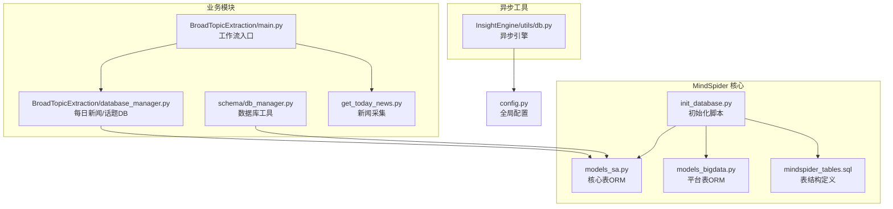
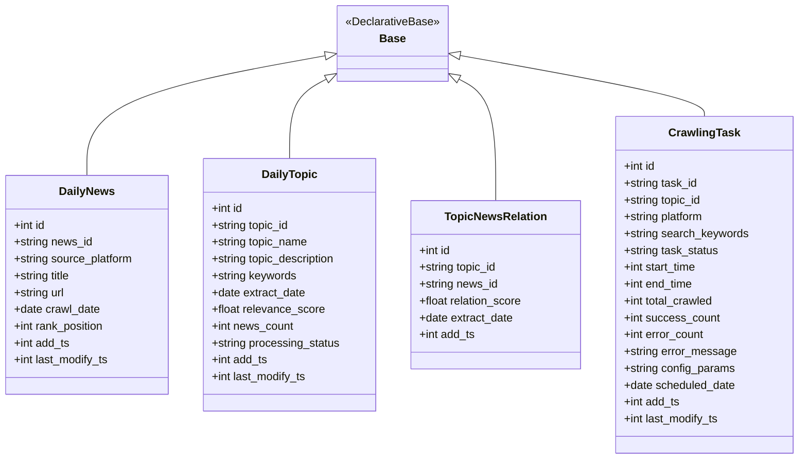
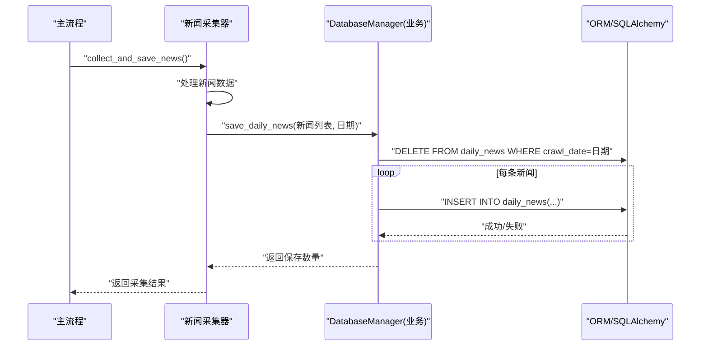
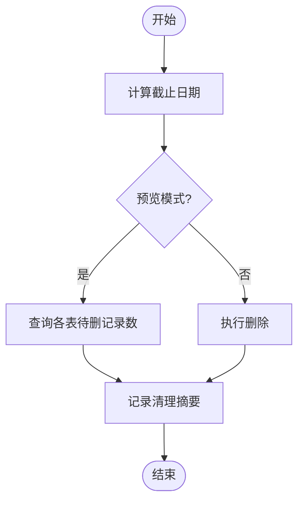
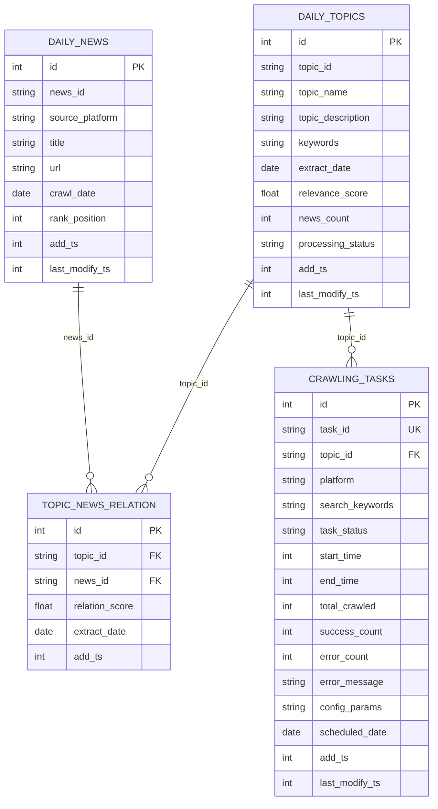
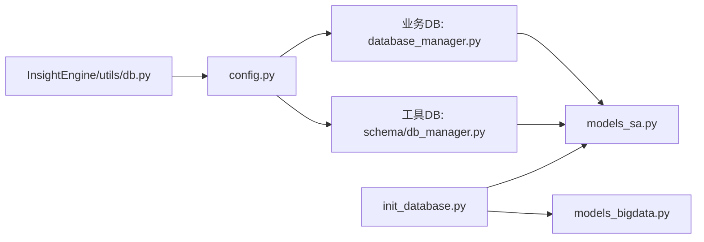

# DatabaseManager 数据库管理模块

<cite>
**本文档引用的文件**
- [MindSpider/schema/db_manager.py](file://MindSpider/schema/db_manager.py)
- [MindSpider/BroadTopicExtraction/database_manager.py](file://MindSpider/BroadTopicExtraction/database_manager.py)
- [MindSpider/schema/models_sa.py](file://MindSpider/schema/models_sa.py)
- [MindSpider/schema/models_bigdata.py](file://MindSpider/schema/models_bigdata.py)
- [MindSpider/schema/init_database.py](file://MindSpider/schema/init_database.py)
- [MindSpider/schema/mindspider_tables.sql](file://MindSpider/schema/mindspider_tables.sql)
- [MindSpider/BroadTopicExtraction/main.py](file://MindSpider/BroadTopicExtraction/main.py)
- [MindSpider/BroadTopicExtraction/get_today_news.py](file://MindSpider/BroadTopicExtraction/get_today_news.py)
- [InsightEngine/utils/db.py](file://InsightEngine/utils/db.py)
- [config.py](file://config.py)
</cite>

## 目录
1. [简介](#简介)
2. [项目结构](#项目结构)
3. [核心组件](#核心组件)
4. [架构概览](#架构概览)
5. [详细组件分析](#详细组件分析)
6. [依赖分析](#依赖分析)
7. [性能考虑](#性能考虑)
8. [故障排查指南](#故障排查指南)
9. [结论](#结论)
10. [附录](#附录)

## 简介
本文件面向 MindSpider 项目的 DatabaseManager 数据库管理模块，系统性梳理数据库操作的核心实现，包括每日话题数据存储、历史数据分析查询、数据表结构设计、事务管理机制。文档还涵盖数据插入流程、查询优化策略、索引设计原则、数据备份恢复机制、连接池配置、并发访问控制、错误处理策略、性能监控方法，并提供数据库 schema 设计、SQL 优化技巧和运维管理指南。

## 项目结构
MindSpider 的数据库相关代码分布在多个子模块：
- 核心表与 ORM：MindSpider/schema 下的 models_sa.py、models_bigdata.py、mindspider_tables.sql、init_database.py
- 业务数据库管理：MindSpider/BroadTopicExtraction/database_manager.py（每日新闻/话题存取）
- 工具数据库管理：MindSpider/schema/db_manager.py（数据库状态查看、统计、清理）
- 异步数据库工具：InsightEngine/utils/db.py（异步连接与查询）
- 全局配置：config.py（数据库连接参数）

图表来源
- [MindSpider/schema/models_sa.py](file://MindSpider/schema/models_sa.py#L1-L127)
- [MindSpider/schema/models_bigdata.py](file://MindSpider/schema/models_bigdata.py#L1-L468)
- [MindSpider/schema/init_database.py](file://MindSpider/schema/init_database.py#L1-L121)
- [MindSpider/schema/mindspider_tables.sql](file://MindSpider/schema/mindspider_tables.sql#L1-L202)
- [MindSpider/BroadTopicExtraction/database_manager.py](file://MindSpider/BroadTopicExtraction/database_manager.py#L1-L323)
- [MindSpider/schema/db_manager.py](file://MindSpider/schema/db_manager.py#L1-L299)
- [MindSpider/BroadTopicExtraction/main.py](file://MindSpider/BroadTopicExtraction/main.py#L1-L326)
- [MindSpider/BroadTopicExtraction/get_today_news.py](file://MindSpider/BroadTopicExtraction/get_today_news.py#L1-L309)
- [InsightEngine/utils/db.py](file://InsightEngine/utils/db.py#L1-L73)
- [config.py](file://config.py#L1-L136)

章节来源
- [MindSpider/schema/db_manager.py](file://MindSpider/schema/db_manager.py#L1-L299)
- [MindSpider/BroadTopicExtraction/database_manager.py](file://MindSpider/BroadTopicExtraction/database_manager.py#L1-L323)
- [MindSpider/schema/models_sa.py](file://MindSpider/schema/models_sa.py#L1-L127)
- [MindSpider/schema/models_bigdata.py](file://MindSpider/schema/models_bigdata.py#L1-L468)
- [MindSpider/schema/init_database.py](file://MindSpider/schema/init_database.py#L1-L121)
- [MindSpider/schema/mindspider_tables.sql](file://MindSpider/schema/mindspider_tables.sql#L1-L202)
- [InsightEngine/utils/db.py](file://InsightEngine/utils/db.py#L1-L73)
- [config.py](file://config.py#L1-L136)

## 核心组件
- DatabaseManager（业务侧）：提供每日新闻与话题的存取、统计查询、近期数据展示。
- DatabaseManager（工具侧）：提供数据库表清单、统计数据、近期数据、旧数据清理。
- ORM 层：models_sa.py 定义核心表（daily_news、daily_topics、topic_news_relation、crawling_tasks），models_bigdata.py 定义平台内容表及外键关联。
- 初始化脚本：init_database.py 基于 ORM 自动创建表与视图。
- 异步工具：InsightEngine/utils/db.py 提供异步连接与查询封装。
- 配置：config.py 提供数据库连接参数（方言、主机、端口、用户、密码、库名、字符集）。

章节来源
- [MindSpider/BroadTopicExtraction/database_manager.py](file://MindSpider/BroadTopicExtraction/database_manager.py#L29-L323)
- [MindSpider/schema/db_manager.py](file://MindSpider/schema/db_manager.py#L30-L299)
- [MindSpider/schema/models_sa.py](file://MindSpider/schema/models_sa.py#L31-L127)
- [MindSpider/schema/models_bigdata.py](file://MindSpider/schema/models_bigdata.py#L18-L468)
- [MindSpider/schema/init_database.py](file://MindSpider/schema/init_database.py#L100-L121)
- [InsightEngine/utils/db.py](file://InsightEngine/utils/db.py#L28-L73)
- [config.py](file://config.py#L33-L40)

## 架构概览
数据库层采用 SQLAlchemy 2.x，支持 MySQL 与 PostgreSQL。核心表通过 models_sa.py 定义，平台内容表通过 models_bigdata.py 定义，两者共享同一 Base 以保证外键引用正确。初始化脚本自动创建表与视图，工具侧 DatabaseManager 提供数据库状态与清理能力，业务侧 DatabaseManager 负责每日新闻与话题的存取。

图表来源
- [MindSpider/schema/models_sa.py](file://MindSpider/schema/models_sa.py#L27-L127)

章节来源
- [MindSpider/schema/models_sa.py](file://MindSpider/schema/models_sa.py#L1-L127)

## 详细组件分析

### 业务侧 DatabaseManager（每日新闻/话题）
职责与特性
- 连接管理：根据配置选择 MySQL 或 PostgreSQL，支持异常驱动缺失场景。
- 新闻存取：支持覆盖式保存当日新闻，逐条插入并记录失败；提供按日期查询。
- 话题存取：支持按日期保存/更新每日话题分析，JSON 存储关键词与摘要；提供按日期与近期查询。
- 统计查询：提供近期新闻与话题统计摘要。
- 资源管理：上下文管理器支持自动关闭连接。

数据插入流程（覆盖式）
- 删除当日已存在记录（事务内）
- 逐条插入新闻，每条独立事务，失败不影响其他条目
- 插入字段包含去重 ID、来源平台、标题、URL、爬取日期、排名、时间戳

查询优化策略
- 按日期与平台建立索引，支持快速过滤
- JSON 字段关键词存储，便于后续分析
- 近期统计查询使用分组与聚合，减少全表扫描

事务管理机制
- 使用 engine.begin() 开启事务，确保删除与插入原子性
- 单条新闻插入失败不影响整体流程

图表来源
- [MindSpider/BroadTopicExtraction/get_today_news.py](file://MindSpider/BroadTopicExtraction/get_today_news.py#L154-L208)
- [MindSpider/BroadTopicExtraction/database_manager.py](file://MindSpider/BroadTopicExtraction/database_manager.py#L75-L142)

章节来源
- [MindSpider/BroadTopicExtraction/database_manager.py](file://MindSpider/BroadTopicExtraction/database_manager.py#L29-L323)
- [MindSpider/BroadTopicExtraction/get_today_news.py](file://MindSpider/BroadTopicExtraction/get_today_news.py#L154-L208)

### 工具侧 DatabaseManager（数据库状态/统计/清理）
职责与特性
- 显示表清单：区分 MindSpider 核心表与 MediaCrawler 平台表，统计各表记录数
- 数据统计：新闻总量、覆盖天数、平台数；话题总数、提取天数；任务总数与状态分布；平台内容统计
- 近期数据：按日期分组统计每日新闻与话题数量
- 旧数据清理：支持预览与执行两种模式，按日期阈值删除历史数据

清理流程（预览/执行）
- 计算截止日期
- 查询待删记录数（预览）
- 可选执行删除（事务内）

图表来源
- [MindSpider/schema/db_manager.py](file://MindSpider/schema/db_manager.py#L228-L262)

章节来源
- [MindSpider/schema/db_manager.py](file://MindSpider/schema/db_manager.py#L54-L262)

### ORM 与表结构设计
核心表与索引
- daily_news：唯一索引（news_id, source_platform, crawl_date），索引（crawl_date, source_platform, rank_position）
- daily_topics：唯一索引（topic_id, extract_date），索引（extract_date, processing_status, relevance_score）
- topic_news_relation：唯一索引（topic_id, news_id, extract_date），索引（topic_id, news_id, extract_date），外键约束
- crawling_tasks：唯一索引（task_id），索引（topic_id, platform, task_status, scheduled_date），外键约束

平台内容表（models_bigdata.py）
- bilibili_video、douyin_aweme、kuaishou_video、weibo_note、tieba_note、zhihu_content 等
- 增加 topic_id、crawling_task_id 字段，支持与 daily_topics、crawling_tasks 外键关联

初始化脚本
- 自动创建所有表与视图
- 支持 MySQL 与 PostgreSQL
- 视图为可选，提供话题爬取统计与每日汇总视图

图表来源
- [MindSpider/schema/models_sa.py](file://MindSpider/schema/models_sa.py#L31-L127)

章节来源
- [MindSpider/schema/models_sa.py](file://MindSpider/schema/models_sa.py#L31-L127)
- [MindSpider/schema/models_bigdata.py](file://MindSpider/schema/models_bigdata.py#L18-L468)
- [MindSpider/schema/init_database.py](file://MindSpider/schema/init_database.py#L61-L114)
- [MindSpider/schema/mindspider_tables.sql](file://MindSpider/schema/mindspider_tables.sql#L12-L106)

### 异步数据库工具（InsightEngine）
- 提供异步连接与查询封装，支持 MySQL 与 PostgreSQL
- 连接池配置：pool_pre_ping、pool_recycle
- fetch_all 提供只读查询并返回字典列表

章节来源
- [InsightEngine/utils/db.py](file://InsightEngine/utils/db.py#L28-L73)

## 依赖分析
- DatabaseManager（业务侧）依赖 config.settings 提供数据库连接参数，使用 SQLAlchemy 2.x ORM 操作核心表
- DatabaseManager（工具侧）依赖 SQLAlchemy Inspector 与 text 查询进行元数据与统计
- 初始化脚本依赖 models_sa 与 models_bigdata，统一 Base 以确保外键正确
- 异步工具与业务侧并行存在，分别满足不同场景的连接需求

图表来源
- [config.py](file://config.py#L33-L40)
- [MindSpider/BroadTopicExtraction/database_manager.py](file://MindSpider/BroadTopicExtraction/database_manager.py#L37-L59)
- [MindSpider/schema/db_manager.py](file://MindSpider/schema/db_manager.py#L35-L47)
- [MindSpider/schema/init_database.py](file://MindSpider/schema/init_database.py#L22-L26)
- [InsightEngine/utils/db.py](file://InsightEngine/utils/db.py#L17-L18)

章节来源
- [config.py](file://config.py#L33-L40)
- [MindSpider/BroadTopicExtraction/database_manager.py](file://MindSpider/BroadTopicExtraction/database_manager.py#L21-L26)
- [MindSpider/schema/db_manager.py](file://MindSpider/schema/db_manager.py#L22-L28)
- [MindSpider/schema/init_database.py](file://MindSpider/schema/init_database.py#L34-L34)
- [InsightEngine/utils/db.py](file://InsightEngine/utils/db.py#L17-L18)

## 性能考虑
- 连接池与超时
  - 异步工具设置 pool_pre_ping 与 pool_recycle，提升连接稳定性
  - 建议在生产环境根据 QPS 调整连接池大小与回收策略
- 索引设计
  - 核心表按常用查询维度建立索引（日期、平台、状态、排名）
  - 复合索引优化常见分组与过滤（如 topic_id+platform+status）
- 查询优化
  - 使用分组聚合统计近期数据，避免全表扫描
  - JSON 字段关键词存储便于后续分析，注意避免过度复杂 JSON 结构
- 写入优化
  - 覆盖式插入先删除再插入，保证幂等性
  - 单条插入失败不影响整体流程，提高容错性
- 视图与统计
  - 初始化脚本提供视图，减少重复 SQL 复杂度
  - 建议定期维护统计视图以提升查询效率

[本节为通用性能指导，不直接分析具体文件]

## 故障排查指南
- 驱动缺失
  - PostgreSQL：缺少 psycopg；MySQL：缺少 pymysql
  - 错误信息明确提示安装方式与依赖包名
- 连接失败
  - 检查 config.py 中 DB_* 参数是否正确
  - 确认数据库服务可达、账号权限与字符集设置
- 事务异常
  - 单条插入失败不会影响其他条目，检查日志定位问题
  - 确保唯一索引与外键约束不冲突
- 清理风险
  - 预览模式不删除数据，确认待删数量后再执行
  - 建议在低峰期执行清理并做好备份

章节来源
- [MindSpider/BroadTopicExtraction/database_manager.py](file://MindSpider/BroadTopicExtraction/database_manager.py#L47-L59)
- [MindSpider/schema/db_manager.py](file://MindSpider/schema/db_manager.py#L228-L262)
- [config.py](file://config.py#L33-L40)

## 结论
DatabaseManager 模块通过清晰的职责划分与完善的 ORM 设计，实现了每日新闻与话题数据的可靠存取、统计查询与数据库运维管理。结合索引与视图设计、事务与异常处理策略，能够在高并发与大数据量场景下保持稳定与高效。建议在生产环境中配合连接池参数调优、定期清理策略与备份恢复机制，持续保障系统可靠性。

[本节为总结性内容，不直接分析具体文件]

## 附录

### 数据库连接池配置建议
- 连接池大小：根据并发请求数与数据库承载能力设定
- pool_pre_ping：启用连接健康检查，降低连接失效风险
- pool_recycle：合理设置回收周期，避免长时间占用导致资源泄漏
- 异步连接：InsightEngine 工具侧已内置连接池配置，业务侧可按需复用

章节来源
- [InsightEngine/utils/db.py](file://InsightEngine/utils/db.py#L53-L58)

### 索引设计原则
- 唯一索引：保证关键字段组合唯一性（如 news_id+source_platform+crawl_date）
- 单列索引：按查询频率与过滤效果建立（如 crawl_date、source_platform、extract_date）
- 复合索引：针对常见分组与过滤组合（如 topic_id+platform+status）
- 外键索引：确保关联查询性能（topic_id、news_id）

章节来源
- [MindSpider/schema/models_sa.py](file://MindSpider/schema/models_sa.py#L33-L106)

### SQL 优化技巧
- 使用 LIMIT 控制结果集大小
- 避免 SELECT *，仅查询必要字段
- 利用 EXPLAIN 分析慢查询
- 合理使用索引提示与覆盖索引
- 对 JSON 字段查询谨慎使用 LIKE，优先结构化字段

[本节为通用优化建议，不直接分析具体文件]

### 运维管理指南
- 定期备份：建议每日全量备份与增量备份结合
- 清理策略：按业务需求设置历史数据保留期限
- 监控指标：连接数、查询延迟、锁等待、慢查询数量
- 版本升级：通过 init_database 脚本迁移表结构，确保外键与索引一致性

[本节为通用运维建议，不直接分析具体文件]