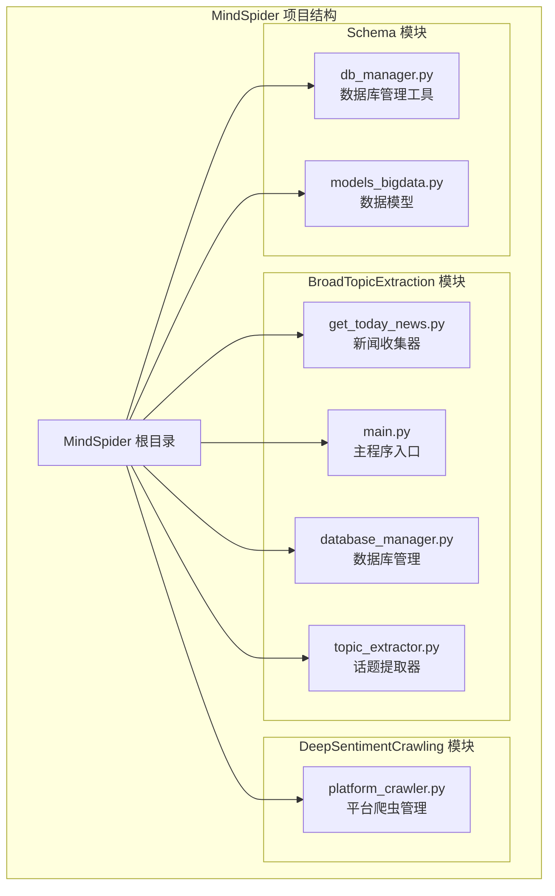
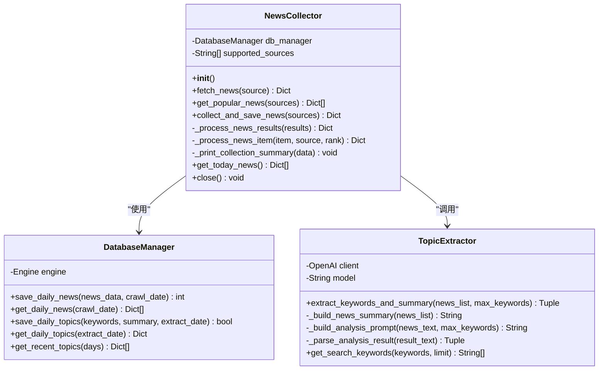
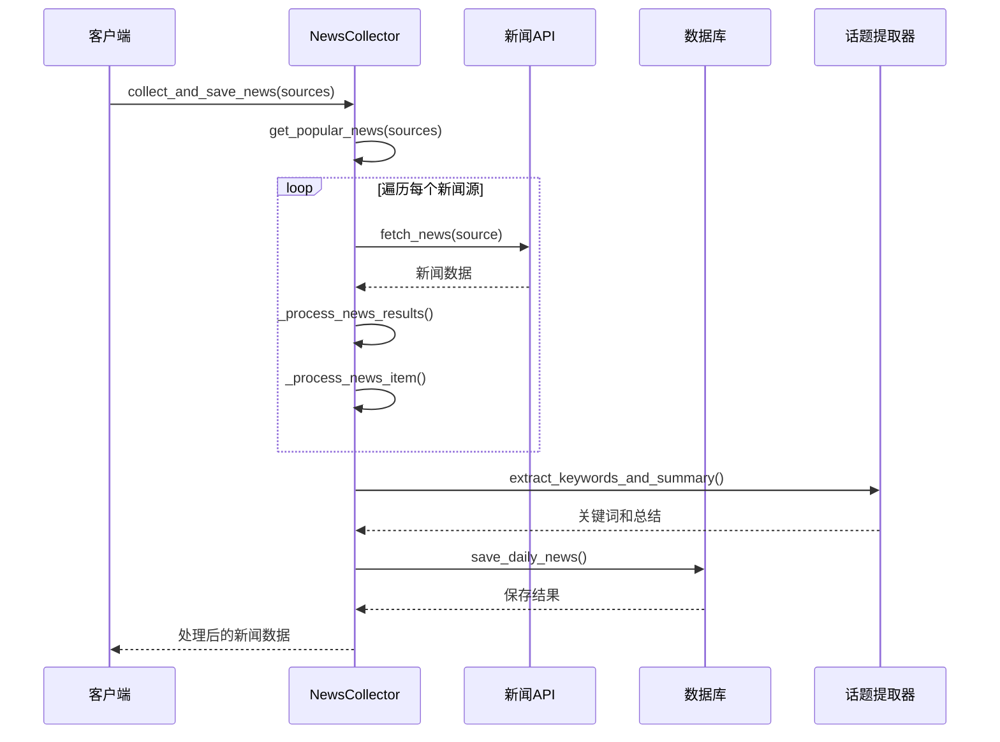
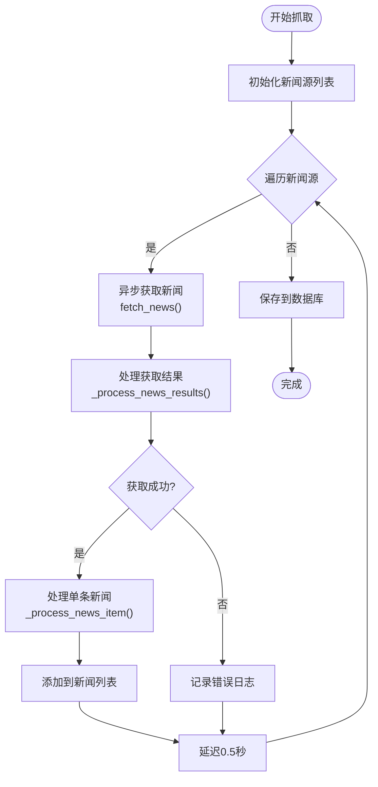
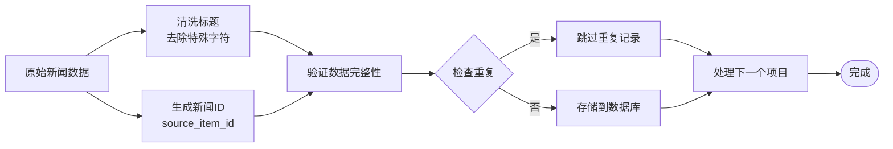
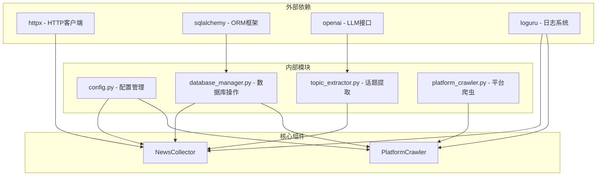

# NewsCollector 新闻收集模块

<cite>
**本文档引用的文件**
- [get_today_news.py](file://MindSpider/BroadTopicExtraction/get_today_news.py)
- [main.py](file://MindSpider/BroadTopicExtraction/main.py)
- [database_manager.py](file://MindSpider/BroadTopicExtraction/database_manager.py)
- [topic_extractor.py](file://MindSpider/BroadTopicExtraction/topic_extractor.py)
- [platform_crawler.py](file://MindSpider/DeepSentimentCrawling/platform_crawler.py)
- [config.py](file://MindSpider/config.py)
- [db_manager.py](file://MindSpider/schema/db_manager.py)
- [models_bigdata.py](file://MindSpider/schema/models_bigdata.py)
</cite>

## 目录
1. [简介](#简介)
2. [项目结构](#项目结构)
3. [核心组件](#核心组件)
4. [架构概览](#架构概览)
5. [详细组件分析](#详细组件分析)
6. [依赖关系分析](#依赖关系分析)
7. [性能考虑](#性能考虑)
8. [故障排除指南](#故障排除指南)
9. [结论](#结论)
10. [附录](#附录)

## 简介

NewsCollector 是 MindSpider 项目中的核心新闻收集模块，负责从多个新闻平台收集热点内容、进行数据处理和存储。该模块采用异步架构设计，支持多平台新闻源集成，具备完善的错误处理机制和数据去重逻辑。

该模块主要分为两个核心功能区域：
- **新闻收集层**：通过 API 接口从各新闻平台获取最新内容
- **数据处理层**：对收集到的新闻进行清洗、去重和存储

## 项目结构

MindSpider 项目采用模块化架构，NewsCollector 位于 BroadTopicExtraction 子模块中：



**图表来源**
- [get_today_news.py](file://MindSpider/BroadTopicExtraction/get_today_news.py#L1-L309)
- [main.py](file://MindSpider/BroadTopicExtraction/main.py#L1-L326)
- [platform_crawler.py](file://MindSpider/DeepSentimentCrawling/platform_crawler.py#L1-L491)

**章节来源**
- [get_today_news.py](file://MindSpider/BroadTopicExtraction/get_today_news.py#L1-L50)
- [main.py](file://MindSpider/BroadTopicExtraction/main.py#L1-L40)

## 核心组件

### 新闻收集器 (NewsCollector)

NewsCollector 是整个模块的核心类，负责协调各个新闻平台的数据收集工作：



**图表来源**
- [get_today_news.py](file://MindSpider/BroadTopicExtraction/get_today_news.py#L45-L291)
- [database_manager.py](file://MindSpider/BroadTopicExtraction/database_manager.py#L29-L323)
- [topic_extractor.py](file://MindSpider/BroadTopicExtraction/topic_extractor.py#L25-L290)

### 支持的新闻平台

模块内置了完整的新闻平台支持系统，通过 SOURCE_NAMES 配置实现：

| 平台代码 | 中文名称 | 平台代码 | 中文名称 |
|---------|---------|---------|---------|
| weibo | 微博热搜 | zhihu | 知乎热榜 |
| bilibili-hot-search | B站热搜 | toutiao | 今日头条 |
| douyin | 抖音热榜 | github-trending-today | GitHub趋势 |
| coolapk | 酷安热榜 | tieba | 百度贴吧 |
| wallstreetcn | 华尔街见闻 | thepaper | 澎湃新闻 |
| cls-hot | 财联社 | xueqiu | 雪球热榜 |

**章节来源**
- [get_today_news.py](file://MindSpider/BroadTopicExtraction/get_today_news.py#L29-L43)

## 架构概览

NewsCollector 采用分层架构设计，实现了清晰的职责分离：



**图表来源**
- [get_today_news.py](file://MindSpider/BroadTopicExtraction/get_today_news.py#L122-L208)
- [topic_extractor.py](file://MindSpider/BroadTopicExtraction/topic_extractor.py#L36-L81)

## 详细组件分析

### 异步新闻抓取算法

NewsCollector 实现了高效的异步抓取机制：



**图表来源**
- [get_today_news.py](file://MindSpider/BroadTopicExtraction/get_today_news.py#L72-L150)

#### 错误处理机制

模块实现了多层次的错误处理策略：

1. **网络请求错误处理**：捕获 TimeoutException 和 HTTPStatusError
2. **数据处理错误处理**：捕获通用异常并返回标准化错误信息
3. **数据库操作错误处理**：使用事务确保数据一致性

#### 新闻去重和清洗逻辑



**图表来源**
- [get_today_news.py](file://MindSpider/BroadTopicExtraction/get_today_news.py#L242-L272)

**章节来源**
- [get_today_news.py](file://MindSpider/BroadTopicExtraction/get_today_news.py#L72-L121)

### 数据存储格式

模块采用标准化的数据存储格式：

#### 新闻数据表结构

| 字段名 | 类型 | 描述 | 约束 |
|--------|------|------|------|
| news_id | VARCHAR(255) | 新闻唯一标识 | PRIMARY KEY |
| source_platform | VARCHAR(50) | 新闻来源平台 | NOT NULL |
| title | TEXT | 新闻标题 | NOT NULL |
| url | TEXT | 新闻链接 | |
| crawl_date | DATE | 爬取日期 | NOT NULL |
| rank_position | INT | 排名位置 | |
| add_ts | INT | 添加时间戳 | NOT NULL |
| last_modify_ts | INT | 最后修改时间戳 | NOT NULL |

#### 话题分析表结构

| 字段名 | 类型 | 描述 | 约束 |
|--------|------|------|------|
| extract_date | DATE | 提取日期 | PRIMARY KEY |
| topic_id | VARCHAR(64) | 话题唯一标识 | NOT NULL |
| topic_name | VARCHAR(100) | 话题名称 | NOT NULL |
| keywords | JSON | 关键词列表 | NOT NULL |
| topic_description | TEXT | 话题描述 | NOT NULL |
| add_ts | INT | 添加时间戳 | NOT NULL |
| last_modify_ts | INT | 最后修改时间戳 | NOT NULL |

**章节来源**
- [database_manager.py](file://MindSpider/BroadTopicExtraction/database_manager.py#L75-L142)
- [database_manager.py](file://MindSpider/BroadTopicExtraction/database_manager.py#L166-L214)

### 并发控制和性能优化

#### 并发控制策略

1. **异步并发**：使用 asyncio 实现异步非阻塞请求
2. **请求限速**：每个请求间添加 0.5 秒延迟避免过度请求
3. **数据库连接池**：使用 SQLAlchemy 引擎管理数据库连接

#### 性能优化措施

1. **批量数据处理**：支持批量保存新闻数据
2. **数据压缩存储**：关键词使用 JSON 格式存储
3. **索引优化**：为常用查询字段建立索引

**章节来源**
- [get_today_news.py](file://MindSpider/BroadTopicExtraction/get_today_news.py#L147-L148)
- [database_manager.py](file://MindSpider/BroadTopicExtraction/database_manager.py#L94-L141)

## 依赖关系分析



**图表来源**
- [get_today_news.py](file://MindSpider/BroadTopicExtraction/get_today_news.py#L10-L15)
- [platform_crawler.py](file://MindSpider/DeepSentimentCrawling/platform_crawler.py#L15-L25)

**章节来源**
- [config.py](file://MindSpider/config.py#L16-L35)
- [database_manager.py](file://MindSpider/BroadTopicExtraction/database_manager.py#L13-L26)

## 性能考虑

### 网络请求优化

1. **连接复用**：使用 httpx.AsyncClient 实现连接复用
2. **超时控制**：设置 30 秒超时避免长时间等待
3. **重定向处理**：启用 follow_redirects 自动处理重定向

### 数据库性能

1. **事务管理**：使用 with 语句确保事务正确提交
2. **批量操作**：支持批量删除和插入操作
3. **索引优化**：为查询字段建立适当索引

### 内存管理

1. **流式处理**：避免一次性加载大量数据到内存
2. **资源清理**：及时关闭数据库连接和文件句柄
3. **异常安全**：使用 try-finally 确保资源释放

## 故障排除指南

### 常见问题及解决方案

#### 数据库连接失败

**症状**：启动时报数据库连接错误
**原因**：缺少数据库驱动或配置错误
**解决方案**：
1. 安装相应数据库驱动
2. 检查 .env 文件配置
3. 验证数据库服务状态

#### API 请求超时

**症状**：新闻获取过程中出现超时错误
**原因**：网络不稳定或服务器响应慢
**解决方案**：
1. 增加超时时间
2. 检查网络连接
3. 降低请求频率

#### 数据重复问题

**症状**：数据库中出现重复新闻记录
**原因**：新闻ID生成逻辑问题
**解决方案**：
1. 检查新闻ID生成算法
2. 验证去重逻辑
3. 清理历史重复数据

**章节来源**
- [database_manager.py](file://MindSpider/BroadTopicExtraction/database_manager.py#L47-L59)
- [get_today_news.py](file://MindSpider/BroadTopicExtraction/get_today_news.py#L100-L120)

## 结论

NewsCollector 新闻收集模块是一个功能完整、架构清晰的新闻数据采集系统。其主要特点包括：

1. **多平台支持**：支持 14 个主流中文新闻平台
2. **异步架构**：高效的异步抓取和处理机制
3. **数据质量保证**：完善的去重和清洗逻辑
4. **错误处理**：多层次的错误处理和恢复机制
5. **扩展性强**：模块化设计便于功能扩展

该模块为 MindSpider 项目的整体功能提供了坚实的数据基础，能够满足日常新闻监控和分析的需求。

## 附录

### 配置参数说明

| 参数名 | 类型 | 默认值 | 描述 |
|--------|------|--------|------|
| DB_DIALECT | String | "mysql" | 数据库类型 |
| DB_HOST | String | "your_host" | 数据库主机地址 |
| DB_PORT | Int | 3306 | 数据库端口号 |
| DB_USER | String | "your_username" | 数据库用户名 |
| DB_PASSWORD | String | "your_password" | 数据库密码 |
| DB_NAME | String | "mindspider" | 数据库名称 |
| MINDSPIDER_API_KEY | String | None | API密钥 |
| MINDSPIDER_BASE_URL | String | "https://api.deepseek.com" | API基础URL |

### 使用示例

#### 基本使用
```python
from MindSpider.BroadTopicExtraction.get_today_news import NewsCollector

async with NewsCollector() as collector:
    result = await collector.collect_and_save_news()
    print(f"收集到 {result['total_news']} 条新闻")
```

#### 指定平台
```python
sources = ["weibo", "zhihu", "bilibili-hot-search"]
result = await collector.collect_and_save_news(sources)
```

#### 获取今日新闻
```python
today_news = collector.get_today_news()
for news in today_news:
    print(f"{news['title']} - {news['source_platform']}")
```