# TopicExtractor 话题提取模块

<cite>
**本文档引用的文件**
- [topic_extractor.py](file://MindSpider/BroadTopicExtraction/topic_extractor.py)
- [main.py](file://MindSpider/BroadTopicExtraction/main.py)
- [get_today_news.py](file://MindSpider/BroadTopicExtraction/get_today_news.py)
- [database_manager.py](file://MindSpider/BroadTopicExtraction/database_manager.py)
- [config.py](file://MindSpider/config.py)
- [mindspider_tables.sql](file://MindSpider/schema/mindspider_tables.sql)
- [keyword_optimizer.py](file://InsightEngine/tools/keyword_optimizer.py)
- [sentiment_analyzer.py](file://InsightEngine/tools/sentiment_analyzer.py)
</cite>

## 目录
1. [简介](#简介)
2. [项目结构](#项目结构)
3. [核心组件](#核心组件)
4. [架构概览](#架构概览)
5. [详细组件分析](#详细组件分析)
6. [依赖关系分析](#依赖关系分析)
7. [性能考虑](#性能考虑)
8. [故障排除指南](#故障排除指南)
9. [结论](#结论)

## 简介

TopicExtractor话题提取模块是MindSpider智能舆情分析系统的核心组件之一，专门负责从多平台热点新闻中提取关键话题和生成新闻摘要。该模块采用先进的大语言模型技术，结合深度学习算法，实现了高效的关键词提取、文本预处理、主题建模和新闻摘要生成功能。

该模块的主要特点包括：
- 基于DeepSeek大语言模型的智能关键词提取
- 多平台新闻源集成（微博、知乎、B站、今日头条等）
- 实时新闻数据收集和存储
- 智能关键词过滤和优化
- 新闻摘要自动生成
- 完整的数据库持久化支持

## 项目结构

BroadTopicExtraction模块位于MindSpider项目的`MindSpider/BroadTopicExtraction/`目录下，包含以下核心文件：

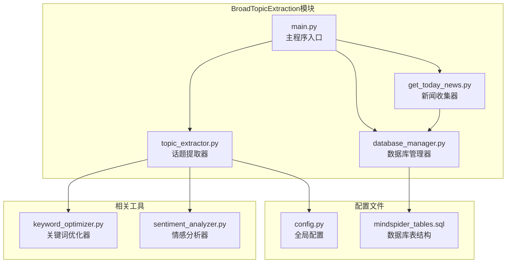

**图表来源**
- [topic_extractor.py](file://MindSpider/BroadTopicExtraction/topic_extractor.py#L1-L290)
- [main.py](file://MindSpider/BroadTopicExtraction/main.py#L1-L326)
- [get_today_news.py](file://MindSpider/BroadTopicExtraction/get_today_news.py#L1-L309)
- [database_manager.py](file://MindSpider/BroadTopicExtraction/database_manager.py#L1-L323)

**章节来源**
- [topic_extractor.py](file://MindSpider/BroadTopicExtraction/topic_extractor.py#L1-L290)
- [main.py](file://MindSpider/BroadTopicExtraction/main.py#L1-L326)
- [get_today_news.py](file://MindSpider/BroadTopicExtraction/get_today_news.py#L1-L309)
- [database_manager.py](file://MindSpider/BroadTopicExtraction/database_manager.py#L1-L323)

## 核心组件

### TopicExtractor 类

TopicExtractor是模块的核心类，负责实现完整的关键词提取和新闻摘要生成功能。该类提供了以下主要功能：

- **关键词提取**：使用大语言模型从新闻标题中提取最具代表性的关键词
- **新闻摘要**：生成简洁明了的新闻分析总结
- **文本预处理**：清理和标准化新闻标题数据
- **结果解析**：解析大语言模型的输出结果
- **关键词过滤**：优化和筛选适合搜索的关键词

### NewsCollector 类

NewsCollector负责从多个新闻源收集实时热点新闻数据，支持以下功能：

- **多平台集成**：支持微博、知乎、B站、今日头条等8个主流平台
- **异步数据获取**：使用asyncio实现高效的并发数据采集
- **数据处理**：清洗和标准化来自不同平台的新闻数据
- **数据库存储**：将收集到的新闻数据持久化存储

### DatabaseManager 类

DatabaseManager提供完整的数据库操作功能，包括：

- **新闻数据存储**：保存每日热点新闻到daily_news表
- **话题分析存储**：保存关键词和摘要到daily_topics表
- **数据查询**：提供便捷的数据检索接口
- **统计分析**：支持数据统计和报表生成

**章节来源**
- [topic_extractor.py](file://MindSpider/BroadTopicExtraction/topic_extractor.py#L25-L290)
- [get_today_news.py](file://MindSpider/BroadTopicExtraction/get_today_news.py#L45-L309)
- [database_manager.py](file://MindSpider/BroadTopicExtraction/database_manager.py#L29-L323)

## 架构概览

BroadTopicExtraction模块采用分层架构设计，实现了清晰的职责分离和良好的可扩展性：

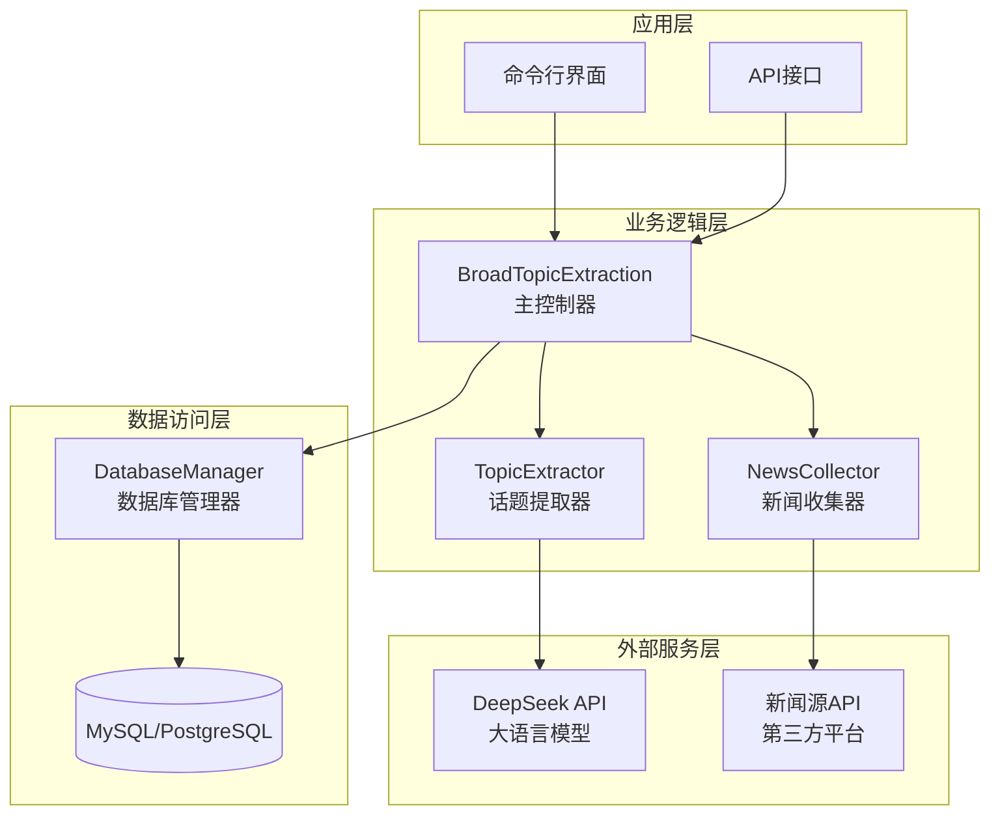

**图表来源**
- [main.py](file://MindSpider/BroadTopicExtraction/main.py#L29-L326)
- [topic_extractor.py](file://MindSpider/BroadTopicExtraction/topic_extractor.py#L25-L81)
- [get_today_news.py](file://MindSpider/BroadTopicExtraction/get_today_news.py#L45-L151)
- [database_manager.py](file://MindSpider/BroadTopicExtraction/database_manager.py#L29-L72)

### 数据流架构

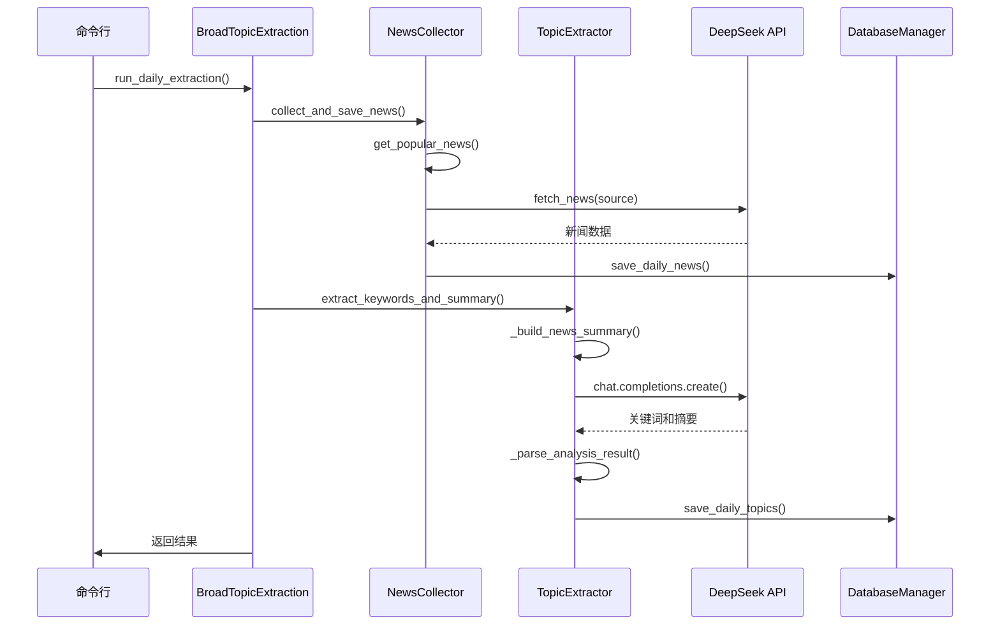

**图表来源**
- [main.py](file://MindSpider/BroadTopicExtraction/main.py#L59-L155)
- [get_today_news.py](file://MindSpider/BroadTopicExtraction/get_today_news.py#L154-L208)
- [topic_extractor.py](file://MindSpider/BroadTopicExtraction/topic_extractor.py#L36-L81)
- [database_manager.py](file://MindSpider/BroadTopicExtraction/database_manager.py#L166-L215)

## 详细组件分析

### TopicExtractor 类详细分析

TopicExtractor类是整个模块的核心，实现了完整的关键词提取和新闻摘要生成功能。

#### 核心算法实现

##### 关键词提取算法

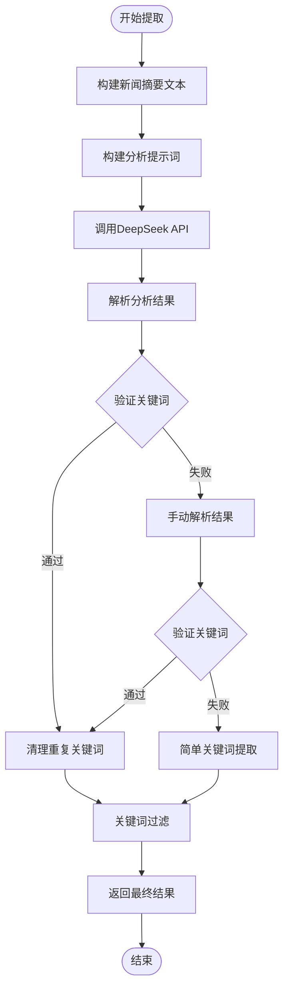

**图表来源**
- [topic_extractor.py](file://MindSpider/BroadTopicExtraction/topic_extractor.py#L36-L171)
- [topic_extractor.py](file://MindSpider/BroadTopicExtraction/topic_extractor.py#L223-L270)

##### 文本预处理流程

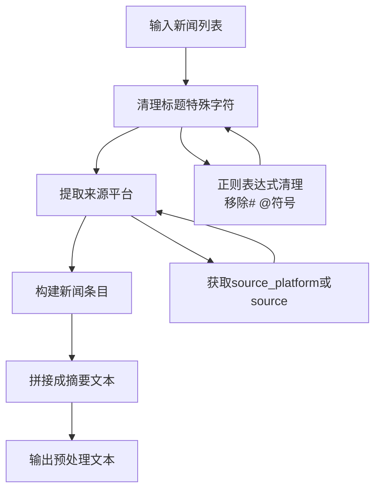

**图表来源**
- [topic_extractor.py](file://MindSpider/BroadTopicExtraction/topic_extractor.py#L82-L95)

##### JSON解析策略

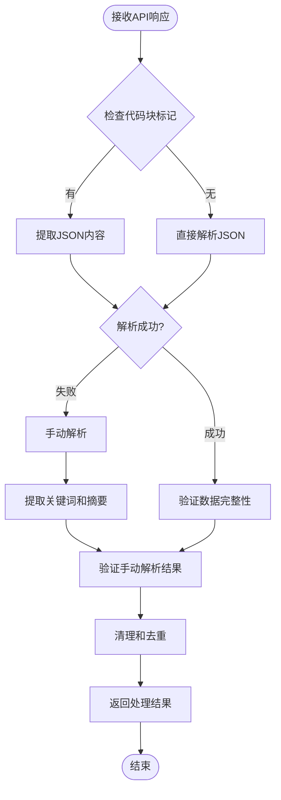

**图表来源**
- [topic_extractor.py](file://MindSpider/BroadTopicExtraction/topic_extractor.py#L131-L171)

#### 关键词过滤规则

TopicExtractor实现了严格的关键词过滤机制，确保生成的关键词适合搜索引擎使用：

| 过滤条件 | 规则说明 | 示例 |
|---------|---------|-------|
| 长度限制 | 2-20个字符 | "AI技术" ✓, "超长关键词测试" ✗ |
| 重复检测 | 去除重复关键词 | "热点" 出现多次只保留一次 |
| 数字过滤 | 排除纯数字 | "2024" ✗, "2024年" ✓ |
| 英文过滤 | 仅允许中文或专有名词 | "iPhone" ✓, "AI" ✗ |
| 特殊字符 | 移除无意义字符 | "#热点#" → "热点" |

**章节来源**
- [topic_extractor.py](file://MindSpider/BroadTopicExtraction/topic_extractor.py#L244-L270)

### NewsCollector 类详细分析

NewsCollector负责从8个不同的新闻源收集实时热点数据，实现了高度模块化的数据采集架构。

#### 支持的新闻源

| 平台标识 | 中文名称 | API端点 | 数据格式 |
|---------|---------|---------|---------|
| weibo | 微博热搜 | `/api/s?id=weibo&latest` | JSON数组 |
| zhihu | 知乎热榜 | `/api/s?id=zhihu&latest` | JSON对象 |
| bilibili-hot-search | B站热搜 | `/api/s?id=bilibili-hot-search&latest` | JSON数组 |
| toutiao | 今日头条 | `/api/s?id=toutiao&latest` | JSON数组 |
| douyin | 抖音热榜 | `/api/s?id=douyin&latest` | JSON数组 |
| github-trending-today | GitHub趋势 | `/api/s?id=github-trending-today&latest` | JSON数组 |
| coolapk | 酷安热榜 | `/api/s?id=coolapk&latest` | JSON数组 |
| tieba | 百度贴吧 | `/api/s?id=tieba&latest` | JSON数组 |
| wallstreetcn | 华尔街见闻 | `/api/s?id=wallstreetcn&latest` | JSON数组 |
| thepaper | 澎湃新闻 | `/api/s?id=thepaper&latest` | JSON数组 |
| cls-hot | 财联社 | `/api/s?id=cls-hot&latest` | JSON数组 |
| xueqiu | 雪球热榜 | `/api/s?id=xueqiu&latest` | JSON数组 |

#### 异步数据获取流程

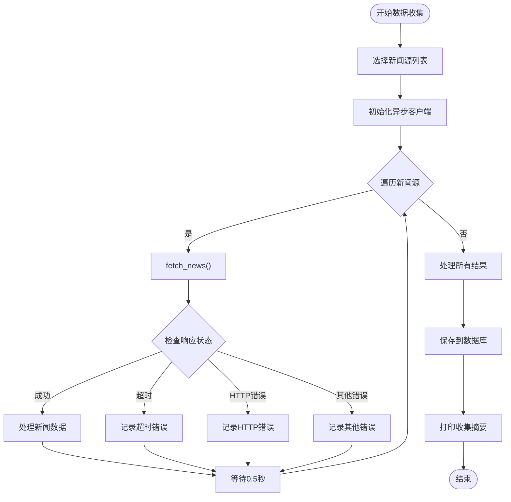

**图表来源**
- [get_today_news.py](file://MindSpider/BroadTopicExtraction/get_today_news.py#L122-L150)
- [get_today_news.py](file://MindSpider/BroadTopicExtraction/get_today_news.py#L154-L208)

**章节来源**
- [get_today_news.py](file://MindSpider/BroadTopicExtraction/get_today_news.py#L30-L43)
- [get_today_news.py](file://MindSpider/BroadTopicExtraction/get_today_news.py#L72-L150)

### DatabaseManager 类详细分析

DatabaseManager提供了完整的数据库操作接口，支持MySQL和PostgreSQL两种数据库引擎。

#### 数据库表结构

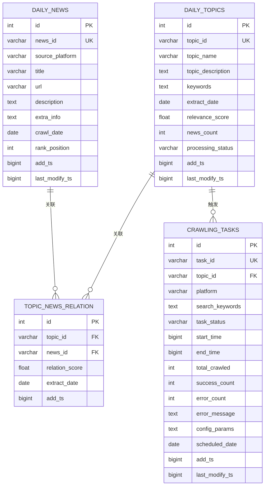

**图表来源**
- [mindspider_tables.sql](file://MindSpider/schema/mindspider_tables.sql#L12-L75)

#### 数据操作流程

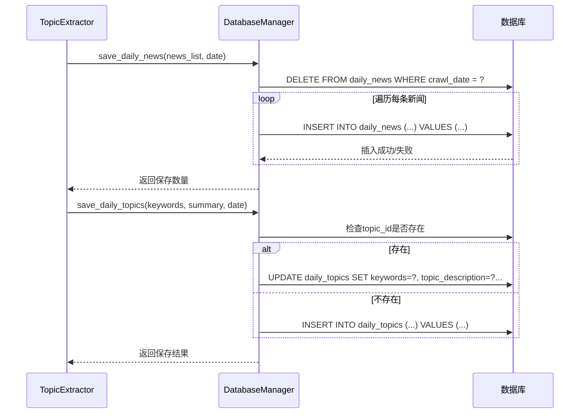

**图表来源**
- [database_manager.py](file://MindSpider/BroadTopicExtraction/database_manager.py#L75-L142)
- [database_manager.py](file://MindSpider/BroadTopicExtraction/database_manager.py#L166-L215)

**章节来源**
- [database_manager.py](file://MindSpider/BroadTopicExtraction/database_manager.py#L75-L215)
- [mindspider_tables.sql](file://MindSpider/schema/mindspider_tables.sql#L8-L75)

## 依赖关系分析

### 外部依赖

BroadTopicExtraction模块依赖以下主要外部库：

| 依赖库 | 版本要求 | 用途 |
|-------|---------|------|
| openai | >= 1.0.0 | 调用DeepSeek大语言模型API |
| httpx | >= 0.20.0 | 异步HTTP客户端 |
| sqlalchemy | >= 1.4.0 | 数据库ORM操作 |
| loguru | >= 0.6.0 | 结构化日志记录 |
| pydantic-settings | >= 0.2.0 | 配置管理 |

### 内部模块依赖

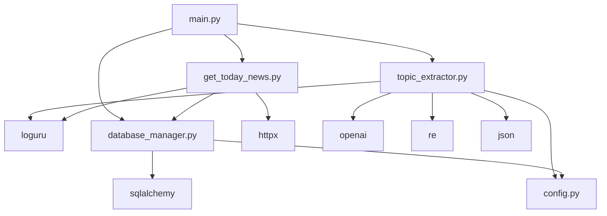

**图表来源**
- [topic_extractor.py](file://MindSpider/BroadTopicExtraction/topic_extractor.py#L8-L23)
- [main.py](file://MindSpider/BroadTopicExtraction/main.py#L8-L27)
- [get_today_news.py](file://MindSpider/BroadTopicExtraction/get_today_news.py#L8-L24)
- [database_manager.py](file://MindSpider/BroadTopicExtraction/database_manager.py#L8-L26)

### 配置依赖

模块通过config.py集中管理所有配置参数：

| 配置项 | 默认值 | 说明 |
|-------|--------|------|
| DB_DIALECT | mysql | 数据库类型 |
| DB_HOST | localhost | 数据库主机 |
| DB_PORT | 3306 | 数据库端口 |
| DB_USER | mindspider | 数据库用户名 |
| DB_PASSWORD | mindspider | 数据库密码 |
| DB_NAME | mindspider | 数据库名称 |
| DB_CHARSET | utf8mb4 | 数据库字符集 |
| MINDSPIDER_API_KEY | None | DeepSeek API密钥 |
| MINDSPIDER_BASE_URL | https://api.deepseek.com | API基础URL |
| MINDSPIDER_MODEL_NAME | deepseek-chat | 模型名称 |

**章节来源**
- [config.py](file://MindSpider/config.py#L16-L35)
- [topic_extractor.py](file://MindSpider/BroadTopicExtraction/topic_extractor.py#L28-L34)

## 性能考虑

### 异步编程优化

模块广泛使用asyncio实现高性能异步编程：

- **并发请求**：同时向多个新闻源发起HTTP请求
- **非阻塞I/O**：避免网络请求阻塞主线程
- **资源管理**：使用上下文管理器确保资源正确释放

### 缓存策略

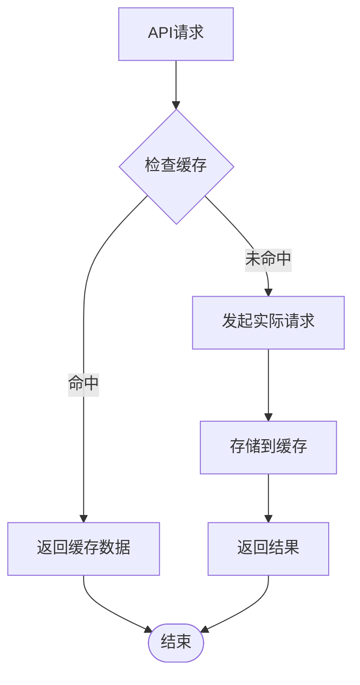

### 错误处理和重试机制

模块实现了多层次的错误处理策略：

1. **网络超时处理**：自动重试超时请求
2. **HTTP状态码处理**：针对不同状态码采取相应措施
3. **JSON解析降级**：当API响应格式异常时使用备用解析方案
4. **数据库连接池**：优化数据库连接复用

### 内存管理

- **流式处理**：对大型数据集采用流式处理方式
- **及时释放**：使用with语句确保资源及时释放
- **内存监控**：对长时间运行的任务进行内存使用监控

## 故障排除指南

### 常见问题及解决方案

#### API调用失败

**问题症状**：关键词提取失败，返回fallback结果

**可能原因**：
- DeepSeek API密钥无效
- 网络连接不稳定
- API配额不足

**解决步骤**：
1. 验证`.env`文件中的API密钥配置
2. 检查网络连接状态
3. 查看API调用频率限制
4. 在代码中添加适当的重试机制

#### 数据库连接问题

**问题症状**：数据库操作失败，抛出连接异常

**可能原因**：
- 数据库凭据配置错误
- 数据库服务未启动
- 缺少必要的数据库驱动

**解决步骤**：
1. 验证数据库连接参数
2. 检查数据库服务状态
3. 安装相应的数据库驱动
4. 确认数据库表结构已初始化

#### 新闻源API错误

**问题症状**：某些新闻源无法获取数据

**可能原因**：
- 第三方API接口变更
- 请求频率过高
- 网络代理问题

**解决步骤**：
1. 检查新闻源API的可用性
2. 调整请求间隔时间
3. 配置适当的代理设置
4. 更新API端点地址

### 调试技巧

#### 日志分析

模块使用loguru提供详细的日志记录：

```bash
# 设置详细日志级别
export LOGURU_LEVEL=DEBUG

# 查看特定模块的日志
python -m loguru --filter="BroadTopicExtraction" --level=DEBUG
```

#### 性能监控

```python
import time
from loguru import logger

# 性能计时装饰器
def timing_decorator(func):
    def wrapper(*args, **kwargs):
        start_time = time.time()
        result = func(*args, **kwargs)
        end_time = time.time()
        logger.info(f"{func.__name__} 执行时间: {end_time - start_time:.2f}秒")
        return result
    return wrapper
```

**章节来源**
- [topic_extractor.py](file://MindSpider/BroadTopicExtraction/topic_extractor.py#L75-L80)
- [get_today_news.py](file://MindSpider/BroadTopicExtraction/get_today_news.py#L100-L120)
- [database_manager.py](file://MindSpider/BroadTopicExtraction/database_manager.py#L47-L59)

## 结论

TopicExtractor话题提取模块是一个功能完整、架构清晰的智能舆情分析系统组件。该模块通过以下关键技术实现了高效的话题提取和新闻摘要生成：

### 核心优势

1. **智能化关键词提取**：基于DeepSeek大语言模型，能够准确识别热点话题
2. **多平台数据集成**：支持12个主流新闻源的实时数据收集
3. **完善的错误处理**：实现了多层次的容错机制和降级策略
4. **高性能异步架构**：采用asyncio实现高效的并发数据处理
5. **灵活的配置管理**：支持多种数据库和API配置

### 技术特色

- **混合解析策略**：结合JSON解析和手动解析，提高结果可靠性
- **智能关键词过滤**：严格的过滤规则确保关键词质量
- **完整的生命周期管理**：从数据收集到结果存储的全流程管理
- **可扩展的设计**：模块化架构便于功能扩展和维护

### 应用价值

该模块为MindSpider系统提供了强大的话题发现能力，能够帮助用户快速了解社会热点和舆论趋势，为后续的深度分析和决策提供重要支撑。通过持续优化算法和扩展支持的新闻源，该模块将继续提升其在智能舆情分析领域的价值。