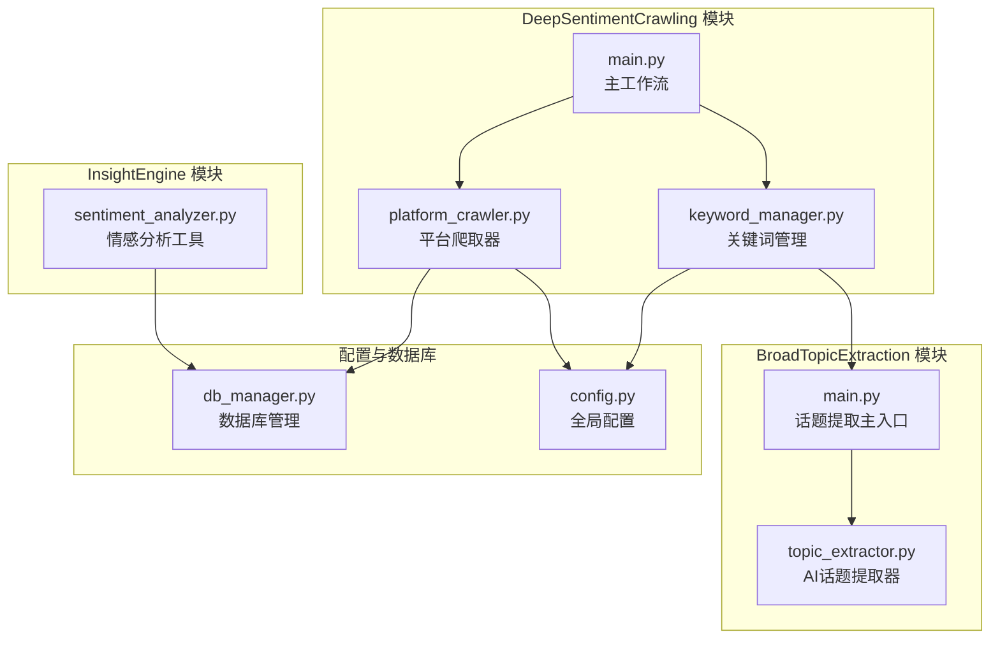
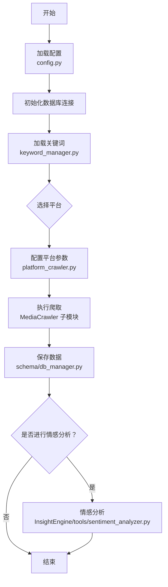
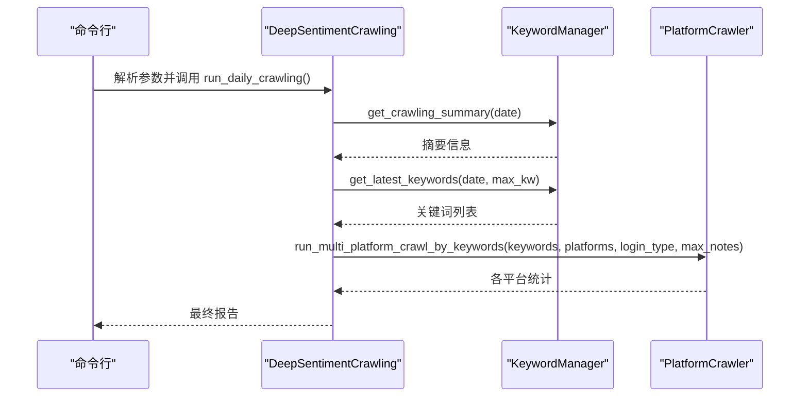
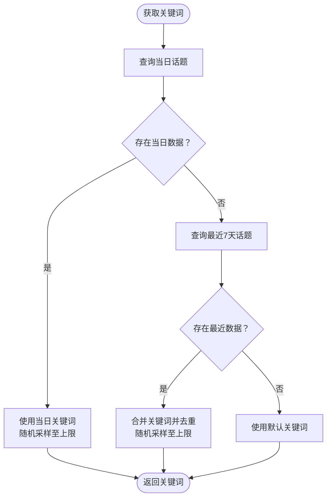
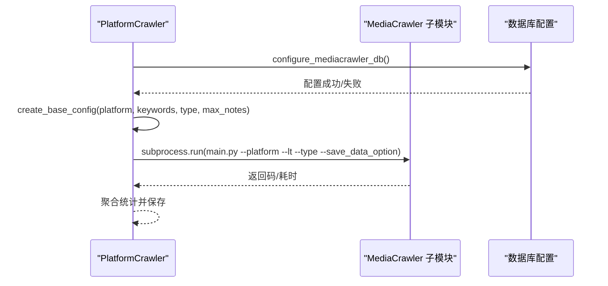
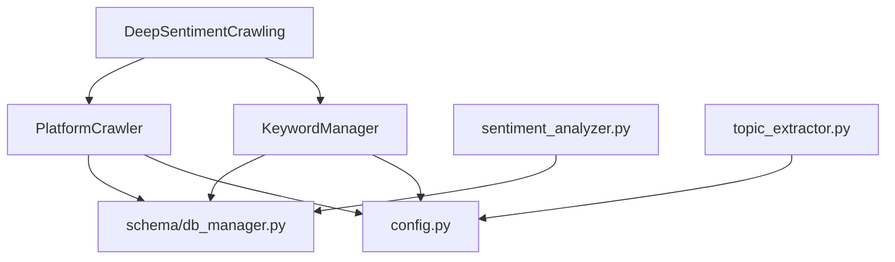

# DeepSentimentCrawling 深度情感爬取模块

<cite>
**本文档引用的文件**
- [main.py](file://MindSpider/DeepSentimentCrawling/main.py)
- [keyword_manager.py](file://MindSpider/DeepSentimentCrawling/keyword_manager.py)
- [platform_crawler.py](file://MindSpider/DeepSentimentCrawling/platform_crawler.py)
- [config.py](file://MindSpider/config.py)
- [config.py.example](file://MindSpider/config.py.example)
- [requirements.txt](file://MindSpider/requirements.txt)
- [README.md](file://MindSpider/README.md)
- [main.py](file://MindSpider/BroadTopicExtraction/main.py)
- [topic_extractor.py](file://MindSpider/BroadTopicExtraction/topic_extractor.py)
- [db_manager.py](file://MindSpider/schema/db_manager.py)
- [sentiment_analyzer.py](file://InsightEngine/tools/sentiment_analyzer.py)
</cite>

## 目录
1. [简介](#简介)
2. [项目结构](#项目结构)
3. [核心组件](#核心组件)
4. [架构总览](#架构总览)
5. [详细组件分析](#详细组件分析)
6. [依赖关系分析](#依赖关系分析)
7. [性能考虑](#性能考虑)
8. [故障排查指南](#故障排查指南)
9. [结论](#结论)
10. [附录](#附录)

## 简介
DeepSentimentCrawling 深度情感爬取模块是 MindSpider 舆情分析系统的重要组成部分，负责基于 BroadTopicExtraction 提取的关键词，在多平台（小红书、抖音、快手、B站、微博、贴吧、知乎）进行深度内容爬取，并与情感分析工具链集成，形成从“热点发现—关键词提取—多平台爬取—情感分析”的完整闭环。

该模块通过命令行入口提供灵活的执行方式，支持按日期、平台、关键词数量与内容数量等参数控制爬取范围；同时内置平台适配机制与登录流程，确保在不同平台上的稳定运行。

## 项目结构
DeepSentimentCrawling 模块位于 MindSpider 项目中，与 BroadTopicExtraction 和 InsightEngine 等模块协同工作。其核心文件包括：
- 主入口与工作流：main.py
- 关键词管理：keyword_manager.py
- 平台爬取器：platform_crawler.py
- 配置与依赖：config.py、requirements.txt
- 话题提取与数据库：BroadTopicExtraction/main.py、BroadTopicExtraction/topic_extractor.py
- 数据库管理：schema/db_manager.py
- 情感分析工具：InsightEngine/tools/sentiment_analyzer.py

**图表来源**
- [main.py](file://MindSpider/DeepSentimentCrawling/main.py#L21-L98)
- [keyword_manager.py](file://MindSpider/DeepSentimentCrawling/keyword_manager.py#L29-L111)
- [platform_crawler.py](file://MindSpider/DeepSentimentCrawling/platform_crawler.py#L27-L41)
- [main.py](file://MindSpider/BroadTopicExtraction/main.py#L29-L58)
- [topic_extractor.py](file://MindSpider/BroadTopicExtraction/topic_extractor.py#L25-L35)
- [config.py](file://MindSpider/config.py#L16-L35)
- [db_manager.py](file://MindSpider/schema/db_manager.py#L30-L53)
- [sentiment_analyzer.py](file://InsightEngine/tools/sentiment_analyzer.py#L79-L141)

**章节来源**
- [README.md](file://MindSpider/README.md#L31-L71)
- [requirements.txt](file://MindSpider/requirements.txt#L1-L63)

## 核心组件
- DeepSentimentCrawling 主工作流：封装每日/单平台爬取流程，协调关键词管理与平台爬取器，生成最终报告。
- KeywordManager 关键词管理器：从数据库加载当日/近期关键词，支持默认关键词回退与平台偏好过滤。
- PlatformCrawler 平台爬虫管理器：负责配置 MediaCrawler 的数据库与基础配置，调用外部子模块执行多平台爬取，并聚合统计结果。
- 配置系统：统一管理数据库与 API 配置，支持 MySQL/PostgreSQL。
- 话题提取与情感分析：通过 BroadTopicExtraction 生成关键词，通过 InsightEngine 的情感分析工具进行内容情感标注。

**章节来源**
- [main.py](file://MindSpider/DeepSentimentCrawling/main.py#L21-L189)
- [keyword_manager.py](file://MindSpider/DeepSentimentCrawling/keyword_manager.py#L29-L317)
- [platform_crawler.py](file://MindSpider/DeepSentimentCrawling/platform_crawler.py#L27-L480)
- [config.py](file://MindSpider/config.py#L16-L35)

## 架构总览
DeepSentimentCrawling 的整体架构围绕“关键词驱动 + 多平台适配 + 数据持久化”展开。BroadTopicExtraction 负责每日热点新闻采集与关键词生成，DeepSentimentCrawling 基于关键词在多平台进行深度爬取，最终将数据写入数据库并可选地进行情感分析。

**图表来源**
- [main.py](file://MindSpider/DeepSentimentCrawling/main.py#L30-L97)
- [keyword_manager.py](file://MindSpider/DeepSentimentCrawling/keyword_manager.py#L60-L111)
- [platform_crawler.py](file://MindSpider/DeepSentimentCrawling/platform_crawler.py#L218-L308)
- [db_manager.py](file://MindSpider/schema/db_manager.py#L30-L53)
- [sentiment_analyzer.py](file://InsightEngine/tools/sentiment_analyzer.py#L79-L141)

## 详细组件分析

### DeepSentimentCrawling 主工作流
- 职责：封装每日爬取与单平台爬取流程，协调关键词与平台爬取器，汇总统计并生成报告。
- 关键流程：
  - 获取关键词摘要：检查当日话题数据是否存在。
  - 加载关键词：支持最大关键词数量限制与随机采样。
  - 多平台爬取：对每个平台一次性传递全部关键词，聚合统计结果。
  - 单平台爬取：按平台维度加载关键词并执行爬取。
  - 辅助功能：列出可用话题、显示平台使用指南、关闭资源。
- 命令行参数：日期、平台/平台列表、关键词/内容数量上限、登录方式、测试模式、指南与话题列表展示。

**图表来源**
- [main.py](file://MindSpider/DeepSentimentCrawling/main.py#L30-L97)
- [keyword_manager.py](file://MindSpider/DeepSentimentCrawling/keyword_manager.py#L60-L111)
- [platform_crawler.py](file://MindSpider/DeepSentimentCrawling/platform_crawler.py#L348-L459)

**章节来源**
- [main.py](file://MindSpider/DeepSentimentCrawling/main.py#L21-L189)

### KeywordManager 关键词管理器
- 职责：从数据库加载关键词，支持当日优先、最近7天合并、默认关键词回退；提供平台偏好过滤与摘要生成。
- 关键能力：
  - get_daily_topics/get_recent_topics：查询每日/最近话题数据并解析关键词。
  - get_latest_keywords：当日关键词不足时合并最近7天关键词并去重、采样。
  - get_all_keywords_for_platforms/get_keywords_for_platform：为平台准备关键词（当前实现为所有平台共享同一组关键词）。
  - _filter_keywords_by_platform：按平台特性偏好过滤关键词（预留扩展）。
  - get_crawling_summary：生成爬取摘要。
- 数据库连接：支持 MySQL/PostgreSQL，自动注入驱动缺失提示。

**图表来源**
- [keyword_manager.py](file://MindSpider/DeepSentimentCrawling/keyword_manager.py#L60-L111)
- [keyword_manager.py](file://MindSpider/DeepSentimentCrawling/keyword_manager.py#L145-L178)
- [keyword_manager.py](file://MindSpider/DeepSentimentCrawling/keyword_manager.py#L180-L190)

**章节来源**
- [keyword_manager.py](file://MindSpider/DeepSentimentCrawling/keyword_manager.py#L29-L317)

### PlatformCrawler 平台爬虫管理器
- 职责：配置 MediaCrawler 的数据库与基础配置，调用外部子模块执行多平台爬取，聚合统计结果。
- 关键能力：
  - configure_mediacrawler_db：根据 MindSpider 配置动态写入 MediaCrawler 的数据库配置，支持 MySQL/PostgreSQL。
  - create_base_config：生成 MediaCrawler 的基础配置（平台、关键词、爬取类型、保存选项、数量限制、评论抓取等）。
  - run_crawler：执行单平台爬取，通过子进程调用 MediaCrawler 的 main.py，捕获返回码与耗时，生成统计。
  - run_multi_platform_crawl_by_keywords：对每个平台一次性传递全部关键词，聚合平台级与关键词级统计。
  - 统计与日志：保存各平台统计、序列化日志。
- 平台适配：支持 xhs/dy/ks/bili/wb/tieba/zhihu，内部校验平台合法性。
- 登录与配置：通过命令行参数传递登录方式（二维码/手机/Cookie），并设置无头模式等。

**图表来源**
- [platform_crawler.py](file://MindSpider/DeepSentimentCrawling/platform_crawler.py#L42-L152)
- [platform_crawler.py](file://MindSpider/DeepSentimentCrawling/platform_crawler.py#L154-L216)
- [platform_crawler.py](file://MindSpider/DeepSentimentCrawling/platform_crawler.py#L218-L308)
- [platform_crawler.py](file://MindSpider/DeepSentimentCrawling/platform_crawler.py#L348-L459)

**章节来源**
- [platform_crawler.py](file://MindSpider/DeepSentimentCrawling/platform_crawler.py#L27-L480)

### 话题提取与关键词生成（BroadTopicExtraction）
- 职责：每日从多平台采集热点新闻，使用 AI 对新闻进行关键词提取与总结，并将结果保存到数据库。
- 关键流程：
  - 新闻采集：支持多平台源，异步收集并保存。
  - AI提取：调用 DeepSeek API 生成关键词与总结。
  - 数据保存：将关键词与摘要写入 daily_topics 表。
- 关键接口：run_daily_extraction、get_keywords_for_crawling、get_daily_analysis、get_recent_analysis。

**章节来源**
- [main.py](file://MindSpider/BroadTopicExtraction/main.py#L59-L154)
- [topic_extractor.py](file://MindSpider/BroadTopicExtraction/topic_extractor.py#L36-L81)

### 数据库与配置
- 配置系统：统一管理数据库类型（MySQL/PostgreSQL）、主机、端口、用户、密码、字符集与 API 配置。
- 数据库管理：提供表清单、统计数据、最近数据概览、旧数据清理等工具。
- 依赖管理：requirements.txt 明确列出各模块所需依赖，包括 SQLAlchemy、OpenAI、Playwright、Redis 等。

**章节来源**
- [config.py](file://MindSpider/config.py#L16-L35)
- [config.py.example](file://MindSpider/config.py.example#L16-L35)
- [db_manager.py](file://MindSpider/schema/db_manager.py#L30-L299)
- [requirements.txt](file://MindSpider/requirements.txt#L1-L63)

### 情感分析集成
- 情感分析工具：WeiboMultilingualSentimentAnalyzer 基于多语言情感分析模型，支持单文本与批量分析，输出情感标签与置信度分布。
- 集成方式：可对从数据库查询到的内容进行情感分析，统计情感分布与高置信度结果，生成摘要。
- 启用/禁用：可通过配置开关与依赖检测控制是否启用情感分析。

**章节来源**
- [sentiment_analyzer.py](file://InsightEngine/tools/sentiment_analyzer.py#L79-L141)
- [sentiment_analyzer.py](file://InsightEngine/tools/sentiment_analyzer.py#L467-L590)

## 依赖关系分析
- 模块耦合：
  - DeepSentimentCrawling 依赖 KeywordManager 与 PlatformCrawler，二者均依赖 config.py 提供的数据库配置。
  - KeywordManager 与 BroadTopicExtraction 协作，从数据库读取关键词。
  - PlatformCrawler 通过子进程调用 MediaCrawler 子模块，实现多平台爬取。
  - 情感分析工具与数据库管理器配合，实现内容情感标注与统计。
- 外部依赖：
  - 数据库：MySQL/PostgreSQL（通过 SQLAlchemy）。
  - 爬虫：Playwright（浏览器自动化）。
  - AI：OpenAI（DeepSeek API）。
  - 缓存与存储：Redis、SQLite、MongoDB（由 MediaCrawler 配置决定）。

**图表来源**
- [main.py](file://MindSpider/DeepSentimentCrawling/main.py#L18-L28)
- [keyword_manager.py](file://MindSpider/DeepSentimentCrawling/keyword_manager.py#L26-L35)
- [platform_crawler.py](file://MindSpider/DeepSentimentCrawling/platform_crawler.py#L22-L40)
- [config.py](file://MindSpider/config.py#L16-L35)
- [db_manager.py](file://MindSpider/schema/db_manager.py#L30-L53)
- [topic_extractor.py](file://MindSpider/BroadTopicExtraction/topic_extractor.py#L25-L35)
- [sentiment_analyzer.py](file://InsightEngine/tools/sentiment_analyzer.py#L79-L141)

**章节来源**
- [requirements.txt](file://MindSpider/requirements.txt#L1-L63)

## 性能考虑
- 爬取并发与节流：合理设置每个平台的最大内容数量与关键词数量，避免触发平台限流。
- 数据库写入：批量写入与事务控制，减少频繁提交带来的开销。
- 缓存与索引：为高频查询字段建立索引，使用 Redis 缓存热点数据。
- 资源隔离：通过子进程隔离 MediaCrawler 执行，避免阻塞主流程。
- 模型推理：情感分析模型可在 GPU/CPU 上自动选择最优设备，批量推理提升吞吐。

[本节为通用性能建议，不直接分析具体文件]

## 故障排查指南
- 数据库连接失败：检查 config.py 中的 DB_DIALECT、DB_HOST、DB_PORT、DB_USER、DB_PASSWORD、DB_NAME 配置，确认驱动安装（MySQL: pymysql，PostgreSQL: psycopg）。
- 爬取超时或失败：检查平台登录状态、无头模式设置、网络连通性；必要时降低 max_notes 与 max_keywords。
- 关键词为空：确认 BroadTopicExtraction 是否成功生成当日关键词，检查 daily_topics 表数据。
- 情感分析不可用：检查 PyTorch 与 Transformers 依赖是否安装，确认模型下载与本地缓存路径。

**章节来源**
- [keyword_manager.py](file://MindSpider/DeepSentimentCrawling/keyword_manager.py#L37-L58)
- [platform_crawler.py](file://MindSpider/DeepSentimentCrawling/platform_crawler.py#L303-L308)
- [db_manager.py](file://MindSpider/schema/db_manager.py#L35-L47)
- [sentiment_analyzer.py](file://InsightEngine/tools/sentiment_analyzer.py#L103-L140)

## 结论
DeepSentimentCrawling 模块通过清晰的职责划分与模块化设计，实现了从关键词加载到多平台爬取再到数据持久化的完整流程。结合 BroadTopicExtraction 的 AI 话题提取与 InsightEngine 的情感分析工具，形成了高效的舆情分析闭环。建议在生产环境中合理配置参数、完善登录与代理策略，并持续优化数据库与缓存策略以提升整体性能与稳定性。

[本节为总结性内容，不直接分析具体文件]

## 附录

### 常用命令与参数
- 运行完整流程：python main.py --complete --test
- 指定平台：python main.py --deep-sentiment --platforms xhs dy --test
- 指定日期：python main.py --broad-topic --date 2024-01-15
- 查看帮助：python main.py --help

**章节来源**
- [README.md](file://MindSpider/README.md#L394-L424)

### 支持的平台
- xhs：小红书
- dy：抖音
- ks：快手
- bili：B站
- wb：微博
- tieba：贴吧
- zhihu：知乎

**章节来源**
- [main.py](file://MindSpider/DeepSentimentCrawling/main.py#L165-L177)
- [platform_crawler.py](file://MindSpider/DeepSentimentCrawling/platform_crawler.py#L32-L33)