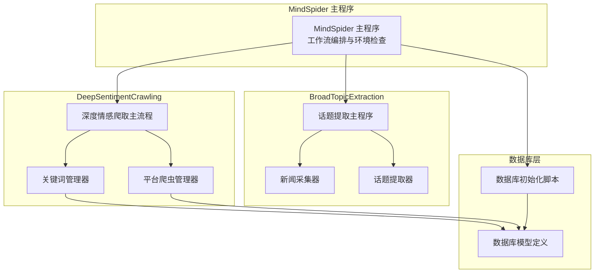
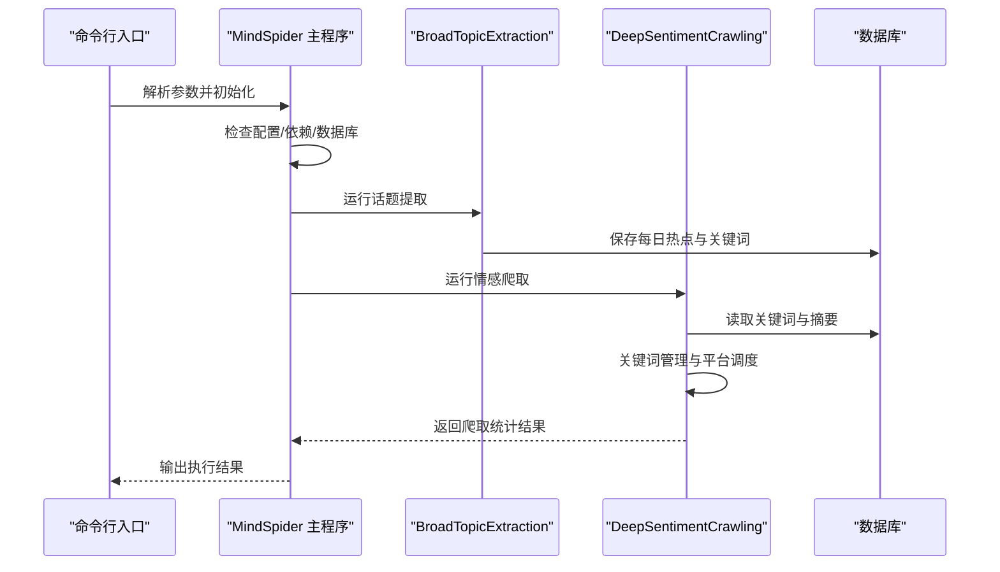
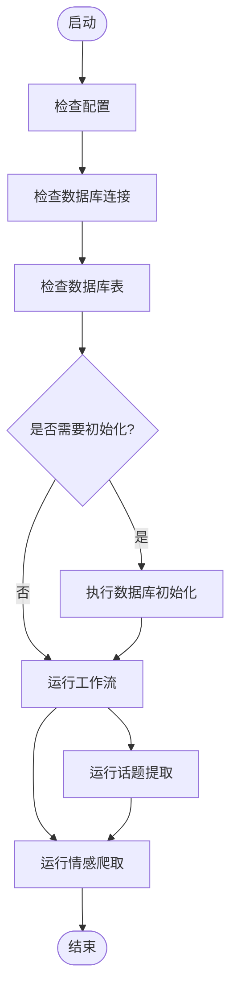
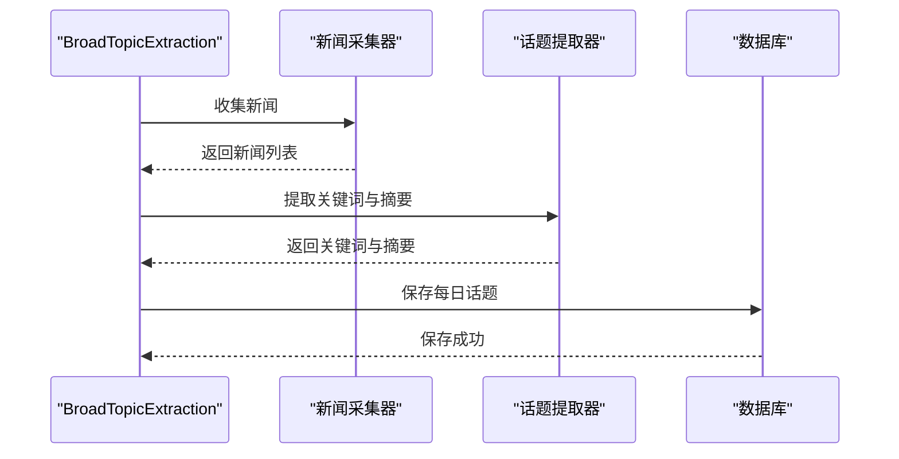
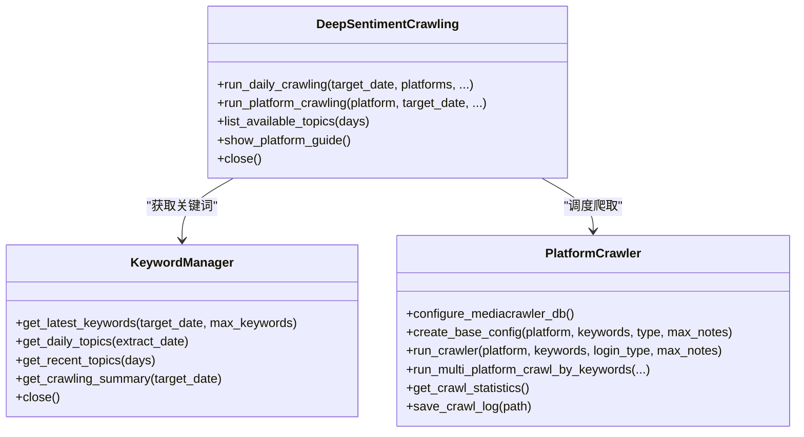
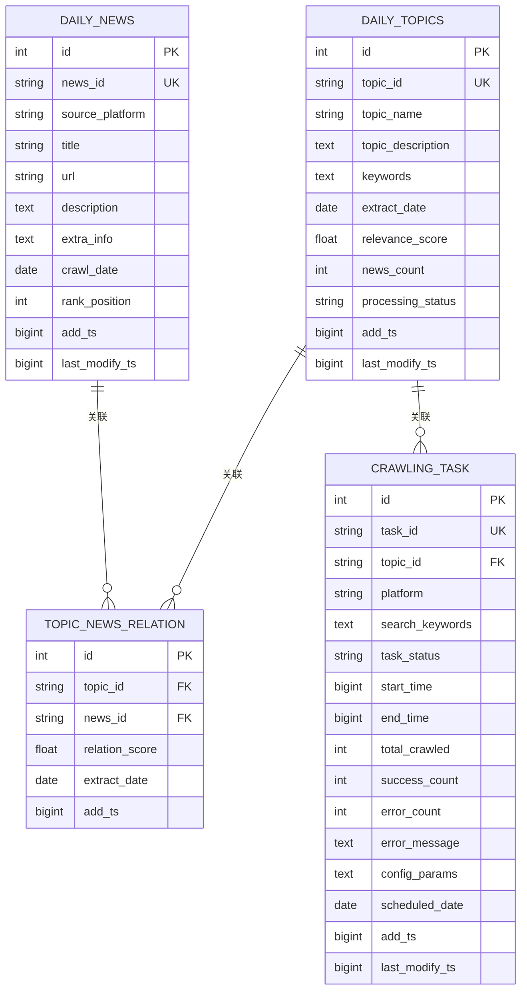
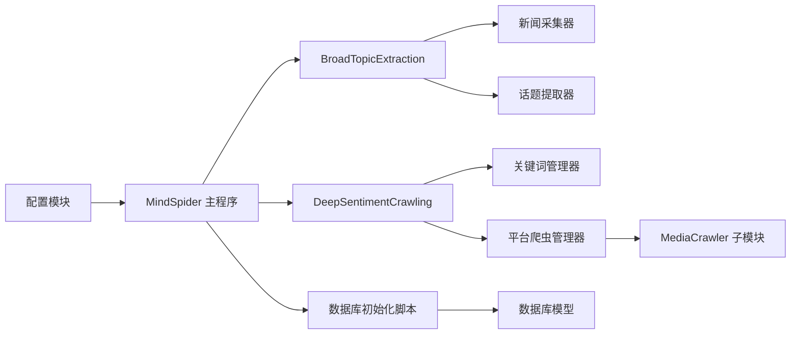

# 主执行流程

<cite>
**本文档引用的文件**
- [MindSpider 主程序](file://MindSpider/main.py)
- [深度情感爬取主流程](file://MindSpider/DeepSentimentCrawling/main.py)
- [平台爬虫管理器](file://MindSpider/DeepSentimentCrawling/platform_crawler.py)
- [关键词管理器](file://MindSpider/DeepSentimentCrawling/keyword_manager.py)
- [BroadTopicExtraction 主程序](file://MindSpider/BroadTopicExtraction/main.py)
- [新闻采集器](file://MindSpider/BroadTopicExtraction/get_today_news.py)
- [话题提取器](file://MindSpider/BroadTopicExtraction/topic_extractor.py)
- [数据库初始化脚本](file://MindSpider/schema/init_database.py)
- [数据库模型定义](file://MindSpider/schema/models_sa.py)
- [全局配置](file://MindSpider/config.py)
</cite>

## 目录
1. [简介](#简介)
2. [项目结构](#项目结构)
3. [核心组件](#核心组件)
4. [架构总览](#架构总览)
5. [详细组件分析](#详细组件分析)
6. [依赖关系分析](#依赖关系分析)
7. [性能考虑](#性能考虑)
8. [故障排查指南](#故障排查指南)
9. [结论](#结论)
10. [附录](#附录)

## 简介
本文件面向深度情感爬取的主执行流程，系统化阐述整体调度机制、任务队列管理、并发控制策略、生命周期管理、状态监控与异常恢复、配置加载与初始化、资源管理与清理、执行参数配置、性能调优与监控告警设置，并提供完整执行示例、调试技巧与运维指南。

## 项目结构
MindSpider 采用模块化架构，核心由三大模块组成：
- BroadTopicExtraction：每日热点新闻采集与话题提取，产出关键词与摘要，写入数据库
- DeepSentimentCrawling：基于关键词的全平台情感内容爬取，聚合结果
- MindSpider 主程序：统一调度、环境检查、依赖安装、数据库初始化与工作流编排

**图表来源**
- [MindSpider 主程序](file://MindSpider/main.py#L34-L520)
- [BroadTopicExtraction 主程序](file://MindSpider/BroadTopicExtraction/main.py#L29-L200)
- [深度情感爬取主流程](file://MindSpider/DeepSentimentCrawling/main.py#L21-L282)
- [平台爬虫管理器](file://MindSpider/DeepSentimentCrawling/platform_crawler.py#L27-L491)
- [关键词管理器](file://MindSpider/DeepSentimentCrawling/keyword_manager.py#L29-L336)
- [数据库初始化脚本](file://MindSpider/schema/init_database.py#L100-L121)
- [数据库模型定义](file://MindSpider/schema/models_sa.py#L27-L127)

**章节来源**
- [MindSpider 主程序](file://MindSpider/main.py#L34-L520)
- [BroadTopicExtraction 主程序](file://MindSpider/BroadTopicExtraction/main.py#L29-L200)
- [深度情感爬取主流程](file://MindSpider/DeepSentimentCrawling/main.py#L21-L282)
- [平台爬虫管理器](file://MindSpider/DeepSentimentCrawling/platform_crawler.py#L27-L491)
- [关键词管理器](file://MindSpider/DeepSentimentCrawling/keyword_manager.py#L29-L336)
- [数据库初始化脚本](file://MindSpider/schema/init_database.py#L100-L121)
- [数据库模型定义](file://MindSpider/schema/models_sa.py#L27-L127)

## 核心组件
- MindSpider 主程序：负责环境检查、依赖安装、数据库初始化、工作流编排（先话题提取，后情感爬取），并提供状态查询与项目设置能力
- BroadTopicExtraction：异步采集多源新闻，调用LLM提取关键词与摘要，持久化至数据库
- DeepSentimentCrawling：基于关键词管理器获取关键词，平台爬虫管理器统一调度各平台爬取，聚合统计结果
- 数据库层：通过 SQLAlchemy 2.x 异步引擎创建 MindSpider 扩展表，支持 MySQL/PostgreSQL

**章节来源**
- [MindSpider 主程序](file://MindSpider/main.py#L34-L520)
- [BroadTopicExtraction 主程序](file://MindSpider/BroadTopicExtraction/main.py#L29-L200)
- [深度情感爬取主流程](file://MindSpider/DeepSentimentCrawling/main.py#L21-L282)
- [平台爬虫管理器](file://MindSpider/DeepSentimentCrawling/platform_crawler.py#L27-L491)
- [关键词管理器](file://MindSpider/DeepSentimentCrawling/keyword_manager.py#L29-L336)
- [数据库初始化脚本](file://MindSpider/schema/init_database.py#L100-L121)
- [数据库模型定义](file://MindSpider/schema/models_sa.py#L27-L127)

## 架构总览
主执行流程遵循“先话题提取、后情感爬取”的两阶段流水线：
- 第一阶段：MindSpider 主程序调用 BroadTopicExtraction，异步采集新闻源，LLM 提取关键词与摘要，写入 daily_topics 表
- 第二阶段：MindSpider 主程序调用 DeepSentimentCrawling，通过 KeywordManager 读取关键词，PlatformCrawler 统一配置并执行各平台爬取，统计结果

**图表来源**
- [MindSpider 主程序](file://MindSpider/main.py#L257-L378)
- [BroadTopicExtraction 主程序](file://MindSpider/BroadTopicExtraction/main.py#L59-L154)
- [深度情感爬取主流程](file://MindSpider/DeepSentimentCrawling/main.py#L30-L97)

## 详细组件分析

### MindSpider 主程序
- 环境检查：验证配置项、数据库连接、必要表是否存在
- 依赖管理：自动安装主工程与子模块依赖，支持 MediaCrawler 子模块依赖安装
- 数据库初始化：按需创建 MindSpider 扩展表与视图
- 工作流编排：提供独立模块运行与完整流程运行两种模式
- 状态展示：输出项目状态概览，便于运维诊断

**图表来源**
- [MindSpider 主程序](file://MindSpider/main.py#L168-L378)

**章节来源**
- [MindSpider 主程序](file://MindSpider/main.py#L47-L431)
- [MindSpider 主程序](file://MindSpider/main.py#L433-L520)

### BroadTopicExtraction 模块
- 新闻采集：异步调用多源新闻接口，统一处理成功/超时/HTTP 错误等场景
- 话题提取：调用 LLM API 提取关键词与摘要，支持 JSON 结果解析与回退策略
- 数据持久化：将每日热点与分析结果写入数据库，供后续爬取使用

**图表来源**
- [BroadTopicExtraction 主程序](file://MindSpider/BroadTopicExtraction/main.py#L59-L154)
- [新闻采集器](file://MindSpider/BroadTopicExtraction/get_today_news.py#L122-L200)
- [话题提取器](file://MindSpider/BroadTopicExtraction/topic_extractor.py#L36-L81)

**章节来源**
- [BroadTopicExtraction 主程序](file://MindSpider/BroadTopicExtraction/main.py#L29-L200)
- [新闻采集器](file://MindSpider/BroadTopicExtraction/get_today_news.py#L45-L200)
- [话题提取器](file://MindSpider/BroadTopicExtraction/topic_extractor.py#L25-L200)

### DeepSentimentCrawling 模块
- 关键词管理：从数据库读取当日/最近关键词，支持默认关键词回退
- 平台调度：统一配置各平台爬取参数，调用子模块执行
- 结果聚合：统计任务总数、成功数、失败数、内容条数、评论条数等

**图表来源**
- [深度情感爬取主流程](file://MindSpider/DeepSentimentCrawling/main.py#L21-L189)
- [关键词管理器](file://MindSpider/DeepSentimentCrawling/keyword_manager.py#L29-L336)
- [平台爬虫管理器](file://MindSpider/DeepSentimentCrawling/platform_crawler.py#L27-L491)

**章节来源**
- [深度情感爬取主流程](file://MindSpider/DeepSentimentCrawling/main.py#L21-L189)
- [关键词管理器](file://MindSpider/DeepSentimentCrawling/keyword_manager.py#L29-L336)
- [平台爬虫管理器](file://MindSpider/DeepSentimentCrawling/platform_crawler.py#L27-L491)

### 数据库层
- 初始化脚本：根据配置构建数据库 URL，创建 MindSpider 扩展表与视图
- 模型定义：定义 daily_news、daily_topics、topic_news_relation、crawling_tasks 等表结构及索引

**图表来源**
- [数据库模型定义](file://MindSpider/schema/models_sa.py#L31-L124)
- [数据库初始化脚本](file://MindSpider/schema/init_database.py#L100-L121)

**章节来源**
- [数据库初始化脚本](file://MindSpider/schema/init_database.py#L41-L121)
- [数据库模型定义](file://MindSpider/schema/models_sa.py#L27-L127)

## 依赖关系分析
- MindSpider 主程序依赖配置模块、数据库初始化脚本与各子模块
- BroadTopicExtraction 依赖新闻采集器、话题提取器与数据库管理器
- DeepSentimentCrawling 依赖关键词管理器与平台爬虫管理器
- 平台爬虫管理器通过子进程调用 MediaCrawler 子模块执行实际爬取

**图表来源**
- [MindSpider 主程序](file://MindSpider/main.py#L27-L32)
- [BroadTopicExtraction 主程序](file://MindSpider/BroadTopicExtraction/main.py#L20-L27)
- [深度情感爬取主流程](file://MindSpider/DeepSentimentCrawling/main.py#L18-L19)
- [平台爬虫管理器](file://MindSpider/DeepSentimentCrawling/platform_crawler.py#L22-L25)

**章节来源**
- [MindSpider 主程序](file://MindSpider/main.py#L27-L32)
- [BroadTopicExtraction 主程序](file://MindSpider/BroadTopicExtraction/main.py#L20-L27)
- [深度情感爬取主流程](file://MindSpider/DeepSentimentCrawling/main.py#L18-L19)
- [平台爬虫管理器](file://MindSpider/DeepSentimentCrawling/platform_crawler.py#L22-L25)

## 性能考虑
- 异步与超时控制：BroadTopicExtraction 使用异步 HTTP 客户端，设置请求超时；主程序对子进程执行设置超时，避免长时间阻塞
- 数据库连接池：使用 SQLAlchemy 异步引擎，启用连接预检与回收策略
- 关键词采样：当关键词过多时进行随机采样，降低爬取负载
- 并发策略：平台爬取采用顺序执行（逐平台一次性传递全部关键词），避免过度并发导致平台风控
- I/O 优化：批量写入数据库，减少事务开销

**章节来源**
- [MindSpider 主程序](file://MindSpider/main.py#L74-L90)
- [MindSpider 主程序](file://MindSpider/main.py#L276-L280)
- [MindSpider 主程序](file://MindSpider/main.py#L328-L332)
- [关键词管理器](file://MindSpider/DeepSentimentCrawling/keyword_manager.py#L84-L86)
- [平台爬虫管理器](file://MindSpider/DeepSentimentCrawling/platform_crawler.py#L270-L274)

## 故障排查指南
- 配置缺失：检查 .env 文件与环境变量，确保数据库与 API 配置齐全
- 数据库连接失败：确认数据库服务可达、驱动已安装（MySQL 使用 pymysql，PostgreSQL 使用 psycopg）
- 子模块依赖缺失：主程序会自动安装 MediaCrawler 依赖，若失败需检查网络与权限
- 爬取超时：适当降低 max_notes 或 max_keywords，或调整平台爬取超时设置
- 登录问题：首次使用需扫码登录，登录方式支持二维码/手机/Cookie
- 日志与统计：平台爬虫管理器提供统计信息与日志保存接口，便于定位问题

**章节来源**
- [MindSpider 主程序](file://MindSpider/main.py#L47-L68)
- [MindSpider 主程序](file://MindSpider/main.py#L183-L212)
- [MindSpider 主程序](file://MindSpider/main.py#L214-L255)
- [平台爬虫管理器](file://MindSpider/DeepSentimentCrawling/platform_crawler.py#L303-L308)
- [平台爬虫管理器](file://MindSpider/DeepSentimentCrawling/platform_crawler.py#L469-L480)

## 结论
MindSpider 的主执行流程通过清晰的模块边界与严格的生命周期管理，实现了从热点新闻采集到情感内容爬取的自动化闭环。通过异步 I/O、数据库连接池、关键词采样与超时控制等手段，在保证稳定性的同时兼顾性能。建议在生产环境中结合监控告警与日志分析，持续优化参数与资源配额。

## 附录

### 执行参数与配置
- 基础参数
  - --setup：初始化项目设置
  - --status：显示项目状态
  - --init-db：初始化数据库
  - --complete：运行完整工作流程
- 模块运行参数
  - --broad-topic：仅运行话题提取模块
  - --deep-sentiment：仅运行情感爬取模块
- 日期与平台
  - --date：目标日期（YYYY-MM-DD）
  - --platforms：指定多个平台（xhs/dy/ks/bili/wb/tieba/zhihu）
- 爬取参数
  - --keywords-count：话题提取关键词数量
  - --max-keywords：每个平台最大关键词数量
  - --max-notes：每个关键词最大爬取内容数量
  - --test：测试模式（限制数据规模）

**章节来源**
- [MindSpider 主程序](file://MindSpider/main.py#L433-L520)
- [深度情感爬取主流程](file://MindSpider/DeepSentimentCrawling/main.py#L190-L282)

### 执行示例
- 初始化项目：python MindSpider/main.py --setup
- 查看状态：python MindSpider/main.py --status
- 完整流程：python MindSpider/main.py --complete --date 2025-08-27 --platforms xhs dy --max-keywords 30 --max-notes 30
- 仅话题提取：python MindSpider/main.py --broad-topic --date 2025-08-27 --keywords-count 100
- 仅情感爬取：python MindSpider/main.py --deep-sentiment --date 2025-08-27 --platforms xhs --max-keywords 50 --max-notes 50 --test

**章节来源**
- [MindSpider 主程序](file://MindSpider/main.py#L493-L511)
- [深度情感爬取主流程](file://MindSpider/DeepSentimentCrawling/main.py#L247-L271)

### 调试技巧
- 启用详细日志：确保 loguru 日志级别配置合理
- 分模块调试：先单独运行 BroadTopicExtraction，确认关键词入库；再运行 DeepSentimentCrawling，验证关键词读取与平台爬取
- 参数微调：逐步降低 max_keywords 与 max_notes，观察成功率与平台风控表现
- 资源监控：关注 CPU/内存/数据库连接数，避免并发过高

**章节来源**
- [MindSpider 主程序](file://MindSpider/main.py#L47-L68)
- [平台爬虫管理器](file://MindSpider/DeepSentimentCrawling/platform_crawler.py#L270-L274)

### 运维指南
- 定期检查数据库表：确保 daily_news、daily_topics、topic_news_relation、crawling_tasks 存在
- 数据库迁移：如需扩展字段，建议通过 Alembic 或直接在 init_database 脚本中更新
- 监控告警：结合日志与统计信息，设置成功率阈值与超时告警
- 备份策略：定期备份数据库，特别是 daily_topics 与 crawling_tasks

**章节来源**
- [MindSpider 主程序](file://MindSpider/main.py#L101-L137)
- [数据库初始化脚本](file://MindSpider/schema/init_database.py#L100-L121)