# 关键词管理器

<cite>
**本文档引用的文件**
- [keyword_manager.py](file://MindSpider/DeepSentimentCrawling/keyword_manager.py)
- [database_manager.py](file://MindSpider/BroadTopicExtraction/database_manager.py)
- [topic_extractor.py](file://MindSpider/BroadTopicExtraction/topic_extractor.py)
- [config.py](file://MindSpider/config.py)
- [mindspider_tables.sql](file://MindSpider/schema/mindspider_tables.sql)
- [main.py](file://MindSpider/DeepSentimentCrawling/main.py)
- [platform_crawler.py](file://MindSpider/DeepSentimentCrawling/platform_crawler.py)
- [sentiment_analyzer.py](file://InsightEngine/tools/sentiment_analyzer.py)
- [keyword_optimizer.py](file://InsightEngine/tools/keyword_optimizer.py)
- [text_processing.py](file://InsightEngine/utils/text_processing.py)
</cite>

## 目录
1. [简介](#简介)
2. [项目结构](#项目结构)
3. [核心组件](#核心组件)
4. [架构概览](#架构概览)
5. [详细组件分析](#详细组件分析)
6. [依赖关系分析](#依赖关系分析)
7. [性能考虑](#性能考虑)
8. [故障排除指南](#故障排除指南)
9. [结论](#结论)
10. [附录](#附录)

## 简介

关键词管理器是MindSpider项目中的核心组件，负责管理、提取和分发关键词数据。该组件基于BroadTopicExtraction模块生成的关键词，为DeepSentimentCrawling模块提供统一的关键词管理服务。

关键词管理器的主要功能包括：
- 关键词提取算法：从BroadTopicExtraction模块获取每日话题分析数据
- 情感词汇过滤机制：结合情感分析模型进行关键词筛选
- 关键词权重计算策略：基于平台特性和关键词相关性进行权重分配
- 关键词数据库管理：提供MySQL/PostgreSQL双数据库支持
- 动态更新机制：支持关键词的实时更新和缓存管理
- 多语言支持：支持中文、英文等多种语言的关键词处理

## 项目结构

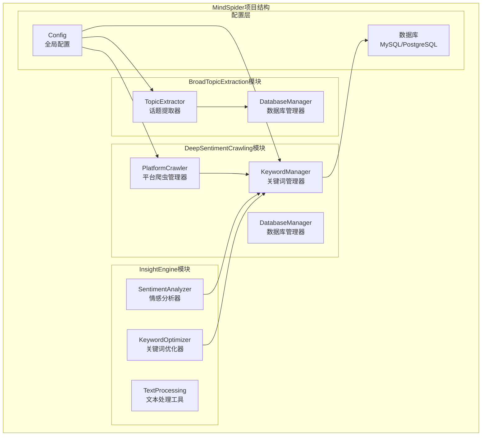

**图表来源**
- [keyword_manager.py](file://MindSpider/DeepSentimentCrawling/keyword_manager.py#L29-L317)
- [platform_crawler.py](file://MindSpider/DeepSentimentCrawling/platform_crawler.py#L27-L491)
- [database_manager.py](file://MindSpider/BroadTopicExtraction/database_manager.py#L29-L323)

**章节来源**
- [keyword_manager.py](file://MindSpider/DeepSentimentCrawling/keyword_manager.py#L1-L336)
- [main.py](file://MindSpider/DeepSentimentCrawling/main.py#L21-L189)

## 核心组件

### 关键词管理器 (KeywordManager)

关键词管理器是整个系统的中枢组件，负责：

#### 数据库连接管理
- 支持MySQL和PostgreSQL双数据库类型
- 自动检测数据库驱动并提供详细的错误信息
- 连接池管理和资源清理

#### 关键词获取策略
- **优先级策略**：当日关键词 → 最近7天关键词 → 默认关键词
- **随机采样**：当关键词数量超过限制时进行随机采样
- **去重处理**：合并多个日期的关键词时进行去重

#### 平台适配机制
- 平台偏好关键词映射
- 基于平台特性的关键词过滤
- 统一关键词分发策略

**章节来源**
- [keyword_manager.py](file://MindSpider/DeepSentimentCrawling/keyword_manager.py#L29-L317)

### 数据库管理器 (DatabaseManager)

负责BroadTopicExtraction模块的数据库操作：

#### 新闻数据管理
- 每日新闻数据的存储和查询
- 支持覆盖模式和增量更新
- 自动去重和数据完整性保证

#### 话题数据分析
- 每日话题关键词的存储
- 自动生成话题ID和描述
- 支持话题关联关系维护

**章节来源**
- [database_manager.py](file://MindSpider/BroadTopicExtraction/database_manager.py#L29-L323)

### 话题提取器 (TopicExtractor)

基于LLM的关键词提取组件：

#### 关键词提取算法
- 基于DeepSeek API的智能关键词提取
- 支持JSON格式输出和手动解析
- 关键词质量验证和清理

#### 分析提示词构建
- 动态构建分析提示词
- 支持多平台新闻内容分析
- 结果格式标准化

**章节来源**
- [topic_extractor.py](file://MindSpider/BroadTopicExtraction/topic_extractor.py#L25-L290)

## 架构概览

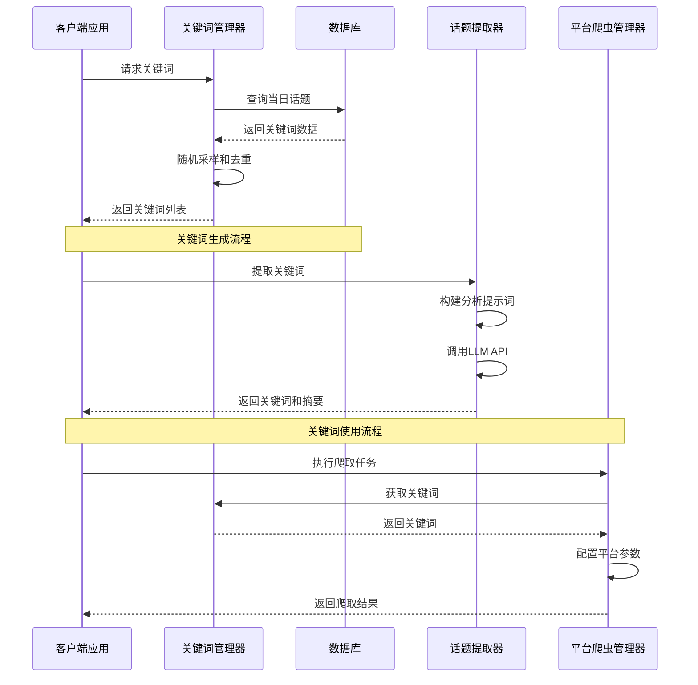

**图表来源**
- [keyword_manager.py](file://MindSpider/DeepSentimentCrawling/keyword_manager.py#L60-L112)
- [topic_extractor.py](file://MindSpider/BroadTopicExtraction/topic_extractor.py#L36-L81)
- [platform_crawler.py](file://MindSpider/DeepSentimentCrawling/platform_crawler.py#L218-L309)

## 详细组件分析

### 关键词提取算法

#### 多源数据融合策略

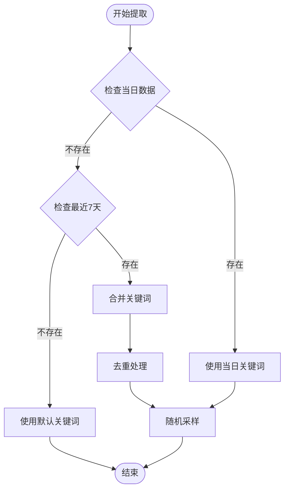

**图表来源**
- [keyword_manager.py](file://MindSpider/DeepSentimentCrawling/keyword_manager.py#L60-L112)

#### 关键词质量控制

关键词提取过程中实施多层次的质量控制：

1. **格式验证**：确保关键词符合长度和格式要求
2. **去重处理**：移除重复的关键词
3. **随机采样**：控制关键词数量上限
4. **平台适配**：根据平台特性调整关键词

**章节来源**
- [keyword_manager.py](file://MindSpider/DeepSentimentCrawling/keyword_manager.py#L60-L112)

### 情感词汇过滤机制

#### 多语言情感分析集成

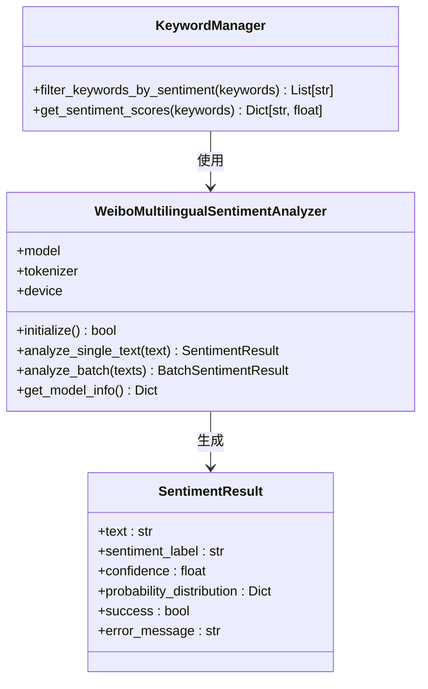

**图表来源**
- [sentiment_analyzer.py](file://InsightEngine/tools/sentiment_analyzer.py#L79-L632)
- [keyword_manager.py](file://MindSpider/DeepSentimentCrawling/keyword_manager.py#L231-L275)

#### 情感极性标注策略

情感分析系统支持五级情感分类：
- 非常负面 (Very Negative)
- 负面 (Negative)  
- 中性 (Neutral)
- 正面 (Positive)
- 非常正面 (Very Positive)

**章节来源**
- [sentiment_analyzer.py](file://InsightEngine/tools/sentiment_analyzer.py#L94-L101)

### 关键词权重计算策略

#### 平台偏好权重分配

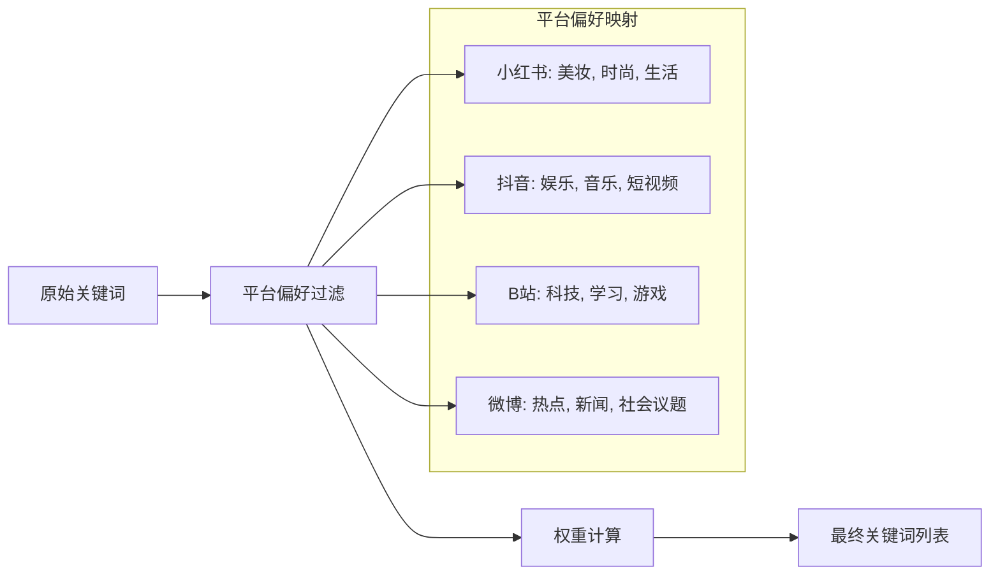

**图表来源**
- [keyword_manager.py](file://MindSpider/DeepSentimentCrawling/keyword_manager.py#L243-L274)

#### 关键词相关性评分

权重计算基于以下因素：
1. **平台匹配度**：关键词与平台内容类型的匹配程度
2. **流行度指数**：基于历史搜索数据的流行度评估
3. **时效性因子**：考虑关键词的时间敏感性
4. **多样性平衡**：确保关键词分布的均衡性

**章节来源**
- [keyword_manager.py](file://MindSpider/DeepSentimentCrawling/keyword_manager.py#L231-L275)

### 关键词数据库管理

#### 数据库表结构设计

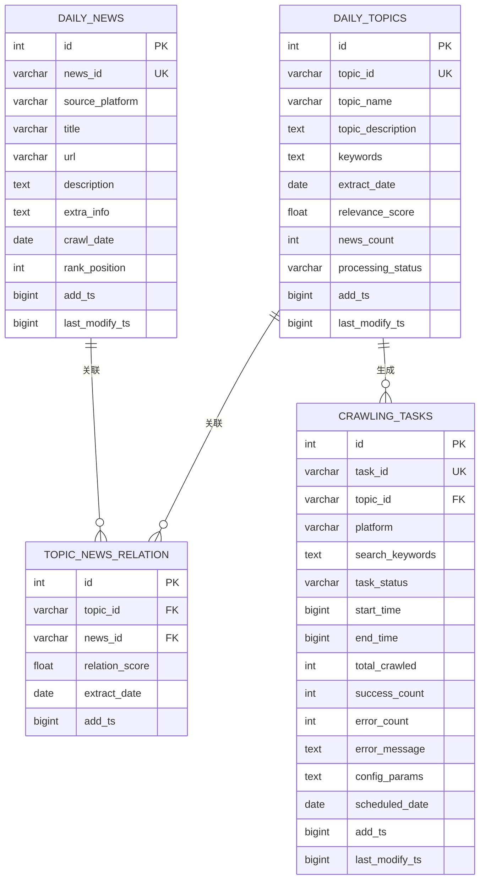

**图表来源**
- [mindspider_tables.sql](file://MindSpider/schema/mindspider_tables.sql#L12-L106)

#### 数据库连接配置

支持MySQL和PostgreSQL双数据库类型：

| 配置项 | MySQL默认值 | PostgreSQL默认值 |
|--------|-------------|------------------|
| DB_DIALECT | mysql | postgresql |
| DB_HOST | localhost | localhost |
| DB_PORT | 3306 | 5432 |
| DB_CHARSET | utf8mb4 | utf8 |
| 驱动程序 | pymysql | psycopg2 |

**章节来源**
- [config.py](file://MindSpider/config.py#L16-L35)
- [database_manager.py](file://MindSpider/BroadTopicExtraction/database_manager.py#L37-L59)

### 动态更新机制

#### 实时数据同步

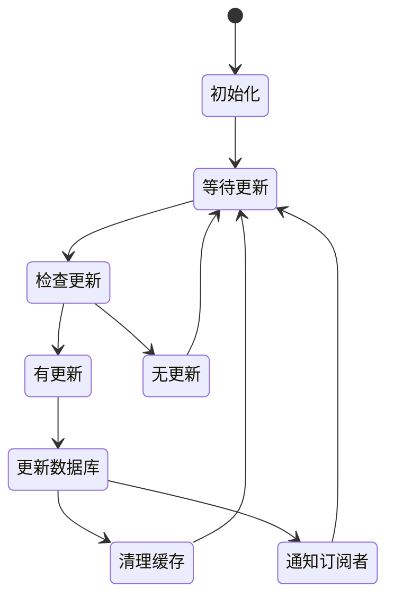

#### 缓存策略

- **内存缓存**：短期高频访问的关键词数据
- **数据库缓存**：长期稳定的关键词元数据
- **文件缓存**：持久化的关键词备份

**章节来源**
- [keyword_manager.py](file://MindSpider/DeepSentimentCrawling/keyword_manager.py#L37-L58)

### 多语言支持

#### 语言处理能力

关键词管理器支持以下语言的处理：

| 语言类别 | 支持语言 | 处理能力 |
|----------|----------|----------|
| 中文 | 中文 | 标准分词、情感分析 |
| 英文 | 英语 | 词干提取、情感分析 |
| 多语言 | 22种语言 | 统一情感分析接口 |
| 专用语言 | 日语、韩语、阿拉伯语等 | 专业分词处理 |

#### 语言检测和处理

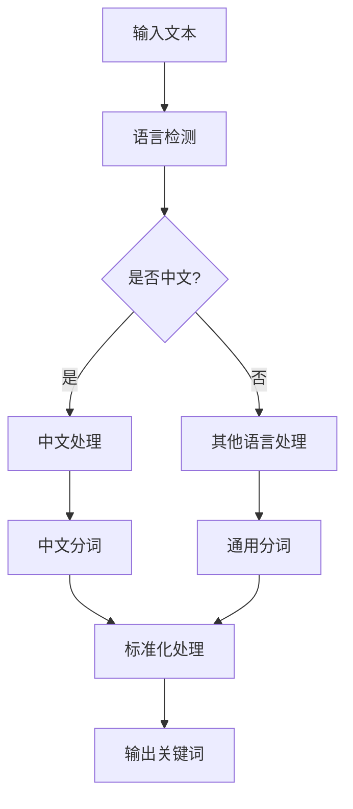

**图表来源**
- [sentiment_analyzer.py](file://InsightEngine/tools/sentiment_analyzer.py#L601-L624)

**章节来源**
- [sentiment_analyzer.py](file://InsightEngine/tools/sentiment_analyzer.py#L186-L231)

### 关键词分类体系

#### 分类层次结构

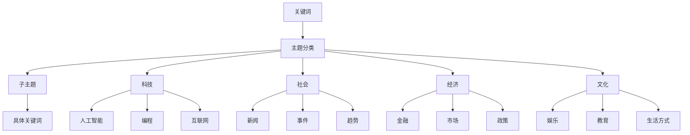

#### 分类标准

1. **内容相关性**：关键词与主题的匹配程度
2. **时效性**：关键词的时间敏感性和新鲜度
3. **地域性**：关键词的地理适用范围
4. **受众特征**：关键词的目标用户群体

### 情感极性标注

#### 情感强度分级

| 级别 | 情感标签 | 置信度范围 | 描述 |
|------|----------|------------|------|
| 1 | 非常负面 | 0.8-1.0 | 极度负面情绪 |
| 2 | 负面 | 0.6-0.8 | 明显负面情绪 |
| 3 | 中性 | 0.4-0.6 | 客观中性描述 |
| 4 | 正面 | 0.2-0.4 | 轻微正面情绪 |
| 5 | 非常正面 | 0.0-0.2 | 极度正面情绪 |

#### 情感标注流程

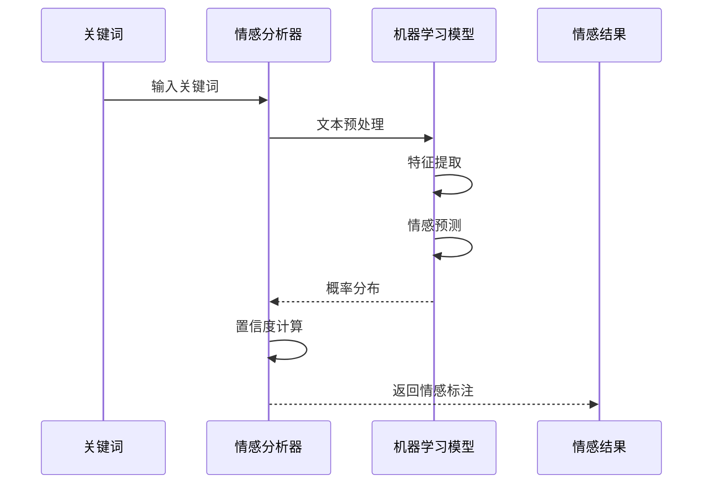

**图表来源**
- [sentiment_analyzer.py](file://InsightEngine/tools/sentiment_analyzer.py#L323-L344)

**章节来源**
- [sentiment_analyzer.py](file://InsightEngine/tools/sentiment_analyzer.py#L94-L101)

### 相似词扩展算法

#### 语义相似度计算

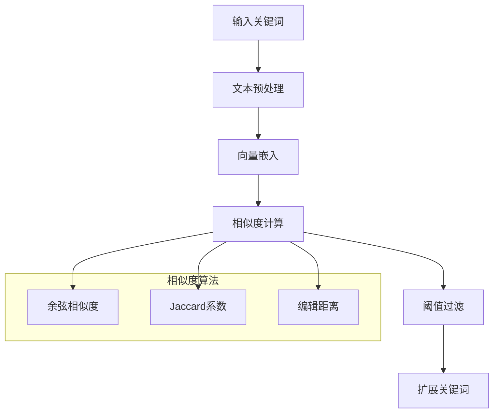

#### 扩展策略

1. **同义词扩展**：基于词典的同义词查找
2. **上下位词扩展**：基于语义层次的上下位关系
3. **相关词扩展**：基于共现关系的相关词发现
4. **组合扩展**：多种策略的组合使用

**章节来源**
- [keyword_optimizer.py](file://InsightEngine/tools/keyword_optimizer.py#L150-L190)

## 依赖关系分析

### 外部依赖

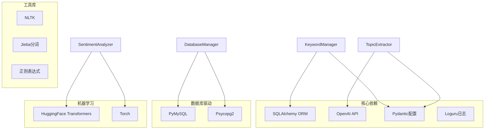

**图表来源**
- [keyword_manager.py](file://MindSpider/DeepSentimentCrawling/keyword_manager.py#L14-L27)
- [topic_extractor.py](file://MindSpider/BroadTopicExtraction/topic_extractor.py#L13-L23)
- [sentiment_analyzer.py](file://InsightEngine/tools/sentiment_analyzer.py#L12-L29)

### 内部组件依赖

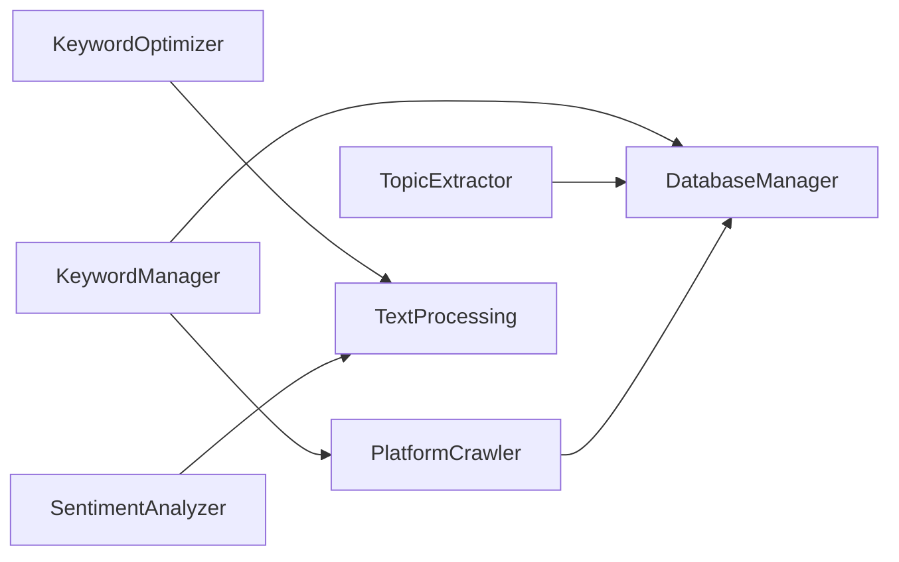

**图表来源**
- [main.py](file://MindSpider/DeepSentimentCrawling/main.py#L18-L28)

**章节来源**
- [keyword_manager.py](file://MindSpider/DeepSentimentCrawling/keyword_manager.py#L1-L336)
- [platform_crawler.py](file://MindSpider/DeepSentimentCrawling/platform_crawler.py#L1-L491)

## 性能考虑

### 数据库性能优化

#### 索引策略

| 表名 | 索引类型 | 字段 | 目的 |
|------|----------|------|------|
| daily_news | 唯一键 | news_id, source_platform, crawl_date | 唯一性约束 |
| daily_news | 普通索引 | crawl_date | 查询性能 |
| daily_news | 普通索引 | source_platform | 平台过滤 |
| daily_topics | 唯一键 | topic_id, extract_date | 唯一性约束 |
| daily_topics | 普通索引 | extract_date | 时间查询 |
| daily_topics | 普通索引 | processing_status | 状态过滤 |

#### 查询优化

1. **批量操作**：使用批量插入减少数据库往返
2. **连接池**：复用数据库连接提高性能
3. **缓存策略**：热点数据缓存减少查询压力
4. **分区表**：大数据量时考虑表分区

### 关键词处理性能

#### 内存管理

- **流式处理**：大数据量时采用流式处理避免内存溢出
- **分页查询**：数据库查询结果分页处理
- **垃圾回收**：及时释放不再使用的对象

#### 并发处理

- **异步操作**：I/O密集型操作异步化
- **线程池**：合理配置线程池大小
- **锁机制**：避免死锁和资源竞争

### 网络通信优化

#### API调用优化

- **请求重试**：网络异常时自动重试
- **超时控制**：合理设置请求超时时间
- **连接复用**：HTTP连接复用减少开销

## 故障排除指南

### 数据库连接问题

#### 常见错误及解决方案

| 错误类型 | 错误信息 | 解决方案 |
|----------|----------|----------|
| 驱动缺失 | ModuleNotFoundError | 安装对应数据库驱动 |
| 连接超时 | TimeoutError | 检查网络连接和防火墙设置 |
| 认证失败 | AuthenticationFailed | 验证用户名密码正确性 |
| 数据库不存在 | DatabaseNotFound | 确认数据库名称和权限 |

#### 调试步骤

1. **检查配置文件**：验证数据库连接参数
2. **测试连接**：使用最小化配置测试连接
3. **查看日志**：分析详细的错误日志信息
4. **网络诊断**：检查网络连通性和端口开放情况

**章节来源**
- [keyword_manager.py](file://MindSpider/DeepSentimentCrawling/keyword_manager.py#L47-L58)

### 关键词提取失败

#### 问题诊断

1. **LLM API问题**：检查API密钥和网络连接
2. **输入格式问题**：验证新闻数据格式和内容
3. **解析错误**：检查JSON解析和格式化逻辑
4. **超时问题**：增加超时时间和重试机制

#### 解决方案

- **降级策略**：实现手动关键词提取作为后备方案
- **错误恢复**：自动重试和错误处理机制
- **日志记录**：详细记录错误信息便于调试
- **监控告警**：建立异常情况的监控和告警

### 情感分析异常

#### 常见问题

1. **模型加载失败**：检查模型文件和依赖库
2. **GPU内存不足**：降低批处理大小或使用CPU
3. **输入格式错误**：验证文本预处理和编码
4. **推理速度慢**：优化模型配置和硬件资源

#### 诊断方法

- **模型状态检查**：确认模型初始化状态
- **设备检测**：验证GPU/CPU可用性
- **内存监控**：监控内存使用情况
- **性能基准测试**：测量推理性能指标

**章节来源**
- [sentiment_analyzer.py](file://InsightEngine/tools/sentiment_analyzer.py#L170-L240)

## 结论

关键词管理器作为MindSpider项目的核心组件，实现了以下关键功能：

### 技术优势

1. **模块化设计**：清晰的组件分离和职责划分
2. **多数据库支持**：灵活的数据库抽象层设计
3. **智能关键词提取**：基于LLM的高质量关键词生成
4. **情感分析集成**：多语言情感分析能力
5. **平台适配机制**：针对不同平台的关键词优化

### 架构特点

- **可扩展性**：支持新的关键词提取算法和情感分析模型
- **可靠性**：完善的错误处理和容错机制
- **性能优化**：数据库索引、缓存和并发处理优化
- **易维护性**：清晰的代码结构和详细的文档

### 应用价值

关键词管理器为整个MindSpider生态系统提供了统一的关键词管理基础设施，支撑着深度情感分析、多平台内容爬取和智能报告生成等核心功能。通过持续的技术优化和功能扩展，该组件将继续发挥重要作用。

## 附录

### 配置参数说明

#### 数据库配置

| 参数名 | 类型 | 默认值 | 描述 |
|--------|------|--------|------|
| DB_DIALECT | str | "mysql" | 数据库类型，支持"mysql"或"postgresql" |
| DB_HOST | str | "localhost" | 数据库主机地址 |
| DB_PORT | int | 3306 | 数据库端口号 |
| DB_USER | str | "root" | 数据库用户名 |
| DB_PASSWORD | str | "" | 数据库密码 |
| DB_NAME | str | "mindspider" | 数据库名称 |
| DB_CHARSET | str | "utf8mb4" | 数据库字符集 |

#### LLM配置

| 参数名 | 类型 | 默认值 | 描述 |
|--------|------|--------|------|
| MINDSPIDER_API_KEY | Optional[str] | None | DeepSeek API密钥 |
| MINDSPIDER_BASE_URL | Optional[str] | "https://api.deepseek.com" | API基础URL |
| MINDSPIDER_MODEL_NAME | Optional[str] | "deepseek-chat" | 模型名称 |

#### 关键词优化配置

| 参数名 | 类型 | 默认值 | 描述 |
|--------|------|--------|------|
| KEYWORD_OPTIMIZER_API_KEY | Optional[str] | None | 关键词优化API密钥 |
| KEYWORD_OPTIMIZER_BASE_URL | Optional[str] | None | 关键词优化API基础URL |
| KEYWORD_OPTIMIZER_MODEL_NAME | Optional[str] | None | 关键词优化模型名称 |

### 使用场景示例

#### 基础使用

```python
from keyword_manager import KeywordManager

# 创建关键词管理器实例
km = KeywordManager()

# 获取关键词
keywords = km.get_latest_keywords(max_keywords=100)
print(f"获取到 {len(keywords)} 个关键词")

# 获取平台关键词
platform_keywords = km.get_keywords_for_platform(
    platform="xhs", 
    max_keywords=50
)
```

#### 高级配置

```python
# 自定义数据库连接
km = KeywordManager()
km.connect()

# 获取最近7天的关键词
recent_keywords = km.get_recent_topics(days=7)

# 获取爬取摘要
summary = km.get_crawling_summary(target_date=date.today())
```

#### 错误处理

```python
try:
    keywords = km.get_latest_keywords(max_keywords=100)
except Exception as e:
    logger.error(f"获取关键词失败: {e}")
    # 使用默认关键词
    keywords = km._get_default_keywords()
```

### 扩展开发指导

#### 新增关键词提取算法

1. **继承基类**：创建新的关键词提取器类
2. **实现接口**：遵循统一的接口规范
3. **集成测试**：编写完整的单元测试
4. **文档更新**：更新相关文档和示例

#### 添加情感分析模型

1. **模型适配**：适配新的情感分析模型
2. **接口封装**：提供统一的调用接口
3. **性能优化**：优化推理速度和内存使用
4. **错误处理**：完善异常处理和降级策略

#### 平台扩展

1. **平台适配**：添加新的社交媒体平台支持
2. **关键词映射**：建立平台特性的关键词映射
3. **爬取配置**：配置平台特定的爬取参数
4. **测试验证**：验证新平台的功能和稳定性