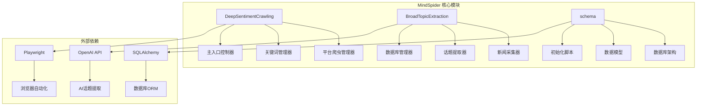
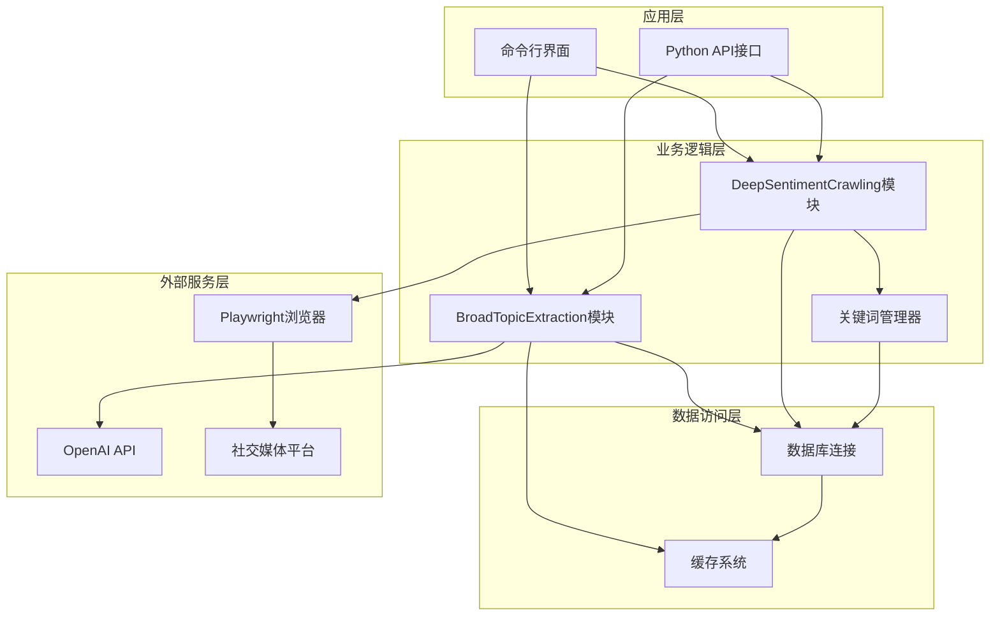
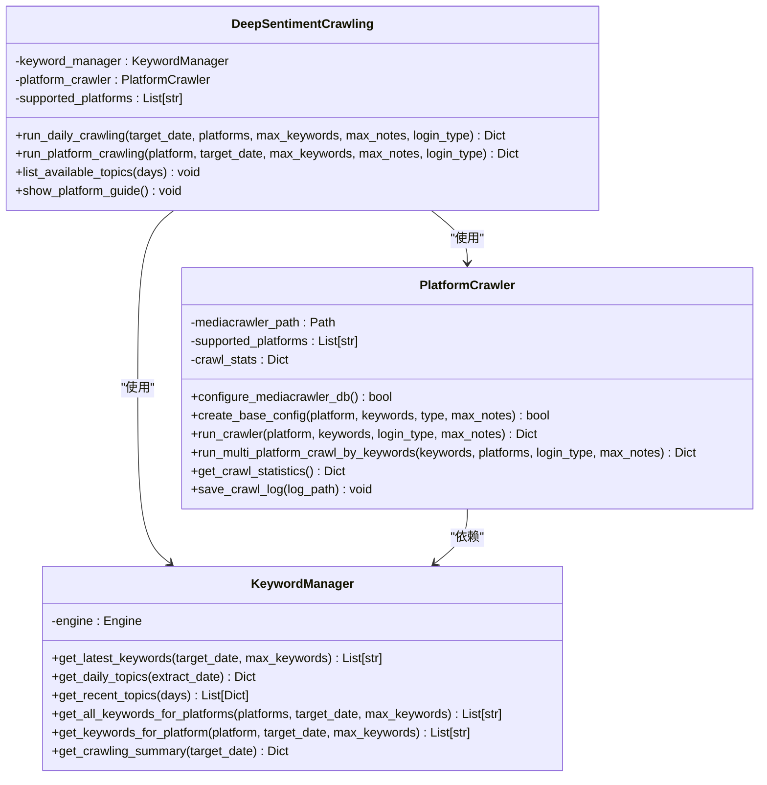
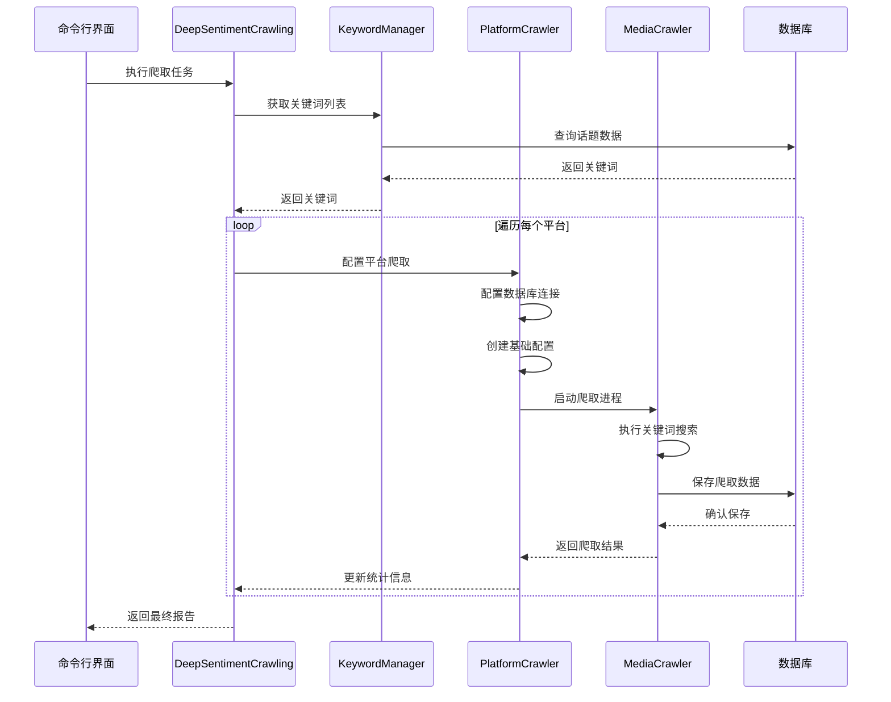
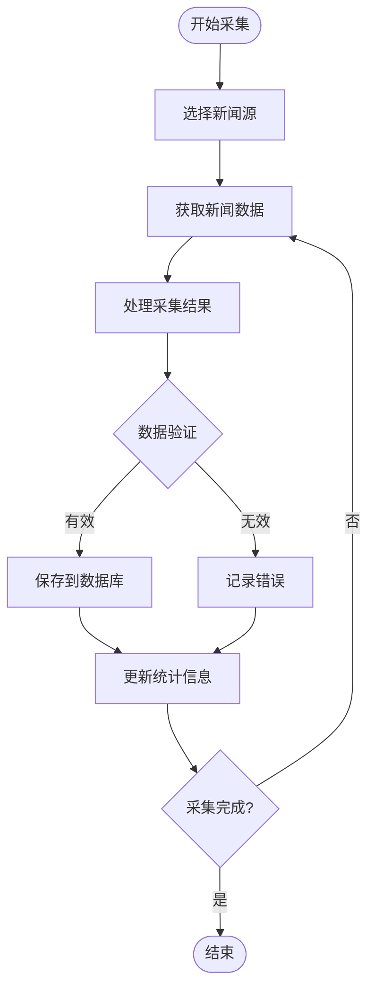
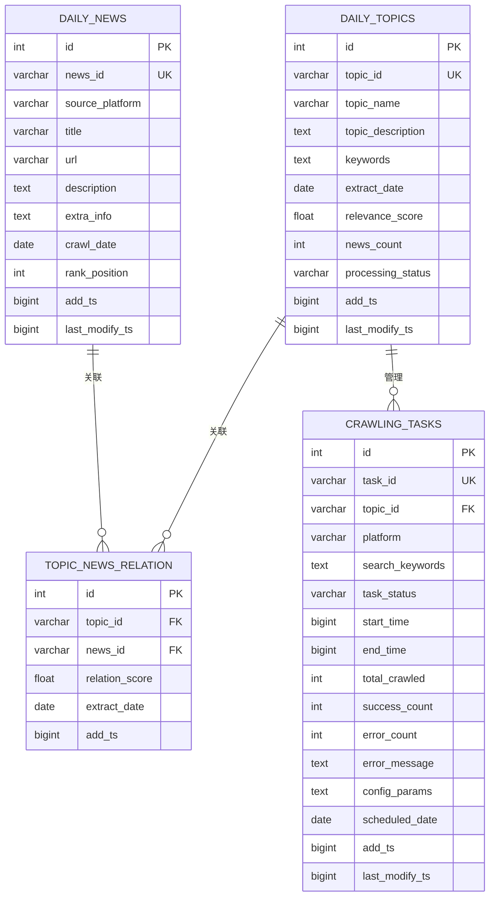
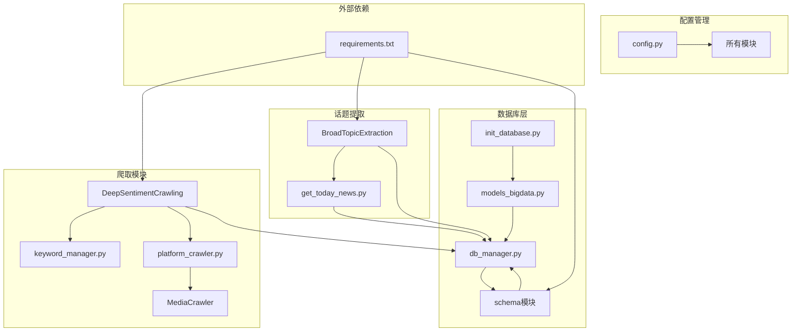

# 媒体爬虫系统

<cite>
**本文档引用的文件**
- [MindSpider/README.md](file://MindSpider/README.md)
- [MindSpider/requirements.txt](file://MindSpider/requirements.txt)
- [MindSpider/config.py](file://MindSpider/config.py)
- [MindSpider/DeepSentimentCrawling/main.py](file://MindSpider/DeepSentimentCrawling/main.py)
- [MindSpider/DeepSentimentCrawling/platform_crawler.py](file://MindSpider/DeepSentimentCrawling/platform_crawler.py)
- [MindSpider/DeepSentimentCrawling/keyword_manager.py](file://MindSpider/DeepSentimentCrawling/keyword_manager.py)
- [MindSpider/DeepSentimentCrawling/MediaCrawler/config/db_config.py](file://MindSpider/DeepSentimentCrawling/MediaCrawler/config/db_config.py)
- [MindSpider/DeepSentimentCrawling/MediaCrawler/config/base_config.py](file://MindSpider/DeepSentimentCrawling/MediaCrawler/config/base_config.py)
- [MindSpider/BroadTopicExtraction/get_today_news.py](file://MindSpider/BroadTopicExtraction/get_today_news.py)
- [MindSpider/schema/mindspider_tables.sql](file://MindSpider/schema/mindspider_tables.sql)
- [MindSpider/schema/init_database.py](file://MindSpider/schema/init_database.py)
- [MindSpider/schema/db_manager.py](file://MindSpider/schema/db_manager.py)
- [MindSpider/schema/models_bigdata.py](file://MindSpider/schema/models_bigdata.py)
</cite>

## 目录
1. [简介](#简介)
2. [项目结构](#项目结构)
3. [核心组件](#核心组件)
4. [架构概览](#架构概览)
5. [详细组件分析](#详细组件分析)
6. [依赖关系分析](#依赖关系分析)
7. [性能考虑](#性能考虑)
8. [故障排除指南](#故障排除指南)
9. [结论](#结论)
10. [附录](#附录)

## 简介

媒体爬虫系统是一个基于AI技术的智能舆情分析平台，专门设计用于从多个社交媒体平台自动收集和分析媒体内容。该系统采用模块化架构，结合了BroadTopicExtraction话题提取模块和DeepSentimentCrawling深度爬取模块，实现了从热点发现到内容分析的完整自动化流程。

系统支持7个主要社交媒体平台：小红书(XHS)、抖音(DY)、快手(KS)、B站(BILI)、微博(WB)、贴吧(TIEBA)和知乎(ZHIHU)。通过AI驱动的话题提取和关键词生成，系统能够精准定位热点内容并进行深度分析。

## 项目结构

媒体爬虫系统采用清晰的模块化组织结构，主要分为以下几个核心模块：



**图表来源**
- [MindSpider/README.md](file://MindSpider/README.md#L31-L71)
- [MindSpider/requirements.txt](file://MindSpider/requirements.txt#L1-L63)

**章节来源**
- [MindSpider/README.md](file://MindSpider/README.md#L31-L71)
- [MindSpider/requirements.txt](file://MindSpider/requirements.txt#L1-L63)

## 核心组件

### 1. DeepSentimentCrawling 深度爬取模块

深度爬取模块是系统的核心执行引擎，负责基于话题关键词在各个社交媒体平台进行内容爬取。

**主要功能特性：**
- 多平台支持：小红书、抖音、快手、B站、微博、贴吧、知乎
- 自动化登录：支持二维码、手机号、Cookie等多种登录方式
- 关键词管理：从BroadTopicExtraction模块获取并管理关键词
- 数据持久化：支持MySQL和PostgreSQL数据库存储
- 统计监控：提供详细的爬取统计和性能监控

### 2. BroadTopicExtraction 话题提取模块

话题提取模块负责每日热点新闻的自动发现和AI驱动的话题分析。

**核心能力：**
- 多源新闻采集：支持13个主流平台的热点新闻抓取
- AI话题分析：使用DeepSeek API进行智能话题提取
- 关键词生成：自动生成相关的搜索关键词
- 数据存储：将话题和关键词结构化存储到数据库

### 3. 数据库架构模块

系统采用扩展的数据库架构，既支持MediaCrawler的原始表结构，又增加了MindSpider特有的业务表。

**核心数据表：**
- daily_news：每日热点新闻表
- daily_topics：每日话题表  
- topic_news_relation：话题新闻关联表
- crawling_tasks：爬取任务表
- 平台内容表：继承自MediaCrawler的7个平台内容表

**章节来源**
- [MindSpider/DeepSentimentCrawling/main.py](file://MindSpider/DeepSentimentCrawling/main.py#L21-L28)
- [MindSpider/BroadTopicExtraction/get_today_news.py](file://MindSpider/BroadTopicExtraction/get_today_news.py#L45-L52)
- [MindSpider/schema/mindspider_tables.sql](file://MindSpider/schema/mindspider_tables.sql#L8-L106)

## 架构概览

系统采用分层架构设计，实现了高度解耦和可扩展的模块化结构：



**图表来源**
- [MindSpider/README.md](file://MindSpider/README.md#L77-L145)
- [MindSpider/DeepSentimentCrawling/platform_crawler.py](file://MindSpider/DeepSentimentCrawling/platform_crawler.py#L27-L40)

**章节来源**
- [MindSpider/README.md](file://MindSpider/README.md#L77-L145)

## 详细组件分析

### 平台爬虫管理器

平台爬虫管理器是DeepSentimentCrawling模块的核心协调组件，负责管理多个社交媒体平台的爬取任务。

#### 核心功能架构



**图表来源**
- [MindSpider/DeepSentimentCrawling/platform_crawler.py](file://MindSpider/DeepSentimentCrawling/platform_crawler.py#L27-L41)
- [MindSpider/DeepSentimentCrawling/keyword_manager.py](file://MindSpider/DeepSentimentCrawling/keyword_manager.py#L29-L36)
- [MindSpider/DeepSentimentCrawling/main.py](file://MindSpider/DeepSentimentCrawling/main.py#L21-L30)

#### 数据流处理流程



**图表来源**
- [MindSpider/DeepSentimentCrawling/main.py](file://MindSpider/DeepSentimentCrawling/main.py#L30-L97)
- [MindSpider/DeepSentimentCrawling/platform_crawler.py](file://MindSpider/DeepSentimentCrawling/platform_crawler.py#L218-L301)

**章节来源**
- [MindSpider/DeepSentimentCrawling/platform_crawler.py](file://MindSpider/DeepSentimentCrawling/platform_crawler.py#L27-L491)
- [MindSpider/DeepSentimentCrawling/keyword_manager.py](file://MindSpider/DeepSentimentCrawling/keyword_manager.py#L29-L336)
- [MindSpider/DeepSentimentCrawling/main.py](file://MindSpider/DeepSentimentCrawling/main.py#L21-L189)

### 新闻采集器

新闻采集器负责从多个社交媒体平台自动收集热点新闻内容。

#### 新闻采集流程



**图表来源**
- [MindSpider/BroadTopicExtraction/get_today_news.py](file://MindSpider/BroadTopicExtraction/get_today_news.py#L154-L208)

#### 支持的新闻源

系统支持13个主要的新闻源平台，包括：
- 微博热搜、知乎热榜、B站热搜
- 今日头条、抖音热榜、GitHub趋势
- 酷安热榜、百度贴吧、华尔街见闻
- 澎湃新闻、财联社、雪球热榜

**章节来源**
- [MindSpider/BroadTopicExtraction/get_today_news.py](file://MindSpider/BroadTopicExtraction/get_today_news.py#L45-L44)

### 数据库架构

系统采用扩展的数据库架构，支持MySQL和PostgreSQL两种数据库类型。

#### 核心数据表结构



**图表来源**
- [MindSpider/schema/mindspider_tables.sql](file://MindSpider/schema/mindspider_tables.sql#L12-L106)

**章节来源**
- [MindSpider/schema/mindspider_tables.sql](file://MindSpider/schema/mindspider_tables.sql#L1-L202)

## 依赖关系分析

系统采用模块化依赖设计，各组件之间保持松耦合关系。

### 核心依赖关系



**图表来源**
- [MindSpider/requirements.txt](file://MindSpider/requirements.txt#L1-L63)
- [MindSpider/config.py](file://MindSpider/config.py#L16-L35)

### 数据库连接配置

系统支持灵活的数据库配置，支持MySQL和PostgreSQL两种数据库类型：

**数据库配置选项：**
- DB_DIALECT: 数据库类型（mysql/postgresql）
- DB_HOST: 数据库主机地址
- DB_PORT: 数据库端口
- DB_USER: 用户名
- DB_PASSWORD: 密码
- DB_NAME: 数据库名称
- DB_CHARSET: 字符集

**章节来源**
- [MindSpider/config.py](file://MindSpider/config.py#L16-L35)
- [MindSpider/requirements.txt](file://MindSpider/requirements.txt#L7-L13)

## 性能考虑

### 爬取性能优化

系统在设计时充分考虑了性能优化，采用了多种策略来提升爬取效率：

1. **异步并发处理**：使用AsyncIO实现异步并发爬取，提高数据采集效率
2. **数据库连接池**：通过SQLAlchemy连接池管理数据库连接，减少连接开销
3. **缓存机制**：集成Redis缓存系统，缓存热点数据和频繁访问的内容
4. **代理池管理**：支持代理IP轮换，避免被目标平台限制
5. **资源监控**：实时监控系统资源使用情况，防止资源耗尽

### 存储优化策略

1. **索引优化**：为高频查询字段建立复合索引，提升查询性能
2. **分区表**：支持按日期分区管理大量历史数据
3. **数据压缩**：对文本内容进行压缩存储，节省存储空间
4. **归档策略**：提供自动数据归档功能，清理过期历史数据

### 爬取策略优化

1. **智能延时**：根据平台限制自动调整爬取间隔
2. **负载均衡**：在多个平台间平衡爬取负载
3. **错误重试**：实现智能错误重试机制，提高成功率
4. **断点续传**：支持长时间任务的断点续传功能

## 故障排除指南

### 常见问题及解决方案

#### 1. 登录问题

**问题现象：** 平台登录失败或二维码不显示

**解决步骤：**
1. 检查网络连接是否正常
2. 关闭无头模式，手动处理登录验证
3. 删除浏览器缓存重新登录
4. 检查平台Cookie有效性

**相关配置：**
- 修改 `HEADLESS = False` 以显示浏览器界面
- 清理 `browser_data/` 目录重新登录

#### 2. 数据库连接失败

**问题现象：** 系统无法连接到数据库

**解决步骤：**
1. 检查数据库服务是否正常运行
2. 验证数据库配置参数
3. 确认数据库驱动已正确安装
4. 检查防火墙设置

**支持的数据库驱动：**
- MySQL: `pymysql`, `aiomysql`
- PostgreSQL: `psycopg[binary]`, `asyncpg`

#### 3. 爬取数据为空

**问题现象：** 爬取结果显示无数据

**排查步骤：**
1. 确认平台已成功登录
2. 检查关键词是否存在
3. 验证爬取权限设置
4. 查看错误日志

#### 4. API调用失败

**问题现象：** AI话题提取API调用失败

**解决步骤：**
1. 检查API密钥配置
2. 验证API额度是否充足
3. 确认网络连接稳定
4. 查看API响应状态

**章节来源**
- [MindSpider/README.md](file://MindSpider/README.md#L365-L476)

### 调试和监控

系统提供了完善的调试和监控功能：

1. **日志系统**：使用Loguru框架记录详细的操作日志
2. **状态检查**：提供 `--status` 参数检查系统状态
3. **性能监控**：实时监控爬取性能和系统资源使用
4. **错误追踪**：完整的异常处理和错误信息记录

## 结论

媒体爬虫系统是一个功能完整、架构清晰的智能舆情分析平台。通过模块化设计和AI技术的深度融合，系统实现了从热点发现到内容分析的完整自动化流程。

**主要优势：**
- **高度模块化**：清晰的职责分离和松耦合设计
- **多平台支持**：全面覆盖主流社交媒体平台
- **AI驱动**：智能话题提取和关键词生成
- **性能优化**：异步并发和缓存机制提升效率
- **易于扩展**：插件化的架构支持功能扩展

**应用场景：**
- 媒体舆情监控
- 品牌声誉分析
- 市场趋势研究
- 竞争对手分析
- 危机预警系统

系统为用户提供了一个强大而易用的媒体内容分析工具，能够帮助用户快速获取和分析海量的社交媒体数据。

## 附录

### 配置文件说明

#### 环境变量配置

| 配置项 | 类型 | 描述 | 默认值 |
|--------|------|------|--------|
| DB_DIALECT | string | 数据库类型 | mysql |
| DB_HOST | string | 数据库主机 | localhost |
| DB_PORT | integer | 数据库端口 | 3306 |
| DB_USER | string | 数据库用户名 | root |
| DB_PASSWORD | string | 数据库密码 | 空 |
| DB_NAME | string | 数据库名称 | mindspider |
| DB_CHARSET | string | 数据库字符集 | utf8mb4 |
| MINDSPIDER_API_KEY | string | API密钥 | 空 |
| MINDSPIDER_BASE_URL | string | API基础URL | https://api.deepseek.com |

### 常用命令

```bash
# 检查系统状态
python main.py --status

# 运行完整流程（测试模式）
python main.py --complete --test

# 只运行话题提取
python main.py --broad-topic

# 只运行深度爬取
python main.py --deep-sentiment --test

# 指定平台爬取
python main.py --deep-sentiment --platforms xhs dy --test

# 指定日期爬取
python main.py --deep-sentiment --date 2024-01-15
```

### 支持的平台列表

| 代码 | 平台名称 | 主要功能 |
|------|----------|----------|
| xhs | 小红书 | 美妆、时尚、生活方式内容 |
| dy | 抖音 | 短视频、娱乐内容 |
| ks | 快手 | 生活、娱乐、农村题材 |
| bili | B站 | 科技、学习、游戏、动漫 |
| wb | 微博 | 热点新闻、社会话题 |
| tieba | 百度贴吧 | 兴趣讨论、社区内容 |
| zhihu | 知乎 | 知识问答、深度讨论 |