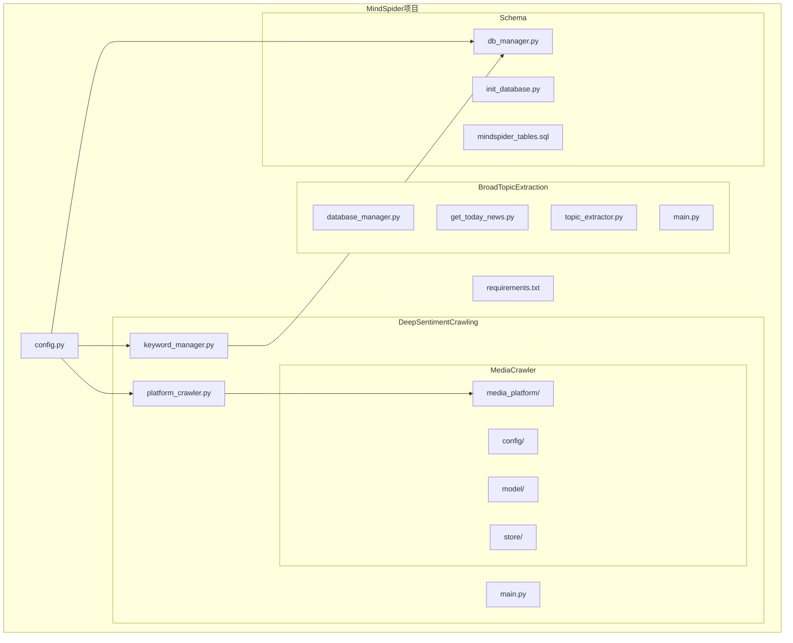
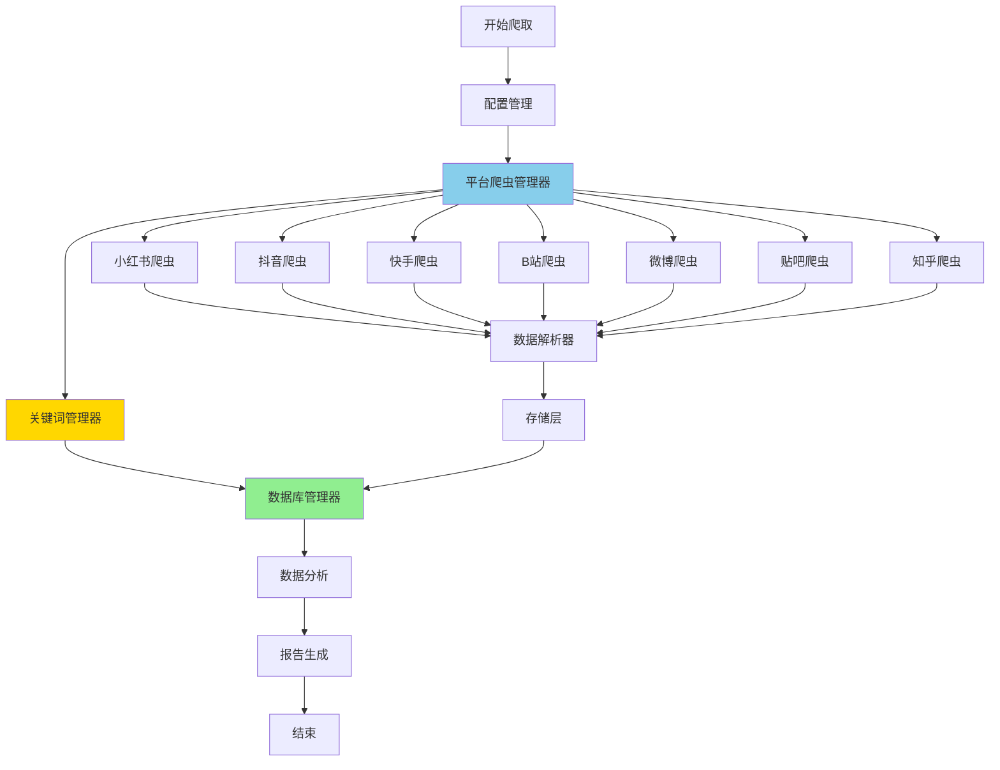
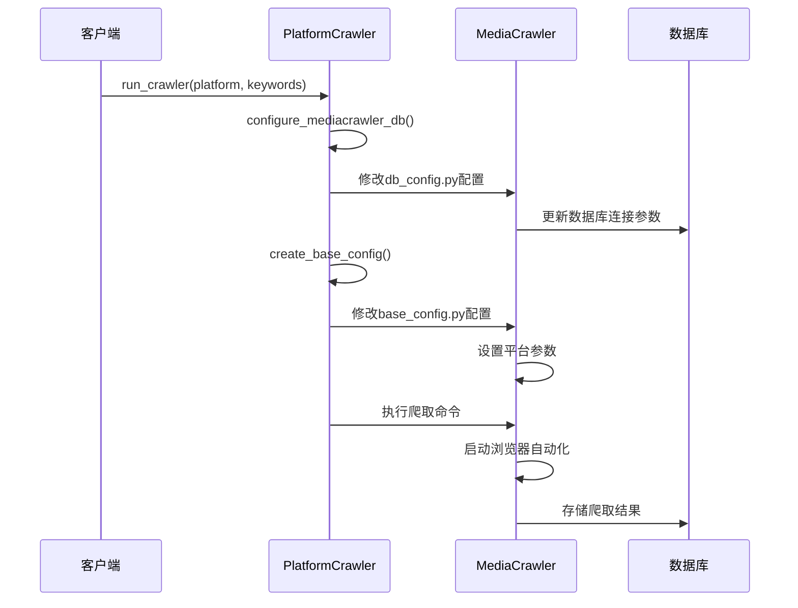
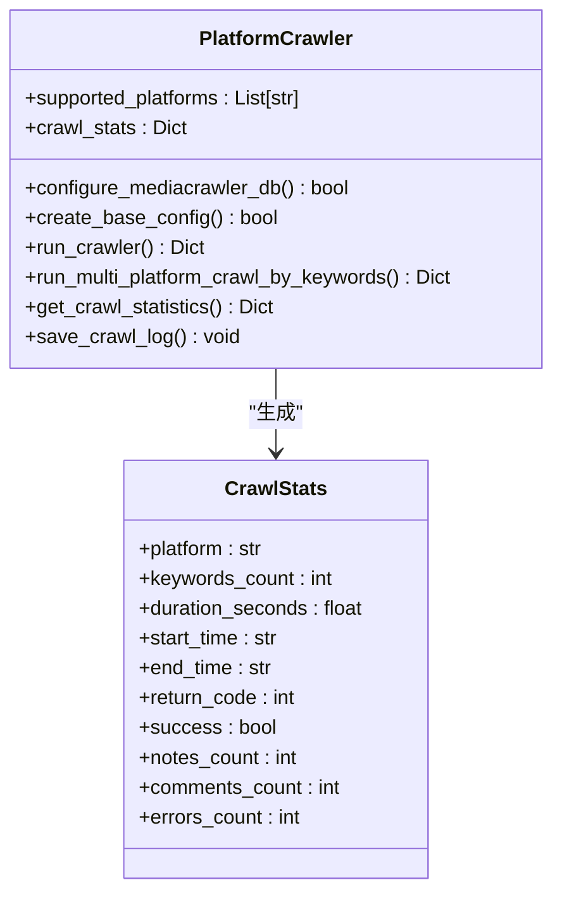
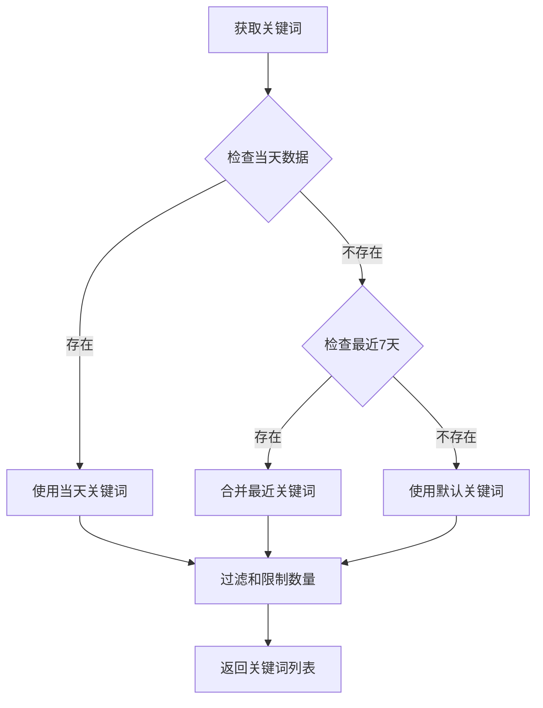
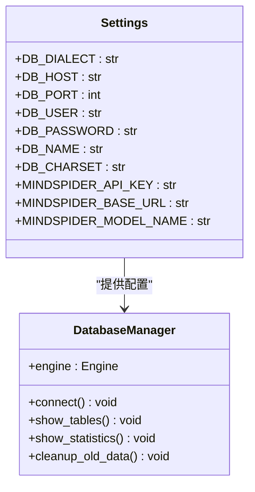
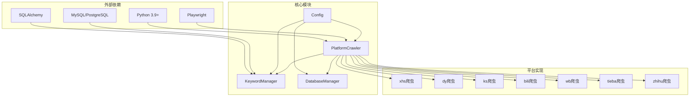

# 平台爬取器

<cite>
**本文档引用的文件**
- [platform_crawler.py](file://MindSpider/DeepSentimentCrawling/platform_crawler.py)
- [main.py](file://MindSpider/DeepSentimentCrawling/main.py)
- [keyword_manager.py](file://MindSpider/DeepSentimentCrawling/keyword_manager.py)
- [config.py](file://MindSpider/config.py)
- [db_manager.py](file://MindSpider/schema/db_manager.py)
- [requirements.txt](file://MindSpider/requirements.txt)
- [README.md](file://MindSpider/README.md)
</cite>

## 目录
1. [简介](#简介)
2. [项目结构](#项目结构)
3. [核心组件](#核心组件)
4. [架构概览](#架构概览)
5. [详细组件分析](#详细组件分析)
6. [依赖关系分析](#依赖关系分析)
7. [性能考虑](#性能考虑)
8. [故障排除指南](#故障排除指南)
9. [结论](#结论)

## 简介

平台爬取器是MindSpider AI爬虫系统中的核心组件，负责在多个社交媒体平台进行自动化内容爬取。该系统采用模块化设计，支持7个主流平台的深度内容抓取，包括小红书、抖音、快手、B站、微博、贴吧和知乎。

平台爬取器的主要功能包括：
- 多平台适配机制，支持7个主流社交媒体平台
- 平台API集成策略，统一的爬取接口
- 反爬虫应对方案，包括登录管理和请求频率控制
- 平台特定的数据结构解析和内容提取算法
- 增量更新机制，支持历史数据的持续更新
- 统一的认证流程和请求频率控制
- 数据格式标准化，确保跨平台数据一致性

## 项目结构

MindSpider项目采用清晰的模块化架构，平台爬取器位于DeepSentimentCrawling模块中：

**图表来源**
- [platform_crawler.py](file://MindSpider/DeepSentimentCrawling/platform_crawler.py#L1-L50)
- [keyword_manager.py](file://MindSpider/DeepSentimentCrawling/keyword_manager.py#L1-L50)
- [config.py](file://MindSpider/config.py#L1-L36)

**章节来源**
- [README.md](file://MindSpider/README.md#L31-L71)
- [requirements.txt](file://MindSpider/requirements.txt#L1-L63)

## 核心组件

平台爬取器系统由以下几个核心组件构成：

### 1. 平台爬虫管理器 (PlatformCrawler)
负责协调各个平台的爬取任务，提供统一的接口和配置管理。

### 2. 关键词管理器 (KeywordManager)
从数据库中获取和管理用于爬取的关键词，支持多平台关键词分配。

### 3. 配置管理系统
统一管理数据库连接、API密钥和爬取参数配置。

### 4. 数据库管理器
负责数据存储、查询和维护，支持MySQL和PostgreSQL两种数据库。

**章节来源**
- [platform_crawler.py](file://MindSpider/DeepSentimentCrawling/platform_crawler.py#L27-L41)
- [keyword_manager.py](file://MindSpider/DeepSentimentCrawling/keyword_manager.py#L29-L36)
- [config.py](file://MindSpider/config.py#L16-L35)

## 架构概览

平台爬取器采用分层架构设计，实现了高度的模块化和可扩展性：

**图表来源**
- [platform_crawler.py](file://MindSpider/DeepSentimentCrawling/platform_crawler.py#L27-L41)
- [keyword_manager.py](file://MindSpider/DeepSentimentCrawling/keyword_manager.py#L29-L36)

## 详细组件分析

### 平台爬虫管理器 (PlatformCrawler)

PlatformCrawler是平台爬取器的核心协调组件，负责管理7个支持平台的爬取任务。

#### 支持的平台列表
系统支持以下7个主流社交媒体平台：
- `xhs` - 小红书
- `dy` - 抖音
- `ks` - 快手
- `bili` - B站
- `wb` - 微博
- `tieba` - 贴吧
- `zhihu` - 知乎

#### 核心功能特性

##### 1. 动态配置管理

**图表来源**
- [platform_crawler.py](file://MindSpider/DeepSentimentCrawling/platform_crawler.py#L244-L308)

##### 2. 多平台并发爬取
系统支持按平台批量爬取，每个平台可以同时处理多个关键词：
- 每个平台一次性传递所有关键词
- 统一的爬取参数和配置
- 平台级别的错误处理和统计

##### 3. 统一的统计和日志

**图表来源**
- [platform_crawler.py](file://MindSpider/DeepSentimentCrawling/platform_crawler.py#L27-L41)
- [platform_crawler.py](file://MindSpider/DeepSentimentCrawling/platform_crawler.py#L280-L291)

**章节来源**
- [platform_crawler.py](file://MindSpider/DeepSentimentCrawling/platform_crawler.py#L27-L309)

### 关键词管理器 (KeywordManager)

关键词管理器负责从数据库中获取和管理用于爬取的关键词，支持多平台关键词分配策略。

#### 关键词获取策略

**图表来源**
- [keyword_manager.py](file://MindSpider/DeepSentimentCrawling/keyword_manager.py#L60-L111)

#### 平台特定关键词过滤
系统支持根据平台特性对关键词进行智能过滤：
- 小红书：美妆、时尚、生活、美食
- 抖音：娱乐、音乐、舞蹈、搞笑
- 快手：生活、搞笑、农村、美食
- B站：科技、游戏、动漫、学习
- 微博：热点、新闻、娱乐、明星
- 贴吧：游戏、动漫、学习、生活
- 知乎：知识、学习、科技、职场

**章节来源**
- [keyword_manager.py](file://MindSpider/DeepSentimentCrawling/keyword_manager.py#L180-L274)

### 配置管理系统

系统采用统一的配置管理机制，支持MySQL和PostgreSQL两种数据库类型：

#### 数据库配置策略

**图表来源**
- [config.py](file://MindSpider/config.py#L16-L35)
- [db_manager.py](file://MindSpider/schema/db_manager.py#L30-L48)

**章节来源**
- [config.py](file://MindSpider/config.py#L16-L35)
- [db_manager.py](file://MindSpider/schema/db_manager.py#L30-L48)

## 依赖关系分析

平台爬取器系统具有清晰的依赖层次结构，各组件之间的耦合度较低，便于维护和扩展。

**图表来源**
- [requirements.txt](file://MindSpider/requirements.txt#L1-L63)
- [platform_crawler.py](file://MindSpider/DeepSentimentCrawling/platform_crawler.py#L1-L25)

### 外部依赖分析

系统的关键外部依赖包括：

#### 1. 爬虫框架依赖
- **Playwright 1.45.0**: 浏览器自动化，支持多平台网页交互
- **Pillow 10.0.0**: 图像处理，支持截图和图像分析
- **requests 2.32.3**: HTTP请求处理
- **tenacity 8.2.2**: 重试机制，增强爬取稳定性

#### 2. 数据库依赖
- **SQLAlchemy**: ORM框架，支持MySQL和PostgreSQL
- **PyMySQL 1.1.0**: MySQL驱动
- **asyncpg**: PostgreSQL驱动
- **aiomysql 0.2.0**: 异步MySQL支持

#### 3. AI和分析依赖
- **OpenAI**: AI话题提取和分析
- **jieba 0.42.1**: 中文分词
- **wordcloud 1.9.3**: 词云生成
- **matplotlib 3.9.0**: 数据可视化

**章节来源**
- [requirements.txt](file://MindSpider/requirements.txt#L1-L63)

## 性能考虑

平台爬取器在设计时充分考虑了性能优化和资源管理：

### 1. 异步处理机制
系统采用异步I/O模型，支持高并发爬取：
- 使用asyncio进行异步任务调度
- SQLAlchemy异步引擎支持高并发数据库操作
- 异步HTTP客户端减少等待时间

### 2. 内存管理优化
- 临时文件和配置文件的自动清理
- 大数据量的分批处理
- 进程间通信的最小化

### 3. 网络请求优化
- 请求超时控制（默认60分钟）
- 自动重试机制
- 连接池管理

### 4. 数据库性能优化
- 适当的索引设计
- 批量数据插入
- 连接复用和池化

## 故障排除指南

### 常见问题及解决方案

#### 1. 平台登录失败
**问题症状**：二维码不显示或登录验证失败
**解决方法**：
- 关闭无头模式：修改`HEADLESS = False`
- 手动处理验证码
- 清除浏览器缓存重新登录

#### 2. 数据库连接问题
**问题症状**：数据库连接超时或认证失败
**解决方法**：
- 检查.env文件中的数据库配置
- 验证数据库服务状态
- 确认防火墙设置

#### 3. 爬取数据为空
**问题症状**：爬取完成后数据库中没有数据
**解决方法**：
- 确认平台登录状态
- 检查关键词有效性
- 使用测试模式验证

#### 4. 性能问题
**问题症状**：爬取速度慢或内存占用过高
**解决方法**：
- 调整并发数量
- 优化网络连接
- 增加系统资源

**章节来源**
- [README.md](file://MindSpider/README.md#L435-L476)

## 结论

平台爬取器组件展现了优秀的软件工程实践，具有以下特点：

### 设计优势
- **模块化架构**：清晰的职责分离和低耦合设计
- **可扩展性**：支持新平台和新功能的快速集成
- **稳定性**：完善的错误处理和恢复机制
- **性能优化**：异步处理和资源管理

### 技术亮点
- 统一的多平台适配机制
- 智能的关键词管理策略
- 完善的配置管理系统
- 标准化的数据处理流程

### 发展建议
- 增加更多的反爬虫应对策略
- 优化大数据量处理能力
- 扩展更多社交媒体平台支持
- 增强实时监控和告警功能

平台爬取器为舆情分析提供了强大的技术支撑，其设计理念和实现方式值得在类似项目中借鉴和应用。