# MindSpider AI爬虫系统

<cite>
**本文档引用的文件**
- [MindSpider/README.md](file://MindSpider/README.md)
- [MindSpider/main.py](file://MindSpider/main.py)
- [MindSpider/config.py](file://MindSpider/config.py)
- [MindSpider/requirements.txt](file://MindSpider/requirements.txt)
- [MindSpider/BroadTopicExtraction/main.py](file://MindSpider/BroadTopicExtraction/main.py)
- [MindSpider/BroadTopicExtraction/topic_extractor.py](file://MindSpider/BroadTopicExtraction/topic_extractor.py)
- [MindSpider/BroadTopicExtraction/get_today_news.py](file://MindSpider/BroadTopicExtraction/get_today_news.py)
- [MindSpider/BroadTopicExtraction/database_manager.py](file://MindSpider/BroadTopicExtraction/database_manager.py)
- [MindSpider/DeepSentimentCrawling/main.py](file://MindSpider/DeepSentimentCrawling/main.py)
- [MindSpider/DeepSentimentCrawling/keyword_manager.py](file://MindSpider/DeepSentimentCrawling/keyword_manager.py)
- [MindSpider/DeepSentimentCrawling/platform_crawler.py](file://MindSpider/DeepSentimentCrawling/platform_crawler.py)
- [MindSpider/schema/db_manager.py](file://MindSpider/schema/db_manager.py)
- [MindSpider/schema/mindspider_tables.sql](file://MindSpider/schema/mindspider_tables.sql)
- [MindSpider/schema/init_database.py](file://MindSpider/schema/init_database.py)
- [MindSpider/schema/models_sa.py](file://MindSpider/schema/models_sa.py)
- [MindSpider/schema/models_bigdata.py](file://MindSpider/schema/models_bigdata.py)
- [SentimentAnalysisModel/WeiboSentiment_Finetuned/GPT2-Lora/predict.py](file://SentimentAnalysisModel/WeiboSentiment_Finetuned/GPT2-Lora/predict.py)
</cite>

## 目录
1. [简介](#简介)
2. [项目结构](#项目结构)
3. [核心组件](#核心组件)
4. [架构概览](#架构概览)
5. [详细组件分析](#详细组件分析)
6. [依赖关系分析](#依赖关系分析)
7. [性能考虑](#性能考虑)
8. [故障排除指南](#故障排除指南)
9. [结论](#结论)
10. [附录](#附录)

## 简介

MindSpider AI爬虫系统是一个基于Agent技术的智能舆情爬虫系统，通过AI自动识别热点话题，并在多个社交媒体平台进行精准的内容爬取。系统采用模块化设计，能够实现从话题发现到内容收集的全自动化流程。

该系统借鉴了GitHub知名爬虫项目[MediaCrawler](https://github.com/NanmiCoder/MediaCrawler)的设计理念，实现了两步走爬取策略：

- **模块一**：Search Agent从包括微博、知乎、GitHub、酷安等13个社媒平台、技术论坛识别热点新闻，并维护一个每日话题分析表
- **模块二**：全平台爬虫深度爬取每个话题的细粒度舆情反馈

## 项目结构

MindSpider项目采用清晰的模块化架构，主要包含以下核心模块：

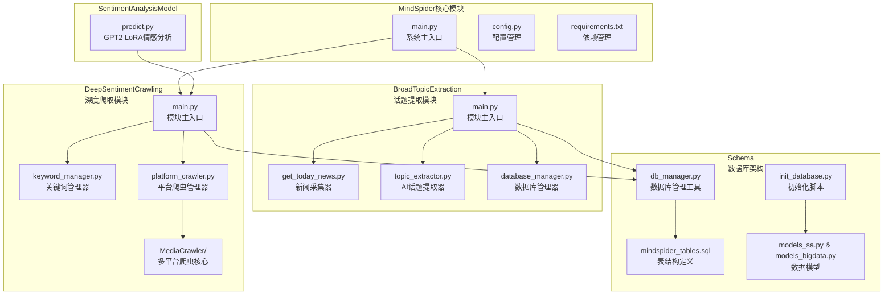

**图表来源**
- [MindSpider/main.py](file://MindSpider/main.py#L1-L520)
- [MindSpider/BroadTopicExtraction/main.py](file://MindSpider/BroadTopicExtraction/main.py#L1-L326)
- [MindSpider/DeepSentimentCrawling/main.py](file://MindSpider/DeepSentimentCrawling/main.py#L1-L282)

**章节来源**
- [MindSpider/README.md](file://MindSpider/README.md#L31-L71)
- [MindSpider/main.py](file://MindSpider/main.py#L34-L46)

## 核心组件

### 系统配置管理

MindSpider采用统一的配置管理系统，支持MySQL和PostgreSQL两种数据库类型：

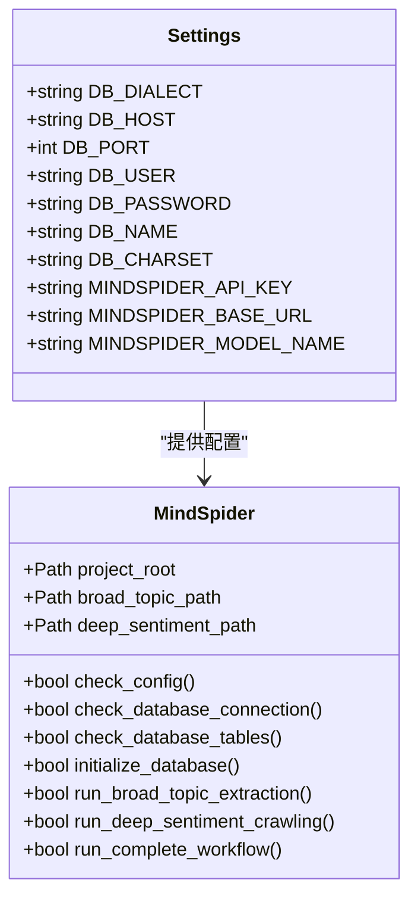

**图表来源**
- [MindSpider/config.py](file://MindSpider/config.py#L16-L35)
- [MindSpider/main.py](file://MindSpider/main.py#L34-L181)

### 数据库架构设计

系统采用扩展的MediaCrawler表结构，添加了BroadTopicExtraction模块所需的表：

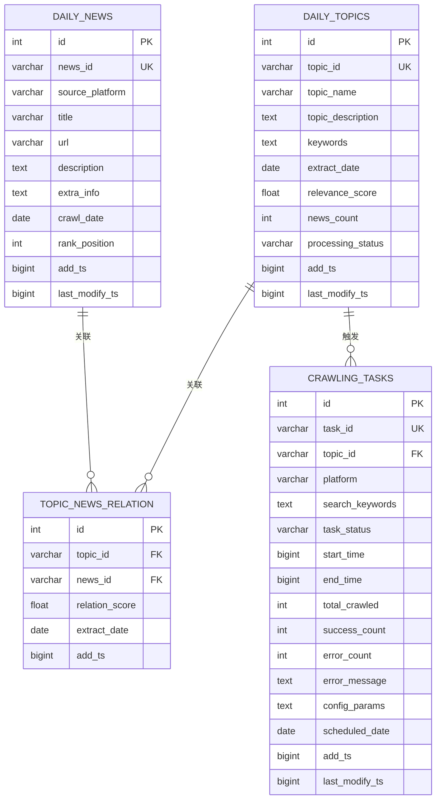

**图表来源**
- [MindSpider/schema/mindspider_tables.sql](file://MindSpider/schema/mindspider_tables.sql#L12-L106)

**章节来源**
- [MindSpider/schema/mindspider_tables.sql](file://MindSpider/schema/mindspider_tables.sql#L1-L202)
- [MindSpider/schema/db_manager.py](file://MindSpider/schema/db_manager.py#L30-L98)

## 架构概览

MindSpider采用双阶段爬取架构，实现了从热点发现到深度分析的完整流程：

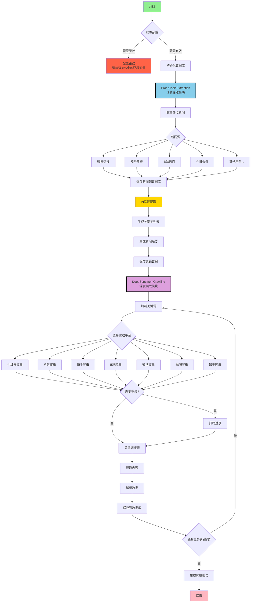

**图表来源**
- [MindSpider/README.md](file://MindSpider/README.md#L77-L145)
- [MindSpider/main.py](file://MindSpider/main.py#L351-L378)

## 详细组件分析

### BroadTopicExtraction模块

BroadTopicExtraction模块负责每日热点话题的自动发现和提取，包含三个核心组件：

#### 新闻采集器 (NewsCollector)

新闻采集器实现了多平台新闻源的统一采集机制：

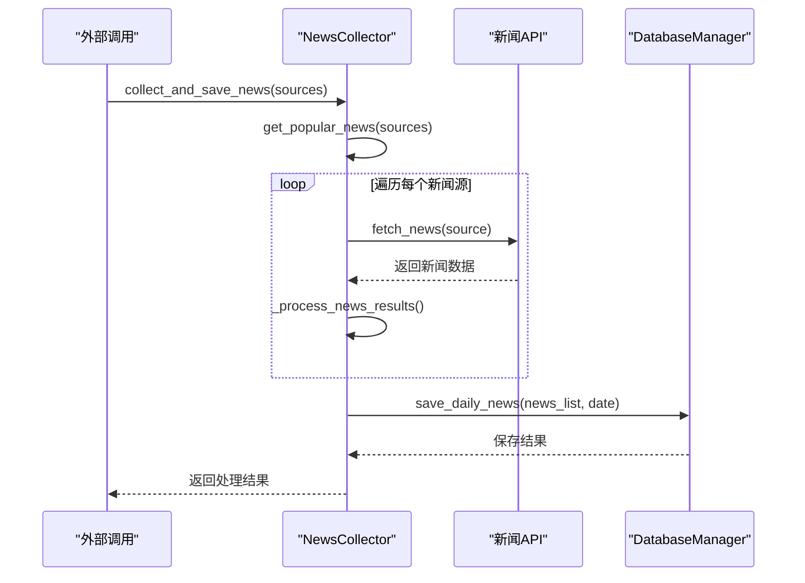

**图表来源**
- [MindSpider/BroadTopicExtraction/get_today_news.py](file://MindSpider/BroadTopicExtraction/get_today_news.py#L154-L207)
- [MindSpider/BroadTopicExtraction/database_manager.py](file://MindSpider/BroadTopicExtraction/database_manager.py#L75-L141)

#### AI话题提取器 (TopicExtractor)

AI话题提取器基于DeepSeek API实现智能关键词提取和新闻总结：

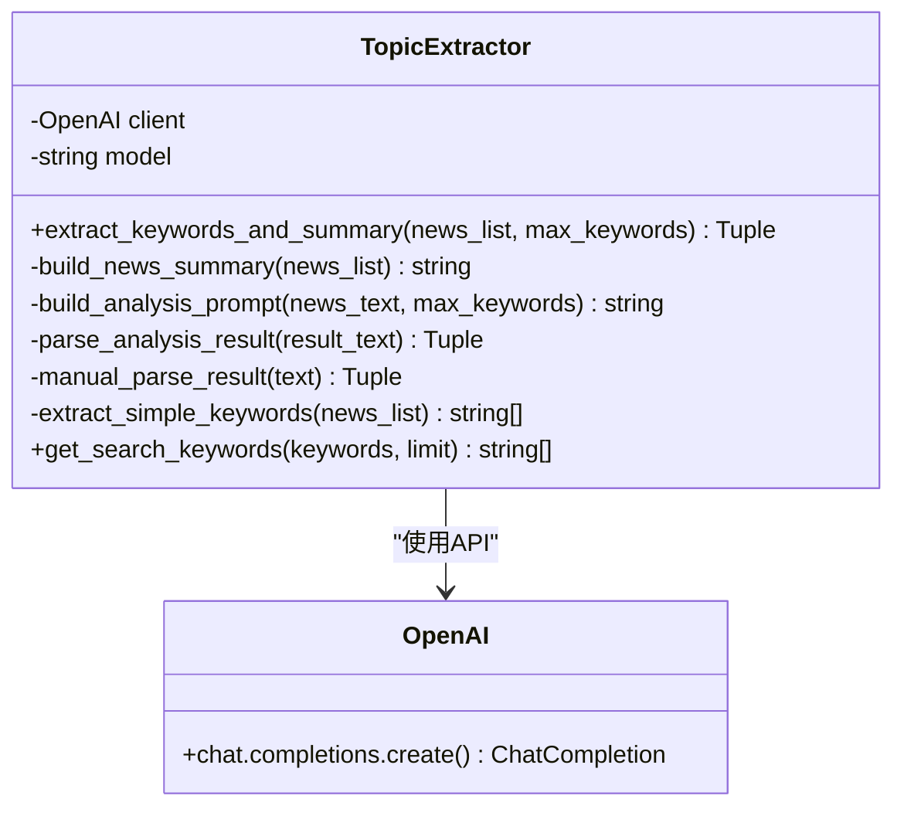

**图表来源**
- [MindSpider/BroadTopicExtraction/topic_extractor.py](file://MindSpider/BroadTopicExtraction/topic_extractor.py#L25-L81)

#### 数据库管理器 (DatabaseManager)

数据库管理器提供了完整的数据持久化解决方案：

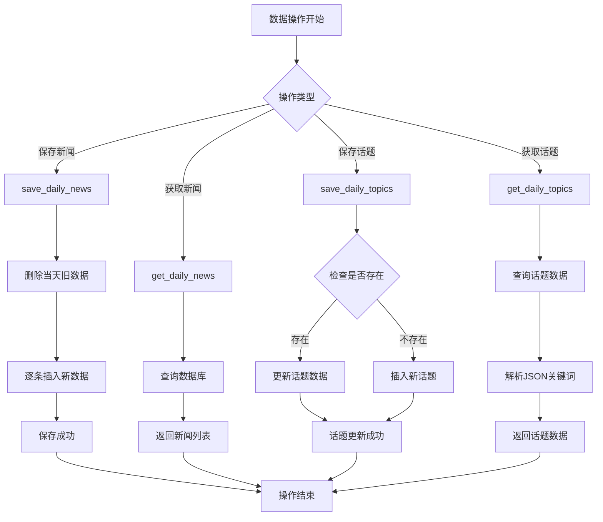

**图表来源**
- [MindSpider/BroadTopicExtraction/database_manager.py](file://MindSpider/BroadTopicExtraction/database_manager.py#L75-L214)

**章节来源**
- [MindSpider/BroadTopicExtraction/main.py](file://MindSpider/BroadTopicExtraction/main.py#L29-L233)
- [MindSpider/BroadTopicExtraction/get_today_news.py](file://MindSpider/BroadTopicExtraction/get_today_news.py#L45-L283)
- [MindSpider/BroadTopicExtraction/topic_extractor.py](file://MindSpider/BroadTopicExtraction/topic_extractor.py#L25-L271)
- [MindSpider/BroadTopicExtraction/database_manager.py](file://MindSpider/BroadTopicExtraction/database_manager.py#L29-L323)

### DeepSentimentCrawling模块

DeepSentimentCrawling模块基于提取的话题关键词，在各大社交平台进行深度内容爬取：

#### 关键词管理器 (KeywordManager)

关键词管理器实现了智能的关键词获取和分配机制：

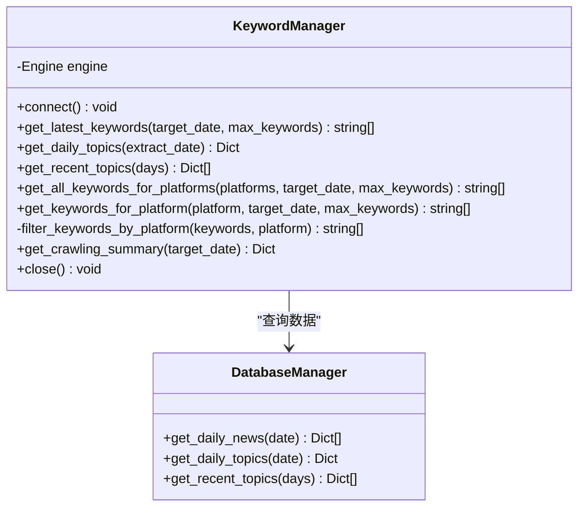

**图表来源**
- [MindSpider/DeepSentimentCrawling/keyword_manager.py](file://MindSpider/DeepSentimentCrawling/keyword_manager.py#L29-L310)

#### 平台爬虫管理器 (PlatformCrawler)

平台爬虫管理器负责协调各平台的爬取任务：

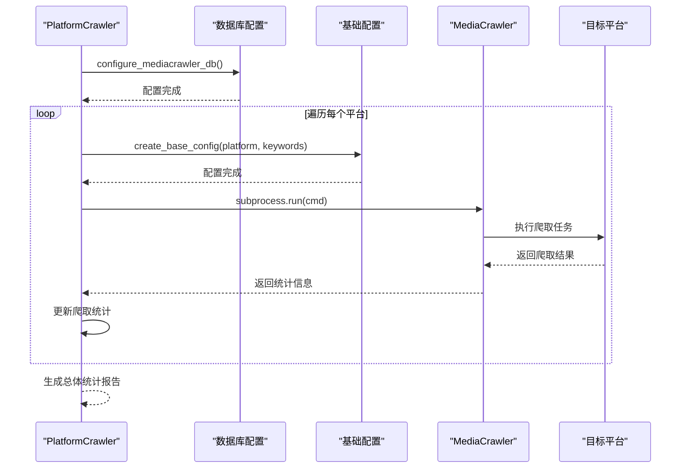

**图表来源**
- [MindSpider/DeepSentimentCrawling/platform_crawler.py](file://MindSpider/DeepSentimentCrawling/platform_crawler.py#L218-L459)

**章节来源**
- [MindSpider/DeepSentimentCrawling/main.py](file://MindSpider/DeepSentimentCrawling/main.py#L21-L189)
- [MindSpider/DeepSentimentCrawling/keyword_manager.py](file://MindSpider/DeepSentimentCrawling/keyword_manager.py#L29-L336)
- [MindSpider/DeepSentimentCrawling/platform_crawler.py](file://MindSpider/DeepSentimentCrawling/platform_crawler.py#L27-L491)

### 数据库管理工具

数据库管理工具提供了完整的数据库运维功能：

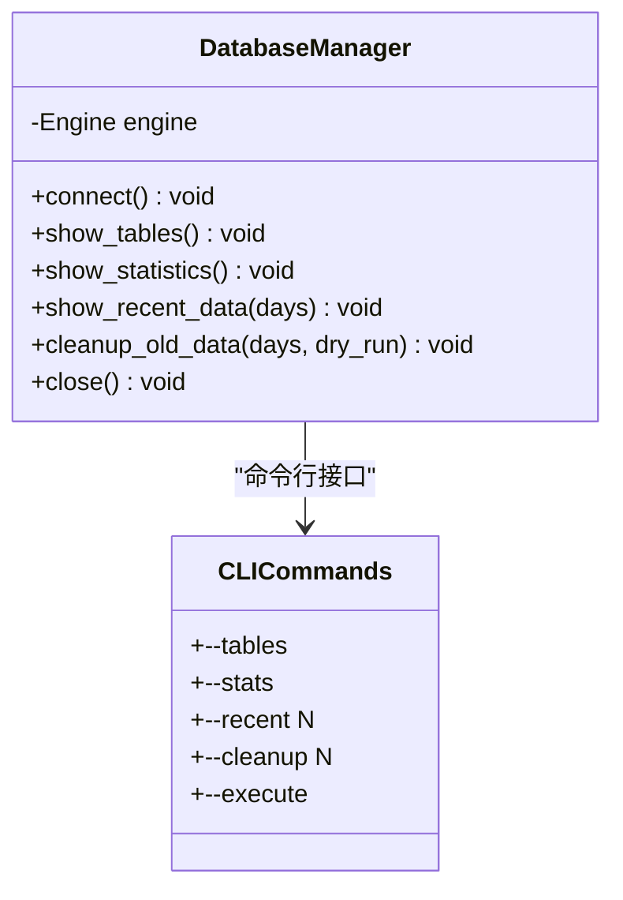

**图表来源**
- [MindSpider/schema/db_manager.py](file://MindSpider/schema/db_manager.py#L30-L295)

**章节来源**
- [MindSpider/schema/db_manager.py](file://MindSpider/schema/db_manager.py#L30-L299)

## 依赖关系分析

### 外部依赖管理

MindSpider采用分层依赖管理策略，确保各模块的独立性和可维护性：

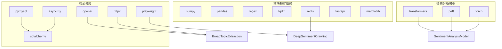

**图表来源**
- [MindSpider/requirements.txt](file://MindSpider/requirements.txt#L1-L63)

### 模块间耦合关系

系统采用松耦合设计，通过明确的接口和配置实现模块间的解耦：

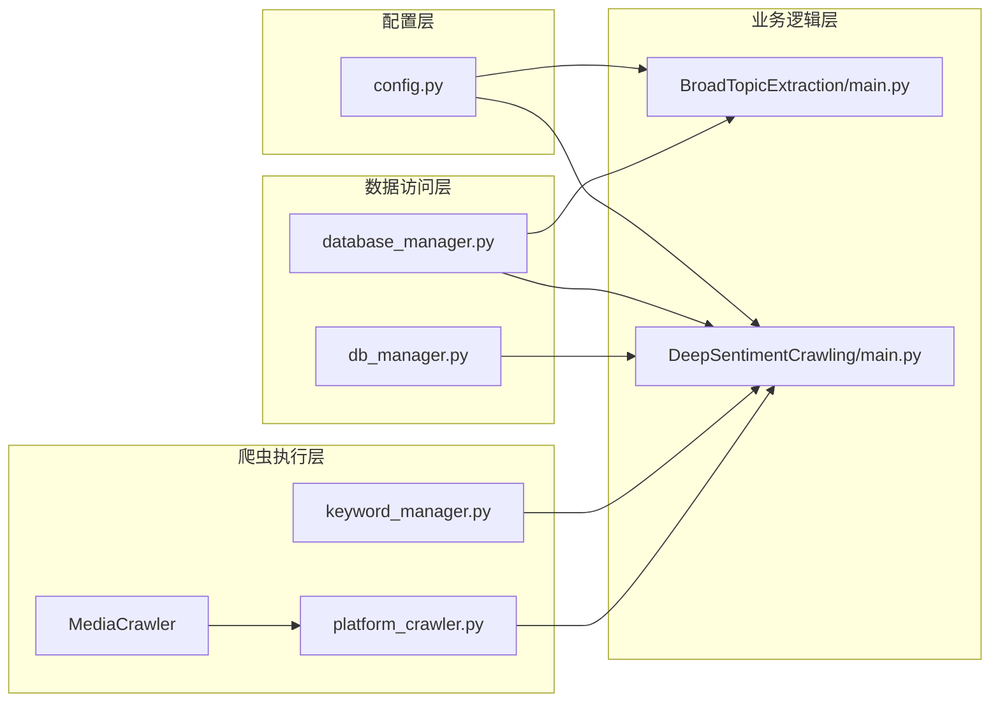

**图表来源**
- [MindSpider/config.py](file://MindSpider/config.py#L16-L35)
- [MindSpider/BroadTopicExtraction/main.py](file://MindSpider/BroadTopicExtraction/main.py#L29-L38)
- [MindSpider/DeepSentimentCrawling/main.py](file://MindSpider/DeepSentimentCrawling/main.py#L21-L28)

**章节来源**
- [MindSpider/requirements.txt](file://MindSpider/requirements.txt#L1-L63)
- [MindSpider/main.py](file://MindSpider/main.py#L183-L256)

## 性能考虑

### 数据库性能优化

系统在数据库层面采用了多项优化策略：

1. **索引优化**：为高频查询字段建立复合索引
2. **连接池管理**：使用异步连接池提高并发性能
3. **数据分区**：支持大数据量的分区表设计
4. **缓存策略**：集成Redis缓存热点数据

### 爬取性能优化

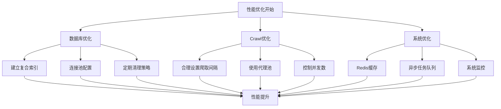

### 并发处理策略

系统采用异步并发处理模式，支持高并发爬取：

- **异步数据库操作**：使用SQLAlchemy异步引擎
- **异步HTTP请求**：基于httpx实现异步网络请求
- **异步文件操作**：使用aiofiles处理文件I/O
- **进程隔离**：每个平台爬取任务在独立进程中执行

## 故障排除指南

### 常见问题及解决方案

#### 配置问题

| 问题类型 | 症状 | 解决方案 |
|---------|------|----------|
| 数据库连接失败 | 连接超时或认证失败 | 检查DB_HOST、DB_PORT、DB_USER、DB_PASSWORD配置 |
| API密钥错误 | AI话题提取失败 | 确认MINDSPIDER_API_KEY配置正确 |
| 爬虫登录失败 | 平台登录超时 | 关闭无头模式，手动扫码登录 |

#### 爬取问题

| 问题类型 | 症状 | 解决方案 |
|---------|------|----------|
| 数据为空 | 爬取结果为0 | 确认平台已登录，检查关键词有效性 |
| 请求频繁 | 被平台限制 | 调整爬取间隔，使用代理IP |
| 内存不足 | 程序崩溃 | 降低并发数，优化数据处理逻辑 |

#### 数据库问题

| 问题类型 | 症状 | 解决方案 |
|---------|------|----------|
| 表不存在 | 查询失败 | 运行数据库初始化脚本 |
| 字符集错误 | 中文乱码 | 检查DB_CHARSET配置为utf8mb4 |
| 连接池耗尽 | 请求超时 | 调整连接池大小，优化资源释放 |

**章节来源**
- [MindSpider/README.md](file://MindSpider/README.md#L435-L472)

### 调试工具

系统提供了完善的调试和监控工具：

1. **状态检查**：`python main.py --status` 查看系统状态
2. **数据库管理**：内置数据库管理工具，支持表结构查看和数据清理
3. **日志系统**：基于loguru的日志记录，支持详细调试信息
4. **性能监控**：实时监控系统资源使用情况

## 结论

MindSpider AI爬虫系统通过模块化设计和AI技术的深度融合，实现了从热点发现到深度分析的完整舆情监控解决方案。系统具有以下优势：

1. **架构清晰**：模块职责明确，便于维护和扩展
2. **技术先进**：集成AI话题提取和多平台爬取技术
3. **性能优秀**：采用异步并发和数据库优化策略
4. **易于使用**：提供完整的配置管理和部署指导

未来发展方向包括：
- 增强情感分析模型的准确性
- 扩展更多社交媒体平台支持
- 优化爬取策略以适应平台反爬虫机制
- 提升系统的可扩展性和分布式部署能力

## 附录

### 部署配置指南

#### 环境要求
- Python 3.9+
- MySQL 5.7+ 或 PostgreSQL
- Playwright浏览器驱动
- 至少8GB内存（推荐16GB+）

#### 安装步骤
1. 克隆项目并初始化子模块
2. 创建Python虚拟环境
3. 安装依赖包
4. 配置数据库和API密钥
5. 初始化数据库表结构
6. 首次运行需要各平台登录

#### 配置文件示例

```python
# .env文件配置示例
DB_HOST = "localhost"
DB_PORT = 3306
DB_USER = "mindspider"
DB_PASSWORD = "your_password"
DB_NAME = "mindspider"
DB_CHARSET = "utf8mb4"

MINDSPIDER_API_KEY = "sk-your-deepseek-key"
MINDSPIDER_BASE_URL = "https://api.deepseek.com"
MINDSPIDER_MODEL_NAME = "deepseek-chat"
```

### 使用示例

#### 基本使用
```bash
# 运行完整流程
python main.py --complete --test

# 仅运行话题提取
python main.py --broad-topic

# 仅运行深度爬取
python main.py --deep-sentiment --platforms xhs dy --test
```

#### 高级配置
```bash
# 指定日期和参数
python main.py --complete \
    --date 2024-01-15 \
    --keywords-count 150 \
    --max-keywords 30 \
    --max-notes 25 \
    --test
```

### 扩展开发指导

#### 添加新平台支持
1. 在`DeepSentimentCrawling/MediaCrawler/media_platform/`创建新平台目录
2. 实现平台的核心功能模块
3. 更新平台支持列表
4. 测试新平台的爬取功能

#### 自定义话题提取算法
1. 修改`topic_extractor.py`中的提示词模板
2. 调整关键词提取逻辑
3. 测试AI模型的准确性和稳定性
4. 优化处理流程和错误恢复机制

#### 数据库扩展
1. 更新`mindspider_tables.sql`添加新表结构
2. 在`models_sa.py`中定义数据模型
3. 实现相应的数据访问方法
4. 运行数据库初始化脚本