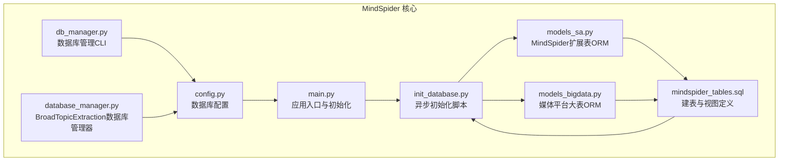
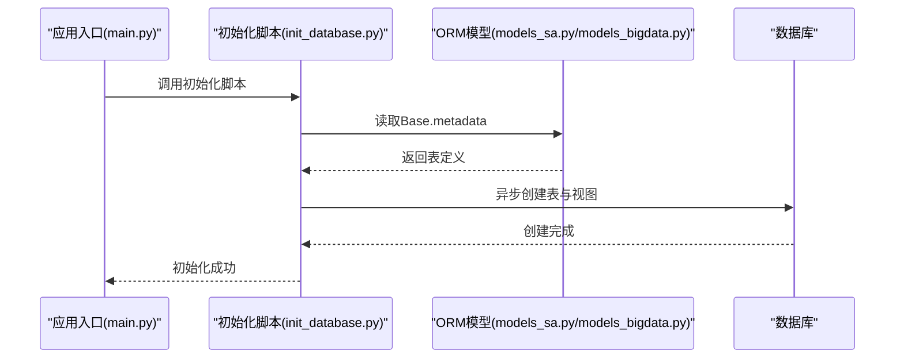
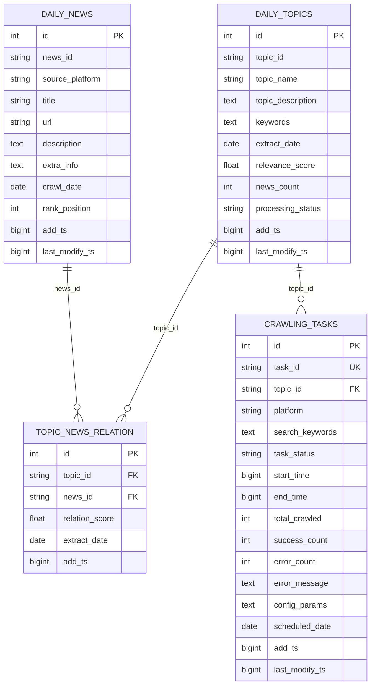
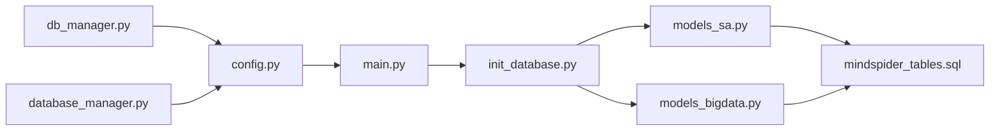

# 数据库设计与管理

<cite>
**本文档引用的文件**
- [mindspider_tables.sql](file://MindSpider/schema/mindspider_tables.sql)
- [models_sa.py](file://MindSpider/schema/models_sa.py)
- [models_bigdata.py](file://MindSpider/schema/models_bigdata.py)
- [init_database.py](file://MindSpider/schema/init_database.py)
- [db_manager.py](file://MindSpider/schema/db_manager.py)
- [config.py](file://MindSpider/config.py)
- [main.py](file://MindSpider/main.py)
- [database_manager.py](file://MindSpider/BroadTopicExtraction/database_manager.py)
</cite>

## 目录
1. [简介](#简介)
2. [项目结构](#项目结构)
3. [核心组件](#核心组件)
4. [架构总览](#架构总览)
5. [详细组件分析](#详细组件分析)
6. [依赖关系分析](#依赖关系分析)
7. [性能考虑](#性能考虑)
8. [故障排查指南](#故障排查指南)
9. [结论](#结论)
10. [附录](#附录)

## 简介
本文件面向MindSpider项目数据库设计与管理，系统性阐述数据库架构、表结构、数据模型、索引优化策略、初始化流程、连接管理、事务处理、数据迁移与备份恢复建议，以及配置、性能优化、扩展开发与维护最佳实践。重点覆盖daily_news新闻表与daily_topics话题表的设计与关系映射，并结合项目中的ORM模型与初始化脚本进行落地说明。

## 项目结构
MindSpider的数据库相关能力主要集中在schema目录与BroadTopicExtraction模块中：
- schema目录：提供ORM模型、数据库初始化脚本、SQL建表与视图定义、数据库管理工具
- BroadTopicExtraction模块：提供面向“每日新闻/话题”的数据库存取封装
- config.py：统一数据库连接配置（支持MySQL与PostgreSQL）

图表来源
- [config.py](file://MindSpider/config.py#L16-L35)
- [main.py](file://MindSpider/main.py#L139-L181)
- [init_database.py](file://MindSpider/schema/init_database.py#L100-L114)
- [models_sa.py](file://MindSpider/schema/models_sa.py#L27-L127)
- [models_bigdata.py](file://MindSpider/schema/models_bigdata.py#L1-L468)
- [mindspider_tables.sql](file://MindSpider/schema/mindspider_tables.sql#L1-L202)
- [db_manager.py](file://MindSpider/schema/db_manager.py#L30-L98)
- [database_manager.py](file://MindSpider/BroadTopicExtraction/database_manager.py#L29-L72)

章节来源
- [config.py](file://MindSpider/config.py#L16-L35)
- [main.py](file://MindSpider/main.py#L139-L181)
- [init_database.py](file://MindSpider/schema/init_database.py#L100-L114)
- [models_sa.py](file://MindSpider/schema/models_sa.py#L27-L127)
- [models_bigdata.py](file://MindSpider/schema/models_bigdata.py#L1-L468)
- [mindspider_tables.sql](file://MindSpider/schema/mindspider_tables.sql#L1-L202)
- [db_manager.py](file://MindSpider/schema/db_manager.py#L30-L98)
- [database_manager.py](file://MindSpider/BroadTopicExtraction/database_manager.py#L29-L72)

## 核心组件
- 数据库配置中心：统一DB_DIALECT、DB_HOST、DB_PORT、DB_USER、DB_PASSWORD、DB_NAME、DB_CHARSET等参数，支持MySQL与PostgreSQL
- ORM模型层：MindSpider扩展表（daily_news、daily_topics、topic_news_relation、crawling_tasks）与媒体平台大表（xhs_note、weibo_note、bilibili_video等）的ORM映射
- 初始化脚本：基于SQLAlchemy异步引擎创建表与视图，支持MySQL/PostgreSQL
- 数据库管理CLI：查看表、统计、近期数据、清理旧数据
- BroadTopicExtraction数据库管理器：面向每日新闻与话题的存取封装，含事务与覆盖写入策略
- 应用入口：自动检测连接、表存在性，必要时调用初始化脚本

章节来源
- [config.py](file://MindSpider/config.py#L16-L35)
- [models_sa.py](file://MindSpider/schema/models_sa.py#L31-L124)
- [models_bigdata.py](file://MindSpider/schema/models_bigdata.py#L18-L425)
- [init_database.py](file://MindSpider/schema/init_database.py#L100-L114)
- [db_manager.py](file://MindSpider/schema/db_manager.py#L30-L98)
- [database_manager.py](file://MindSpider/BroadTopicExtraction/database_manager.py#L75-L141)
- [main.py](file://MindSpider/main.py#L139-L181)

## 架构总览
MindSpider采用“配置驱动 + ORM + 异步初始化 + CLI管理 + 模块化存取”的数据库架构：
- 配置层：config.py集中管理数据库连接参数
- ORM层：models_sa.py定义MindSpider扩展表；models_bigdata.py定义媒体平台大表
- 初始化层：init_database.py通过异步引擎创建表与视图
- 管理层：db_manager.py提供命令行工具；database_manager.py提供模块化存取
- 应用层：main.py在启动时自动校验连接与表，必要时初始化

图表来源
- [main.py](file://MindSpider/main.py#L139-L166)
- [init_database.py](file://MindSpider/schema/init_database.py#L100-L114)
- [models_sa.py](file://MindSpider/schema/models_sa.py#L27-L127)
- [models_bigdata.py](file://MindSpider/schema/models_bigdata.py#L1-L468)

## 详细组件分析

### 表结构与关系设计
- daily_news（每日新闻表）
  - 主键：自增id
  - 唯一约束：news_id + source_platform + crawl_date
  - 索引：crawl_date、source_platform、rank_position
  - 字段：news_id、source_platform、title、url、description、extra_info、crawl_date、rank_position、add_ts、last_modify_ts
- daily_topics（每日话题表）
  - 主键：自增id
  - 唯一约束：topic_id + extract_date
  - 索引：extract_date、processing_status、relevance_score、extract_date+processing_status
  - 字段：topic_id、topic_name、topic_description、keywords、extract_date、relevance_score、news_count、processing_status、add_ts、last_modify_ts
- topic_news_relation（话题-新闻关联表）
  - 主键：自增id
  - 唯一约束：topic_id + news_id + extract_date
  - 索引：topic_id、news_id、extract_date
  - 外键：topic_id -> daily_topics.topic_id（CASCADE），news_id -> daily_news.news_id（CASCADE）
  - 字段：topic_id、news_id、relation_score、extract_date、add_ts
- crawling_tasks（爬取任务表）
  - 主键：自增id
  - 唯一约束：task_id
  - 索引：topic_id、platform、task_status、scheduled_date、topic_id+platform+task_status
  - 外键：topic_id -> daily_topics.topic_id（CASCADE）
  - 字段：task_id、topic_id、platform、search_keywords、task_status、start_time、end_time、total_crawled、success_count、error_count、error_message、config_params、scheduled_date、add_ts、last_modify_ts

图表来源
- [mindspider_tables.sql](file://MindSpider/schema/mindspider_tables.sql#L12-L106)
- [models_sa.py](file://MindSpider/schema/models_sa.py#L31-L124)

章节来源
- [mindspider_tables.sql](file://MindSpider/schema/mindspider_tables.sql#L12-L106)
- [models_sa.py](file://MindSpider/schema/models_sa.py#L31-L124)

### 数据模型与ORM映射
- MindSpider扩展表ORM（models_sa.py）
  - DailyNews、DailyTopic、TopicNewsRelation、CrawlingTask四个核心表的ORM定义，包含唯一约束、索引、外键约束声明
- 媒体平台大表ORM（models_bigdata.py）
  - 包含B站、抖音、快手、微博、贴吧、知乎、小红书等平台的内容与评论表，统一继承自models_sa.Base，确保所有表在同一个metadata中，外键引用正常工作
  - 所有平台表新增topic_id与crawling_task_id字段，用于与MindSpider扩展表建立关联

章节来源
- [models_sa.py](file://MindSpider/schema/models_sa.py#L27-L127)
- [models_bigdata.py](file://MindSpider/schema/models_bigdata.py#L18-L425)

### 初始化流程与视图
- 初始化脚本（init_database.py）
  - 支持从DATABASE_URL或settings构建数据库URL，自动选择MySQL或PostgreSQL方言
  - 使用异步引擎创建表（Base.metadata.create_all），自动处理表间依赖
  - 可选创建视图：v_topic_crawling_stats、v_daily_summary，用于话题爬取统计与每日汇总
  - 连接池配置：pool_pre_ping、pool_recycle
- SQL建表与视图（mindspider_tables.sql）
  - 明确定义四张核心表的结构、索引与外键
  - 为关联查询创建复合索引（如topic_id+platform+task_status）
  - 为媒体平台表添加topic_id与crawling_task_id字段，实现MindSpider与MediaCrawler的解耦扩展

章节来源
- [init_database.py](file://MindSpider/schema/init_database.py#L41-L114)
- [mindspider_tables.sql](file://MindSpider/schema/mindspider_tables.sql#L154-L191)

### 数据库连接管理与事务处理
- 配置与连接
  - config.py统一管理DB_DIALECT、DB_HOST、DB_PORT、DB_USER、DB_PASSWORD、DB_NAME、DB_CHARSET
  - main.py在启动时构建异步URL并测试连接，确保连接可用
  - BroadTopicExtraction.database_manager.py与schema.db_manager.py分别提供同步连接封装
- 事务处理
  - BroadTopicExtraction.database_manager.py.save_daily_news采用分步事务：先删除当天数据，再逐条插入，保证覆盖写入与单条失败不影响整体
  - schema.db_manager.py.cleanup_old_data使用with self.engine.begin()开启事务，支持dry-run预览与实际执行
- 连接池与方言
  - init_database.py使用异步引擎，支持MySQL（aiomysql）与PostgreSQL（asyncpg）
  - main.py使用异步引擎测试连接，支持pool_pre_ping

章节来源
- [config.py](file://MindSpider/config.py#L16-L35)
- [main.py](file://MindSpider/main.py#L74-L99)
- [database_manager.py](file://MindSpider/BroadTopicExtraction/database_manager.py#L94-L141)
- [db_manager.py](file://MindSpider/schema/db_manager.py#L244-L262)
- [init_database.py](file://MindSpider/schema/init_database.py#L102-L107)

### 数据迁移与备份恢复建议
- 迁移策略
  - 使用SQL建表脚本（mindspider_tables.sql）作为版本化迁移基线
  - 对媒体平台表的topic_id与crawling_task_id字段变更属于“向后兼容的扩展”，不影响原有功能
- 备份与恢复
  - 建议使用数据库自带工具进行全量/增量备份
  - 恢复时先执行建表脚本，再导入数据，确保索引与外键一致
- 清理策略
  - 使用db_manager.py的清理功能按天清理历史数据，dry-run预览后再执行
  - mindspider_tables.sql提供可选事件调度器清理建议（注释形式）

章节来源
- [mindspider_tables.sql](file://MindSpider/schema/mindspider_tables.sql#L115-L148)
- [db_manager.py](file://MindSpider/schema/db_manager.py#L228-L262)

### 数据库管理CLI与模块化存取
- CLI工具（db_manager.py）
  - 查看表、统计数据、近期数据、清理旧数据
  - 支持--execute参数执行实际清理
- 模块化存取（BroadTopicExtraction.database_manager.py）
  - save_daily_news：覆盖写入当日新闻，逐条插入，异常不影响整体
  - get_daily_news：按日期查询新闻，按rank_position升序
  - save_daily_topics：保存每日话题分析，支持更新

章节来源
- [db_manager.py](file://MindSpider/schema/db_manager.py#L54-L262)
- [database_manager.py](file://MindSpider/BroadTopicExtraction/database_manager.py#L75-L200)

## 依赖关系分析
- 组件耦合
  - models_sa.py与models_bigdata.py共同继承自同一Base，确保外键引用与元数据一致性
  - init_database.py依赖models_sa与models_bigdata以注册所有表
  - main.py在启动时调用初始化脚本，确保表存在
- 外部依赖
  - MySQL：pymysql驱动
  - PostgreSQL：psycopg驱动
  - 异步驱动：aiomysql/asyncmy（MySQL）、asyncpg（PostgreSQL）

图表来源
- [config.py](file://MindSpider/config.py#L16-L35)
- [main.py](file://MindSpider/main.py#L139-L166)
- [init_database.py](file://MindSpider/schema/init_database.py#L22-L26)
- [models_sa.py](file://MindSpider/schema/models_sa.py#L16-L17)
- [models_bigdata.py](file://MindSpider/schema/models_bigdata.py#L16-L16)
- [mindspider_tables.sql](file://MindSpider/schema/mindspider_tables.sql#L1-L202)
- [db_manager.py](file://MindSpider/schema/db_manager.py#L23-L28)
- [database_manager.py](file://MindSpider/BroadTopicExtraction/database_manager.py#L21-L26)

## 性能考虑
- 索引优化
  - 为高频查询字段建立单列索引：crawl_date、source_platform、rank_position、extract_date、processing_status、relevance_score、topic_id、platform、task_status、scheduled_date
  - 为关联查询建立复合索引：topic_id+platform+task_status、extract_date+processing_status、crawl_date+source_platform
- 查询优化
  - 使用视图v_daily_summary与v_topic_crawling_stats减少复杂聚合查询成本
  - 在BroadTopicExtraction中按日期分组查询，避免全表扫描
- 连接与池化
  - init_database.py启用pool_pre_ping与合理pool_recycle，提升连接稳定性
  - 异步引擎降低I/O阻塞，适合高并发场景

章节来源
- [mindspider_tables.sql](file://MindSpider/schema/mindspider_tables.sql#L187-L191)
- [init_database.py](file://MindSpider/schema/init_database.py#L102-L107)
- [database_manager.py](file://MindSpider/BroadTopicExtraction/database_manager.py#L156-L162)

## 故障排查指南
- 连接失败
  - 检查config.py中的DB_DIALECT、DB_HOST、DB_PORT、DB_USER、DB_PASSWORD、DB_NAME、DB_CHARSET是否正确
  - 确认已安装对应驱动：pymysql（MySQL）、psycopg（PostgreSQL）
  - 使用main.py内置连接测试逻辑定位问题
- 表缺失
  - 执行init_database.py初始化脚本创建表
  - 使用db_manager.py --tables查看表清单
- 数据异常
  - 使用db_manager.py --recent查看近期数据分布
  - 使用db_manager.py --stats查看新闻/话题/任务统计
  - 使用db_manager.py --cleanup N [--execute]清理历史数据
- ORM一致性
  - 确保models_sa与models_bigdata均继承自同一Base，避免外键引用失效

章节来源
- [config.py](file://MindSpider/config.py#L16-L35)
- [main.py](file://MindSpider/main.py#L74-L99)
- [db_manager.py](file://MindSpider/schema/db_manager.py#L54-L262)
- [init_database.py](file://MindSpider/schema/init_database.py#L100-L114)

## 结论
MindSpider的数据库设计以清晰的表结构与ORM映射为基础，配合异步初始化、CLI管理与模块化存取，实现了对“每日新闻/话题”与“媒体平台内容”的一体化管理。通过合理的索引与视图设计、完善的事务处理与清理策略，满足了高并发与可维护性的需求。建议在生产环境中结合备份策略与监控告警，持续优化查询与连接池配置。

## 附录
- 配置项说明
  - DB_DIALECT：数据库类型（mysql/postgresql）
  - DB_HOST/DB_PORT/DB_USER/DB_PASSWORD/DB_NAME/DB_CHARSET：连接参数
- 常用命令
  - 初始化：python schema/init_database.py
  - 查看表：python schema/db_manager.py --tables
  - 统计：python schema/db_manager.py --stats
  - 近期数据：python schema/db_manager.py --recent 7
  - 清理旧数据：python schema/db_manager.py --cleanup 90 [--execute]