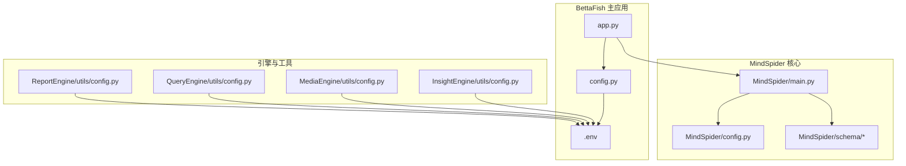
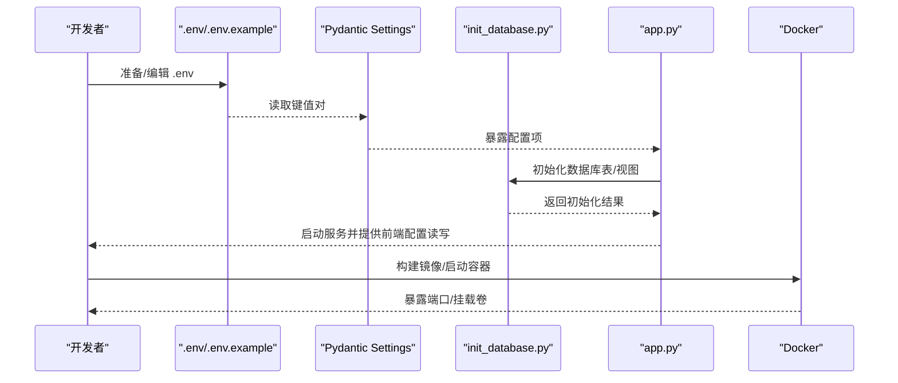
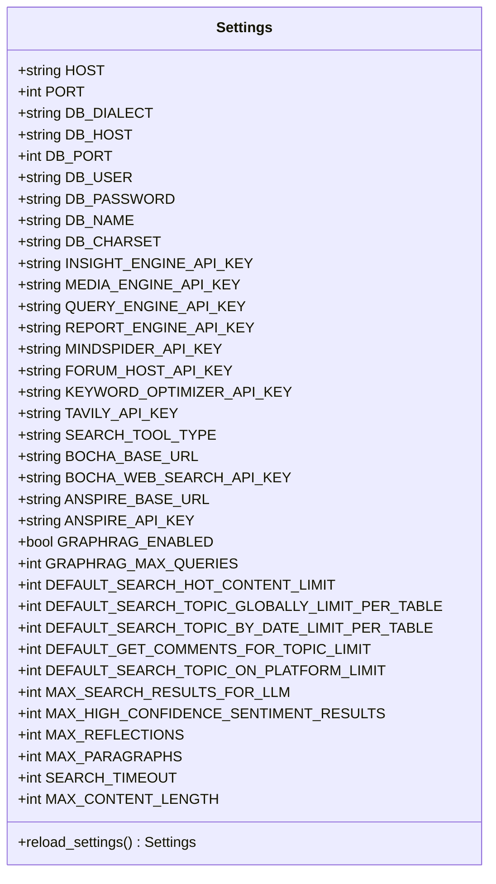
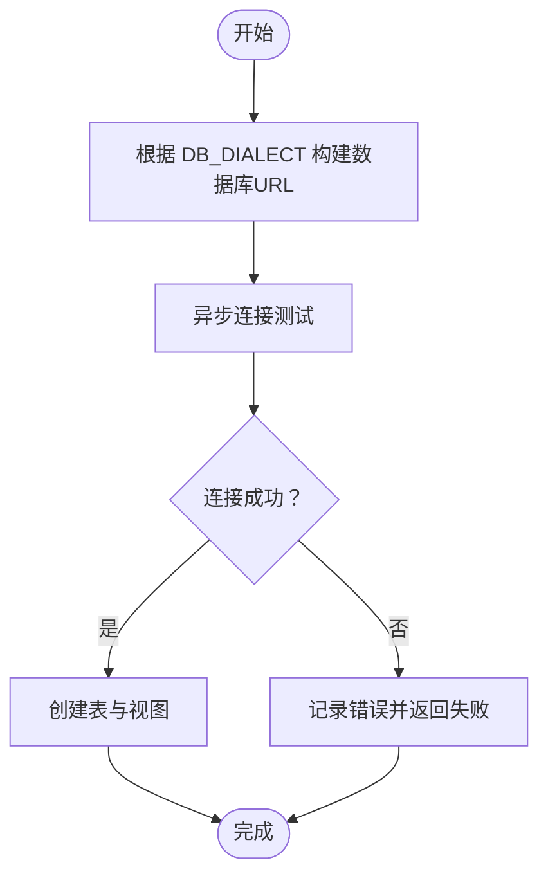
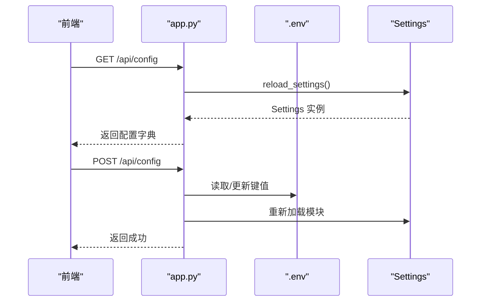

# 配置管理与部署

<cite>
**本文引用的文件**
- [MindSpider/config.py](file://MindSpider/config.py)
- [MindSpider/config.py.example](file://MindSpider/config.py.example)
- [config.py](file://config.py)
- [.env.example](file://.env.example)
- [requirements.txt](file://requirements.txt)
- [MindSpider/requirements.txt](file://MindSpider/requirements.txt)
- [Dockerfile](file://Dockerfile)
- [docker-compose.yml](file://docker-compose.yml)
- [app.py](file://app.py)
- [MindSpider/main.py](file://MindSpider/main.py)
- [MindSpider/schema/init_database.py](file://MindSpider/schema/init_database.py)
- [MindSpider/schema/mindspider_tables.sql](file://MindSpider/schema/mindspider_tables.sql)
- [MindSpider/README.md](file://MindSpider/README.md)
- [InsightEngine/utils/config.py](file://InsightEngine/utils/config.py)
- [MediaEngine/utils/config.py](file://MediaEngine/utils/config.py)
- [QueryEngine/utils/config.py](file://QueryEngine/utils/config.py)
- [ReportEngine/utils/config.py](file://ReportEngine/utils/config.py)
</cite>

## 目录
1. [简介](#简介)
2. [项目结构](#项目结构)
3. [核心组件](#核心组件)
4. [架构总览](#架构总览)
5. [详细组件分析](#详细组件分析)
6. [依赖分析](#依赖分析)
7. [性能考虑](#性能考虑)
8. [故障排查指南](#故障排查指南)
9. [结论](#结论)
10. [附录](#附录)

## 简介
本指南聚焦于 MindSpider 的配置管理与部署实践，覆盖以下主题：
- 配置文件结构与参数设置：数据库连接、API 密钥、爬虫参数、网络工具与 LLM 配置
- 环境变量与 .env 加载机制、配置模板与优先级
- 部署前准备、依赖包管理、容器化与编排
- 完整部署流程、性能调优建议与常见问题排查

## 项目结构
MindSpider 作为 BettaFish 的核心子模块之一，采用模块化设计，包含“话题提取”和“深度爬取”两大模块，并通过统一的配置体系与数据库初始化脚本支撑运行。

**图表来源**
- [MindSpider/main.py](file://MindSpider/main.py#L1-L520)
- [MindSpider/config.py](file://MindSpider/config.py#L1-L36)
- [config.py](file://config.py#L1-L136)
- [.env.example](file://.env.example#L1-L88)
- [InsightEngine/utils/config.py](file://InsightEngine/utils/config.py#L1-L45)
- [MediaEngine/utils/config.py](file://MediaEngine/utils/config.py#L1-L89)
- [QueryEngine/utils/config.py](file://QueryEngine/utils/config.py#L1-L80)
- [ReportEngine/utils/config.py](file://ReportEngine/utils/config.py#L1-L114)

**章节来源**
- [MindSpider/README.md](file://MindSpider/README.md#L31-L71)
- [MindSpider/main.py](file://MindSpider/main.py#L1-L120)

## 核心组件
- 配置加载与优先级
  - MindSpider/config.py：MindSpider 子模块的配置模型，支持从 .env 与环境变量加载，统一数据库参数命名（DB_DIALECT/DB_HOST/DB_PORT/DB_USER/DB_PASSWORD/DB_NAME/DB_CHARSET）
  - config.py（项目根）：BettaFish 主配置，包含 Flask 服务器、数据库、LLM API（Insight/Media/Query/Report/MindSpider/Forum/Keyword Optimizer）、网络工具（Tavily/Anspire/Bocha）、GraphRAG、搜索参数等
  - .env.example：提供完整示例，覆盖数据库、LLM、搜索工具、GraphRAG 等关键配置项
- 数据库初始化
  - MindSpider/schema/init_database.py：基于 SQLAlchemy 异步引擎创建表与视图，支持 MySQL/PostgreSQL
  - MindSpider/schema/mindspider_tables.sql：定义核心数据表与索引，以及与 MediaCrawler 的扩展字段
- 应用入口与部署
  - app.py：Flask 主应用，统一管理三个 Streamlit 子应用，提供配置读取/写回、健康检查、日志与进程管理
  - Dockerfile/docker-compose.yml：容器化与编排，暴露端口、挂载卷、预拷贝 .env 示例、安装 Playwright 二进制

**章节来源**
- [MindSpider/config.py](file://MindSpider/config.py#L11-L35)
- [config.py](file://config.py#L17-L119)
- [.env.example](file://.env.example#L1-L88)
- [MindSpider/schema/init_database.py](file://MindSpider/schema/init_database.py#L41-L58)
- [MindSpider/schema/mindspider_tables.sql](file://MindSpider/schema/mindspider_tables.sql#L1-L202)
- [app.py](file://app.py#L89-L232)
- [Dockerfile](file://Dockerfile#L1-L78)
- [docker-compose.yml](file://docker-compose.yml#L1-L40)

## 架构总览
MindSpider 的配置与部署围绕“统一配置模型 + 环境变量优先 + 数据库初始化 + 容器化运行”的主线展开，确保在不同环境（本地/CI/生产）下的一致性与可维护性。

**图表来源**
- [config.py](file://config.py#L17-L119)
- [MindSpider/config.py](file://MindSpider/config.py#L11-L35)
- [MindSpider/schema/init_database.py](file://MindSpider/schema/init_database.py#L100-L114)
- [app.py](file://app.py#L142-L232)
- [Dockerfile](file://Dockerfile#L65-L77)

## 详细组件分析

### 配置模型与环境变量加载
- MindSpider 子模块
  - 通过 pydantic-settings 的 BaseSettings 定义配置项，支持从 .env 与环境变量加载，大小写不敏感，允许额外字段
  - 数据库参数统一命名，便于在不同数据库间切换
- BettaFish 主配置
  - 包含 Flask 服务器、数据库、LLM API（Insight/Media/Query/Report/MindSpider/Forum/Keyword Optimizer）、网络工具（Tavily/Anspire/Bocha）、GraphRAG、搜索参数等
  - 提供 reload_settings() 以便运行时动态刷新配置

**图表来源**
- [config.py](file://config.py#L23-L119)

**章节来源**
- [MindSpider/config.py](file://MindSpider/config.py#L11-L35)
- [config.py](file://config.py#L17-L119)
- [MindSpider/config.py.example](file://MindSpider/config.py.example#L11-L35)

### 数据库连接与初始化
- 连接参数
  - DB_DIALECT 支持 mysql 与 postgresql，DB_HOST/DB_PORT/DB_USER/DB_PASSWORD/DB_NAME/DB_CHARSET 统一命名
  - MindSpider/main.py 中根据 DB_DIALECT 构造 asyncmy/asyncpg URL 并进行连接测试
- 初始化流程
  - MindSpider/schema/init_database.py 根据配置构建数据库 URL，创建 Base.metadata 对应的表与视图
  - mindspider_tables.sql 定义核心表结构、扩展字段与索引，支持 MySQL/PostgreSQL

**图表来源**
- [MindSpider/main.py](file://MindSpider/main.py#L70-L100)
- [MindSpider/schema/init_database.py](file://MindSpider/schema/init_database.py#L41-L58)
- [MindSpider/schema/mindspider_tables.sql](file://MindSpider/schema/mindspider_tables.sql#L1-L202)

**章节来源**
- [MindSpider/main.py](file://MindSpider/main.py#L70-L138)
- [MindSpider/schema/init_database.py](file://MindSpider/schema/init_database.py#L100-L114)
- [MindSpider/schema/mindspider_tables.sql](file://MindSpider/schema/mindspider_tables.sql#L10-L120)

### LLM 与网络工具配置
- LLM 配置
  - Insight/Media/Query/Report/MindSpider/Forum/Keyword Optimizer 分别提供 API_KEY、BASE_URL、MODEL_NAME
  - 支持多种厂商与模型，推荐配置已在注释中标明
- 网络工具
  - Tavily API 密钥用于网络搜索
  - SEARCH_TOOL_TYPE 支持 AnspireAPI/BochaAPI，分别提供 BASE_URL 与 API_KEY

**章节来源**
- [config.py](file://config.py#L44-L95)
- [.env.example](file://.env.example#L28-L78)

### 部署前准备与依赖管理
- 环境与依赖
  - MindSpider/requirements.txt：MindSpider 子模块核心依赖（数据库、HTTP、OpenAI、pydantic-settings、Playwright、可视化、工具库等）
  - 顶层 requirements.txt：主项目依赖（Flask、FastAPI、Streamlit、WeasyPrint、机器学习、日志等）
- Playwright 二进制
  - Dockerfile 中通过 uv pip 安装依赖后，执行 python -m playwright install chromium

**章节来源**
- [MindSpider/requirements.txt](file://MindSpider/requirements.txt#L1-L63)
- [requirements.txt](file://requirements.txt#L1-L91)
- [Dockerfile](file://Dockerfile#L53-L66)

### 容器化与编排
- Dockerfile
  - 基于 python:3.11-slim，安装系统依赖与 Playwright 二进制
  - 复制 .env.example 到 .env，复制应用源码，暴露端口 5000/8501/8502/8503，CMD 启动 app.py
- docker-compose.yml
  - 启动 bettafish 与 db 两个服务，映射端口，挂载日志与报告目录，db 使用 .env 中的 POSTGRES_* 环境变量

**章节来源**
- [Dockerfile](file://Dockerfile#L1-L78)
- [docker-compose.yml](file://docker-compose.yml#L1-L40)

### 配置读取与写回（前端）
- app.py 提供读取与写回 .env 的能力
  - 读取：通过 reload_settings() 获取最新配置，遍历 CONFIG_KEYS 返回键值
  - 写回：解析 .env 文件，更新或新增键值，写回 .env 并重新加载模块

**图表来源**
- [app.py](file://app.py#L142-L232)

**章节来源**
- [app.py](file://app.py#L89-L232)

## 依赖分析
- 配置加载依赖
  - pydantic-settings：提供类型安全的配置模型与 .env 加载
  - python-dotenv：.env 文件解析
- 数据库依赖
  - SQLAlchemy 2.x 异步引擎：asyncpg/aiomysql/asyncmy
  - Motor/Redis：MongoDB 与缓存
- 爬虫与网络
  - httpx/requests/aiohttp：HTTP 请求
  - playwright：浏览器自动化
  - BeautifulSoup/lxml/parsel：页面解析
- 可视化与导出
  - plotly/matplotlib/wordcloud：图表与词云
  - weasyprint：PDF 导出
- LLM 与搜索
  - openai/tavily-python：OpenAI 兼容接口与 Tavily 搜索

**章节来源**
- [requirements.txt](file://requirements.txt#L1-L91)
- [MindSpider/requirements.txt](file://MindSpider/requirements.txt#L1-L63)

## 性能考虑
- 数据库性能
  - 为高频查询字段建立索引（如按日期、状态、平台组合索引）
  - 使用连接池与 pre_ping，合理设置回收与超时
  - 考虑分区表与归档策略，定期清理历史数据
- 爬取性能
  - 合理设置并发与限速，避免触发平台风控
  - 使用代理池与随机 User-Agent，降低封禁风险
  - 缓存热点数据（Redis），减少重复请求
- 系统性能
  - 异步任务队列处理耗时操作
  - 监控资源使用，必要时横向扩展
  - 使用 CDN 与静态资源优化

## 故障排查指南
- 配置相关
  - .env 未生效：确认 .env 路径与优先级（当前工作目录优先于项目根目录）
  - 配置缺失：检查 CONFIG_KEYS 中的关键项是否在 .env 中设置
  - 动态刷新：使用 reload_settings() 重新加载配置
- 数据库相关
  - 连接失败：核对 DB_DIALECT/DB_HOST/DB_PORT/DB_USER/DB_PASSWORD/DB_NAME/DB_CHARSET
  - 表缺失：运行 init_database.py 或检查 mindspider_tables.sql 是否正确
- LLM 与搜索
  - API 密钥无效：确认 API_KEY、BASE_URL、MODEL_NAME 正确
  - 网络工具：检查 Tavily/Anspire/Bocha 的密钥与 Base URL
- 容器化
  - 端口冲突：调整映射端口或停止占用进程
  - 权限问题：确认挂载目录权限与用户映射
  - Playwright：确保容器内安装了 Chromium 二进制

**章节来源**
- [app.py](file://app.py#L142-L232)
- [MindSpider/main.py](file://MindSpider/main.py#L47-L138)
- [MindSpider/schema/init_database.py](file://MindSpider/schema/init_database.py#L100-L114)
- [config.py](file://config.py#L17-L119)

## 结论
通过统一的配置模型与 .env 优先加载机制、完善的数据库初始化流程、以及容器化与编排方案，MindSpider 能够在多环境中稳定运行。建议在部署前完成环境与依赖准备、数据库初始化与 API 配置校验，并结合性能优化与故障排查清单，确保系统高效可靠地支撑舆情分析任务。

## 附录

### 配置项速查（按模块）
- 服务器与数据库
  - HOST/PORT、DB_DIALECT/DB_HOST/DB_PORT/DB_USER/DB_PASSWORD/DB_NAME/DB_CHARSET
- LLM 配置
  - INSIGHT_ENGINE_*、MEDIA_ENGINE_*、QUERY_ENGINE_*、REPORT_ENGINE_*、MINDSPIDER_*、FORUM_HOST_*、KEYWORD_OPTIMIZER_*
- 网络工具
  - TAVILY_API_KEY、SEARCH_TOOL_TYPE、BOCHA_*、ANSPIRE_*
- GraphRAG
  - GRAPHRAG_ENABLED、GRAPHRAG_MAX_QUERIES
- 搜索参数
  - DEFAULT_*、MAX_*、SEARCH_TIMEOUT、MAX_CONTENT_LENGTH

**章节来源**
- [config.py](file://config.py#L28-L108)
- [.env.example](file://.env.example#L23-L87)

### 部署流程清单
- 准备
  - 克隆项目并初始化子模块
  - 创建并激活 Python 环境（Conda/uv）
  - 安装依赖（pip/uv）
  - 安装 Playwright 二进制
- 配置
  - 复制 .env.example 为 .env，填写数据库与 API 配置
  - 如需运行 MindSpider 子模块，准备 MindSpider/.env
- 初始化
  - 运行 init_database.py 创建表与视图
  - 验证数据库连接与表结构
- 启动
  - 本地启动：python app.py
  - 容器启动：docker-compose up -d
- 验证
  - 访问前端界面，检查配置读写与日志输出
  - 运行 --status 检查系统状态

**章节来源**
- [MindSpider/README.md](file://MindSpider/README.md#L207-L297)
- [Dockerfile](file://Dockerfile#L58-L77)
- [docker-compose.yml](file://docker-compose.yml#L1-L40)
- [MindSpider/schema/init_database.py](file://MindSpider/schema/init_database.py#L100-L114)