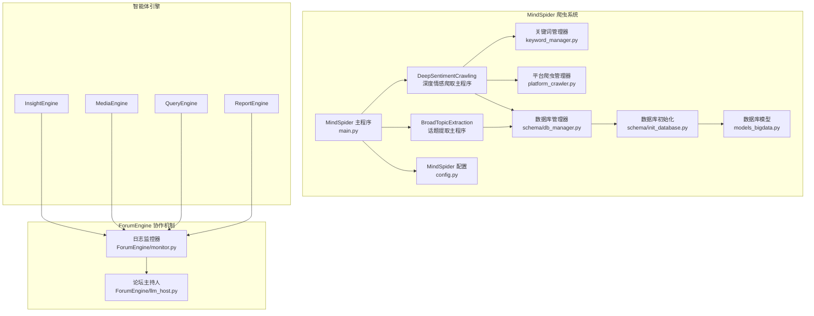
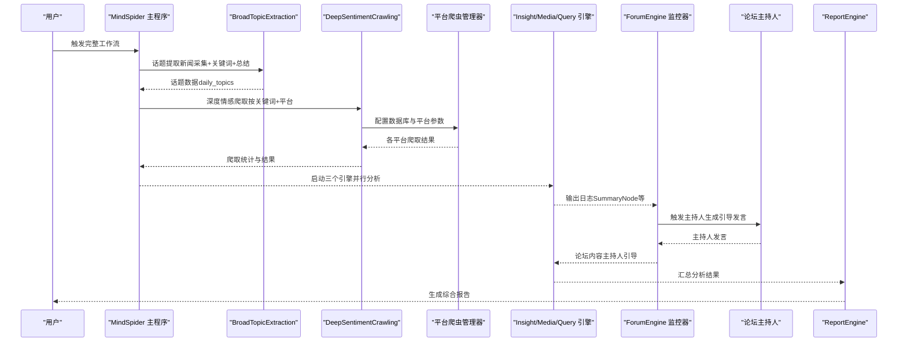
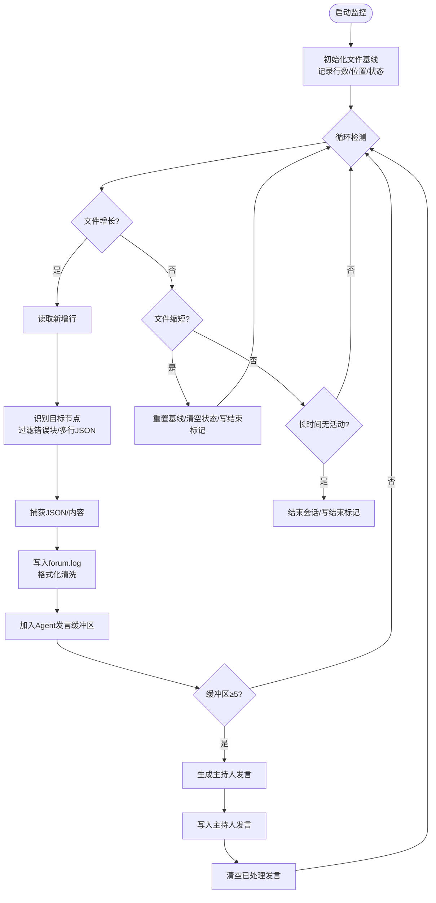
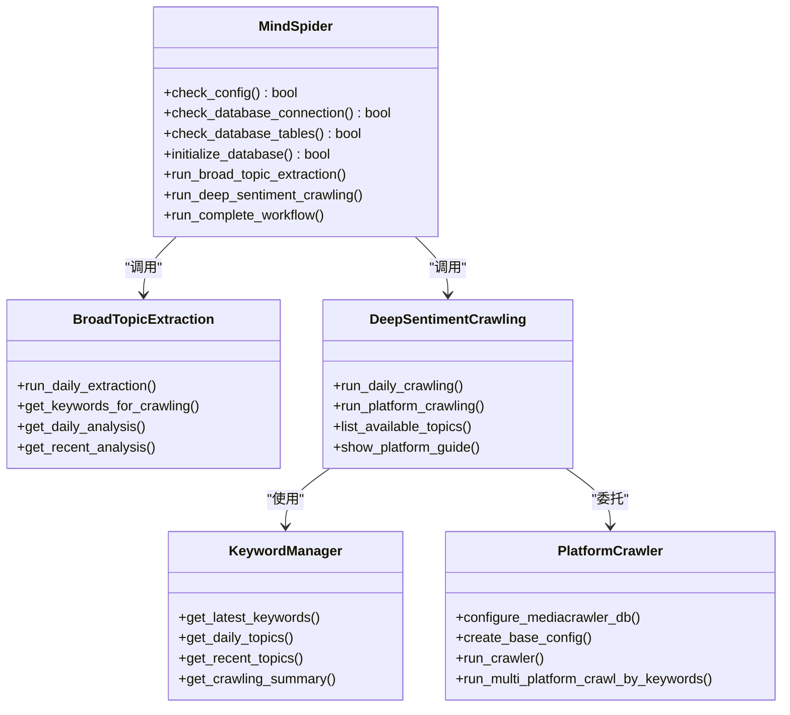
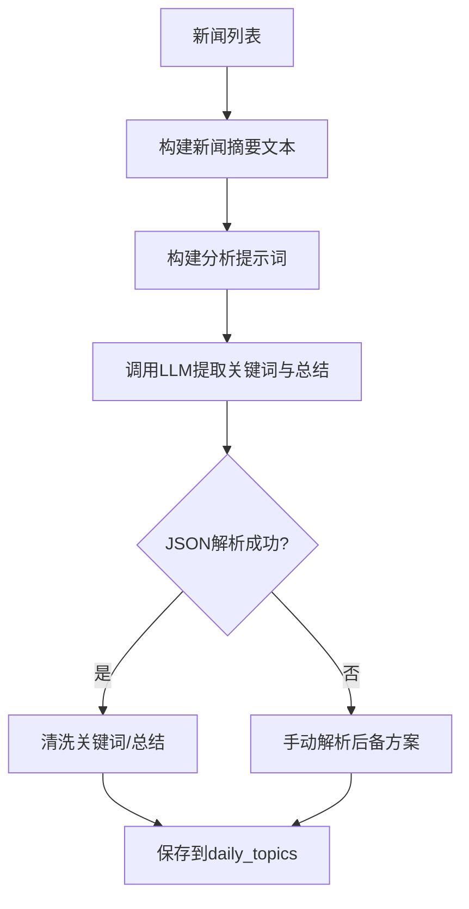
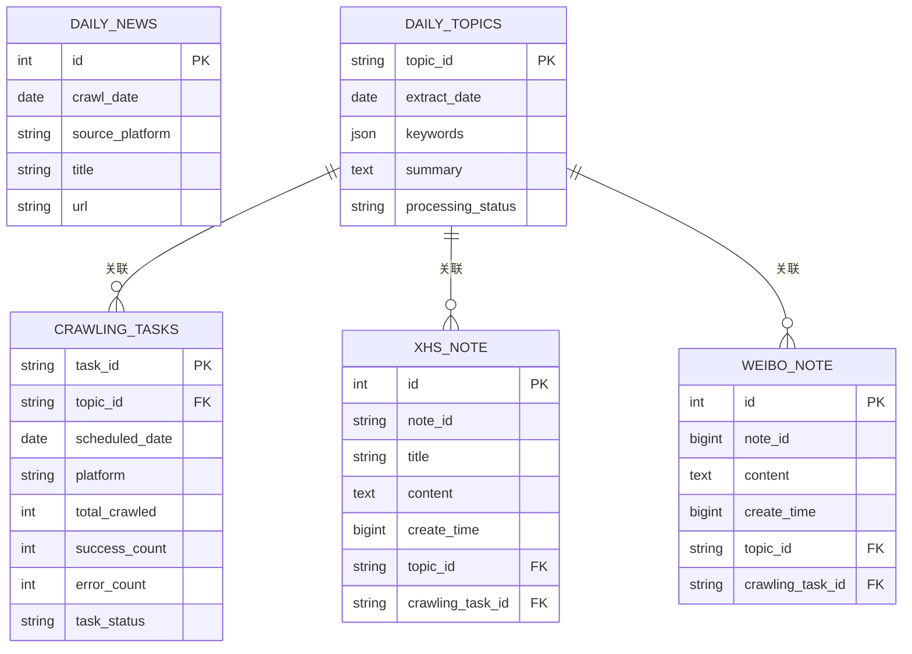
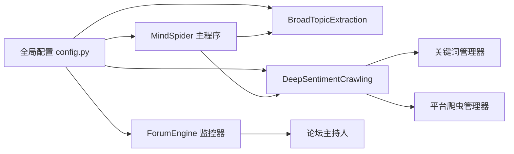

# 协作与数据采集

<cite>
**本文档引用的文件**
- [MindSpider 主程序 main.py](file://MindSpider/main.py)
- [MindSpider 配置 config.py](file://MindSpider/config.py)
- [深度情感爬取主程序 DeepSentimentCrawling/main.py](file://MindSpider/DeepSentimentCrawling/main.py)
- [话题提取主程序 BroadTopicExtraction/main.py](file://MindSpider/BroadTopicExtraction/main.py)
- [话题提取器 BroadTopicExtraction/topic_extractor.py](file://MindSpider/BroadTopicExtraction/topic_extractor.py)
- [平台爬虫管理器 DeepSentimentCrawling/platform_crawler.py](file://MindSpider/DeepSentimentCrawling/platform_crawler.py)
- [关键词管理器 DeepSentimentCrawling/keyword_manager.py](file://MindSpider/DeepSentimentCrawling/keyword_manager.py)
- [数据库管理器 schema/db_manager.py](file://MindSpider/schema/db_manager.py)
- [数据库初始化 schema/init_database.py](file://MindSpider/schema/init_database.py)
- [数据库模型 schema/models_bigdata.py](file://MindSpider/schema/models_bigdata.py)
- [MindSpider 依赖 requirements.txt](file://MindSpider/requirements.txt)
- [论坛日志监控 ForumEngine/monitor.py](file://ForumEngine/monitor.py)
- [论坛主持人 ForumEngine/llm_host.py](file://ForumEngine/llm_host.py)
- [项目总览 README.md](file://README.md)
- [全局配置 config.py](file://config.py)
</cite>

## 目录
1. [简介](#简介)
2. [项目结构](#项目结构)
3. [核心组件](#核心组件)
4. [架构总览](#架构总览)
5. [详细组件分析](#详细组件分析)
6. [依赖关系分析](#依赖关系分析)
7. [性能考虑](#性能考虑)
8. [故障排查指南](#故障排查指南)
9. [结论](#结论)
10. [附录](#附录)

## 简介
本文件围绕“微舆”系统中的两大核心能力展开：  
- **协作机制**：基于 ForumEngine 的“论坛”协作机制，通过日志监控与主持人模型，实现多智能体（Insight、Media、Query）的链式思维碰撞与协同决策。  
- **数据采集系统**：基于 MindSpider 的 AI 爬虫系统，包含“广话题提取 + 深度情感爬取 + 多平台数据采集”的完整工作流，配套数据库设计与管理工具。

系统目标是“从原始数据到智能决策的闭环”，既提供可直接使用的分析报告，也为开发者提供可扩展的框架与接口。

## 项目结构
- MindSpider：社交媒体爬虫与数据采集子系统，包含话题提取、深度情感爬取、多平台数据采集与数据库管理。
- ForumEngine：日志监控与论坛协作引擎，负责实时监控三个引擎的输出，触发主持人模型生成引导性发言。
- Insight/Media/Query/Report Engines：四个智能体引擎，分别负责数据库挖掘、多模态内容分析、信息搜索与报告生成。
- 全局配置与依赖：统一的 .env 配置与依赖清单，支持 PostgreSQL/MySQL 双栈数据库。

**图表来源**
- [MindSpider 主程序 main.py](file://MindSpider/main.py#L1-L520)
- [深度情感爬取主程序 DeepSentimentCrawling/main.py](file://MindSpider/DeepSentimentCrawling/main.py#L1-L282)
- [话题提取主程序 BroadTopicExtraction/main.py](file://MindSpider/BroadTopicExtraction/main.py#L1-L326)
- [平台爬虫管理器 DeepSentimentCrawling/platform_crawler.py](file://MindSpider/DeepSentimentCrawling/platform_crawler.py#L1-L491)
- [关键词管理器 DeepSentimentCrawling/keyword_manager.py](file://MindSpider/DeepSentimentCrawling/keyword_manager.py#L1-L336)
- [数据库管理器 schema/db_manager.py](file://MindSpider/schema/db_manager.py#L1-L299)
- [数据库初始化 schema/init_database.py](file://MindSpider/schema/init_database.py#L1-L121)
- [数据库模型 schema/models_bigdata.py](file://MindSpider/schema/models_bigdata.py#L1-L468)
- [MindSpider 配置 config.py](file://MindSpider/config.py#L1-L36)
- [论坛日志监控 ForumEngine/monitor.py](file://ForumEngine/monitor.py#L1-L859)
- [论坛主持人 ForumEngine/llm_host.py](file://ForumEngine/llm_host.py#L1-L263)

**章节来源**
- [项目总览 README.md](file://README.md#L118-L297)

## 核心组件
- MindSpider 主程序：统一入口，负责配置检查、数据库连接与表检查、依赖安装、模块编排与完整工作流执行。
- BroadTopicExtraction：每日话题提取，整合新闻采集、关键词提取与总结生成，并将结果存入数据库。
- DeepSentimentCrawling：基于话题的深度情感爬取，管理多平台爬虫、关键词分发与结果汇总。
- ForumEngine：实时监控三个引擎日志，识别目标节点输出，触发主持人模型生成引导性发言，形成“论坛”协作闭环。
- 数据库层：MindSpider 独立的扩展表（daily_news/daily_topics/crawling_tasks 等）与各平台内容表，支持 MySQL/PostgreSQL。

**章节来源**
- [MindSpider 主程序 main.py](file://MindSpider/main.py#L34-L431)
- [话题提取主程序 BroadTopicExtraction/main.py](file://MindSpider/BroadTopicExtraction/main.py#L29-L155)
- [深度情感爬取主程序 DeepSentimentCrawling/main.py](file://MindSpider/DeepSentimentCrawling/main.py#L21-L98)
- [论坛日志监控 ForumEngine/monitor.py](file://ForumEngine/monitor.py#L24-L122)

## 架构总览
系统采用“数据采集 → 智能体分析 → 论坛协作 → 报告生成”的流水线架构。MindSpider 负责数据采集与话题抽取，三个智能体引擎并行执行各自任务，ForumEngine 通过日志监控与主持人模型实现跨引擎的交流与融合，最终由 ReportEngine 生成综合报告。

**图表来源**
- [MindSpider 主程序 main.py](file://MindSpider/main.py#L348-L378)
- [深度情感爬取主程序 DeepSentimentCrawling/main.py](file://MindSpider/DeepSentimentCrawling/main.py#L30-L98)
- [论坛日志监控 ForumEngine/monitor.py](file://ForumEngine/monitor.py#L584-L702)
- [论坛主持人 ForumEngine/llm_host.py](file://ForumEngine/llm_host.py#L57-L94)

## 详细组件分析

### MindSpider 协作机制与日志监控
- 日志监控器：实时监控 logs 目录下的 insight.log、media.log、query.log，识别目标节点（SummaryNode）输出，过滤错误块，捕获多行 JSON，清洗并写入 forum.log。
- 主持人模型：基于 Qwen3 的论坛主持人，解析最近 5 条 agent 发言，生成引导性发言，写回 forum.log，形成“主持人引导—Agent响应”的链式协作。
- 协作流程：监控器在检测到首次“首次段落总结”等目标节点输出后，进入“搜索会话”状态，持续捕获并整理内容，达到阈值或超时后结束会话。

**图表来源**
- [论坛日志监控 ForumEngine/monitor.py](file://ForumEngine/monitor.py#L584-L702)
- [论坛主持人 ForumEngine/llm_host.py](file://ForumEngine/llm_host.py#L57-L94)

**章节来源**
- [论坛日志监控 ForumEngine/monitor.py](file://ForumEngine/monitor.py#L24-L122)
- [论坛主持人 ForumEngine/llm_host.py](file://ForumEngine/llm_host.py#L27-L94)

### MindSpider AI 爬虫系统与数据采集
- 主程序编排：检查配置与数据库、安装依赖、运行话题提取与深度情感爬取模块，支持完整工作流与独立模块运行。
- 话题提取：从多个新闻源采集热点新闻，调用 LLM 提取关键词与生成总结，保存到 daily_topics。
- 深度情感爬取：基于关键词在多平台（小红书、抖音、快手、B站、微博、贴吧、知乎）进行搜索爬取，支持登录方式与保存选项。
- 数据库管理：提供表清单、统计、近期数据与旧数据清理工具，支持 MySQL/PostgreSQL。

**图表来源**
- [MindSpider 主程序 main.py](file://MindSpider/main.py#L34-L431)
- [话题提取主程序 BroadTopicExtraction/main.py](file://MindSpider/BroadTopicExtraction/main.py#L29-L155)
- [深度情感爬取主程序 DeepSentimentCrawling/main.py](file://MindSpider/DeepSentimentCrawling/main.py#L21-L98)
- [关键词管理器 DeepSentimentCrawling/keyword_manager.py](file://MindSpider/DeepSentimentCrawling/keyword_manager.py#L29-L112)
- [平台爬虫管理器 DeepSentimentCrawling/platform_crawler.py](file://MindSpider/DeepSentimentCrawling/platform_crawler.py#L27-L153)

**章节来源**
- [MindSpider 主程序 main.py](file://MindSpider/main.py#L47-L181)
- [话题提取主程序 BroadTopicExtraction/main.py](file://MindSpider/BroadTopicExtraction/main.py#L59-L155)
- [深度情感爬取主程序 DeepSentimentCrawling/main.py](file://MindSpider/DeepSentimentCrawling/main.py#L30-L98)
- [关键词管理器 DeepSentimentCrawling/keyword_manager.py](file://MindSpider/DeepSentimentCrawling/keyword_manager.py#L60-L112)
- [平台爬虫管理器 DeepSentimentCrawling/platform_crawler.py](file://MindSpider/DeepSentimentCrawling/platform_crawler.py#L42-L153)

### 话题提取算法与情感爬取
- 话题提取：基于 LLM 的提示词工程，从新闻列表中提取关键词与生成总结，支持 JSON 解析与手动回退解析。
- 深度情感爬取：关键词管理器统一提供关键词，平台爬虫管理器配置数据库与保存选项，调用 MediaCrawler 子模块执行多平台爬取。

**图表来源**
- [话题提取器 BroadTopicExtraction/topic_extractor.py](file://MindSpider/BroadTopicExtraction/topic_extractor.py#L36-L81)

**章节来源**
- [话题提取器 BroadTopicExtraction/topic_extractor.py](file://MindSpider/BroadTopicExtraction/topic_extractor.py#L36-L171)

### 数据库设计与配置管理
- 数据库初始化：支持 MySQL/PostgreSQL，自动创建 MindSpider 扩展表与视图，统一使用 SQLAlchemy Base。
- 数据库模型：MindSpider 扩展表（daily_news/daily_topics/crawling_tasks）与各平台内容表（xhs/weibo/bilibili 等）。
- 数据库管理：提供表清单、统计、近期数据与旧数据清理工具，支持 dry-run 与执行模式。

**图表来源**
- [数据库初始化 schema/init_database.py](file://MindSpider/schema/init_database.py#L61-L97)
- [数据库模型 schema/models_bigdata.py](file://MindSpider/schema/models_bigdata.py#L18-L468)

**章节来源**
- [数据库初始化 schema/init_database.py](file://MindSpider/schema/init_database.py#L41-L114)
- [数据库模型 schema/models_bigdata.py](file://MindSpider/schema/models_bigdata.py#L18-L468)
- [数据库管理器 schema/db_manager.py](file://MindSpider/schema/db_manager.py#L54-L175)

## 依赖关系分析
- MindSpider 主程序依赖配置模块、数据库引擎与子模块（BroadTopicExtraction/DeepSentimentCrawling）。
- DeepSentimentCrawling 依赖 KeywordManager 与 PlatformCrawler，后者进一步依赖 MediaCrawler 子模块。
- ForumEngine 依赖 LLM 主持人模块，通过日志监控与主持人交互实现协作。
- 全局配置通过 pydantic-settings 统一管理，MindSpider 与主系统共享配置。

**图表来源**
- [MindSpider 主程序 main.py](file://MindSpider/main.py#L1-L50)
- [全局配置 config.py](file://config.py#L23-L119)
- [论坛日志监控 ForumEngine/monitor.py](file://ForumEngine/monitor.py#L16-L23)

**章节来源**
- [MindSpider 依赖 requirements.txt](file://MindSpider/requirements.txt#L1-L63)
- [MindSpider 主程序 main.py](file://MindSpider/main.py#L1-L50)

## 性能考虑
- 并发与超时：DeepSentimentCrawling 对各平台爬取设置超时（默认 60 分钟），MindSpider 主程序对子模块执行设置超时（话题提取 30 分钟、情感爬取 60 分钟）。
- 数据库连接：使用 SQLAlchemy 异步引擎与连接池预检，减少连接开销。
- 日志监控：采用文件位置追踪与多行 JSON 捕获，避免重复解析与阻塞。
- 关键词控制：通过 max_keywords/max_notes 控制爬取规模，降低平台风控与网络压力。
- 依赖安装：MediaCrawler 子模块依赖通过标记文件避免重复安装，提升初始化效率。

[本节为通用指导，不直接分析具体文件]

## 故障排查指南
- 配置缺失：检查 .env/.env.example 中数据库与 API 密钥配置，MindSpider 主程序会提示缺失项。
- 数据库连接失败：确认 DB_DIALECT、DB_HOST、DB_PORT、DB_USER、DB_PASSWORD、DB_NAME、DB_CHARSET。
- 数据库表缺失：使用数据库管理工具或主程序自动初始化脚本创建表与视图。
- 爬取超时/失败：检查平台登录状态、代理设置与请求频率，适当降低 max_notes 与 max_keywords。
- 论坛无输出：确认目标节点输出（FirstSummaryNode/ReflectionSummaryNode）与日志格式，检查 ERROR 块过滤逻辑。
- LLM 调用异常：检查 API Key/Base URL/Model Name，必要时切换至兼容 OpenAI 格式的第三方服务。

**章节来源**
- [MindSpider 主程序 main.py](file://MindSpider/main.py#L47-L100)
- [数据库管理器 schema/db_manager.py](file://MindSpider/schema/db_manager.py#L228-L262)
- [论坛日志监控 ForumEngine/monitor.py](file://ForumEngine/monitor.py#L444-L467)

## 结论
本系统通过“MindSpider 数据采集 + 智能体分析 + ForumEngine 协作 + ReportEngine 报告”的完整链路，实现了从热点发现到深度分析再到综合报告的自动化闭环。MindSpider 提供了可扩展的爬虫与数据库管理能力，ForumEngine 则通过主持人模型强化了跨引擎协作与思维碰撞，适合在舆情监测、品牌声誉分析、市场研究等领域落地应用。

[本节为总结性内容，不直接分析具体文件]

## 附录
- 使用示例（MindSpider）：
  - 初始化：python main.py --setup
  - 仅运行话题提取：python main.py --broad-topic
  - 仅运行深度情感爬取：python main.py --deep-sentiment --platforms xhs dy wb
  - 完整工作流：python main.py --complete --date 2024-01-20
- 数据库管理：
  - 查看表与统计：python schema/db_manager.py --tables --stats
  - 清理旧数据（预览）：python schema/db_manager.py --cleanup 90
  - 执行清理：python schema/db_manager.py --cleanup 90 --execute

**章节来源**
- [项目总览 README.md](file://README.md#L466-L494)
- [数据库管理器 schema/db_manager.py](file://MindSpider/schema/db_manager.py#L264-L299)