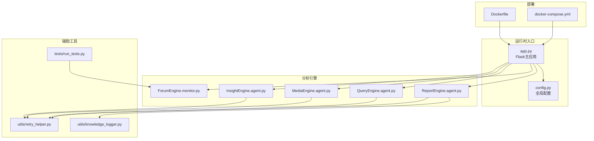
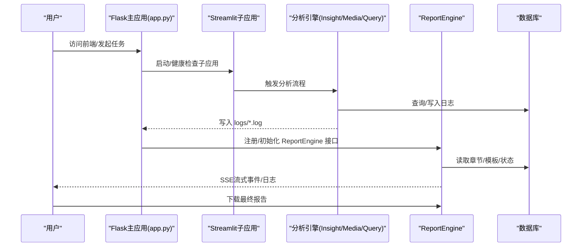
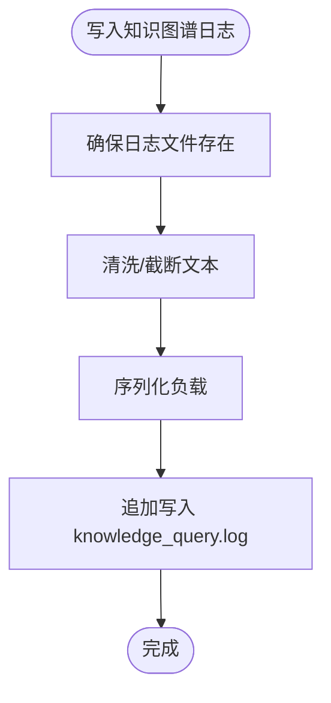
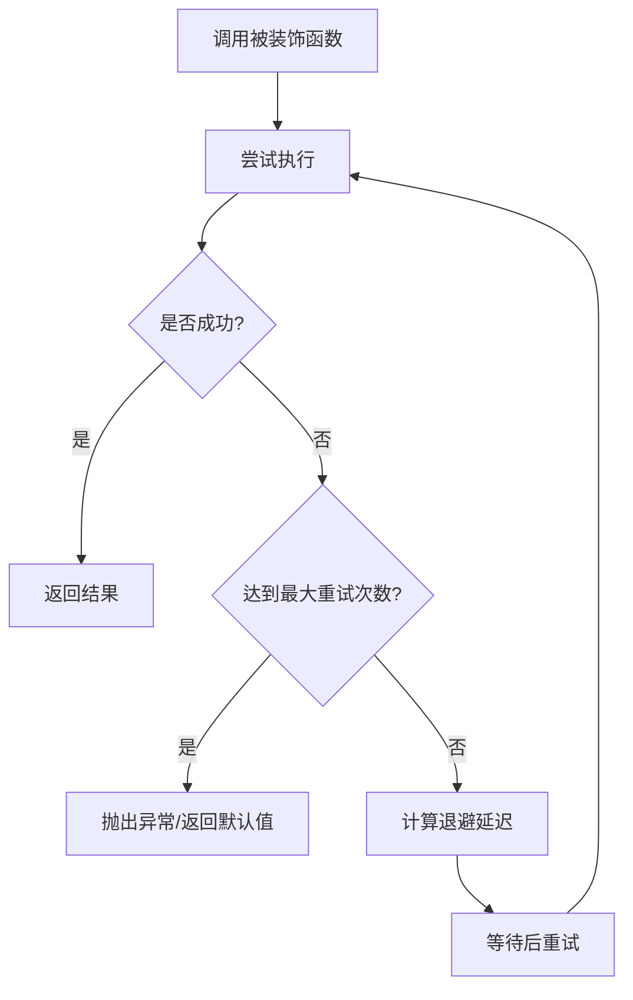
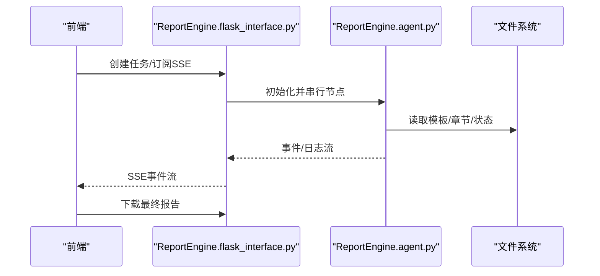
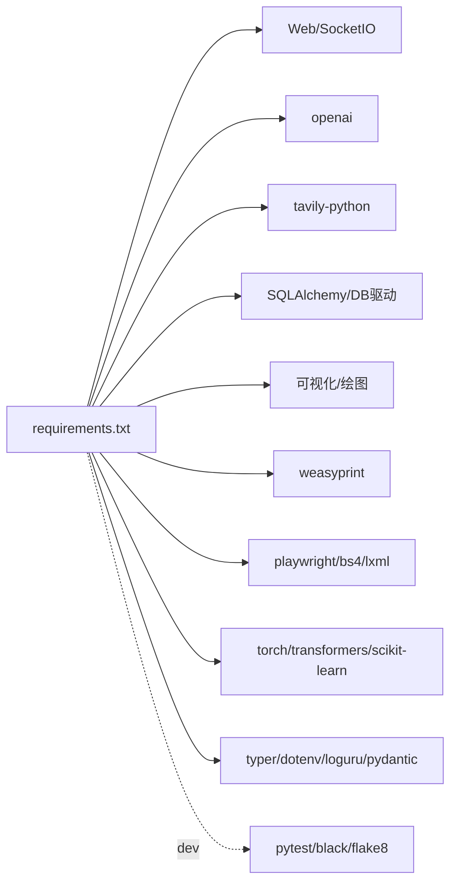

# 开发指南

<cite>
**本文引用的文件**
- [README.md](file://README.md)
- [CONTRIBUTING.md](file://CONTRIBUTING.md)
- [requirements.txt](file://requirements.txt)
- [config.py](file://config.py)
- [app.py](file://app.py)
- [Dockerfile](file://Dockerfile)
- [docker-compose.yml](file://docker-compose.yml)
- [utils/retry_helper.py](file://utils/retry_helper.py)
- [utils/knowledge_logger.py](file://utils/knowledge_logger.py)
- [tests/run_tests.py](file://tests/run_tests.py)
- [ReportEngine/flask_interface.py](file://ReportEngine/flask_interface.py)
- [ReportEngine/agent.py](file://ReportEngine/agent.py)
- [ForumEngine/monitor.py](file://ForumEngine/monitor.py)
- [InsightEngine/agent.py](file://InsightEngine/agent.py)
- [MindSpider/main.py](file://MindSpider/main.py)
</cite>

## 目录
1. [简介](#简介)
2. [项目结构](#项目结构)
3. [核心组件](#核心组件)
4. [架构总览](#架构总览)
5. [详细组件分析](#详细组件分析)
6. [依赖关系分析](#依赖关系分析)
7. [性能考虑](#性能考虑)
8. [故障排查指南](#故障排查指南)
9. [结论](#结论)
10. [附录](#附录)

## 简介
本开发指南面向希望参与 BettaFish 项目的开发者，提供从环境搭建、代码规范、测试策略到贡献流程、社区参与、工具函数使用、日志管理、重试机制、调试技巧、性能分析与扩展开发的完整路径。项目采用多智能体架构，围绕 Insight、Media、Query 三大分析引擎与 Report 引擎协同工作，并通过 ForumEngine 实现跨 Agent 的“论坛式”协作与主持人引导。

## 项目结构
- 核心引擎
  - InsightEngine：私有数据库挖掘与分析
  - MediaEngine：多模态内容分析
  - QueryEngine：国内外新闻广度搜索
  - ReportEngine：模板选择、布局、章节生成与渲染
  - ForumEngine：日志监控与主持人引导
  - MindSpider：社交媒体爬虫系统
- 辅助模块
  - utils：重试机制、知识图谱日志
  - tests：单元与集成测试入口
  - 单引擎 Streamlit 应用：独立调试与演示
- 运行与部署
  - app.py：Flask 主应用，统一管理三个 Streamlit 子应用与 ReportEngine 接口
  - Dockerfile/docker-compose.yml：容器化与数据库编排
  - config.py：全局配置（.env 与环境变量自动加载）
  - requirements.txt：依赖清单

**图表来源**
- [app.py](file://app.py#L1-L120)
- [config.py](file://config.py#L23-L115)
- [utils/retry_helper.py](file://utils/retry_helper.py#L1-L120)
- [utils/knowledge_logger.py](file://utils/knowledge_logger.py#L1-L60)
- [tests/run_tests.py](file://tests/run_tests.py#L1-L62)
- [Dockerfile](file://Dockerfile#L1-L78)
- [docker-compose.yml](file://docker-compose.yml#L1-L40)

**章节来源**
- [README.md](file://README.md#L118-L297)
- [app.py](file://app.py#L1-L120)
- [config.py](file://config.py#L23-L115)

## 核心组件
- 配置管理（config.py）
  - 使用 pydantic-settings 自动从 .env 与环境变量加载，集中管理数据库、LLM、搜索工具、GraphRAG 等参数。
- 日志与监控（app.py、utils/knowledge_logger.py、ForumEngine/monitor.py）
  - Flask 主应用统一输出与转发日志，Streamlit 子应用日志写入 logs/{engine}.log；知识图谱查询日志统一写入 knowledge_query.log；ForumEngine 监控 logs/forum.log 并生成主持人引导。
- 重试机制（utils/retry_helper.py）
  - 提供通用装饰器与可配置退避策略，支持 LLM、搜索 API、数据库等场景的优雅重试。
- 报告引擎（ReportEngine/agent.py、ReportEngine/flask_interface.py）
  - 任务流式推送、SSE 日志转发、模板选择、章节生成、IR 装订与渲染，支持 GraphRAG 增强。
- 引擎主类（InsightEngine/agent.py 等）
  - 各引擎的节点编排、工具集成、状态管理与聚类采样等核心逻辑。

**章节来源**
- [config.py](file://config.py#L23-L115)
- [app.py](file://app.py#L546-L754)
- [utils/knowledge_logger.py](file://utils/knowledge_logger.py#L60-L96)
- [utils/retry_helper.py](file://utils/retry_helper.py#L57-L136)
- [ReportEngine/agent.py](file://ReportEngine/agent.py#L190-L200)
- [ReportEngine/flask_interface.py](file://ReportEngine/flask_interface.py#L1-L120)
- [ForumEngine/monitor.py](file://ForumEngine/monitor.py#L24-L122)

## 架构总览
系统以 Flask 主应用为中心，统一启动与管理三个 Streamlit 子应用（Insight/Media/Query），并通过 ReportEngine 提供 HTTP/SSE 接口与任务流式输出。各引擎通过日志文件进行解耦协作，ForumEngine 作为“主持人”对 Agent 发言进行监控与引导，ReportEngine 负责将多源输出整合为最终报告。

**图表来源**
- [app.py](file://app.py#L276-L348)
- [ReportEngine/flask_interface.py](file://ReportEngine/flask_interface.py#L1-L120)

**章节来源**
- [README.md](file://README.md#L86-L117)
- [app.py](file://app.py#L276-L348)

## 详细组件分析

### 配置与环境管理（config.py）
- 特性
  - 自动加载 .env 与环境变量，支持主机、端口、数据库、LLM、搜索工具、GraphRAG 等参数。
  - 提供 reload_settings() 以在运行时动态刷新配置。
- 建议
  - 通过 .env.example 与 README 的环境变量说明进行配置，避免硬编码。
  - 使用 Pydantic 字段校验与默认值，确保参数一致性。

**章节来源**
- [config.py](file://config.py#L23-L115)
- [README.md](file://README.md#L395-L424)

### 日志与知识图谱日志（app.py、utils/knowledge_logger.py）
- 特性
  - Flask 主应用统一输出到 logs/{app}.log，并通过 SocketIO 推送至前端 Console。
  - 知识图谱查询日志统一写入 knowledge_query.log，带时间戳与来源标记，支持文本清洗与截断。
- 建议
  - 使用 loguru 的 sink 与过滤策略，避免无关引擎日志混入 ReportEngine 的 SSE 流。
  - 对长文本进行截断，避免日志膨胀。

**图表来源**
- [utils/knowledge_logger.py](file://utils/knowledge_logger.py#L60-L96)

**章节来源**
- [app.py](file://app.py#L546-L573)
- [utils/knowledge_logger.py](file://utils/knowledge_logger.py#L60-L96)

### 重试机制（utils/retry_helper.py）
- 特性
  - 支持指数退避、最大重试次数、最大延迟、异常类型白名单。
  - 提供 with_retry、with_graceful_retry（失败返回默认值）、make_retryable_request 等便捷方法。
  - 预置 LLM、搜索 API、数据库等常用配置。
- 建议
  - 对 LLM 与第三方 API 调用使用 with_retry；对非关键功能使用优雅重试避免中断主流程。
  - 为不同场景设置合理的初始延迟与退避因子。

**图表来源**
- [utils/retry_helper.py](file://utils/retry_helper.py#L57-L136)

**章节来源**
- [utils/retry_helper.py](file://utils/retry_helper.py#L57-L136)
- [utils/retry_helper.py](file://utils/retry_helper.py#L228-L248)

### 报告引擎（ReportEngine/agent.py、ReportEngine/flask_interface.py）
- 特性
  - 任务流式推送、SSE 日志转发、模板选择、布局设计、篇幅规划、章节生成、IR 装订与渲染。
  - 支持 GraphRAG 增强，提供文件数量基准管理器以判断输入是否就绪。
- 建议
  - 使用 _setup_log_stream_forwarder 将 ReportEngine 内部日志转发到 SSE，便于前端实时观察。
  - 对 GraphRAG 查询次数与开关进行合理配置，避免过度调用。

**图表来源**
- [ReportEngine/flask_interface.py](file://ReportEngine/flask_interface.py#L1-L120)
- [ReportEngine/agent.py](file://ReportEngine/agent.py#L190-L200)

**章节来源**
- [ReportEngine/flask_interface.py](file://ReportEngine/flask_interface.py#L1-L120)
- [ReportEngine/agent.py](file://ReportEngine/agent.py#L190-L200)

### 引擎主类（InsightEngine/agent.py）
- 特性
  - 节点编排：首次搜索、反思、总结、报告格式化等。
  - 聚类采样：对搜索结果进行语义聚类与代表性采样，提升多样性与覆盖率。
  - 工具集成：数据库查询、情感分析、关键词优化等。
- 建议
  - 在聚类失败时回退到前 N 条，保证鲁棒性。
  - 对日期格式与边界条件进行严格校验。

**章节来源**
- [InsightEngine/agent.py](file://InsightEngine/agent.py#L41-L128)
- [InsightEngine/agent.py](file://InsightEngine/agent.py#L129-L189)

### 爬虫系统（MindSpider/main.py）
- 特性
  - 自动检查配置、数据库连接、表结构；初始化数据库表；检查依赖。
  - 支持 PostgreSQL/MySQL 异步连接与表存在性校验。
- 建议
  - 在 CI/CD 中先执行数据库初始化脚本，确保表结构就绪。
  - 对缺失依赖进行显式提示，便于本地快速定位问题。

**章节来源**
- [MindSpider/main.py](file://MindSpider/main.py#L47-L100)
- [MindSpider/main.py](file://MindSpider/main.py#L101-L182)

### 论坛引擎（ForumEngine/monitor.py）
- 特性
  - 基于文件变化的监控器，识别目标节点输出，写入 forum.log，并在一定频率触发主持人引导。
  - 支持多行 JSON 捕获、错误块过滤、来源标签等。
- 建议
  - 对 ERROR 级别日志与错误关键词进行过滤，避免干扰主持人生成。
  - 使用线程安全写入与锁，避免并发写入冲突。

**章节来源**
- [ForumEngine/monitor.py](file://ForumEngine/monitor.py#L24-L122)
- [ForumEngine/monitor.py](file://ForumEngine/monitor.py#L138-L200)

## 依赖关系分析
- 运行时依赖
  - Web：Flask、SocketIO、eventlet
  - LLM：openai
  - 搜索：tavily-python
  - 数据库：SQLAlchemy、asyncpg/aiomysql、motor、redis
  - 可视化与PDF：plotly、matplotlib、weasyprint
  - 爬虫：playwright、BeautifulSoup、lxml
  - 机器学习：torch、transformers、sentence-transformers、scikit-learn、xgboost
  - 工具：typer、python-dotenv、loguru、pydantic-settings、json-repair
- 开发工具：pytest、black、flake8
- 容器化：uv 安装依赖、Playwright 二进制预装

**图表来源**
- [requirements.txt](file://requirements.txt#L6-L91)

**章节来源**
- [requirements.txt](file://requirements.txt#L6-L91)

## 性能考虑
- I/O 与并发
  - 使用异步数据库驱动（asyncpg/aiomysql）降低数据库调用阻塞。
  - 使用 eventlet 与非阻塞读取，提升日志输出与前端推送吞吐。
- 重试与退避
  - 对 LLM 与第三方 API 使用指数退避，避免雪崩效应。
- 聚类与采样
  - 对大规模搜索结果进行语义聚类与采样，平衡多样性与性能。
- PDF 渲染
  - WeasyPrint 依赖系统字体与渲染库，确保在容器中正确安装依赖。

[本节为通用建议，无需特定文件引用]

## 故障排查指南
- 环境与依赖
  - 确认 .env 配置项齐全，数据库连接正常，Playwright 二进制已安装。
- 日志定位
  - 查看 logs/{engine}.log 与 knowledge_query.log，结合前端 Console 输出定位问题。
  - 使用 tests/run_tests.py 运行论坛日志解析测试，验证解析逻辑。
- 重试与降级
  - 对非关键 API 使用优雅重试，避免主流程中断。
- 容器化问题
  - Dockerfile 中已预装 Playwright 与系统依赖，确保镜像构建与卷挂载正确。

**章节来源**
- [tests/run_tests.py](file://tests/run_tests.py#L17-L56)
- [utils/retry_helper.py](file://utils/retry_helper.py#L141-L199)
- [Dockerfile](file://Dockerfile#L12-L51)

## 结论
本指南从环境搭建、代码规范、测试策略、贡献流程、工具函数、日志与重试机制、调试与性能分析到扩展开发给出了系统性建议。建议新贡献者先从单引擎 Streamlit 应用入手，逐步理解各模块职责与交互方式，再参与主应用与 ReportEngine 的集成开发。

[本节为总结性内容，无需特定文件引用]

## 附录

### 开发环境搭建
- Docker（推荐）
  - 复制 .env.example 为 .env，配置数据库与 LLM 参数，执行 docker compose up -d 后访问 http://localhost:5000。
- 源码启动
  - 创建虚拟环境，安装 requirements.txt，安装 Playwright 浏览器驱动，配置 .env，运行 python app.py。
- 单引擎调试
  - 使用 streamlit run SingleEngineApp/*_streamlit_app.py --server.port 8501/8502/8503。

**章节来源**
- [README.md](file://README.md#L299-L494)
- [Dockerfile](file://Dockerfile#L1-L78)
- [docker-compose.yml](file://docker-compose.yml#L1-L40)

### 代码规范与测试策略
- 规范
  - 使用 Conventional Commits 提交，遵循 black 与 flake8 规则。
- 测试
  - 使用 pytest 或 tests/run_tests.py 运行论坛日志解析测试。
  - 建议为关键节点与工具函数补充单元测试。

**章节来源**
- [CONTRIBUTING.md](file://CONTRIBUTING.md#L6-L55)
- [tests/run_tests.py](file://tests/run_tests.py#L17-L56)

### 贡献指南与社区参与
- Fork 仓库 → 创建功能分支 → 开发与测试 → 提交修改 → 推送远程 → 发起 PR
- 关注 Issues 与 Discussions，遵守行为准则与免责声明。

**章节来源**
- [CONTRIBUTING.md](file://CONTRIBUTING.md#L6-L55)
- [README.md](file://README.md#L715-L761)

### 工具函数使用
- 重试：with_retry、with_graceful_retry、make_retryable_request
- 日志：knowledge_query.log 初始化与写入
- 建议在 LLM/搜索/数据库调用处统一使用重试装饰器，避免单点失败影响整体流程。

**章节来源**
- [utils/retry_helper.py](file://utils/retry_helper.py#L57-L136)
- [utils/knowledge_logger.py](file://utils/knowledge_logger.py#L60-L96)

### 调试技巧与性能分析
- 调试
  - 启用前端 Console 输出与 SSE 日志流，结合 logs/*.log 定位问题。
  - 使用 FileCountBaseline 判断输入文件是否就绪。
- 性能
  - 异步数据库、指数退避、聚类采样、PDF 渲染依赖安装。

**章节来源**
- [ReportEngine/agent.py](file://ReportEngine/agent.py#L112-L187)
- [utils/retry_helper.py](file://utils/retry_helper.py#L228-L248)
- [Dockerfile](file://Dockerfile#L12-L51)

### 扩展开发指导
- 新增引擎：参考 InsightEngine/agent.py 的节点编排与工具集成方式。
- 新增节点：在对应 engine/nodes 下新增节点类，遵循 base_node 规范。
- 新增工具：在 engine/tools 下新增工具，注意使用重试与日志记录。
- 新增报告模板：放置于 ReportEngine/report_template/，由模板选择节点自动选用。

**章节来源**
- [InsightEngine/agent.py](file://InsightEngine/agent.py#L87-L94)
- [ReportEngine/flask_interface.py](file://ReportEngine/flask_interface.py#L1-L120)