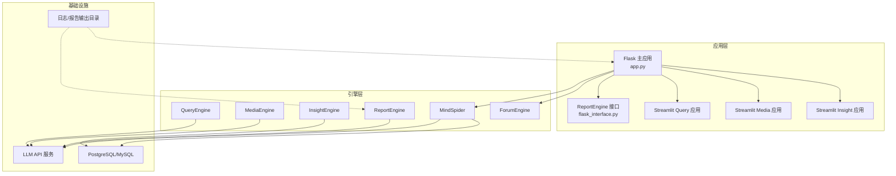
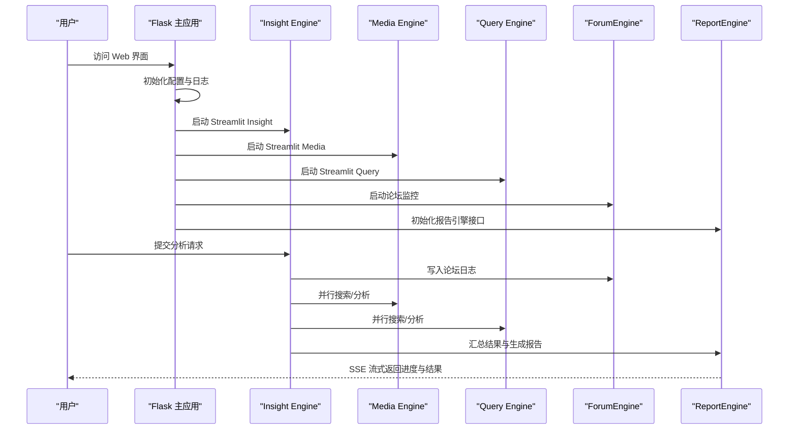
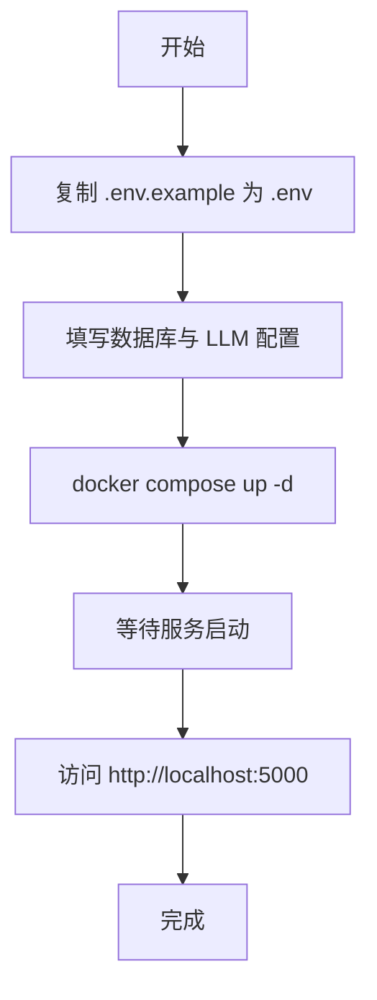
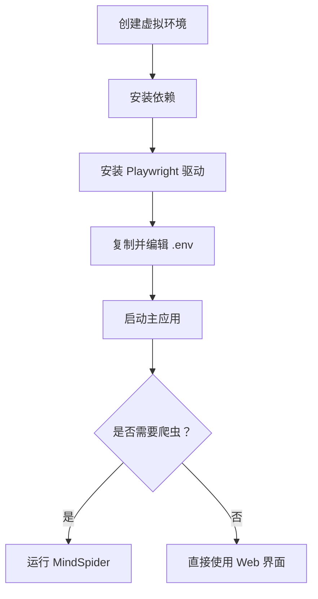

# 快速开始

<cite>
**本文引用的文件**
- [README.md](file://README.md)
- [requirements.txt](file://requirements.txt)
- [Dockerfile](file://Dockerfile)
- [docker-compose.yml](file://docker-compose.yml)
- [config.py](file://config.py)
- [.env.example](file://.env.example)
- [app.py](file://app.py)
- [MindSpider/README.md](file://MindSpider/README.md)
- [MindSpider/config.py.example](file://MindSpider/config.py.example)
- [SingleEngineApp/query_engine_streamlit_app.py](file://SingleEngineApp/query_engine_streamlit_app.py)
- [ReportEngine/flask_interface.py](file://ReportEngine/flask_interface.py)
</cite>

## 目录
1. [简介](#简介)
2. [项目结构](#项目结构)
3. [核心组件](#核心组件)
4. [架构总览](#架构总览)
5. [详细组件分析](#详细组件分析)
6. [依赖分析](#依赖分析)
7. [性能考虑](#性能考虑)
8. [故障排除指南](#故障排除指南)
9. [结论](#结论)
10. [附录](#附录)

## 简介
本指南面向初学者，帮助你在最短时间内完成 BettaFish 系统的安装与运行，涵盖 Docker 部署与源码部署两种方式，详细说明环境配置（Python 版本、数据库、LLM API）、配置文件与环境变量、系统启动流程、基本使用方法以及常见问题与性能优化建议。系统支持三大分析引擎（Query、Media、Insight）与报告引擎（Report），并通过论坛引擎（Forum）实现多智能体协作。

## 项目结构
- 核心应用入口：Flask 主应用负责统一调度三个 Streamlit 子应用与报告引擎接口。
- 引擎模块：
  - QueryEngine：国内外新闻广度搜索与分析。
  - MediaEngine：多模态内容（视频/图片）分析。
  - InsightEngine：私有数据库挖掘与情感分析。
  - ReportEngine：模板化报告生成与渲染。
  - ForumEngine：多智能体论坛协作与主持人引导。
  - MindSpider：AI 爬虫系统，负责热点话题与舆情数据采集。
- 辅助工具：PDF 导出、图表渲染、模板库、日志与重试工具等。

**图表来源**
- [app.py](file://app.py#L1-L120)
- [ReportEngine/flask_interface.py](file://ReportEngine/flask_interface.py#L1-L120)

**章节来源**
- [README.md](file://README.md#L118-L297)

## 核心组件
- Flask 主应用：统一启动与管理三个 Streamlit 子应用、论坛监控、报告引擎接口注册与健康检查。
- 配置系统：集中使用 pydantic-settings 从 .env 与环境变量加载配置，支持运行时重载。
- LLM 适配：统一 OpenAI 兼容 API 标准，支持多厂商中转服务。
- 数据库：支持 MySQL/PostgreSQL，InsightEngine 提供异步 SQLAlchemy 封装。
- 报告引擎：SSE 接口、任务队列、模板选择、章节生成与 PDF/HTML 渲染。
- 爬虫系统：MindSpider，支持多平台登录、关键词驱动的深度爬取与数据库持久化。

**章节来源**
- [config.py](file://config.py#L23-L136)
- [app.py](file://app.py#L128-L232)
- [ReportEngine/flask_interface.py](file://ReportEngine/flask_interface.py#L1-L120)

## 架构总览
系统采用“主应用统一调度 + 多智能体并行 + 论坛协作 + 报告引擎装订渲染”的整体架构。主应用启动后，分别启动三个 Streamlit 子应用与论坛监控，随后 ReportEngine 初始化并注册接口。MindSpider 作为独立爬虫系统，可单独运行或与主系统联动。

**图表来源**
- [app.py](file://app.py#L276-L348)
- [app.py](file://app.py#L376-L396)
- [ReportEngine/flask_interface.py](file://ReportEngine/flask_interface.py#L1-L120)

## 详细组件分析

### Docker 部署（推荐新手）
- 准备工作：复制示例环境变量文件为 .env，并按需填写数据库与 LLM API 配置。
- 启动服务：使用 docker compose 在后台启动所有服务，容器暴露 Web 端口与三个 Streamlit 端口。
- 数据库：PostgreSQL 容器随系统启动，数据持久化到宿主机目录。
- 端口映射：Flask 主应用 5000，Streamlit Insight/Media/Query 分别 8501/8502/8503。
- 镜像加速：如需加速，可按注释替换 docker-compose.yml 中的镜像地址。

**图表来源**
- [README.md](file://README.md#L299-L335)
- [docker-compose.yml](file://docker-compose.yml#L1-L40)

**章节来源**
- [README.md](file://README.md#L299-L335)
- [docker-compose.yml](file://docker-compose.yml#L1-L40)
- [Dockerfile](file://Dockerfile#L1-L78)

### 源码部署（适合开发者）
- 环境要求：Python 3.9+，推荐使用 Conda 或 uv 创建隔离环境。
- 安装依赖：安装 requirements.txt 中的基础依赖与可选 PDF 导出依赖。
- Playwright 驱动：安装 Chromium 驱动以支持爬虫功能。
- 配置 .env：复制 .env.example，填写数据库与 LLM API 配置。
- 启动系统：运行主应用，或单独启动某个 Agent 的 Streamlit 应用。
- 爬虫系统：MindSpider 可单独运行，支持话题提取与多平台深度爬取。

**图表来源**
- [README.md](file://README.md#L336-L541)

**章节来源**
- [README.md](file://README.md#L336-L541)
- [requirements.txt](file://requirements.txt#L1-L91)

### 配置文件与环境变量
- 全局配置：使用 pydantic-settings 从 .env 与环境变量加载，支持运行时重载。
- 关键配置项：
  - Flask 服务器：HOST、PORT
  - 数据库：DB_DIALECT、DB_HOST、DB_PORT、DB_USER、DB_PASSWORD、DB_NAME、DB_CHARSET
  - LLM：各 Agent 的 API_KEY、BASE_URL、MODEL_NAME
  - 搜索工具：TAVILY_API_KEY、SEARCH_TOOL_TYPE、Anspire/Bocha API 配置
  - GraphRAG：GRAPHRAG_ENABLED、GRAPHRAG_MAX_QUERIES
- MindSpider 配置：独立的 config.py.example，支持 MySQL/PostgreSQL 统一参数命名。

**章节来源**
- [config.py](file://config.py#L23-L136)
- [.env.example](file://.env.example#L1-L88)
- [MindSpider/config.py.example](file://MindSpider/config.py.example#L16-L35)

### 系统启动流程
- Flask 主应用启动后：
  - 初始化日志与知识库日志
  - 启动论坛监控（写入 forum.log）
  - 启动三个 Streamlit 子应用（Insight/Media/Query）
  - 初始化 ReportEngine 接口（如可用）
  - 注册 SSE 事件流与任务队列
- 子应用通过 Streamlit 运行，各自加载配置并执行分析流程。
- ReportEngine 通过 Flask Blueprint 对外提供接口，支持任务提交、进度查询与流式事件推送。

**章节来源**
- [app.py](file://app.py#L276-L348)
- [app.py](file://app.py#L376-L396)
- [app.py](file://app.py#L509-L800)
- [ReportEngine/flask_interface.py](file://ReportEngine/flask_interface.py#L1-L120)

### 基本使用方法
- 完整系统：访问 http://localhost:5000，选择任一 Agent 输入分析需求，系统将并行启动三个 Agent 并在论坛协作下生成报告。
- 单独 Agent：使用 streamlit run 启动对应应用，或通过命令行报告工具直接生成报告。
- MindSpider：进入 MindSpider 目录，按 README 指引完成话题提取与深度爬取。

**章节来源**
- [README.md](file://README.md#L426-L541)
- [MindSpider/README.md](file://MindSpider/README.md#L299-L326)

## 依赖分析
- Python 依赖：Web 框架（Flask/Streamlit/FastAPI）、HTTP 请求（requests/httpx）、LLM 客户端（openai）、数据库驱动（SQLAlchemy/aiomysql/asyncpg）、可视化（plotly/matplotlib）、PDF 导出（weasyprint）、机器学习（torch/transformers/scikit-learn/xgboost）、工具库（pydantic-settings/tenacity/loguru/typer）。
- Docker 镜像：基于 python:3.11-slim，预装 uv、Playwright 驱动，暴露 5000/8501/8502/8503 端口。
- 服务编排：Flask 主应用 + PostgreSQL 数据库容器，数据卷映射 logs、final_reports、报告输出目录。

**章节来源**
- [requirements.txt](file://requirements.txt#L1-L91)
- [Dockerfile](file://Dockerfile#L1-L78)
- [docker-compose.yml](file://docker-compose.yml#L1-L40)

## 性能考虑
- LLM 调用：合理设置模型与 Base URL，避免频繁切换；必要时使用中转服务提升稳定性。
- 数据库：使用异步连接池与连接预检，避免长事务与锁争用。
- 并发与资源：Streamlit 子应用端口独立，避免端口冲突；MindSpider 爬取时控制并发与延时，避免被平台限制。
- 报告生成：GraphRAG 查询次数上限可控，建议在 2～4 次之间平衡质量与性能。
- PDF 导出：确保系统依赖安装完整，避免运行时报错。

[本节为通用建议，无需特定文件引用]

## 故障排除指南
- 端口占用：Streamlit 子应用端口与主应用端口冲突时，修改端口或停止占用进程。
- LLM API 未配置：各 Agent 需要对应的 API_KEY、BASE_URL、MODEL_NAME，未配置会导致启动失败。
- 数据库连接失败：检查 DB_DIALECT、DB_HOST、DB_PORT、DB_USER、DB_PASSWORD、DB_NAME、DB_CHARSET 是否正确。
- PDF 导出失败：安装系统依赖（WeasyPrint 所需系统库），或禁用 PDF 功能。
- MindSpider 登录失败：关闭无头模式，手动扫码登录；或删除浏览器缓存目录重新登录。
- 爬虫被限制：降低并发、增加延时、使用代理池；遵守平台 robots.txt 与服务条款。

**章节来源**
- [README.md](file://README.md#L447-L541)
- [MindSpider/README.md](file://MindSpider/README.md#L365-L476)

## 结论
通过本快速开始指南，你可以使用 Docker 或源码方式快速部署 BettaFish 系统，完成环境配置与启动流程，并基于 Web 界面或命令行工具进行基本使用。遇到问题时，可依据故障排除指南定位并解决。建议在生产环境中进一步完善 LLM 与数据库配置、优化并发与资源使用，并结合 GraphRAG 与 MindSpider 提升分析深度与覆盖面。

[本节为总结，无需特定文件引用]

## 附录

### A. 环境变量与配置项对照
- Flask 服务器：HOST、PORT
- 数据库：DB_DIALECT、DB_HOST、DB_PORT、DB_USER、DB_PASSWORD、DB_NAME、DB_CHARSET
- LLM：INSIGHT_ENGINE_*、MEDIA_ENGINE_*、QUERY_ENGINE_*、REPORT_ENGINE_*、MINDSPIDER_*、FORUM_HOST_*、KEYWORD_OPTIMIZER_*
- 搜索工具：TAVILY_API_KEY、SEARCH_TOOL_TYPE、ANSPIRE_*、BOCHA_*
- GraphRAG：GRAPHRAG_ENABLED、GRAPHRAG_MAX_QUERIES

**章节来源**
- [.env.example](file://.env.example#L1-L88)
- [config.py](file://config.py#L23-L136)

### B. 端口与服务映射
- Flask 主应用：5000
- Streamlit Insight：8501
- Streamlit Media：8502
- Streamlit Query：8503
- PostgreSQL：5432（可映射到宿主机）

**章节来源**
- [docker-compose.yml](file://docker-compose.yml#L13-L17)
- [docker-compose.yml](file://docker-compose.yml#L36-L37)

### C. 常用命令速查
- Docker 启动：docker compose up -d
- 源码安装依赖：pip install -r requirements.txt
- Playwright 驱动：playwright install chromium
- 启动主应用：python app.py
- 单独启动 Agent：streamlit run SingleEngineApp/*_streamlit_app.py --server.port 85xx
- MindSpider 完整流程：python main.py --complete --test

**章节来源**
- [README.md](file://README.md#L305-L541)