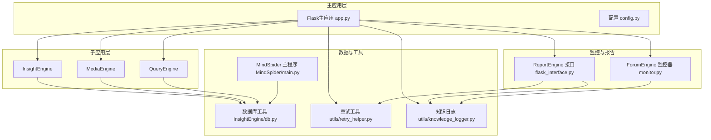
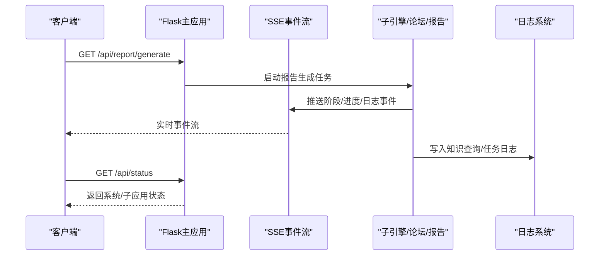
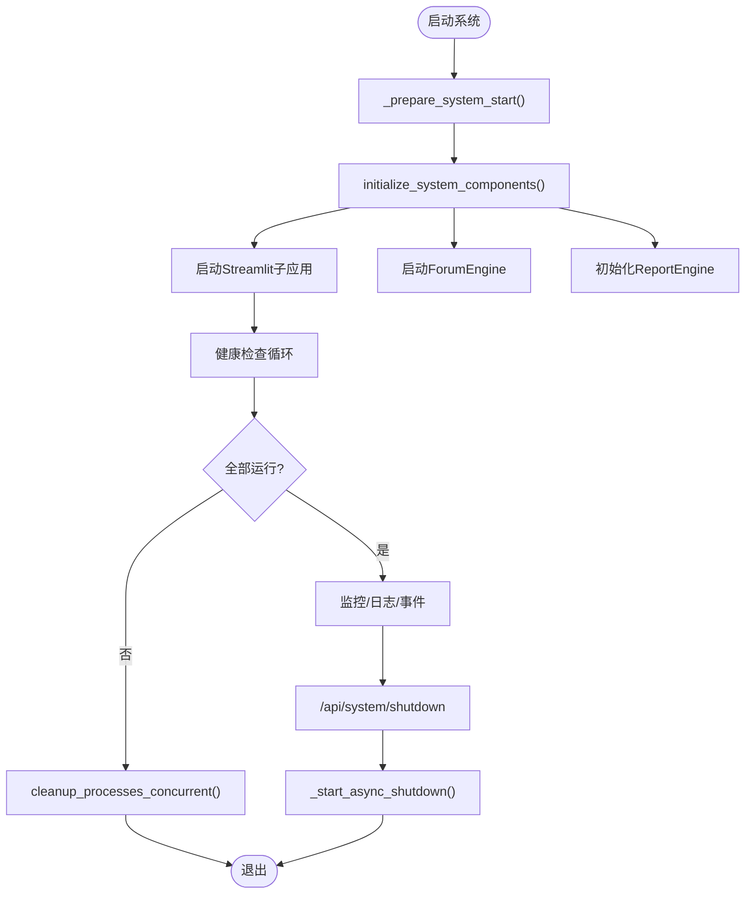
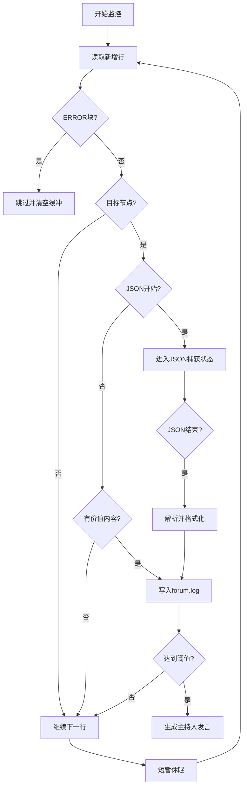
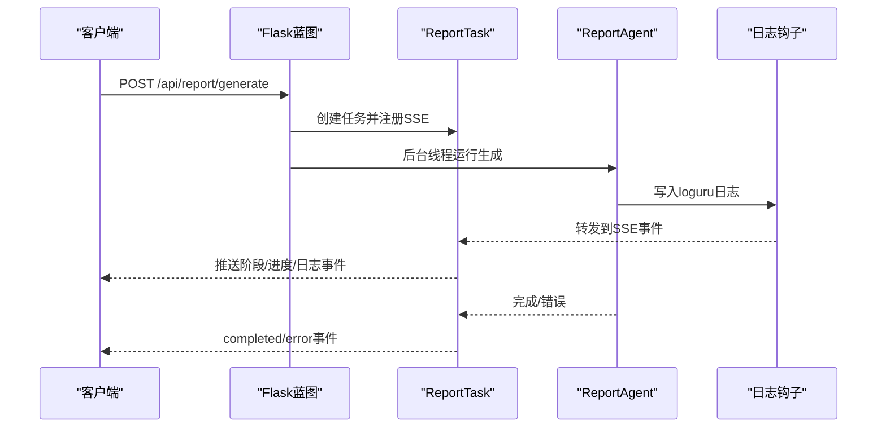
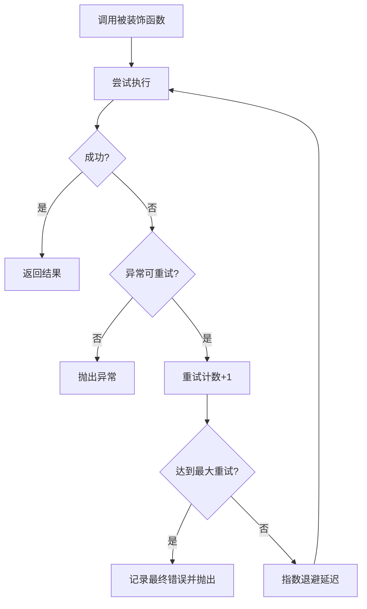
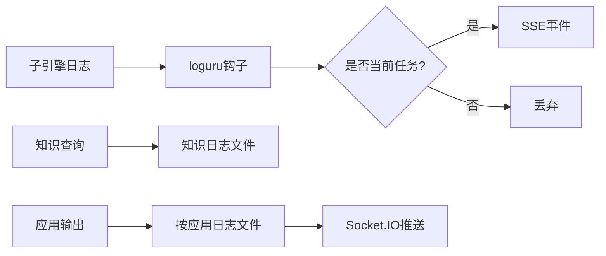
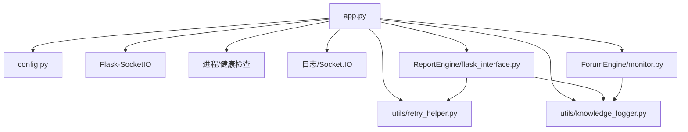

# 性能优化与监控

<cite>
**本文档引用的文件**
- [app.py](file://app.py)
- [config.py](file://config.py)
- [utils/retry_helper.py](file://utils/retry_helper.py)
- [ForumEngine/monitor.py](file://ForumEngine/monitor.py)
- [ReportEngine/flask_interface.py](file://ReportEngine/flask_interface.py)
- [utils/knowledge_logger.py](file://utils/knowledge_logger.py)
- [MindSpider/main.py](file://MindSpider/main.py)
- [requirements.txt](file://requirements.txt)
- [tests/test_monitor.py](file://tests/test_monitor.py)
</cite>

## 目录
1. [简介](#简介)
2. [项目结构](#项目结构)
3. [核心组件](#核心组件)
4. [架构总览](#架构总览)
5. [详细组件分析](#详细组件分析)
6. [依赖关系分析](#依赖关系分析)
7. [性能考量](#性能考量)
8. [故障排查指南](#故障排查指南)
9. [结论](#结论)
10. [附录](#附录)

## 简介
本文件面向运维与开发者，系统性梳理BettaFish系统的性能优化与监控实践，覆盖性能分析方法、缓存策略、资源管理、监控指标、日志管理、故障诊断、网络请求重试机制、错误处理与稳定性保障，并提供容量规划与扩展性建议。

## 项目结构
BettaFish采用多引擎协同架构：主应用通过Flask统一入口，协调三个Streamlit子应用（Insight/Media/Query）、论坛引擎（ForumEngine）、报告引擎（ReportEngine），以及MindSpider爬虫系统。日志统一写入logs目录并通过Socket.IO实时推送。

**图表来源**
- [app.py](file://app.py#L41-L120)
- [config.py](file://config.py#L23-L115)
- [ForumEngine/monitor.py](file://ForumEngine/monitor.py#L24-L76)
- [ReportEngine/flask_interface.py](file://ReportEngine/flask_interface.py#L26-L45)
- [utils/retry_helper.py](file://utils/retry_helper.py#L13-L55)
- [utils/knowledge_logger.py](file://utils/knowledge_logger.py#L15-L25)
- [MindSpider/main.py](file://MindSpider/main.py#L34-L46)

**章节来源**
- [app.py](file://app.py#L41-L120)
- [config.py](file://config.py#L23-L115)

## 核心组件
- 主应用与进程管理：统一启动/停止子应用、健康检查、优雅关停、日志写入与实时推送。
- 论坛引擎监控：基于文件变化的智能监控，过滤非目标节点输出，生成主持发言。
- 报告引擎接口：SSE流式事件推送、任务队列与历史事件缓存、日志转发与过滤。
- 重试与错误处理：统一的网络请求重试装饰器，支持指数退避与“优雅重试”。
- 日志与知识追踪：集中式日志目录、知识查询日志、过滤无关引擎日志。
- 数据库与爬虫：异步数据库连接池、自动初始化与依赖检查。

**章节来源**
- [app.py](file://app.py#L276-L348)
- [ForumEngine/monitor.py](file://ForumEngine/monitor.py#L24-L76)
- [ReportEngine/flask_interface.py](file://ReportEngine/flask_interface.py#L274-L390)
- [utils/retry_helper.py](file://utils/retry_helper.py#L57-L112)
- [utils/knowledge_logger.py](file://utils/knowledge_logger.py#L60-L96)
- [MindSpider/main.py](file://MindSpider/main.py#L139-L181)

## 架构总览
系统通过Flask主应用协调各子系统，采用以下关键设计：
- 进程生命周期管理：启动/健康检查/停止/并发清理，避免僵尸进程与资源泄露。
- 日志与事件：集中日志目录、Socket.IO实时输出、SSE事件流、日志过滤。
- 稳定性：重试装饰器、优雅关停、硬超时保护、健康检查宽限期。
- 可观测性：任务历史缓存、心跳、错误聚合、GitHub Issue链接生成辅助。

**图表来源**
- [ReportEngine/flask_interface.py](file://ReportEngine/flask_interface.py#L605-L703)
- [app.py](file://app.py#L945-L956)

**章节来源**
- [ReportEngine/flask_interface.py](file://ReportEngine/flask_interface.py#L578-L703)
- [app.py](file://app.py#L945-L956)

## 详细组件分析

### 主应用与进程管理
- 进程管理：启动/停止子应用、健康检查（端口可达性）、状态缓存、输出读取线程。
- 优雅关停：并发清理、二次终止、硬超时保护、SocketIO停止、主进程退出。
- 配置管理：读取/写入.env、热加载配置、键白名单暴露到前端。

**图表来源**
- [app.py](file://app.py#L276-L348)
- [app.py](file://app.py#L845-L897)
- [app.py](file://app.py#L1285-L1325)

**章节来源**
- [app.py](file://app.py#L276-L348)
- [app.py](file://app.py#L845-L897)
- [app.py](file://app.py#L1285-L1325)

### 论坛引擎监控（LogMonitor）
- 多文件监控：同时跟踪insight/media/query日志，记录文件大小与行数，避免重复读取。
- 目标节点识别：仅捕获SummaryNode输出，过滤SearchNode等非目标节点与错误日志。
- 多行JSON解析：支持旧/新格式时间戳清理、错误块过滤、JSON修复与格式化。
- 主持人触发：每N条Agent发言触发一次主持人发言，线程安全写入forum.log。

**图表来源**
- [ForumEngine/monitor.py](file://ForumEngine/monitor.py#L425-L522)
- [ForumEngine/monitor.py](file://ForumEngine/monitor.py#L584-L702)

**章节来源**
- [ForumEngine/monitor.py](file://ForumEngine/monitor.py#L24-L76)
- [ForumEngine/monitor.py](file://ForumEngine/monitor.py#L425-L522)
- [ForumEngine/monitor.py](file://ForumEngine/monitor.py#L584-L702)
- [tests/test_monitor.py](file://tests/test_monitor.py#L28-L44)

### 报告引擎接口（SSE/任务队列）
- 任务模型：状态机（pending/running/completed/error/cancelled）、进度、事件历史、结果路径。
- SSE事件：心跳、Last-Event-ID补发、历史事件上限、并发订阅管理。
- 日志转发：loguru钩子仅转发当前任务日志，过滤其他引擎日志，避免噪声。
- 重试策略：报告生成阶段的指数退避与警告事件推送，提升抗抖动能力。

**图表来源**
- [ReportEngine/flask_interface.py](file://ReportEngine/flask_interface.py#L274-L390)
- [ReportEngine/flask_interface.py](file://ReportEngine/flask_interface.py#L436-L576)
- [ReportEngine/flask_interface.py](file://ReportEngine/flask_interface.py#L750-L800)

**章节来源**
- [ReportEngine/flask_interface.py](file://ReportEngine/flask_interface.py#L274-L390)
- [ReportEngine/flask_interface.py](file://ReportEngine/flask_interface.py#L436-L576)
- [ReportEngine/flask_interface.py](file://ReportEngine/flask_interface.py#L750-L800)

### 重试机制与错误处理
- RetryConfig：最大重试次数、初始延迟、退避因子、最大延迟、异常类型白名单。
- 装饰器族：with_retry（标准重试）、retry_on_network_error（简化版）、with_graceful_retry（非关键API优雅降级）。
- 预设配置：LLM_RETRY_CONFIG、SEARCH_API_RETRY_CONFIG、DB_RETRY_CONFIG，适配不同场景。

**图表来源**
- [utils/retry_helper.py](file://utils/retry_helper.py#L57-L112)
- [utils/retry_helper.py](file://utils/retry_helper.py#L228-L247)

**章节来源**
- [utils/retry_helper.py](file://utils/retry_helper.py#L13-L55)
- [utils/retry_helper.py](file://utils/retry_helper.py#L57-L112)
- [utils/retry_helper.py](file://utils/retry_helper.py#L228-L247)

### 日志管理与知识追踪
- 集中式日志：logs目录，按应用拆分.log文件，Socket.IO实时推送。
- 知识查询日志：统一写入knowledge_query.log，线程安全，截断长文本，压缩记录。
- 日志过滤：SSE日志钩子过滤其他引擎日志，避免相互干扰。

**图表来源**
- [ReportEngine/flask_interface.py](file://ReportEngine/flask_interface.py#L74-L123)
- [utils/knowledge_logger.py](file://utils/knowledge_logger.py#L60-L96)
- [app.py](file://app.py#L546-L573)

**章节来源**
- [ReportEngine/flask_interface.py](file://ReportEngine/flask_interface.py#L74-L123)
- [utils/knowledge_logger.py](file://utils/knowledge_logger.py#L60-L96)
- [app.py](file://app.py#L546-L573)

### 数据库与爬虫
- 异步数据库：统一构建URL，pool_pre_ping，MySQL/PostgreSQL双栈支持。
- MindSpider：自动检查/初始化数据库表、安装依赖、运行工作流，超时保护。

**章节来源**
- [InsightEngine/utils/db.py](file://InsightEngine/utils/db.py#L28-L58)
- [MindSpider/main.py](file://MindSpider/main.py#L70-L105)
- [MindSpider/main.py](file://MindSpider/main.py#L139-L181)

## 依赖关系分析
- Flask主应用依赖：子应用进程、Socket.IO、日志、配置模块。
- 报告引擎依赖：SSE事件、任务模型、loguru钩子、依赖检测。
- 论坛引擎依赖：多文件监控、JSON解析、主持人模块（可选）。
- 工具依赖：重试装饰器、知识日志、数据库工具。

**图表来源**
- [app.py](file://app.py#L41-L120)
- [ReportEngine/flask_interface.py](file://ReportEngine/flask_interface.py#L26-L45)
- [utils/retry_helper.py](file://utils/retry_helper.py#L13-L55)
- [utils/knowledge_logger.py](file://utils/knowledge_logger.py#L15-L25)

**章节来源**
- [app.py](file://app.py#L41-L120)
- [ReportEngine/flask_interface.py](file://ReportEngine/flask_interface.py#L26-L45)

## 性能考量
- 进程与I/O
  - 进程启动/停止采用线程池并发清理，避免阻塞主请求；健康检查带宽限期，降低误判。
  - 日志读写使用缓冲与flush策略，避免阻塞；Socket.IO推送采用轻量事件结构。
- 网络与API
  - 重试装饰器支持指数退避与最大延迟，降低抖动影响；非关键API可优雅降级返回默认值。
  - 报告生成阶段采用有限次重试与警告事件，避免无限等待。
- 数据库
  - 异步引擎开启pool_pre_ping，减少连接失效；MySQL/PostgreSQL双栈适配。
- 监控与日志
  - SSE事件历史上限与心跳，避免内存膨胀；日志过滤减少无关噪声。
  - 论坛监控仅捕获目标节点，避免无关输出造成解析负担。

**章节来源**
- [app.py](file://app.py#L845-L897)
- [utils/retry_helper.py](file://utils/retry_helper.py#L228-L247)
- [ReportEngine/flask_interface.py](file://ReportEngine/flask_interface.py#L180-L195)
- [InsightEngine/utils/db.py](file://InsightEngine/utils/db.py#L53-L57)
- [ForumEngine/monitor.py](file://ForumEngine/monitor.py#L425-L522)

## 故障排查指南
- 启动/关停问题
  - 检查健康检查端口与超时；确认进程状态与输出队列；必要时使用并发清理并强制终止。
- 日志与事件
  - 查看logs目录对应应用日志；确认SSE连接Last-Event-ID补发；检查日志过滤是否生效。
- 论坛监控
  - 确认目标节点模式匹配；检查ERROR块过滤；验证JSON开始/结束行识别。
- 报告生成
  - 关注重试事件与警告；核对输入文件就绪状态；检查PDF依赖与渲染器。
- 数据库
  - 检查URL构建与驱动；确认pool_pre_ping；排查连接池回收策略。

**章节来源**
- [app.py](file://app.py#L803-L829)
- [app.py](file://app.py#L845-L897)
- [ReportEngine/flask_interface.py](file://ReportEngine/flask_interface.py#L750-L800)
- [tests/test_monitor.py](file://tests/test_monitor.py#L278-L308)
- [MindSpider/main.py](file://MindSpider/main.py#L70-L105)

## 结论
BettaFish通过统一的主应用入口、完善的进程与健康检查、SSE事件流、集中日志与过滤、以及可配置的重试机制，实现了可观测、可扩展、可维护的多引擎协同系统。建议在生产环境中结合容量评估、限流与熔断策略，持续优化数据库连接池与网络重试参数，以获得更稳健的性能表现。

## 附录

### 监控指标建议
- 系统级
  - 进程存活数、CPU/内存使用率、磁盘空间、网络I/O。
- 应用级
  - 子应用运行状态、健康检查成功率、启动耗时、SSE连接数。
- 业务级
  - 报告生成任务吞吐、平均/95分位耗时、错误率、重试次数。
- 日志级
  - 日志写入速率、Socket.IO推送延迟、SSE心跳丢失率。

### 容量规划与扩展性
- 垂直扩展：提升数据库连接池上限、增加重试退避时间、优化SSE事件缓存。
- 水平扩展：将子应用与报告引擎拆分为独立服务，引入消息队列与负载均衡。
- 存储：定期清理logs与中间产物，设置日志轮转与压缩策略。

### 稳定性保障清单
- 启动：健康检查宽限期、失败回滚、日志初始化。
- 运行：SSE心跳、历史事件上限、日志过滤、优雅关停。
- 退出：并发清理、二次终止、硬超时保护、SocketIO停止。