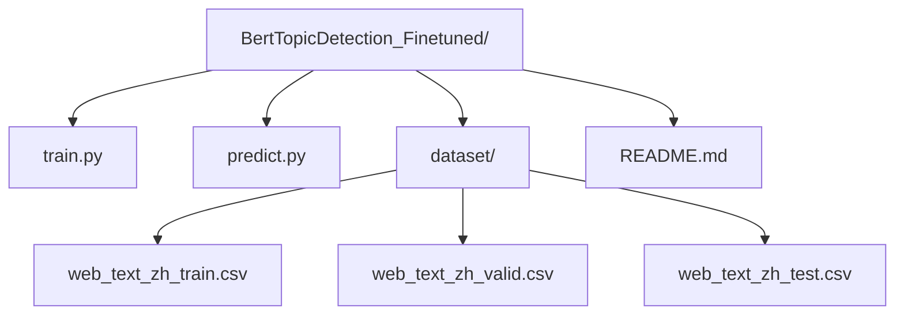
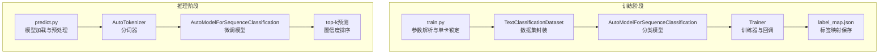
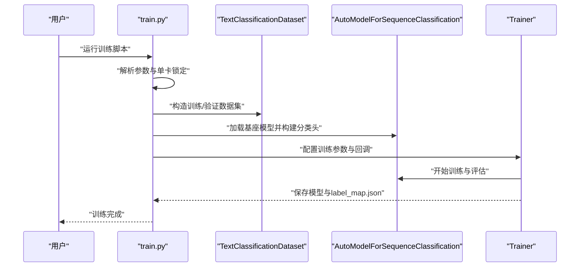
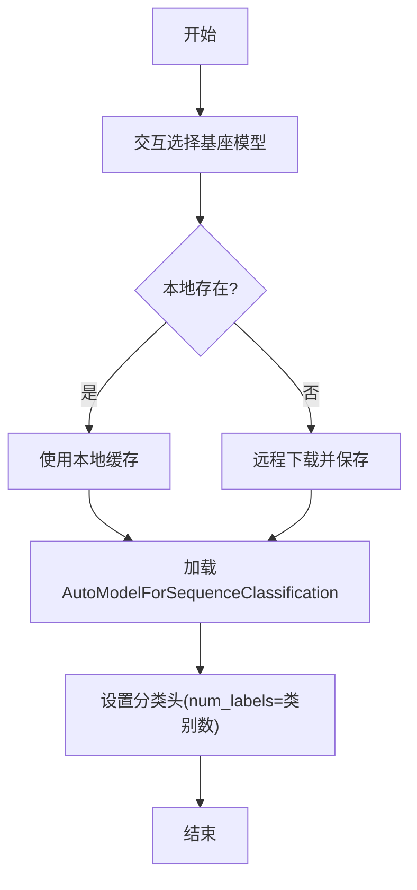
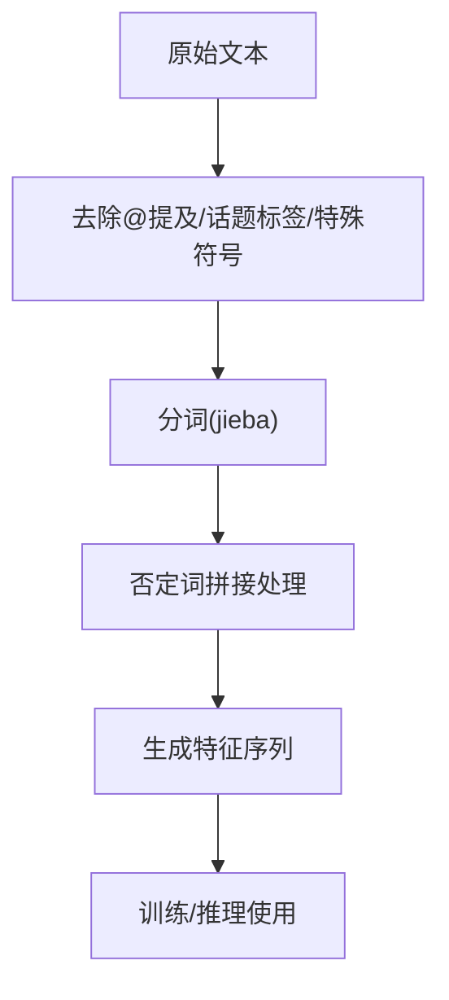
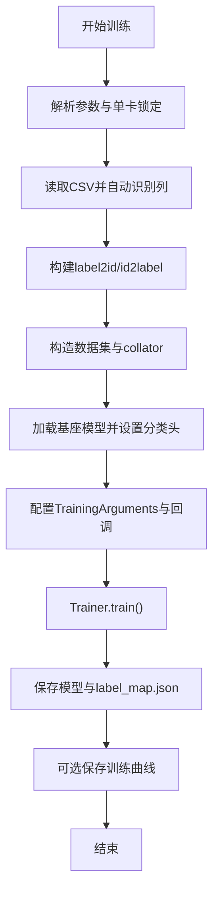
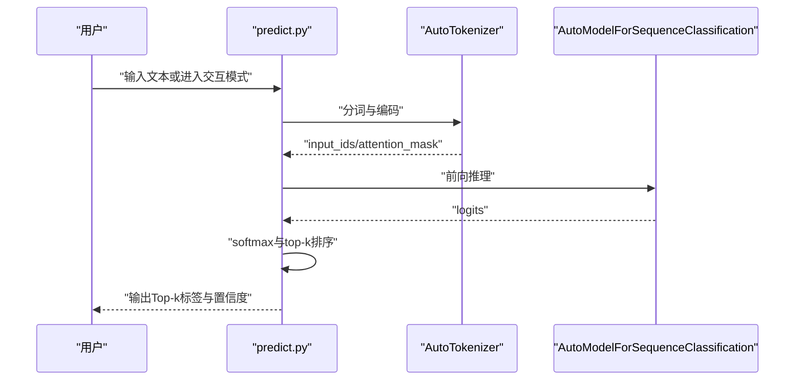
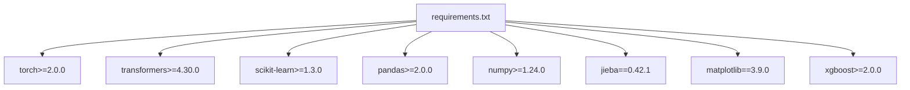

# BERT主题检测微调模型

<cite>
**本文档引用的文件**
- [train.py](file://SentimentAnalysisModel/BertTopicDetection_Finetuned/train.py)
- [predict.py](file://SentimentAnalysisModel/BertTopicDetection_Finetuned/predict.py)
- [README.md](file://SentimentAnalysisModel/BertTopicDetection_Finetuned/README.md)
- [web_text_zh_train.csv](file://SentimentAnalysisModel/BertTopicDetection_Finetuned/dataset/web_text_zh_train.csv)
- [web_text_zh_valid.csv](file://SentimentAnalysisModel/BertTopicDetection_Finetuned/dataset/web_text_zh_valid.csv)
- [utils.py](file://SentimentAnalysisModel/WeiboSentiment_MachineLearning/utils.py)
- [base_model.py](file://SentimentAnalysisModel/WeiboSentiment_MachineLearning/base_model.py)
- [requirements.txt](file://requirements.txt)
- [README.md](file://README.md)
</cite>

## 目录
1. [简介](#简介)
2. [项目结构](#项目结构)
3. [核心组件](#核心组件)
4. [架构总览](#架构总览)
5. [详细组件分析](#详细组件分析)
6. [依赖关系分析](#依赖关系分析)
7. [性能考量](#性能考量)
8. [故障排查指南](#故障排查指南)
9. [结论](#结论)
10. [附录](#附录)

## 简介
本文件针对基于BERT的主题检测微调模型，聚焦于中文微博文本的主题识别与分类任务。文档涵盖模型架构、训练流程、数据集构建、中文文本预处理、标签体系与多标签分类策略、训练脚本分析、验证流程、预测实现、数据增强技术、损失函数设计与评估指标计算，并提供性能优化与扩展建议。该实现以Hugging Face Transformers为基础，结合PyTorch进行微调训练与推理，支持多种中文预训练模型作为基座。

## 项目结构
BERT主题检测微调模型位于SentimentAnalysisModel/BertTopicDetection_Finetuned目录，包含训练脚本、预测脚本、数据集与使用说明。整体结构如下：
- train.py：训练入口，负责数据加载、模型初始化、训练配置、回调与评估、模型保存与训练曲线绘制
- predict.py：预测入口，负责模型加载、文本预处理、top-k预测与交互式预测
- dataset/：包含训练集、验证集与测试集CSV文件
- README.md：使用说明与训练策略说明

图表来源
- [train.py](file://SentimentAnalysisModel/BertTopicDetection_Finetuned/train.py#L1-L488)
- [predict.py](file://SentimentAnalysisModel/BertTopicDetection_Finetuned/predict.py#L1-L176)
- [README.md](file://SentimentAnalysisModel/BertTopicDetection_Finetuned/README.md#L1-L127)

章节来源
- [README.md](file://SentimentAnalysisModel/BertTopicDetection_Finetuned/README.md#L20-L29)

## 核心组件
- 训练脚本（train.py）
  - 单卡锁定与GPU可见性控制
  - 基座模型选择与本地缓存/远程下载
  - 文本分类数据集封装
  - 标签映射构建与自动列识别
  - 训练参数兼容性处理与策略式评估/保存
  - 早停回调与最佳模型回滚
  - 指标计算与训练曲线保存
- 预测脚本（predict.py）
  - 基座模型本地化与微调模型加载
  - 文本预处理与top-k预测
  - 单条与交互式预测
- 数据集（dataset/）
  - 训练集与验证集CSV，包含text与label列
- 中文文本预处理（utils.py）
  - 机器学习方案中的中文清洗与分词
  - 停用词加载与简单预处理函数

章节来源
- [train.py](file://SentimentAnalysisModel/BertTopicDetection_Finetuned/train.py#L10-L135)
- [predict.py](file://SentimentAnalysisModel/BertTopicDetection_Finetuned/predict.py#L41-L96)
- [web_text_zh_train.csv](file://SentimentAnalysisModel/BertTopicDetection_Finetuned/dataset/web_text_zh_train.csv#L1-L20)
- [web_text_zh_valid.csv](file://SentimentAnalysisModel/BertTopicDetection_Finetuned/dataset/web_text_zh_valid.csv#L1-L20)
- [utils.py](file://SentimentAnalysisModel/WeiboSentiment_MachineLearning/utils.py#L9-L138)

## 架构总览
该系统采用“基座模型 + 分类头”的微调范式，训练与推理分别由train.py与predict.py驱动，数据通过CSV文件提供，标签映射在训练阶段生成并保存，推理阶段加载使用。

图表来源
- [train.py](file://SentimentAnalysisModel/BertTopicDetection_Finetuned/train.py#L244-L482)
- [predict.py](file://SentimentAnalysisModel/BertTopicDetection_Finetuned/predict.py#L127-L170)

## 详细组件分析

### 训练流程与数据集
- 数据加载与自动列识别
  - 支持text/text/content/sentence/title/desc/question等文本列候选
  - 支持label/labels/category/topic/class等标签列候选
  - 若未显式指定，脚本自动在列名中匹配
- 标签映射构建
  - 基于训练集与验证集的并集构建label2id/id2label
  - 验证集中未出现的标签会被纳入映射以避免报错
- 数据集封装
  - TextClassificationDataset对文本进行分词与编码
  - 返回input_ids、attention_mask与标签张量
- 训练参数与策略
  - 支持warmup_ratio/warmup_steps、evaluation/save策略与步进
  - 自动兼容不同transformers版本的参数名差异
  - 早停回调与最佳模型回滚（当评估/保存策略一致时）

图表来源
- [train.py](file://SentimentAnalysisModel/BertTopicDetection_Finetuned/train.py#L244-L430)

章节来源
- [train.py](file://SentimentAnalysisModel/BertTopicDetection_Finetuned/train.py#L196-L217)
- [train.py](file://SentimentAnalysisModel/BertTopicDetection_Finetuned/train.py#L175-L180)
- [train.py](file://SentimentAnalysisModel/BertTopicDetection_Finetuned/train.py#L296-L300)
- [train.py](file://SentimentAnalysisModel/BertTopicDetection_Finetuned/train.py#L314-L386)
- [train.py](file://SentimentAnalysisModel/BertTopicDetection_Finetuned/train.py#L398-L419)

### 模型架构与基座选择
- 基座模型候选（训练前交互选择）
  - google-bert/bert-base-chinese
  - hfl/chinese-roberta-wwm-ext-large
  - hfl/chinese-macbert-large
  - IDEA-CCNL/Erlangshen-DeBERTa-v2-710M-Chinese
  - IDEA-CCNL/Erlangshen-DeBERTa-v3-Base-Chinese
  - Langboat/mengzi-bert-base
  - BAAI/bge-base-zh
  - nghuyong/ernie-3.0-base-zh
- 模型加载与本地缓存
  - 支持本地已存在、本机缓存与远程下载三种路径
  - 基座模型统一保存至model/bert-base-chinese目录
- 分类头配置
  - num_labels等于标签类别数
  - id2label与label2id写入config

图表来源
- [train.py](file://SentimentAnalysisModel/BertTopicDetection_Finetuned/train.py#L68-L99)
- [train.py](file://SentimentAnalysisModel/BertTopicDetection_Finetuned/train.py#L106-L135)
- [train.py](file://SentimentAnalysisModel/BertTopicDetection_Finetuned/train.py#L302-L312)

章节来源
- [train.py](file://SentimentAnalysisModel/BertTopicDetection_Finetuned/train.py#L56-L65)
- [train.py](file://SentimentAnalysisModel/BertTopicDetection_Finetuned/train.py#L106-L135)
- [train.py](file://SentimentAnalysisModel/BertTopicDetection_Finetuned/train.py#L302-L312)

### 中文文本预处理与标签体系
- 文本预处理
  - 训练脚本中的preprocess_text函数预留扩展位置
  - 预测脚本中的preprocess_text为恒等映射
  - 机器学习方案中的utils.py提供了针对微博文本的清洗与分词逻辑（停用词、@提及、话题标签等）
- 标签体系
  - 标签来源于label列，支持多类别分类
  - 训练与验证集的标签并集构建映射，确保推理阶段的稳定性
  - 未在训练中出现的验证标签会被纳入映射并给出警告

图表来源
- [utils.py](file://SentimentAnalysisModel/WeiboSentiment_MachineLearning/utils.py#L46-L77)

章节来源
- [train.py](file://SentimentAnalysisModel/BertTopicDetection_Finetuned/train.py#L102-L106)
- [predict.py](file://SentimentAnalysisModel/BertTopicDetection_Finetuned/predict.py#L37-L38)
- [utils.py](file://SentimentAnalysisModel/WeiboSentiment_MachineLearning/utils.py#L9-L18)
- [utils.py](file://SentimentAnalysisModel/WeiboSentiment_MachineLearning/utils.py#L46-L77)

### 多标签分类策略
- 当前实现为多类别分类（单标签多分类）
  - 分类头维度等于类别数
  - 损失函数为交叉熵
  - 评估指标包含准确率、精确率、召回率与F1
- 多标签场景建议
  - 将标签映射为二值向量，使用sigmoid+binary crossentropy
  - 评估指标可采用hamming loss、micro/macro-f1等
  - 可结合标签共现与层次结构进行改进

章节来源
- [train.py](file://SentimentAnalysisModel/BertTopicDetection_Finetuned/train.py#L183-L193)
- [README.md](file://SentimentAnalysisModel/BertTopicDetection_Finetuned/README.md#L116-L124)

### 训练脚本分析
- 参数解析与单卡锁定
  - 通过环境变量CUDA_VISIBLE_DEVICES与CUDA_DEVICE_ORDER确保单卡运行
  - 清理分布式相关环境变量，避免误触多卡/分布式
- 数据集与标签映射
  - 自动识别文本与标签列
  - 构建label2id/id2label并保存至label_map.json
- 训练参数与策略式评估/保存
  - 自动兼容warmup_ratio/warmup_steps
  - evaluation_strategy/save_strategy与eval_steps/save_steps对齐
  - load_best_model_at_end在策略一致时启用
- 早停与最佳模型回滚
  - 早停回调在支持时启用
  - 监控指标为加权F1，越大越好
- 指标计算与训练曲线
  - compute_metrics_fn返回accuracy/precision/recall/f1
  - 训练曲线保存为training_curve.png

图表来源
- [train.py](file://SentimentAnalysisModel/BertTopicDetection_Finetuned/train.py#L244-L482)

章节来源
- [train.py](file://SentimentAnalysisModel/BertTopicDetection_Finetuned/train.py#L11-L32)
- [train.py](file://SentimentAnalysisModel/BertTopicDetection_Finetuned/train.py#L220-L241)
- [train.py](file://SentimentAnalysisModel/BertTopicDetection_Finetuned/train.py#L258-L273)
- [train.py](file://SentimentAnalysisModel/BertTopicDetection_Finetuned/train.py#L279-L294)
- [train.py](file://SentimentAnalysisModel/BertTopicDetection_Finetuned/train.py#L314-L386)
- [train.py](file://SentimentAnalysisModel/BertTopicDetection_Finetuned/train.py#L386-L419)
- [train.py](file://SentimentAnalysisModel/BertTopicDetection_Finetuned/train.py#L183-L193)

### 验证流程
- 验证集可显式提供，若缺失则从训练集随机切分
- 早停策略与最佳模型回滚在评估/保存策略一致时启用
- 指标监控为加权F1，越大越好

章节来源
- [train.py](file://SentimentAnalysisModel/BertTopicDetection_Finetuned/train.py#L264-L273)
- [train.py](file://SentimentAnalysisModel/BertTopicDetection_Finetuned/train.py#L398-L419)

### 预测实现
- 模型加载
  - 从model_root/finetuned_subdir加载微调模型与分词器
  - 从label_map.json加载id2label映射
- 文本预处理
  - 预测脚本中的preprocess_text为恒等映射
- Top-k预测
  - 使用softmax获取概率分布，取前k个标签与置信度
- 交互式预测
  - 支持单条输入与循环交互模式

图表来源
- [predict.py](file://SentimentAnalysisModel/BertTopicDetection_Finetuned/predict.py#L127-L170)

章节来源
- [predict.py](file://SentimentAnalysisModel/BertTopicDetection_Finetuned/predict.py#L84-L96)
- [predict.py](file://SentimentAnalysisModel/BertTopicDetection_Finetuned/predict.py#L99-L124)
- [predict.py](file://SentimentAnalysisModel/BertTopicDetection_Finetuned/predict.py#L127-L170)

### 数据增强技术
- 当前实现未包含针对中文文本的特定数据增强
- 建议方案
  - 同义词替换、随机插入/删除、回译（中-英-中）
  - 基于BERT的对抗训练（FGM、PGD）
  - 上下文扰动（如替换实体、调整语序）

章节来源
- [README.md](file://SentimentAnalysisModel/BertTopicDetection_Finetuned/README.md#L105-L114)

### 损失函数设计与评估指标
- 损失函数
  - 交叉熵损失（多类别分类）
- 评估指标
  - accuracy、precision（加权）、recall（加权）、f1（加权）
- 早停与最佳模型回滚
  - 监控加权F1，越大越好，支持早停与最佳模型回滚

章节来源
- [train.py](file://SentimentAnalysisModel/BertTopicDetection_Finetuned/train.py#L183-L193)
- [train.py](file://SentimentAnalysisModel/BertTopicDetection_Finetuned/train.py#L398-L419)

## 依赖关系分析
- 核心依赖
  - torch、transformers、scikit-learn、pandas
- 环境要求
  - requirements.txt中明确torch>=2.0.0、transformers>=4.30.0、scikit-learn>=1.3.0
- 项目整体依赖
  - README.md展示了系统整体依赖栈，包含Web框架、HTTP请求、数据库、可视化、机器学习等

图表来源
- [requirements.txt](file://requirements.txt#L63-L68)

章节来源
- [requirements.txt](file://requirements.txt#L63-L68)
- [README.md](file://README.md#L86-L100)

## 性能考量
- 单卡运行与GPU可见性控制
  - 通过环境变量确保单卡稳定运行，避免分布式开销
- 训练参数与策略
  - warmup_ratio与warmup_steps的兼容处理
  - evaluation/save策略与步进对齐，减少日志刷屏
  - 早停与最佳模型回滚提升收敛效率
- 模型大小与序列长度
  - max_length与batch_size的权衡，长序列增加计算成本
- 评估指标
  - 加权F1在类别不平衡场景下更稳健

章节来源
- [train.py](file://SentimentAnalysisModel/BertTopicDetection_Finetuned/train.py#L11-L32)
- [train.py](file://SentimentAnalysisModel/BertTopicDetection_Finetuned/train.py#L330-L386)
- [train.py](file://SentimentAnalysisModel/BertTopicDetection_Finetuned/train.py#L386-L419)
- [README.md](file://SentimentAnalysisModel/BertTopicDetection_Finetuned/README.md#L105-L114)

## 故障排查指南
- 训练集/验证集路径错误
  - 确认train_file与valid_file路径存在
  - 若未提供验证集，脚本会从训练集切分
- 标签类别不足
  - 标签类别数需≥2，否则抛出异常
- 验证集中出现训练未见标签
  - 脚本会给出警告并纳入映射
- 早停与最佳模型回滚
  - 当评估/保存策略不一致时，load_best_model_at_end会被关闭
- 预测模型未找到
  - 确认model_root/finetuned_subdir路径存在label_map.json与微调模型

章节来源
- [train.py](file://SentimentAnalysisModel/BertTopicDetection_Finetuned/train.py#L261-L263)
- [train.py](file://SentimentAnalysisModel/BertTopicDetection_Finetuned/train.py#L282-L284)
- [train.py](file://SentimentAnalysisModel/BertTopicDetection_Finetuned/train.py#L285-L294)
- [train.py](file://SentimentAnalysisModel/BertTopicDetection_Finetuned/train.py#L378-L384)
- [predict.py](file://SentimentAnalysisModel/BertTopicDetection_Finetuned/predict.py#L86-L89)

## 结论
本BERT主题检测微调模型提供了稳定、可扩展的中文文本主题分类实现。通过交互式基座模型选择、自动列识别与标签映射、策略式训练与早停机制，能够在中小规模数据上取得良好效果。对于超大规模多分类与动态主题体系，建议采用检索式/双塔范式、分层分类与标签描述联合建模等策略，以提升可扩展性与增量适配能力。

## 附录
- 数据集示例
  - 训练集与验证集CSV包含text与label列
- 中文文本预处理
  - 机器学习方案中的清洗与分词逻辑可作为参考
- 项目整体说明
  - README.md展示了系统整体架构与优势

章节来源
- [web_text_zh_train.csv](file://SentimentAnalysisModel/BertTopicDetection_Finetuned/dataset/web_text_zh_train.csv#L1-L20)
- [web_text_zh_valid.csv](file://SentimentAnalysisModel/BertTopicDetection_Finetuned/dataset/web_text_zh_valid.csv#L1-L20)
- [utils.py](file://SentimentAnalysisModel/WeiboSentiment_MachineLearning/utils.py#L46-L77)
- [README.md](file://README.md#L34-L58)