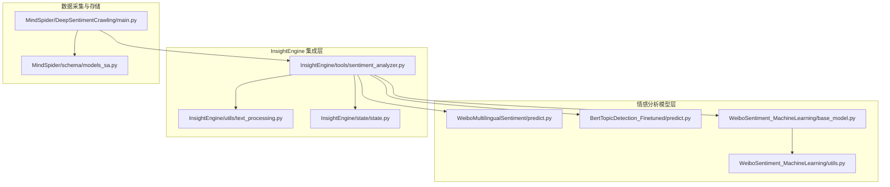
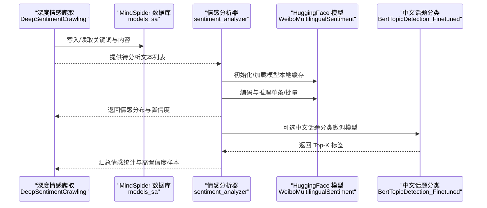
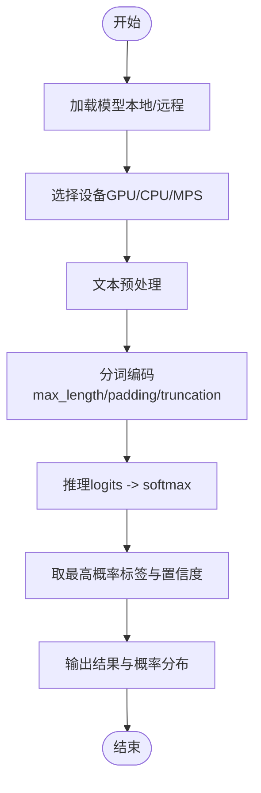
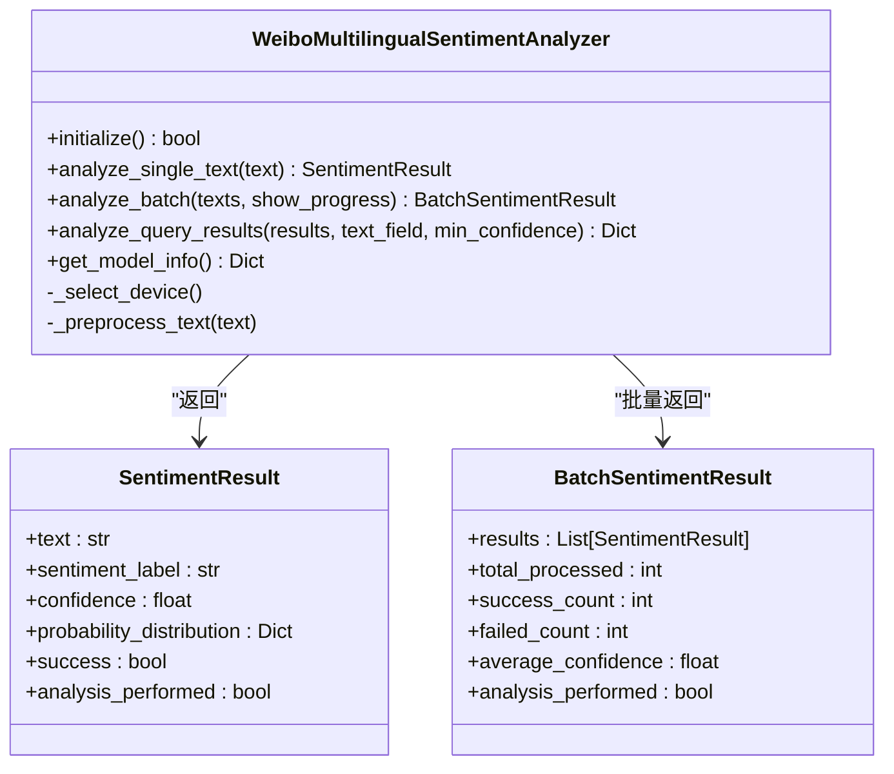
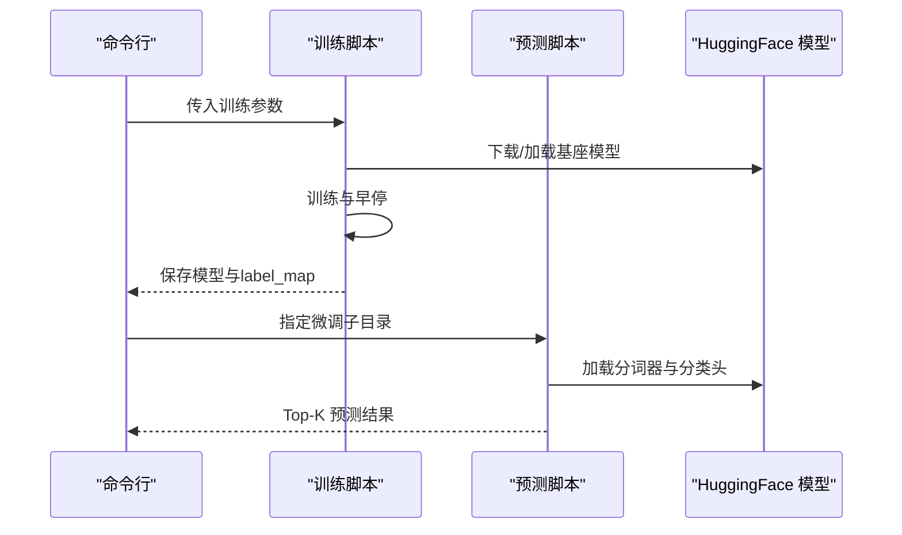
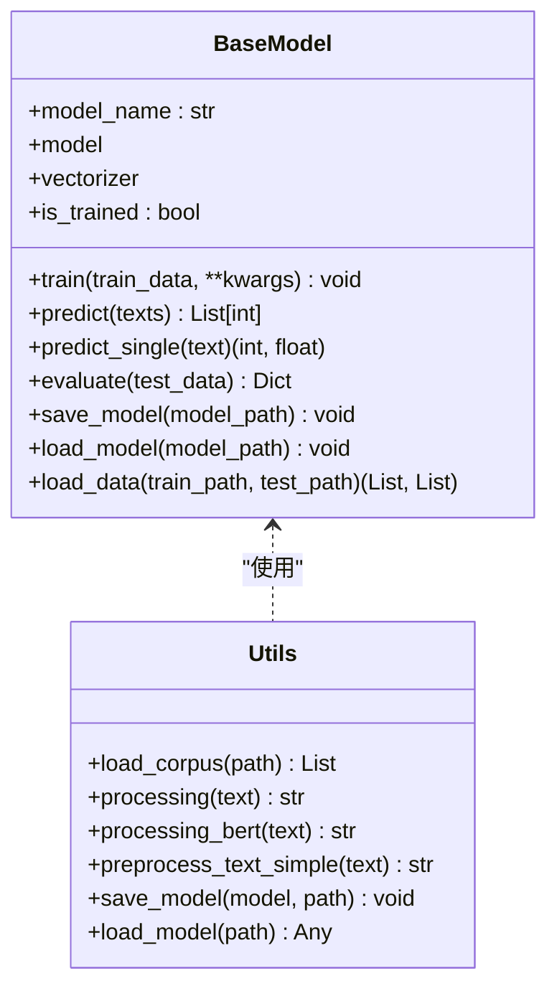
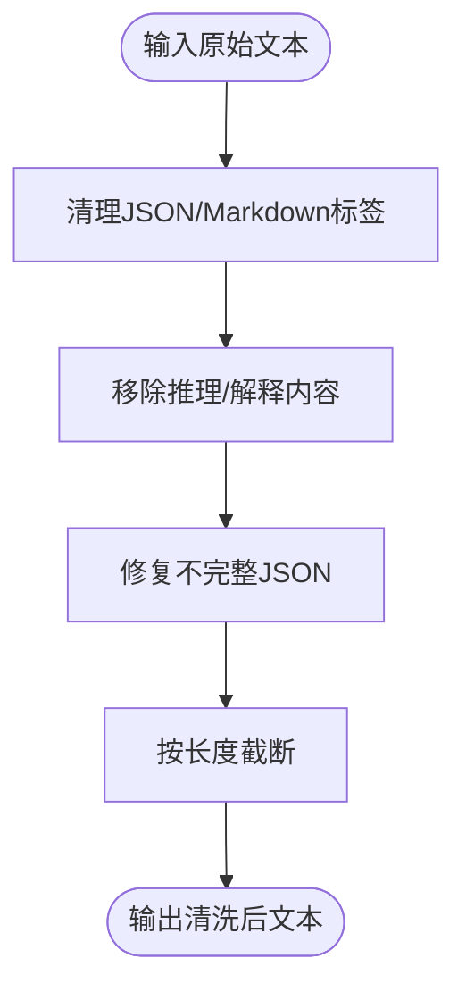
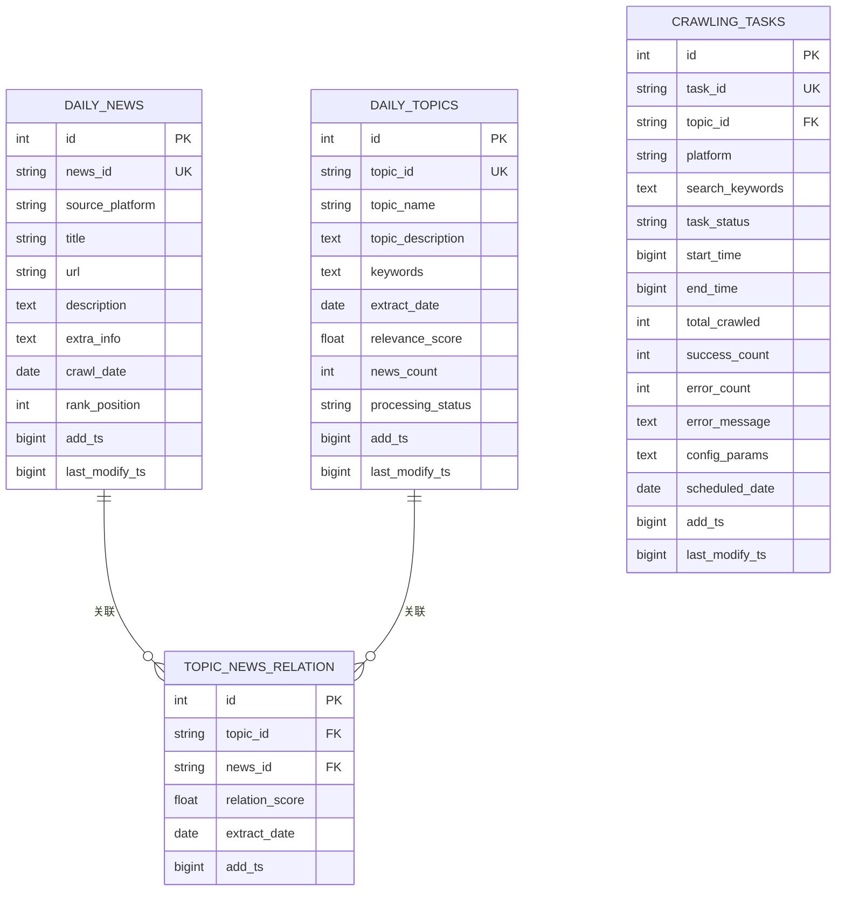
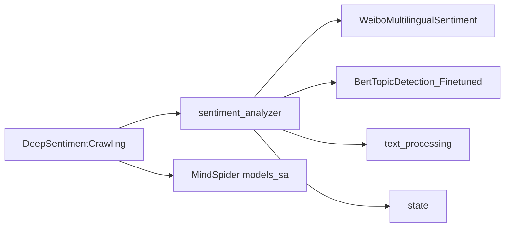

# 多语言情感分析模型

<cite>
**本文引用的文件**
- [README.md](file://README.md)
- [WeiboMultilingualSentiment/README.md](file://SentimentAnalysisModel/WeiboMultilingualSentiment/README.md)
- [WeiboMultilingualSentiment/predict.py](file://SentimentAnalysisModel/WeiboMultilingualSentiment/predict.py)
- [BertTopicDetection_Finetuned/README.md](file://SentimentAnalysisModel/BertTopicDetection_Finetuned/README.md)
- [BertTopicDetection_Finetuned/predict.py](file://SentimentAnalysisModel/BertTopicDetection_Finetuned/predict.py)
- [WeiboSentiment_MachineLearning/base_model.py](file://SentimentAnalysisModel/WeiboSentiment_MachineLearning/base_model.py)
- [WeiboSentiment_MachineLearning/utils.py](file://SentimentAnalysisModel/WeiboSentiment_MachineLearning/utils.py)
- [InsightEngine/tools/sentiment_analyzer.py](file://InsightEngine/tools/sentiment_analyzer.py)
- [InsightEngine/utils/text_processing.py](file://InsightEngine/utils/text_processing.py)
- [InsightEngine/state/state.py](file://InsightEngine/state/state.py)
- [MindSpider/DeepSentimentCrawling/main.py](file://MindSpider/DeepSentimentCrawling/main.py)
- [MindSpider/schema/models_sa.py](file://MindSpider/schema/models_sa.py)
</cite>

## 目录
1. [简介](#简介)
2. [项目结构](#项目结构)
3. [核心组件](#核心组件)
4. [架构总览](#架构总览)
5. [组件详解](#组件详解)
6. [依赖关系分析](#依赖关系分析)
7. [性能考量](#性能考量)
8. [故障排查指南](#故障排查指南)
9. [结论](#结论)
10. [附录](#附录)

## 简介
本文件为“多语言情感分析模型”的技术文档，聚焦于支持多语言的微博情感分析能力，涵盖：
- 多语言情感分析模型的加载、预测与集成
- 多语言文本预处理与特征提取
- 与爬虫系统、数据库与报告引擎的衔接
- 模型的本地缓存、设备选择与批处理策略
- 部署与应用场景建议

该系统以 HuggingFace Transformers 为基础，提供多语言情感分类（五级标签）与批量分析能力，并通过 InsightEngine 的情感分析工具集成到整体分析流程中。

## 项目结构
围绕多语言情感分析的关键目录与文件如下：
- SentimentAnalysisModel/WeiboMultilingualSentiment：多语言情感分析模型的直接调用与示例
- SentimentAnalysisModel/BertTopicDetection_Finetuned：中文话题分类（BERT 微调）示例，体现本地缓存与训练/预测流程
- SentimentAnalysisModel/WeiboSentiment_MachineLearning：传统机器学习方法的情感分析基类与预处理工具
- InsightEngine/tools/sentiment_analyzer.py：面向 InsightEngine 的情感分析器封装，负责模型初始化、预测与结果聚合
- InsightEngine/utils/text_processing.py：文本清洗与 JSON 解析工具，支撑下游分析
- InsightEngine/state/state.py：状态结构定义，便于在分析流程中传递与持久化
- MindSpider/DeepSentimentCrawling/main.py：深度情感爬取主流程，产出可用于情感分析的文本数据
- MindSpider/schema/models_sa.py：MindSpider 数据库 ORM 模型（扩展表）

**图表来源**
- [WeiboMultilingualSentiment/predict.py](file://SentimentAnalysisModel/WeiboMultilingualSentiment/predict.py#L1-L190)
- [BertTopicDetection_Finetuned/predict.py](file://SentimentAnalysisModel/BertTopicDetection_Finetuned/predict.py#L1-L176)
- [WeiboSentiment_MachineLearning/base_model.py](file://SentimentAnalysisModel/WeiboSentiment_MachineLearning/base_model.py#L1-L120)
- [WeiboSentiment_MachineLearning/utils.py](file://SentimentAnalysisModel/WeiboSentiment_MachineLearning/utils.py#L1-L138)
- [InsightEngine/tools/sentiment_analyzer.py](file://InsightEngine/tools/sentiment_analyzer.py#L1-L704)
- [InsightEngine/utils/text_processing.py](file://InsightEngine/utils/text_processing.py#L1-L309)
- [InsightEngine/state/state.py](file://InsightEngine/state/state.py#L1-L259)
- [MindSpider/DeepSentimentCrawling/main.py](file://MindSpider/DeepSentimentCrawling/main.py#L1-L282)
- [MindSpider/schema/models_sa.py](file://MindSpider/schema/models_sa.py#L1-L127)

**章节来源**
- [README.md](file://README.md#L118-L297)

## 核心组件
- 多语言情感分析器（WeiboMultilingualSentiment）
  - 基于 HuggingFace 模型，支持 22 种语言，五级情感分类
  - 提供本地缓存、设备选择（CPU/GPU/MPS）、交互式与批量预测
- 中文话题分类器（BertTopicDetection_Finetuned）
  - 展示本地/缓存/远程三段式模型加载与微调训练/预测流程
  - 统一保存至 model/ 目录，支持标签映射与 Top-K 预测
- 传统机器学习情感分析基类与工具
  - 统一接口、评估指标、模型保存/加载
  - 提供中文文本清洗、停用词、分词与特征处理
- InsightEngine 情感分析工具
  - 封装多语言模型，提供单条/批量/查询结果情感分析
  - 支持禁用/启用、错误处理、置信度阈值与汇总统计
- 文本处理与状态管理
  - JSON 清洗与修复、内容截断、状态结构化存储
- 深度情感爬取与数据库模型
  - 多平台关键词爬取、任务调度与数据库 ORM 扩展表

**章节来源**
- [WeiboMultilingualSentiment/README.md](file://SentimentAnalysisModel/WeiboMultilingualSentiment/README.md#L1-L113)
- [WeiboMultilingualSentiment/predict.py](file://SentimentAnalysisModel/WeiboMultilingualSentiment/predict.py#L1-L190)
- [BertTopicDetection_Finetuned/README.md](file://SentimentAnalysisModel/BertTopicDetection_Finetuned/README.md#L1-L127)
- [BertTopicDetection_Finetuned/predict.py](file://SentimentAnalysisModel/BertTopicDetection_Finetuned/predict.py#L1-L176)
- [WeiboSentiment_MachineLearning/base_model.py](file://SentimentAnalysisModel/WeiboSentiment_MachineLearning/base_model.py#L1-L120)
- [WeiboSentiment_MachineLearning/utils.py](file://SentimentAnalysisModel/WeiboSentiment_MachineLearning/utils.py#L1-L138)
- [InsightEngine/tools/sentiment_analyzer.py](file://InsightEngine/tools/sentiment_analyzer.py#L1-L704)
- [InsightEngine/utils/text_processing.py](file://InsightEngine/utils/text_processing.py#L1-L309)
- [InsightEngine/state/state.py](file://InsightEngine/state/state.py#L1-L259)
- [MindSpider/DeepSentimentCrawling/main.py](file://MindSpider/DeepSentimentCrawling/main.py#L1-L282)
- [MindSpider/schema/models_sa.py](file://MindSpider/schema/models_sa.py#L1-L127)

## 架构总览
多语言情感分析在系统中的位置与交互如下：

**图表来源**
- [MindSpider/DeepSentimentCrawling/main.py](file://MindSpider/DeepSentimentCrawling/main.py#L1-L282)
- [MindSpider/schema/models_sa.py](file://MindSpider/schema/models_sa.py#L1-L127)
- [InsightEngine/tools/sentiment_analyzer.py](file://InsightEngine/tools/sentiment_analyzer.py#L1-L704)
- [WeiboMultilingualSentiment/predict.py](file://SentimentAnalysisModel/WeiboMultilingualSentiment/predict.py#L1-L190)
- [BertTopicDetection_Finetuned/predict.py](file://SentimentAnalysisModel/BertTopicDetection_Finetuned/predict.py#L1-L176)

## 组件详解

### 多语言情感分析器（WeiboMultilingualSentiment）
- 模型加载与本地缓存
  - 首次运行自动下载并保存至本地 model 目录，后续直接加载
  - 支持 GPU/CPU/MPS 自动选择与推理
- 预处理与编码
  - 文本预处理（清洗与空格规整），分词器编码（最大长度、padding、truncation）
- 推理与输出
  - 概率归一化、取最高概率标签与置信度
  - 提供交互式示例与批量预测
- 错误处理
  - 模型加载失败、网络异常、输入为空等场景的提示与降级

**图表来源**
- [WeiboMultilingualSentiment/predict.py](file://SentimentAnalysisModel/WeiboMultilingualSentiment/predict.py#L1-L190)

**章节来源**
- [WeiboMultilingualSentiment/README.md](file://SentimentAnalysisModel/WeiboMultilingualSentiment/README.md#L1-L113)
- [WeiboMultilingualSentiment/predict.py](file://SentimentAnalysisModel/WeiboMultilingualSentiment/predict.py#L1-L190)

### InsightEngine 情感分析工具
- 初始化与设备选择
  - 自动检测 CUDA/MPS/CPU，优先使用 GPU；支持禁用/启用
- 单条/批量/查询结果分析
  - 单条：返回标签、置信度与概率分布
  - 批量：统计成功率、平均置信度与情感分布
  - 查询结果：从爬取结果中抽取文本字段，进行批量情感分析并汇总
- 错误处理与透传
  - 模型未初始化、依赖缺失、禁用状态时返回透传结果
- 模型信息
  - 返回支持语言列表、情感级别、设备与初始化状态

**图表来源**
- [InsightEngine/tools/sentiment_analyzer.py](file://InsightEngine/tools/sentiment_analyzer.py#L1-L704)

**章节来源**
- [InsightEngine/tools/sentiment_analyzer.py](file://InsightEngine/tools/sentiment_analyzer.py#L1-L704)

### 中文话题分类（BERT 微调）
- 本地/缓存/远程三段式加载
  - 首次运行检查本地缓存，不存在则下载并保存；支持交互式选择基座模型
- 训练与预测
  - 训练脚本支持命令行参数控制；预测支持单条与交互式模式
  - 统一保存分词器、权重与标签映射
- 评估与早停
  - 支持早停、评估间隔、保存策略与标签映射持久化

**图表来源**
- [BertTopicDetection_Finetuned/README.md](file://SentimentAnalysisModel/BertTopicDetection_Finetuned/README.md#L1-L127)
- [BertTopicDetection_Finetuned/predict.py](file://SentimentAnalysisModel/BertTopicDetection_Finetuned/predict.py#L1-L176)

**章节来源**
- [BertTopicDetection_Finetuned/README.md](file://SentimentAnalysisModel/BertTopicDetection_Finetuned/README.md#L1-L127)
- [BertTopicDetection_Finetuned/predict.py](file://SentimentAnalysisModel/BertTopicDetection_Finetuned/predict.py#L1-L176)

### 传统机器学习情感分析基类与工具
- 基类接口
  - 统一训练、预测、评估、保存/加载接口
- 数据处理
  - 中文分词、停用词、否定词拼接、表情符号清理、空格规整
- 评估指标
  - 准确率、加权 F1、分类报告

**图表来源**
- [WeiboSentiment_MachineLearning/base_model.py](file://SentimentAnalysisModel/WeiboSentiment_MachineLearning/base_model.py#L1-L120)
- [WeiboSentiment_MachineLearning/utils.py](file://SentimentAnalysisModel/WeiboSentiment_MachineLearning/utils.py#L1-L138)

**章节来源**
- [WeiboSentiment_MachineLearning/base_model.py](file://SentimentAnalysisModel/WeiboSentiment_MachineLearning/base_model.py#L1-L120)
- [WeiboSentiment_MachineLearning/utils.py](file://SentimentAnalysisModel/WeiboSentiment_MachineLearning/utils.py#L1-L138)

### 文本处理与状态管理
- 文本处理
  - JSON/Markdown 标签清理、推理内容移除、不完整 JSON 修复、内容截断
- 状态管理
  - 搜索历史、研究进度、段落结构、报告状态的序列化与持久化

**图表来源**
- [InsightEngine/utils/text_processing.py](file://InsightEngine/utils/text_processing.py#L1-L309)

**章节来源**
- [InsightEngine/utils/text_processing.py](file://InsightEngine/utils/text_processing.py#L1-L309)
- [InsightEngine/state/state.py](file://InsightEngine/state/state.py#L1-L259)

### 深度情感爬取与数据库模型
- 爬取流程
  - 关键词摘要 → 关键词获取 → 多平台关键词爬取 → 统计与报告
- 数据库模型
  - 扩展表（daily_news、daily_topics、topic_news_relation、crawling_tasks）
  - 约束与索引定义，支持任务调度与关系维护

**图表来源**
- [MindSpider/schema/models_sa.py](file://MindSpider/schema/models_sa.py#L1-L127)

**章节来源**
- [MindSpider/DeepSentimentCrawling/main.py](file://MindSpider/DeepSentimentCrawling/main.py#L1-L282)
- [MindSpider/schema/models_sa.py](file://MindSpider/schema/models_sa.py#L1-L127)

## 依赖关系分析
- 模块耦合
  - InsightEngine 情感分析器依赖 WeiboMultilingualSentiment 的模型加载与推理
  - MindSpider 爬取流程产出文本，经文本处理与状态管理后进入情感分析
  - BertTopicDetection_Finetuned 作为中文话题分类的参考实现，展示本地缓存与统一保存策略
- 外部依赖
  - Transformers、PyTorch、SQLAlchemy、jieba、sklearn 等
- 潜在循环依赖
  - 当前结构以工具/模型层向引擎层提供能力，未见循环导入

**图表来源**
- [InsightEngine/tools/sentiment_analyzer.py](file://InsightEngine/tools/sentiment_analyzer.py#L1-L704)
- [WeiboMultilingualSentiment/predict.py](file://SentimentAnalysisModel/WeiboMultilingualSentiment/predict.py#L1-L190)
- [BertTopicDetection_Finetuned/predict.py](file://SentimentAnalysisModel/BertTopicDetection_Finetuned/predict.py#L1-L176)
- [InsightEngine/utils/text_processing.py](file://InsightEngine/utils/text_processing.py#L1-L309)
- [InsightEngine/state/state.py](file://InsightEngine/state/state.py#L1-L259)
- [MindSpider/DeepSentimentCrawling/main.py](file://MindSpider/DeepSentimentCrawling/main.py#L1-L282)
- [MindSpider/schema/models_sa.py](file://MindSpider/schema/models_sa.py#L1-L127)

**章节来源**
- [README.md](file://README.md#L118-L297)

## 性能考量
- 设备选择
  - 优先使用 GPU（CUDA/MPS），无可用设备时回退 CPU
- 批处理与缓存
  - 批量预测提升吞吐；模型本地缓存减少网络开销
- 文本长度与编码
  - 控制 max_length、padding/truncation，平衡精度与速度
- 早停与评估
  - BertTopicDetection_Finetuned 支持早停与评估间隔，避免过拟合并节省资源

[本节为通用指导，不直接分析具体文件]

## 故障排查指南
- 模型加载失败
  - 检查网络连接、磁盘空间与权限；确认本地 model 目录存在
- 设备不可用
  - 确认 CUDA/MPS 可用；必要时切换 CPU
- 输入为空或格式错误
  - 使用文本清洗工具清理 JSON/Markdown 标签与推理内容
- 置信度过低
  - 调整置信度阈值；检查预处理与编码参数
- 禁用/启用情感分析
  - 通过工具提供的 enable/disable 接口控制运行状态

**章节来源**
- [WeiboMultilingualSentiment/predict.py](file://SentimentAnalysisModel/WeiboMultilingualSentiment/predict.py#L1-L190)
- [InsightEngine/tools/sentiment_analyzer.py](file://InsightEngine/tools/sentiment_analyzer.py#L1-L704)
- [InsightEngine/utils/text_processing.py](file://InsightEngine/utils/text_processing.py#L1-L309)

## 结论
本多语言情感分析模型以 HuggingFace Transformers 为核心，结合本地缓存、设备选择与批量处理，为 InsightEngine 提供稳定的五级情感分类能力。配合 MindSpider 的深度爬取与数据库模型，形成从数据采集到情感分析再到报告生成的完整链路。传统机器学习方法与中文话题分类示例为不同场景提供了灵活选择。

[本节为总结性内容，不直接分析具体文件]

## 附录
- 快速开始
  - 安装依赖后运行 WeiboMultilingualSentiment 的 predict.py 进行交互式预测
- 部署建议
  - 使用 Docker 编排；在生产环境启用 GPU；配置模型本地缓存目录
- 应用场景
  - 国际社交媒体监控、多语言客户反馈分析、全球产品评论情感分类、跨语言品牌情感追踪、多语言客服优化、国际市场研究

**章节来源**
- [WeiboMultilingualSentiment/README.md](file://SentimentAnalysisModel/WeiboMultilingualSentiment/README.md#L1-L113)
- [README.md](file://README.md#L299-L541)