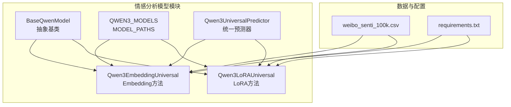
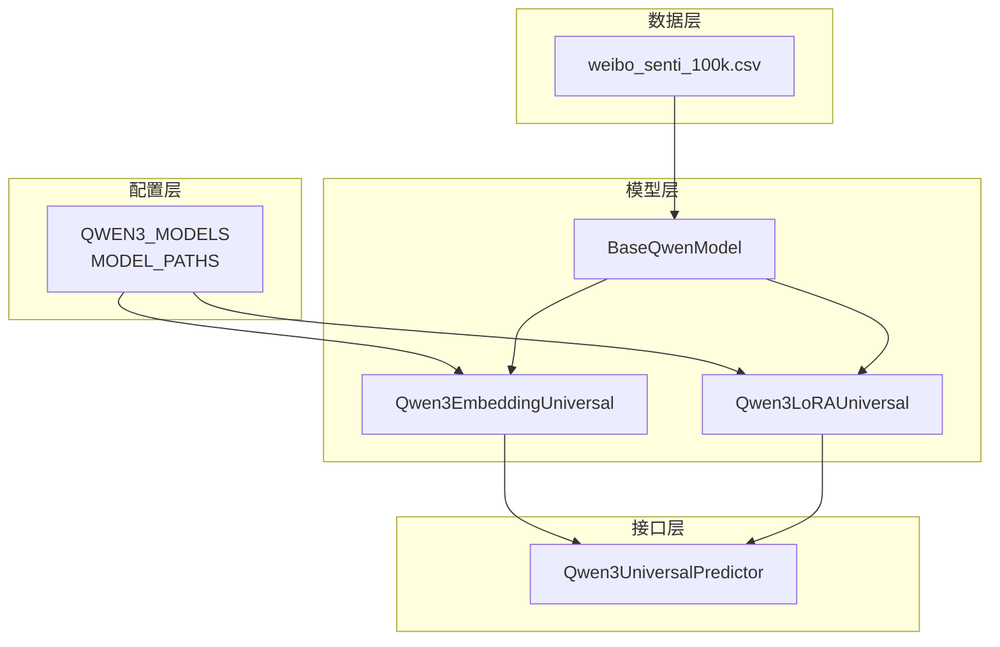
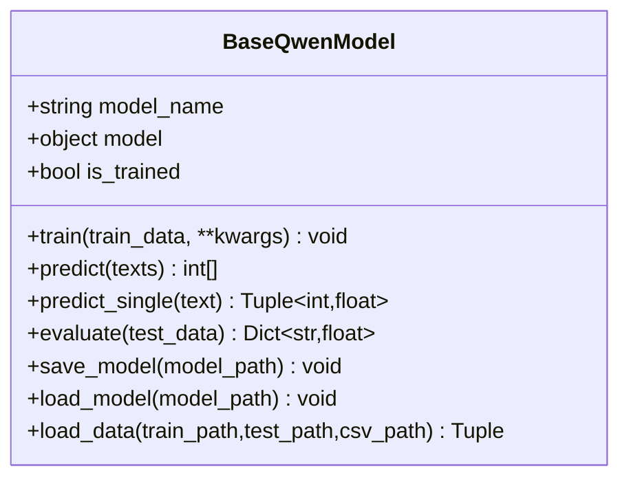
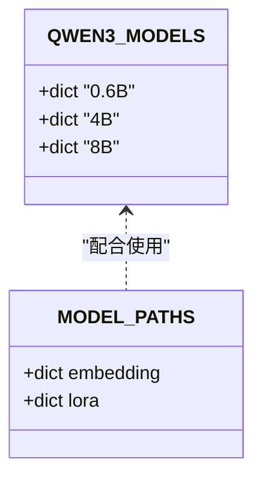
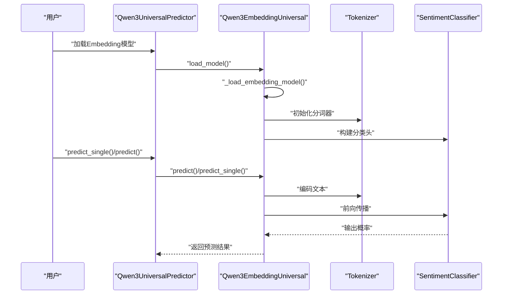
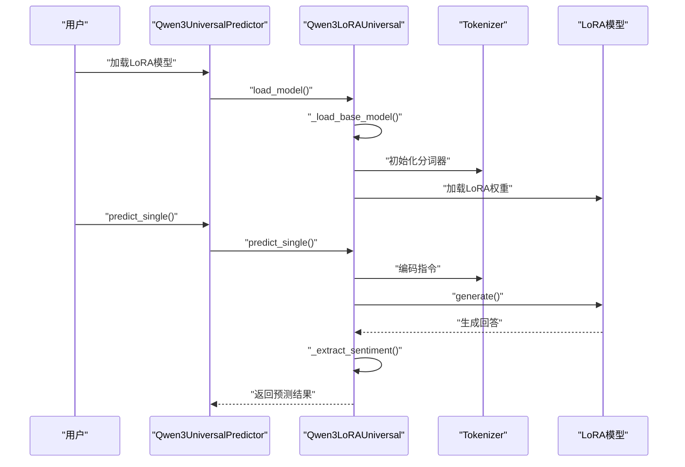
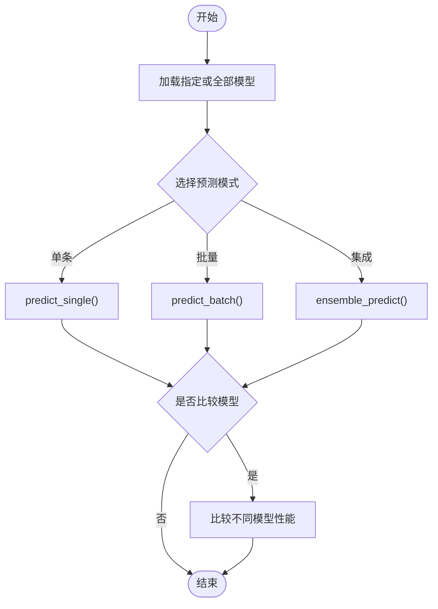
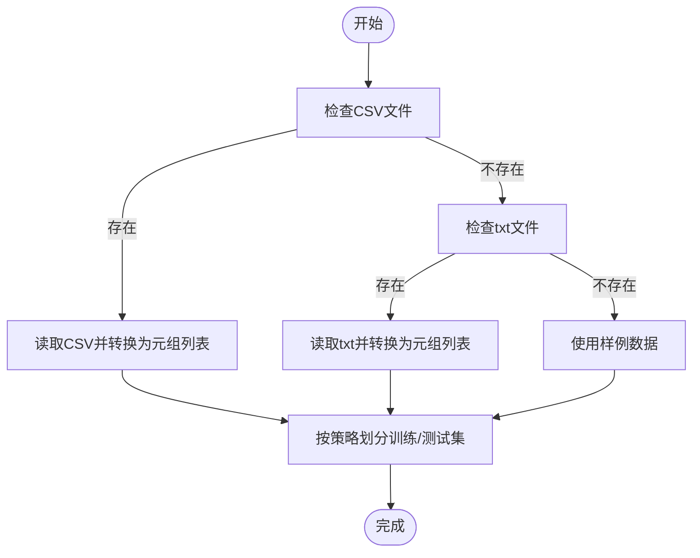
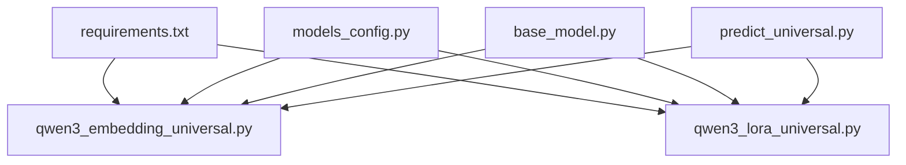

# 小型Qwen情感分析模型

<cite>
**本文档引用的文件**
- [base_model.py](file://SentimentAnalysisModel/WeiboSentiment_SmallQwen/base_model.py)
- [models_config.py](file://SentimentAnalysisModel/WeiboSentiment_SmallQwen/models_config.py)
- [predict_universal.py](file://SentimentAnalysisModel/WeiboSentiment_SmallQwen/predict_universal.py)
- [qwen3_embedding_universal.py](file://SentimentAnalysisModel/WeiboSentiment_SmallQwen/qwen3_embedding_universal.py)
- [qwen3_lora_universal.py](file://SentimentAnalysisModel/WeiboSentiment_SmallQwen/qwen3_lora_universal.py)
- [requirements.txt](file://SentimentAnalysisModel/WeiboSentiment_SmallQwen/requirements.txt)
- [weibo_senti_100k.csv](file://SentimentAnalysisModel/WeiboSentiment_SmallQwen/dataset/weibo_senti_100k.csv)
- [README.md](file://README.md)
</cite>

## 目录
1. [简介](#简介)
2. [项目结构](#项目结构)
3. [核心组件](#核心组件)
4. [架构总览](#架构总览)
5. [详细组件分析](#详细组件分析)
6. [依赖关系分析](#依赖关系分析)
7. [性能考量](#性能考量)
8. [故障排查指南](#故障排查指南)
9. [结论](#结论)
10. [附录](#附录)

## 简介
本项目围绕基于Qwen3的小型化情感分析模型，提供轻量化设计与高效推理能力。通过两种训练范式实现参数量控制与推理效率提升：
- Embedding + 分类头：冻结预训练Embedding模型，仅训练轻量分类头，显著降低显存占用与训练成本，适合资源受限场景。
- LoRA微调：在基础因果语言模型上引入低秩适配器，仅训练少量可训练参数，兼顾效果与效率，适合对精度有更高要求的场景。

项目支持0.6B、4B、8B三种规模的Qwen3模型，统一预测接口可按需加载与集成多个模型，提供批量预测、单条预测与集成预测能力。配套数据集为微博情感数据集，提供CSV与txt两种格式加载方式，并内置自动数据划分与评估流程。

## 项目结构
- SentimentAnalysisModel/WeiboSentiment_SmallQwen/
  - base_model.py：抽象基类，定义统一训练、预测、评估与模型保存/加载接口。
  - models_config.py：模型配置与路径管理，定义不同规模的模型参数、推荐超参与模型文件路径。
  - qwen3_embedding_universal.py：Embedding方法实现，包含数据集封装、分类器定义与训练/推理流程。
  - qwen3_lora_universal.py：LoRA方法实现，包含基础模型加载、指令数据构造、LoRA配置与训练/推理流程。
  - predict_universal.py：统一预测器，负责模型加载、批量/单条预测、集成预测与交互式预测。
  - dataset/weibo_senti_100k.csv：情感标注的微博数据集（CSV格式），包含review与label字段。
  - requirements.txt：运行依赖清单。

**图表来源**
- [base_model.py](file://SentimentAnalysisModel/WeiboSentiment_SmallQwen/base_model.py#L14-L171)
- [models_config.py](file://SentimentAnalysisModel/WeiboSentiment_SmallQwen/models_config.py#L7-L53)
- [qwen3_embedding_universal.py](file://SentimentAnalysisModel/WeiboSentiment_SmallQwen/qwen3_embedding_universal.py#L84-L326)
- [qwen3_lora_universal.py](file://SentimentAnalysisModel/WeiboSentiment_SmallQwen/qwen3_lora_universal.py#L28-L353)
- [predict_universal.py](file://SentimentAnalysisModel/WeiboSentiment_SmallQwen/predict_universal.py#L22-L377)
- [requirements.txt](file://SentimentAnalysisModel/WeiboSentiment_SmallQwen/requirements.txt#L1-L11)

**章节来源**
- [README.md](file://README.md#L34-L58)
- [requirements.txt](file://SentimentAnalysisModel/WeiboSentiment_SmallQwen/requirements.txt#L1-L11)

## 核心组件
- 抽象基类 BaseQwenModel
  - 统一训练、预测、评估与模型保存/加载接口，提供数据加载、模型评估与通用预测封装。
- 模型配置与路径管理 models_config
  - 定义QWEN3_MODELS（包含不同规模的基础模型、Embedding模型、嵌入维度、最大长度、推荐批大小与学习率、LoRA秩与alpha）与MODEL_PATHS（Embedding与LoRA模型文件路径）。
- Embedding方法实现 Qwen3EmbeddingUniversal
  - 冻结预训练Embedding模型，添加轻量分类头，支持训练、推理与模型保存/加载。
- LoRA方法实现 Qwen3LoRAUniversal
  - 在基础因果语言模型上添加LoRA适配器，构造指令数据，支持训练、推理与模型保存/加载。
- 统一预测器 Qwen3UniversalPredictor
  - 支持按需加载Embedding与LoRA模型，提供批量预测、单条预测与集成预测，支持交互式预测与模型比较。

**章节来源**
- [base_model.py](file://SentimentAnalysisModel/WeiboSentiment_SmallQwen/base_model.py#L14-L171)
- [models_config.py](file://SentimentAnalysisModel/WeiboSentiment_SmallQwen/models_config.py#L7-L53)
- [qwen3_embedding_universal.py](file://SentimentAnalysisModel/WeiboSentiment_SmallQwen/qwen3_embedding_universal.py#L84-L326)
- [qwen3_lora_universal.py](file://SentimentAnalysisModel/WeiboSentiment_SmallQwen/qwen3_lora_universal.py#L28-L353)
- [predict_universal.py](file://SentimentAnalysisModel/WeiboSentiment_SmallQwen/predict_universal.py#L22-L377)

## 架构总览
系统采用模块化设计，通过统一基类与配置中心实现多规模模型的统一管理。Embedding方法与LoRA方法分别对应不同的轻量化策略：
- Embedding方法：冻结Embedding，仅训练分类头，参数量小、显存占用低，适合边缘部署与快速推理。
- LoRA方法：在基础模型上引入低秩适配器，可训练参数占比低，效果更优，适合对精度有更高要求的场景。

**图表来源**
- [base_model.py](file://SentimentAnalysisModel/WeiboSentiment_SmallQwen/base_model.py#L14-L171)
- [models_config.py](file://SentimentAnalysisModel/WeiboSentiment_SmallQwen/models_config.py#L7-L53)
- [qwen3_embedding_universal.py](file://SentimentAnalysisModel/WeiboSentiment_SmallQwen/qwen3_embedding_universal.py#L84-L326)
- [qwen3_lora_universal.py](file://SentimentAnalysisModel/WeiboSentiment_SmallQwen/qwen3_lora_universal.py#L28-L353)
- [predict_universal.py](file://SentimentAnalysisModel/WeiboSentiment_SmallQwen/predict_universal.py#L22-L377)

## 详细组件分析

### 组件A：统一基类 BaseQwenModel
- 职责
  - 定义统一的训练、预测、评估与模型保存/加载接口。
  - 提供数据加载（CSV/文本）、模型评估（准确率、F1、分类报告）与单条预测封装。
- 关键点
  - 评估阶段使用sklearn指标，输出详细分类报告。
  - 数据加载支持CSV与txt两种格式，自动划分训练/测试集。
- 设计要点
  - 抽象方法强制子类实现，确保一致性。
  - 评估前检查训练状态，防止未训练模型被评估。

**图表来源**
- [base_model.py](file://SentimentAnalysisModel/WeiboSentiment_SmallQwen/base_model.py#L14-L171)

**章节来源**
- [base_model.py](file://SentimentAnalysisModel/WeiboSentiment_SmallQwen/base_model.py#L14-L171)

### 组件B：模型配置与路径管理 models_config
- 职责
  - 定义不同规模Qwen3模型的配置（基础模型、Embedding模型、嵌入维度、最大长度、推荐批大小、学习率、LoRA秩与alpha）。
  - 管理Embedding与LoRA模型文件的保存路径。
- 设计要点
  - 通过字典集中管理配置，便于扩展与维护。
  - 路径与模型规模一一对应，避免路径错误。

**图表来源**
- [models_config.py](file://SentimentAnalysisModel/WeiboSentiment_SmallQwen/models_config.py#L7-L53)

**章节来源**
- [models_config.py](file://SentimentAnalysisModel/WeiboSentiment_SmallQwen/models_config.py#L7-L53)

### 组件C：Embedding方法 Qwen3EmbeddingUniversal
- 职责
  - 加载Qwen3 Embedding模型，冻结参数，添加轻量分类头，支持训练、推理与模型保存/加载。
- 关键流程
  - 模型加载：优先本地模型，其次HuggingFace缓存，最后强制下载并保存本地。
  - 训练：使用BCE损失与Adam优化器，按批次训练分类头。
  - 推理：对输入文本分批编码，获取Embedding并通过分类头得到预测。
- 嵌入层优化策略
  - 冻结Embedding模型参数，仅训练分类头，显著降低参数量与显存占用。
  - 使用较小的隐藏维度与Dropout，进一步控制模型复杂度。

**图表来源**
- [qwen3_embedding_universal.py](file://SentimentAnalysisModel/WeiboSentiment_SmallQwen/qwen3_embedding_universal.py#L102-L326)
- [predict_universal.py](file://SentimentAnalysisModel/WeiboSentiment_SmallQwen/predict_universal.py#L32-L108)

**章节来源**
- [qwen3_embedding_universal.py](file://SentimentAnalysisModel/WeiboSentiment_SmallQwen/qwen3_embedding_universal.py#L84-L326)

### 组件D：LoRA方法 Qwen3LoRAUniversal
- 职责
  - 加载Qwen3基础模型，配置LoRA适配器，构造指令数据，支持训练、推理与模型保存/加载。
- 关键流程
  - 基础模型加载：优先本地模型，其次HuggingFace缓存，最后强制下载并保存本地。
  - LoRA配置：设置秩与alpha，冻结基础模型参数，仅训练适配器。
  - 训练：构造指令格式数据，使用Trainer进行微调，保存适配器权重。
  - 推理：构造指令，调用generate生成回答，解析情感标签。
- LoRA适配器集成
  - 通过PEFT库设置target_modules（q_proj/k_proj/v_proj/o_proj），仅训练低秩矩阵。
  - 统计可训练参数比例，便于资源规划。

**图表来源**
- [qwen3_lora_universal.py](file://SentimentAnalysisModel/WeiboSentiment_SmallQwen/qwen3_lora_universal.py#L45-L353)
- [predict_universal.py](file://SentimentAnalysisModel/WeiboSentiment_SmallQwen/predict_universal.py#L32-L108)

**章节来源**
- [qwen3_lora_universal.py](file://SentimentAnalysisModel/WeiboSentiment_SmallQwen/qwen3_lora_universal.py#L28-L353)

### 组件E：统一预测器 Qwen3UniversalPredictor
- 职责
  - 按需加载Embedding与LoRA模型，提供批量预测、单条预测与集成预测。
  - 支持交互式预测、模型比较与命令式操作。
- 关键流程
  - 模型加载：根据类型与规模查找MODEL_PATHS，加载对应模型。
  - 预测：支持指定模型或全部模型预测，集成预测通过简单平均置信度实现。
  - 交互式：提供菜单式选择与命令提示，支持切换模型与比较性能。

**图表来源**
- [predict_universal.py](file://SentimentAnalysisModel/WeiboSentiment_SmallQwen/predict_universal.py#L22-L377)

**章节来源**
- [predict_universal.py](file://SentimentAnalysisModel/WeiboSentiment_SmallQwen/predict_universal.py#L22-L377)

### 组件F：数据集与加载
- 数据集
  - weibo_senti_100k.csv：包含label与review字段，正负样本平衡，适合情感分析任务。
- 加载策略
  - 优先加载CSV，若缺失则尝试txt格式。
  - 自动划分训练/测试集，固定测试集数量或按比例划分。
  - 若均不存在，提供样例数据用于演示。

**图表来源**
- [base_model.py](file://SentimentAnalysisModel/WeiboSentiment_SmallQwen/base_model.py#L79-L171)
- [weibo_senti_100k.csv](file://SentimentAnalysisModel/WeiboSentiment_SmallQwen/dataset/weibo_senti_100k.csv#L1-L200)

**章节来源**
- [base_model.py](file://SentimentAnalysisModel/WeiboSentiment_SmallQwen/base_model.py#L79-L171)
- [weibo_senti_100k.csv](file://SentimentAnalysisModel/WeiboSentiment_SmallQwen/dataset/weibo_senti_100k.csv#L1-L200)

## 依赖关系分析
- 运行依赖
  - torch、transformers、peft、datasets、accelerate、scikit-learn、pandas、numpy、tqdm、sentence-transformers、bitsandbytes。
- 模块间耦合
  - BaseQwenModel为抽象基类，被Embedding与LoRA实现继承，确保统一接口。
  - models_config为配置中心，被Embedding与LoRA共享，避免重复配置。
  - predict_universal聚合Embedding与LoRA，提供统一预测入口。
- 外部依赖
  - HuggingFace Transformers与PEFT库用于模型加载与LoRA配置。
  - scikit-learn用于评估指标计算。

**图表来源**
- [requirements.txt](file://SentimentAnalysisModel/WeiboSentiment_SmallQwen/requirements.txt#L1-L11)
- [qwen3_embedding_universal.py](file://SentimentAnalysisModel/WeiboSentiment_SmallQwen/qwen3_embedding_universal.py#L6-L17)
- [qwen3_lora_universal.py](file://SentimentAnalysisModel/WeiboSentiment_SmallQwen/qwen3_lora_universal.py#L6-L24)
- [predict_universal.py](file://SentimentAnalysisModel/WeiboSentiment_SmallQwen/predict_universal.py#L14-L20)
- [models_config.py](file://SentimentAnalysisModel/WeiboSentiment_SmallQwen/models_config.py#L7-L53)
- [base_model.py](file://SentimentAnalysisModel/WeiboSentiment_SmallQwen/base_model.py#L5-L12)

**章节来源**
- [requirements.txt](file://SentimentAnalysisModel/WeiboSentiment_SmallQwen/requirements.txt#L1-L11)

## 性能考量
- 参数量与显存
  - Embedding方法冻结Embedding参数，仅训练分类头，参数量小、显存占用低，适合资源受限场景。
  - LoRA方法通过低秩适配器引入少量可训练参数，效果更优但显存占用相对较高。
- 推理效率
  - Embedding方法推理速度快、显存占用少，适合大规模批量推理。
  - LoRA方法推理依赖生成式解码，速度相对较慢，但可获得更稳定的分类结果。
- 超参数建议
  - models_config中提供了不同规模模型的推荐批大小与学习率，可根据硬件条件调整。
- 数据与评估
  - 数据加载自动划分训练/测试集，评估使用准确率与F1，输出详细分类报告，便于性能分析。

[本节为通用性能讨论，无需特定文件分析]

## 故障排查指南
- 模型加载失败
  - 检查MODEL_PATHS中模型路径是否存在，确认模型文件是否完整。
  - 若从HuggingFace下载失败，检查网络连接与缓存路径。
- 未训练模型评估
  - 评估前需先调用train方法，否则会抛出异常提示尚未训练。
- 数据文件缺失
  - 确认CSV或txt数据文件存在，字段命名正确（CSV需包含review与label）。
- 推理异常
  - 确认模型已加载且处于训练状态，检查输入文本编码与分词器配置。

**章节来源**
- [base_model.py](file://SentimentAnalysisModel/WeiboSentiment_SmallQwen/base_model.py#L44-L67)
- [qwen3_embedding_universal.py](file://SentimentAnalysisModel/WeiboSentiment_SmallQwen/qwen3_embedding_universal.py#L301-L325)
- [qwen3_lora_universal.py](file://SentimentAnalysisModel/WeiboSentiment_SmallQwen/qwen3_lora_universal.py#L340-L353)
- [predict_universal.py](file://SentimentAnalysisModel/WeiboSentiment_SmallQwen/predict_universal.py#L42-L66)

## 结论
本项目通过Embedding与LoRA两种轻量化策略，实现了在保持较高推理效率的同时，灵活适配不同资源与精度需求。统一基类与配置中心确保了多规模模型的可扩展性与一致性，统一预测器提供了便捷的批量与交互式预测能力。结合完善的评估与数据加载机制，开发者可快速完成训练、评估与部署全流程。

[本节为总结性内容，无需特定文件分析]

## 附录
- 适用场景
  - 资源受限环境：优先选择Embedding方法，显存占用低、推理快。
  - 对精度有更高要求：选择LoRA方法，效果更优。
- 性能权衡
  - Embedding方法：参数量小、显存占用低、推理快，适合大规模批量场景。
  - LoRA方法：参数量适中、显存占用较高、推理稍慢，适合对精度敏感场景。
- 扩展策略
  - 可新增更多规模的Qwen3模型配置，统一接入统一预测器。
  - 可引入更多轻量化技术（如量化、蒸馏）进一步优化推理效率。

[本节为通用建议，无需特定文件分析]