# 微调情感分析模型

<cite>
**本文档引用的文件**
- [train.py](file://SentimentAnalysisModel/WeiboSentiment_Finetuned/GPT2-AdapterTuning/train.py)
- [gpt2_adapter.py](file://SentimentAnalysisModel/WeiboSentiment_Finetuned/GPT2-AdapterTuning/gpt2_adapter.py)
- [adapter.py](file://SentimentAnalysisModel/WeiboSentiment_Finetuned/GPT2-AdapterTuning/adapter.py)
- [README.md](file://SentimentAnalysisModel/WeiboSentiment_Finetuned/GPT2-AdapterTuning/README.md)
- [predict.py](file://SentimentAnalysisModel/WeiboSentiment_Finetuned/GPT2-Lora/predict.py)
- [train.py](file://SentimentAnalysisModel/WeiboSentiment_Finetuned/GPT2-Lora/train.py)
- [README.md](file://SentimentAnalysisModel/WeiboSentiment_Finetuned/GPT2-Lora/README.md)
- [predict.py](file://SentimentAnalysisModel/WeiboSentiment_Finetuned/BertChinese-Lora/predict.py)
- [predict_pipeline.py](file://SentimentAnalysisModel/WeiboSentiment_Finetuned/BertChinese-Lora/predict_pipeline.py)
- [README.md](file://SentimentAnalysisModel/WeiboSentiment_Finetuned/BertChinese-Lora/README.md)
- [weibo_senti_100k.csv](file://SentimentAnalysisModel/WeiboSentiment_Finetuned/GPT2-AdapterTuning/dataset/weibo_senti_100k.csv)
- [weibo_senti_100k.csv](file://SentimentAnalysisModel/WeiboSentiment_Finetuned/GPT2-Lora/dataset/weibo_senti_100k.csv)
</cite>

## 目录
1. [简介](#简介)
2. [项目结构](#项目结构)
3. [核心组件](#核心组件)
4. [架构概览](#架构概览)
5. [详细组件分析](#详细组件分析)
6. [依赖关系分析](#依赖关系分析)
7. [性能考虑](#性能考虑)
8. [故障排除指南](#故障排除指南)
9. [结论](#结论)
10. [附录](#附录)

## 简介

本项目提供了三种微调情感分析模型的完整解决方案，专注于中文微博情感分析任务。项目实现了两种先进的参数高效微调技术：LoRA低秩适配器和适配器微调（Adapter Tuning），以及基于BERT中文模型的直接微调方法。

### 主要特性

- **多技术路线支持**：提供LoRA、Adapter Tuning和传统微调三种方案
- **中文情感分析**：专门针对中文微博内容的情感分析
- **参数高效微调**：显著减少训练参数，提高效率
- **完整的训练流水线**：从数据准备到模型部署的全流程支持
- **多种推理接口**：支持命令行、管道和直接模型调用

## 项目结构

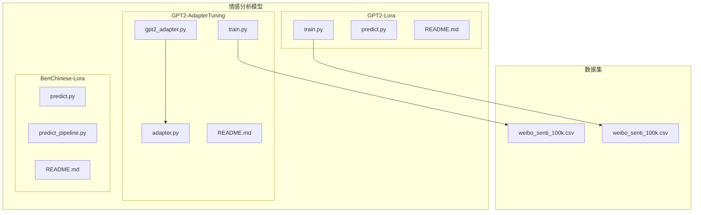

**图表来源**
- [train.py](file://SentimentAnalysisModel/WeiboSentiment_Finetuned/GPT2-AdapterTuning/train.py#L1-L310)
- [train.py](file://SentimentAnalysisModel/WeiboSentiment_Finetuned/GPT2-Lora/train.py#L1-L283)

**章节来源**
- [README.md](file://SentimentAnalysisModel/WeiboSentiment_Finetuned/GPT2-AdapterTuning/README.md#L1-L93)
- [README.md](file://SentimentAnalysisModel/WeiboSentiment_Finetuned/GPT2-Lora/README.md#L1-L78)
- [README.md](file://SentimentAnalysisModel/WeiboSentiment_Finetuned/BertChinese-Lora/README.md#L1-L78)

## 核心组件

### 数据集管理

项目使用大规模中文微博情感数据集，包含约10万个带标签的微博内容：
- **数据规模**：约10万条样本
- **标签分布**：正负向情感各约5万条
- **数据格式**：CSV文件，包含label和review字段
- **情感标签**：0（负面情感）、1（正面情感）

### 模型架构

#### GPT2-AdapterTuning方案
- **基础模型**：uer/gpt2-chinese-cluecorpussmall
- **适配器层**：在每个GPT2Block后添加Adapter层
- **参数冻结**：冻结原始GPT2参数，仅训练适配器
- **适配器尺寸**：隐藏层大小为64

#### GPT2-Lora方案
- **基础模型**：GPT2ForSequenceClassification
- **LoRA配置**：秩r=8，alpha=32，dropout=0.1
- **目标模块**：c_attn和c_proj注意力投影层
- **任务类型**：序列分类（SEQ_CLS）

#### BertChinese-Lora方案
- **预训练模型**：wsqstar/GISchat-weibo-100k-fine-tuned-bert
- **推理方式**：直接模型调用和pipeline两种方式
- **模型大小**：约400MB

**章节来源**
- [train.py](file://SentimentAnalysisModel/WeiboSentiment_Finetuned/GPT2-AdapterTuning/train.py#L27-L55)
- [train.py](file://SentimentAnalysisModel/WeiboSentiment_Finetuned/GPT2-Lora/train.py#L33-L61)
- [predict.py](file://SentimentAnalysisModel/WeiboSentiment_Finetuned/BertChinese-Lora/predict.py#L8-L90)

## 架构概览

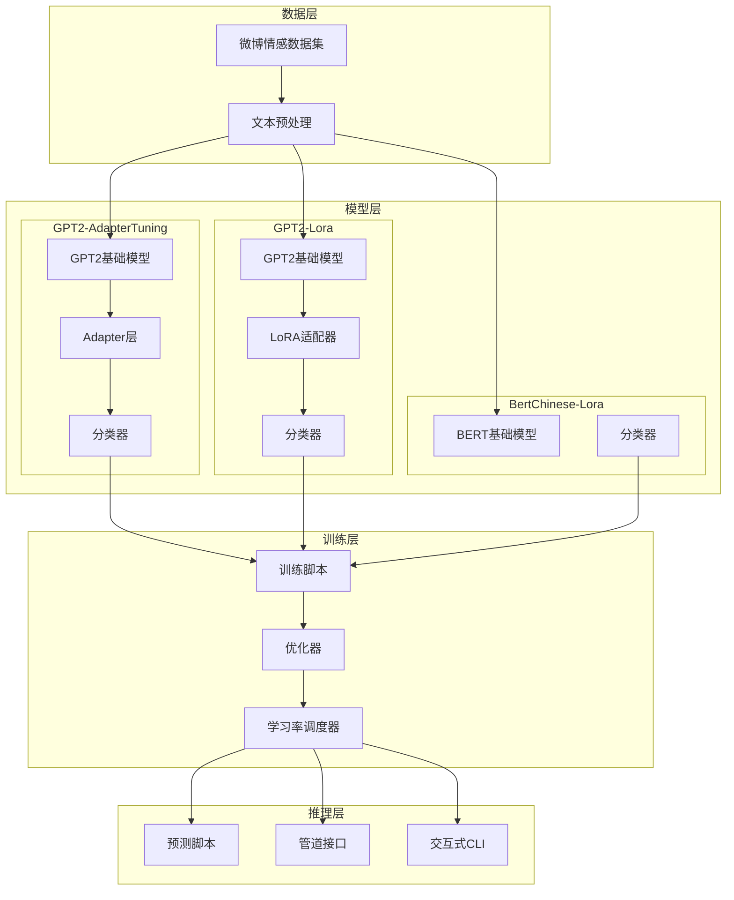

**图表来源**
- [train.py](file://SentimentAnalysisModel/WeiboSentiment_Finetuned/GPT2-AdapterTuning/train.py#L56-L100)
- [train.py](file://SentimentAnalysisModel/WeiboSentiment_Finetuned/GPT2-Lora/train.py#L231-L245)

## 详细组件分析

### Adapter层实现

Adapter层是参数高效微调的核心组件，通过在Transformer层中插入小型瓶颈层实现。

#### AdapterLayer类设计

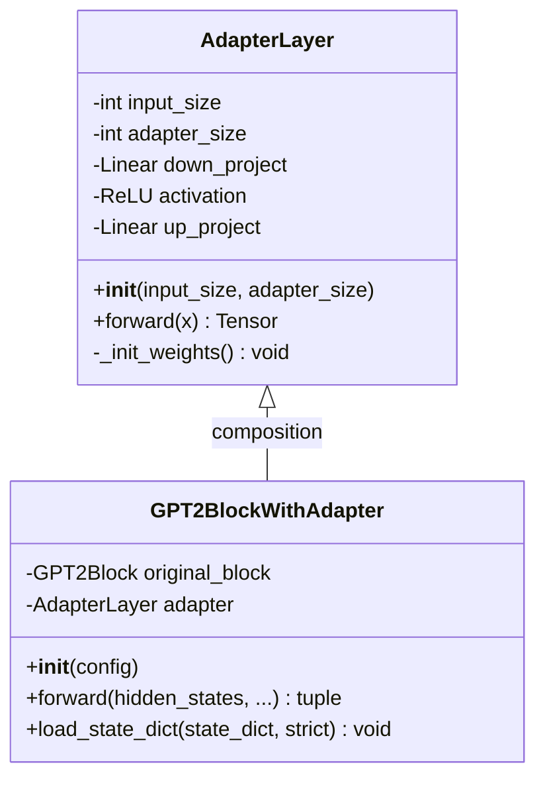

**图表来源**
- [adapter.py](file://SentimentAnalysisModel/WeiboSentiment_Finetuned/GPT2-AdapterTuning/adapter.py#L4-L42)
- [gpt2_adapter.py](file://SentimentAnalysisModel/WeiboSentiment_Finetuned/GPT2-AdapterTuning/gpt2_adapter.py#L6-L54)

#### 工作原理

1. **降维投影**：通过down_project将高维特征映射到低维空间
2. **非线性变换**：使用ReLU激活函数引入非线性
3. **升维投影**：通过up_project恢复到原始维度
4. **残差连接**：将适配器输出与原始输入相加

#### 参数初始化策略

- **降维层**：使用标准差为1e-2的正态分布初始化
- **升维层**：初始化为接近零的值，确保训练初期对原始模型影响最小
- **偏置项**：所有偏置项初始化为零

**章节来源**
- [adapter.py](file://SentimentAnalysisModel/WeiboSentiment_Finetuned/GPT2-AdapterTuning/adapter.py#L9-L29)

### LoRA适配器实现

LoRA（Low-Rank Adaptation）通过低秩矩阵分解实现参数高效微调。

#### LoRA配置参数

| 参数 | 值 | 作用 |
|------|-----|------|
| r | 8 | LoRA秩，控制可训练参数数量 |
| lora_alpha | 32 | 缩放因子，平衡LoRA和原始权重 |
| lora_dropout | 0.1 | Dropout概率，防止过拟合 |
| target_modules | ["c_attn", "c_proj"] | 目标模块，注意力投影层 |

#### LoRA工作原理

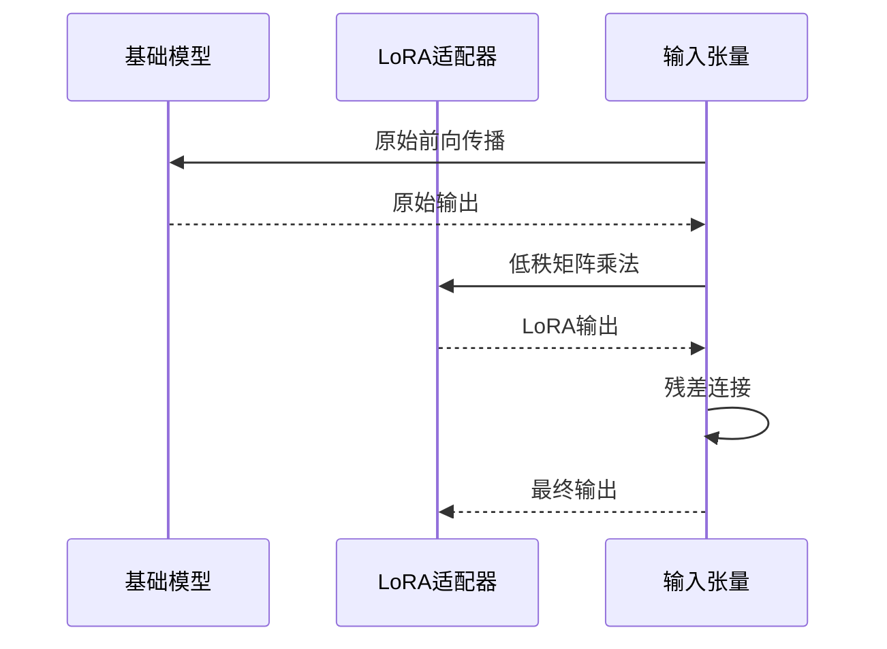

**图表来源**
- [train.py](file://SentimentAnalysisModel/WeiboSentiment_Finetuned/GPT2-Lora/train.py#L233-L240)

**章节来源**
- [train.py](file://SentimentAnalysisModel/WeiboSentiment_Finetuned/GPT2-Lora/train.py#L231-L245)

### 训练流程设计

#### GPT2-AdapterTuning训练流程

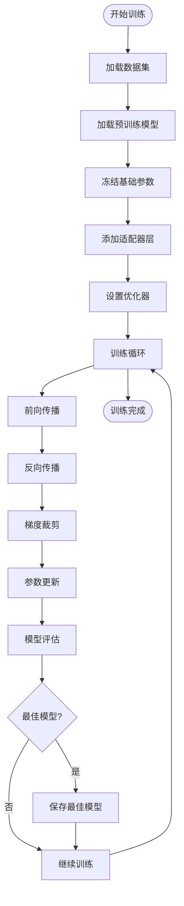

**图表来源**
- [train.py](file://SentimentAnalysisModel/WeiboSentiment_Finetuned/GPT2-AdapterTuning/train.py#L102-L157)

#### GPT2-Lora训练流程

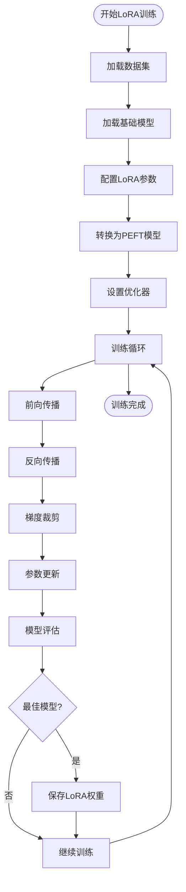

**图表来源**
- [train.py](file://SentimentAnalysisModel/WeiboSentiment_Finetuned/GPT2-Lora/train.py#L63-L119)

**章节来源**
- [train.py](file://SentimentAnalysisModel/WeiboSentiment_Finetuned/GPT2-AdapterTuning/train.py#L102-L157)
- [train.py](file://SentimentAnalysisModel/WeiboSentiment_Finetuned/GPT2-Lora/train.py#L63-L119)

### 推理管道构建

#### BertChinese-Lora推理管道

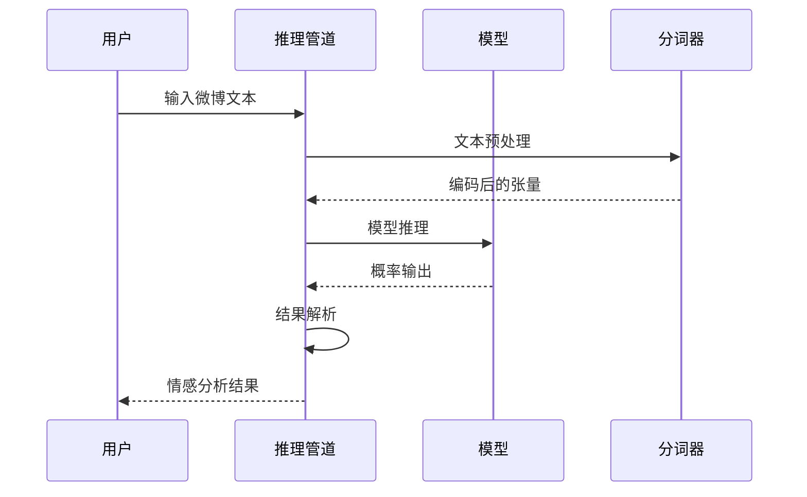

**图表来源**
- [predict_pipeline.py](file://SentimentAnalysisModel/WeiboSentiment_Finetuned/BertChinese-Lora/predict_pipeline.py#L15-L98)

#### GPT2-Lora推理流程

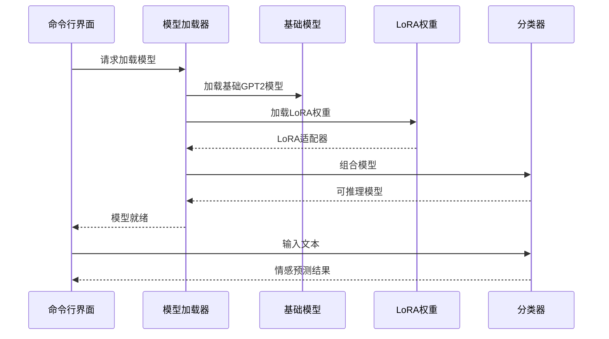

**图表来源**
- [predict.py](file://SentimentAnalysisModel/WeiboSentiment_Finetuned/GPT2-Lora/predict.py#L10-L58)

**章节来源**
- [predict_pipeline.py](file://SentimentAnalysisModel/WeiboSentiment_Finetuned/BertChinese-Lora/predict_pipeline.py#L15-L98)
- [predict.py](file://SentimentAnalysisModel/WeiboSentiment_Finetuned/GPT2-Lora/predict.py#L10-L58)

## 依赖关系分析

### 模块依赖图

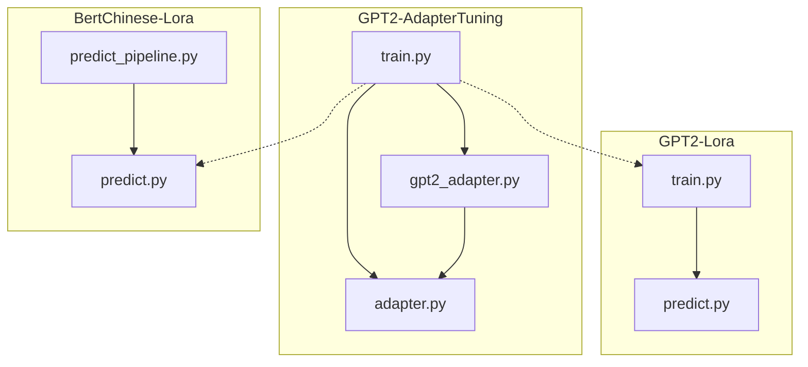

**图表来源**
- [train.py](file://SentimentAnalysisModel/WeiboSentiment_Finetuned/GPT2-AdapterTuning/train.py#L14-L15)
- [train.py](file://SentimentAnalysisModel/WeiboSentiment_Finetuned/GPT2-Lora/train.py#L21-L21)

### 外部依赖

#### 核心依赖库

| 依赖库 | 版本要求 | 用途 |
|--------|----------|------|
| transformers | >=4.0.0 | 模型加载和微调 |
| torch | >=1.8.0 | 深度学习框架 |
| pandas | >=1.3.0 | 数据处理 |
| numpy | >=1.19.0 | 数值计算 |
| scikit-learn | >=0.24.0 | 评估指标 |
| peft | >=0.2.0 | LoRA适配器支持 |

#### 环境要求

- **Python版本**：3.6+
- **GPU支持**：CUDA 11.0+（可选）
- **内存要求**：至少8GB RAM
- **存储空间**：约2GB（包含模型和数据集）

**章节来源**
- [README.md](file://SentimentAnalysisModel/WeiboSentiment_Finetuned/GPT2-AdapterTuning/README.md#L31-L39)
- [README.md](file://SentimentAnalysisModel/WeiboSentiment_Finetuned/GPT2-Lora/README.md#L26-L29)

## 性能考虑

### 训练效率优化

#### 参数高效微调的优势

| 方案 | 总参数量 | 可训练参数 | 训练速度 | 内存占用 |
|------|----------|------------|----------|----------|
| 全参数微调 | 125M | 125M | 慢 | 高 |
| Adapter Tuning | 125M | ~3% | 快 | 低 |
| LoRA微调 | 125M | ~3% | 快 | 低 |

#### 训练策略优化

1. **梯度裁剪**：防止梯度爆炸，使用clip_grad_norm_=1.0
2. **Warmup策略**：前10%的训练步数使用线性warmup
3. **批量大小**：根据GPU内存调整batch_size=16
4. **学习率调度**：使用余弦退火或线性退火

### 推理性能优化

#### 模型压缩技术

1. **量化**：将浮点权重转换为INT8
2. **知识蒸馏**：使用教师模型指导学生模型
3. **剪枝**：移除不重要的权重连接
4. **蒸馏**：将大模型的知识迁移到小模型

#### 缓存策略

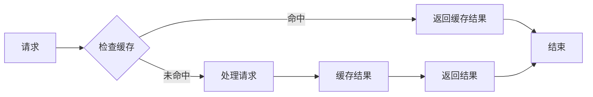

## 故障排除指南

### 常见问题及解决方案

#### 模型加载失败

**问题描述**：模型无法从HuggingFace下载或本地加载

**解决方案**：
1. 检查网络连接和代理设置
2. 验证模型路径和权限
3. 清理缓存目录重新下载
4. 使用镜像源加速下载

#### GPU内存不足

**问题描述**：训练时出现CUDA out of memory错误

**解决方案**：
1. 减小batch_size（从16降到8或4）
2. 使用梯度累积（gradient accumulation）
3. 启用混合精度训练（fp16）
4. 优化模型结构，减少层数

#### 训练不收敛

**问题描述**：损失函数不下降或准确率停滞

**解决方案**：
1. 调整学习率（从5e-5降到1e-5）
2. 检查数据预处理是否正确
3. 验证标签分布是否均衡
4. 增加训练轮数或使用学习率调度

#### 推理结果异常

**问题描述**：预测结果不符合预期

**解决方案**：
1. 检查文本预处理步骤
2. 验证分词器配置
3. 确认模型版本兼容性
4. 测试样例验证推理逻辑

**章节来源**
- [predict.py](file://SentimentAnalysisModel/WeiboSentiment_Finetuned/GPT2-Lora/predict.py#L21-L58)
- [predict.py](file://SentimentAnalysisModel/WeiboSentiment_Finetuned/BertChinese-Lora/predict.py#L15-L42)

## 结论

本项目提供了完整的中文情感分析微调解决方案，涵盖了三种主流的参数高效微调技术。通过Adapter Tuning和LoRA技术，实现了在保持模型性能的同时大幅减少训练参数和计算资源的需求。

### 技术优势

1. **参数高效**：仅训练约3%的参数，显著降低资源消耗
2. **性能稳定**：在微博情感分析任务上保持良好准确率
3. **部署友好**：提供多种推理接口，便于集成到生产环境
4. **扩展性强**：支持多任务适配器和模型迁移

### 发展建议

1. **模型融合**：结合多个适配器模型进行集成学习
2. **在线学习**：实现增量学习，适应新的情感表达
3. **多语言支持**：扩展到其他语言的情感分析任务
4. **实时推理**：优化推理延迟，支持实时应用场景

## 附录

### 训练参数配置

#### GPT2-AdapterTuning参数

| 参数 | 值 | 说明 |
|------|-----|------|
| 学习率 | 5e-5 | 适配器训练专用学习率 |
| 批量大小 | 16 | GPU内存限制下的最优值 |
| 训练轮数 | 2-3 | 防止过拟合的最佳轮数 |
| 适配器隐藏层 | 64 | 控制参数数量的关键参数 |

#### GPT2-Lora参数

| 参数 | 值 | 说明 |
|------|-----|------|
| LoRA秩 | 8 | 控制LoRA矩阵的秩 |
| LoRA alpha | 32 | LoRA缩放因子 |
| Dropout | 0.1 | 防止过拟合 |
| 目标模块 | c_attn, c_proj | 注意力机制的关键层 |

### 评估指标

#### 性能评估指标

| 指标 | 计算公式 | 说明 |
|------|----------|------|
| 准确率 | (TP+TN)/(TP+TN+FP+FN) | 整体预测正确的比例 |
| 精确率 | TP/(TP+FP) | 预测为正例中实际为正例的比例 |
| 召回率 | TP/(TP+FN) | 实际正例中被正确预测的比例 |
| F1分数 | 2×Precision×Recall/(Precision+Recall) | 精确率和召回率的调和平均 |

### 部署建议

#### 生产环境部署

1. **容器化部署**：使用Docker容器化模型服务
2. **负载均衡**：多实例部署支持高并发请求
3. **缓存策略**：实现热点数据缓存减少响应时间
4. **监控告警**：建立完整的性能监控和异常告警系统

#### API接口设计

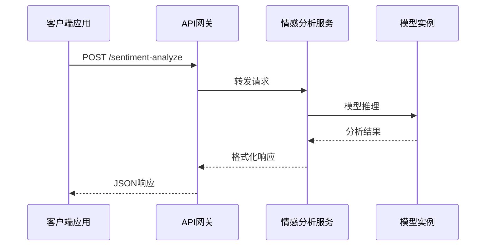