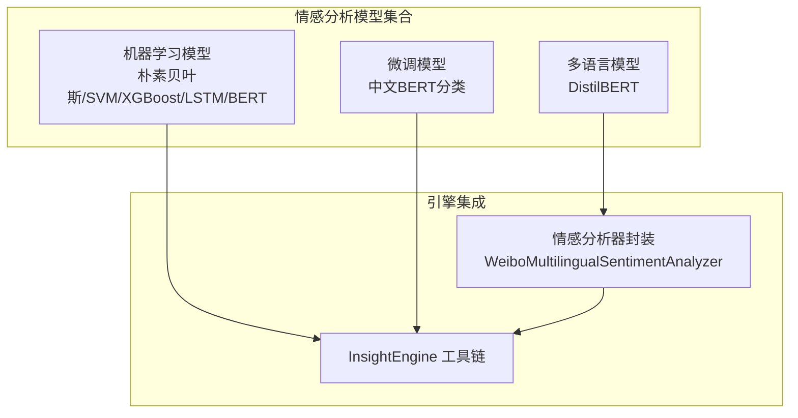
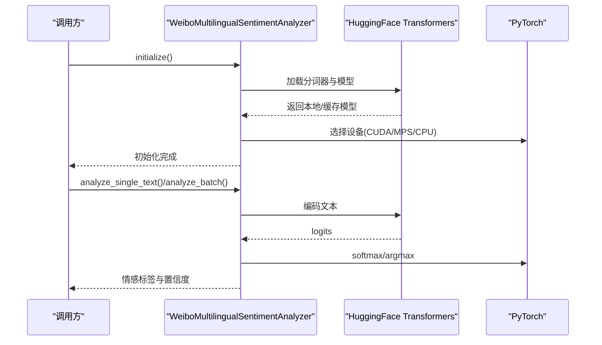
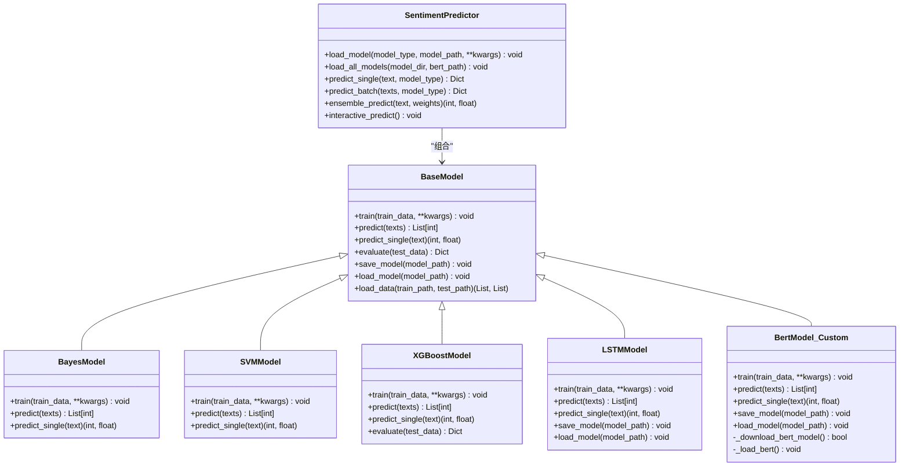
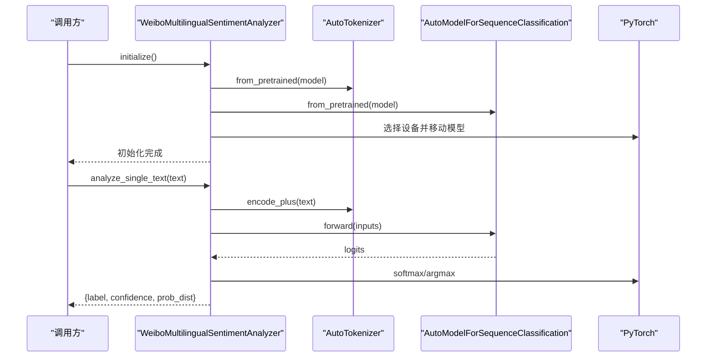
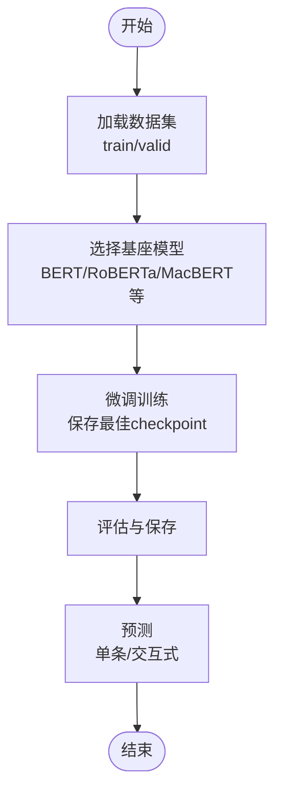
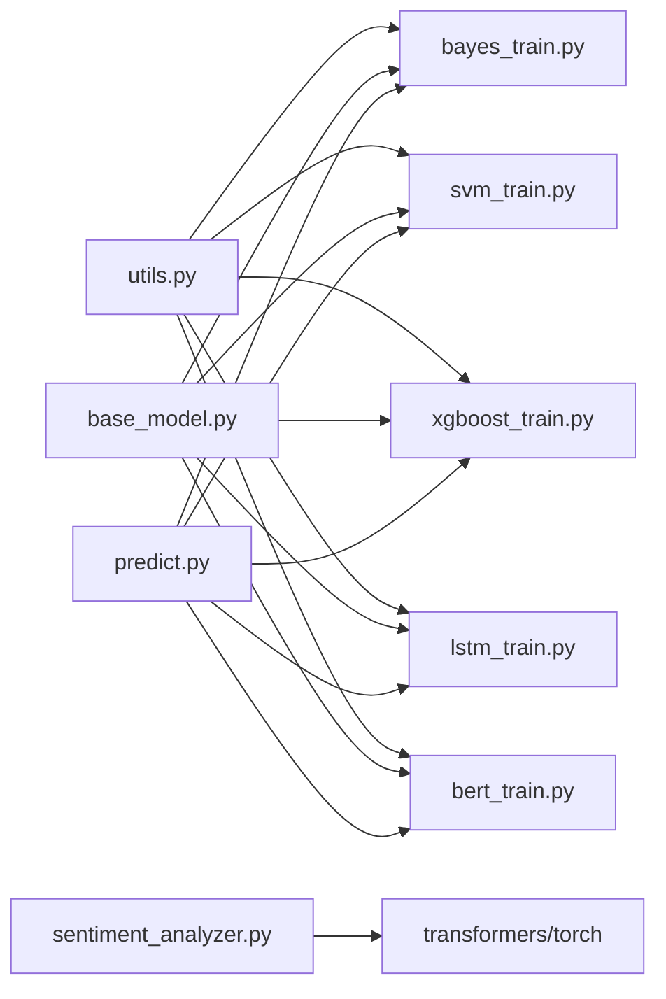

# 情感分析模型

<cite>
**本文引用的文件**
- [README.md](file://SentimentAnalysisModel/BertTopicDetection_Finetuned/README.md)
- [README.md](file://SentimentAnalysisModel/WeiboMultilingualSentiment/README.md)
- [sentiment_analyzer.py](file://InsightEngine/tools/sentiment_analyzer.py)
- [predict.py](file://SentimentAnalysisModel/WeiboSentiment_MachineLearning/predict.py)
- [base_model.py](file://SentimentAnalysisModel/WeiboSentiment_MachineLearning/base_model.py)
- [bayes_train.py](file://SentimentAnalysisModel/WeiboSentiment_MachineLearning/bayes_train.py)
- [svm_train.py](file://SentimentAnalysisModel/WeiboSentiment_MachineLearning/svm_train.py)
- [lstm_train.py](file://SentimentAnalysisModel/WeiboSentiment_MachineLearning/lstm_train.py)
- [xgboost_train.py](file://SentimentAnalysisModel/WeiboSentiment_MachineLearning/xgboost_train.py)
- [bert_train.py](file://SentimentAnalysisModel/WeiboSentiment_MachineLearning/bert_train.py)
- [utils.py](file://SentimentAnalysisModel/WeiboSentiment_MachineLearning/utils.py)
</cite>

## 目录
1. [简介](#简介)
2. [项目结构](#项目结构)
3. [核心组件](#核心组件)
4. [架构总览](#架构总览)
5. [详细组件分析](#详细组件分析)
6. [依赖关系分析](#依赖关系分析)
7. [性能考虑](#性能考虑)
8. [故障排查指南](#故障排查指南)
9. [结论](#结论)
10. [附录](#附录)

## 简介
本技术文档面向BettaFish情感分析模型集合，系统梳理并解释以下四类模型：
- 机器学习方法：朴素贝叶斯、支持向量机、XGBoost、LSTM、BERT（冻结编码器 + 分类头）
- 微调模型：基于中文BERT的微调分类器
- 多语言模型：基于DistilBERT的多语言情感分析
- 小参数模型：基于Qwen系列的小参数微调与通用嵌入方案

文档涵盖各模型的训练方法、预测流程、性能特点、配置参数、优化技巧与扩展方法，并提供模型选择指南与使用示例，帮助开发者在不同场景下高效集成与定制情感分析能力。

## 项目结构
情感分析相关代码主要分布在以下位置：
- 机器学习模型集合：SentimentAnalysisModel/WeiboSentiment_MachineLearning
- 多语言模型：SentimentAnalysisModel/WeiboMultilingualSentiment
- 微调模型（BERT话题分类）：SentimentAnalysisModel/BertTopicDetection_Finetuned
- 与引擎集成的工具：InsightEngine/tools/sentiment_analyzer.py

**图表来源**
- [predict.py](file://SentimentAnalysisModel/WeiboSentiment_MachineLearning/predict.py#L22-L310)
- [README.md](file://SentimentAnalysisModel/WeiboMultilingualSentiment/README.md#L1-L113)
- [README.md](file://SentimentAnalysisModel/BertTopicDetection_Finetuned/README.md#L1-L127)
- [sentiment_analyzer.py](file://InsightEngine/tools/sentiment_analyzer.py#L79-L632)

**章节来源**
- [predict.py](file://SentimentAnalysisModel/WeiboSentiment_MachineLearning/predict.py#L22-L310)
- [README.md](file://SentimentAnalysisModel/WeiboMultilingualSentiment/README.md#L1-L113)
- [README.md](file://SentimentAnalysisModel/BertTopicDetection_Finetuned/README.md#L1-L127)
- [sentiment_analyzer.py](file://InsightEngine/tools/sentiment_analyzer.py#L79-L632)

## 核心组件
- 机器学习模型统一入口与集成预测器：提供统一的模型加载、单/批量预测与集成投票能力
- 多语言情感分析器：封装WeiboMultilingualSentiment模型，提供初始化、单/批量预测、查询结果情感分析与模型信息查询
- 机器学习模型基类：定义统一的训练、预测、评估、保存/加载接口
- 各模型具体实现：朴素贝叶斯、SVM、XGBoost、LSTM、BERT（冻结编码器 + 分类头）
- 预处理工具：分词、清洗、停用词加载与数据读取

**章节来源**
- [predict.py](file://SentimentAnalysisModel/WeiboSentiment_MachineLearning/predict.py#L22-L310)
- [sentiment_analyzer.py](file://InsightEngine/tools/sentiment_analyzer.py#L79-L632)
- [base_model.py](file://SentimentAnalysisModel/WeiboSentiment_MachineLearning/base_model.py#L14-L120)
- [utils.py](file://SentimentAnalysisModel/WeiboSentiment_MachineLearning/utils.py#L20-L138)

## 架构总览
情感分析在系统中的集成路径如下：
- 多语言模型通过WeiboMultilingualSentimentAnalyzer封装，自动下载/缓存模型，选择最优设备（CUDA/MPS/CPU），提供单/批量预测与查询结果情感分析
- 机器学习模型通过统一预测器加载并预测，支持集成投票
- 微调模型（中文BERT话题分类）提供独立训练与预测脚本

**图表来源**
- [sentiment_analyzer.py](file://InsightEngine/tools/sentiment_analyzer.py#L158-L241)
- [sentiment_analyzer.py](file://InsightEngine/tools/sentiment_analyzer.py#L261-L355)

**章节来源**
- [sentiment_analyzer.py](file://InsightEngine/tools/sentiment_analyzer.py#L79-L632)

## 详细组件分析

### 机器学习模型集合（统一预测器）
- 统一入口：支持加载朴素贝叶斯、SVM、XGBoost、LSTM、BERT五类模型
- 预处理：提供通用文本清洗与分词
- 预测：支持单条与批量预测，支持集成投票
- 交互模式：提供交互式预测界面

**图表来源**
- [base_model.py](file://SentimentAnalysisModel/WeiboSentiment_MachineLearning/base_model.py#L14-L120)
- [bayes_train.py](file://SentimentAnalysisModel/WeiboSentiment_MachineLearning/bayes_train.py#L16-L95)
- [svm_train.py](file://SentimentAnalysisModel/WeiboSentiment_MachineLearning/svm_train.py#L16-L100)
- [xgboost_train.py](file://SentimentAnalysisModel/WeiboSentiment_MachineLearning/xgboost_train.py#L17-L128)
- [lstm_train.py](file://SentimentAnalysisModel/WeiboSentiment_MachineLearning/lstm_train.py#L82-L229)
- [bert_train.py](file://SentimentAnalysisModel/WeiboSentiment_MachineLearning/bert_train.py#L54-L327)
- [predict.py](file://SentimentAnalysisModel/WeiboSentiment_MachineLearning/predict.py#L22-L189)

**章节来源**
- [predict.py](file://SentimentAnalysisModel/WeiboSentiment_MachineLearning/predict.py#L22-L310)
- [base_model.py](file://SentimentAnalysisModel/WeiboSentiment_MachineLearning/base_model.py#L14-L120)
- [bayes_train.py](file://SentimentAnalysisModel/WeiboSentiment_MachineLearning/bayes_train.py#L16-L155)
- [svm_train.py](file://SentimentAnalysisModel/WeiboSentiment_MachineLearning/svm_train.py#L16-L166)
- [xgboost_train.py](file://SentimentAnalysisModel/WeiboSentiment_MachineLearning/xgboost_train.py#L17-L233)
- [lstm_train.py](file://SentimentAnalysisModel/WeiboSentiment_MachineLearning/lstm_train.py#L82-L352)
- [bert_train.py](file://SentimentAnalysisModel/WeiboSentiment_MachineLearning/bert_train.py#L54-L413)
- [utils.py](file://SentimentAnalysisModel/WeiboSentiment_MachineLearning/utils.py#L20-L138)

### 多语言情感分析器（WeiboMultilingualSentimentAnalyzer）
- 功能：封装多语言情感分析模型，自动下载/缓存，设备选择（CUDA/MPS/CPU），单/批量预测，查询结果情感分析
- 输出：情感标签（5级）、置信度、概率分布、统计摘要
- 集成点：InsightEngine工具链

**图表来源**
- [sentiment_analyzer.py](file://InsightEngine/tools/sentiment_analyzer.py#L158-L241)
- [sentiment_analyzer.py](file://InsightEngine/tools/sentiment_analyzer.py#L261-L355)

**章节来源**
- [sentiment_analyzer.py](file://InsightEngine/tools/sentiment_analyzer.py#L79-L632)
- [README.md](file://SentimentAnalysisModel/WeiboMultilingualSentiment/README.md#L1-L113)

### 微调模型（中文BERT话题分类）
- 基于中文BERT的微调分类器，支持训练、评估、保存/加载、预测
- 训练策略：学习率、warmup、早停、checkpoint保存、多基座模型选择
- 预测：支持单条与交互式预测

**图表来源**
- [README.md](file://SentimentAnalysisModel/BertTopicDetection_Finetuned/README.md#L47-L114)

**章节来源**
- [README.md](file://SentimentAnalysisModel/BertTopicDetection_Finetuned/README.md#L1-L127)

### 小参数模型（Qwen系列）
- 说明：提供基于Qwen系列的小参数微调与通用嵌入方案，适合资源受限场景
- 适用：快速部署、低资源消耗、通用情感理解
- 建议：结合业务数据进行轻量微调，平衡性能与资源占用

（本节为概念性说明，不直接分析具体源码）

## 依赖关系分析
- 机器学习模型依赖sklearn、xgboost、torch、gensim等
- 多语言模型依赖transformers、torch
- 微调模型依赖transformers、torch
- 预处理依赖jieba、正则表达式

**图表来源**
- [utils.py](file://SentimentAnalysisModel/WeiboSentiment_MachineLearning/utils.py#L1-L138)
- [base_model.py](file://SentimentAnalysisModel/WeiboSentiment_MachineLearning/base_model.py#L1-L120)
- [bayes_train.py](file://SentimentAnalysisModel/WeiboSentiment_MachineLearning/bayes_train.py#L1-L155)
- [svm_train.py](file://SentimentAnalysisModel/WeiboSentiment_MachineLearning/svm_train.py#L1-L166)
- [xgboost_train.py](file://SentimentAnalysisModel/WeiboSentiment_MachineLearning/xgboost_train.py#L1-L233)
- [lstm_train.py](file://SentimentAnalysisModel/WeiboSentiment_MachineLearning/lstm_train.py#L1-L352)
- [bert_train.py](file://SentimentAnalysisModel/WeiboSentiment_MachineLearning/bert_train.py#L1-L413)
- [predict.py](file://SentimentAnalysisModel/WeiboSentiment_MachineLearning/predict.py#L1-L310)
- [sentiment_analyzer.py](file://InsightEngine/tools/sentiment_analyzer.py#L1-L704)

**章节来源**
- [predict.py](file://SentimentAnalysisModel/WeiboSentiment_MachineLearning/predict.py#L1-L310)
- [sentiment_analyzer.py](file://InsightEngine/tools/sentiment_analyzer.py#L1-L704)
- [utils.py](file://SentimentAnalysisModel/WeiboSentiment_MachineLearning/utils.py#L1-L138)

## 性能考虑
- 设备选择：优先使用CUDA，其次MPS，最后CPU；多语言模型在GPU上推理速度更快
- 批处理：合理设置batch size，避免显存溢出；LSTM/XGBoost等模型注意内存占用
- 特征工程：朴素贝叶斯/SVM使用CountVectorizer/TfidfVectorizer，XGBoost限制max_features以控制特征空间
- 模型冻结：BERT分类器仅训练分类头，冻结BERT参数可显著节省显存与时间
- 预处理：统一清洗规则，减少噪声；LSTM需要分词序列，BERT直接使用原生分词器
- 集成预测：多模型投票可提升稳定性，但会增加推理时间

（本节提供通用指导，不直接分析具体文件）

## 故障排查指南
- 依赖缺失：确认已安装torch、transformers、scikit-learn、xgboost、gensim等
- 模型下载失败：多语言模型首次运行需联网下载，检查网络或手动下载至本地model目录
- 设备不可用：若CUDA/MPS不可用，自动降级到CPU；检查驱动与版本兼容性
- 文本为空或格式异常：预处理阶段会清洗特殊字符与表情，确保输入非空且符合预期
- 模型未初始化：调用analyze_single_text/analyze_batch前需先initialize()

**章节来源**
- [sentiment_analyzer.py](file://InsightEngine/tools/sentiment_analyzer.py#L103-L140)
- [sentiment_analyzer.py](file://InsightEngine/tools/sentiment_analyzer.py#L180-L241)
- [utils.py](file://SentimentAnalysisModel/WeiboSentiment_MachineLearning/utils.py#L116-L138)

## 结论
BettaFish情感分析模型集合覆盖从传统机器学习到现代预训练模型的完整谱系，既能满足多语言与低成本部署需求，也能在中文场景下提供强大的微调能力。通过统一的预测器与封装好的分析器，开发者可快速在InsightEngine中集成情感分析能力，并根据任务需求灵活选择模型与优化策略。

## 附录

### 模型选择指南
- 多语言场景：优先WeiboMultilingualSentiment，支持22种语言，5级情感分类
- 中文场景：BERT微调分类器具备更强语义理解能力，适合高精度要求
- 资源受限：小参数模型（Qwen系列）适合边缘或低资源环境
- 快速原型：朴素贝叶斯/SVM/XGBoost适合快速验证与基准对比
- 实时性要求高：LSTM/BERT分类头可配合batch优化与设备选择

（本节为概念性总结，不直接分析具体文件）