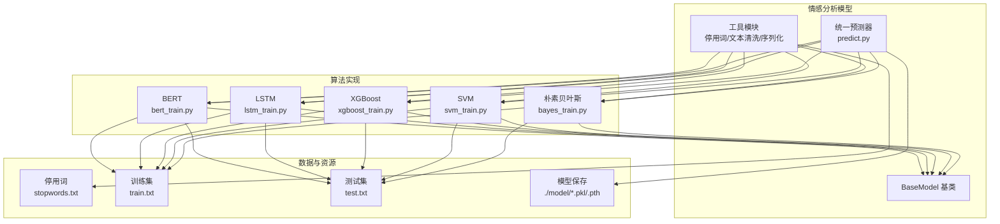
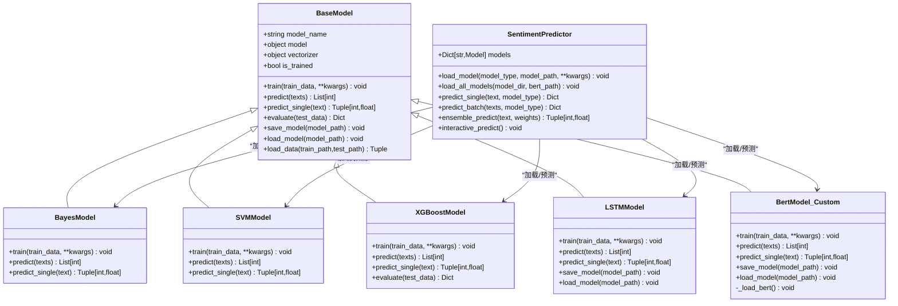
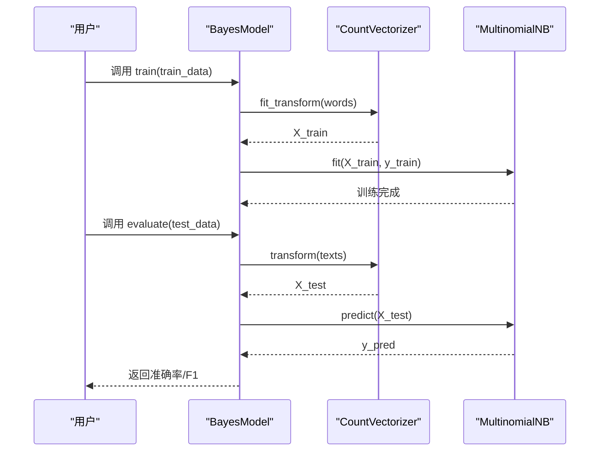
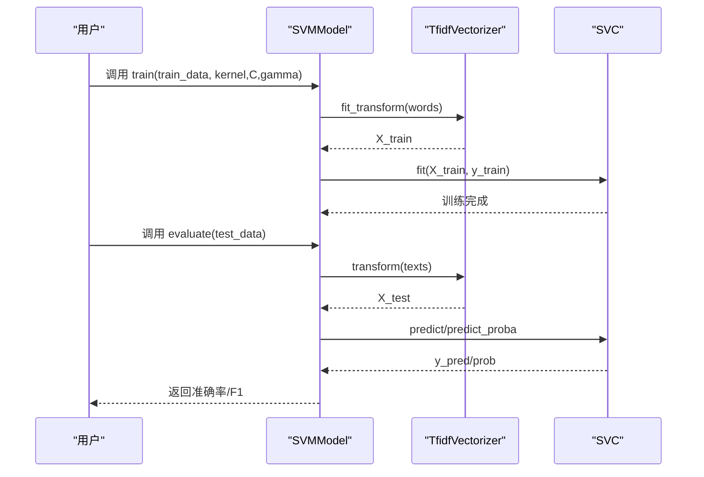
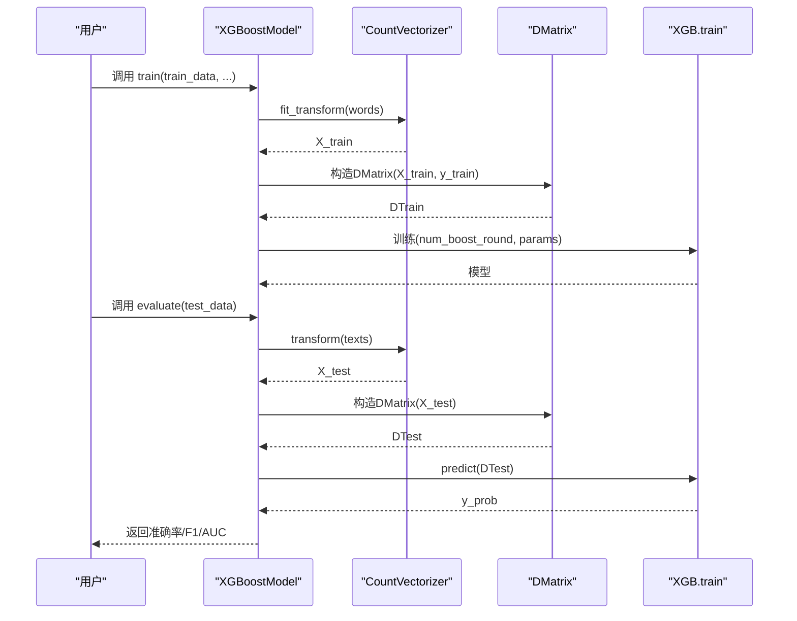
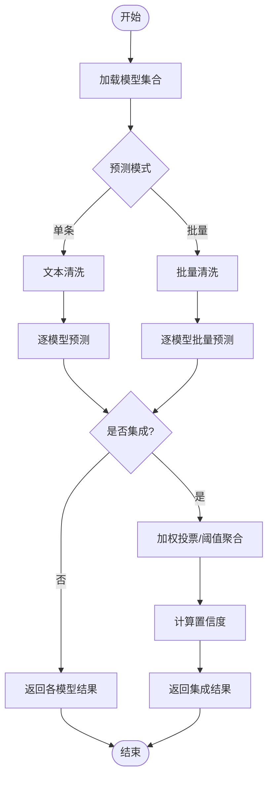
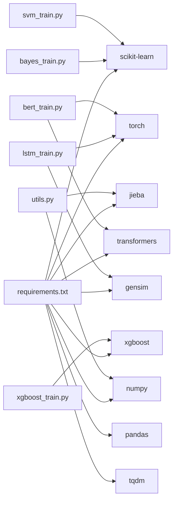

# 机器学习情感分析模型

<cite>
**本文引用的文件**
- [base_model.py](file://SentimentAnalysisModel/WeiboSentiment_MachineLearning/base_model.py)
- [utils.py](file://SentimentAnalysisModel/WeiboSentiment_MachineLearning/utils.py)
- [predict.py](file://SentimentAnalysisModel/WeiboSentiment_MachineLearning/predict.py)
- [bayes_train.py](file://SentimentAnalysisModel/WeiboSentiment_MachineLearning/bayes_train.py)
- [svm_train.py](file://SentimentAnalysisModel/WeiboSentiment_MachineLearning/svm_train.py)
- [xgboost_train.py](file://SentimentAnalysisModel/WeiboSentiment_MachineLearning/xgboost_train.py)
- [lstm_train.py](file://SentimentAnalysisModel/WeiboSentiment_MachineLearning/lstm_train.py)
- [bert_train.py](file://SentimentAnalysisModel/WeiboSentiment_MachineLearning/bert_train.py)
- [requirements.txt](file://SentimentAnalysisModel/WeiboSentiment_MachineLearning/requirements.txt)
- [stopwords.txt](file://SentimentAnalysisModel/WeiboSentiment_MachineLearning/data/stopwords.txt)
- [train.txt](file://SentimentAnalysisModel/WeiboSentiment_MachineLearning/data/weibo2018/train.txt)
- [test.txt](file://SentimentAnalysisModel/WeiboSentiment_MachineLearning/data/weibo2018/test.txt)
</cite>

## 目录
1. [简介](#简介)
2. [项目结构](#项目结构)
3. [核心组件](#核心组件)
4. [架构总览](#架构总览)
5. [详细组件分析](#详细组件分析)
6. [依赖分析](#依赖分析)
7. [性能考虑](#性能考虑)
8. [故障排查指南](#故障排查指南)
9. [结论](#结论)
10. [附录](#附录)

## 简介
本技术文档面向基于朴素贝叶斯、LSTM、SVM与XGBoost的传统机器学习方法在微博情感分析中的应用，系统梳理数据预处理、特征工程、模型训练与评估、预测流程、模型保存与加载，并提供模型选择与调优建议。文档同时覆盖统一预测器的设计与多模型集成策略，帮助开发者快速落地与扩展。

## 项目结构
WeiboSentiment_MachineLearning 目录包含统一的基类、工具函数、各算法训练脚本以及统一预测入口。数据与模型文件位于 data 与 model 目录中，训练脚本通过命令行参数指定数据路径与模型保存路径。



图表来源
- [base_model.py](file://SentimentAnalysisModel/WeiboSentiment_MachineLearning/base_model.py#L14-L120)
- [utils.py](file://SentimentAnalysisModel/WeiboSentiment_MachineLearning/utils.py#L1-L138)
- [predict.py](file://SentimentAnalysisModel/WeiboSentiment_MachineLearning/predict.py#L22-L310)
- [bayes_train.py](file://SentimentAnalysisModel/WeiboSentiment_MachineLearning/bayes_train.py#L16-L155)
- [svm_train.py](file://SentimentAnalysisModel/WeiboSentiment_MachineLearning/svm_train.py#L16-L166)
- [xgboost_train.py](file://SentimentAnalysisModel/WeiboSentiment_MachineLearning/xgboost_train.py#L17-L233)
- [lstm_train.py](file://SentimentAnalysisModel/WeiboSentiment_MachineLearning/lstm_train.py#L82-L352)
- [bert_train.py](file://SentimentAnalysisModel/WeiboSentiment_MachineLearning/bert_train.py#L54-L413)

章节来源
- [base_model.py](file://SentimentAnalysisModel/WeiboSentiment_MachineLearning/base_model.py#L14-L120)
- [utils.py](file://SentimentAnalysisModel/WeiboSentiment_MachineLearning/utils.py#L1-L138)
- [predict.py](file://SentimentAnalysisModel/WeiboSentiment_MachineLearning/predict.py#L22-L310)

## 核心组件
- 基类 BaseModel：定义统一的训练、预测、评估、保存与加载接口，确保各算法实现一致性。
- 工具模块 utils：停用词加载、文本清洗与分词、通用序列化/反序列化。
- 统一预测器 predict：集中管理多模型加载、批量/单条预测、集成预测与交互式预测。

章节来源
- [base_model.py](file://SentimentAnalysisModel/WeiboSentiment_MachineLearning/base_model.py#L14-L120)
- [utils.py](file://SentimentAnalysisModel/WeiboSentiment_MachineLearning/utils.py#L9-L138)
- [predict.py](file://SentimentAnalysisModel/WeiboSentiment_MachineLearning/predict.py#L22-L310)

## 架构总览
统一预测器通过工厂式映射加载不同模型，支持单模型与多模型并行预测，并提供集成投票策略。各算法模型继承 BaseModel，复用统一的评估与持久化能力。



图表来源
- [base_model.py](file://SentimentAnalysisModel/WeiboSentiment_MachineLearning/base_model.py#L14-L120)
- [bayes_train.py](file://SentimentAnalysisModel/WeiboSentiment_MachineLearning/bayes_train.py#L16-L155)
- [svm_train.py](file://SentimentAnalysisModel/WeiboSentiment_MachineLearning/svm_train.py#L16-L166)
- [xgboost_train.py](file://SentimentAnalysisModel/WeiboSentiment_MachineLearning/xgboost_train.py#L17-L233)
- [lstm_train.py](file://SentimentAnalysisModel/WeiboSentiment_MachineLearning/lstm_train.py#L82-L352)
- [bert_train.py](file://SentimentAnalysisModel/WeiboSentiment_MachineLearning/bert_train.py#L54-L413)
- [predict.py](file://SentimentAnalysisModel/WeiboSentiment_MachineLearning/predict.py#L22-L310)

## 详细组件分析

### 朴素贝叶斯模型（Naive Bayes）
- 模型原理：基于词袋模型统计词频，使用多项式朴素贝叶斯进行分类。
- 特征工程：CountVectorizer + 停用词过滤 + 中文分词（jieba）。
- 训练流程：加载数据 → 构建词袋 → 训练 MultinomialNB → 评估 → 保存。
- 预测流程：向量化 → 预测标签与置信度。
- 性能特点：训练快、可解释性强、适合中小规模文本；对长距离依赖弱。



图表来源
- [bayes_train.py](file://SentimentAnalysisModel/WeiboSentiment_MachineLearning/bayes_train.py#L22-L95)
- [base_model.py](file://SentimentAnalysisModel/WeiboSentiment_MachineLearning/base_model.py#L45-L68)

章节来源
- [bayes_train.py](file://SentimentAnalysisModel/WeiboSentiment_MachineLearning/bayes_train.py#L16-L155)

### SVM模型
- 模型原理：支持向量机，使用TF-IDF特征与核函数（linear/poly/rbf/sigmoid）。
- 特征工程：TfidfVectorizer + 停用词过滤 + 中文分词。
- 训练流程：加载数据 → TF-IDF向量 → SVC（概率开关开启） → 评估 → 保存。
- 预测流程：向量化 → 预测标签与概率置信度。
- 性能特点：在中等规模数据上表现稳定，需合理选择核函数与正则化参数。



图表来源
- [svm_train.py](file://SentimentAnalysisModel/WeiboSentiment_MachineLearning/svm_train.py#L22-L100)
- [base_model.py](file://SentimentAnalysisModel/WeiboSentiment_MachineLearning/base_model.py#L45-L68)

章节来源
- [svm_train.py](file://SentimentAnalysisModel/WeiboSentiment_MachineLearning/svm_train.py#L16-L166)

### XGBoost模型
- 模型原理：梯度提升决策树，使用词袋特征与DMatrix加速。
- 特征工程：CountVectorizer（可限制最大特征数）+ 停用词过滤。
- 训练流程：加载数据 → 词袋向量 → DMatrix → 训练XGBoost → 评估（含AUC）→ 保存。
- 预测流程：向量化 → DMatrix → 预测概率 → 阈值0.5转类别。
- 性能特点：高精度、可解释特征重要性，需调参（深度、学习率、迭代轮数）。



图表来源
- [xgboost_train.py](file://SentimentAnalysisModel/WeiboSentiment_MachineLearning/xgboost_train.py#L23-L158)

章节来源
- [xgboost_train.py](file://SentimentAnalysisModel/WeiboSentiment_MachineLearning/xgboost_train.py#L17-L233)

### LSTM模型
- 模型原理：双向LSTM + 全连接层，使用Word2Vec词向量初始化。
- 特征工程：分词后查找词向量，序列填充与打包；训练时可增量保存。
- 训练流程：加载数据 → Word2Vec训练 → 构造LSTMDataset → DataLoader → LSTMNet → 训练循环 → 评估 → 保存（含Word2Vec）。
- 预测流程：将文本映射到词向量序列 → 前向传播 → Sigmoid → 阈值0.5。
- 性能特点：对上下文敏感，适合长文本；训练成本较高，需GPU加速。

```mermaid
sequenceDiagram
participant U as "用户"
participant LSTM as "LSTMModel"
participant WV as "Word2Vec"
participant DS as "LSTMDataset"
participant DL as "DataLoader"
participant NET as "LSTMNet"
participant OPT as "Adam"
U->>LSTM : 调用 train(train_data, ...)
LSTM->>WV : 训练Word2Vec
WV-->>LSTM : 词向量模型
LSTM->>DS : 构造数据集
DS-->>LSTM : (X,y)
LSTM->>DL : DataLoader
DL-->>LSTM : 批数据
LSTM->>NET : 前向传播
NET-->>LSTM : 输出
LSTM->>OPT : 反向传播与优化
OPT-->>LSTM : 更新权重
LSTM-->>U : 训练完成/保存
```

图表来源
- [lstm_train.py](file://SentimentAnalysisModel/WeiboSentiment_MachineLearning/lstm_train.py#L111-L278)

章节来源
- [lstm_train.py](file://SentimentAnalysisModel/WeiboSentiment_MachineLearning/lstm_train.py#L82-L352)

### BERT模型
- 模型原理：冻结BERT编码器，添加可训练分类器（全连接+Sigmoid）。
- 特征工程：分词器编码，取[CLS]向量作为句子表示。
- 训练流程：自动下载/加载BERT → 冻结参数 → 分类器训练 → 学习率衰减 → 评估 → 保存。
- 预测流程：分词 → BERT编码 → 分类器 → Sigmoid → 阈值0.5。
- 性能特点：高精度，依赖高质量预训练模型；对显存要求高。

```mermaid
sequenceDiagram
participant U as "用户"
participant BERT as "BertModel_Custom"
participant TK as "BertTokenizer"
participant BM as "BertModel"
participant CLS as "BertClassifier"
participant OPT as "Adam"
U->>BERT : 调用 train(train_data, ...)
BERT->>TK : 加载分词器
BERT->>BM : 加载BERT模型
BM-->>BERT : 冻结参数
BERT->>CLS : 初始化分类器
loop 训练循环
U->>BERT : 批数据
BERT->>TK : tokenize(words)
TK-->>BERT : input_ids/attention_mask
BERT->>BM : 编码[CLS]
BM-->>BERT : 句向量
BERT->>CLS : 分类器前向
CLS-->>BERT : 输出
BERT->>OPT : 反向传播
OPT-->>BERT : 更新分类器
end
BERT-->>U : 训练完成/保存
```

图表来源
- [bert_train.py](file://SentimentAnalysisModel/WeiboSentiment_MachineLearning/bert_train.py#L139-L327)

章节来源
- [bert_train.py](file://SentimentAnalysisModel/WeiboSentiment_MachineLearning/bert_train.py#L54-L413)

### 统一预测器与集成策略
- 多模型加载：支持按类型或批量加载模型，BERT需指定预训练模型路径。
- 单条/批量预测：统一文本清洗后调用各模型预测。
- 集成预测：对多模型输出进行加权投票，阈值0.5确定类别与置信度。
- 交互式预测：命令行交互，支持查看已加载模型、集成预测等。



图表来源
- [predict.py](file://SentimentAnalysisModel/WeiboSentiment_MachineLearning/predict.py#L88-L188)

章节来源
- [predict.py](file://SentimentAnalysisModel/WeiboSentiment_MachineLearning/predict.py#L22-L310)

## 依赖分析
- Python依赖：jieba、torch、scikit-learn、xgboost、transformers、gensim、pandas、numpy、tqdm。
- 数据依赖：停用词文件、训练/测试文本文件。
- 模型依赖：各算法模型保存为pickle或torch权重文件。



图表来源
- [requirements.txt](file://SentimentAnalysisModel/WeiboSentiment_MachineLearning/requirements.txt#L1-L9)
- [utils.py](file://SentimentAnalysisModel/WeiboSentiment_MachineLearning/utils.py#L1-L138)
- [bayes_train.py](file://SentimentAnalysisModel/WeiboSentiment_MachineLearning/bayes_train.py#L1-L155)
- [svm_train.py](file://SentimentAnalysisModel/WeiboSentiment_MachineLearning/svm_train.py#L1-L166)
- [xgboost_train.py](file://SentimentAnalysisModel/WeiboSentiment_MachineLearning/xgboost_train.py#L1-L233)
- [lstm_train.py](file://SentimentAnalysisModel/WeiboSentiment_MachineLearning/lstm_train.py#L1-L352)
- [bert_train.py](file://SentimentAnalysisModel/WeiboSentiment_MachineLearning/bert_train.py#L1-L413)

章节来源
- [requirements.txt](file://SentimentAnalysisModel/WeiboSentiment_MachineLearning/requirements.txt#L1-L9)

## 性能考虑
- 特征工程
  - 朴素贝叶斯/SVM/XGBoost：优先使用TF-IDF或词袋+停用词，控制特征维度过大导致的稀疏与过拟合。
  - LSTM/BERT：依赖高质量词向量与分词；BERT建议使用中文预训练模型并冻结参数以节省显存。
- 训练效率
  - 朴素贝叶斯/SVM/XGBoost：线性/树模型训练快，适合快速迭代与参数搜索。
  - LSTM/BERT：需GPU加速；可采用小批量、学习率衰减、早停策略。
- 评估指标
  - 基础：准确率、F1；XGBoost增加AUC；BERT/LSTM可结合AUC与混淆矩阵。
- 资源与部署
  - 模型保存：统一使用pickle或torch保存；BERT/LSTM需保存额外配置与词向量。
  - 预测吞吐：批量预测、缓存常用向量、模型量化（BERT可考虑推理框架）。

## 故障排查指南
- 模型未训练即保存/加载
  - 现象：抛出未训练错误。
  - 处理：先调用 train，再调用 save_model/load_model。
- 模型文件不存在
  - 现象：加载模型时报错。
  - 处理：确认 model_path 是否正确，或使用默认 ./model/ 模式。
- BERT模型加载失败
  - 现象：本地模型缺失或网络不可用。
  - 处理：检查模型目录是否存在；若失败，参考代码提示手动下载或使用在线模型。
- 停用词文件缺失
  - 现象：打印警告并继续运行。
  - 处理：提供完整 stopwords.txt 或忽略停用词。
- 预测结果异常
  - 现象：置信度恒为0或类别固定。
  - 处理：确认文本清洗逻辑、分词质量与模型是否正确加载。

章节来源
- [base_model.py](file://SentimentAnalysisModel/WeiboSentiment_MachineLearning/base_model.py#L70-L108)
- [utils.py](file://SentimentAnalysisModel/WeiboSentiment_MachineLearning/utils.py#L9-L18)
- [bert_train.py](file://SentimentAnalysisModel/WeiboSentiment_MachineLearning/bert_train.py#L65-L138)
- [predict.py](file://SentimentAnalysisModel/WeiboSentiment_MachineLearning/predict.py#L46-L66)

## 结论
本项目提供了从数据预处理、特征工程到多算法训练与统一预测的完整链路。朴素贝叶斯与SVM适合中小规模任务与快速验证；XGBoost在平衡精度与效率上有优势；LSTM与BERT在长文本与上下文敏感场景表现更佳。通过统一基类与预测器，开发者可便捷切换与集成模型，并基于集成策略进一步提升稳定性与鲁棒性。

## 附录
- 数据格式
  - 训练/测试文件每行格式包含：标识、标签、内容（逗号分隔），标签为0/1。
  - 停用词文件为UTF-8文本，逐行一个停用词。
- 命令行参数
  - 各训练脚本支持指定训练/测试路径、模型保存路径、评估模式与算法特定参数。
- 模型保存路径
  - 默认保存在 ./model/ 目录，文件名包含算法类型与模型后缀（.pkl 或 .pth）。

章节来源
- [train.txt](file://SentimentAnalysisModel/WeiboSentiment_MachineLearning/data/weibo2018/train.txt#L1-L200)
- [test.txt](file://SentimentAnalysisModel/WeiboSentiment_MachineLearning/data/weibo2018/test.txt#L1-L200)
- [stopwords.txt](file://SentimentAnalysisModel/WeiboSentiment_MachineLearning/data/stopwords.txt#L1-L28)
- [bayes_train.py](file://SentimentAnalysisModel/WeiboSentiment_MachineLearning/bayes_train.py#L97-L155)
- [svm_train.py](file://SentimentAnalysisModel/WeiboSentiment_MachineLearning/svm_train.py#L102-L166)
- [xgboost_train.py](file://SentimentAnalysisModel/WeiboSentiment_MachineLearning/xgboost_train.py#L161-L233)
- [lstm_train.py](file://SentimentAnalysisModel/WeiboSentiment_MachineLearning/lstm_train.py#L280-L352)
- [bert_train.py](file://SentimentAnalysisModel/WeiboSentiment_MachineLearning/bert_train.py#L342-L413)