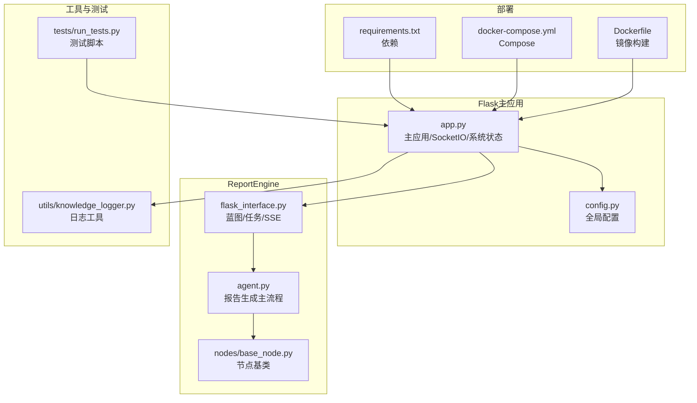
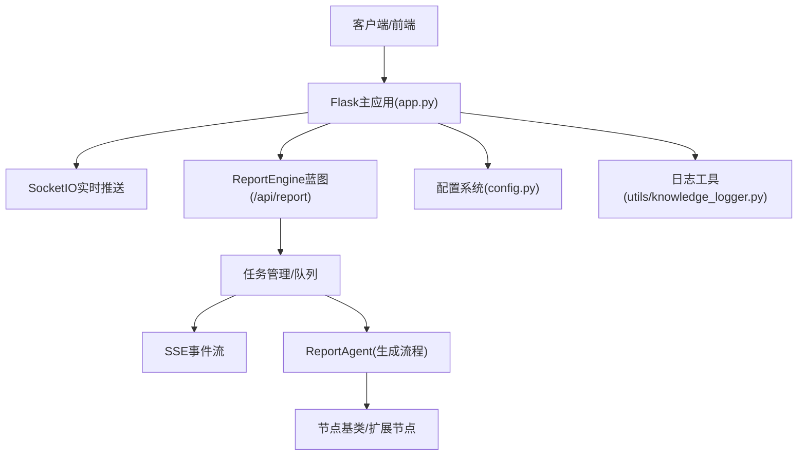
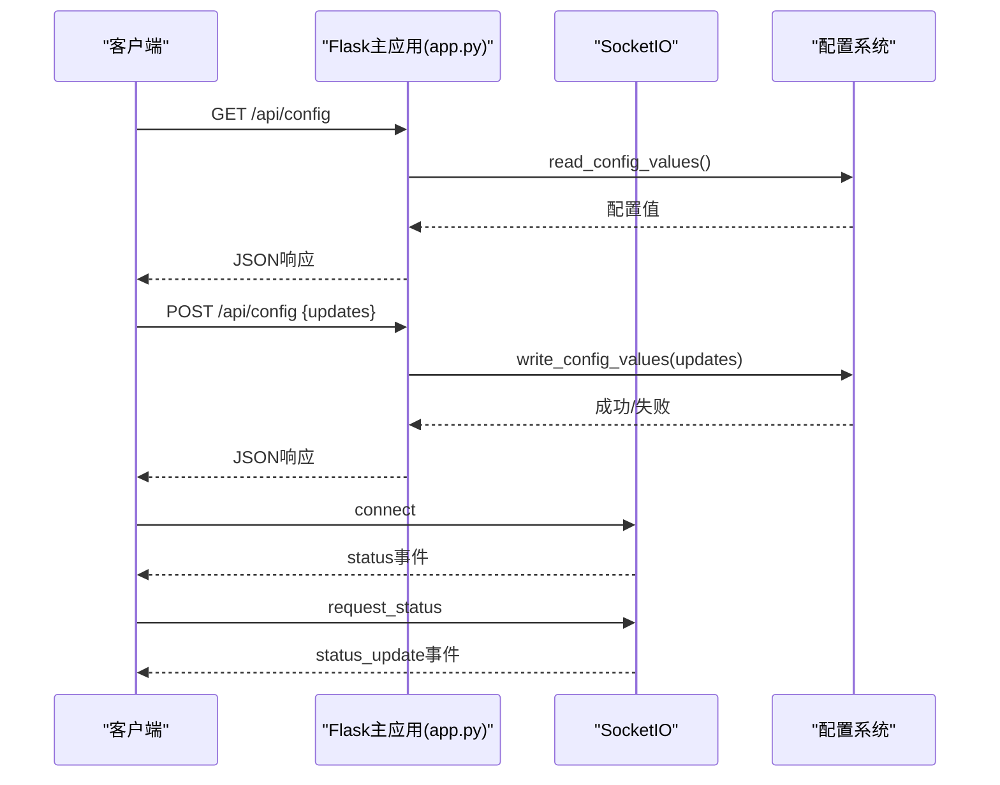
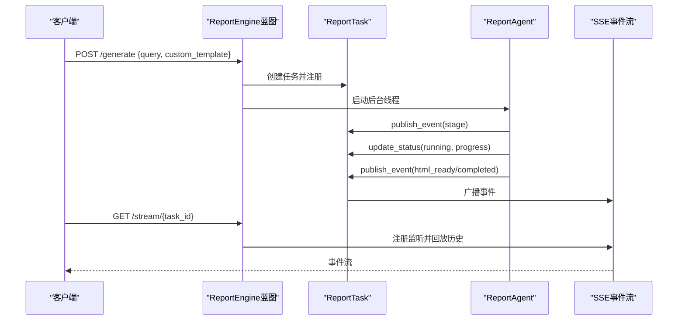
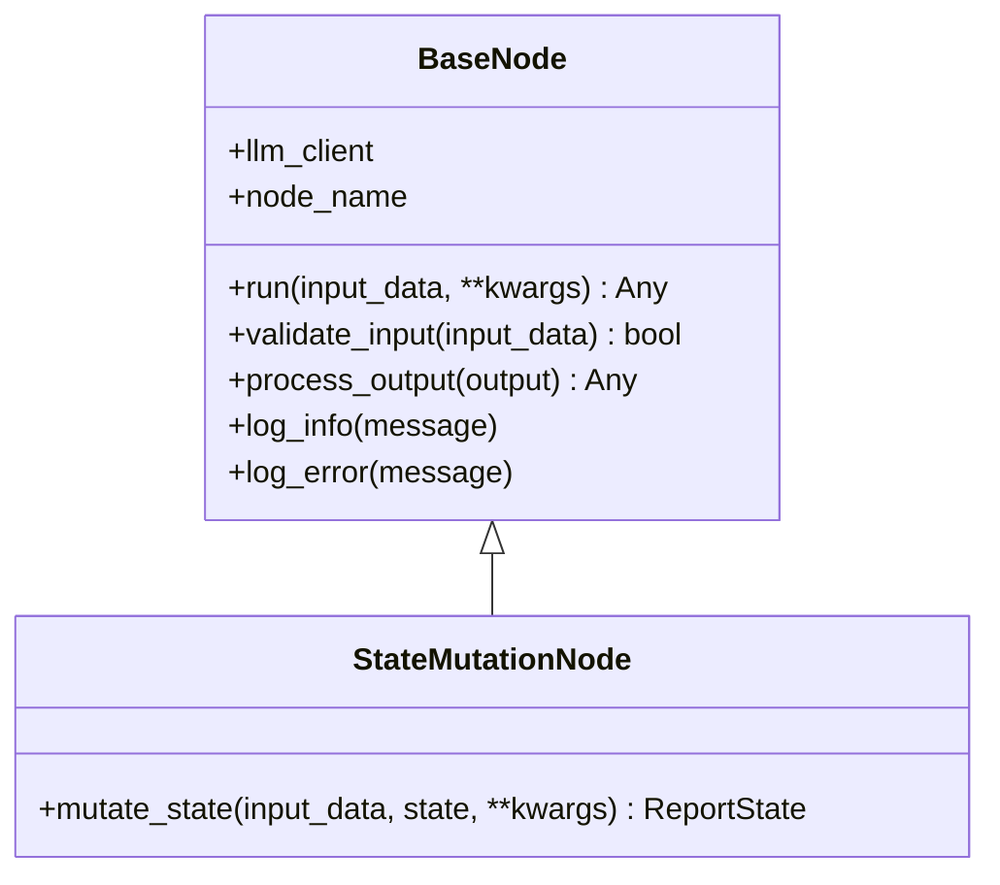
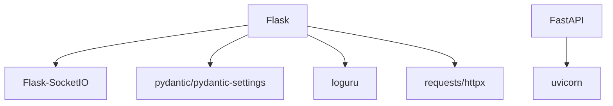

# API扩展开发

<cite>
**本文档引用的文件**
- [app.py](file://app.py)
- [config.py](file://config.py)
- [ReportEngine/flask_interface.py](file://ReportEngine/flask_interface.py)
- [ReportEngine/agent.py](file://ReportEngine/agent.py)
- [ReportEngine/nodes/base_node.py](file://ReportEngine/nodes/base_node.py)
- [requirements.txt](file://requirements.txt)
- [README.md](file://README.md)
- [docker-compose.yml](file://docker-compose.yml)
- [Dockerfile](file://Dockerfile)
- [utils/knowledge_logger.py](file://utils/knowledge_logger.py)
- [tests/run_tests.py](file://tests/run_tests.py)
</cite>

## 目录
1. [简介](#简介)
2. [项目结构](#项目结构)
3. [核心组件](#核心组件)
4. [架构总览](#架构总览)
5. [详细组件分析](#详细组件分析)
6. [依赖分析](#依赖分析)
7. [性能考虑](#性能考虑)
8. [故障排除指南](#故障排除指南)
9. [结论](#结论)
10. [附录](#附录)

## 简介
本指南面向BettaFish系统的API扩展开发，围绕Flask应用扩展、RESTful API端点扩展、WebSocket接口开发与ReportEngine的SSE流式接口进行系统化说明。内容涵盖：
- 如何在现有Flask应用中添加新的RESTful端点
- 如何实现业务逻辑与请求响应处理
- WebSocket与SocketIO的集成与事件推送
- 报告生成引擎的SSE流式接口与任务管理
- 认证授权、跨域处理与API版本管理建议
- 开发规范、测试方法与文档生成工具使用

## 项目结构
BettaFish采用Flask主应用统一调度多个Streamlit子应用，并通过Blueprint向外部暴露ReportEngine接口。核心文件与职责如下：
- app.py：Flask主应用、SocketIO集成、系统状态管理、配置读写、Streamlit应用生命周期管理
- config.py：全局配置（Pydantic Settings），集中管理LLM、数据库、搜索等配置
- ReportEngine/flask_interface.py：ReportEngine的Flask蓝图，提供状态查询、任务提交、SSE流式推送
- ReportEngine/agent.py：报告生成主流程，负责模板选择、章节生成、IR装订与渲染
- ReportEngine/nodes/base_node.py：节点基类，统一日志、输入校验与状态变更接口
- utils/knowledge_logger.py：知识图谱查询日志工具，统一日志格式与并发安全
- tests/run_tests.py：测试运行脚本，演示测试组织方式
- requirements.txt、docker-compose.yml、Dockerfile：依赖与容器化部署

**图表来源**
- [app.py](file://app.py#L1-L120)
- [config.py](file://config.py#L1-L136)
- [ReportEngine/flask_interface.py](file://ReportEngine/flask_interface.py#L1-L120)
- [ReportEngine/agent.py](file://ReportEngine/agent.py#L1-L120)
- [ReportEngine/nodes/base_node.py](file://ReportEngine/nodes/base_node.py#L1-L108)
- [utils/knowledge_logger.py](file://utils/knowledge_logger.py#L1-L96)
- [tests/run_tests.py](file://tests/run_tests.py#L1-L62)
- [requirements.txt](file://requirements.txt#L1-L91)
- [docker-compose.yml](file://docker-compose.yml#L1-L40)
- [Dockerfile](file://Dockerfile#L44-L77)

**章节来源**
- [README.md](file://README.md#L118-L297)
- [app.py](file://app.py#L1-L120)
- [config.py](file://config.py#L1-L136)

## 核心组件
- Flask主应用与SocketIO
  - 主应用负责系统状态管理、Streamlit子应用生命周期、配置读写与日志输出
  - SocketIO用于实时事件推送（如论坛日志、控制台输出）
- ReportEngine蓝图
  - 提供状态查询、任务提交、进度查询、SSE流式事件推送
  - 任务队列与历史事件缓存，支持断线重连
- 节点基类
  - 统一日志、输入校验与状态变更接口，便于扩展新节点
- 配置系统
  - Pydantic Settings集中管理配置，支持.env与环境变量自动加载

**章节来源**
- [app.py](file://app.py#L1212-L1243)
- [ReportEngine/flask_interface.py](file://ReportEngine/flask_interface.py#L578-L748)
- [ReportEngine/nodes/base_node.py](file://ReportEngine/nodes/base_node.py#L13-L108)
- [config.py](file://config.py#L23-L136)

## 架构总览
BettaFish的API扩展主要围绕Flask主应用与Blueprint展开。ReportEngine通过蓝图注册到/api/report前缀，提供完整的报告生成生命周期管理。

**图表来源**
- [app.py](file://app.py#L41-L84)
- [ReportEngine/flask_interface.py](file://ReportEngine/flask_interface.py#L26-L84)
- [ReportEngine/agent.py](file://ReportEngine/agent.py#L190-L200)
- [ReportEngine/nodes/base_node.py](file://ReportEngine/nodes/base_node.py#L13-L33)
- [config.py](file://config.py#L23-L136)
- [utils/knowledge_logger.py](file://utils/knowledge_logger.py#L60-L96)

## 详细组件分析

### Flask主应用扩展（RESTful API与SocketIO）
- 添加RESTful端点
  - 在app.py中使用@app.route装饰器定义新路由
  - 使用request.get_json()获取请求体，使用jsonify()返回JSON响应
  - 使用logger记录异常与调试信息
- WebSocket与SocketIO
  - 使用socketio.on装饰器处理客户端事件
  - 使用emit()向客户端推送实时事件
  - 使用cors_allowed_origins="*"允许跨域，生产环境建议限定具体域名
- 配置读写
  - 通过read_config_values()与write_config_values()读取与持久化配置
  - CONFIG_KEYS定义可暴露与更新的配置项

**图表来源**
- [app.py](file://app.py#L1212-L1243)
- [app.py](file://app.py#L1604-L1620)
- [config.py](file://config.py#L23-L136)

**章节来源**
- [app.py](file://app.py#L1212-L1243)
- [app.py](file://app.py#L1604-L1620)
- [config.py](file://config.py#L23-L136)

### ReportEngine蓝图扩展（SSE流式接口）
- 任务生命周期
  - 状态查询：/status
  - 任务提交：/generate（POST，返回task_id与SSE地址）
  - 进度查询：/progress/<task_id>
  - 流式事件：/stream/<task_id>（SSE）
- 事件模型
  - 任务状态事件（status）、阶段事件（stage）、警告事件（warning）、错误事件（error）、完成事件（completed）
  - 日志事件（log）通过loguru钩子转发至SSE
- 任务管理
  - ReportTask类维护任务状态、进度、事件历史与文件路径
  - 任务历史上限与心跳保活，支持Last-Event-ID断线重连

**图表来源**
- [ReportEngine/flask_interface.py](file://ReportEngine/flask_interface.py#L578-L748)
- [ReportEngine/flask_interface.py](file://ReportEngine/flask_interface.py#L750-L848)
- [ReportEngine/agent.py](file://ReportEngine/agent.py#L190-L200)

**章节来源**
- [ReportEngine/flask_interface.py](file://ReportEngine/flask_interface.py#L578-L748)
- [ReportEngine/flask_interface.py](file://ReportEngine/flask_interface.py#L750-L848)
- [ReportEngine/agent.py](file://ReportEngine/agent.py#L190-L200)

### 节点基类与扩展（设计模式）
- BaseNode
  - 统一LLM客户端注入、日志前缀、输入校验与输出处理
  - 适合扩展新的推理节点（如搜索、格式化、总结等）
- StateMutationNode
  - 适用于需要直接修改ReportState的节点

**图表来源**
- [ReportEngine/nodes/base_node.py](file://ReportEngine/nodes/base_node.py#L13-L108)

**章节来源**
- [ReportEngine/nodes/base_node.py](file://ReportEngine/nodes/base_node.py#L13-L108)

### 日志与错误处理
- 日志工具
  - knowledge_logger提供统一的日志格式与并发安全写入
  - 支持文本截断与记录压缩，避免日志过大
- 错误处理
  - Flask端点使用try/except捕获异常并返回JSON错误响应
  - SSE事件中包含错误事件（error）与警告事件（warning），便于前端展示

**章节来源**
- [utils/knowledge_logger.py](file://utils/knowledge_logger.py#L60-L96)
- [ReportEngine/flask_interface.py](file://ReportEngine/flask_interface.py#L564-L572)

## 依赖分析
- 核心依赖
  - Flask、Flask-SocketIO、eventlet：Web框架与WebSocket支持
  - Pydantic、pydantic-settings：配置管理
  - loguru：结构化日志
  - requests、httpx：HTTP请求
  - fastapi、uvicorn：可选的FastAPI服务（用于扩展其他服务）
- 部署与容器化
  - docker-compose.yml定义服务端口映射与卷挂载
  - Dockerfile使用uv安装依赖并预装Playwright浏览器

**图表来源**
- [requirements.txt](file://requirements.txt#L6-L91)
- [docker-compose.yml](file://docker-compose.yml#L1-L40)
- [Dockerfile](file://Dockerfile#L44-L77)

**章节来源**
- [requirements.txt](file://requirements.txt#L6-L91)
- [docker-compose.yml](file://docker-compose.yml#L1-L40)
- [Dockerfile](file://Dockerfile#L44-L77)

## 性能考虑
- SSE与事件队列
  - 使用有界deque缓存最近事件，避免内存无限增长
  - 心跳与空闲超时控制，防止孤儿连接占用资源
- 并发与线程安全
  - 任务锁与监听者列表的并发保护，避免竞态条件
  - 日志写入使用锁，确保多线程安全
- 资源清理
  - 任务完成后自动注销监听者，清理历史任务
  - 断线检测与异常吞吐，避免日志刷屏

**章节来源**
- [ReportEngine/flask_interface.py](file://ReportEngine/flask_interface.py#L34-L46)
- [ReportEngine/flask_interface.py](file://ReportEngine/flask_interface.py#L180-L195)
- [utils/knowledge_logger.py](file://utils/knowledge_logger.py#L20-L21)

## 故障排除指南
- 配置读写失败
  - 检查.env文件路径与权限，确认键名在CONFIG_KEYS中
  - 使用read_config_values()与write_config_values()进行调试
- SSE连接断开
  - 检查Last-Event-ID是否正确传递
  - 确认任务状态为running/pending，避免在completed后仍尝试订阅
- SocketIO连接异常
  - 生产环境建议限制cors_allowed_origins，避免跨域问题
  - 检查eventlet补丁是否生效，关注客户端主动断开的异常日志
- 日志过大或日志缺失
  - 使用knowledge_logger的截断与压缩功能
  - 确保日志文件存在且可写

**章节来源**
- [app.py](file://app.py#L1212-L1243)
- [ReportEngine/flask_interface.py](file://ReportEngine/flask_interface.py#L750-L848)
- [utils/knowledge_logger.py](file://utils/knowledge_logger.py#L60-L96)

## 结论
通过本指南，开发者可以在BettaFish系统中：
- 基于Flask主应用扩展新的RESTful端点与SocketIO事件
- 借助ReportEngine蓝图实现任务驱动的SSE流式接口
- 通过节点基类快速扩展新的推理节点
- 遵循配置管理、日志与错误处理的最佳实践
- 在容器化环境中稳定部署与运维

## 附录

### API扩展示例（步骤说明）
- 在Flask主应用中添加端点
  - 使用@app.route定义新路由，使用request.get_json()解析请求体
  - 使用jsonify()返回响应，必要时使用logger记录异常
  - 示例参考：配置读取与更新端点
- 在ReportEngine蓝图中添加端点
  - 定义蓝图路由，复用任务管理与SSE机制
  - 通过publish_event()推送事件，前端通过SSE监听
- WebSocket集成
  - 使用socketio.on装饰器处理客户端事件
  - 使用emit()推送实时事件，注意跨域配置

**章节来源**
- [app.py](file://app.py#L1212-L1243)
- [ReportEngine/flask_interface.py](file://ReportEngine/flask_interface.py#L578-L748)
- [app.py](file://app.py#L1604-L1620)

### 开发规范与测试
- 开发规范
  - 使用Pydantic Settings管理配置，统一键名与默认值
  - 使用loguru记录结构化日志，避免print调试
  - 对外响应统一使用JSON，错误响应包含明确的错误信息
- 测试方法
  - 使用tests/run_tests.py组织测试用例
  - 可参考TestLogMonitor的测试组织方式

**章节来源**
- [config.py](file://config.py#L23-L136)
- [tests/run_tests.py](file://tests/run_tests.py#L1-L62)

### 文档生成工具
- 本项目未包含专用的API文档生成工具
- 建议使用Swagger/OpenAPI规范配合Flask路由自动生成文档
- 或在README.md中补充API端点说明与示例

**章节来源**
- [README.md](file://README.md#L118-L297)