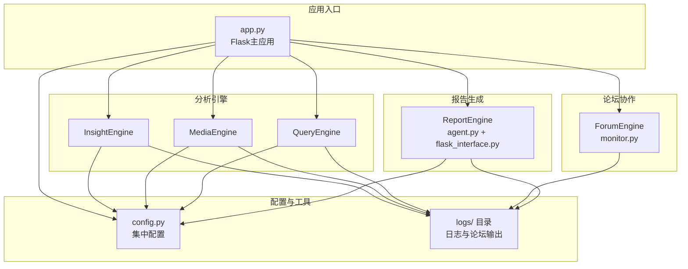
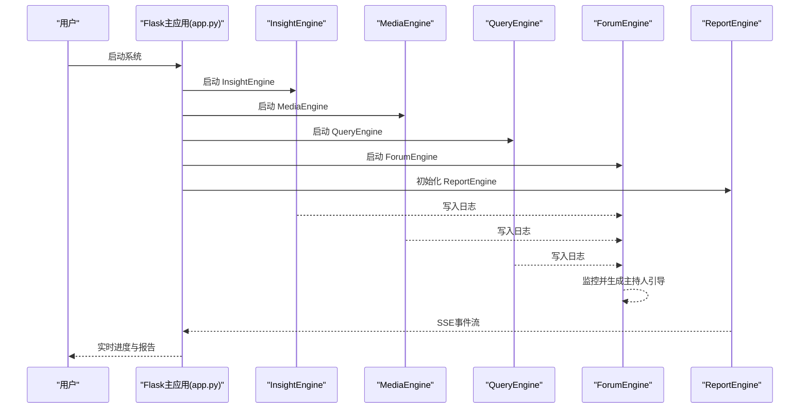
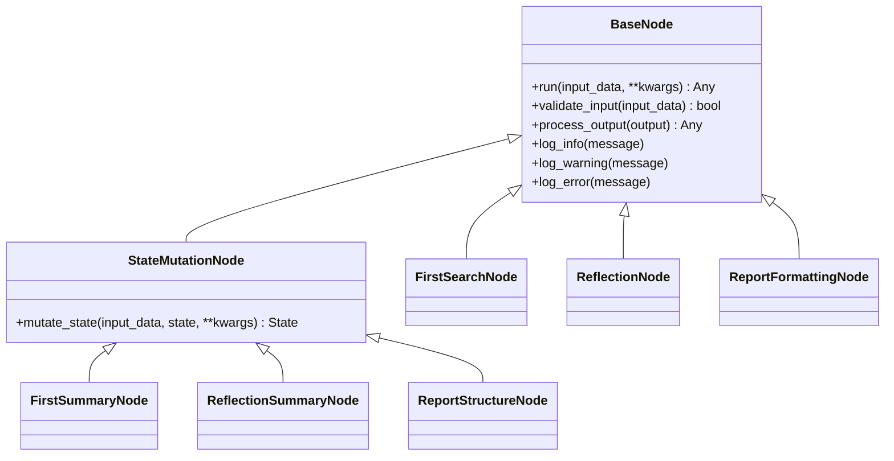
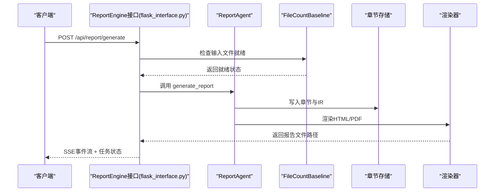
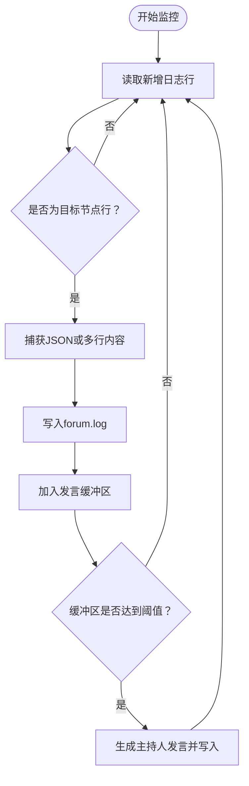
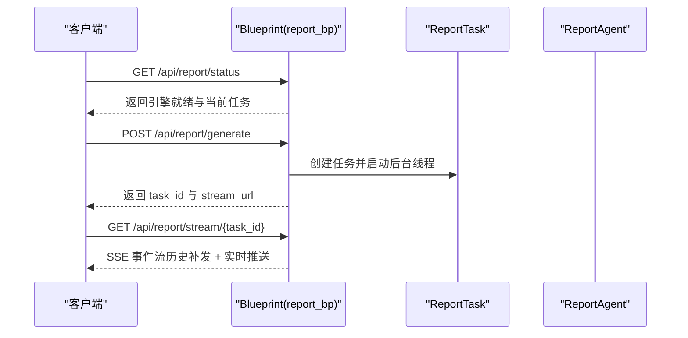
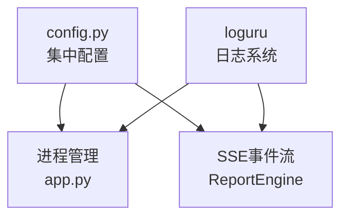

# 扩展开发

<cite>
**本文引用的文件**
- [README.md](file://README.md)
- [app.py](file://app.py)
- [config.py](file://config.py)
- [InsightEngine/__init__.py](file://InsightEngine/__init__.py)
- [InsightEngine/agent.py](file://InsightEngine/agent.py)
- [InsightEngine/nodes/base_node.py](file://InsightEngine/nodes/base_node.py)
- [ReportEngine/__init__.py](file://ReportEngine/__init__.py)
- [ReportEngine/agent.py](file://ReportEngine/agent.py)
- [ReportEngine/flask_interface.py](file://ReportEngine/flask_interface.py)
- [ForumEngine/monitor.py](file://ForumEngine/monitor.py)
</cite>

## 目录
1. [简介](#简介)
2. [项目结构](#项目结构)
3. [核心组件](#核心组件)
4. [架构总览](#架构总览)
5. [详细组件分析](#详细组件分析)
6. [依赖分析](#依赖分析)
7. [性能考虑](#性能考虑)
8. [故障排查指南](#故障排查指南)
9. [结论](#结论)
10. [附录](#附录)

## 简介
本指南面向高级开发者，系统讲解如何在 BettaFish 平台上进行扩展开发，包括：
- 插件开发方法与节点扩展机制
- 自定义引擎开发与集成策略
- 模型集成与工具扩展
- API 扩展与接口策略
- 报告模板扩展与搜索引擎集成
- 第三方服务对接与最佳实践

系统采用模块化设计，支持独立 Agent（Insight/Media/Query）、论坛协作机制（ForumEngine）与报告生成（ReportEngine）的统一调度与扩展。

## 项目结构
整体采用“多引擎 + 论坛协作 + 报告生成”的分层架构：
- InsightEngine/MediaEngine/QueryEngine：各自独立的分析 Agent，负责数据采集、搜索与总结
- ForumEngine：日志监控与论坛主持，促进多 Agent 协作
- ReportEngine：模板选择、布局设计、章节生成、IR 装订与渲染
- app.py：Flask 主应用，统一启动与调度三个 Streamlit 子应用，注册 ReportEngine 接口
- config.py：集中式配置管理，支持 .env 与环境变量自动加载

**图表来源**
- [app.py](file://app.py#L1-L120)
- [config.py](file://config.py#L1-L136)
- [ForumEngine/monitor.py](file://ForumEngine/monitor.py#L1-L120)
- [ReportEngine/agent.py](file://ReportEngine/agent.py#L1-L120)

**章节来源**
- [README.md](file://README.md#L86-L297)
- [app.py](file://app.py#L1-L120)
- [config.py](file://config.py#L1-L136)

## 核心组件
- InsightEngine：私有数据库挖掘 Agent，支持关键词优化、情感分析与多轮反思
- MediaEngine：多模态内容分析 Agent
- QueryEngine：国内外新闻广度搜索 Agent
- ForumEngine：日志监控与论坛主持，驱动多 Agent 协作
- ReportEngine：模板选择、布局设计、章节生成、IR 装订与渲染
- Flask 主应用：统一启动与调度，注册 ReportEngine 接口，提供 SSE 事件流

**章节来源**
- [InsightEngine/agent.py](file://InsightEngine/agent.py#L1-L120)
- [ReportEngine/agent.py](file://ReportEngine/agent.py#L1-L120)
- [ForumEngine/monitor.py](file://ForumEngine/monitor.py#L1-L120)
- [app.py](file://app.py#L1-L120)

## 架构总览
系统通过 Flask 主应用统一调度三个 Streamlit 子应用与 ReportEngine，论坛日志作为多 Agent 协作的中枢，最终由 ReportEngine 聚合生成报告。

**图表来源**
- [app.py](file://app.py#L276-L348)
- [ForumEngine/monitor.py](file://ForumEngine/monitor.py#L584-L702)
- [ReportEngine/flask_interface.py](file://ReportEngine/flask_interface.py#L578-L704)

**章节来源**
- [README.md](file://README.md#L102-L117)
- [app.py](file://app.py#L276-L348)
- [ReportEngine/flask_interface.py](file://ReportEngine/flask_interface.py#L578-L704)

## 详细组件分析

### InsightEngine 扩展指南
InsightEngine 提供节点基类与处理节点，支持自定义节点扩展与工具集成。

- 节点基类与状态修改节点
  - BaseNode：定义 run、validate_input、process_output 等基础接口
  - StateMutationNode：扩展 mutate_state，用于修改状态
- 典型节点
  - FirstSearchNode、ReflectionNode、FirstSummaryNode、ReflectionSummaryNode、ReportFormattingNode、ReportStructureNode
- 工具集成
  - DBResponse、MediaCrawlerDB、keyword_optimizer、multilingual_sentiment_analyzer
- 配置与参数
  - 通过 Settings 控制最大反思次数、搜索限制、内容长度等

**图表来源**
- [InsightEngine/nodes/base_node.py](file://InsightEngine/nodes/base_node.py#L13-L95)
- [InsightEngine/agent.py](file://InsightEngine/agent.py#L18-L34)

**章节来源**
- [InsightEngine/nodes/base_node.py](file://InsightEngine/nodes/base_node.py#L1-L95)
- [InsightEngine/agent.py](file://InsightEngine/agent.py#L18-L34)

扩展要点
- 自定义节点：继承 BaseNode 或 StateMutationNode，实现 run/mutate_state
- 集成工具：在节点中使用 DBResponse、MediaCrawlerDB、keyword_optimizer 等
- 配置参数：通过 Settings 调整搜索限制、反思次数等

### ReportEngine 扩展指南
ReportEngine 提供模板选择、布局设计、章节生成、IR 装订与渲染的完整链路，支持 API 扩展与流式事件推送。

- 核心职责
  - FileCountBaseline：文件数量基准管理，用于判断输入是否就绪
  - ReportAgent：总调度器，串联模板选择→布局→篇幅→章节→渲染
  - 节点：TemplateSelectionNode、DocumentLayoutNode、WordBudgetNode、ChapterGenerationNode
  - 渲染器：HTMLRenderer、PDF 渲染（依赖 WeasyPrint）
- API 扩展
  - flask_interface 提供 /status、/generate、/stream 等接口，支持 SSE 事件流
  - 任务队列与历史事件缓存，支持 Last-Event-ID 补发
- GraphRAG 集成
  - 可选启用，支持知识图谱构建与查询增强章节生成

**图表来源**
- [ReportEngine/flask_interface.py](file://ReportEngine/flask_interface.py#L605-L704)
- [ReportEngine/agent.py](file://ReportEngine/agent.py#L424-L598)

**章节来源**
- [ReportEngine/agent.py](file://ReportEngine/agent.py#L190-L252)
- [ReportEngine/flask_interface.py](file://ReportEngine/flask_interface.py#L246-L272)

扩展要点
- 自定义模板：在 ReportEngine/report_template/ 下新增模板，或通过接口传入 custom_template
- 自定义节点：在 ReportAgent 中扩展节点链路，确保与 IR Schema 兼容
- API 扩展：在 flask_interface 中新增路由，复用 ReportAgent 的能力

### ForumEngine 扩展指南
ForumEngine 通过监控 Insight/Media/Query 的日志，提取节点输出并生成主持人引导，形成多 Agent 协作机制。

- 日志监控
  - LogMonitor：监控 logs/ 下的 insight.log、media.log、query.log
  - 捕获 FirstSummaryNode/ReflectionSummaryNode 的 JSON 输出
  - 过滤 ERROR 块，避免错误日志干扰
- 主持人引导
  - 触发阈值：每 N 条 Agent 发言触发一次主持人发言
  - 生成并写入 HOST 发言到 forum.log
- 线程安全与超时控制
  - 写入锁、非活跃超时、自动结束会话

**图表来源**
- [ForumEngine/monitor.py](file://ForumEngine/monitor.py#L584-L702)

**章节来源**
- [ForumEngine/monitor.py](file://ForumEngine/monitor.py#L24-L122)

扩展要点
- 自定义识别规则：在 target_node_patterns 中添加新的节点模式
- 自定义主持人逻辑：在 generate_host_speech 中扩展引导策略
- 日志格式适配：确保节点输出符合 JSON 捕获规则

### API 扩展策略
- Flask 蓝图：ReportEngine 通过 Blueprint 暴露 /api/report/* 接口
- SSE 事件流：统一事件格式，支持断线重连与历史补发
- 任务生命周期：pending/running/completed/error，支持进度与结果查询
- 依赖检测：初始化时检测 PDF 生成依赖（WeasyPrint）

**图表来源**
- [ReportEngine/flask_interface.py](file://ReportEngine/flask_interface.py#L578-L704)

**章节来源**
- [ReportEngine/flask_interface.py](file://ReportEngine/flask_interface.py#L26-L72)

扩展要点
- 新增路由：在 flask_interface 中注册新蓝图与路由
- 事件规范：遵循统一事件格式，确保前端兼容
- 任务管理：利用 ReportTask 生命周期管理器，避免资源泄露

### 自定义报告模板与搜索引擎集成
- 报告模板
  - Web 界面支持上传 .md/.txt 模板
  - 也可在 ReportEngine/report_template/ 下新增模板，系统自动选择合适模板
- 搜索引擎集成
  - InsightEngine 支持关键词优化中间件与情感分析工具
  - 可扩展新的搜索工具（如自定义数据库查询、第三方 API）
- 第三方服务对接
  - 通过 config.py 配置 LLM 与网络工具（AnspireAPI/BochaAPI/Tavily）
  - 在 Agent 中注入自定义工具，复用 LLMClient

**章节来源**
- [README.md](file://README.md#L705-L714)
- [InsightEngine/agent.py](file://InsightEngine/agent.py#L190-L372)
- [config.py](file://config.py#L84-L95)

## 依赖分析
- 配置管理：config.py 使用 pydantic-settings，支持 .env 与环境变量自动加载
- 日志系统：loguru，ReportEngine 通过过滤器避免其他引擎日志混入
- 进程管理：app.py 启动/停止三个 Streamlit 子应用，监控健康状态
- 事件流：ReportEngine 使用 SSE，支持历史事件补发与心跳

**图表来源**
- [config.py](file://config.py#L1-L136)
- [app.py](file://app.py#L778-L800)
- [ReportEngine/flask_interface.py](file://ReportEngine/flask_interface.py#L112-L123)

**章节来源**
- [config.py](file://config.py#L1-L136)
- [app.py](file://app.py#L778-L800)
- [ReportEngine/flask_interface.py](file://ReportEngine/flask_interface.py#L112-L123)

## 性能考虑
- 聚类采样：InsightEngine 对搜索结果进行聚类采样，降低冗余
- 重试与兜底：ReportEngine 在章节生成失败时自动重试与修复
- 依赖检测：初始化时检测 PDF 生成依赖，避免运行时失败
- 进程健康检查：app.py 对 Streamlit 子应用进行健康检查，及时发现异常

**章节来源**
- [InsightEngine/agent.py](file://InsightEngine/agent.py#L129-L189)
- [ReportEngine/agent.py](file://ReportEngine/agent.py#L756-L800)
- [ReportEngine/flask_interface.py](file://ReportEngine/flask_interface.py#L261-L267)
- [app.py](file://app.py#L778-L800)

## 故障排查指南
- 配置问题：检查 .env 与 config.py 的一致性，确保 API Key、Base URL、模型名正确
- 日志定位：InsightEngine/MediaEngine/QueryEngine 的日志分别写入 insight.log、media.log、query.log；论坛日志写入 forum.log
- ReportEngine 日志：仅记录 ReportEngine 相关日志，避免其他引擎日志干扰
- 进程异常：app.py 提供启动/停止接口，注意端口占用与进程回收
- SSE 断线：客户端可通过 Last-Event-ID 补发历史事件

**章节来源**
- [config.py](file://config.py#L1-L136)
- [app.py](file://app.py#L528-L573)
- [ReportEngine/flask_interface.py](file://ReportEngine/flask_interface.py#L48-L72)

## 结论
通过模块化设计与清晰的扩展点，BettaFish 支持灵活的插件开发、节点扩展与 API 扩展。开发者可基于 InsightEngine 的节点基类扩展新节点，基于 ReportEngine 的节点链路扩展报告生成流程，基于 ForumEngine 的监控机制扩展多 Agent 协作策略，并通过 config.py 与 Flask 接口实现配置与 API 的统一管理。

## 附录
- 快速开始与部署：参考 README.md 的 Docker 与源码启动说明
- 命令行报告生成：report_engine_only.py 支持跳过三个分析引擎直接生成报告
- 重渲染工具：regenerate_latest_html.py/regenerate_latest_md.py/regenerate_latest_pdf.py 支持从最新章节重装订并渲染

**章节来源**
- [README.md](file://README.md#L299-L541)