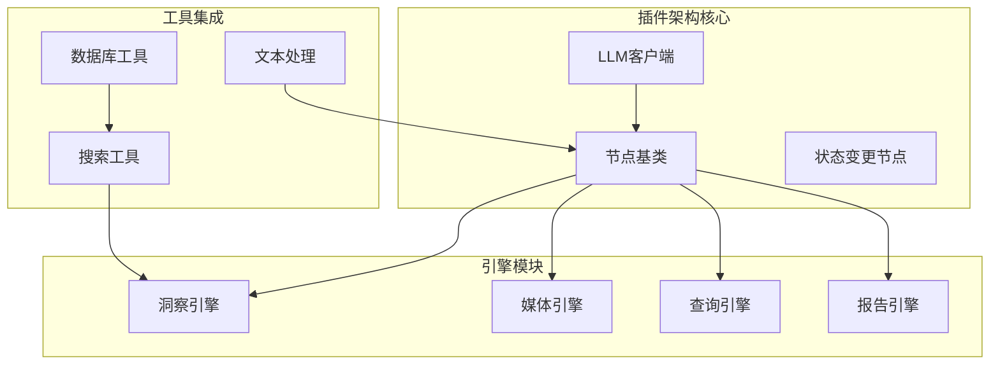
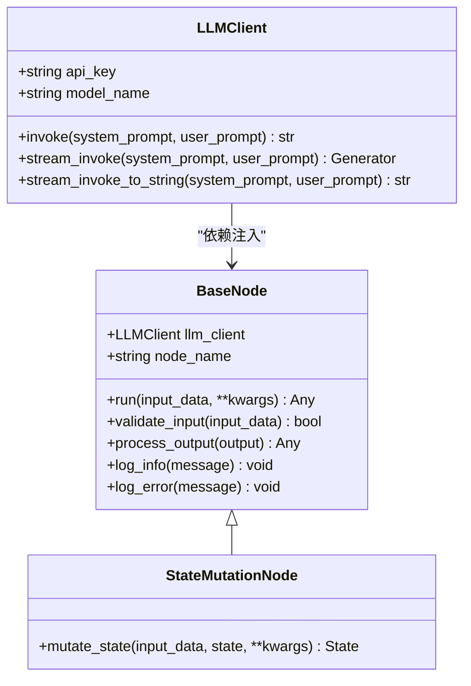
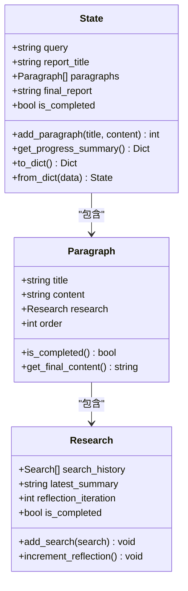
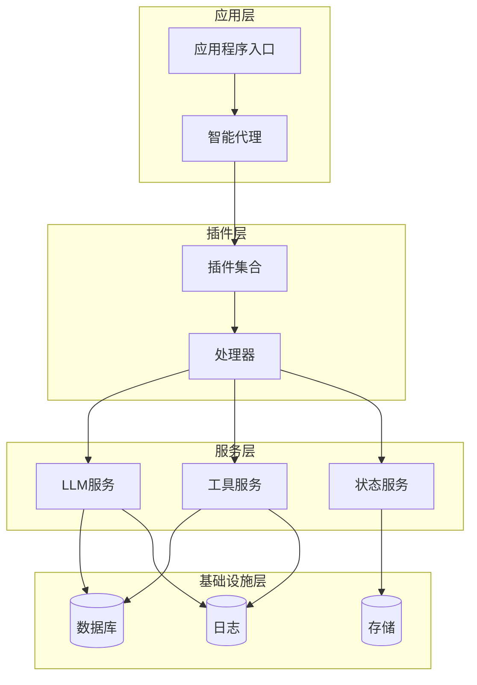
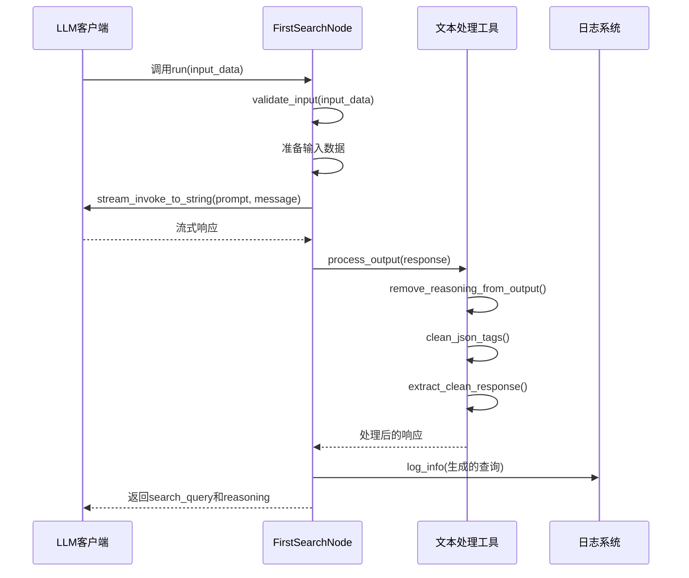
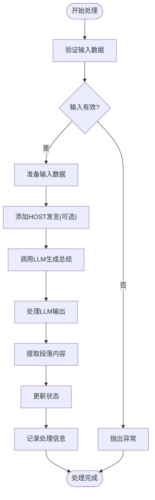
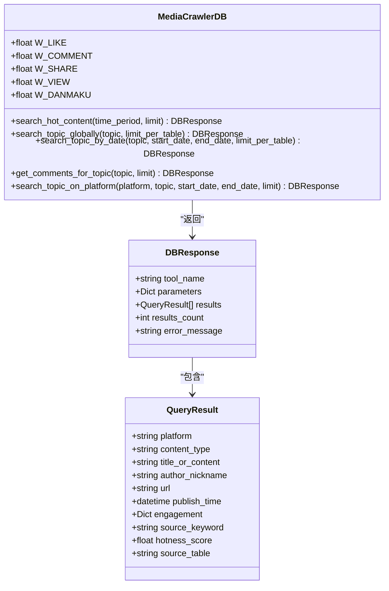
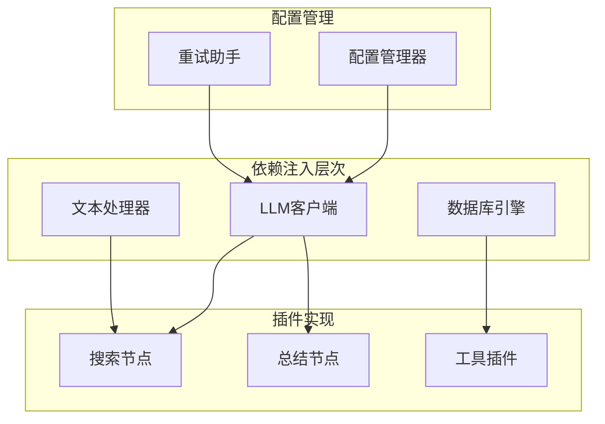

# 插件开发指南

<cite>
**本文档引用的文件**
- [InsightEngine/nodes/base_node.py](file://InsightEngine/nodes/base_node.py)
- [MediaEngine/nodes/base_node.py](file://MediaEngine/nodes/base_node.py)
- [QueryEngine/nodes/base_node.py](file://QueryEngine/nodes/base_node.py)
- [ReportEngine/nodes/base_node.py](file://ReportEngine/nodes/base_node.py)
- [InsightEngine/nodes/search_node.py](file://InsightEngine/nodes/search_node.py)
- [InsightEngine/nodes/summary_node.py](file://InsightEngine/nodes/summary_node.py)
- [MediaEngine/nodes/search_node.py](file://MediaEngine/nodes/search_node.py)
- [QueryEngine/nodes/search_node.py](file://QueryEngine/nodes/search_node.py)
- [InsightEngine/state/state.py](file://InsightEngine/state/state.py)
- [InsightEngine/llms/base.py](file://InsightEngine/llms/base.py)
- [InsightEngine/tools/search.py](file://InsightEngine/tools/search.py)
- [InsightEngine/utils/db.py](file://InsightEngine/utils/db.py)
- [ReportEngine/nodes/chapter_generation_node.py](file://ReportEngine/nodes/chapter_generation_node.py)
</cite>

## 目录
1. [简介](#简介)
2. [项目结构](#项目结构)
3. [核心组件](#核心组件)
4. [架构概览](#架构概览)
5. [详细组件分析](#详细组件分析)
6. [依赖关系分析](#依赖关系分析)
7. [性能考虑](#性能考虑)
8. [故障排除指南](#故障排除指南)
9. [结论](#结论)
10. [附录](#附录)

## 简介

BettaFish系统是一个基于插件架构的多引擎AI应用框架，支持多个专业领域的智能处理能力。本指南专注于为开发者提供完整的插件开发指导，涵盖节点扩展机制、工具集成方法和插件架构设计。

系统采用统一的节点基类设计，通过抽象方法实现确保所有插件遵循一致的开发模式。每个引擎（InsightEngine、MediaEngine、QueryEngine、ReportEngine）都提供了完整的插件开发基础设施，包括节点基类、状态管理、工具集成和LLM客户端支持。

## 项目结构

BettaFish系统采用模块化架构设计，每个引擎都是独立的功能模块，但共享相同的插件开发模式：



**图表来源**
- [InsightEngine/nodes/base_node.py](file://InsightEngine/nodes/base_node.py#L13-L95)
- [MediaEngine/nodes/base_node.py](file://MediaEngine/nodes/base_node.py#L13-L95)
- [QueryEngine/nodes/base_node.py](file://QueryEngine/nodes/base_node.py#L13-L95)
- [ReportEngine/nodes/base_node.py](file://ReportEngine/nodes/base_node.py#L13-L108)

**章节来源**
- [InsightEngine/nodes/base_node.py](file://InsightEngine/nodes/base_node.py#L1-L95)
- [MediaEngine/nodes/base_node.py](file://MediaEngine/nodes/base_node.py#L1-L95)
- [QueryEngine/nodes/base_node.py](file://QueryEngine/nodes/base_node.py#L1-L95)
- [ReportEngine/nodes/base_node.py](file://ReportEngine/nodes/base_node.py#L1-L108)

## 核心组件

### 节点基类体系

系统提供了两层节点基类设计，确保插件开发的一致性和可扩展性：



**图表来源**
- [InsightEngine/nodes/base_node.py](file://InsightEngine/nodes/base_node.py#L13-L95)
- [ReportEngine/nodes/base_node.py](file://ReportEngine/nodes/base_node.py#L13-L108)
- [InsightEngine/llms/base.py](file://InsightEngine/llms/base.py#L30-L168)

### 状态管理系统

每个引擎都实现了独立的状态管理机制，支持复杂的工作流状态跟踪：



**图表来源**
- [InsightEngine/state/state.py](file://InsightEngine/state/state.py#L143-L259)

**章节来源**
- [InsightEngine/state/state.py](file://InsightEngine/state/state.py#L1-L259)

## 架构概览

BettaFish系统采用分层架构设计，确保插件开发的灵活性和可维护性：



**图表来源**
- [InsightEngine/llms/base.py](file://InsightEngine/llms/base.py#L30-L168)
- [InsightEngine/tools/search.py](file://InsightEngine/tools/search.py#L63-L463)

## 详细组件分析

### 搜索节点插件开发

搜索节点是插件开发的最佳实践示例，展示了如何实现标准的节点接口：

#### FirstSearchNode 实现分析



**图表来源**
- [InsightEngine/nodes/search_node.py](file://InsightEngine/nodes/search_node.py#L45-L151)

#### ReflectionNode 实现分析

反思节点展示了如何扩展基础节点以支持更复杂的状态处理：

**章节来源**
- [InsightEngine/nodes/search_node.py](file://InsightEngine/nodes/search_node.py#L1-L287)

### 总结节点插件开发

总结节点展示了如何实现状态变更节点，直接修改工作流状态：

#### FirstSummaryNode 实现分析



**图表来源**
- [InsightEngine/nodes/summary_node.py](file://InsightEngine/nodes/summary_node.py#L60-L196)

**章节来源**
- [InsightEngine/nodes/summary_node.py](file://InsightEngine/nodes/summary_node.py#L1-L363)

### 工具集成插件开发

工具插件展示了如何集成外部服务和数据库查询：

#### MediaCrawlerDB 实现分析



**图表来源**
- [InsightEngine/tools/search.py](file://InsightEngine/tools/search.py#L63-L463)

**章节来源**
- [InsightEngine/tools/search.py](file://InsightEngine/tools/search.py#L1-L463)

### LLM客户端集成

LLM客户端提供了统一的AI服务访问接口：

#### LLMClient 功能特性

**章节来源**
- [InsightEngine/llms/base.py](file://InsightEngine/llms/base.py#L1-L168)

## 依赖关系分析

系统采用松耦合的设计原则，通过依赖注入机制实现模块间的解耦：



**图表来源**
- [InsightEngine/llms/base.py](file://InsightEngine/llms/base.py#L19-L27)
- [InsightEngine/utils/db.py](file://InsightEngine/utils/db.py#L49-L73)

**章节来源**
- [InsightEngine/llms/base.py](file://InsightEngine/llms/base.py#L1-L168)
- [InsightEngine/utils/db.py](file://InsightEngine/utils/db.py#L1-L73)

## 性能考虑

### 缓存策略

系统实现了多层次的缓存机制来提升性能：

1. **数据库列缓存**: 避免重复查询表结构信息
2. **事件循环缓存**: 复用异步事件循环实例
3. **状态持久化**: 支持断点续传和状态恢复

### 流式处理

LLM响应采用流式处理方式，减少内存占用并提升用户体验：

- **流式LLM调用**: 支持实时响应显示
- **增量解析**: 边接收边解析JSON数据
- **错误恢复**: 支持部分解析和错误恢复

## 故障排除指南

### 常见问题及解决方案

#### LLM调用失败

**问题**: LLM API调用超时或失败
**解决方案**: 
1. 检查网络连接和API密钥配置
2. 调整超时参数和重试配置
3. 验证模型名称和基础URL设置

#### JSON解析错误

**问题**: LLM输出无法解析为JSON格式
**解决方案**:
1. 使用内置的JSON修复工具
2. 实现自定义解析器
3. 添加详细的错误日志

#### 数据库连接问题

**问题**: 数据库连接失败或查询超时
**解决方案**:
1. 检查数据库配置参数
2. 验证连接池设置
3. 实现连接重试机制

**章节来源**
- [InsightEngine/llms/base.py](file://InsightEngine/llms/base.py#L57-L84)
- [InsightEngine/tools/search.py](file://InsightEngine/tools/search.py#L78-L95)

## 结论

BettaFish系统的插件开发框架提供了完整的基础设施，支持开发者快速构建高质量的AI插件。通过统一的节点基类设计、灵活的依赖注入机制和完善的工具集成，开发者可以专注于业务逻辑的实现。

系统的核心优势包括：
- **一致性**: 统一的插件开发模式和接口规范
- **可扩展性**: 模块化设计支持功能扩展
- **可靠性**: 完善的错误处理和恢复机制
- **性能**: 流式处理和缓存优化

## 附录

### 插件开发最佳实践

#### 基础节点开发模板

```python
from InsightEngine.nodes.base_node import BaseNode

class CustomNode(BaseNode):
    def __init__(self, llm_client, node_name="CustomNode"):
        super().__init__(llm_client, node_name)
    
    def validate_input(self, input_data):
        # 实现输入验证逻辑
        return True
    
    def run(self, input_data, **kwargs):
        # 实现核心处理逻辑
        return result
    
    def process_output(self, output):
        # 实现输出处理逻辑
        return processed_output
```

#### 状态变更节点开发模板

```python
from InsightEngine.nodes.base_node import StateMutationNode
from InsightEngine.state.state import State

class CustomStateNode(StateMutationNode):
    def __init__(self, llm_client, node_name="CustomStateNode"):
        super().__init__(llm_client, node_name)
    
    def mutate_state(self, input_data, state, **kwargs):
        # 实现状态变更逻辑
        return state
```

#### 工具插件开发模板

```python
from InsightEngine.tools.search import MediaCrawlerDB

class CustomToolPlugin:
    def __init__(self):
        self.db_client = MediaCrawlerDB()
    
    def execute_tool(self, params):
        # 实现工具执行逻辑
        return result
```

#### 配置和注册

1. **配置文件**: 在相应引擎的配置文件中添加插件配置
2. **依赖注入**: 通过构造函数注入必要的依赖
3. **注册机制**: 将插件注册到系统的服务容器中
4. **生命周期管理**: 实现插件的初始化和销毁逻辑