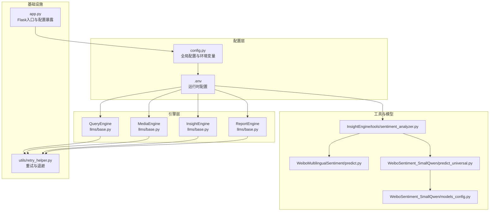
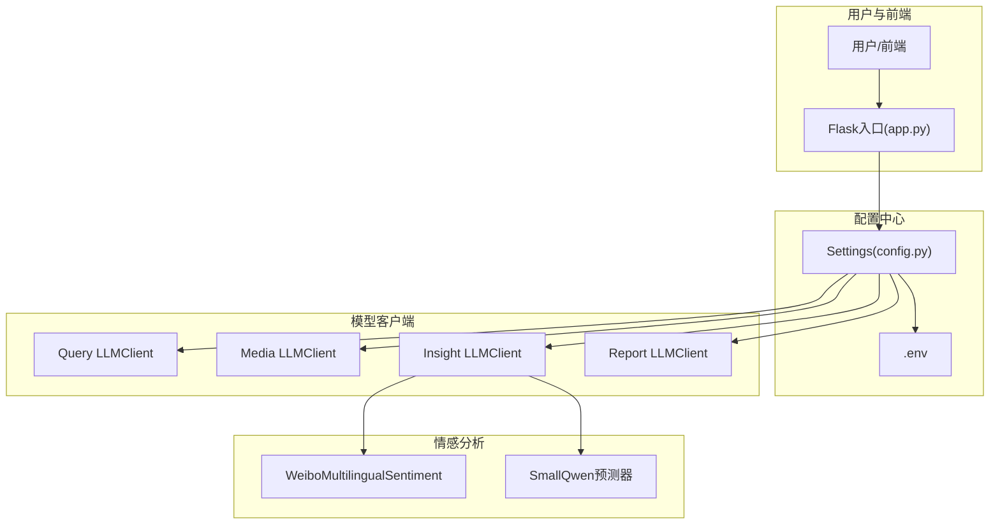
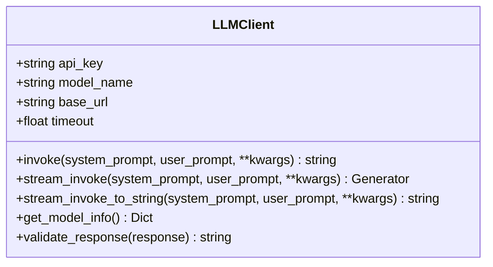
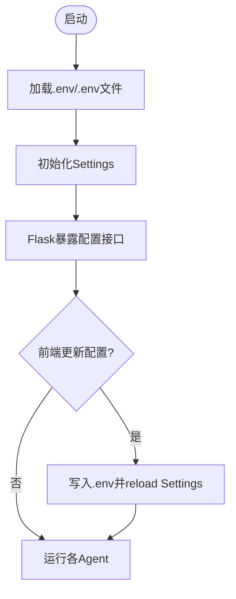
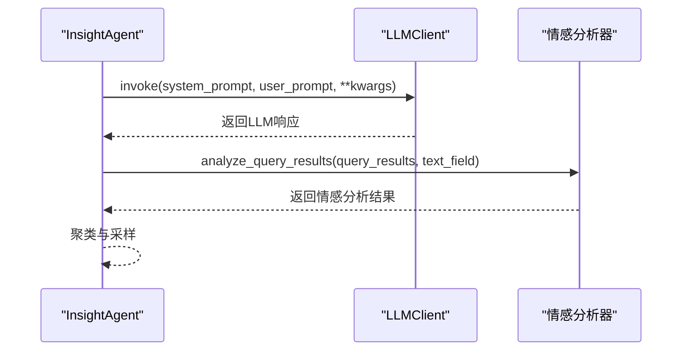
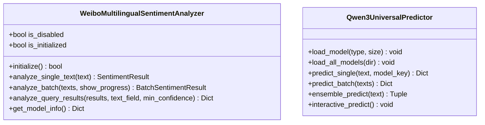
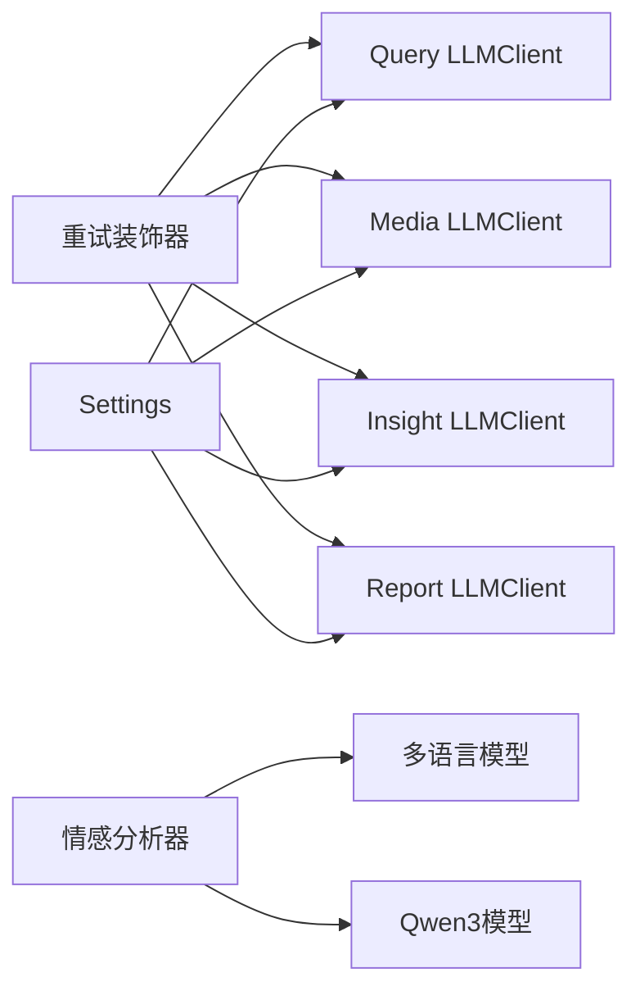

# 模型集成开发

<cite>
**本文档引用的文件**
- [README.md](file://README.md)
- [config.py](file://config.py)
- [utils/retry_helper.py](file://utils/retry_helper.py)
- [InsightEngine/llms/base.py](file://InsightEngine/llms/base.py)
- [MediaEngine/llms/base.py](file://MediaEngine/llms/base.py)
- [QueryEngine/llms/base.py](file://QueryEngine/llms/base.py)
- [ReportEngine/llms/base.py](file://ReportEngine/llms/base.py)
- [InsightEngine/tools/sentiment_analyzer.py](file://InsightEngine/tools/sentiment_analyzer.py)
- [SentimentAnalysisModel/WeiboMultilingualSentiment/predict.py](file://SentimentAnalysisModel/WeiboMultilingualSentiment/predict.py)
- [SentimentAnalysisModel/WeiboSentiment_SmallQwen/predict_universal.py](file://SentimentAnalysisModel/WeiboSentiment_SmallQwen/predict_universal.py)
- [SentimentAnalysisModel/WeiboSentiment_SmallQwen/models_config.py](file://SentimentAnalysisModel/WeiboSentiment_SmallQwen/models_config.py)
- [InsightEngine/agent.py](file://InsightEngine/agent.py)
- [app.py](file://app.py)
- [tests/run_tests.py](file://tests/run_tests.py)
</cite>

## 目录
1. [简介](#简介)
2. [项目结构](#项目结构)
3. [核心组件](#核心组件)
4. [架构总览](#架构总览)
5. [详细组件分析](#详细组件分析)
6. [依赖关系分析](#依赖关系分析)
7. [性能考量](#性能考量)
8. [故障排查指南](#故障排查指南)
9. [结论](#结论)
10. [附录](#附录)

## 简介
本指南面向BettaFish系统的模型集成开发，聚焦三大方向：
- 大语言模型（LLM）集成：统一OpenAI兼容客户端封装，支持非流式/流式调用、可选重试、超时控制与模型元信息查询。
- 情感分析模型适配：多语言情感分析与小参数Qwen3情感分析模型的统一接入与批量处理。
- 多模态模型接入：通过Agent工具集与节点扩展，实现多模态内容的统一处理与输出。

文档将提供LLM客户端接口设计、模型配置管理、推理接口封装、版本管理、缓存策略与错误处理机制的完整开发流程，并给出测试验证方法。

## 项目结构
BettaFish采用模块化架构，各Agent引擎（Query、Media、Insight、Report）均提供独立的LLM客户端封装与工具集，情感分析模型位于SentimentAnalysisModel目录，统一通过InsightEngine的工具集接入。

**图表来源**
- [config.py](file://config.py#L23-L119)
- [utils/retry_helper.py](file://utils/retry_helper.py#L13-L247)
- [InsightEngine/llms/base.py](file://InsightEngine/llms/base.py#L30-L168)
- [MediaEngine/llms/base.py](file://MediaEngine/llms/base.py#L31-L171)
- [QueryEngine/llms/base.py](file://QueryEngine/llms/base.py#L30-L168)
- [ReportEngine/llms/base.py](file://ReportEngine/llms/base.py#L33-L180)
- [InsightEngine/tools/sentiment_analyzer.py](file://InsightEngine/tools/sentiment_analyzer.py#L79-L632)
- [SentimentAnalysisModel/WeiboMultilingualSentiment/predict.py](file://SentimentAnalysisModel/WeiboMultilingualSentiment/predict.py#L9-L190)
- [SentimentAnalysisModel/WeiboSentiment_SmallQwen/predict_universal.py](file://SentimentAnalysisModel/WeiboSentiment_SmallQwen/predict_universal.py#L22-L377)
- [SentimentAnalysisModel/WeiboSentiment_SmallQwen/models_config.py](file://SentimentAnalysisModel/WeiboSentiment_SmallQwen/models_config.py#L8-L53)
- [app.py](file://app.py#L128-L190)

**章节来源**
- [README.md](file://README.md#L118-L297)

## 核心组件
- LLM客户端封装：四个Agent引擎各自提供OpenAI兼容的LLM客户端，统一支持非流式与流式调用、参数透传、超时控制与重试装饰器。
- 情感分析工具：InsightEngine集成WeiboMultilingualSentiment与WeiboSentiment_SmallQwen，提供单文本/批量/集成预测与查询结果情感分析。
- 配置管理：基于Pydantic Settings的全局配置，支持.env与环境变量自动加载，集中管理LLM API密钥、Base URL与模型名称。
- 重试与退避：统一的重试装饰器与LLM专用重试配置，提升网络不稳定场景下的稳定性。
- Flask入口：提供配置读取与持久化接口，便于前端动态更新配置。

**章节来源**
- [InsightEngine/llms/base.py](file://InsightEngine/llms/base.py#L30-L168)
- [MediaEngine/llms/base.py](file://MediaEngine/llms/base.py#L31-L171)
- [QueryEngine/llms/base.py](file://QueryEngine/llms/base.py#L30-L168)
- [ReportEngine/llms/base.py](file://ReportEngine/llms/base.py#L33-L180)
- [InsightEngine/tools/sentiment_analyzer.py](file://InsightEngine/tools/sentiment_analyzer.py#L79-L632)
- [config.py](file://config.py#L23-L119)
- [utils/retry_helper.py](file://utils/retry_helper.py#L13-L247)
- [app.py](file://app.py#L128-L190)

## 架构总览
BettaFish通过统一的LLM客户端封装与配置中心，实现多Agent引擎的模型统一接入。情感分析模型通过InsightEngine工具集统一对外提供服务，支持多语言与小参数Qwen3模型的灵活切换与集成。

**图表来源**
- [config.py](file://config.py#L23-L119)
- [app.py](file://app.py#L128-L190)
- [InsightEngine/llms/base.py](file://InsightEngine/llms/base.py#L30-L168)
- [MediaEngine/llms/base.py](file://MediaEngine/llms/base.py#L31-L171)
- [QueryEngine/llms/base.py](file://QueryEngine/llms/base.py#L30-L168)
- [ReportEngine/llms/base.py](file://ReportEngine/llms/base.py#L33-L180)
- [InsightEngine/tools/sentiment_analyzer.py](file://InsightEngine/tools/sentiment_analyzer.py#L79-L632)

## 详细组件分析

### LLM客户端接口设计
- 统一构造函数：接收API Key、模型名称与Base URL，支持超时回退策略。
- 非流式调用：invoke方法，支持temperature/top_p等参数透传，返回标准化响应。
- 流式调用：stream_invoke与stream_invoke_to_string，支持增量返回与UTF-8安全拼接。
- 重试机制：with_retry装饰器与LLM_RETRY_CONFIG，指数退避与最大延迟控制。
- 模型信息：get_model_info返回provider/model/api_base。

**图表来源**
- [InsightEngine/llms/base.py](file://InsightEngine/llms/base.py#L30-L168)
- [MediaEngine/llms/base.py](file://MediaEngine/llms/base.py#L31-L171)
- [QueryEngine/llms/base.py](file://QueryEngine/llms/base.py#L30-L168)
- [ReportEngine/llms/base.py](file://ReportEngine/llms/base.py#L33-L180)

**章节来源**
- [InsightEngine/llms/base.py](file://InsightEngine/llms/base.py#L30-L168)
- [MediaEngine/llms/base.py](file://MediaEngine/llms/base.py#L31-L171)
- [QueryEngine/llms/base.py](file://QueryEngine/llms/base.py#L30-L168)
- [ReportEngine/llms/base.py](file://ReportEngine/llms/base.py#L33-L180)

### 模型配置管理
- 全局配置：Settings类集中管理各Agent的API Key、Base URL与模型名称，支持.env与环境变量自动加载。
- 动态更新：app.py提供读取与写入配置的接口，前端可动态更新配置并持久化到.env。
- 默认回退：LLM客户端从环境变量读取超时参数，确保在配置缺失时仍可运行。

**图表来源**
- [config.py](file://config.py#L23-L119)
- [app.py](file://app.py#L128-L190)

**章节来源**
- [config.py](file://config.py#L23-L119)
- [app.py](file://app.py#L128-L190)

### 推理接口封装
- InsightEngine：通过LLMClient封装统一调用，结合节点（FirstSearchNode、ReflectionNode等）实现深度搜索与反思流程。
- Media/Query/Report Engines：各自提供LLMClient，满足不同Agent的推理需求。
- 情感分析：WeiboMultilingualSentimentAnalyzer与SmallQwen预测器提供单/批量/集成预测接口，支持查询结果情感分析。

**图表来源**
- [InsightEngine/llms/base.py](file://InsightEngine/llms/base.py#L30-L168)
- [InsightEngine/tools/sentiment_analyzer.py](file://InsightEngine/tools/sentiment_analyzer.py#L467-L590)
- [InsightEngine/agent.py](file://InsightEngine/agent.py#L190-L250)

**章节来源**
- [InsightEngine/agent.py](file://InsightEngine/agent.py#L41-L95)
- [InsightEngine/tools/sentiment_analyzer.py](file://InsightEngine/tools/sentiment_analyzer.py#L467-L590)

### 情感分析模型适配
- 多语言情感分析：WeiboMultilingualSentiment模型，支持22种语言，提供单/批量/查询结果分析。
- 小参数Qwen3情感分析：支持Embedding+分类头与LoRA微调两种方法，0.6B/4B/8B三种规模，提供统一预测接口与集成预测。

**图表来源**
- [InsightEngine/tools/sentiment_analyzer.py](file://InsightEngine/tools/sentiment_analyzer.py#L79-L632)
- [SentimentAnalysisModel/WeiboSentiment_SmallQwen/predict_universal.py](file://SentimentAnalysisModel/WeiboSentiment_SmallQwen/predict_universal.py#L22-L377)

**章节来源**
- [InsightEngine/tools/sentiment_analyzer.py](file://InsightEngine/tools/sentiment_analyzer.py#L79-L632)
- [SentimentAnalysisModel/WeiboMultilingualSentiment/predict.py](file://SentimentAnalysisModel/WeiboMultilingualSentiment/predict.py#L9-L190)
- [SentimentAnalysisModel/WeiboSentiment_SmallQwen/predict_universal.py](file://SentimentAnalysisModel/WeiboSentiment_SmallQwen/predict_universal.py#L22-L377)
- [SentimentAnalysisModel/WeiboSentiment_SmallQwen/models_config.py](file://SentimentAnalysisModel/WeiboSentiment_SmallQwen/models_config.py#L8-L53)

### 多模态模型接入
- 多模态内容处理：MediaEngine提供LLMClient，配合节点与工具集实现多模态内容的搜索与分析。
- 统一接口：通过Agent工具集与节点扩展，实现多模态内容的统一处理与输出。

**章节来源**
- [MediaEngine/llms/base.py](file://MediaEngine/llms/base.py#L31-L171)

## 依赖关系分析
- 组件耦合：各Agent引擎的LLMClient与配置中心耦合，情感分析工具与模型文件耦合。
- 外部依赖：OpenAI兼容API、Transformers、PyTorch、SentenceTransformer等。
- 重试依赖：统一的重试装饰器与配置，降低网络波动对系统的影响。

**图表来源**
- [utils/retry_helper.py](file://utils/retry_helper.py#L13-L247)
- [config.py](file://config.py#L23-L119)
- [InsightEngine/tools/sentiment_analyzer.py](file://InsightEngine/tools/sentiment_analyzer.py#L79-L632)

**章节来源**
- [utils/retry_helper.py](file://utils/retry_helper.py#L13-L247)
- [config.py](file://config.py#L23-L119)

## 性能考量
- 超时与重试：LLM客户端支持超时回退与指数退避重试，提升网络不稳定场景下的稳定性。
- 流式输出：流式调用支持增量返回，减少前端等待时间。
- 模型选择：情感分析提供多语言与小参数Qwen3模型，可根据硬件条件选择合适规模。
- 聚类采样：InsightEngine对搜索结果进行聚类与采样，平衡覆盖率与多样性。

**章节来源**
- [utils/retry_helper.py](file://utils/retry_helper.py#L228-L247)
- [InsightEngine/llms/base.py](file://InsightEngine/llms/base.py#L86-L168)
- [InsightEngine/agent.py](file://InsightEngine/agent.py#L129-L189)

## 故障排查指南
- 配置问题：检查.env与环境变量，确认API Key、Base URL与模型名称正确。
- 重试失败：查看重试日志，确认异常类型是否在重试范围内，必要时调整重试配置。
- 模型加载失败：检查依赖（Transformers、PyTorch）与网络连接，确认模型文件路径正确。
- 情感分析不可用：确认情感分析开关与依赖，查看禁用原因与设备选择。

**章节来源**
- [app.py](file://app.py#L128-L190)
- [utils/retry_helper.py](file://utils/retry_helper.py#L13-L247)
- [InsightEngine/tools/sentiment_analyzer.py](file://InsightEngine/tools/sentiment_analyzer.py#L119-L140)

## 结论
通过统一的LLM客户端封装、集中配置管理与完善的重试机制，BettaFish实现了多Agent引擎的模型统一接入。情感分析模型的多语言与小参数Qwen3方案提供了灵活的选择，满足不同硬件与精度需求。建议在新增模型时遵循现有封装规范，确保配置、重试与错误处理的一致性。

## 附录

### 新模型添加流程
- LLM客户端封装：参考现有LLMClient，确保支持非流式/流式调用、参数透传与超时控制。
- 配置管理：在Settings中添加新模型的API Key、Base URL与模型名称字段。
- 工具集适配：在相应Agent的tools目录中添加模型适配代码，提供统一的推理接口。
- 测试验证：编写单元测试与集成测试，验证模型加载、推理与错误处理。

**章节来源**
- [InsightEngine/llms/base.py](file://InsightEngine/llms/base.py#L30-L168)
- [config.py](file://config.py#L23-L119)
- [tests/run_tests.py](file://tests/run_tests.py#L17-L56)

### 模型版本管理与缓存策略
- 版本管理：情感分析模型提供本地缓存与下载逻辑，首次使用自动下载并保存到本地。
- 缓存策略：LLM客户端支持超时与重试，减少重复请求带来的压力。
- 配置持久化：通过Flask接口将前端更新的配置持久化到.env文件。

**章节来源**
- [SentimentAnalysisModel/WeiboMultilingualSentiment/predict.py](file://SentimentAnalysisModel/WeiboMultilingualSentiment/predict.py#L16-L32)
- [utils/retry_helper.py](file://utils/retry_helper.py#L228-L247)
- [app.py](file://app.py#L178-L190)