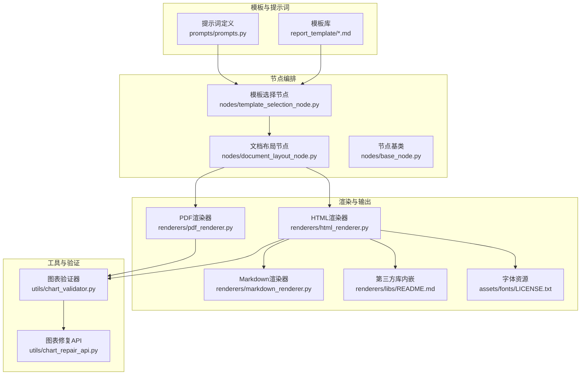
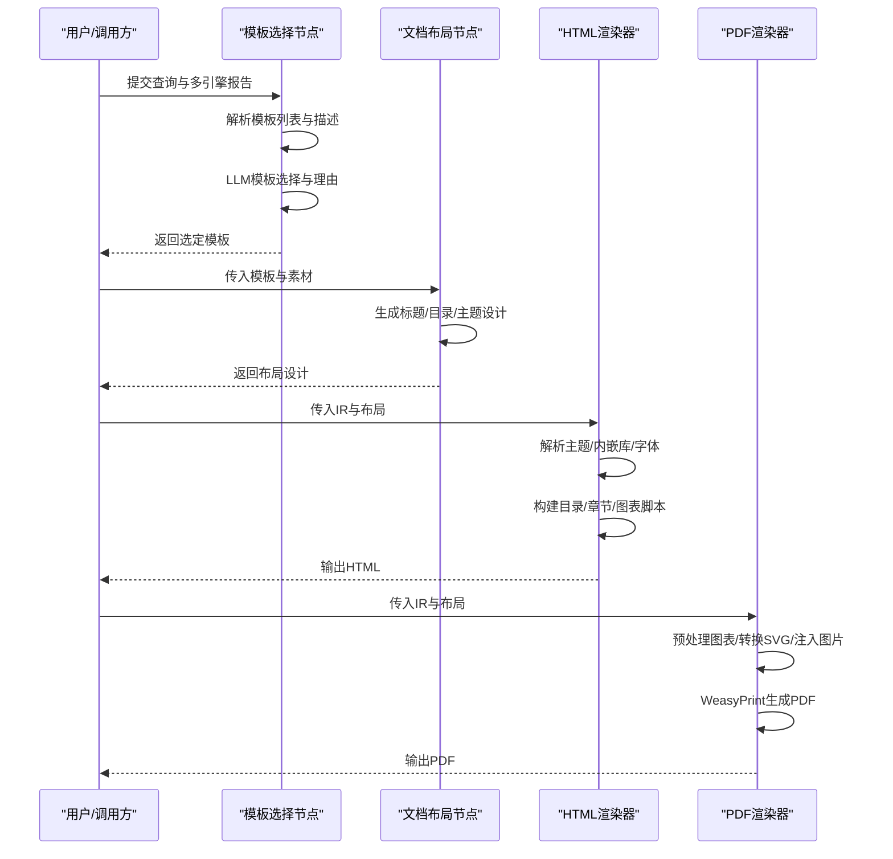
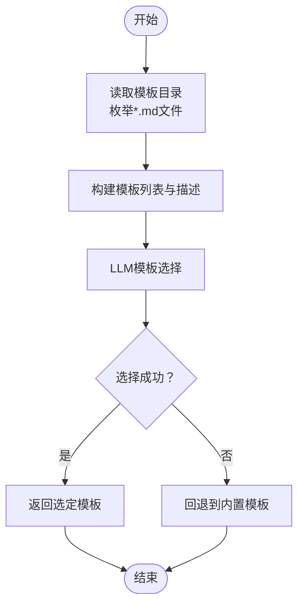
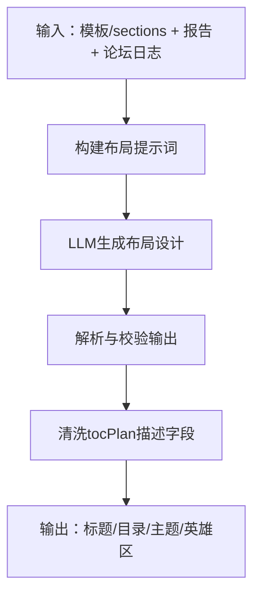
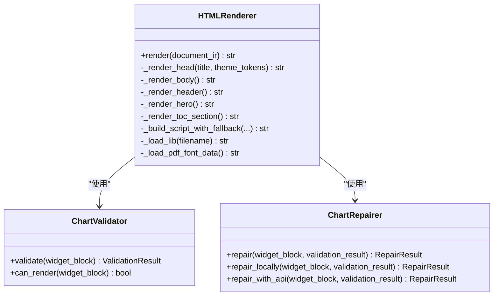
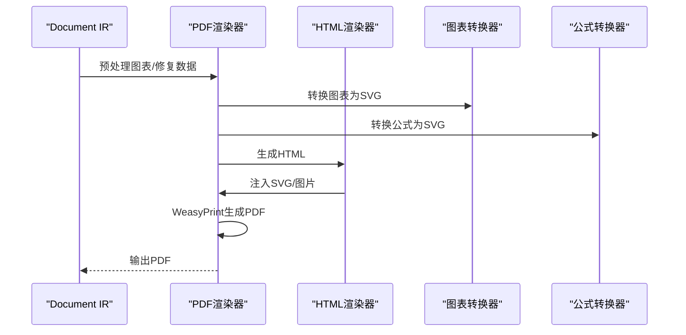
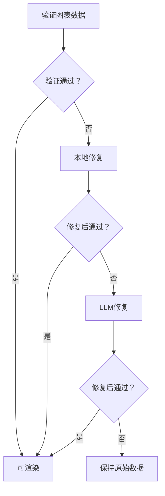
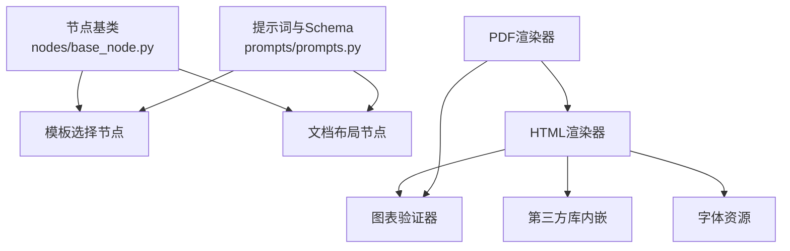

# 模板定制开发

<cite>
**本文引用的文件**
- [ReportEngine\report_template\企业品牌声誉分析报告模板.md](file://ReportEngine/report_template/企业品牌声誉分析报告模板.md)
- [ReportEngine\report_template\日常或定期舆情监测报告模板.md](file://ReportEngine/report_template/日常或定期舆情监测报告模板.md)
- [ReportEngine\report_template\社会公共热点事件分析报告模板.md](file://ReportEngine/report_template/社会公共热点事件分析报告模板.md)
- [ReportEngine\core\template_parser.py](file://ReportEngine/core/template_parser.py)
- [ReportEngine\nodes\template_selection_node.py](file://ReportEngine/nodes/template_selection_node.py)
- [ReportEngine\nodes\document_layout_node.py](file://ReportEngine/nodes/document_layout_node.py)
- [ReportEngine\renderers\html_renderer.py](file://ReportEngine/renderers/html_renderer.py)
- [ReportEngine\renderers\markdown_renderer.py](file://ReportEngine/renderers/markdown_renderer.py)
- [ReportEngine\renderers\pdf_renderer.py](file://ReportEngine/renderers/pdf_renderer.py)
- [ReportEngine\utils\chart_validator.py](file://ReportEngine/utils/chart_validator.py)
- [ReportEngine\utils\chart_repair_api.py](file://ReportEngine/utils/chart_repair_api.py)
- [ReportEngine\prompts\prompts.py](file://ReportEngine/prompts/prompts.py)
- [ReportEngine\nodes\base_node.py](file://ReportEngine/nodes/base_node.py)
- [ReportEngine\renderers\libs\README.md](file://ReportEngine/renderers/libs/README.md)
- [ReportEngine\renderers\assets\fonts\LICENSE.txt](file://ReportEngine/renderers/assets/fonts/LICENSE.txt)
</cite>

## 目录
1. [简介](#简介)
2. [项目结构](#项目结构)
3. [核心组件](#核心组件)
4. [架构总览](#架构总览)
5. [详细组件分析](#详细组件分析)
6. [依赖分析](#依赖分析)
7. [性能考量](#性能考量)
8. [故障排查指南](#故障排查指南)
9. [结论](#结论)
10. [附录](#附录)

## 简介
本指南面向BettaFish系统的报告模板定制开发，围绕“模板系统架构、Markdown模板编写与渲染器扩展”三大主题，提供从模板设计、变量系统、条件渲染到动态内容生成的完整实践路径。文档聚焦ReportEngine模块，系统讲解模板解析、模板选择、布局设计、HTML/PDF渲染与图表修复等关键环节，帮助开发者高效创建可复用、可维护、可扩展的报告模板。

## 项目结构
ReportEngine是报告生成的核心模块，包含模板库、节点编排、渲染器与工具链。模板库位于report_template目录，采用Markdown结构化章节；节点负责模板选择、布局设计与章节生成；渲染器负责HTML/PDF输出；工具链提供图表验证与修复、依赖库内嵌与字体资源等。

**图表来源**
- [ReportEngine\report_template\企业品牌声誉分析报告模板.md](file://ReportEngine/report_template/企业品牌声誉分析报告模板.md#L1-L30)
- [ReportEngine\nodes\template_selection_node.py](file://ReportEngine/nodes/template_selection_node.py#L1-L287)
- [ReportEngine\nodes\document_layout_node.py](file://ReportEngine/nodes/document_layout_node.py#L1-L209)
- [ReportEngine\renderers\html_renderer.py](file://ReportEngine/renderers/html_renderer.py#L1-L800)
- [ReportEngine\renderers\pdf_renderer.py](file://ReportEngine/renderers/pdf_renderer.py#L1-L800)
- [ReportEngine\renderers\markdown_renderer.py](file://ReportEngine/renderers/markdown_renderer.py#L1-L800)
- [ReportEngine\utils\chart_validator.py](file://ReportEngine/utils/chart_validator.py#L1-L731)
- [ReportEngine\utils\chart_repair_api.py](file://ReportEngine/utils/chart_repair_api.py#L1-L631)
- [ReportEngine\renderers\libs\README.md](file://ReportEngine/renderers/libs/README.md#L1-L53)
- [ReportEngine\renderers\assets\fonts\LICENSE.txt](file://ReportEngine/renderers/assets/fonts/LICENSE.txt#L1-L97)

**章节来源**
- [ReportEngine\report_template\企业品牌声誉分析报告模板.md](file://ReportEngine/report_template/企业品牌声誉分析报告模板.md#L1-L30)
- [ReportEngine\report_template\日常或定期舆情监测报告模板.md](file://ReportEngine/report_template/日常或定期舆情监测报告模板.md#L1-L23)
- [ReportEngine\report_template\社会公共热点事件分析报告模板.md](file://ReportEngine/report_template/社会公共热点事件分析报告模板.md#L1-L25)
- [ReportEngine\core\template_parser.py](file://ReportEngine/core/template_parser.py#L1-L303)
- [ReportEngine\nodes\template_selection_node.py](file://ReportEngine/nodes/template_selection_node.py#L1-L287)
- [ReportEngine\nodes\document_layout_node.py](file://ReportEngine/nodes/document_layout_node.py#L1-L209)
- [ReportEngine\renderers\html_renderer.py](file://ReportEngine/renderers/html_renderer.py#L1-L800)
- [ReportEngine\renderers\pdf_renderer.py](file://ReportEngine/renderers/pdf_renderer.py#L1-L800)
- [ReportEngine\renderers\markdown_renderer.py](file://ReportEngine/renderers/markdown_renderer.py#L1-L800)
- [ReportEngine\utils\chart_validator.py](file://ReportEngine/utils/chart_validator.py#L1-L731)
- [ReportEngine\utils\chart_repair_api.py](file://ReportEngine/utils/chart_repair_api.py#L1-L631)
- [ReportEngine\prompts\prompts.py](file://ReportEngine/prompts/prompts.py#L1-L641)
- [ReportEngine\nodes\base_node.py](file://ReportEngine/nodes/base_node.py#L1-L108)
- [ReportEngine\renderers\libs\README.md](file://ReportEngine/renderers/libs/README.md#L1-L53)
- [ReportEngine\renderers\assets\fonts\LICENSE.txt](file://ReportEngine/renderers/assets/fonts/LICENSE.txt#L1-L97)

## 核心组件
- 模板解析器：将Markdown模板解析为结构化章节队列，支持多种标题与提纲写法，生成稳定锚点与章节编号。
- 模板选择节点：综合用户查询、多引擎报告与论坛日志，调用LLM选择最合适的模板骨架。
- 文档布局节点：基于模板与素材生成标题、目录、英雄区与主题色板，约束SWOT/PEST使用范围。
- 渲染器家族：HTML/PDF/Markdown渲染器，负责将IR转换为可交互的HTML或PDF，内嵌第三方库与字体资源。
- 图表验证与修复：对Chart.js数据进行本地验证与修复，必要时调用LLM兜底，确保图表稳定渲染。
- 提示词与Schema：统一约束模板选择、章节生成、布局设计与篇幅规划的输出结构，保障LLM输出质量。

**章节来源**
- [ReportEngine\core\template_parser.py](file://ReportEngine/core/template_parser.py#L87-L141)
- [ReportEngine\nodes\template_selection_node.py](file://ReportEngine/nodes/template_selection_node.py#L43-L78)
- [ReportEngine\nodes\document_layout_node.py](file://ReportEngine/nodes/document_layout_node.py#L38-L86)
- [ReportEngine\renderers\html_renderer.py](file://ReportEngine/renderers/html_renderer.py#L278-L336)
- [ReportEngine\renderers\pdf_renderer.py](file://ReportEngine/renderers/pdf_renderer.py#L83-L130)
- [ReportEngine\renderers\markdown_renderer.py](file://ReportEngine/renderers/markdown_renderer.py#L24-L65)
- [ReportEngine\utils\chart_validator.py](file://ReportEngine/utils/chart_validator.py#L57-L169)
- [ReportEngine\utils\chart_repair_api.py](file://ReportEngine/utils/chart_repair_api.py#L365-L522)
- [ReportEngine\prompts\prompts.py](file://ReportEngine/prompts/prompts.py#L19-L157)

## 架构总览
ReportEngine采用“模板驱动 + LLM编排 + 渲染器输出”的架构。模板解析与选择为上游输入，布局节点产出全局设计，随后进入章节生成与渲染阶段。渲染器负责将IR转换为HTML/PDF，内嵌第三方库与字体，确保离线可用与跨平台一致性。

**图表来源**
- [ReportEngine\nodes\template_selection_node.py](file://ReportEngine/nodes/template_selection_node.py#L43-L78)
- [ReportEngine\nodes\document_layout_node.py](file://ReportEngine/nodes/document_layout_node.py#L38-L86)
- [ReportEngine\renderers\html_renderer.py](file://ReportEngine/renderers/html_renderer.py#L278-L336)
- [ReportEngine\renderers\pdf_renderer.py](file://ReportEngine/renderers/pdf_renderer.py#L157-L195)

## 详细组件分析

### 模板解析与选择
- 模板解析：支持“# 标题”“- **1.0 标题**”“列表提纲”等多种写法，自动推导章节层级、编号与锚点，兼容中文数字与英文缩进。
- 模板选择：枚举模板目录下的.md文件，构建模板列表与简要描述，调用LLM选择最佳模板并回退到内置模板。

**图表来源**
- [ReportEngine\nodes\template_selection_node.py](file://ReportEngine/nodes/template_selection_node.py#L217-L252)
- [ReportEngine\nodes\template_selection_node.py](file://ReportEngine/nodes/template_selection_node.py#L82-L181)

**章节来源**
- [ReportEngine\core\template_parser.py](file://ReportEngine/core/template_parser.py#L87-L141)
- [ReportEngine\report_template\企业品牌声誉分析报告模板.md](file://ReportEngine/report_template/企业品牌声誉分析报告模板.md#L1-L30)
- [ReportEngine\report_template\日常或定期舆情监测报告模板.md](file://ReportEngine/report_template/日常或定期舆情监测报告模板.md#L1-L23)
- [ReportEngine\report_template\社会公共热点事件分析报告模板.md](file://ReportEngine/report_template/社会公共热点事件分析报告模板.md#L1-L25)
- [ReportEngine\nodes\template_selection_node.py](file://ReportEngine/nodes/template_selection_node.py#L217-L252)
- [ReportEngine\nodes\template_selection_node.py](file://ReportEngine/nodes/template_selection_node.py#L82-L181)

### 文档布局与主题设计
- 布局节点：综合模板与多源报告，生成title/subtitle/tagline、hero摘要与KPI、tocPlan与themeTokens，严格约束SWOT/PEST使用范围。
- 提示词Schema：定义输出字段与约束，确保LLM输出结构化、可解析。

**图表来源**
- [ReportEngine\nodes\document_layout_node.py](file://ReportEngine/nodes/document_layout_node.py#L38-L86)
- [ReportEngine\nodes\document_layout_node.py](file://ReportEngine/nodes/document_layout_node.py#L137-L205)
- [ReportEngine\prompts\prompts.py](file://ReportEngine/prompts/prompts.py#L104-L157)

**章节来源**
- [ReportEngine\nodes\document_layout_node.py](file://ReportEngine/nodes/document_layout_node.py#L38-L86)
- [ReportEngine\nodes\document_layout_node.py](file://ReportEngine/nodes/document_layout_node.py#L137-L205)
- [ReportEngine\prompts\prompts.py](file://ReportEngine/prompts/prompts.py#L104-L157)

### HTML渲染器与交互
- HTML渲染器：解析IR元数据与章节，构建响应式HTML骨架，内嵌Chart.js、MathJax、html2canvas、jsPDF等库，支持主题切换、打印与PDF导出。
- 主题系统：通过themeTokens注入CSS变量，支持颜色、字体、间距等主题定制。
- 图表与数学：内嵌图表配置脚本，MathJax处理行内/块级公式，支持离线与CDN回退。

**图表来源**
- [ReportEngine\renderers\html_renderer.py](file://ReportEngine/renderers/html_renderer.py#L35-L139)
- [ReportEngine\utils\chart_validator.py](file://ReportEngine/utils/chart_validator.py#L57-L169)
- [ReportEngine\utils\chart_repair_api.py](file://ReportEngine/utils/chart_repair_api.py#L366-L522)

**章节来源**
- [ReportEngine\renderers\html_renderer.py](file://ReportEngine/renderers/html_renderer.py#L278-L336)
- [ReportEngine\renderers\html_renderer.py](file://ReportEngine/renderers/html_renderer.py#L373-L482)
- [ReportEngine\renderers\html_renderer.py](file://ReportEngine/renderers/html_renderer.py#L484-L522)
- [ReportEngine\renderers\html_renderer.py](file://ReportEngine/renderers/html_renderer.py#L204-L274)
- [ReportEngine\renderers\html_renderer.py](file://ReportEngine/renderers/html_renderer.py#L150-L190)
- [ReportEngine\renderers\libs\README.md](file://ReportEngine/renderers/libs/README.md#L1-L53)

### PDF渲染器与图表/公式处理
- PDF渲染器：基于WeasyPrint从HTML生成PDF，内嵌字体资源，自动处理分页与布局。
- 图表SVG注入：将Chart.js图表转换为SVG并注入HTML，词云转换为PNG并以data URI注入，避免PDF中重复表格。
- 数学公式SVG：提取公式并转换为SVG，注入HTML以保证PDF中数学渲染质量。

**图表来源**
- [ReportEngine\renderers\pdf_renderer.py](file://ReportEngine/renderers/pdf_renderer.py#L157-L195)
- [ReportEngine\renderers\pdf_renderer.py](file://ReportEngine/renderers/pdf_renderer.py#L197-L300)
- [ReportEngine\renderers\pdf_renderer.py](file://ReportEngine/renderers/pdf_renderer.py#L429-L589)
- [ReportEngine\renderers\pdf_renderer.py](file://ReportEngine/renderers/pdf_renderer.py#L596-L654)
- [ReportEngine\renderers\pdf_renderer.py](file://ReportEngine/renderers/pdf_renderer.py#L724-L766)

**章节来源**
- [ReportEngine\renderers\pdf_renderer.py](file://ReportEngine/renderers/pdf_renderer.py#L83-L130)
- [ReportEngine\renderers\pdf_renderer.py](file://ReportEngine/renderers/pdf_renderer.py#L157-L195)
- [ReportEngine\renderers\pdf_renderer.py](file://ReportEngine/renderers/pdf_renderer.py#L197-L300)
- [ReportEngine\renderers\pdf_renderer.py](file://ReportEngine/renderers/pdf_renderer.py#L429-L589)
- [ReportEngine\renderers\pdf_renderer.py](file://ReportEngine/renderers/pdf_renderer.py#L596-L654)
- [ReportEngine\renderers\pdf_renderer.py](file://ReportEngine/renderers/pdf_renderer.py#L724-L766)

### 图表验证与修复
- 验证器：校验Chart.js数据结构、类型、标签与数值一致性，支持line/bar/pie等常用类型。
- 修复器：本地规则修复 + LLM API兜底，缓存修复结果避免重复调用，确保渲染稳定性。

**图表来源**
- [ReportEngine\utils\chart_validator.py](file://ReportEngine/utils/chart_validator.py#L94-L169)
- [ReportEngine\utils\chart_validator.py](file://ReportEngine/utils/chart_validator.py#L415-L500)
- [ReportEngine\utils\chart_repair_api.py](file://ReportEngine/utils/chart_repair_api.py#L365-L522)

**章节来源**
- [ReportEngine\utils\chart_validator.py](file://ReportEngine/utils/chart_validator.py#L57-L169)
- [ReportEngine\utils\chart_validator.py](file://ReportEngine/utils/chart_validator.py#L366-L500)
- [ReportEngine\utils\chart_repair_api.py](file://ReportEngine/utils/chart_repair_api.py#L365-L522)

### Markdown渲染器与表格/图表降级
- Markdown渲染器：将IR转换为Markdown，图表与词云降级为表格，保留通用特性（标题、列表、代码、表格、引用等）。
- 表格修复：检测并修复嵌套单元格结构、表头列数推断与占位符过滤，确保表格可读性。

**章节来源**
- [ReportEngine\renderers\markdown_renderer.py](file://ReportEngine/renderers/markdown_renderer.py#L24-L65)
- [ReportEngine\renderers\markdown_renderer.py](file://ReportEngine/renderers/markdown_renderer.py#L379-L436)
- [ReportEngine\renderers\markdown_renderer.py](file://ReportEngine/renderers/markdown_renderer.py#L198-L377)

## 依赖分析
- 节点基类：统一日志、输入校验与状态变更接口，便于扩展新节点。
- 提示词与Schema：集中定义模板选择、章节生成、布局设计与篇幅规划的系统提示词与输出Schema，确保LLM输出结构化与可解析。
- 第三方库与字体：HTML渲染器内嵌Chart.js、MathJax、html2canvas、jsPDF等库，并提供字体资源，支持离线与CDN回退。

**图表来源**
- [ReportEngine\nodes\base_node.py](file://ReportEngine/nodes/base_node.py#L13-L83)
- [ReportEngine\prompts\prompts.py](file://ReportEngine/prompts/prompts.py#L1-L641)
- [ReportEngine\renderers\libs\README.md](file://ReportEngine/renderers/libs/README.md#L1-L53)
- [ReportEngine\renderers\assets\fonts\LICENSE.txt](file://ReportEngine/renderers/assets/fonts/LICENSE.txt#L1-L97)
- [ReportEngine\renderers\html_renderer.py](file://ReportEngine/renderers/html_renderer.py#L150-L190)
- [ReportEngine\renderers\pdf_renderer.py](file://ReportEngine/renderers/pdf_renderer.py#L157-L195)

**章节来源**
- [ReportEngine\nodes\base_node.py](file://ReportEngine/nodes/base_node.py#L13-L83)
- [ReportEngine\prompts\prompts.py](file://ReportEngine/prompts/prompts.py#L1-L641)
- [ReportEngine\renderers\libs\README.md](file://ReportEngine/renderers/libs/README.md#L1-L53)
- [ReportEngine\renderers\assets\fonts\LICENSE.txt](file://ReportEngine/renderers/assets/fonts/LICENSE.txt#L1-L97)

## 性能考量
- 渲染器缓存：HTML渲染器缓存第三方库与字体，避免重复IO；PDF渲染器缓存图表转换结果，减少重复计算。
- 图表修复策略：优先本地修复，失败后再调用LLM，降低API调用成本；缓存修复结果，避免重复触发。
- 依赖内嵌：第三方库内嵌至HTML，减少CDN依赖与加载时间，提高离线可用性。
- 字体资源：提供中文字体子集，兼顾字符覆盖与文件体积。

**章节来源**
- [ReportEngine\renderers\html_renderer.py](file://ReportEngine/renderers/html_renderer.py#L150-L190)
- [ReportEngine\renderers\pdf_renderer.py](file://ReportEngine/renderers/pdf_renderer.py#L157-L195)
- [ReportEngine\utils\chart_validator.py](file://ReportEngine/utils/chart_validator.py#L430-L500)
- [ReportEngine\renderers\libs\README.md](file://ReportEngine/renderers/libs/README.md#L29-L38)

## 故障排查指南
- 模板选择失败：检查模板目录是否存在、模板文件是否可读、LLM响应是否为空；回退到内置模板。
- 布局设计解析失败：确认输出字段与Schema一致，清理tocPlan描述中的JSON片段；使用鲁棒JSON解析器。
- 图表渲染失败：启用图表验证与修复，检查数据结构与类型；必要时使用LLM修复函数。
- PDF导出依赖缺失：WeasyPrint/Pango/Cairo等依赖未安装或环境变量未设置；参考依赖检查与自动环境配置。
- 字体加载问题：字体文件缺失或读取失败；检查字体路径与权限。

**章节来源**
- [ReportEngine\nodes\template_selection_node.py](file://ReportEngine/nodes/template_selection_node.py#L65-L78)
- [ReportEngine\nodes\document_layout_node.py](file://ReportEngine/nodes/document_layout_node.py#L137-L205)
- [ReportEngine\utils\chart_validator.py](file://ReportEngine/utils/chart_validator.py#L94-L169)
- [ReportEngine\utils\chart_repair_api.py](file://ReportEngine/utils/chart_repair_api.py#L365-L522)
- [ReportEngine\renderers\pdf_renderer.py](file://ReportEngine/renderers/pdf_renderer.py#L41-L68)

## 结论
BettaFish的报告模板系统以模板解析与选择为核心，结合LLM编排与渲染器输出，实现了从模板设计到HTML/PDF交付的完整闭环。通过严格的Schema约束、图表验证与修复、第三方库内嵌与字体资源管理，系统在保证质量的同时兼顾性能与可维护性。开发者可据此快速定制模板、扩展渲染器能力，并在实际部署中获得稳定可靠的报告生成体验。

## 附录
- 模板开发工具与流程
  - 模板编写：参考现有模板（企业品牌、日常监测、热点事件等），使用Markdown结构化章节与提纲。
  - 模板解析：使用模板解析器生成章节队列，确保锚点与编号稳定。
  - 模板选择：将模板加入模板目录，系统自动枚举并参与LLM选择。
  - 布局设计：通过文档布局节点生成标题、目录、主题与英雄区。
  - 渲染输出：HTML渲染器生成可交互HTML，PDF渲染器生成高质量PDF。
  - 预览与发布：在本地预览HTML/PDF，确认图表与公式渲染质量后发布。
- 模板变量系统与条件渲染
  - 变量：title/subtitle/tagline/hero/tocPlan/themeTokens等，由布局节点生成并注入渲染器。
  - 条件渲染：SWOT/PEST块的使用在tocPlan中显式声明，避免跨章节冲突。
  - 动态内容：章节内容由LLM根据模板与素材生成，支持图表、表格、公式等动态组件。
- 模板开发示例（步骤指引）
  - 创建模板：在模板目录新增.md文件，定义章节与提纲。
  - 验证解析：使用模板解析器验证章节层级与锚点。
  - 选择测试：启动模板选择节点，确认LLM可正确识别模板。
  - 布局测试：生成布局设计，调整主题与目录。
  - 渲染测试：生成HTML/PDF，检查图表与公式渲染。
  - 发布流程：导出HTML/PDF，上传至目标系统或归档。

**章节来源**
- [ReportEngine\report_template\企业品牌声誉分析报告模板.md](file://ReportEngine/report_template/企业品牌声誉分析报告模板.md#L1-L30)
- [ReportEngine\report_template\日常或定期舆情监测报告模板.md](file://ReportEngine/report_template/日常或定期舆情监测报告模板.md#L1-L23)
- [ReportEngine\report_template\社会公共热点事件分析报告模板.md](file://ReportEngine/report_template/社会公共热点事件分析报告模板.md#L1-L25)
- [ReportEngine\core\template_parser.py](file://ReportEngine/core/template_parser.py#L87-L141)
- [ReportEngine\nodes\template_selection_node.py](file://ReportEngine/nodes/template_selection_node.py#L217-L252)
- [ReportEngine\nodes\document_layout_node.py](file://ReportEngine/nodes/document_layout_node.py#L38-L86)
- [ReportEngine\renderers\html_renderer.py](file://ReportEngine/renderers/html_renderer.py#L278-L336)
- [ReportEngine\renderers\pdf_renderer.py](file://ReportEngine/renderers/pdf_renderer.py#L157-L195)