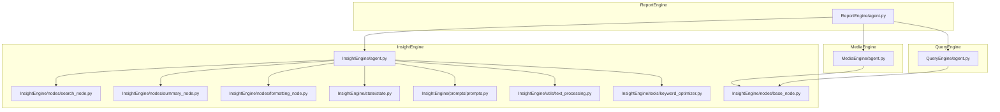
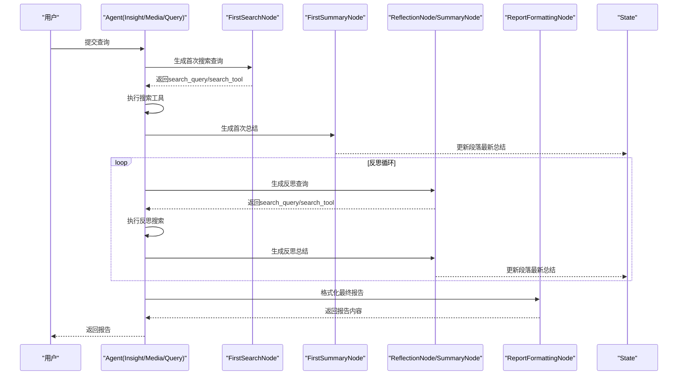
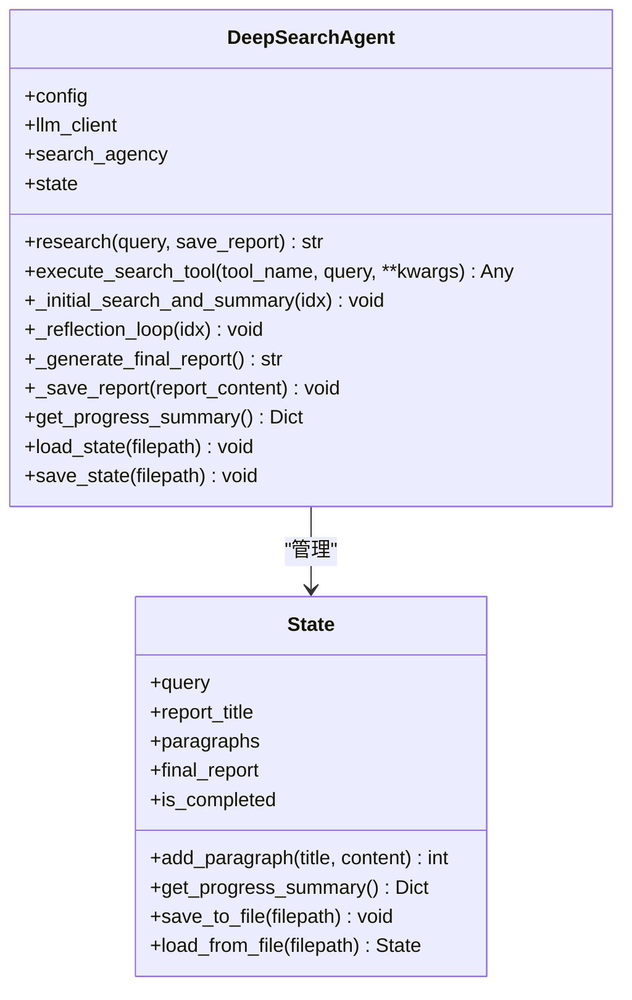
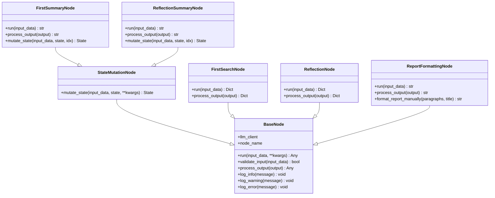
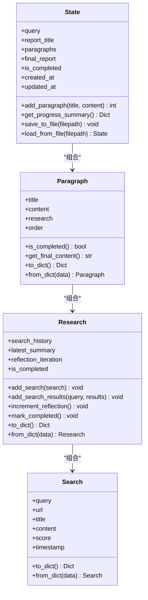
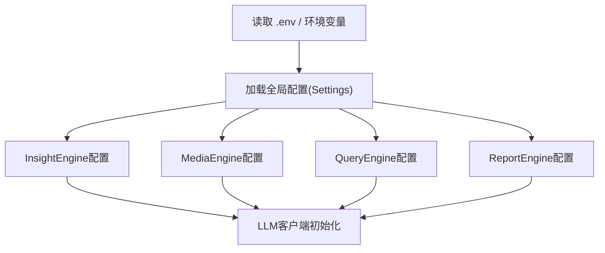
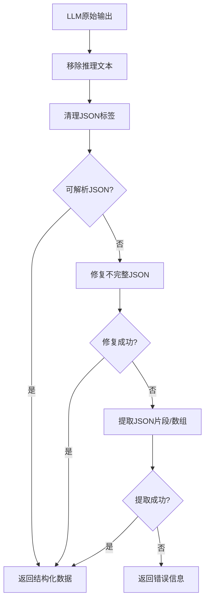
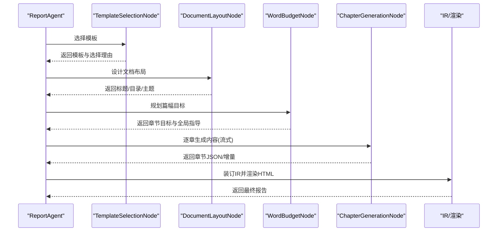
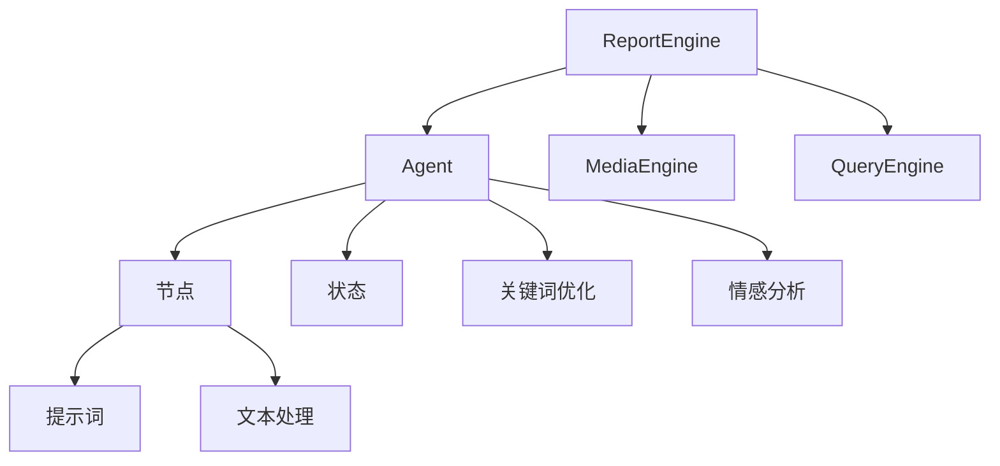

# 自定义引擎开发

<cite>
**本文档引用的文件**
- [InsightEngine/agent.py](file://InsightEngine/agent.py)
- [MediaEngine/agent.py](file://MediaEngine/agent.py)
- [QueryEngine/agent.py](file://QueryEngine/agent.py)
- [ReportEngine/agent.py](file://ReportEngine/agent.py)
- [InsightEngine/nodes/base_node.py](file://InsightEngine/nodes/base_node.py)
- [InsightEngine/state/state.py](file://InsightEngine/state/state.py)
- [InsightEngine/nodes/search_node.py](file://InsightEngine/nodes/search_node.py)
- [InsightEngine/nodes/summary_node.py](file://InsightEngine/nodes/summary_node.py)
- [InsightEngine/nodes/formatting_node.py](file://InsightEngine/nodes/formatting_node.py)
- [InsightEngine/utils/config.py](file://InsightEngine/utils/config.py)
- [config.py](file://config.py)
- [InsightEngine/prompts/prompts.py](file://InsightEngine/prompts/prompts.py)
- [InsightEngine/utils/text_processing.py](file://InsightEngine/utils/text_processing.py)
- [InsightEngine/tools/keyword_optimizer.py](file://InsightEngine/tools/keyword_optimizer.py)
- [app.py](file://app.py)
</cite>

## 目录
1. [简介](#简介)
2. [项目结构](#项目结构)
3. [核心组件](#核心组件)
4. [架构总览](#架构总览)
5. [详细组件分析](#详细组件分析)
6. [依赖关系分析](#依赖关系分析)
7. [性能考量](#性能考量)
8. [故障排除指南](#故障排除指南)
9. [结论](#结论)
10. [附录](#附录)

## 简介
本指南面向希望在BettaFish系统基础上开发自定义分析引擎的工程师，系统讲解引擎架构设计原理、节点流水线构建与状态管理机制，提供从Agent类实现、节点链设计到数据流转控制的完整实践路径，并覆盖配置管理、性能优化与扩展性设计的最佳实践与调试技巧。

## 项目结构
BettaFish采用多引擎并行的架构，每个引擎（Insight、Media、Query）均包含独立的Agent、节点、状态、工具与提示词模块，ReportEngine作为顶层编排引擎负责整合三引擎输出并生成最终报告。整体结构清晰、职责分离，便于扩展与维护。

**图表来源**
- [InsightEngine/agent.py](file://InsightEngine/agent.py#L41-L94)
- [MediaEngine/agent.py](file://MediaEngine/agent.py#L26-L72)
- [QueryEngine/agent.py](file://QueryEngine/agent.py#L26-L74)
- [ReportEngine/agent.py](file://ReportEngine/agent.py#L190-L423)

**章节来源**
- [InsightEngine/agent.py](file://InsightEngine/agent.py#L41-L94)
- [MediaEngine/agent.py](file://MediaEngine/agent.py#L26-L72)
- [QueryEngine/agent.py](file://QueryEngine/agent.py#L26-L74)
- [ReportEngine/agent.py](file://ReportEngine/agent.py#L190-L423)

## 核心组件
- Agent类：负责编排节点、执行搜索工具、管理状态与报告生成，是引擎的控制中枢。
- 节点体系：基于BaseNode抽象，提供搜索、总结、格式化等处理节点，支持状态变更。
- 状态管理：通过State数据结构记录查询、段落、研究过程与最终报告，支持持久化与进度查询。
- 配置系统：集中管理LLM密钥、模型、搜索工具与行为参数，支持.env与环境变量。
- 提示词与文本处理：标准化LLM输出解析、JSON修复与Markdown清理，保障稳定性。
- 工具中间件：关键词优化、情感分析等，增强搜索质量与分析深度。

**章节来源**
- [InsightEngine/nodes/base_node.py](file://InsightEngine/nodes/base_node.py#L13-L95)
- [InsightEngine/state/state.py](file://InsightEngine/state/state.py#L142-L259)
- [InsightEngine/utils/config.py](file://InsightEngine/utils/config.py#L13-L45)
- [config.py](file://config.py#L23-L119)
- [InsightEngine/prompts/prompts.py](file://InsightEngine/prompts/prompts.py#L1-L627)
- [InsightEngine/utils/text_processing.py](file://InsightEngine/utils/text_processing.py#L1-L309)
- [InsightEngine/tools/keyword_optimizer.py](file://InsightEngine/tools/keyword_optimizer.py#L1-L298)

## 架构总览
引擎采用“Agent + 节点流水线 + 状态管理”的分层架构。Agent负责控制流与数据流，节点专注于单一职责的处理，状态贯穿全流程用于进度追踪与恢复。ReportEngine进一步聚合三引擎产物，完成最终报告的装订与渲染。

**图表来源**
- [InsightEngine/agent.py](file://InsightEngine/agent.py#L512-L547)
- [InsightEngine/nodes/search_node.py](file://InsightEngine/nodes/search_node.py#L45-L151)
- [InsightEngine/nodes/summary_node.py](file://InsightEngine/nodes/summary_node.py#L167-L196)
- [InsightEngine/nodes/formatting_node.py](file://InsightEngine/nodes/formatting_node.py#L50-L87)

## 详细组件分析

### Agent类设计与实现
- 控制流编排：Agent封装“生成报告结构 → 处理段落 → 生成最终报告 → 保存报告”的完整流程。
- 搜索工具集成：统一的execute_search_tool方法，支持多种工具与参数校验，内置关键词优化与情感分析中间件。
- 状态管理：通过State对象记录段落、研究历史、反思迭代与最终报告，支持进度查询与持久化。
- 反思循环：支持多次反思以提升内容质量，结合日期/平台参数与默认限制策略。

**图表来源**
- [InsightEngine/agent.py](file://InsightEngine/agent.py#L41-L94)
- [InsightEngine/state/state.py](file://InsightEngine/state/state.py#L142-L259)

**章节来源**
- [InsightEngine/agent.py](file://InsightEngine/agent.py#L512-L547)
- [InsightEngine/agent.py](file://InsightEngine/agent.py#L586-L807)
- [InsightEngine/state/state.py](file://InsightEngine/state/state.py#L142-L259)

### 节点流水线与数据流转
- 节点基类：BaseNode定义run与process_output接口，StateMutationNode扩展mutate_state用于状态变更。
- 搜索节点：FirstSearchNode与ReflectionNode分别生成首次与反思阶段的查询与工具选择，支持JSON Schema校验与输出修复。
- 总结节点：FirstSummaryNode与ReflectionSummaryNode负责生成与更新段落内容，支持HOST发言读取与JSON修复。
- 格式化节点：ReportFormattingNode将段落内容格式化为Markdown报告，提供备用手动格式化能力。

**图表来源**
- [InsightEngine/nodes/base_node.py](file://InsightEngine/nodes/base_node.py#L13-L95)
- [InsightEngine/nodes/search_node.py](file://InsightEngine/nodes/search_node.py#L21-L287)
- [InsightEngine/nodes/summary_node.py](file://InsightEngine/nodes/summary_node.py#L34-L363)
- [InsightEngine/nodes/formatting_node.py](file://InsightEngine/nodes/formatting_node.py#L20-L171)

**章节来源**
- [InsightEngine/nodes/search_node.py](file://InsightEngine/nodes/search_node.py#L45-L151)
- [InsightEngine/nodes/summary_node.py](file://InsightEngine/nodes/summary_node.py#L167-L363)
- [InsightEngine/nodes/formatting_node.py](file://InsightEngine/nodes/formatting_node.py#L50-L171)

### 状态管理机制
- 数据结构：Search、Research、Paragraph、State构成完整的状态树，支持序列化与反序列化。
- 进度追踪：提供进度摘要、完成状态与时间戳更新，便于前端展示与恢复。
- 持久化：支持将状态保存至文件，便于断点续跑与调试。

**图表来源**
- [InsightEngine/state/state.py](file://InsightEngine/state/state.py#L12-L259)

**章节来源**
- [InsightEngine/state/state.py](file://InsightEngine/state/state.py#L142-L259)

### 配置管理与扩展性
- 全局配置：集中管理LLM密钥、模型、搜索工具与行为参数，支持.env与环境变量自动加载。
- 引擎配置：各引擎独立的Settings类，支持API Key、Base URL、模型名与默认搜索限制等。
- 扩展点：新增引擎只需实现Agent、节点与状态适配，遵循统一接口即可无缝接入。

**图表来源**
- [config.py](file://config.py#L23-L119)
- [InsightEngine/utils/config.py](file://InsightEngine/utils/config.py#L13-L45)

**章节来源**
- [config.py](file://config.py#L23-L119)
- [InsightEngine/utils/config.py](file://InsightEngine/utils/config.py#L13-L45)

### 提示词与文本处理
- 提示词规范：定义输入/输出JSON Schema，确保LLM输出结构化与可解析。
- 文本处理：提供JSON标签清理、推理文本移除、不完整JSON修复与内容截断等工具函数。
- 关键词优化：通过KeywordOptimizer将Agent生成的查询优化为更适合舆情数据库的关键词。

**图表来源**
- [InsightEngine/utils/text_processing.py](file://InsightEngine/utils/text_processing.py#L85-L134)
- [InsightEngine/prompts/prompts.py](file://InsightEngine/prompts/prompts.py#L1-L627)

**章节来源**
- [InsightEngine/prompts/prompts.py](file://InsightEngine/prompts/prompts.py#L1-L627)
- [InsightEngine/utils/text_processing.py](file://InsightEngine/utils/text_processing.py#L1-L309)
- [InsightEngine/tools/keyword_optimizer.py](file://InsightEngine/tools/keyword_optimizer.py#L63-L148)

### ReportEngine编排与扩展
- 编排流程：模板选择 → 文档布局 → 篇幅规划 → 章节生成 → IR装订 → HTML渲染。
- GraphRAG集成：可选启用知识图谱构建与查询，增强章节内容的上下文与一致性。
- 流式事件：通过回调与SSE向前端实时推送阶段与章节增量输出。

**图表来源**
- [ReportEngine/agent.py](file://ReportEngine/agent.py#L424-L800)

**章节来源**
- [ReportEngine/agent.py](file://ReportEngine/agent.py#L424-L800)

## 依赖关系分析
- Agent依赖节点与状态：Agent通过节点执行处理逻辑并将结果写入状态。
- 节点依赖LLM与提示词：节点通过LLMClient调用系统提示词，确保输出结构化。
- 工具中间件：关键词优化与情感分析作为Agent的前置/后置处理，提升搜索质量与分析深度。
- ReportEngine依赖三引擎：通过接口与文件监听获取各引擎产物，完成最终报告。

**图表来源**
- [InsightEngine/agent.py](file://InsightEngine/agent.py#L87-L94)
- [InsightEngine/nodes/base_node.py](file://InsightEngine/nodes/base_node.py#L13-L95)
- [InsightEngine/prompts/prompts.py](file://InsightEngine/prompts/prompts.py#L1-L627)
- [InsightEngine/utils/text_processing.py](file://InsightEngine/utils/text_processing.py#L1-L309)
- [InsightEngine/tools/keyword_optimizer.py](file://InsightEngine/tools/keyword_optimizer.py#L1-L298)
- [ReportEngine/agent.py](file://ReportEngine/agent.py#L190-L423)

**章节来源**
- [InsightEngine/agent.py](file://InsightEngine/agent.py#L87-L94)
- [ReportEngine/agent.py](file://ReportEngine/agent.py#L190-L423)

## 性能考量
- 搜索结果采样与聚类：InsightEngine提供聚类采样策略，控制LLM输入规模，平衡覆盖率与效率。
- 结果数量限制：通过配置项限制传递给LLM的搜索结果数量，避免上下文溢出。
- JSON解析与修复：文本处理模块提供稳健的JSON修复策略，降低解析失败对吞吐的影响。
- GraphRAG查询次数：可配置每章GraphRAG查询次数上限，避免过度依赖外部查询影响性能。
- 日志与I/O：ReportEngine采用行缓冲与实时写入，确保前端SSE实时性，同时避免频繁刷盘。

**章节来源**
- [InsightEngine/agent.py](file://InsightEngine/agent.py#L129-L189)
- [InsightEngine/utils/config.py](file://InsightEngine/utils/config.py#L25-L37)
- [InsightEngine/utils/text_processing.py](file://InsightEngine/utils/text_processing.py#L136-L220)
- [config.py](file://config.py#L79-L81)
- [ReportEngine/agent.py](file://ReportEngine/agent.py#L315-L335)

## 故障排除指南
- LLM输出解析失败：利用文本处理模块的JSON修复与提取逻辑，必要时降级为手动格式化。
- 搜索工具参数错误：Agent内置参数校验与默认值策略，确保工具调用稳定。
- 情感分析不可用：提供禁用与降级策略，保证流程不中断。
- 状态持久化问题：通过状态对象的序列化/反序列化接口进行调试与恢复。
- 前端实时输出：检查SocketIO与SSE配置，确认日志写入与事件回调正常。

**章节来源**
- [InsightEngine/utils/text_processing.py](file://InsightEngine/utils/text_processing.py#L85-L134)
- [InsightEngine/nodes/formatting_node.py](file://InsightEngine/nodes/formatting_node.py#L118-L171)
- [InsightEngine/agent.py](file://InsightEngine/agent.py#L609-L672)
- [InsightEngine/state/state.py](file://InsightEngine/state/state.py#L248-L259)
- [ReportEngine/agent.py](file://ReportEngine/agent.py#L648-L662)

## 结论
BettaFish的引擎体系以Agent为核心，通过标准化的节点流水线与强健的状态管理，实现了可扩展、可观测、可恢复的分析流程。开发者可基于现有接口快速实现自定义引擎，结合配置系统与工具中间件，满足多样化场景需求。ReportEngine进一步提供了跨引擎编排能力，使多源数据融合与最终报告生成成为可能。

## 附录
- 开发最佳实践
  - 严格遵循节点接口与JSON Schema，确保输出可解析。
  - 使用状态对象记录关键中间结果，便于调试与恢复。
  - 合理配置搜索限制与采样策略，平衡质量与性能。
  - 为关键流程提供降级与回退策略，提升鲁棒性。
- 调试技巧
  - 利用状态持久化与进度摘要接口定位问题节点。
  - 通过文本处理模块的日志与错误信息快速定位解析失败点。
  - 在Agent中开启详细日志，配合前端SSE观察实时进展。