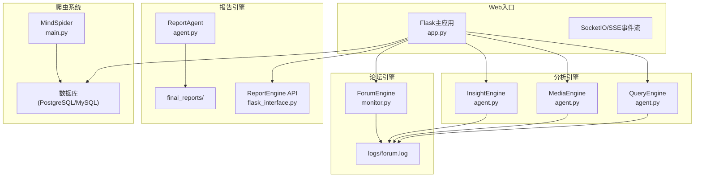
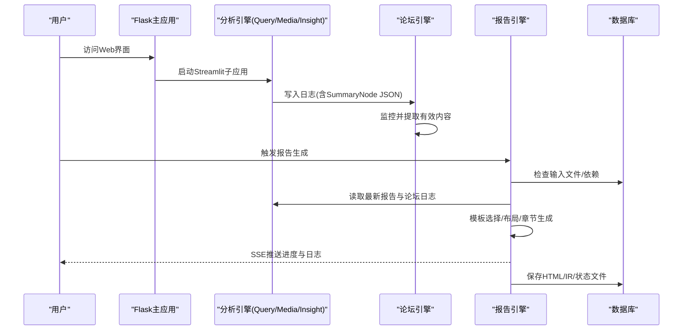
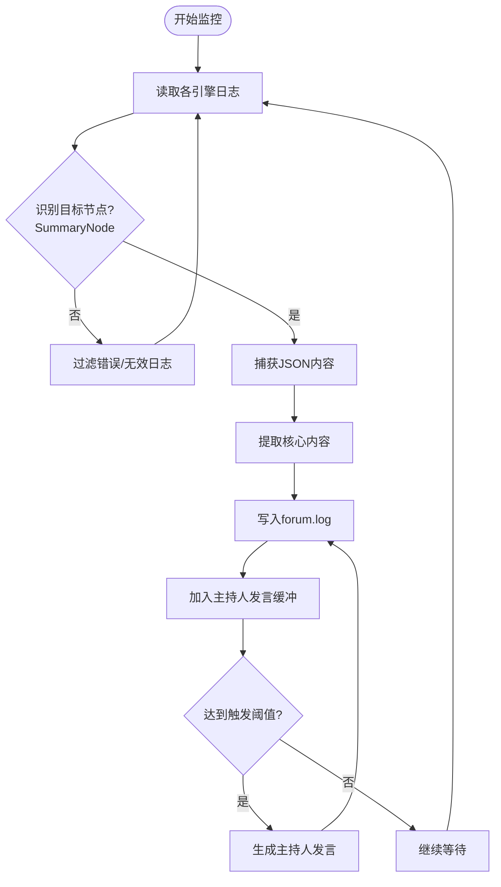
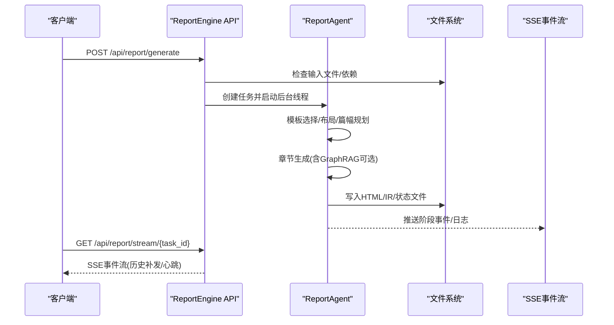
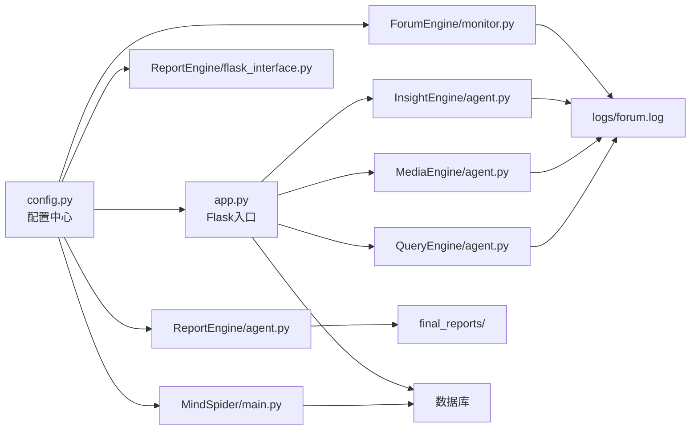

# 故障排除与FAQ

<cite>
**本文引用的文件**
- [README.md](file://README.md)
- [app.py](file://app.py)
- [config.py](file://config.py)
- [docker-compose.yml](file://docker-compose.yml)
- [requirements.txt](file://requirements.txt)
- [utils/retry_helper.py](file://utils/retry_helper.py)
- [utils/github_issues.py](file://utils/github_issues.py)
- [utils/knowledge_logger.py](file://utils/knowledge_logger.py)
- [ForumEngine/monitor.py](file://ForumEngine/monitor.py)
- [ReportEngine/flask_interface.py](file://ReportEngine/flask_interface.py)
- [ReportEngine/agent.py](file://ReportEngine/agent.py)
- [MindSpider/main.py](file://MindSpider/main.py)
- [tests/test_monitor.py](file://tests/test_monitor.py)
- [logs/forum_example.log](file://logs/forum_example.log)
- [logs/insight_example.log](file://logs/insight_example.log)
- [logs/media_example.log](file://logs/media_example.log)
- [logs/query_example.log](file://logs/query_example.log)
- [logs/report_example.log](file://logs/report_example.log)
</cite>

## 目录
1. [简介](#简介)
2. [项目结构](#项目结构)
3. [核心组件](#核心组件)
4. [架构总览](#架构总览)
5. [详细组件分析](#详细组件分析)
6. [依赖关系分析](#依赖关系分析)
7. [性能考虑](#性能考虑)
8. [故障排除指南](#故障排除指南)
9. [结论](#结论)
10. [附录](#附录)

## 简介
本指南面向BettaFish系统的使用者与维护者，提供系统化的故障排除与常见问题解答。内容涵盖部署问题、配置错误、性能问题与功能异常的诊断方法、日志分析技巧与调试工具使用指南，并提供社区支持渠道、问题反馈流程与最佳实践建议。

## 项目结构
BettaFish采用多引擎协作架构，包含三个分析引擎（QueryEngine、MediaEngine、InsightEngine）、论坛引擎（ForumEngine）、报告引擎（ReportEngine）、爬虫系统（MindSpider）以及统一的Web入口（Flask + Streamlit）。系统通过日志文件与SSE事件流实现组件间通信与状态可视化。

**图表来源**
- [app.py](file://app.py#L1-L800)
- [ForumEngine/monitor.py](file://ForumEngine/monitor.py#L1-L800)
- [ReportEngine/flask_interface.py](file://ReportEngine/flask_interface.py#L1-L800)
- [ReportEngine/agent.py](file://ReportEngine/agent.py#L1-L800)
- [MindSpider/main.py](file://MindSpider/main.py#L1-L520)

**章节来源**
- [README.md](file://README.md#L86-L120)
- [app.py](file://app.py#L1-L800)

## 核心组件
- 配置管理：集中于config.py，支持从.env与环境变量自动加载，涵盖数据库、LLM、搜索工具、GraphRAG等配置项。
- Web入口：Flask主应用负责启动三个Streamlit子应用、论坛监控、报告引擎接口与日志转发。
- 论坛引擎：监控三个分析引擎的日志，提取SummaryNode输出，生成主持人引导，形成Agent协作的“论坛”。
- 报告引擎：提供HTTP/SSE接口，负责模板选择、布局设计、章节生成、IR装订与HTML渲染。
- 爬虫系统：MindSpider负责话题提取与深度情感爬取，自动初始化数据库并管理依赖。

**章节来源**
- [config.py](file://config.py#L23-L136)
- [app.py](file://app.py#L1-L800)
- [ForumEngine/monitor.py](file://ForumEngine/monitor.py#L1-L800)
- [ReportEngine/flask_interface.py](file://ReportEngine/flask_interface.py#L1-L800)
- [MindSpider/main.py](file://MindSpider/main.py#L1-L520)

## 架构总览
系统通过统一的Flask入口协调各子系统，利用日志文件与SSE事件实现状态同步与可视化。ReportEngine通过SSE向前端推送实时日志与进度，MindSpider负责数据采集与数据库初始化。

**图表来源**
- [app.py](file://app.py#L276-L348)
- [ForumEngine/monitor.py](file://ForumEngine/monitor.py#L584-L702)
- [ReportEngine/flask_interface.py](file://ReportEngine/flask_interface.py#L407-L434)
- [ReportEngine/agent.py](file://ReportEngine/agent.py#L424-L800)

## 详细组件分析

### 配置与环境
- 配置加载：config.py使用pydantic-settings自动从.env与环境变量加载，支持运行时重载。
- 数据库配置：支持PostgreSQL与MySQL，包含连接参数与字符集设置。
- LLM配置：为各引擎提供API Key、Base URL与模型名称，支持GraphRAG开关与查询次数。
- 搜索工具：支持AnspireAPI与BochaAPI，提供Tavily等搜索能力。

**章节来源**
- [config.py](file://config.py#L23-L136)
- [README.md](file://README.md#L313-L335)

### Web入口与进程管理
- 进程启动：启动三个Streamlit子应用与论坛监控，写入实时日志并通过SSE推送。
- 健康检查：通过Streamlit健康检查端点判断子应用状态。
- 日志管理：统一写入logs目录，支持按应用分类与实时输出。

**章节来源**
- [app.py](file://app.py#L276-L348)
- [app.py](file://app.py#L578-L800)

### 论坛引擎（ForumEngine）
- 目标识别：仅捕获SummaryNode输出，过滤SearchNode等非目标节点与错误日志。
- JSON解析：支持旧格式[HH:MM:SS]与新格式loguru时间戳，自动修复与提取JSON内容。
- 主持人引导：每N条Agent发言触发一次主持人生成，写入forum.log供前端展示。

**图表来源**
- [ForumEngine/monitor.py](file://ForumEngine/monitor.py#L138-L209)
- [ForumEngine/monitor.py](file://ForumEngine/monitor.py#L425-L522)
- [ForumEngine/monitor.py](file://ForumEngine/monitor.py#L524-L560)

**章节来源**
- [ForumEngine/monitor.py](file://ForumEngine/monitor.py#L1-L800)
- [tests/test_monitor.py](file://tests/test_monitor.py#L1-L341)

### 报告引擎（ReportEngine）
- 接口设计：提供/status、/generate、/stream等REST接口，支持SSE事件流。
- 任务管理：ReportTask封装状态、进度、事件历史，支持断线重连与心跳。
- 生成流程：模板选择→布局设计→篇幅规划→章节生成→IR装订→HTML渲染。
- GraphRAG：可选启用，基于state与forum日志构建知识图谱并增强章节生成。

**图表来源**
- [ReportEngine/flask_interface.py](file://ReportEngine/flask_interface.py#L605-L704)
- [ReportEngine/flask_interface.py](file://ReportEngine/flask_interface.py#L750-L804)
- [ReportEngine/agent.py](file://ReportEngine/agent.py#L424-L800)

**章节来源**
- [ReportEngine/flask_interface.py](file://ReportEngine/flask_interface.py#L1-L800)
- [ReportEngine/agent.py](file://ReportEngine/agent.py#L1-L800)

### 爬虫系统（MindSpider）
- 初始化：检查配置、依赖与数据库连接，自动初始化表结构。
- 工作流：BroadTopicExtraction→DeepSentimentCrawling，支持指定日期、平台与测试模式。
- 依赖管理：自动安装MediaCrawler子模块依赖并使用标记文件避免重复安装。

**章节来源**
- [MindSpider/main.py](file://MindSpider/main.py#L1-L520)

## 依赖关系分析
系统依赖关系主要体现在配置、日志与接口层面：

**图表来源**
- [config.py](file://config.py#L23-L136)
- [app.py](file://app.py#L1-L800)
- [ReportEngine/flask_interface.py](file://ReportEngine/flask_interface.py#L1-L800)
- [ReportEngine/agent.py](file://ReportEngine/agent.py#L1-L800)
- [ForumEngine/monitor.py](file://ForumEngine/monitor.py#L1-L800)
- [MindSpider/main.py](file://MindSpider/main.py#L1-L520)

**章节来源**
- [requirements.txt](file://requirements.txt#L1-L91)
- [docker-compose.yml](file://docker-compose.yml#L1-L40)

## 性能考虑
- 网络重试：retry_helper提供指数退避与最大重试次数，降低瞬时网络抖动影响。
- 日志写入：ReportAgent配置行缓冲与同步写入，确保前端实时日志。
- 进程管理：健康检查与Grace Period避免误判，减少不必要的重启。
- 依赖检测：ReportEngine在初始化时检测PDF导出依赖，提前暴露缺失项。

**章节来源**
- [utils/retry_helper.py](file://utils/retry_helper.py#L1-L248)
- [ReportEngine/agent.py](file://ReportEngine/agent.py#L254-L335)
- [app.py](file://app.py#L778-L800)
- [ReportEngine/flask_interface.py](file://ReportEngine/flask_interface.py#L262-L267)

## 故障排除指南

### 部署与环境问题
- Docker镜像拉取缓慢
  - 使用备用镜像地址替换docker-compose.yml中的镜像源，或切换国内镜像。
  - 确认端口映射：Flask 5000、Streamlit 8501/8502/8503。
  - 检查卷挂载：logs、final_reports、.env、三个引擎报告目录。
  
  **章节来源**
  - [README.md](file://README.md#L301-L312)
  - [docker-compose.yml](file://docker-compose.yml#L1-L40)

- 源码部署依赖缺失
  - 安装requirements.txt中依赖，注意PDF导出依赖（weasyprint）需系统级依赖。
  - Playwright浏览器驱动：执行playwright install chromium。
  - Python版本：建议3.9+，Conda或uv环境。
  
  **章节来源**
  - [README.md](file://README.md#L365-L381)
  - [README.md](file://README.md#L382-L387)

- 数据库连接失败
  - 检查DB_DIALECT、DB_HOST、DB_PORT、DB_USER、DB_PASSWORD、DB_NAME、DB_CHARSET。
  - 使用MindSpider初始化数据库表，或在Flask入口中初始化。
  
  **章节来源**
  - [config.py](file://config.py#L32-L40)
  - [MindSpider/main.py](file://MindSpider/main.py#L101-L138)
  - [app.py](file://app.py#L281-L286)

### 配置错误
- LLM API配置不正确
  - 确认INSIGHT_ENGINE_*、MEDIA_ENGINE_*、QUERY_ENGINE_*、REPORT_ENGINE_*、FORUM_HOST_*、KEYWORD_OPTIMIZER_*的API Key、Base URL与模型名称。
  - GraphRAG开关与查询次数：GRAPHRAG_ENABLED、GRAPHRAG_MAX_QUERIES。
  
  **章节来源**
  - [config.py](file://config.py#L44-L82)
  - [config.py](file://config.py#L79-L82)

- 搜索工具配置
  - SEARCH_TOOL_TYPE选择AnspireAPI或BochaAPI，分别配置相应API Key与Base URL。
  - Tavily API Key用于网络搜索。
  
  **章节来源**
  - [config.py](file://config.py#L84-L95)

### 功能异常
- 报告生成失败
  - 检查/status接口确认输入文件是否就绪（insight/media/query报告与forum.log）。
  - 查看SSE事件流中的阶段与警告信息，关注章节JSON解析失败与重试策略。
  - 如遇ChapterJsonParseError，考虑更换更强算力的LLM或调整上下文长度。
  
  **章节来源**
  - [ReportEngine/flask_interface.py](file://ReportEngine/flask_interface.py#L578-L603)
  - [ReportEngine/flask_interface.py](file://ReportEngine/flask_interface.py#L496-L515)
  - [ReportEngine/agent.py](file://ReportEngine/agent.py#L722-L755)

- 论坛内容不显示
  - 确认三个分析引擎日志中包含SummaryNode输出（FirstSummaryNode或ReflectionSummaryNode）。
  - 检查forum.log是否被清空或写入权限问题。
  - 验证日志格式：支持旧格式[HH:MM:SS]与新格式loguru时间戳。
  
  **章节来源**
  - [ForumEngine/monitor.py](file://ForumEngine/monitor.py#L138-L209)
  - [ForumEngine/monitor.py](file://ForumEngine/monitor.py#L425-L522)
  - [tests/test_monitor.py](file://tests/test_monitor.py#L28-L45)

- 爬虫工作流失败
  - 检查MindSpider配置与依赖，确保数据库表存在或自动初始化成功。
  - 指定日期格式YYYY-MM-DD，平台参数在允许范围内。
  - 关注超时与返回码，必要时启用测试模式减少数据量。
  
  **章节来源**
  - [MindSpider/main.py](file://MindSpider/main.py#L47-L69)
  - [MindSpider/main.py](file://MindSpider/main.py#L257-L295)
  - [MindSpider/main.py](file://MindSpider/main.py#L296-L347)

### 日志分析与调试
- 日志目录与文件
  - logs/目录包含insight.log、media.log、query.log、forum.log、report_example.log等。
  - 使用SSE事件流实时查看ReportEngine日志，过滤其他引擎日志。
  
  **章节来源**
  - [ReportEngine/flask_interface.py](file://ReportEngine/flask_interface.py#L48-L72)
  - [ReportEngine/agent.py](file://ReportEngine/agent.py#L268-L292)

- 知识图谱查询日志
  - knowledge_query.log记录GraphRAG查询关键词与请求数据，便于追踪GraphRAG异常。
  
  **章节来源**
  - [utils/knowledge_logger.py](file://utils/knowledge_logger.py#L1-L96)

- 重试机制与网络抖动
  - retry_helper提供可配置的重试策略，支持最大重试次数、初始延迟与退避因子。
  
  **章节来源**
  - [utils/retry_helper.py](file://utils/retry_helper.py#L1-L248)

### 问题反馈与社区支持
- 提交GitHub Issue
  - 使用utils/github_issues.py生成带链接的Issue模板，自动填充标题与环境信息。
  
  **章节来源**
  - [utils/github_issues.py](file://utils/github_issues.py#L1-L81)

- 社区支持渠道
  - Issues页面：https://github.com/666ghj/BettaFish/issues
  - Discussions页面：https://github.com/666ghj/BettaFish/discussions
  
  **章节来源**
  - [README.md](file://README.md#L769-L776)

### 最佳实践建议
- 配置管理
  - 使用.env文件集中管理配置，避免硬编码；定期备份.env。
- 日志管理
  - 启用实时日志写入，合理设置日志级别；定期清理旧日志避免磁盘占用。
- 性能优化
  - 合理设置LLM模型与上下文长度，避免过度重试；使用GraphRAG提升章节生成质量但注意查询次数限制。
- 稳定性
  - 使用健康检查与Grace Period；对关键API调用使用重试装饰器；确保数据库连接池参数合理。

**章节来源**
- [config.py](file://config.py#L110-L115)
- [utils/retry_helper.py](file://utils/retry_helper.py#L228-L248)
- [ReportEngine/flask_interface.py](file://ReportEngine/flask_interface.py#L262-L267)

## 结论
通过本故障排除与FAQ文档，用户可以系统性地诊断与解决BettaFish部署、配置、性能与功能异常问题。建议在日常运维中遵循最佳实践，充分利用日志分析与SSE事件流，结合社区支持渠道及时反馈问题，确保系统稳定高效运行。

## 附录
- 示例日志文件：logs/目录下包含forum_example.log、insight_example.log、media_example.log、query_example.log、report_example.log，可作为日志格式与内容的参考。
- 命令行工具：report_engine_only.py支持跳过分析引擎直接生成报告，便于调试与重试。

**章节来源**
- [logs/forum_example.log](file://logs/forum_example.log)
- [logs/insight_example.log](file://logs/insight_example.log)
- [logs/media_example.log](file://logs/media_example.log)
- [logs/query_example.log](file://logs/query_example.log)
- [logs/report_example.log](file://logs/report_example.log)
- [README.md](file://README.md#L496-L521)