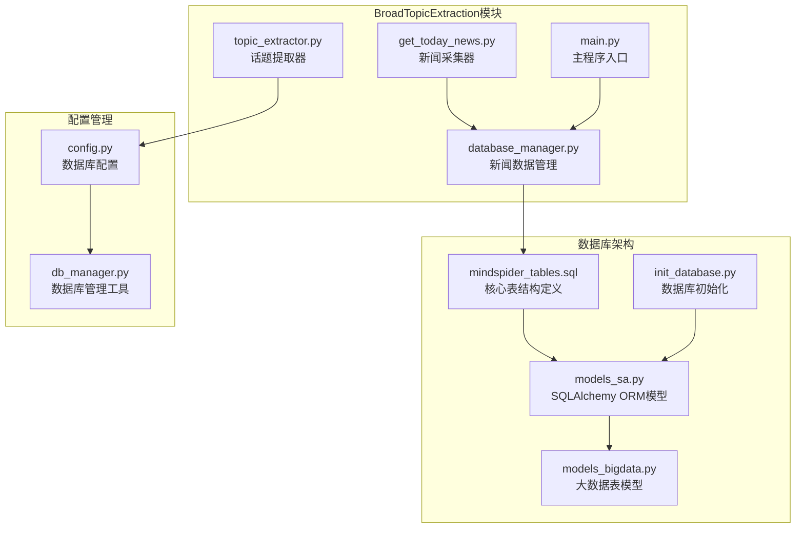
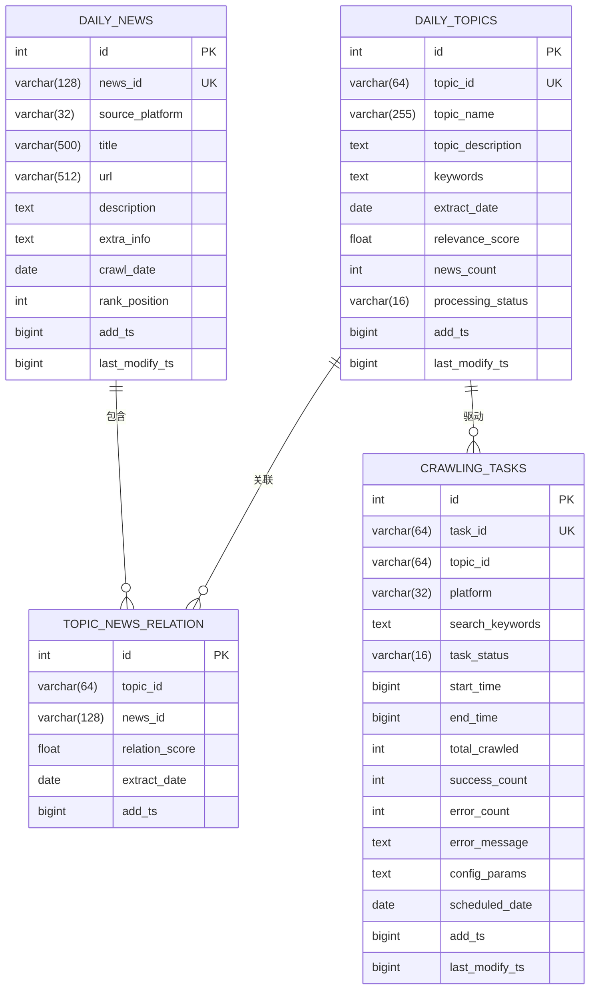
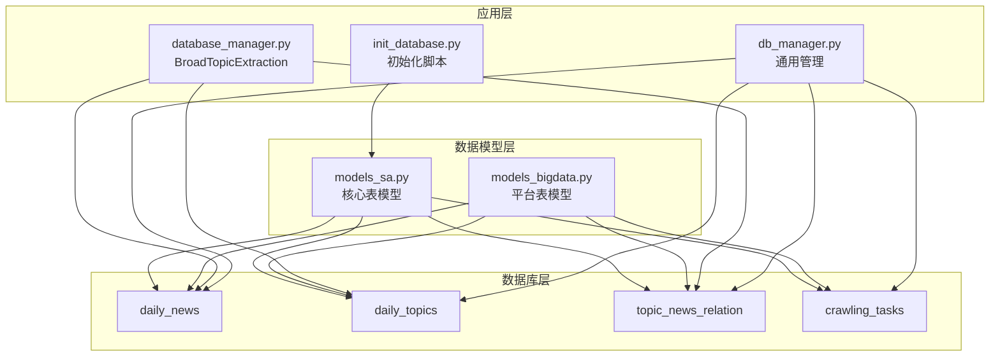
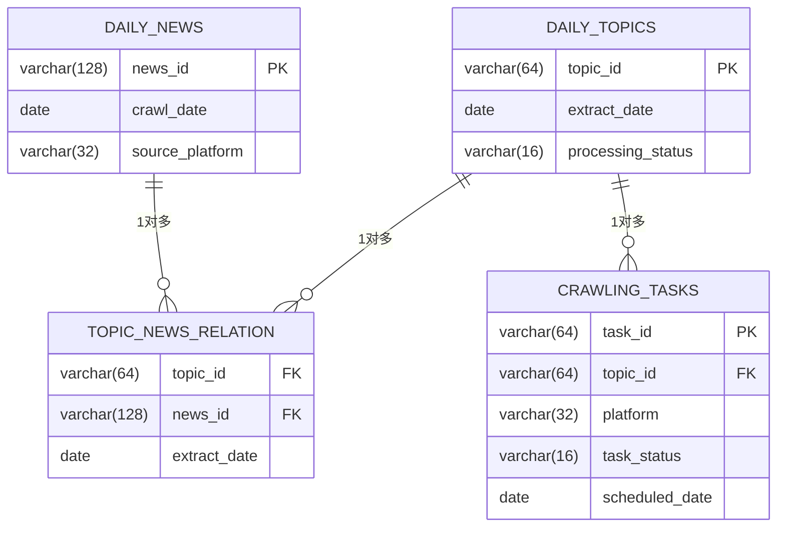

# MindSpider数据库设计

<cite>
**本文档引用的文件**
- [mindspider_tables.sql](file://MindSpider/schema/mindspider_tables.sql)
- [models_sa.py](file://MindSpider/schema/models_sa.py)
- [models_bigdata.py](file://MindSpider/schema/models_bigdata.py)
- [db_manager.py](file://MindSpider/schema/db_manager.py)
- [init_database.py](file://MindSpider/schema/init_database.py)
- [database_manager.py](file://MindSpider/BroadTopicExtraction/database_manager.py)
- [config.py](file://MindSpider/config.py)
- [main.py](file://MindSpider/main.py)
</cite>

## 目录
1. [简介](#简介)
2. [项目结构](#项目结构)
3. [核心组件](#核心组件)
4. [架构概览](#架构概览)
5. [详细组件分析](#详细组件分析)
6. [依赖关系分析](#依赖关系分析)
7. [性能考虑](#性能考虑)
8. [故障排除指南](#故障排除指南)
9. [结论](#结论)
10. [附录](#附录)

## 简介

MindSpider AI爬虫系统是一个基于Python开发的综合性网络爬虫平台，专门用于热点新闻采集、话题提取和深度情感分析。本文档详细介绍了BroadTopicExtraction模块的数据库架构设计，包括四个核心表的设计原理、表结构定义、索引策略、外键约束和数据完整性保证。

该数据库设计采用MySQL 8.0+和PostgreSQL 13+双引擎支持，通过SQLAlchemy ORM框架实现数据模型的统一管理。系统支持实时新闻采集、智能话题提取、任务调度和数据分析等功能。

## 项目结构

MindSpider项目的数据库相关文件主要分布在以下目录：



**图表来源**
- [mindspider_tables.sql](file://MindSpider/schema/mindspider_tables.sql#L1-L202)
- [models_sa.py](file://MindSpider/schema/models_sa.py#L1-L127)
- [models_bigdata.py](file://MindSpider/schema/models_bigdata.py#L1-L468)

**章节来源**
- [mindspider_tables.sql](file://MindSpider/schema/mindspider_tables.sql#L1-L202)
- [config.py](file://MindSpider/config.py#L1-L36)

## 核心组件

### 四大核心表设计

系统包含四个核心表，每个表都有明确的业务职责和设计原则：

#### daily_news - 每日新闻表
存储从各新闻源获取的热点新闻数据，支持跨平台、跨日期的新闻聚合。

#### daily_topics - 每日话题表  
存储通过AI分析提取的每日话题信息，包括关键词、描述和相关性评分。

#### topic_news_relation - 话题新闻关联表
建立话题与新闻之间的多对多关系，支持复杂的关联查询和统计分析。

#### crawling_tasks - 爬取任务表
记录基于话题的平台爬取任务，支持任务状态跟踪和执行监控。

**章节来源**
- [mindspider_tables.sql](file://MindSpider/schema/mindspider_tables.sql#L12-L106)
- [models_sa.py](file://MindSpider/schema/models_sa.py#L31-L124)

## 架构概览



**图表来源**
- [mindspider_tables.sql](file://MindSpider/schema/mindspider_tables.sql#L12-L106)
- [models_sa.py](file://MindSpider/schema/models_sa.py#L31-L124)

## 详细组件分析

### daily_news - 每日新闻表

#### 字段定义
- **id**: 自增主键，用于内部标识
- **news_id**: 新闻唯一ID，结合日期确保全局唯一性
- **source_platform**: 新闻源平台标识，支持多平台扩展
- **title**: 新闻标题，长度限制500字符
- **url**: 新闻链接，支持512字符
- **description**: 新闻描述或摘要
- **extra_info**: 额外信息，JSON格式存储
- **crawl_date**: 爬取日期，用于时间维度分析
- **rank_position**: 在热榜中的排名位置
- **add_ts/last_modify_ts**: 时间戳字段，记录添加和修改时间

#### 索引策略
- 唯一索引：`(news_id, source_platform, crawl_date)` - 防止重复数据
- 普通索引：`crawl_date`、`source_platform`、`rank_position` - 支持常用查询

#### 设计特点
- 支持跨平台新闻聚合，通过`source_platform`字段区分不同平台
- 通过日期组合确保同一新闻在不同日期的唯一性
- 支持热榜排名追踪，便于分析新闻热度变化

**章节来源**
- [mindspider_tables.sql](file://MindSpider/schema/mindspider_tables.sql#L12-L30)
- [models_sa.py](file://MindSpider/schema/models_sa.py#L31-L51)

### daily_topics - 每日话题表

#### 字段定义
- **id**: 自增主键
- **topic_id**: 话题唯一ID，格式为`summary_{YYYYMMDD}`
- **topic_name**: 话题名称，默认"每日新闻分析"
- **topic_description**: 话题描述，存储AI生成的分析总结
- **keywords**: 话题关键词，JSON格式存储
- **extract_date**: 话题提取日期
- **relevance_score**: 相关性得分，用于话题质量评估
- **news_count**: 关联的新闻数量
- **processing_status**: 处理状态，支持四种状态转换
- **add_ts/last_modify_ts**: 时间戳字段

#### 索引策略
- 唯一索引：`(topic_id, extract_date)` - 确保每日话题唯一性
- 普通索引：`extract_date`、`processing_status`、`relevance_score` - 支持状态查询和排序

#### 状态管理
处理状态遵循以下生命周期：
- **pending**: 待处理
- **processing**: 处理中  
- **completed**: 处理完成
- **failed**: 处理失败

**章节来源**
- [mindspider_tables.sql](file://MindSpider/schema/mindspider_tables.sql#L36-L54)
- [models_sa.py](file://MindSpider/schema/models_sa.py#L54-L75)

### topic_news_relation - 话题新闻关联表

#### 字段定义
- **id**: 自增主键
- **topic_id**: 关联话题ID
- **news_id**: 关联新闻ID  
- **relation_score**: 关联度得分
- **extract_date**: 关联提取日期
- **add_ts**: 添加时间戳

#### 索引策略
- 唯一索引：`(topic_id, news_id, extract_date)` - 防止重复关联
- 普通索引：`topic_id`、`news_id`、`extract_date` - 支持双向查询

#### 外键约束
- `topic_id` → `daily_topics(topic_id)` ON DELETE CASCADE
- `news_id` → `daily_news(news_id)` ON DELETE CASCADE

#### 设计优势
- 支持多对多关系，一个话题可关联多条新闻，一条新闻可属于多个话题
- 通过日期字段支持历史关联关系的追踪
- 级联删除确保数据一致性

**章节来源**
- [mindspider_tables.sql](file://MindSpider/schema/mindspider_tables.sql#L60-L75)
- [models_sa.py](file://MindSpider/schema/models_sa.py#L78-L94)

### crawling_tasks - 爬取任务表

#### 字段定义
- **id**: 自增主键
- **task_id**: 任务唯一ID，格式为`task_{YYYYMMDD}_{platform}`
- **topic_id**: 关联话题ID
- **platform**: 目标平台标识
- **search_keywords**: 搜索关键词，JSON格式存储
- **task_status**: 任务状态，支持五种状态
- **start_time/end_time**: 任务执行时间戳
- **total_crawled/success_count/error_count**: 统计指标
- **error_message**: 错误信息
- **config_params**: 爬取配置参数
- **scheduled_date**: 计划执行日期
- **add_ts/last_modify_ts**: 时间戳字段

#### 索引策略
- 唯一索引：`task_id` - 确保任务唯一性
- 普通索引：`topic_id`、`platform`、`task_status`、`scheduled_date` - 支持多维查询

#### 状态管理
任务状态遵循以下生命周期：
- **pending**: 待执行
- **running**: 执行中
- **completed**: 执行完成
- **failed**: 执行失败
- **paused**: 暂停

#### 外键约束
- `topic_id` → `daily_topics(topic_id)` ON DELETE CASCADE

**章节来源**
- [mindspider_tables.sql](file://MindSpider/schema/mindspider_tables.sql#L81-L106)
- [models_sa.py](file://MindSpider/schema/models_sa.py#L97-L124)

### 视图设计

#### v_topic_crawling_stats - 话题爬取统计视图
提供按话题维度的任务执行统计，包括：
- 总任务数、已完成任务数、失败任务数
- 总爬取内容数、成功爬取数、错误数
- 支持按状态和日期进行分组统计

#### v_daily_summary - 每日数据统计视图
提供每日整体数据概览：
- 当日新闻总数
- 覆盖平台数量
- 当日提取话题数
- 当日创建任务数

**章节来源**
- [mindspider_tables.sql](file://MindSpider/schema/mindspider_tables.sql#L154-L181)

## 依赖关系分析



**图表来源**
- [models_sa.py](file://MindSpider/schema/models_sa.py#L1-L127)
- [models_bigdata.py](file://MindSpider/schema/models_bigdata.py#L1-L468)
- [database_manager.py](file://MindSpider/BroadTopicExtraction/database_manager.py#L1-L323)
- [db_manager.py](file://MindSpider/schema/db_manager.py#L1-L299)

### 外键关系图



**图表来源**
- [mindspider_tables.sql](file://MindSpider/schema/mindspider_tables.sql#L73-L105)

**章节来源**
- [mindspider_tables.sql](file://MindSpider/schema/mindspider_tables.sql#L73-L105)
- [models_sa.py](file://MindSpider/schema/models_sa.py#L80-L106)

## 性能考虑

### 索引优化策略

#### 核心索引设计
1. **唯一索引**：确保数据完整性，防止重复记录
2. **复合索引**：针对高频查询场景优化查询性能
3. **外键索引**：支持关联查询的高效执行

#### 查询优化建议
- **日期范围查询**：利用`crawl_date`和`extract_date`索引
- **状态过滤**：使用`processing_status`和`task_status`索引
- **平台筛选**：通过`source_platform`和`platform`索引快速定位
- **排名查询**：利用`rank_position`索引进行热点排序

### 数据保留策略

#### 建议的数据保留周期
- **新闻数据**：30-90天
- **话题数据**：180-365天  
- **任务数据**：90-180天
- **统计视图**：长期保留

#### 清理策略
```sql
-- 示例：清理90天前的数据
DELETE FROM daily_news WHERE crawl_date < DATE_SUB(CURDATE(), INTERVAL 90 DAY);
DELETE FROM daily_topics WHERE extract_date < DATE_SUB(CURDATE(), INTERVAL 90 DAY);
DELETE FROM crawling_tasks WHERE scheduled_date < DATE_SUB(CURDATE(), INTERVAL 90 DAY);
```

**章节来源**
- [mindspider_tables.sql](file://MindSpider/schema/mindspider_tables.sql#L187-L201)
- [db_manager.py](file://MindSpider/schema/db_manager.py#L228-L262)

## 故障排除指南

### 常见问题及解决方案

#### 数据库连接问题
**症状**：无法连接到数据库
**原因**：
- 数据库服务未启动
- 连接参数配置错误
- 驱动程序缺失

**解决方案**：
1. 检查数据库服务状态
2. 验证配置文件中的连接参数
3. 安装相应的数据库驱动

#### 表结构不匹配
**症状**：应用启动时报表结构错误
**原因**：数据库版本与代码不一致

**解决方案**：
1. 运行数据库初始化脚本
2. 检查表结构是否符合预期
3. 手动调整不兼容的字段

#### 数据重复问题
**症状**：出现重复的新闻或话题记录
**原因**：唯一索引未生效或数据处理逻辑错误

**解决方案**：
1. 检查唯一索引定义
2. 验证数据插入逻辑
3. 清理重复数据

**章节来源**
- [database_manager.py](file://MindSpider/BroadTopicExtraction/database_manager.py#L37-L59)
- [db_manager.py](file://MindSpider/schema/db_manager.py#L35-L47)

### 数据库管理工具

系统提供了完整的数据库管理工具，支持以下功能：
- 显示所有表及其记录数量
- 查看数据统计信息
- 显示最近N天的数据
- 清理历史数据（支持预览模式）

**章节来源**
- [db_manager.py](file://MindSpider/schema/db_manager.py#L54-L299)

## 结论

MindSpider的数据库设计体现了现代爬虫系统的最佳实践，具有以下特点：

1. **模块化设计**：四大核心表职责清晰，相互独立又紧密关联
2. **高性能优化**：合理的索引策略和查询优化
3. **数据完整性**：严格的外键约束和唯一性约束
4. **可扩展性**：支持多平台、多维度的数据扩展
5. **运维友好**：完善的管理工具和清理策略

该数据库架构为MindSpider AI爬虫系统的稳定运行提供了坚实的基础，能够支持大规模的新闻采集、话题提取和数据分析需求。

## 附录

### 建库脚本

完整的数据库初始化脚本包含以下步骤：
1. 创建核心表结构
2. 添加平台扩展字段
3. 创建视图
4. 添加复合索引

### 配置参数说明

| 参数名 | 类型 | 默认值 | 描述 |
|--------|------|--------|------|
| DB_DIALECT | string | mysql | 数据库类型 |
| DB_HOST | string | localhost | 数据库主机 |
| DB_PORT | integer | 3306 | 数据库端口 |
| DB_USER | string | root | 用户名 |
| DB_PASSWORD | string | 空 | 密码 |
| DB_NAME | string | mindspider | 数据库名 |
| DB_CHARSET | string | utf8mb4 | 字符集 |

### 查询优化建议

1. **使用适当的索引**：根据查询模式创建复合索引
2. **避免SELECT ***：只查询需要的字段
3. **合理使用LIMIT**：控制查询结果数量
4. **定期分析表**：使用EXPLAIN分析查询计划
5. **维护统计信息**：定期更新表统计信息