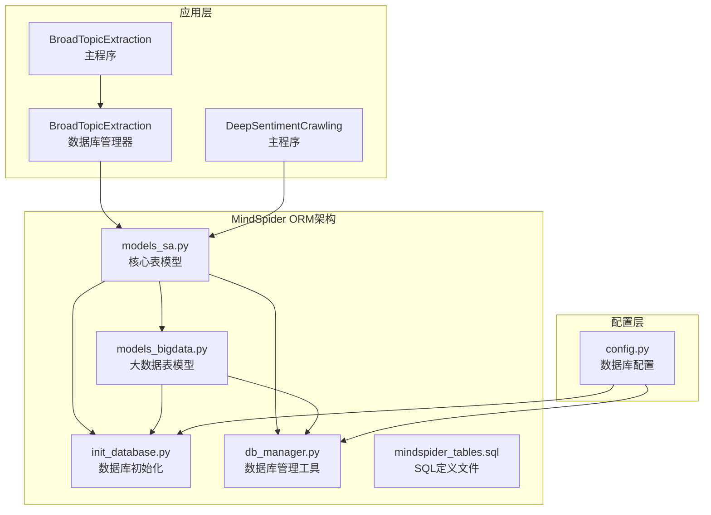
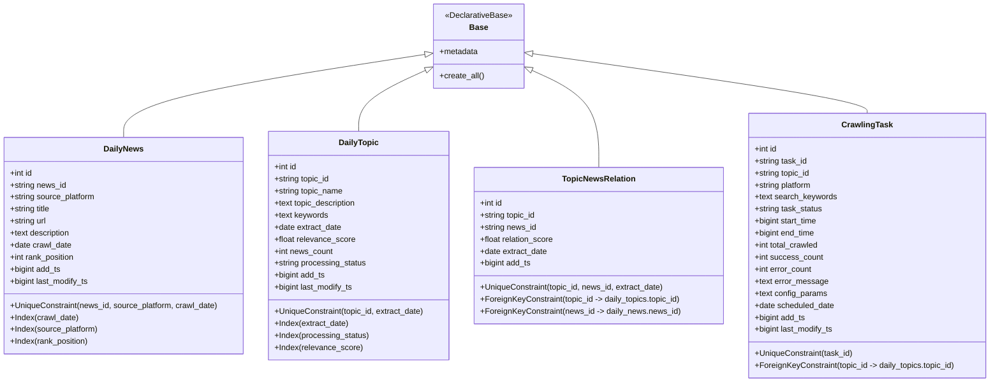
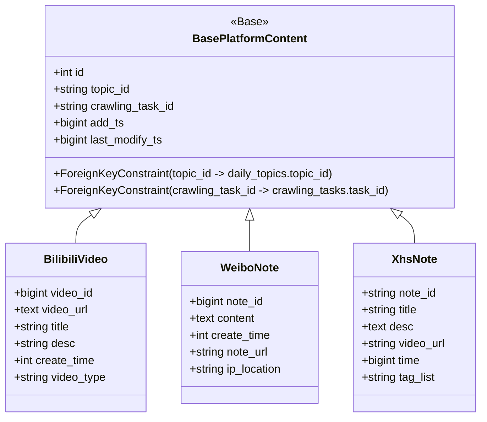
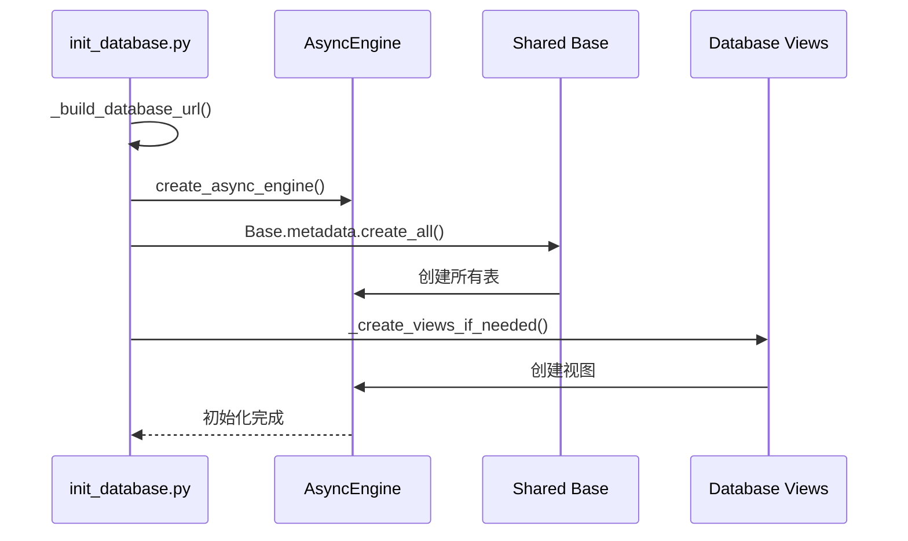
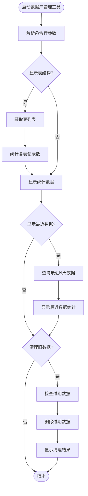

# ORM模型定义

<cite>
**本文档引用的文件**
- [MindSpider/schema/models_sa.py](file://MindSpider/schema/models_sa.py)
- [MindSpider/schema/models_bigdata.py](file://MindSpider/schema/models_bigdata.py)
- [MindSpider/schema/mindspider_tables.sql](file://MindSpider/schema/mindspider_tables.sql)
- [MindSpider/schema/init_database.py](file://MindSpider/schema/init_database.py)
- [MindSpider/schema/db_manager.py](file://MindSpider/schema/db_manager.py)
- [MindSpider/config.py](file://MindSpider/config.py)
- [MindSpider/BroadTopicExtraction/database_manager.py](file://MindSpider/BroadTopicExtraction/database_manager.py)
- [MindSpider/BroadTopicExtraction/main.py](file://MindSpider/BroadTopicExtraction/main.py)
- [MindSpider/DeepSentimentCrawling/main.py](file://MindSpider/DeepSentimentCrawling/main.py)
</cite>

## 目录
1. [简介](#简介)
2. [项目结构](#项目结构)
3. [核心组件](#核心组件)
4. [架构概览](#架构概览)
5. [详细组件分析](#详细组件分析)
6. [依赖关系分析](#依赖关系分析)
7. [性能考虑](#性能考虑)
8. [故障排除指南](#故障排除指南)
9. [结论](#结论)

## 简介
本文档详细介绍BettaFish项目中MindSpider模块的SQLAlchemy ORM模型设计与实现。该系统采用双层ORM架构：MindSpider扩展表（models_sa.py）和大数据分析表（models_bigdata.py），通过共享的Base元数据实现统一的数据库管理。系统支持MySQL和PostgreSQL两种数据库后端，提供完整的数据建模、关系定义、约束条件和验证规则。

## 项目结构
MindSpider的ORM模型位于schema目录下，采用分层设计：



**图表来源**
- [MindSpider/schema/models_sa.py](file://MindSpider/schema/models_sa.py#L1-L127)
- [MindSpider/schema/models_bigdata.py](file://MindSpider/schema/models_bigdata.py#L1-L468)
- [MindSpider/schema/init_database.py](file://MindSpider/schema/init_database.py#L1-L121)

**章节来源**
- [MindSpider/schema/models_sa.py](file://MindSpider/schema/models_sa.py#L1-L127)
- [MindSpider/schema/models_bigdata.py](file://MindSpider/schema/models_bigdata.py#L1-L468)
- [MindSpider/schema/mindspider_tables.sql](file://MindSpider/schema/mindspider_tables.sql#L1-L202)

## 核心组件
MindSpider的ORM模型包含两个核心层次：

### 核心表模型（models_sa.py）
定义MindSpider扩展功能的基础表结构，包括：
- **DailyNews**: 每日热点新闻表
- **DailyTopic**: 每日话题提取表  
- **TopicNewsRelation**: 话题与新闻关联表
- **CrawlingTask**: 爬取任务表

### 大数据表模型（models_bigdata.py）
基于MediaCrawler扩展的大数据分析表，涵盖7个主流社交平台：
- **BilibiliVideo**: B站视频内容
- **DouyinAweme**: 抖音短视频内容
- **WeiboNote**: 微博帖子内容
- **XhsNote**: 小红书笔记内容
- **KuaishouVideo**: 快手视频内容
- **TiebaNote**: 百度贴吧内容
- **ZhihuContent**: 知乎内容

**章节来源**
- [MindSpider/schema/models_sa.py](file://MindSpider/schema/models_sa.py#L31-L127)
- [MindSpider/schema/models_bigdata.py](file://MindSpider/schema/models_bigdata.py#L18-L468)

## 架构概览
系统采用分层架构设计，确保数据模型的一致性和可维护性：



**图表来源**
- [MindSpider/schema/models_sa.py](file://MindSpider/schema/models_sa.py#L27-L127)

## 详细组件分析

### 核心表模型详解

#### DailyNews表设计
DailyNews表专门存储每日热点新闻数据，采用复合唯一约束确保数据完整性：

```mermaid
erDiagram
DAILY_NEWS {
int id PK
varchar(128) news_id UK
varchar(32) source_platform
varchar(500) title
varchar(512) url
text description
text extra_info
date crawl_date
int rank_position
bigint add_ts
bigint last_modify_ts
}
DAILY_NEWS_UQ {
uk uq_daily_news_id_unique
uk uq_daily_news_unique
}
DAILY_NEWS_IDX {
idx idx_daily_news_date
idx idx_daily_news_platform
idx idx_daily_news_rank
}
DAILY_NEWS ||--|| DAILY_NEWS_UQ : "唯一约束"
DAILY_NEWS ||--|| DAILY_NEWS_IDX : "索引"
```

**图表来源**
- [MindSpider/schema/models_sa.py](file://MindSpider/schema/models_sa.py#L31-L52)
- [MindSpider/schema/mindspider_tables.sql](file://MindSpider/schema/mindspider_tables.sql#L12-L30)

#### DailyTopic表设计
DailyTopic表存储话题提取结果，支持复杂的查询和统计需求：

```mermaid
erDiagram
DAILY_TOPICS {
int id PK
varchar(64) topic_id UK
varchar(255) topic_name
text topic_description
text keywords
date extract_date
float relevance_score
int news_count
varchar(16) processing_status
bigint add_ts
bigint last_modify_ts
}
DAILY_TOPICS_UQ {
uk uq_daily_topics_id_unique
uk uq_daily_topics_unique
}
DAILY_TOPICS_IDX {
idx idx_daily_topics_date
idx idx_daily_topics_status
idx idx_daily_topics_score
idx idx_topic_date_status
}
DAILY_TOPICS ||--|| DAILY_TOPICS_UQ : "唯一约束"
DAILY_TOPICS ||--|| DAILY_TOPICS_IDX : "索引"
```

**图表来源**
- [MindSpider/schema/models_sa.py](file://MindSpider/schema/models_sa.py#L54-L76)
- [MindSpider/schema/mindspider_tables.sql](file://MindSpider/schema/mindspider_tables.sql#L36-L54)

#### TopicNewsRelation表设计
关联表实现多对多关系，支持话题与新闻的灵活匹配：

```mermaid
erDiagram
TOPIC_NEWS_RELATION {
int id PK
varchar(64) topic_id
varchar(128) news_id
float relation_score
date extract_date
bigint add_ts
}
TOPIC_NEWS_RELATION_UQ {
uk uq_topic_news_unique
}
TOPIC_NEWS_RELATION_IDX {
idx idx_topic_news_topic
idx idx_topic_news_news
idx idx_topic_news_date
}
TOPIC_NEWS_RELATION ||--|| TOPIC_NEWS_RELATION_UQ : "唯一约束"
TOPIC_NEWS_RELATION ||--|| TOPIC_NEWS_RELATION_IDX : "索引"
TOPIC_NEWS_RELATION }|--|| DAILY_TOPICS : "外键约束"
TOPIC_NEWS_RELATION }|--|| DAILY_NEWS : "外键约束"
```

**图表来源**
- [MindSpider/schema/models_sa.py](file://MindSpider/schema/models_sa.py#L78-L95)
- [MindSpider/schema/mindspider_tables.sql](file://MindSpider/schema/mindspider_tables.sql#L60-L75)

#### CrawlingTask表设计
爬取任务表支持分布式爬取管理和状态跟踪：

```mermaid
erDiagram
CRAWLING_TASKS {
int id PK
varchar(64) task_id UK
varchar(64) topic_id
varchar(32) platform
text search_keywords
varchar(16) task_status
bigint start_time
bigint end_time
int total_crawled
int success_count
int error_count
text error_message
text config_params
date scheduled_date
bigint add_ts
bigint last_modify_ts
}
CRAWLING_TASKS_UQ {
uk uq_crawling_tasks_unique
}
CRAWLING_TASKS_IDX {
idx idx_crawling_tasks_topic
idx idx_crawling_tasks_platform
idx idx_crawling_tasks_status
idx idx_crawling_tasks_date
idx idx_task_topic_platform
}
CRAWLING_TASKS ||--|| CRAWLING_TASKS_UQ : "唯一约束"
CRAWLING_TASKS ||--|| CRAWLING_TASKS_IDX : "索引"
CRAWLING_TASKS }|--|| DAILY_TOPICS : "外键约束"
```

**图表来源**
- [MindSpider/schema/models_sa.py](file://MindSpider/schema/models_sa.py#L97-L127)
- [MindSpider/schema/mindspider_tables.sql](file://MindSpider/schema/mindspider_tables.sql#L81-L106)

### 大数据表模型详解

#### 平台内容表设计模式
所有平台内容表遵循统一的设计模式，包含以下共同特征：



**图表来源**
- [MindSpider/schema/models_bigdata.py](file://MindSpider/schema/models_bigdata.py#L18-L468)

#### 关键字段映射关系
每个平台表都包含特定的关键字段映射：

| 平台 | 核心标识字段 | 时间字段 | 内容字段 |
|------|-------------|----------|----------|
| BilibiliVideo | video_id | create_time | title, desc |
| DouyinAweme | aweme_id | create_time | title, desc |
| WeiboNote | note_id | create_time | content |
| XhsNote | note_id | time | title, desc |
| KuaishouVideo | video_id | create_time | title, desc |
| TiebaNote | note_id | publish_time | title, desc |
| ZhihuContent | content_id | created_time | content_text |

**章节来源**
- [MindSpider/schema/models_sa.py](file://MindSpider/schema/models_sa.py#L31-L127)
- [MindSpider/schema/models_bigdata.py](file://MindSpider/schema/models_bigdata.py#L18-L468)

## 依赖关系分析

### 数据库初始化流程
系统采用异步初始化机制，确保所有表在同一个元数据中注册：



**图表来源**
- [MindSpider/schema/init_database.py](file://MindSpider/schema/init_database.py#L100-L115)

### 数据库管理工具
提供完整的数据库管理功能，包括表结构查看、数据统计和清理操作：



**图表来源**
- [MindSpider/schema/db_manager.py](file://MindSpider/schema/db_manager.py#L264-L299)

**章节来源**
- [MindSpider/schema/init_database.py](file://MindSpider/schema/init_database.py#L1-L121)
- [MindSpider/schema/db_manager.py](file://MindSpider/schema/db_manager.py#L1-L299)

## 性能考虑

### 索引优化策略
系统采用多层次索引策略优化查询性能：

1. **单列索引**：针对常用查询字段建立索引
   - `crawl_date`：按日期查询新闻
   - `source_platform`：按平台过滤新闻
   - `extract_date`：按日期查询话题
   - `processing_status`：按状态过滤话题

2. **复合索引**：针对复杂查询场景
   - `(extract_date, processing_status)`：话题日期和状态组合查询
   - `(topic_id, platform, task_status)`：任务多维过滤

3. **唯一约束**：确保数据完整性
   - 新闻去重：`(news_id, source_platform, crawl_date)`
   - 话题去重：`(topic_id, extract_date)`
   - 关联去重：`(topic_id, news_id, extract_date)`

### 查询优化建议
1. **批量操作**：使用批量插入和更新减少数据库往返
2. **连接池配置**：合理设置连接池大小和超时时间
3. **异步操作**：利用异步引擎提高并发性能
4. **缓存策略**：对频繁查询的结果进行缓存

## 故障排除指南

### 常见数据库连接问题
1. **驱动缺失**：根据数据库类型安装相应驱动
   - MySQL: `pip install pymysql`
   - PostgreSQL: `pip install psycopg[binary]`

2. **连接参数错误**：检查配置文件中的数据库连接信息

3. **权限问题**：确保数据库用户具有足够的权限

### 数据迁移和同步
1. **表结构变更**：使用SQL文件进行结构变更
2. **数据同步**：通过数据库管理工具进行数据清理和同步
3. **版本控制**：使用SQL文件记录数据库版本变更

### 性能监控
1. **慢查询监控**：定期检查慢查询日志
2. **索引使用情况**：监控索引的使用效率
3. **连接池状态**：监控连接池的使用情况

**章节来源**
- [MindSpider/schema/db_manager.py](file://MindSpider/schema/db_manager.py#L37-L59)
- [MindSpider/schema/mindspider_tables.sql](file://MindSpider/schema/mindspider_tables.sql#L195-L202)

## 结论
MindSpider的ORM模型设计体现了现代数据库应用的最佳实践：

1. **清晰的分层架构**：核心表和大数据表分离，职责明确
2. **完善的约束机制**：通过唯一约束和外键确保数据一致性
3. **高效的索引策略**：针对查询模式优化索引设计
4. **灵活的扩展性**：支持多种数据库后端和平台扩展
5. **完整的工具链**：提供数据库初始化、管理、监控工具

该设计为BettaFish项目提供了稳定可靠的数据基础设施，支持大规模舆情数据的采集、存储和分析需求。