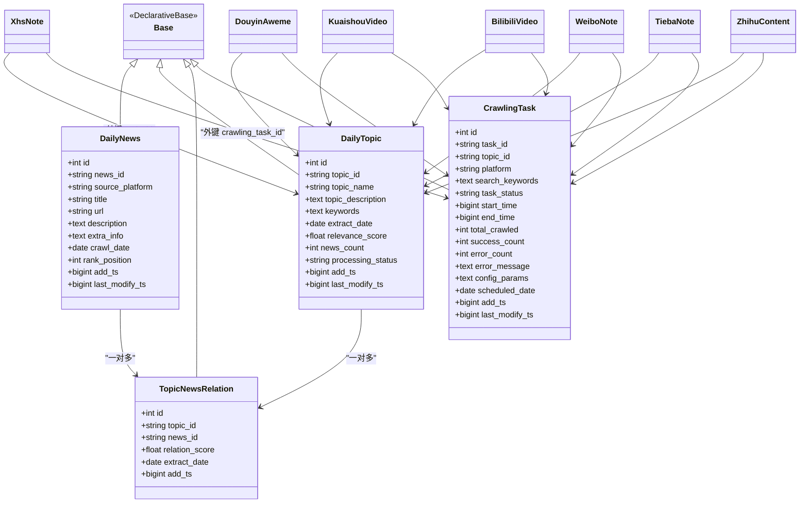

# 数据库设计

<cite>
**本文档引用的文件**
- [mindspider_tables.sql](file://MindSpider/schema/mindspider_tables.sql)
- [models_sa.py](file://MindSpider/schema/models_sa.py)
- [models_bigdata.py](file://MindSpider/schema/models_bigdata.py)
- [init_database.py](file://MindSpider/schema/init_database.py)
- [db_manager.py](file://MindSpider/schema/db_manager.py)
- [config.py](file://MindSpider/config.py)
- [get_today_news.py](file://MindSpider/BroadTopicExtraction/get_today_news.py)
- [database_manager.py](file://MindSpider/BroadTopicExtraction/database_manager.py)
- [platform_crawler.py](file://MindSpider/DeepSentimentCrawling/platform_crawler.py)
- [requirements.txt](file://MindSpider/requirements.txt)
</cite>

## 目录
1. [简介](#简介)
2. [项目结构](#项目结构)
3. [核心组件](#核心组件)
4. [架构总览](#架构总览)
5. [详细组件分析](#详细组件分析)
6. [依赖关系分析](#依赖关系分析)
7. [性能考虑](#性能考虑)
8. [故障排查指南](#故障排查指南)
9. [结论](#结论)
10. [附录](#附录)

## 简介
本文件系统化梳理 BettaFish 项目中 MindSpider 爬虫系统的数据库设计，涵盖表结构、ORM 模型、数据访问模式、缓存策略、性能优化、迁移路径与版本管理、数据安全等主题。重点面向数据库管理员与开发者，提供可操作的技术参考。

## 项目结构
MindSpider 的数据库层由两部分组成：
- 扩展表（MindSpider 扩展）：DailyNews、DailyTopic、TopicNewsRelation、CrawlingTask 及其视图
- 大规模媒体舆情表（MediaCrawler 原有表）：各平台内容与评论表，MindSpider 通过外键关联扩展

图表来源
- [mindspider_tables.sql](file://MindSpider/schema/mindspider_tables.sql#L12-L191)
- [models_bigdata.py](file://MindSpider/schema/models_bigdata.py#L18-L468)
- [models_sa.py](file://MindSpider/schema/models_sa.py#L31-L125)

章节来源
- [mindspider_tables.sql](file://MindSpider/schema/mindspider_tables.sql#L1-L202)
- [models_sa.py](file://MindSpider/schema/models_sa.py#L1-L127)
- [models_bigdata.py](file://MindSpider/schema/models_bigdata.py#L1-L468)

## 核心组件
- 扩展表与视图：提供话题抽取、任务调度与统计分析能力
- ORM 模型：SQLAlchemy 2.x 映射 MindSpider 扩展表与媒体平台大表
- 数据库初始化与管理：统一创建表与视图、提供统计与清理工具
- 配置中心：统一数据库连接参数与 API 配置

章节来源
- [init_database.py](file://MindSpider/schema/init_database.py#L1-L121)
- [db_manager.py](file://MindSpider/schema/db_manager.py#L1-L299)
- [config.py](file://MindSpider/config.py#L1-L36)

## 架构总览
MindSpider 的数据库采用“扩展表 + 外键关联”的设计，既保持 MediaCrawler 原有表结构不变，又通过新增表实现话题抽取与任务调度闭环。ORM 层通过共享 Base 实现跨模块的一致性。

图表来源
- [models_sa.py](file://MindSpider/schema/models_sa.py#L27-L125)
- [models_bigdata.py](file://MindSpider/schema/models_bigdata.py#L18-L468)

## 详细组件分析

### 扩展表结构与关系
- daily_news：每日热点新闻，按日期分区/索引，支持唯一约束保证同源同日唯一
- daily_topics：每日话题，包含关键词、相关性评分、处理状态等
- topic_news_relation：话题与新闻的多对多关联，支持评分与提取日期
- crawling_tasks：基于话题的任务，按平台、状态、日期索引，支持任务统计
- 视图：v_topic_crawling_stats、v_daily_summary 提供聚合统计

图表来源
- [mindspider_tables.sql](file://MindSpider/schema/mindspider_tables.sql#L12-L106)

章节来源
- [mindspider_tables.sql](file://MindSpider/schema/mindspider_tables.sql#L8-L191)
- [models_sa.py](file://MindSpider/schema/models_sa.py#L31-L125)

### ORM 模型与元数据一致性
- models_sa.py 定义扩展表 ORM，使用 DeclarativeBase
- models_bigdata.py 定义媒体平台大表 ORM，同样继承 models_sa.Base，确保同一 metadata
- init_database.py 通过 Base.metadata.create_all 创建表与视图

图表来源
- [init_database.py](file://MindSpider/schema/init_database.py#L22-L114)
- [models_sa.py](file://MindSpider/schema/models_sa.py#L27-L28)
- [models_bigdata.py](file://MindSpider/schema/models_bigdata.py#L15-L16)

章节来源
- [models_sa.py](file://MindSpider/schema/models_sa.py#L1-L127)
- [models_bigdata.py](file://MindSpider/schema/models_bigdata.py#L1-L468)
- [init_database.py](file://MindSpider/schema/init_database.py#L1-L121)

### 数据访问模式与流程

#### 新闻采集与入库
- BroadTopicExtraction.get_today_news 调用外部 API 获取热点新闻
- BroadTopicExtraction.database_manager 将结果写入 daily_news，覆盖模式按日期清理后写入
- 支持按日期查询与统计摘要

图表来源
- [get_today_news.py](file://MindSpider/BroadTopicExtraction/get_today_news.py#L154-L208)
- [database_manager.py](file://MindSpider/BroadTopicExtraction/database_manager.py#L75-L142)

章节来源
- [get_today_news.py](file://MindSpider/BroadTopicExtraction/get_today_news.py#L1-L309)
- [database_manager.py](file://MindSpider/BroadTopicExtraction/database_manager.py#L1-L323)

#### 平台爬虫与数据落库
- DeepSentimentCrawling.platform_crawler 动态修改 MediaCrawler 的数据库配置，使其指向 MindSpider 数据库
- 通过 subprocess 调用 MediaCrawler 的 main.py，将平台内容写入相应大表
- 各平台表通过 topic_id、crawling_task_id 与扩展表建立关联

图表来源
- [platform_crawler.py](file://MindSpider/DeepSentimentCrawling/platform_crawler.py#L42-L309)

章节来源
- [platform_crawler.py](file://MindSpider/DeepSentimentCrawling/platform_crawler.py#L1-L491)
- [models_bigdata.py](file://MindSpider/schema/models_bigdata.py#L18-L468)

### 数据库管理与运维
- db_manager.py 提供：
  - 表清单与记录数统计
  - 近期数据概览（按日期/平台）
  - 旧数据清理（可预览/执行）
- 支持 MySQL 与 PostgreSQL，自动选择驱动

图表来源
- [db_manager.py](file://MindSpider/schema/db_manager.py#L264-L299)

章节来源
- [db_manager.py](file://MindSpider/schema/db_manager.py#L1-L299)

## 依赖关系分析
- 数据库驱动与方言
  - MySQL：pymysql、aiomysql、asyncmy
  - PostgreSQL：asyncpg、psycopg[binary]
- ORM 与异步引擎
  - SQLAlchemy 2.x + 异步引擎
- 爬虫与平台
  - MediaCrawler 通过 playwright 等驱动抓取平台内容
- 配置与环境
  - config.py 通过 pydantic-settings 从 .env 加载数据库与 API 配置

图表来源
- [requirements.txt](file://MindSpider/requirements.txt#L7-L14)
- [config.py](file://MindSpider/config.py#L16-L36)
- [init_database.py](file://MindSpider/schema/init_database.py#L19-L58)
- [db_manager.py](file://MindSpider/schema/db_manager.py#L10-L47)
- [platform_crawler.py](file://MindSpider/DeepSentimentCrawling/platform_crawler.py#L22-L41)

章节来源
- [requirements.txt](file://MindSpider/requirements.txt#L1-L63)
- [config.py](file://MindSpider/config.py#L1-L36)

## 性能考虑
- 索引与查询优化
  - 扩展表关键字段建立复合索引：topic+platform+status、date+platform、date+status 等
  - 按日期与平台过滤的查询具备良好选择性
- 批量写入与幂等
  - daily_news 采用“按日期覆盖”策略，先删后插，减少重复
  - 平台内容入库通过 MediaCrawler 控制并发与速率
- 异步与连接池
  - init_database.py 使用异步引擎，开启 pool_pre_ping 与回收策略
- 视图与统计
  - 视图聚合避免复杂联结，适合报表与监控场景

章节来源
- [mindspider_tables.sql](file://MindSpider/schema/mindspider_tables.sql#L187-L191)
- [database_manager.py](file://MindSpider/schema/db_manager.py#L228-L262)
- [init_database.py](file://MindSpider/schema/init_database.py#L100-L114)

## 故障排查指南
- 连接失败
  - 缺少驱动：根据数据库类型安装对应驱动（MySQL/PostgreSQL）
  - 检查 config.py 中 DB_* 配置与 .env 文件
- 表不存在
  - 使用 init_database.py 初始化表与视图
  - 确认 Base.metadata 已注册所有模型
- 数据异常
  - 使用 db_manager.py 的统计与清理功能定位问题
  - 检查 daily_news 的按日期覆盖逻辑是否生效
- 爬取失败
  - 平台登录/验证码：调整登录方式或二维码登录流程
  - 超时与限流：降低并发或增加延时

章节来源
- [db_manager.py](file://MindSpider/schema/db_manager.py#L35-L59)
- [init_database.py](file://MindSpider/schema/init_database.py#L100-L114)
- [platform_crawler.py](file://MindSpider/DeepSentimentCrawling/platform_crawler.py#L303-L309)

## 结论
MindSpider 的数据库设计以“扩展表 + 外键关联”为核心，在不破坏 MediaCrawler 原有表结构的前提下，实现了从热点新闻采集、话题抽取、任务调度到平台内容入库的完整闭环。通过 ORM 元数据共享、异步引擎与索引优化，兼顾了可维护性与性能。配合统一的配置与管理工具，能够满足生产环境的部署与运维需求。

## 附录

### 数据迁移路径与版本管理
- 新增扩展表与视图：直接运行 init_database.py
- 字段扩展：MindSpider 通过 ALTER TABLE 为 MediaCrawler 表添加 topic_id 与 crawling_task_id，保持向后兼容
- 渐进式演进：先创建扩展表，再逐步引入外键与索引，避免大表重建

章节来源
- [mindspider_tables.sql](file://MindSpider/schema/mindspider_tables.sql#L112-L148)
- [init_database.py](file://MindSpider/schema/init_database.py#L100-L114)

### 数据安全措施
- 凭证管理：通过 .env 与 pydantic-settings 管理敏感配置
- 连接加密：PostgreSQL 使用 asyncpg，MySQL 使用 aiomysql，均可启用 TLS
- 最小权限：数据库用户仅授予必要权限（如仅 CRUD 扩展表与平台表）

章节来源
- [config.py](file://MindSpider/config.py#L16-L36)
- [requirements.txt](file://MindSpider/requirements.txt#L7-L14)