# Insight Engine（私有数据库挖掘引擎）

<cite>
**本文档引用的文件**
- [agent.py](file://InsightEngine/agent.py)
- [base_node.py](file://InsightEngine/nodes/base_node.py)
- [state.py](file://InsightEngine/state/state.py)
- [search.py](file://InsightEngine/tools/search.py)
- [keyword_optimizer.py](file://InsightEngine/tools/keyword_optimizer.py)
- [sentiment_analyzer.py](file://InsightEngine/tools/sentiment_analyzer.py)
- [search_node.py](file://InsightEngine/nodes/search_node.py)
- [summary_node.py](file://InsightEngine/nodes/summary_node.py)
- [report_structure_node.py](file://InsightEngine/nodes/report_structure_node.py)
- [formatting_node.py](file://InsightEngine/nodes/formatting_node.py)
- [prompts.py](file://InsightEngine/prompts/prompts.py)
- [config.py](file://InsightEngine/utils/config.py)
- [db.py](file://InsightEngine/utils/db.py)
- [__init__.py](file://InsightEngine/__init__.py)
</cite>

## 目录
1. [简介](#简介)
2. [项目结构](#项目结构)
3. [核心组件](#核心组件)
4. [架构总览](#架构总览)
5. [详细组件分析](#详细组件分析)
6. [依赖关系分析](#依赖关系分析)
7. [性能考量](#性能考量)
8. [故障排查指南](#故障排查指南)
9. [结论](#结论)
10. [附录](#附录)

## 简介
Insight Engine 是一个面向私有数据库的“深度搜索”引擎，专注于从多源社交媒体与内容平台中挖掘真实民意与舆情数据。它通过“节点化处理流水线”驱动，结合 LLM 的提示词工程、关键词优化中间件、情感分析器与多模态内容处理能力，形成从“报告结构生成”到“最终报告格式化”的完整工作流。引擎内置聚类采样机制，能够在海量搜索结果中抽取代表性样本，提升分析效率与代表性。

## 项目结构
Insight Engine 的核心位于 InsightEngine 目录，采用“模块化 + 节点化”的组织方式：
- agent.py：深度搜索代理（DeepSearchAgent）的主控制器，协调节点、工具与状态管理。
- nodes/：处理节点集合，包含搜索、总结、结构生成与格式化节点。
- state/：状态管理模块，定义报告、段落、研究过程与搜索历史的数据结构。
- tools/：工具集，包含数据库查询工具、关键词优化中间件与情感分析器。
- prompts/：系统提示词与 JSON Schema，规范各阶段输入输出格式。
- utils/：通用配置与数据库工具，提供异步数据库访问与配置管理。
- __init__.py：对外暴露入口与版本信息。

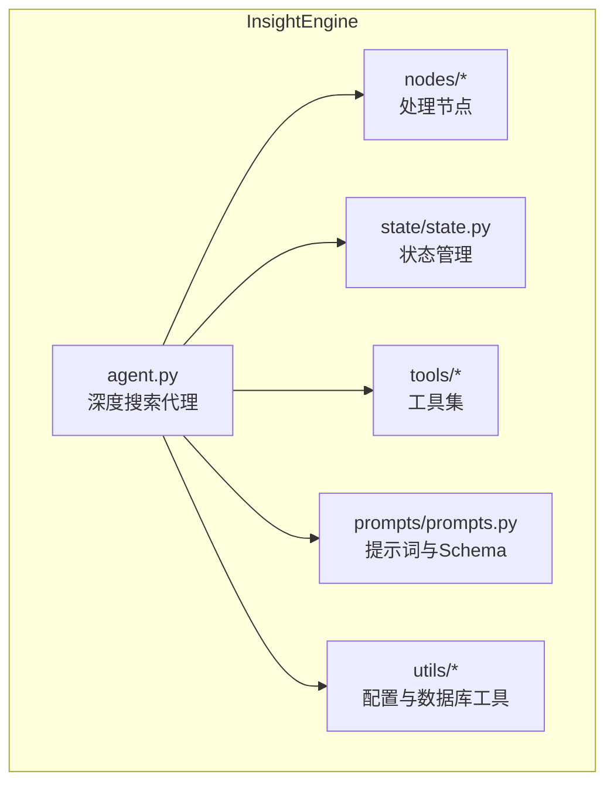

图表来源
- [agent.py](file://InsightEngine/agent.py#L41-L95)
- [base_node.py](file://InsightEngine/nodes/base_node.py#L13-L95)
- [state.py](file://InsightEngine/state/state.py#L12-L259)
- [search.py](file://InsightEngine/tools/search.py#L63-L397)
- [keyword_optimizer.py](file://InsightEngine/tools/keyword_optimizer.py#L36-L298)
- [sentiment_analyzer.py](file://InsightEngine/tools/sentiment_analyzer.py#L79-L704)
- [prompts.py](file://InsightEngine/prompts/prompts.py#L1-L627)
- [config.py](file://InsightEngine/utils/config.py#L13-L45)
- [db.py](file://InsightEngine/utils/db.py#L25-L73)

章节来源
- [agent.py](file://InsightEngine/agent.py#L1-L120)
- [__init__.py](file://InsightEngine/__init__.py#L1-L13)

## 核心组件
- 深度搜索代理（DeepSearchAgent）：负责编排整个研究流程，包括报告结构生成、段落处理、反思循环、最终报告生成与保存。
- 节点化处理流水线：由多个节点组成，分别承担“首次搜索”、“反思搜索”、“首次总结”、“反思总结”、“报告结构生成”和“报告格式化”等职责。
- 状态管理模式：以数据类（dataclass）形式维护报告、段落、研究过程与搜索历史，支持序列化与持久化。
- 数据库查询工具集：封装本地 MySQL/PostgreSQL 的异步查询，提供热点内容、全局话题、按日期、评论、平台定向等多种查询工具。
- 关键词优化中间件：基于 Qwen 的关键词优化器，将 LLM 生成的查询词转换为贴近网民语言的搜索词。
- 情感分析器：基于多语言情感分析模型，支持单文本与批量情感分析，输出五级情感与置信度。
- 聚类采样机制：基于句子嵌入与 KMeans 的聚类采样，从海量结果中抽取代表性样本。

章节来源
- [agent.py](file://InsightEngine/agent.py#L41-L189)
- [state.py](file://InsightEngine/state/state.py#L12-L259)
- [search.py](file://InsightEngine/tools/search.py#L63-L397)
- [keyword_optimizer.py](file://InsightEngine/tools/keyword_optimizer.py#L36-L298)
- [sentiment_analyzer.py](file://InsightEngine/tools/sentiment_analyzer.py#L79-L704)

## 架构总览
Insight Engine 的整体架构围绕“代理 + 节点 + 工具 + 状态”的模式展开。代理负责编排与控制流，节点负责具体的数据处理，工具负责与数据库交互与外部模型服务，状态负责贯穿全链路的数据一致性与可恢复性。

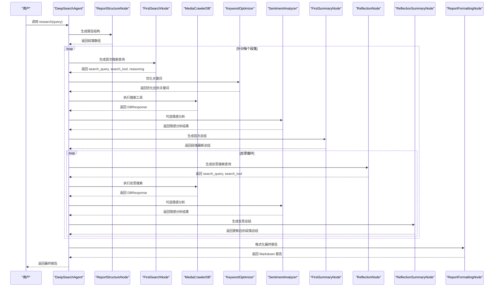

图表来源
- [agent.py](file://InsightEngine/agent.py#L512-L547)
- [report_structure_node.py](file://InsightEngine/nodes/report_structure_node.py#L168-L205)
- [search_node.py](file://InsightEngine/nodes/search_node.py#L45-L151)
- [summary_node.py](file://InsightEngine/nodes/summary_node.py#L167-L196)
- [formatting_node.py](file://InsightEngine/nodes/formatting_node.py#L50-L87)
- [search.py](file://InsightEngine/tools/search.py#L130-L397)
- [keyword_optimizer.py](file://InsightEngine/tools/keyword_optimizer.py#L63-L148)
- [sentiment_analyzer.py](file://InsightEngine/tools/sentiment_analyzer.py#L467-L590)

## 详细组件分析

### 深度搜索代理（DeepSearchAgent）
- 职责：编排研究流程、初始化 LLM 客户端与工具集、执行数据库查询工具、进行关键词优化与情感分析、执行聚类采样、更新状态并生成最终报告。
- 关键特性：
  - 聚类采样：基于句子嵌入与 KMeans，按主题抽取代表性样本，提升代表性与效率。
  - 关键词优化：将 LLM 输出的查询词转换为贴近网民语言的关键词。
  - 情感分析：对搜索结果或独立文本进行情感分析，支持单文本与批量分析。
  - 参数校验：对日期格式进行严格校验，确保按日期搜索工具的正确使用。
  - 去重整合：对多次关键词查询的结果进行去重与整合。
- 控制流：research() 作为入口，依次调用报告结构生成、段落处理（初始搜索与总结、反思循环）、最终报告生成与保存。

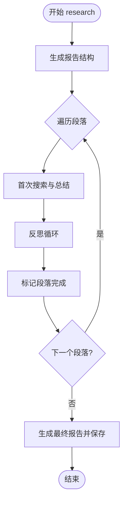

图表来源
- [agent.py](file://InsightEngine/agent.py#L512-L547)
- [agent.py](file://InsightEngine/agent.py#L564-L585)
- [agent.py](file://InsightEngine/agent.py#L586-L735)
- [agent.py](file://InsightEngine/agent.py#L736-L807)

章节来源
- [agent.py](file://InsightEngine/agent.py#L41-L189)
- [agent.py](file://InsightEngine/agent.py#L129-L189)
- [agent.py](file://InsightEngine/agent.py#L190-L371)
- [agent.py](file://InsightEngine/agent.py#L512-L547)

### 节点化处理流水线

#### 节点基类（BaseNode 与 StateMutationNode）
- BaseNode：定义 run()、validate_input()、process_output() 等通用接口，提供日志记录与错误处理。
- StateMutationNode：继承自 BaseNode，扩展 mutate_state() 接口，用于修改状态。

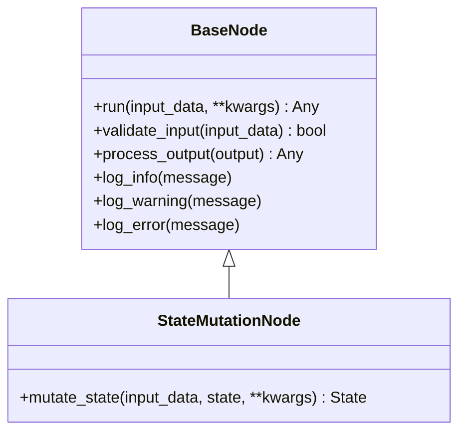

图表来源
- [base_node.py](file://InsightEngine/nodes/base_node.py#L13-L95)

章节来源
- [base_node.py](file://InsightEngine/nodes/base_node.py#L13-L95)

#### 首次搜索节点（FirstSearchNode）
- 输入：段落标题与内容（title/content）。
- 输出：search_query、search_tool、reasoning、可选日期/平台/time_period/enable_sentiment/texts 等。
- 处理：调用 LLM 生成搜索查询与工具选择，使用文本清洗与 JSON 解析容错机制。

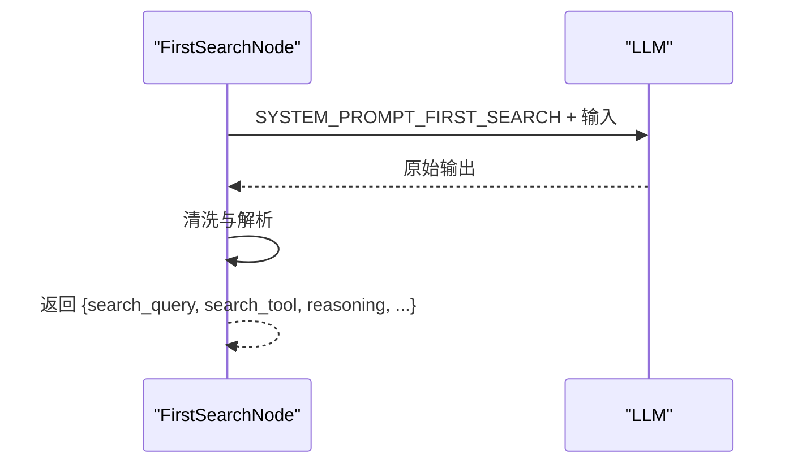

图表来源
- [search_node.py](file://InsightEngine/nodes/search_node.py#L45-L151)
- [prompts.py](file://InsightEngine/prompts/prompts.py#L169-L267)

章节来源
- [search_node.py](file://InsightEngine/nodes/search_node.py#L21-L151)
- [prompts.py](file://InsightEngine/prompts/prompts.py#L169-L267)

#### 反思节点（ReflectionNode）
- 输入：段落标题、内容与最新总结（title/content/paragraph_latest_state）。
- 输出：search_query、search_tool、reasoning、可选日期/平台等。
- 处理：在已有总结基础上进行反思，生成补充搜索查询。

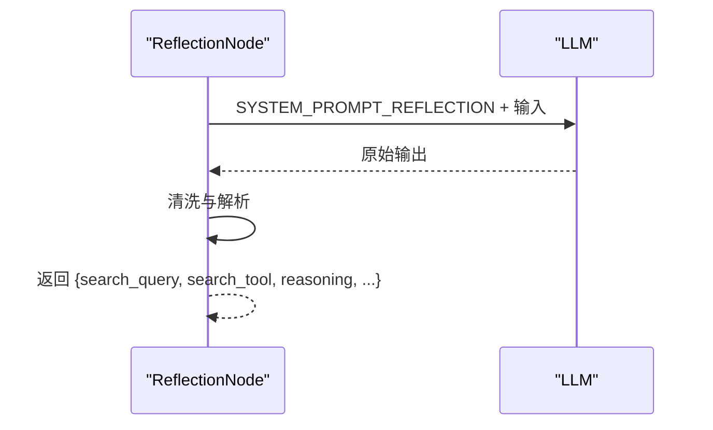

图表来源
- [search_node.py](file://InsightEngine/nodes/search_node.py#L180-L287)
- [prompts.py](file://InsightEngine/prompts/prompts.py#L349-L418)

章节来源
- [search_node.py](file://InsightEngine/nodes/search_node.py#L154-L287)
- [prompts.py](file://InsightEngine/prompts/prompts.py#L349-L418)

#### 首次总结节点（FirstSummaryNode）
- 输入：title、content、search_query、search_results。
- 输出：段落最新总结（paragraph_latest_state）。
- 处理：调用 LLM 生成深度总结，支持 HOST 发言读取与格式化。

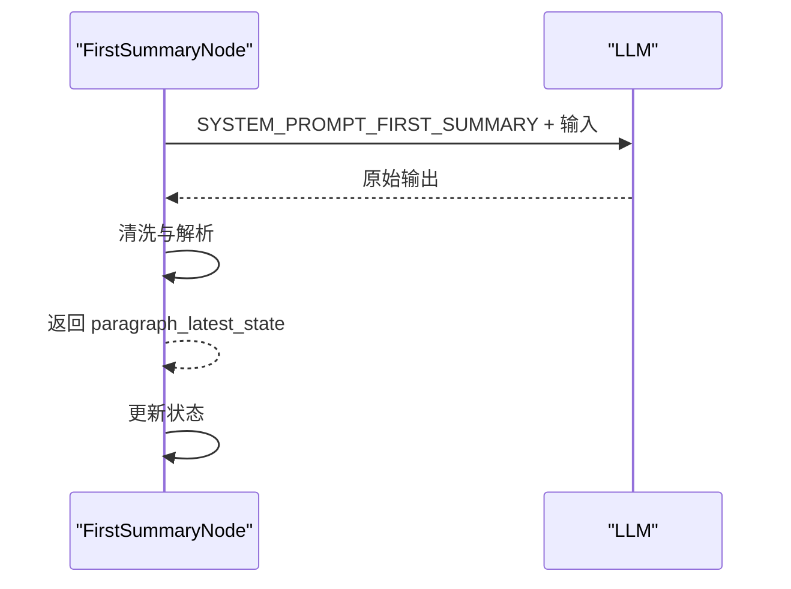

图表来源
- [summary_node.py](file://InsightEngine/nodes/summary_node.py#L60-L196)
- [prompts.py](file://InsightEngine/prompts/prompts.py#L269-L347)

章节来源
- [summary_node.py](file://InsightEngine/nodes/summary_node.py#L34-L196)
- [prompts.py](file://InsightEngine/prompts/prompts.py#L269-L347)

#### 反思总结节点（ReflectionSummaryNode）
- 输入：title、content、search_query、search_results、paragraph_latest_state。
- 输出：更新后的段落最新总结（updated_paragraph_latest_state）。
- 处理：在反思搜索结果基础上更新总结，支持 HOST 发言读取与格式化。

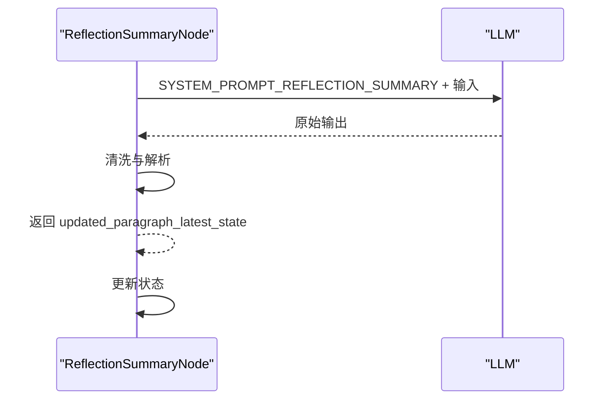

图表来源
- [summary_node.py](file://InsightEngine/nodes/summary_node.py#L225-L363)
- [prompts.py](file://InsightEngine/prompts/prompts.py#L420-L509)

章节来源
- [summary_node.py](file://InsightEngine/nodes/summary_node.py#L199-L363)
- [prompts.py](file://InsightEngine/prompts/prompts.py#L420-L509)

#### 报告结构生成节点（ReportStructureNode）
- 输入：用户查询（query）。
- 输出：段落结构数组（title/content）。
- 处理：调用 LLM 生成报告结构，支持默认结构回退。

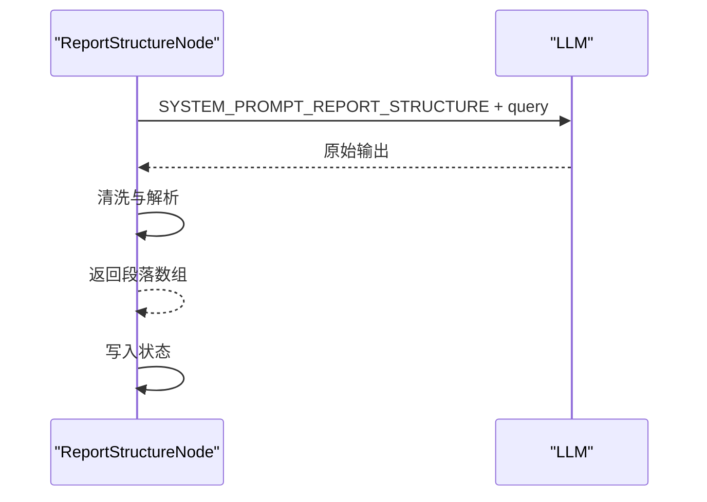

图表来源
- [report_structure_node.py](file://InsightEngine/nodes/report_structure_node.py#L40-L205)
- [prompts.py](file://InsightEngine/prompts/prompts.py#L134-L167)

章节来源
- [report_structure_node.py](file://InsightEngine/nodes/report_structure_node.py#L22-L205)
- [prompts.py](file://InsightEngine/prompts/prompts.py#L134-L167)

#### 报告格式化节点（ReportFormattingNode）
- 输入：段落数组（title/paragraph_latest_state）。
- 输出：格式化后的 Markdown 报告。
- 处理：调用 LLM 生成格式化报告，支持手动格式化回退。

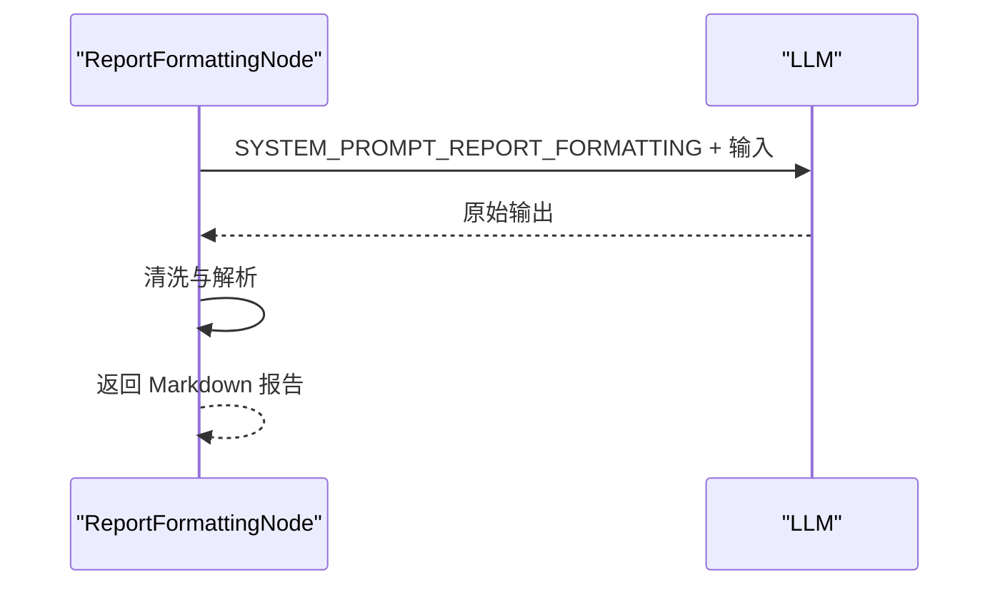

图表来源
- [formatting_node.py](file://InsightEngine/nodes/formatting_node.py#L50-L171)
- [prompts.py](file://InsightEngine/prompts/prompts.py#L511-L626)

章节来源
- [formatting_node.py](file://InsightEngine/nodes/formatting_node.py#L20-L171)
- [prompts.py](file://InsightEngine/prompts/prompts.py#L511-L626)

### 状态管理模式（State）
- 数据结构：Search、Research、Paragraph、State 四层数据类，支持 to_dict/from_dict 与 JSON 序列化。
- 功能：维护搜索历史、最新总结、反思迭代次数、完成状态；提供进度统计与持久化。

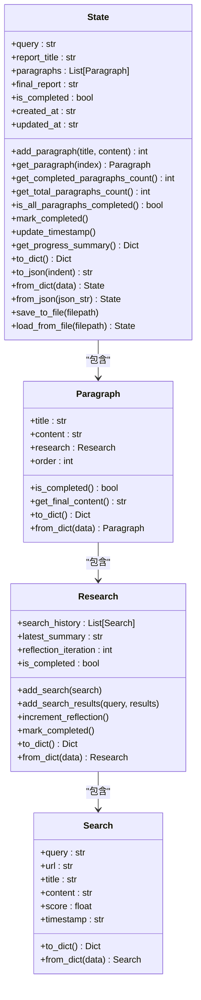

图表来源
- [state.py](file://InsightEngine/state/state.py#L12-L259)

章节来源
- [state.py](file://InsightEngine/state/state.py#L12-L259)

### 数据库查询工具集（MediaCrawlerDB）
- 工具集：search_hot_content、search_topic_globally、search_topic_by_date、get_comments_for_topic、search_topic_on_platform。
- 特性：统一返回 DBResponse，包含 tool_name、parameters、results、results_count、error_message；支持多平台字段映射与时间过滤；支持 PostgreSQL/MySQL 方言适配。
- 使用：DeepSearchAgent 通过 execute_search_tool() 调用，自动进行关键词优化、多次查询整合、去重与聚类采样。

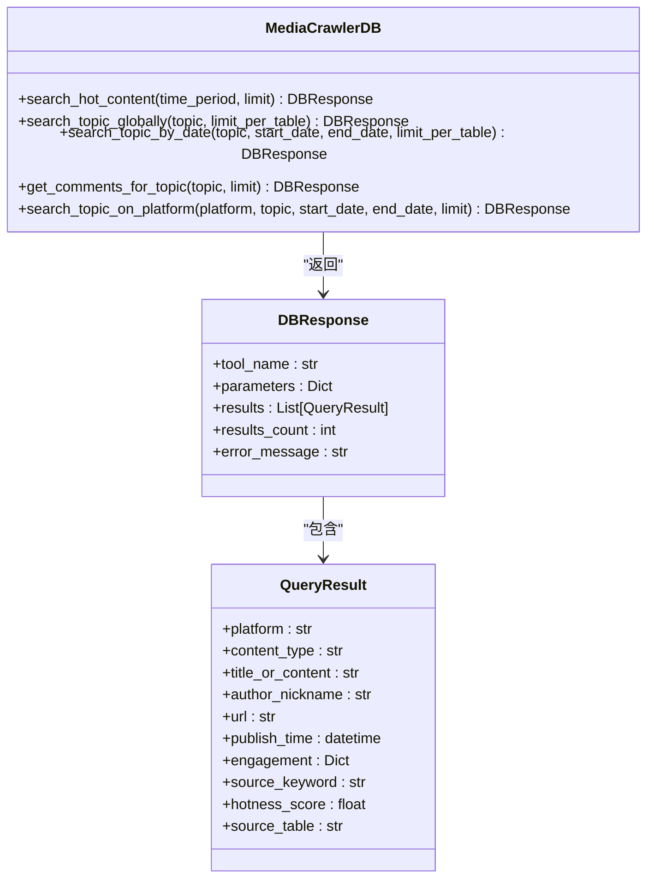

图表来源
- [search.py](file://InsightEngine/tools/search.py#L38-L61)
- [search.py](file://InsightEngine/tools/search.py#L130-L397)

章节来源
- [search.py](file://InsightEngine/tools/search.py#L63-L397)

### 关键词优化中间件（KeywordOptimizer）
- 功能：将 LLM 生成的原始查询词优化为贴近网民语言的关键词列表，支持 JSON 与文本两种输出解析，具备降级与回退策略。
- 配置：从配置读取 API 密钥、基础 URL 与模型名称，支持重试机制。

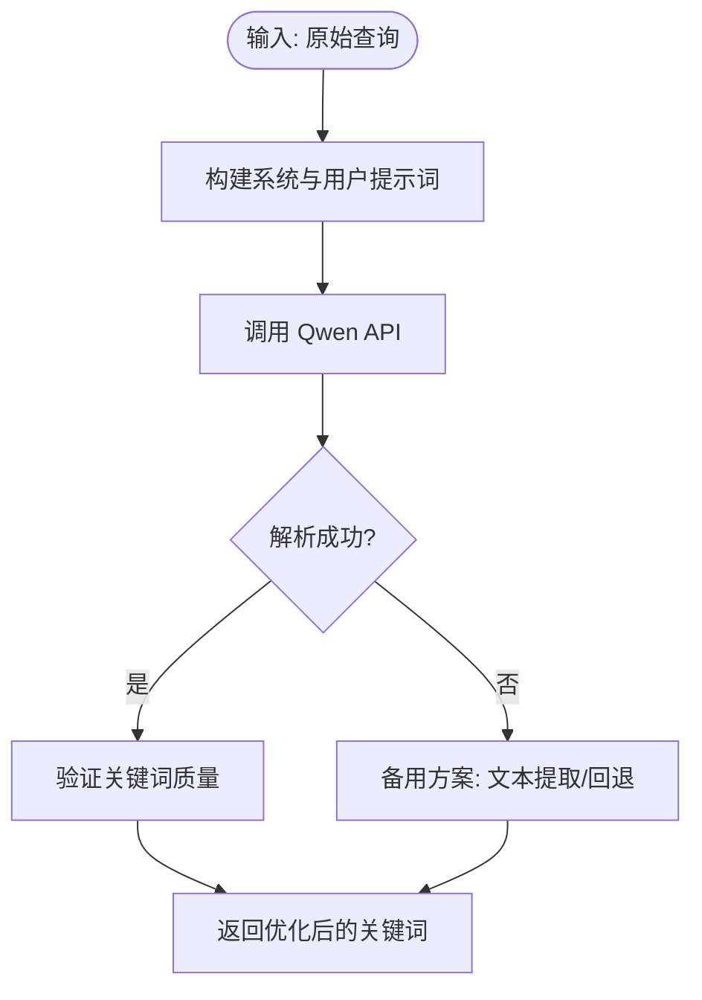

图表来源
- [keyword_optimizer.py](file://InsightEngine/tools/keyword_optimizer.py#L63-L148)
- [keyword_optimizer.py](file://InsightEngine/tools/keyword_optimizer.py#L191-L210)

章节来源
- [keyword_optimizer.py](file://InsightEngine/tools/keyword_optimizer.py#L36-L298)

### 情感分析器（WeiboMultilingualSentimentAnalyzer）
- 功能：支持单文本与批量情感分析，输出五级情感与置信度；支持自动初始化、设备选择（CUDA/MPS/CPU）与本地模型缓存。
- 集成：DeepSearchAgent 在搜索后自动对结果进行情感分析，或通过 analyze_sentiment_only() 进行独立分析。

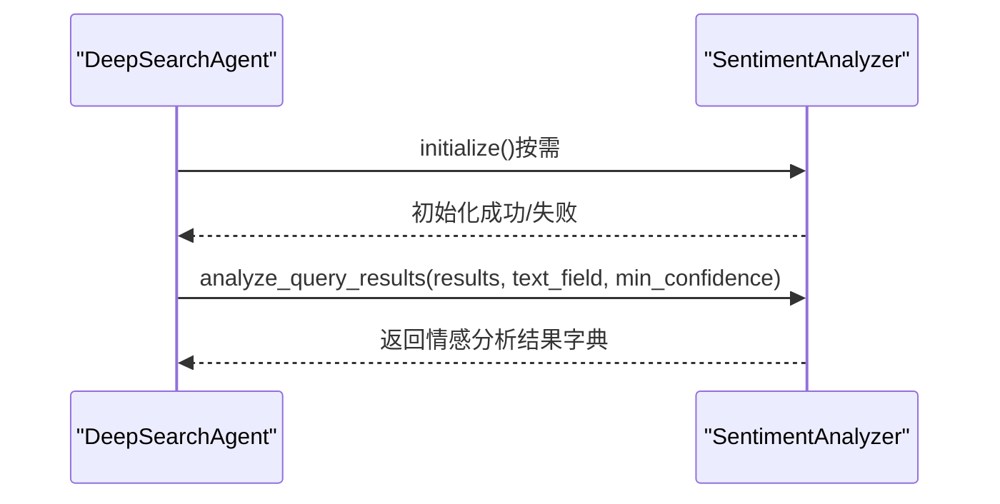

图表来源
- [sentiment_analyzer.py](file://InsightEngine/tools/sentiment_analyzer.py#L158-L241)
- [sentiment_analyzer.py](file://InsightEngine/tools/sentiment_analyzer.py#L467-L590)

章节来源
- [sentiment_analyzer.py](file://InsightEngine/tools/sentiment_analyzer.py#L79-L704)

### 聚类采样机制
- 实现：基于 SentenceTransformer 的句子嵌入与 KMeans 聚类，按主题抽取代表性样本，支持最大结果数与每簇样本数配置。
- 集成：在 DeepSearchAgent.execute_search_tool() 中，对去重后的结果进行聚类采样，失败时回退到前 N 条。

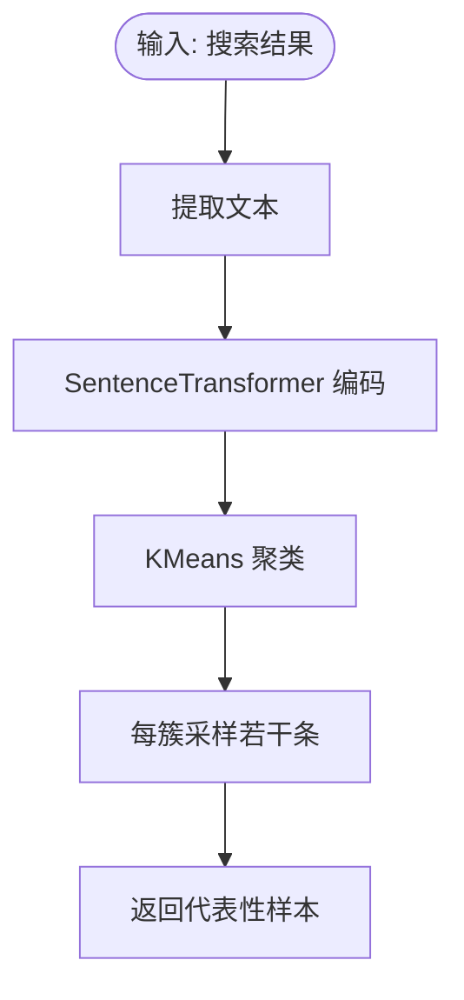

图表来源
- [agent.py](file://InsightEngine/agent.py#L129-L189)

章节来源
- [agent.py](file://InsightEngine/agent.py#L129-L189)

## 依赖关系分析
- 模块耦合：
  - agent.py 依赖 nodes/*、state/*、tools/*、prompts/prompts.py、utils/config.py。
  - nodes/* 依赖 base_node.py、prompts/prompts.py、utils/text_processing.py。
  - tools/* 依赖 utils/db.py、utils/config.py。
  - utils/db.py 依赖 SQLAlchemy 异步引擎与配置。
- 外部依赖：OpenAI SDK（关键词优化）、transformers/torch（情感分析）、sklearn（聚类）、numpy（向量运算）。
- 配置：通过 Settings 类集中管理 LLM、数据库、搜索限制、输出路径等参数。

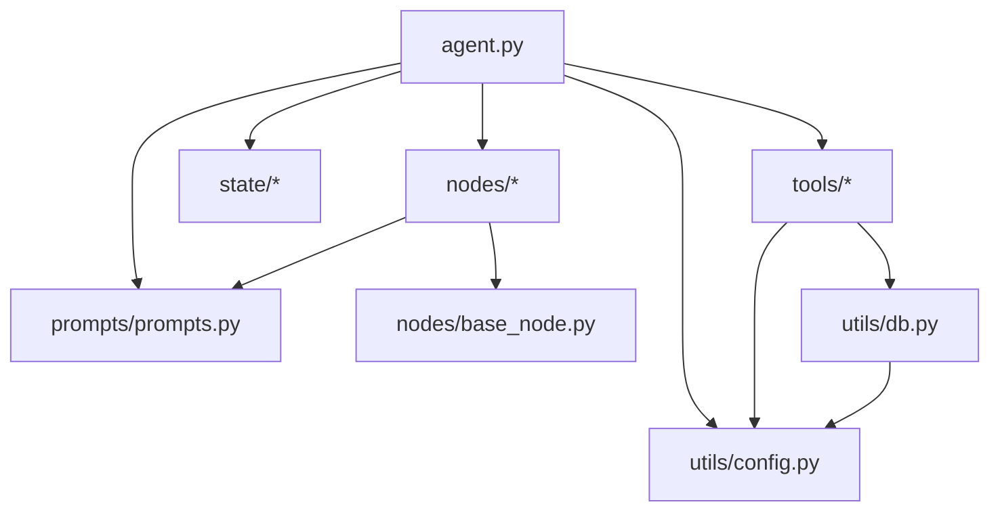

图表来源
- [agent.py](file://InsightEngine/agent.py#L17-L34)
- [search_node.py](file://InsightEngine/nodes/search_node.py#L11-L18)
- [summary_node.py](file://InsightEngine/nodes/summary_node.py#L11-L20)
- [report_structure_node.py](file://InsightEngine/nodes/report_structure_node.py#L11-L19)
- [formatting_node.py](file://InsightEngine/nodes/formatting_node.py#L10-L15)
- [search.py](file://InsightEngine/tools/search.py#L32-L34)
- [db.py](file://InsightEngine/utils/db.py#L15-L17)
- [config.py](file://InsightEngine/utils/config.py#L13-L45)

章节来源
- [agent.py](file://InsightEngine/agent.py#L17-L34)
- [search_node.py](file://InsightEngine/nodes/search_node.py#L11-L18)
- [summary_node.py](file://InsightEngine/nodes/summary_node.py#L11-L20)
- [report_structure_node.py](file://InsightEngine/nodes/report_structure_node.py#L11-L19)
- [formatting_node.py](file://InsightEngine/nodes/formatting_node.py#L10-L15)
- [search.py](file://InsightEngine/tools/search.py#L32-L34)
- [db.py](file://InsightEngine/utils/db.py#L15-L17)
- [config.py](file://InsightEngine/utils/config.py#L13-L45)

## 性能考量
- 异步数据库访问：使用 SQLAlchemy 异步引擎，降低 I/O 阻塞，提升并发查询效率。
- 聚类采样：在大规模结果上显著减少后续处理成本，同时保持代表性。
- 关键词优化与情感分析：通过批量处理与设备选择（GPU/CPU）提升吞吐量。
- 结果限制：通过 MAX_SEARCH_RESULTS_FOR_LLM 与 MAX_HIGH_CONFIDENCE_SENTIMENT_RESULTS 控制 LLM 输入规模，避免上下文溢出。
- 超时控制：SEARCH_TIMEOUT 限制单次搜索请求，防止长时间阻塞。

章节来源
- [db.py](file://InsightEngine/utils/db.py#L49-L73)
- [agent.py](file://InsightEngine/agent.py#L129-L189)
- [config.py](file://InsightEngine/utils/config.py#L25-L37)

## 故障排查指南
- 关键词优化失败：
  - 现象：API 调用异常或响应解析失败。
  - 处理：检查 API 密钥与基础 URL 配置；查看重试配置；回退到备用关键词提取。
- 情感分析不可用：
  - 现象：torch 或 transformers 缺失导致初始化失败。
  - 处理：安装依赖或禁用情感分析；确认设备可用性（CUDA/MPS/CPU）。
- 数据库连接失败：
  - 现象：异步引擎创建失败或连接池异常。
  - 处理：检查 DATABASE_URL 或 DB_* 配置；确认数据库可达与凭据正确。
- 日期格式错误：
  - 现象：按日期搜索工具报错。
  - 处理：确保 start_date/end_date 符合 YYYY-MM-DD 格式；否则回退到全局搜索。
- LLM 输出解析失败：
  - 现象：JSON 解析异常或不完整。
  - 处理：启用 JSON 修复与文本提取回退；检查提示词 Schema 与输出格式。

章节来源
- [keyword_optimizer.py](file://InsightEngine/tools/keyword_optimizer.py#L191-L210)
- [sentiment_analyzer.py](file://InsightEngine/tools/sentiment_analyzer.py#L158-L241)
- [db.py](file://InsightEngine/utils/db.py#L49-L73)
- [agent.py](file://InsightEngine/agent.py#L104-L128)
- [prompts.py](file://InsightEngine/prompts/prompts.py#L1-L627)

## 结论
Insight Engine 通过“节点化处理流水线 + 状态管理 + 工具集集成”的架构，实现了从“报告结构生成”到“最终报告格式化”的完整深度搜索流程。其关键优势在于：
- 以 LLM 为核心的提示词工程，确保输出结构化、可解析；
- 关键词优化与情感分析的深度集成，提升数据质量与洞察深度；
- 聚类采样与异步数据库访问，兼顾代表性与性能；
- 完善的错误处理与回退机制，保障系统稳定性。

## 附录

### 使用示例（配置与接口）
- 初始化与配置
  - 通过 Settings 类读取环境变量，设置 LLM、数据库、搜索限制与输出路径。
  - 示例配置项：INSIGHT_ENGINE_API_KEY、INSIGHT_ENGINE_BASE_URL、INSIGHT_ENGINE_MODEL_NAME、DB_HOST/USER/PASSWORD/NAME/PORT、MAX_REFLECTIONS、MAX_SEARCH_RESULTS_FOR_LLM、OUTPUT_DIR 等。
- 调用入口
  - DeepSearchAgent.research(query, save_report=True)：执行完整研究流程并可选保存报告。
- 数据库查询工具
  - search_hot_content、search_topic_globally、search_topic_by_date、get_comments_for_topic、search_topic_on_platform。
  - 参数：limit/limit_per_table、start_date/end_date、platform、time_period 等。
- 情感分析
  - analyze_sentiment_only(texts)：独立情感分析。
  - analyze_query_results(query_results, text_field, min_confidence)：对搜索结果进行情感分析。
- 聚类采样
  - 自动启用，可通过 ENABLE_CLUSTERING、MAX_CLUSTERED_RESULTS、RESULTS_PER_CLUSTER 调整。

章节来源
- [config.py](file://InsightEngine/utils/config.py#L13-L45)
- [agent.py](file://InsightEngine/agent.py#L512-L547)
- [search.py](file://InsightEngine/tools/search.py#L130-L397)
- [sentiment_analyzer.py](file://InsightEngine/tools/sentiment_analyzer.py#L467-L590)
- [agent.py](file://InsightEngine/agent.py#L36-L38)

### API 接口与错误处理
- API 接口
  - DeepSearchAgent.research(query, save_report=True)：返回最终报告。
  - DeepSearchAgent.execute_search_tool(tool_name, query, **kwargs)：返回 DBResponse。
  - DeepSearchAgent.analyze_sentiment_only(texts)：返回情感分析结果。
- 错误处理
  - 关键词优化：API 失败时回退到备用提取策略。
  - 情感分析：依赖缺失或初始化失败时透传原始文本并返回可用摘要。
  - 数据库：连接失败时抛出异常并记录日志。
  - LLM：输出解析失败时启用修复与回退，确保流程继续。

章节来源
- [agent.py](file://InsightEngine/agent.py#L512-L547)
- [agent.py](file://InsightEngine/agent.py#L190-L371)
- [keyword_optimizer.py](file://InsightEngine/tools/keyword_optimizer.py#L126-L148)
- [sentiment_analyzer.py](file://InsightEngine/tools/sentiment_analyzer.py#L431-L465)
- [db.py](file://InsightEngine/utils/db.py#L61-L73)

### 扩展与定制建议
- 新增处理节点：继承 BaseNode 或 StateMutationNode，实现 run()/mutate_state()，并在 agent.py 中注册。
- 新增数据库查询工具：在 MediaCrawlerDB 中新增方法，遵循 DBResponse 规范，注意字段映射与时间过滤。
- 调整提示词：在 prompts.py 中扩展 JSON Schema 与 SYSTEM_PROMPT，确保输出可解析。
- 性能优化：调整聚类采样参数、批量情感分析阈值、LLM 输入限制，结合硬件资源选择最佳配置。
- 集成第三方模型：替换情感分析器或关键词优化器，确保接口一致与错误处理完备。

章节来源
- [base_node.py](file://InsightEngine/nodes/base_node.py#L13-L95)
- [search.py](file://InsightEngine/tools/search.py#L63-L397)
- [prompts.py](file://InsightEngine/prompts/prompts.py#L1-L627)
- [sentiment_analyzer.py](file://InsightEngine/tools/sentiment_analyzer.py#L79-L704)