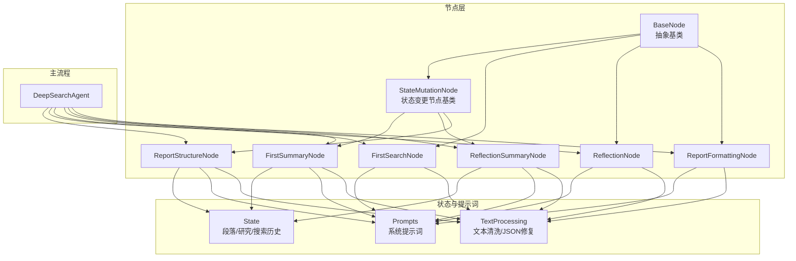
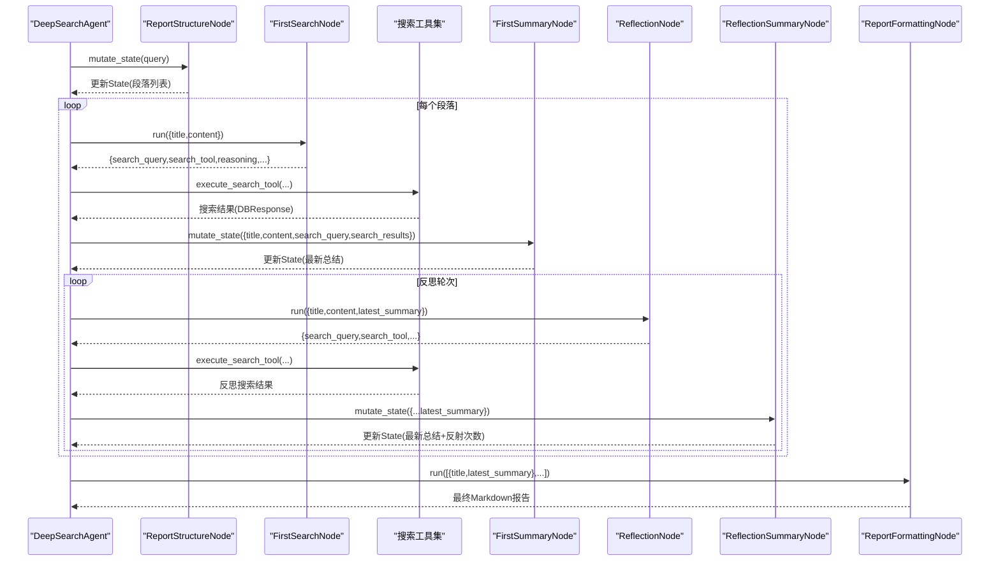
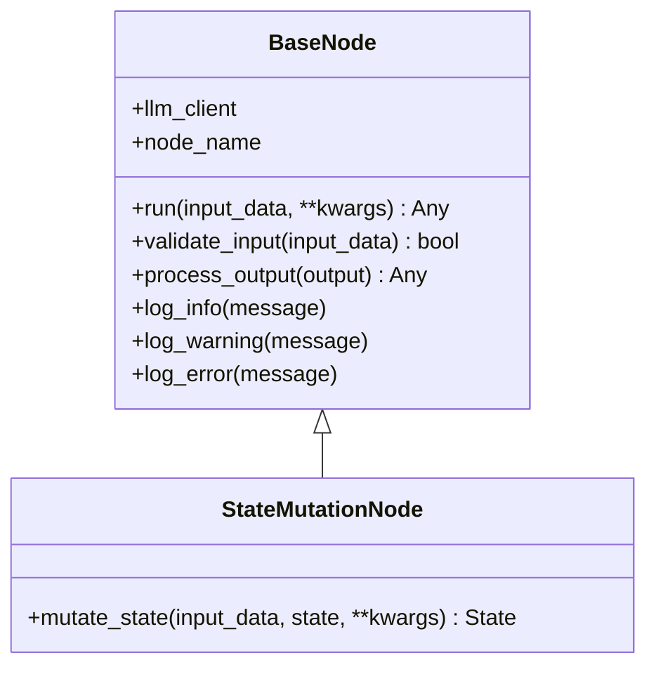
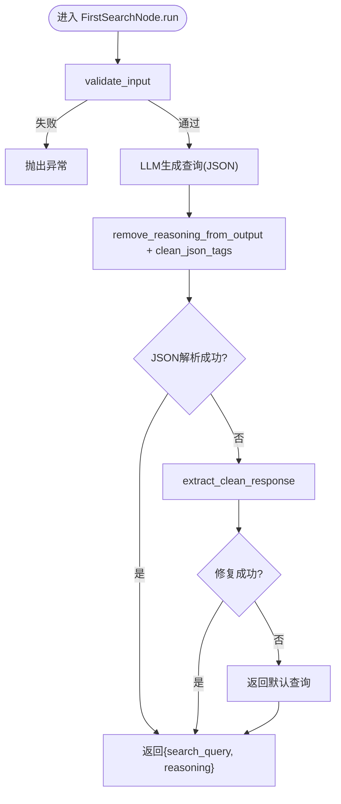
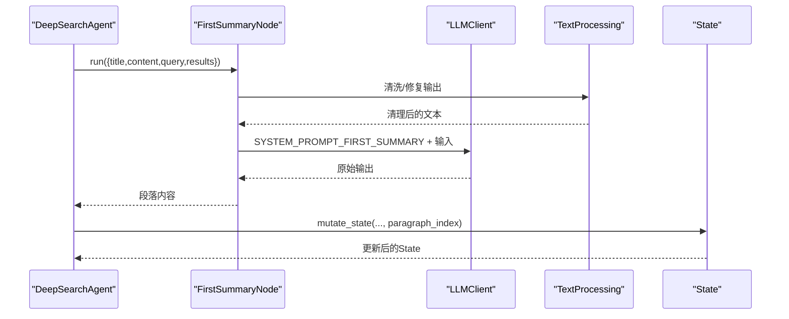
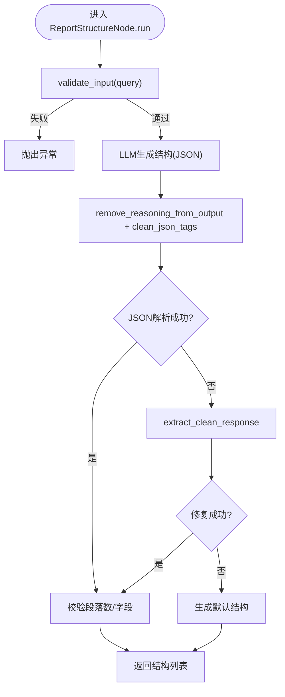
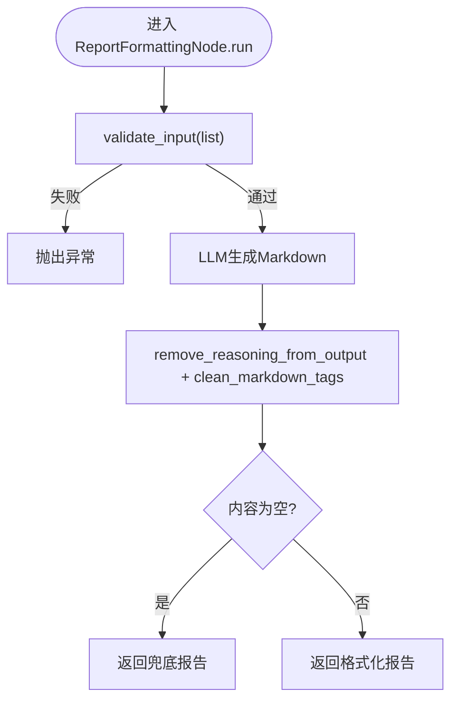
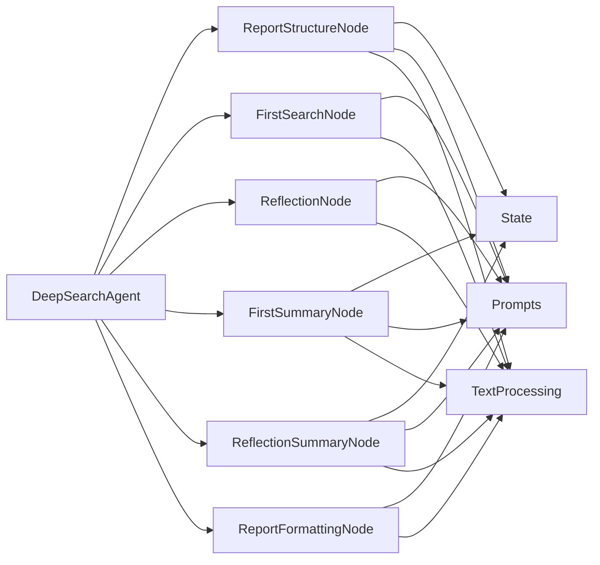

# 处理节点系统

<cite>
**本文档引用的文件**
- [InsightEngine/nodes/base_node.py](file://InsightEngine/nodes/base_node.py)
- [InsightEngine/nodes/search_node.py](file://InsightEngine/nodes/search_node.py)
- [InsightEngine/nodes/summary_node.py](file://InsightEngine/nodes/summary_node.py)
- [InsightEngine/nodes/report_structure_node.py](file://InsightEngine/nodes/report_structure_node.py)
- [InsightEngine/nodes/formatting_node.py](file://InsightEngine/nodes/formatting_node.py)
- [InsightEngine/state/state.py](file://InsightEngine/state/state.py)
- [InsightEngine/prompts/prompts.py](file://InsightEngine/prompts/prompts.py)
- [InsightEngine/utils/text_processing.py](file://InsightEngine/utils/text_processing.py)
- [InsightEngine/agent.py](file://InsightEngine/agent.py)
</cite>

## 目录
1. [简介](#简介)
2. [项目结构](#项目结构)
3. [核心组件](#核心组件)
4. [架构总览](#架构总览)
5. [详细组件分析](#详细组件分析)
6. [依赖关系分析](#依赖关系分析)
7. [性能考量](#性能考量)
8. [故障排查指南](#故障排查指南)
9. [结论](#结论)
10. [附录：扩展与自定义开发指南](#附录扩展与自定义开发指南)

## 简介
本文件系统性阐述 Insight Engine 的“处理节点系统”。该系统采用节点化架构，围绕 BaseNode 抽象基类构建，通过 SearchNode、SummaryNode、ReportStructureNode、FormatNode 等具体节点协同工作，完成从“报告结构规划”到“最终格式化输出”的完整流程。系统强调：
- 节点职责清晰、可替换、可扩展
- 输入/输出标准化与健壮的文本清洗与 JSON 解析
- 状态驱动的段落研究生命周期（首次总结、反思总结、完成标记）
- LLM 提示词工程与工具链集成（搜索、情感分析、聚类采样）

## 项目结构
Insight Engine 的节点系统位于 InsightEngine/nodes 目录，配合 state 状态管理、prompts 提示词、utils 文本处理工具与 agent 主流程控制器共同组成端到端的处理流水线。

图表来源
- [InsightEngine/nodes/base_node.py](file://InsightEngine/nodes/base_node.py#L13-L95)
- [InsightEngine/nodes/search_node.py](file://InsightEngine/nodes/search_node.py#L21-L287)
- [InsightEngine/nodes/summary_node.py](file://InsightEngine/nodes/summary_node.py#L34-L363)
- [InsightEngine/nodes/report_structure_node.py](file://InsightEngine/nodes/report_structure_node.py#L22-L205)
- [InsightEngine/nodes/formatting_node.py](file://InsightEngine/nodes/formatting_node.py#L20-L171)
- [InsightEngine/state/state.py](file://InsightEngine/state/state.py#L142-L259)
- [InsightEngine/prompts/prompts.py](file://InsightEngine/prompts/prompts.py#L134-L627)
- [InsightEngine/utils/text_processing.py](file://InsightEngine/utils/text_processing.py#L12-L309)
- [InsightEngine/agent.py](file://InsightEngine/agent.py#L41-L980)

章节来源
- [InsightEngine/nodes/base_node.py](file://InsightEngine/nodes/base_node.py#L13-L95)
- [InsightEngine/state/state.py](file://InsightEngine/state/state.py#L142-L259)
- [InsightEngine/prompts/prompts.py](file://InsightEngine/prompts/prompts.py#L134-L627)
- [InsightEngine/utils/text_processing.py](file://InsightEngine/utils/text_processing.py#L12-L309)
- [InsightEngine/agent.py](file://InsightEngine/agent.py#L41-L980)

## 核心组件
- BaseNode：定义节点通用接口（run、validate_input、process_output）与日志能力；派生出 StateMutationNode 以支持状态变更。
- SearchNode：负责为段落生成“首次搜索查询”和“反思搜索查询”，并从 LLM 输出中提取结构化 JSON。
- SummaryNode：负责“首次总结”和“反思总结”，将搜索结果与提示词结合生成段落内容，并更新状态。
- ReportStructureNode：根据用户查询生成报告整体结构（段落数、标题、内容规划），并写入状态。
- FormatNode：将最终段落内容格式化为 Markdown 报告，具备备用手动格式化能力。
- State：封装段落、研究、搜索历史等状态，提供增删改查与序列化能力。
- Prompts：集中定义各阶段系统提示词与 JSON Schema，保障 LLM 输出结构化。
- TextProcessing：提供 JSON/Markdown 标签清理、推理文本剥离、不完整 JSON 修复等工具。

章节来源
- [InsightEngine/nodes/base_node.py](file://InsightEngine/nodes/base_node.py#L13-L95)
- [InsightEngine/nodes/search_node.py](file://InsightEngine/nodes/search_node.py#L21-L287)
- [InsightEngine/nodes/summary_node.py](file://InsightEngine/nodes/summary_node.py#L34-L363)
- [InsightEngine/nodes/report_structure_node.py](file://InsightEngine/nodes/report_structure_node.py#L22-L205)
- [InsightEngine/nodes/formatting_node.py](file://InsightEngine/nodes/formatting_node.py#L20-L171)
- [InsightEngine/state/state.py](file://InsightEngine/state/state.py#L142-L259)
- [InsightEngine/prompts/prompts.py](file://InsightEngine/prompts/prompts.py#L134-L627)
- [InsightEngine/utils/text_processing.py](file://InsightEngine/utils/text_processing.py#L12-L309)

## 架构总览
节点系统遵循“输入校验 → LLM 调用 → 输出清洗/修复 → 结果写入状态/返回”的统一范式。主流程由 DeepSearchAgent 协调，依次执行：
- 生成报告结构（ReportStructureNode）
- 遍历段落：首次搜索与总结（FirstSearchNode + FirstSummaryNode）
- 反思循环：生成反思查询、执行搜索、反思总结（ReflectionNode + ReflectionSummaryNode）
- 生成最终报告（ReportFormattingNode）

图表来源
- [InsightEngine/agent.py](file://InsightEngine/agent.py#L512-L926)
- [InsightEngine/nodes/report_structure_node.py](file://InsightEngine/nodes/report_structure_node.py#L168-L205)
- [InsightEngine/nodes/search_node.py](file://InsightEngine/nodes/search_node.py#L45-L151)
- [InsightEngine/nodes/summary_node.py](file://InsightEngine/nodes/summary_node.py#L167-L363)
- [InsightEngine/nodes/formatting_node.py](file://InsightEngine/nodes/formatting_node.py#L50-L117)

章节来源
- [InsightEngine/agent.py](file://InsightEngine/agent.py#L512-L926)

## 详细组件分析

### BaseNode 抽象设计
- 角色：定义所有节点的统一接口与通用能力（输入校验、输出处理、日志）。
- 关键点：
  - run(input_data, **kwargs)：抽象方法，子类实现具体处理逻辑。
  - validate_input：默认通过，子类可覆盖严格校验。
  - process_output：默认透传，子类可覆盖清洗/解析。
  - 日志方法：统一的日志前缀与级别。
- StateMutationNode：扩展 BaseNode，增加 mutate_state(input_data, state, **kwargs) 抽象方法，用于将处理结果写入状态。

图表来源
- [InsightEngine/nodes/base_node.py](file://InsightEngine/nodes/base_node.py#L13-L95)

章节来源
- [InsightEngine/nodes/base_node.py](file://InsightEngine/nodes/base_node.py#L13-L95)

### SearchNode：搜索查询生成机制
- FirstSearchNode
  - 输入：段落标题与内容（字符串或字典）。
  - 流程：校验输入 → LLM 生成查询与工具选择 → 清洗/修复 JSON → 返回 {search_query, reasoning}。
  - 异常处理：解析失败时回退默认查询。
- ReflectionNode
  - 输入：段落标题、内容、最新段落状态。
  - 流程：与首次搜索类似，但面向“反思”场景，生成补充查询。
  - 异常处理：解析失败时回退默认反思查询。

图表来源
- [InsightEngine/nodes/search_node.py](file://InsightEngine/nodes/search_node.py#L45-L151)
- [InsightEngine/utils/text_processing.py](file://InsightEngine/utils/text_processing.py#L48-L134)

章节来源
- [InsightEngine/nodes/search_node.py](file://InsightEngine/nodes/search_node.py#L21-L287)
- [InsightEngine/utils/text_processing.py](file://InsightEngine/utils/text_processing.py#L12-L309)

### SummaryNode：总结生成算法
- FirstSummaryNode
  - 输入：title、content、search_query、search_results。
  - 流程：准备输入 → 可选读取 HOST 发言 → LLM 生成首次总结 → 清洗/修复 → 写入状态。
  - 状态更新：mutate_state 将最新总结写入对应段落的研究记录。
- ReflectionSummaryNode
  - 输入：在首次总结基础上，增加 paragraph_latest_state。
  - 流程：与首次类似，但强调“反思”与“增量丰富”，并在状态中增加反射次数。
  - 状态更新：更新最新总结并递增反射次数。

图表来源
- [InsightEngine/nodes/summary_node.py](file://InsightEngine/nodes/summary_node.py#L60-L197)
- [InsightEngine/utils/text_processing.py](file://InsightEngine/utils/text_processing.py#L12-L309)
- [InsightEngine/state/state.py](file://InsightEngine/state/state.py#L142-L259)

章节来源
- [InsightEngine/nodes/summary_node.py](file://InsightEngine/nodes/summary_node.py#L34-L363)
- [InsightEngine/state/state.py](file://InsightEngine/state/state.py#L142-L259)

### ReportStructureNode：报告结构生成逻辑
- 输入：用户查询（构造时注入）。
- 流程：校验查询 → LLM 生成结构 → 清洗/修复 → 校验段落数与字段 → 写入状态。
- 状态更新：为每个段落创建 Paragraph，并设置 report_title（若为空）。

图表来源
- [InsightEngine/nodes/report_structure_node.py](file://InsightEngine/nodes/report_structure_node.py#L40-L147)
- [InsightEngine/utils/text_processing.py](file://InsightEngine/utils/text_processing.py#L85-L134)

章节来源
- [InsightEngine/nodes/report_structure_node.py](file://InsightEngine/nodes/report_structure_node.py#L22-L205)

### FormatNode：格式化处理流程
- 输入：[{title, paragraph_latest_state}, ...]。
- 流程：校验输入 → LLM 生成 Markdown → 清洗 Markdown 标签 → 补齐标题/空内容兜底。
- 备用：format_report_manually 手动构建报告骨架。

图表来源
- [InsightEngine/nodes/formatting_node.py](file://InsightEngine/nodes/formatting_node.py#L50-L117)
- [InsightEngine/utils/text_processing.py](file://InsightEngine/utils/text_processing.py#L30-L46)

章节来源
- [InsightEngine/nodes/formatting_node.py](file://InsightEngine/nodes/formatting_node.py#L20-L171)

## 依赖关系分析
- 节点与 LLM：所有节点均依赖 LLMClient 进行流式调用，输出经 TextProcessing 清洗。
- 节点与状态：SummaryNode 与 ReportStructureNode 实现 StateMutationNode，直接写入 State。
- 节点与提示词：各节点运行时使用 Prompts 中的 SYSTEM_PROMPT_*。
- 主流程协调：DeepSearchAgent 负责串联节点、执行搜索工具、参数校验与聚类采样。

图表来源
- [InsightEngine/agent.py](file://InsightEngine/agent.py#L41-L980)
- [InsightEngine/nodes/search_node.py](file://InsightEngine/nodes/search_node.py#L21-L287)
- [InsightEngine/nodes/summary_node.py](file://InsightEngine/nodes/summary_node.py#L34-L363)
- [InsightEngine/nodes/report_structure_node.py](file://InsightEngine/nodes/report_structure_node.py#L22-L205)
- [InsightEngine/nodes/formatting_node.py](file://InsightEngine/nodes/formatting_node.py#L20-L171)
- [InsightEngine/state/state.py](file://InsightEngine/state/state.py#L142-L259)
- [InsightEngine/prompts/prompts.py](file://InsightEngine/prompts/prompts.py#L134-L627)
- [InsightEngine/utils/text_processing.py](file://InsightEngine/utils/text_processing.py#L12-L309)

章节来源
- [InsightEngine/agent.py](file://InsightEngine/agent.py#L41-L980)

## 性能考量
- LLM 调用成本：节点均采用流式调用，建议控制单次输入长度与搜索结果数量，避免超长上下文。
- JSON 修复与回退：文本清洗与 JSON 修复为 O(n) 复杂度，建议在提示词中尽量约束输出格式，减少修复概率。
- 搜索结果采样：主流程支持聚类采样与去重，降低 LLM 输入规模，提高稳定性与速度。
- 状态序列化：State 提供 to_json/save_to_file/load_from_file，便于中间态持久化与恢复。

[本节为通用建议，无需代码来源]

## 故障排查指南
- LLM 输出非 JSON：优先检查提示词是否明确 JSON Schema；确认 TextProcessing 的 remove_reasoning_from_output/clean_json_tags 是否正确应用。
- JSON 解析失败：查看 extract_clean_response 与 fix_incomplete_json 的回退路径；必要时在节点 process_output 中打印清理后文本进行定位。
- 输入格式错误：核对 validate_input 的字段要求；FirstSearchNode/SummaryNode/ReportStructureNode/FormatNode 分别有严格的输入约束。
- 状态未更新：确认节点是否实现 mutate_state；检查 DeepSearchAgent 的状态写入调用。
- 搜索工具参数：主流程对工具参数有严格校验与默认值，避免直接传入非法参数。

章节来源
- [InsightEngine/nodes/search_node.py](file://InsightEngine/nodes/search_node.py#L81-L151)
- [InsightEngine/nodes/summary_node.py](file://InsightEngine/nodes/summary_node.py#L115-L197)
- [InsightEngine/nodes/report_structure_node.py](file://InsightEngine/nodes/report_structure_node.py#L67-L147)
- [InsightEngine/nodes/formatting_node.py](file://InsightEngine/nodes/formatting_node.py#L89-L117)
- [InsightEngine/utils/text_processing.py](file://InsightEngine/utils/text_processing.py#L85-L196)
- [InsightEngine/agent.py](file://InsightEngine/agent.py#L586-L896)

## 结论
Insight Engine 的节点系统以 BaseNode 为核心抽象，通过 SearchNode、SummaryNode、ReportStructureNode、FormatNode 的分工协作，实现了从“结构规划”到“内容生成”再到“报告格式化”的完整闭环。系统在健壮性方面通过严格的输入校验、输出清洗与 JSON 修复机制，在可扩展性方面通过 StateMutationNode 与统一接口，为后续新增节点与流程提供了清晰的扩展路径。

[本节为总结，无需代码来源]

## 附录：扩展与自定义开发指南
- 继承 BaseNode 或 StateMutationNode
  - 若仅做数据处理/格式化，继承 BaseNode 并实现 run/process_output。
  - 若需要写入状态，继承 StateMutationNode 并实现 mutate_state。
- 输入校验
  - 在 validate_input 中严格校验字段与类型，避免后续流程出现异常。
- 输出处理
  - 在 process_output 中统一进行文本清洗、JSON 解析与回退策略。
- 与提示词集成
  - 明确 SYSTEM_PROMPT 与 JSON Schema，确保 LLM 输出可解析。
- 与主流程集成
  - 在 DeepSearchAgent 中注册节点实例，并在合适阶段调用 run/mutate_state。
- 最佳实践
  - 控制输入规模，避免超长上下文。
  - 为每个节点编写单元测试，覆盖正常/异常路径。
  - 使用日志方法记录关键信息，便于排障。

章节来源
- [InsightEngine/nodes/base_node.py](file://InsightEngine/nodes/base_node.py#L13-L95)
- [InsightEngine/agent.py](file://InsightEngine/agent.py#L87-L94)