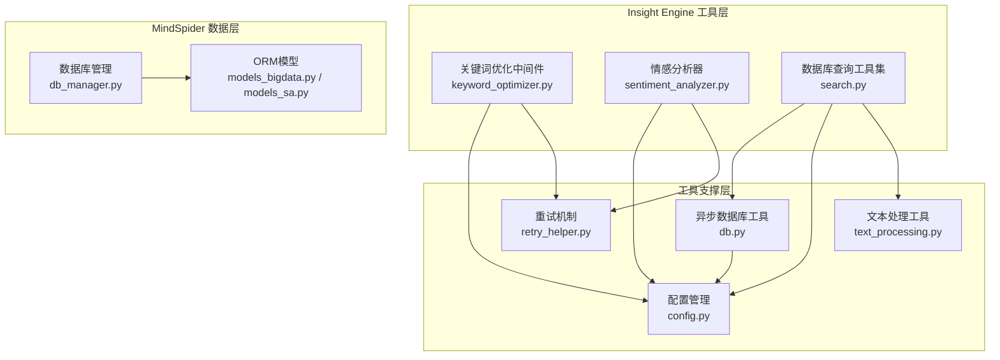
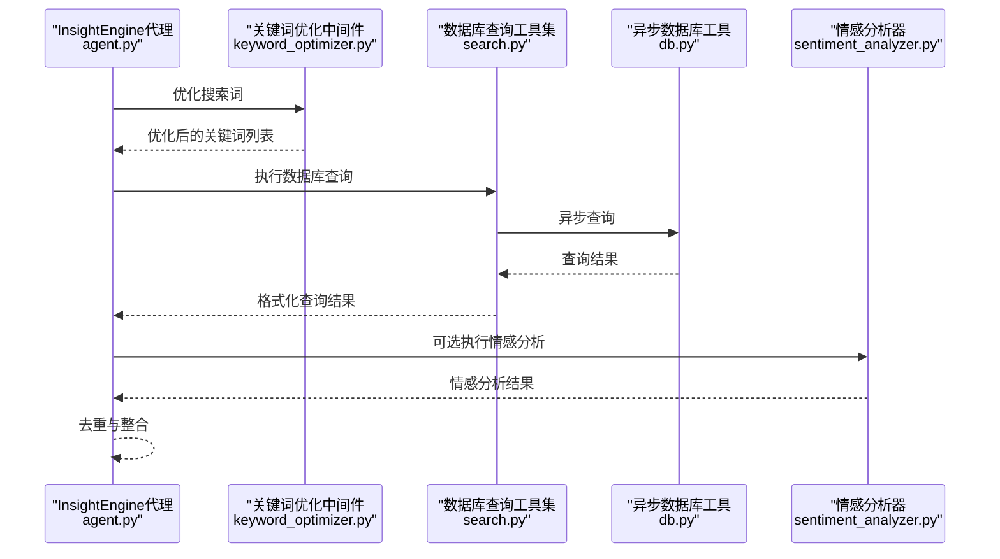
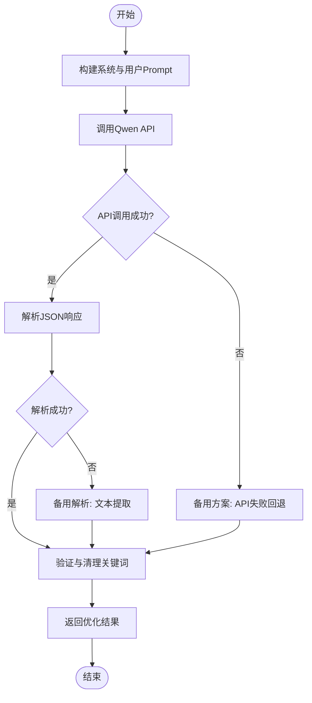
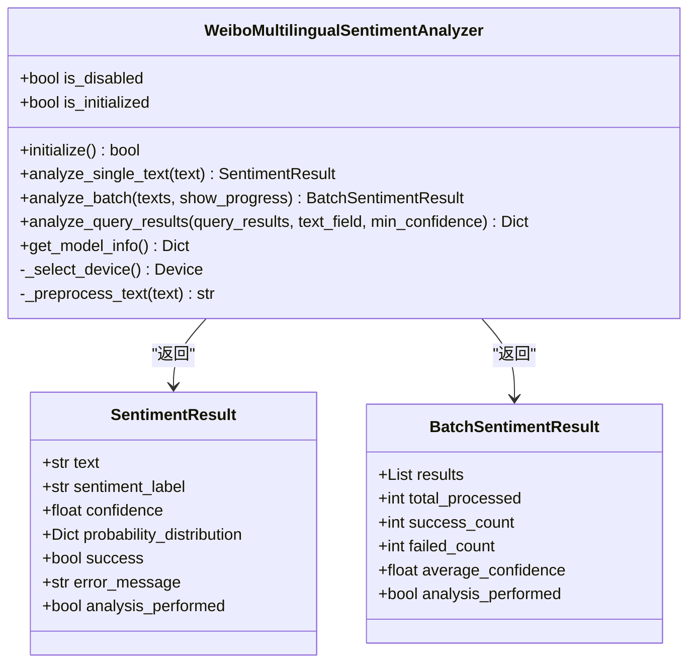
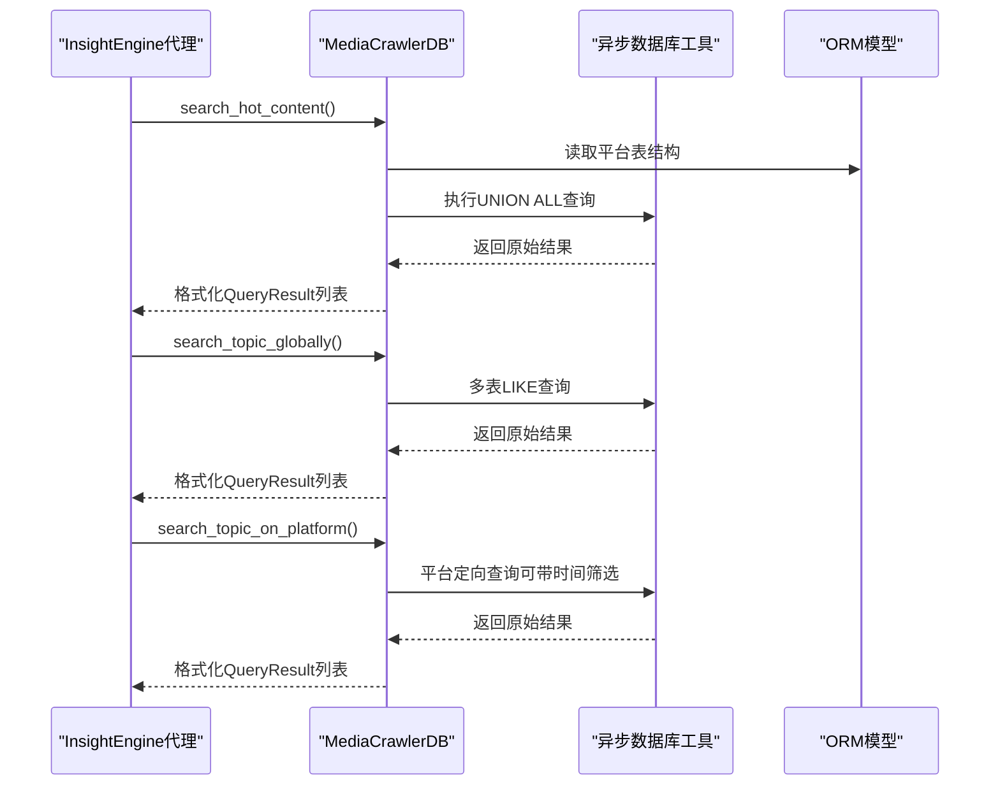
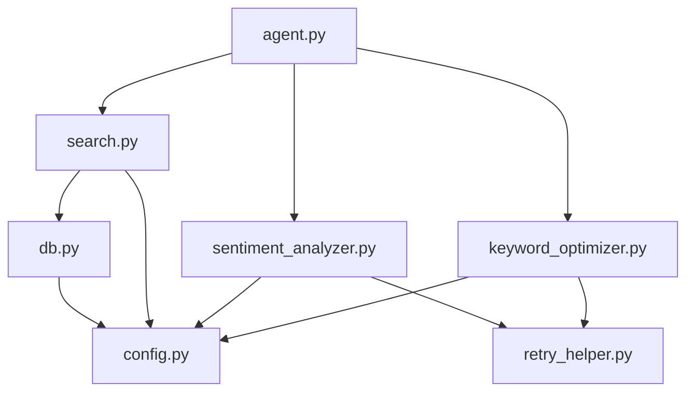

# 工具集与数据库集成

<cite>
**本文档引用的文件**
- [keyword_optimizer.py](file://InsightEngine/tools/keyword_optimizer.py)
- [sentiment_analyzer.py](file://InsightEngine/tools/sentiment_analyzer.py)
- [search.py](file://InsightEngine/tools/search.py)
- [db.py](file://InsightEngine/utils/db.py)
- [text_processing.py](file://InsightEngine/utils/text_processing.py)
- [config.py](file://InsightEngine/utils/config.py)
- [retry_helper.py](file://utils/retry_helper.py)
- [agent.py](file://InsightEngine/agent.py)
- [models_bigdata.py](file://MindSpider/schema/models_bigdata.py)
- [models_sa.py](file://MindSpider/schema/models_sa.py)
- [db_manager.py](file://MindSpider/schema/db_manager.py)
- [config.py.example](file://MindSpider/config.py.example)
</cite>

## 目录
1. [简介](#简介)
2. [项目结构](#项目结构)
3. [核心组件](#核心组件)
4. [架构概览](#架构概览)
5. [详细组件分析](#详细组件分析)
6. [依赖关系分析](#依赖关系分析)
7. [性能考虑](#性能考虑)
8. [故障排除指南](#故障排除指南)
9. [结论](#结论)
10. [附录](#附录)

## 简介
本文件面向Insight Engine的工具集与数据库集成，重点阐述以下三个方面：
- 关键词优化中间件的实现原理：包括多语言关键词生成、优化策略与降级容错机制
- 情感分析器的集成方式：多模型支持、批量处理机制与运行时配置
- 数据库查询工具集的设计架构：MediaCrawlerDB的多表查询能力与结果去重机制

同时提供数据库连接配置、查询优化与性能调优的技术指导，并给出关键词优化配置、情感分析参数设置与数据库查询工具的使用示例。

## 项目结构
Insight Engine的工具集与数据库集成涉及以下关键模块：
- 工具层：关键词优化中间件、情感分析器、数据库查询工具
- 工具支撑：异步数据库访问、文本处理、重试机制、配置管理
- 数据模型：MindSpider扩展表ORM模型与数据库管理工具

**图表来源**
- [keyword_optimizer.py](file://InsightEngine/tools/keyword_optimizer.py#L1-L298)
- [sentiment_analyzer.py](file://InsightEngine/tools/sentiment_analyzer.py#L1-L704)
- [search.py](file://InsightEngine/tools/search.py#L1-L463)
- [db.py](file://InsightEngine/utils/db.py#L1-L73)
- [text_processing.py](file://InsightEngine/utils/text_processing.py#L1-L309)
- [retry_helper.py](file://utils/retry_helper.py#L1-L247)
- [models_bigdata.py](file://MindSpider/schema/models_bigdata.py#L1-L468)
- [models_sa.py](file://MindSpider/schema/models_sa.py#L1-L127)
- [db_manager.py](file://MindSpider/schema/db_manager.py#L1-L299)

**章节来源**
- [keyword_optimizer.py](file://InsightEngine/tools/keyword_optimizer.py#L1-L298)
- [sentiment_analyzer.py](file://InsightEngine/tools/sentiment_analyzer.py#L1-L704)
- [search.py](file://InsightEngine/tools/search.py#L1-L463)
- [db.py](file://InsightEngine/utils/db.py#L1-L73)
- [text_processing.py](file://InsightEngine/utils/text_processing.py#L1-L309)
- [retry_helper.py](file://utils/retry_helper.py#L1-L247)
- [models_bigdata.py](file://MindSpider/schema/models_bigdata.py#L1-L468)
- [models_sa.py](file://MindSpider/schema/models_sa.py#L1-L127)
- [db_manager.py](file://MindSpider/schema/db_manager.py#L1-L299)

## 核心组件
本节概述三大核心组件及其职责：
- 关键词优化中间件：将Agent生成的搜索词优化为更适合舆情数据库查询的关键词，具备多轮降级容错与质量验证
- 情感分析器：封装多语言情感分析模型，支持单文本与批量分析，具备设备选择与运行时启用/禁用能力
- 数据库查询工具集：MediaCrawlerDB提供热点内容检索、全局话题搜索、按日期搜索、评论提取与平台定向搜索等工具

**章节来源**
- [keyword_optimizer.py](file://InsightEngine/tools/keyword_optimizer.py#L36-L149)
- [sentiment_analyzer.py](file://InsightEngine/tools/sentiment_analyzer.py#L79-L241)
- [search.py](file://InsightEngine/tools/search.py#L63-L185)

## 架构概览
下图展示了Insight Engine工具集与数据库集成的整体架构，包括数据流、控制流与关键交互点：

**图表来源**
- [agent.py](file://InsightEngine/agent.py#L348-L387)
- [keyword_optimizer.py](file://InsightEngine/tools/keyword_optimizer.py#L63-L149)
- [search.py](file://InsightEngine/tools/search.py#L78-L95)
- [db.py](file://InsightEngine/utils/db.py#L61-L71)
- [sentiment_analyzer.py](file://InsightEngine/tools/sentiment_analyzer.py#L467-L590)

## 详细组件分析

### 关键词优化中间件
关键词优化中间件负责将Agent生成的原始查询转换为更贴近网民语言、更适合舆情数据库检索的关键词集合。其核心特性包括：
- Prompt工程：系统提示强调贴近网民语言、避免专业术语、情感丰富与数量控制
- API调用：通过OpenAI兼容接口调用Qwen模型，具备优雅重试装饰器保护
- 响应解析：优先解析JSON格式，失败时采用备用方案从文本中提取关键词
- 质量验证：过滤不良关键词、长度与重复性校验
- 降级容错：API失败或解析失败时回退到简单分词提取策略

**图表来源**
- [keyword_optimizer.py](file://InsightEngine/tools/keyword_optimizer.py#L63-L149)
- [keyword_optimizer.py](file://InsightEngine/tools/keyword_optimizer.py#L191-L211)
- [keyword_optimizer.py](file://InsightEngine/tools/keyword_optimizer.py#L212-L247)
- [keyword_optimizer.py](file://InsightEngine/tools/keyword_optimizer.py#L249-L294)

**章节来源**
- [keyword_optimizer.py](file://InsightEngine/tools/keyword_optimizer.py#L150-L190)
- [keyword_optimizer.py](file://InsightEngine/tools/keyword_optimizer.py#L191-L211)
- [keyword_optimizer.py](file://InsightEngine/tools/keyword_optimizer.py#L212-L294)
- [retry_helper.py](file://utils/retry_helper.py#L141-L199)

### 情感分析器
情感分析器封装了多语言情感分析模型，提供单文本与批量分析能力，并支持运行时启用/禁用与设备选择：
- 模型加载：优先使用本地缓存模型，缺失时自动下载并保存
- 设备选择：自动检测CUDA/MPS/CPU，优先GPU加速
- 单文本分析：预处理文本、分词编码、推理、构建结果
- 批量分析：逐条分析并统计成功率、平均置信度与情感分布
- 查询结果分析：针对数据库查询结果提取文本字段并批量分析
- 运行时控制：可通过配置开关禁用，或在运行时启用/禁用

**图表来源**
- [sentiment_analyzer.py](file://InsightEngine/tools/sentiment_analyzer.py#L79-L241)
- [sentiment_analyzer.py](file://InsightEngine/tools/sentiment_analyzer.py#L261-L356)
- [sentiment_analyzer.py](file://InsightEngine/tools/sentiment_analyzer.py#L357-L429)
- [sentiment_analyzer.py](file://InsightEngine/tools/sentiment_analyzer.py#L467-L590)

**章节来源**
- [sentiment_analyzer.py](file://InsightEngine/tools/sentiment_analyzer.py#L142-L241)
- [sentiment_analyzer.py](file://InsightEngine/tools/sentiment_analyzer.py#L261-L429)
- [sentiment_analyzer.py](file://InsightEngine/tools/sentiment_analyzer.py#L467-L590)

### 数据库查询工具集（MediaCrawlerDB）
MediaCrawlerDB提供多种专用舆情数据库查询工具，支持多表联合查询与结果去重：
- 热点内容检索：按平台权重计算综合热度，统一排序返回
- 全局话题搜索：在内容、评论、标签、来源关键字等字段中全面搜索
- 按日期搜索：限定历史日期范围内的内容检索
- 评论提取：专门提取各平台评论数据
- 平台定向搜索：在指定平台内精确搜索话题并支持时间筛选
- 结果去重：基于URL或内容前缀进行去重

**图表来源**
- [search.py](file://InsightEngine/tools/search.py#L130-L185)
- [search.py](file://InsightEngine/tools/search.py#L193-L234)
- [search.py](file://InsightEngine/tools/search.py#L328-L397)
- [db.py](file://InsightEngine/utils/db.py#L61-L71)

**章节来源**
- [search.py](file://InsightEngine/tools/search.py#L130-L185)
- [search.py](file://InsightEngine/tools/search.py#L193-L234)
- [search.py](file://InsightEngine/tools/search.py#L236-L289)
- [search.py](file://InsightEngine/tools/search.py#L291-L326)
- [search.py](file://InsightEngine/tools/search.py#L328-L397)
- [agent.py](file://InsightEngine/agent.py#L373-L387)

## 依赖关系分析
组件间的依赖关系如下：
- 关键词优化中间件依赖配置与重试机制，通过OpenAI兼容接口调用Qwen模型
- 情感分析器依赖PyTorch与Transformers，具备设备选择与模型缓存能力
- 数据库查询工具集依赖异步数据库工具与配置管理，支持MySQL与PostgreSQL
- 代理层在执行流程中串联关键词优化、数据库查询与情感分析，并进行结果去重

**图表来源**
- [keyword_optimizer.py](file://InsightEngine/tools/keyword_optimizer.py#L13-L25)
- [sentiment_analyzer.py](file://InsightEngine/tools/sentiment_analyzer.py#L44-L51)
- [search.py](file://InsightEngine/tools/search.py#L32-L34)
- [db.py](file://InsightEngine/utils/db.py#L15-L17)
- [agent.py](file://InsightEngine/agent.py#L348-L387)

**章节来源**
- [keyword_optimizer.py](file://InsightEngine/tools/keyword_optimizer.py#L13-L25)
- [sentiment_analyzer.py](file://InsightEngine/tools/sentiment_analyzer.py#L44-L51)
- [search.py](file://InsightEngine/tools/search.py#L32-L34)
- [db.py](file://InsightEngine/utils/db.py#L15-L17)
- [agent.py](file://InsightEngine/agent.py#L348-L387)

## 性能考虑
- 数据库连接池：异步引擎启用pool_pre_ping与pool_recycle，提升连接稳定性与回收效率
- 查询优化：热点内容检索采用UNION ALL聚合多平台查询，统一时间筛选与排序
- 设备选择：情感分析器自动选择GPU（CUDA/MPS）加速，减少推理时间
- 重试策略：关键词优化与情感分析API调用均采用优雅重试装饰器，降低偶发错误影响
- 结果去重：基于URL或内容前缀的轻量级去重，避免重复内容影响后续分析

**章节来源**
- [db.py](file://InsightEngine/utils/db.py#L53-L58)
- [search.py](file://InsightEngine/tools/search.py#L181-L182)
- [sentiment_analyzer.py](file://InsightEngine/tools/sentiment_analyzer.py#L142-L156)
- [retry_helper.py](file://utils/retry_helper.py#L141-L199)
- [agent.py](file://InsightEngine/agent.py#L373-L387)

## 故障排除指南
- 关键词优化失败：检查API密钥与基础地址配置，确认网络连通性；系统会在API失败时回退到备用关键词提取
- 情感分析不可用：确认PyTorch与Transformers安装，检查模型缓存目录权限；可通过配置开关禁用或在运行时启用
- 数据库连接失败：核对DB_DIALECT、DB_HOST、DB_PORT、DB_USER、DB_PASSWORD与DB_NAME；MindSpider提供了示例配置文件
- 查询结果异常：检查表结构与字段映射，确认时间字段格式与方言差异（MySQL/PostgreSQL）

**章节来源**
- [keyword_optimizer.py](file://InsightEngine/tools/keyword_optimizer.py#L50-L61)
- [sentiment_analyzer.py](file://InsightEngine/tools/sentiment_analyzer.py#L103-L141)
- [config.py.example](file://MindSpider/config.py.example#L16-L25)
- [search.py](file://InsightEngine/tools/search.py#L187-L191)

## 结论
Insight Engine的工具集与数据库集成通过关键词优化中间件、情感分析器与数据库查询工具集实现了从“搜索词优化—数据检索—情感分析”的完整闭环。其设计注重鲁棒性（优雅重试）、可扩展性（多模型支持、多方言数据库）与易用性（统一数据结构与参数接口）。配合MindSpider的ORM模型与数据库管理工具，能够高效支撑大规模舆情数据的采集、存储与分析。

## 附录

### 数据库连接配置
- 数据库方言：支持mysql与postgresql，统一参数命名
- 连接参数：DB_DIALECT、DB_HOST、DB_PORT、DB_USER、DB_PASSWORD、DB_NAME、DB_CHARSET
- 示例配置：参考MindSpider的配置示例文件

**章节来源**
- [config.py](file://InsightEngine/utils/config.py#L18-L24)
- [config.py.example](file://MindSpider/config.py.example#L16-L25)
- [db.py](file://InsightEngine/utils/db.py#L28-L46)

### 关键词优化配置
- API密钥与基础地址：通过配置文件设置，未提供时抛出异常
- 模型名称：可从配置读取，用于OpenAI兼容接口调用
- 重试策略：使用优雅重试装饰器，失败时返回默认值保证系统继续运行

**章节来源**
- [keyword_optimizer.py](file://InsightEngine/tools/keyword_optimizer.py#L42-L61)
- [keyword_optimizer.py](file://InsightEngine/tools/keyword_optimizer.py#L191-L211)
- [retry_helper.py](file://utils/retry_helper.py#L235-L240)

### 情感分析参数设置
- 模型启用：可通过配置开关控制，或在运行时启用/禁用
- 设备选择：自动检测CUDA/MPS/CPU，优先GPU
- 置信度阈值：查询结果分析时可设置最小置信度阈值
- 批量处理：支持批量情感分析并统计成功率与平均置信度

**章节来源**
- [sentiment_analyzer.py](file://InsightEngine/tools/sentiment_analyzer.py#L103-L141)
- [sentiment_analyzer.py](file://InsightEngine/tools/sentiment_analyzer.py#L142-L156)
- [sentiment_analyzer.py](file://InsightEngine/tools/sentiment_analyzer.py#L467-L590)

### 数据库查询工具使用示例
- 热点内容检索：指定时间范围与限制数量，返回按综合热度排序的结果
- 全局话题搜索：在内容、评论、标签、来源关键字等字段中搜索指定话题
- 平台定向搜索：在指定平台内精确搜索话题并支持时间筛选
- 结果去重：基于URL或内容前缀进行去重，避免重复内容影响后续分析

**章节来源**
- [search.py](file://InsightEngine/tools/search.py#L130-L185)
- [search.py](file://InsightEngine/tools/search.py#L193-L234)
- [search.py](file://InsightEngine/tools/search.py#L328-L397)
- [agent.py](file://InsightEngine/agent.py#L373-L387)