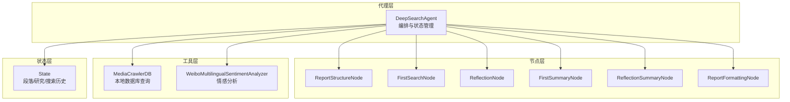
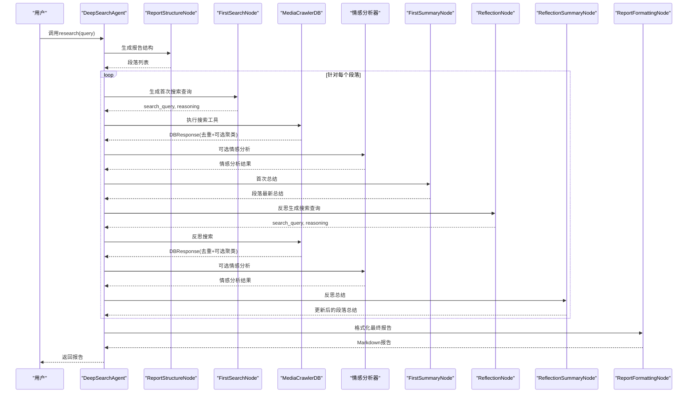
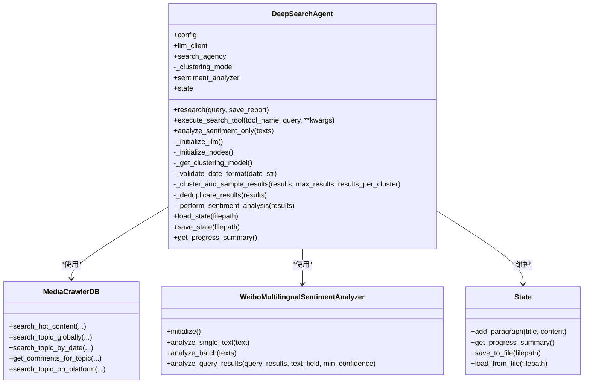
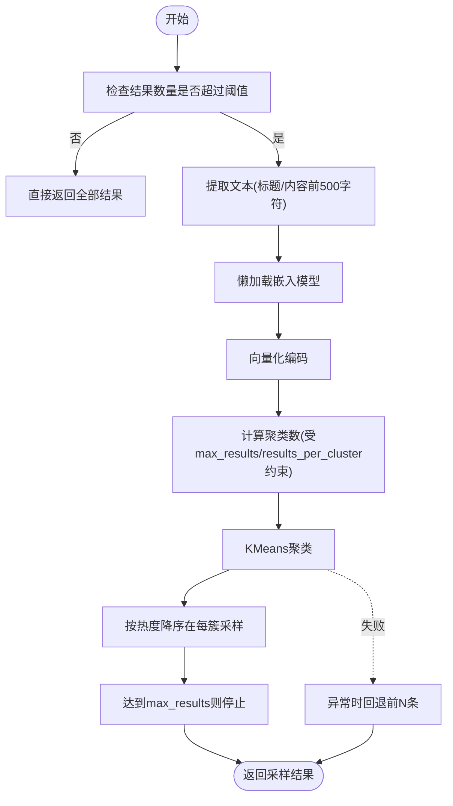
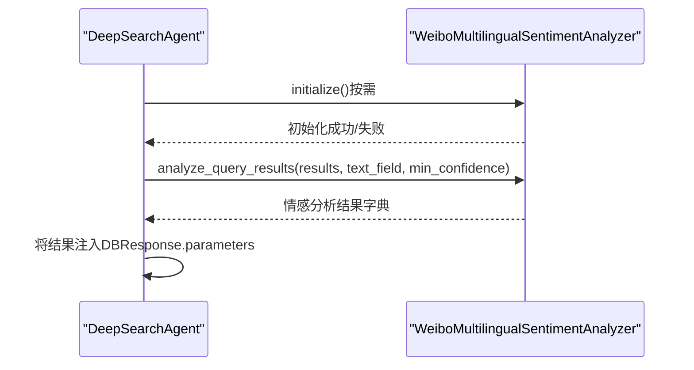
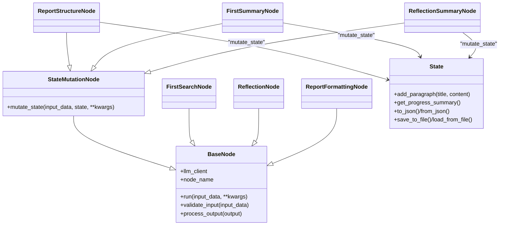
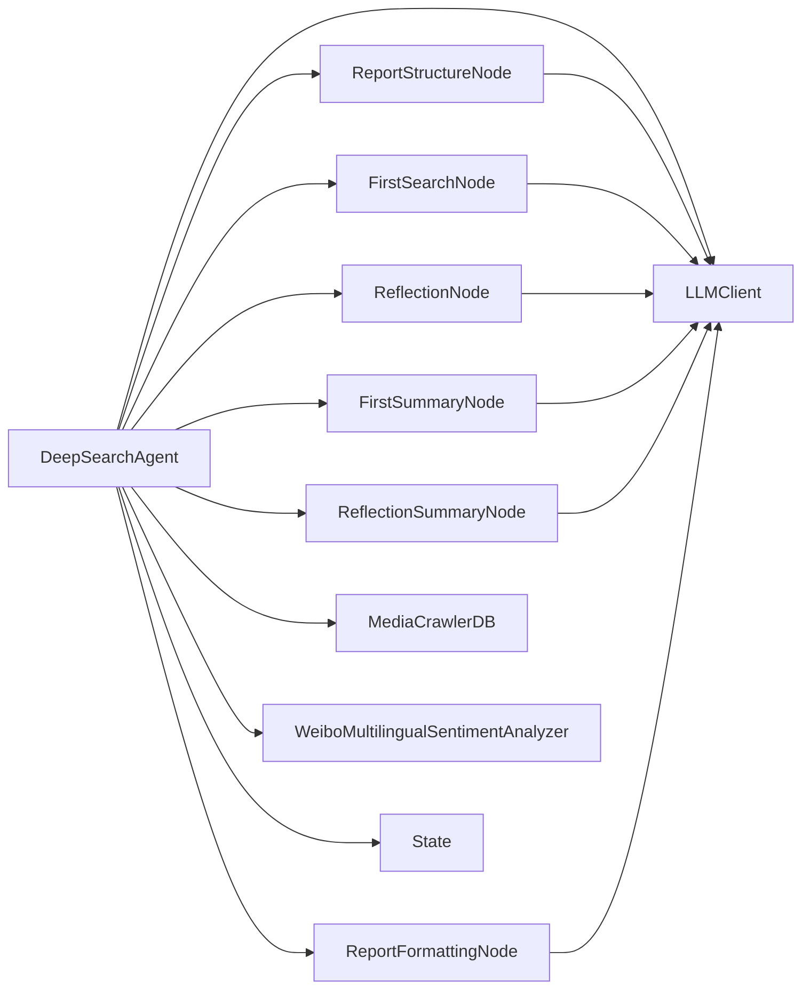

# 核心代理类与架构

<cite>
**本文引用的文件**
- [InsightEngine/agent.py](file://InsightEngine/agent.py)
- [InsightEngine/nodes/base_node.py](file://InsightEngine/nodes/base_node.py)
- [InsightEngine/nodes/report_structure_node.py](file://InsightEngine/nodes/report_structure_node.py)
- [InsightEngine/nodes/search_node.py](file://InsightEngine/nodes/search_node.py)
- [InsightEngine/nodes/summary_node.py](file://InsightEngine/nodes/summary_node.py)
- [InsightEngine/nodes/formatting_node.py](file://InsightEngine/nodes/formatting_node.py)
- [InsightEngine/state/state.py](file://InsightEngine/state/state.py)
- [InsightEngine/tools/search.py](file://InsightEngine/tools/search.py)
- [InsightEngine/tools/sentiment_analyzer.py](file://InsightEngine/tools/sentiment_analyzer.py)
- [InsightEngine/utils/config.py](file://InsightEngine/utils/config.py)
- [InsightEngine/nodes/__init__.py](file://InsightEngine/nodes/__init__.py)
- [InsightEngine/tools/__init__.py](file://InsightEngine/tools/__init__.py)
</cite>

## 目录
1. [简介](#简介)
2. [项目结构](#项目结构)
3. [核心组件](#核心组件)
4. [架构总览](#架构总览)
5. [详细组件分析](#详细组件分析)
6. [依赖关系分析](#依赖关系分析)
7. [性能考量](#性能考量)
8. [故障排查指南](#故障排查指南)
9. [结论](#结论)
10. [附录](#附录)

## 简介
本文件面向Insight Engine的“深度搜索代理”（DeepSearchAgent），系统性梳理其设计架构、初始化流程、LLM客户端集成、节点初始化与状态管理，重点解析聚类采样机制（懒加载聚类模型、KMeans聚类与结果采样策略）、日期验证、去重机制与情感分析集成。同时提供使用示例、配置项说明及搜索工具集的使用方法，帮助读者快速上手并高效扩展。

## 项目结构
Insight Engine采用“代理层 + 节点层 + 工具层 + 状态层”的分层架构：
- 代理层：DeepSearchAgent负责编排、调度与状态管理
- 节点层：各阶段处理节点（结构生成、搜索、总结、格式化）
- 工具层：本地数据库查询工具集、情感分析工具
- 状态层：报告结构、段落研究进度、最终报告等状态数据模型

图表来源
- [InsightEngine/agent.py](file://InsightEngine/agent.py#L41-L980)
- [InsightEngine/nodes/report_structure_node.py](file://InsightEngine/nodes/report_structure_node.py#L22-L205)
- [InsightEngine/nodes/search_node.py](file://InsightEngine/nodes/search_node.py#L21-L287)
- [InsightEngine/nodes/summary_node.py](file://InsightEngine/nodes/summary_node.py#L34-L363)
- [InsightEngine/nodes/formatting_node.py](file://InsightEngine/nodes/formatting_node.py#L20-L171)
- [InsightEngine/state/state.py](file://InsightEngine/state/state.py#L12-L259)
- [InsightEngine/tools/search.py](file://InsightEngine/tools/search.py#L63-L463)
- [InsightEngine/tools/sentiment_analyzer.py](file://InsightEngine/tools/sentiment_analyzer.py#L79-L704)

章节来源
- [InsightEngine/agent.py](file://InsightEngine/agent.py#L41-L980)
- [InsightEngine/nodes/__init__.py](file://InsightEngine/nodes/__init__.py#L1-L21)
- [InsightEngine/tools/__init__.py](file://InsightEngine/tools/__init__.py#L1-L39)

## 核心组件
- DeepSearchAgent：核心代理，负责初始化、编排节点、执行搜索工具、聚类采样、情感分析、状态更新与报告生成
- 节点体系：ReportStructureNode、FirstSearchNode、ReflectionNode、FirstSummaryNode、ReflectionSummaryNode、ReportFormattingNode
- 工具集：MediaCrawlerDB（本地数据库查询）、WeiboMultilingualSentimentAnalyzer（情感分析）
- 状态模型：State、Paragraph、Research、Search

章节来源
- [InsightEngine/agent.py](file://InsightEngine/agent.py#L41-L980)
- [InsightEngine/nodes/base_node.py](file://InsightEngine/nodes/base_node.py#L13-L95)
- [InsightEngine/state/state.py](file://InsightEngine/state/state.py#L12-L259)
- [InsightEngine/tools/search.py](file://InsightEngine/tools/search.py#L63-L463)
- [InsightEngine/tools/sentiment_analyzer.py](file://InsightEngine/tools/sentiment_analyzer.py#L79-L704)

## 架构总览
DeepSearchAgent以“研究-反思-再研究”的迭代方式推进，结合本地数据库查询与情感分析，最终生成结构化报告。其关键流程如下：
- 初始化：LLM客户端、搜索工具集、节点、状态、输出目录
- 报告结构生成：调用LLM生成段落数与内容规划
- 段落处理：首次搜索与总结；多轮反思搜索与总结
- 聚类采样：对去重后的结果进行嵌入编码、KMeans聚类与代表性采样
- 情感分析：对查询结果或独立文本进行多语言情感分析
- 报告格式化：将段落内容格式化为Markdown报告

图表来源
- [InsightEngine/agent.py](file://InsightEngine/agent.py#L512-L980)
- [InsightEngine/nodes/report_structure_node.py](file://InsightEngine/nodes/report_structure_node.py#L168-L205)
- [InsightEngine/nodes/search_node.py](file://InsightEngine/nodes/search_node.py#L180-L287)
- [InsightEngine/nodes/summary_node.py](file://InsightEngine/nodes/summary_node.py#L167-L363)
- [InsightEngine/nodes/formatting_node.py](file://InsightEngine/nodes/formatting_node.py#L50-L171)
- [InsightEngine/tools/search.py](file://InsightEngine/tools/search.py#L63-L463)
- [InsightEngine/tools/sentiment_analyzer.py](file://InsightEngine/tools/sentiment_analyzer.py#L467-L590)

## 详细组件分析

### DeepSearchAgent 类
- 初始化流程
  - 读取配置（Settings），构建LLM客户端
  - 初始化搜索工具集（MediaCrawlerDB）
  - 懒加载聚类模型（SentenceTransformer）
  - 初始化情感分析器（WeiboMultilingualSentimentAnalyzer）
  - 初始化节点（结构生成、首次搜索、反思、首次总结、反思总结、报告格式化）
  - 初始化状态（State）
  - 确保输出目录存在
- 关键方法
  - _initialize_llm：封装LLM客户端构造
  - _initialize_nodes：节点装配
  - _get_clustering_model：懒加载嵌入模型
  - _validate_date_format：YYYY-MM-DD格式校验
  - _cluster_and_sample_results：聚类采样主流程
  - execute_search_tool：工具集执行与关键词优化、去重、聚类、情感分析
  - _deduplicate_results：去重策略（URL或内容前缀）
  - _perform_sentiment_analysis：对搜索结果执行情感分析
  - analyze_sentiment_only：独立情感分析工具
  - research/_generate_report_structure/_process_paragraphs/_generate_final_report/_save_report：研究主流程
  - load_state/save_state/get_progress_summary：状态持久化与进度查询

图表来源
- [InsightEngine/agent.py](file://InsightEngine/agent.py#L41-L980)
- [InsightEngine/tools/search.py](file://InsightEngine/tools/search.py#L63-L463)
- [InsightEngine/tools/sentiment_analyzer.py](file://InsightEngine/tools/sentiment_analyzer.py#L79-L704)
- [InsightEngine/state/state.py](file://InsightEngine/state/state.py#L142-L259)

章节来源
- [InsightEngine/agent.py](file://InsightEngine/agent.py#L41-L980)

### 聚类采样机制
- 懒加载聚类模型
  - 首次使用时加载“paraphrase-multilingual-MiniLM-L12-v2”嵌入模型
- KMeans聚类与采样策略
  - 提取标题或内容前500字符作为文本
  - 编码为向量，计算聚类数（受最大结果数与每簇采样数约束）
  - 使用KMeans聚类，按热度分数降序在每个簇内采样固定数量
  - 若聚类失败，回退保留前N条
- 参数
  - ENABLE_CLUSTERING：是否启用聚类采样
  - MAX_CLUSTERED_RESULTS：聚类后最大返回结果数
  - RESULTS_PER_CLUSTER：每簇采样数

图表来源
- [InsightEngine/agent.py](file://InsightEngine/agent.py#L129-L189)

章节来源
- [InsightEngine/agent.py](file://InsightEngine/agent.py#L36-L38)
- [InsightEngine/agent.py](file://InsightEngine/agent.py#L95-L102)
- [InsightEngine/agent.py](file://InsightEngine/agent.py#L129-L189)

### 日期验证与去重机制
- 日期验证
  - 格式正则：YYYY-MM-DD
  - 使用datetime解析校验有效性
- 去重
  - 以URL为主标识，否则以内容前缀作为唯一标识
  - 保持首次出现顺序

章节来源
- [InsightEngine/agent.py](file://InsightEngine/agent.py#L104-L128)
- [InsightEngine/agent.py](file://InsightEngine/agent.py#L373-L387)

### 情感分析集成
- 模型与初始化
  - 多语言情感分析模型（WeiboMultilingualSentimentAnalyzer）
  - 自动检测GPU/CPU/MPS设备，支持本地缓存模型
  - 可通过配置开关禁用
- 执行位置
  - 搜索工具执行后（可选）与独立情感分析工具
- 输出
  - 情感分布、平均置信度、高置信度结果摘要

图表来源
- [InsightEngine/agent.py](file://InsightEngine/agent.py#L389-L435)
- [InsightEngine/tools/sentiment_analyzer.py](file://InsightEngine/tools/sentiment_analyzer.py#L158-L241)
- [InsightEngine/tools/sentiment_analyzer.py](file://InsightEngine/tools/sentiment_analyzer.py#L467-L590)

章节来源
- [InsightEngine/agent.py](file://InsightEngine/agent.py#L62-L63)
- [InsightEngine/agent.py](file://InsightEngine/agent.py#L220-L228)
- [InsightEngine/agent.py](file://InsightEngine/agent.py#L360-L370)
- [InsightEngine/agent.py](file://InsightEngine/agent.py#L436-L511)
- [InsightEngine/tools/sentiment_analyzer.py](file://InsightEngine/tools/sentiment_analyzer.py#L79-L704)

### 节点与状态管理
- 节点基类
  - BaseNode：抽象run与通用输入/输出处理
  - StateMutationNode：扩展mutate_state以修改State
- 报告结构生成
  - 生成段落数与内容规划，写入State
- 搜索与总结
  - 首次搜索与反思搜索分别生成查询
  - 首次总结与反思总结更新段落最新状态
- 报告格式化
  - 将段落内容格式化为Markdown，失败时回退手动格式化

图表来源
- [InsightEngine/nodes/base_node.py](file://InsightEngine/nodes/base_node.py#L13-L95)
- [InsightEngine/nodes/report_structure_node.py](file://InsightEngine/nodes/report_structure_node.py#L22-L205)
- [InsightEngine/nodes/search_node.py](file://InsightEngine/nodes/search_node.py#L21-L287)
- [InsightEngine/nodes/summary_node.py](file://InsightEngine/nodes/summary_node.py#L34-L363)
- [InsightEngine/nodes/formatting_node.py](file://InsightEngine/nodes/formatting_node.py#L20-L171)
- [InsightEngine/state/state.py](file://InsightEngine/state/state.py#L142-L259)

章节来源
- [InsightEngine/nodes/base_node.py](file://InsightEngine/nodes/base_node.py#L13-L95)
- [InsightEngine/nodes/report_structure_node.py](file://InsightEngine/nodes/report_structure_node.py#L168-L205)
- [InsightEngine/nodes/summary_node.py](file://InsightEngine/nodes/summary_node.py#L167-L363)
- [InsightEngine/nodes/formatting_node.py](file://InsightEngine/nodes/formatting_node.py#L50-L171)
- [InsightEngine/state/state.py](file://InsightEngine/state/state.py#L142-L259)

### 搜索工具集使用
- 工具类型
  - search_hot_content：热点内容（按时间窗口聚合）
  - search_topic_globally：全局话题搜索（跨表）
  - search_topic_by_date：按日期范围搜索
  - get_comments_for_topic：提取评论
  - search_topic_on_platform：平台定向搜索（支持时间筛选）
- 关键特性
  - 统一返回DBResponse（包含工具名、参数、结果列表、计数）
  - 内部统一时间解析与列映射
  - 限制参数由配置文件控制，避免Agent直接覆盖

章节来源
- [InsightEngine/tools/search.py](file://InsightEngine/tools/search.py#L63-L463)

## 依赖关系分析
- 组件耦合
  - DeepSearchAgent依赖LLM客户端、节点、工具集、状态
  - 节点依赖LLM客户端与状态
  - 工具集与状态相互独立，通过DBResponse与State交互
- 外部依赖
  - 嵌入模型（sentence-transformers）
  - 聚类算法（scikit-learn KMeans）
  - 情感分析（transformers + torch）

图表来源
- [InsightEngine/agent.py](file://InsightEngine/agent.py#L17-L34)
- [InsightEngine/nodes/base_node.py](file://InsightEngine/nodes/base_node.py#L16-L25)
- [InsightEngine/state/state.py](file://InsightEngine/state/state.py#L142-L151)

章节来源
- [InsightEngine/agent.py](file://InsightEngine/agent.py#L17-L34)
- [InsightEngine/nodes/base_node.py](file://InsightEngine/nodes/base_node.py#L16-L25)
- [InsightEngine/state/state.py](file://InsightEngine/state/state.py#L142-L151)

## 性能考量
- 聚类采样
  - 嵌入编码与KMeans聚类成本与结果规模线性相关，建议合理设置MAX_CLUSTERED_RESULTS与RESULTS_PER_CLUSTER
  - 懒加载避免初始化开销，仅在首次使用时加载模型
- 搜索工具
  - 通过配置文件限制每表/每工具返回数量，减少LLM输入压力
- 情感分析
  - 批量分析优于逐条分析；模型初始化后复用，避免重复加载
- I/O
  - 输出目录提前创建，避免运行时阻塞

[本节为通用指导，无需具体文件来源]

## 故障排查指南
- 模型初始化失败
  - 检查依赖（torch、transformers）与可用设备（CUDA/MPS/CPU）
  - 情感分析开关：可通过配置禁用
- 聚类失败回退
  - 聚类异常时自动回退前N条，检查日志定位问题
- 日期格式错误
  - 严格要求YYYY-MM-DD，否则工具自动回退为全局搜索
- 搜索超时或无结果
  - 调整配置中的SEARCH_TIMEOUT与各工具limit
- 报告格式化失败
  - LLM失败时自动回退手动格式化

章节来源
- [InsightEngine/tools/sentiment_analyzer.py](file://InsightEngine/tools/sentiment_analyzer.py#L158-L241)
- [InsightEngine/agent.py](file://InsightEngine/agent.py#L186-L188)
- [InsightEngine/agent.py](file://InsightEngine/agent.py#L618-L630)
- [InsightEngine/nodes/formatting_node.py](file://InsightEngine/nodes/formatting_node.py#L90-L116)

## 结论
DeepSearchAgent通过清晰的分层架构与稳健的容错机制，实现了从报告结构生成到最终报告输出的全链路自动化。其聚类采样、去重与情感分析能力显著提升了信息质量与洞察深度。配合灵活的配置与工具集，能够满足多样化的研究需求。

[本节为总结，无需具体文件来源]

## 附录

### 使用示例与配置说明
- 初始化与研究
  - 创建Agent：通过create_agent或直接实例化
  - 执行研究：调用research(query, save_report=True)
- 搜索工具调用
  - execute_search_tool(tool_name, query, **kwargs)
  - 支持工具：search_hot_content、search_topic_globally、search_topic_by_date、get_comments_for_topic、search_topic_on_platform、analyze_sentiment
  - 关键参数：enable_sentiment（默认True）、时间范围、平台、limit等
- 聚类采样参数
  - ENABLE_CLUSTERING：是否启用聚类采样
  - MAX_CLUSTERED_RESULTS：聚类后最大返回结果数
  - RESULTS_PER_CLUSTER：每簇采样数
- 情感分析开关
  - SENTIMENT_ANALYSIS_ENABLED：全局开关
  - analyze_sentiment_only：独立情感分析工具
- 配置项（来自Settings）
  - LLM相关：INSIGHT_ENGINE_API_KEY、INSIGHT_ENGINE_BASE_URL、INSIGHT_ENGINE_MODEL_NAME
  - 数据库：DB_HOST、DB_USER、DB_PASSWORD、DB_NAME、DB_PORT、DB_CHARSET、DB_DIALECT
  - 控制参数：MAX_REFLECTIONS、MAX_PARAGRAPHS、SEARCH_TIMEOUT、MAX_CONTENT_LENGTH、MAX_SEARCH_RESULTS_FOR_LLM、MAX_HIGH_CONFIDENCE_SENTIMENT_RESULTS
  - 默认限制：各工具默认返回数量
  - 输出与状态：OUTPUT_DIR、SAVE_INTERMEDIATE_STATES

章节来源
- [InsightEngine/agent.py](file://InsightEngine/agent.py#L512-L547)
- [InsightEngine/agent.py](file://InsightEngine/agent.py#L190-L371)
- [InsightEngine/agent.py](file://InsightEngine/agent.py#L36-L38)
- [InsightEngine/agent.py](file://InsightEngine/agent.py#L436-L511)
- [InsightEngine/utils/config.py](file://InsightEngine/utils/config.py#L13-L45)
- [InsightEngine/tools/search.py](file://InsightEngine/tools/search.py#L63-L463)
- [InsightEngine/tools/sentiment_analyzer.py](file://InsightEngine/tools/sentiment_analyzer.py#L31-L32)
- [InsightEngine/tools/sentiment_analyzer.py](file://InsightEngine/tools/sentiment_analyzer.py#L635-L644)