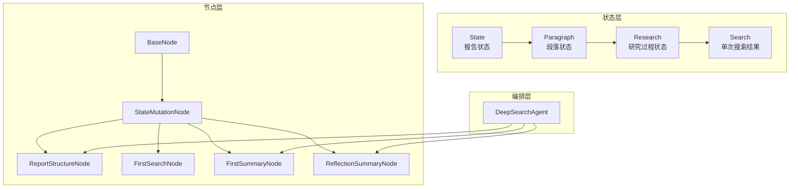
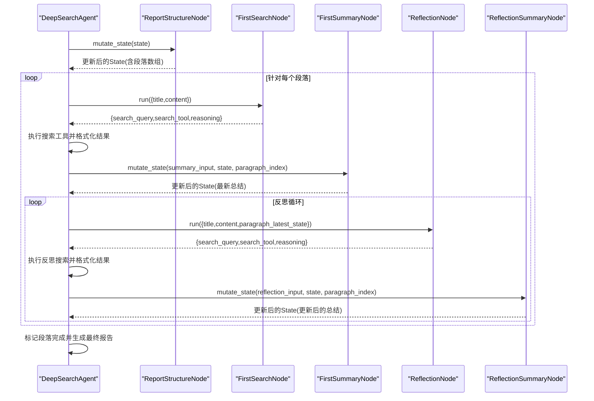
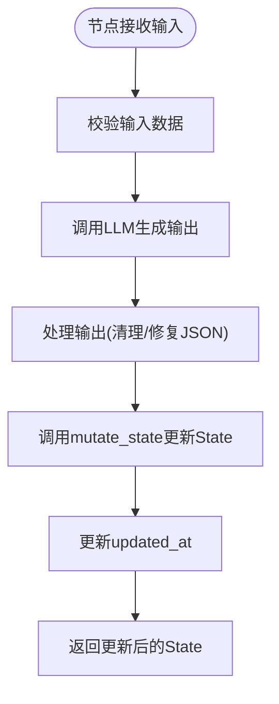
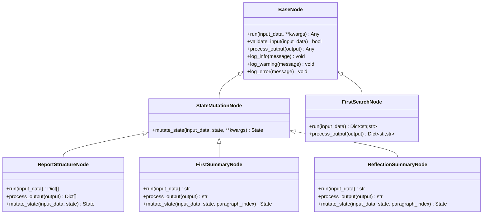
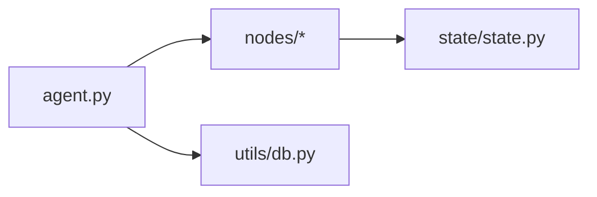

# 状态管理与数据流转

<cite>
**本文档引用的文件**
- [state.py](file://InsightEngine/state/state.py)
- [base_node.py](file://InsightEngine/nodes/base_node.py)
- [agent.py](file://InsightEngine/agent.py)
- [search_node.py](file://InsightEngine/nodes/search_node.py)
- [summary_node.py](file://InsightEngine/nodes/summary_node.py)
- [report_structure_node.py](file://InsightEngine/nodes/report_structure_node.py)
- [db.py](file://InsightEngine/utils/db.py)
- [__init__.py](file://InsightEngine/__init__.py)
</cite>

## 目录
1. [简介](#简介)
2. [项目结构](#项目结构)
3. [核心组件](#核心组件)
4. [架构概览](#架构概览)
5. [详细组件分析](#详细组件分析)
6. [依赖关系分析](#依赖关系分析)
7. [性能考量](#性能考量)
8. [故障排查指南](#故障排查指南)
9. [结论](#结论)
10. [附录](#附录)

## 简介
本文件系统性阐述 Insight Engine 的状态管理与数据流转机制，重点围绕 State 类的设计架构、报告状态、段落状态与研究过程状态的数据结构，以及状态在各节点间的传递方式。文档还涵盖 mutate_state 方法的实现细节、数据序列化处理、状态持久化与版本管理策略、并发安全设计思路，以及扩展 State 类与新增状态字段的开发指导。

## 项目结构
Insight Engine 的状态管理位于 InsightEngine/state/state.py，节点基类与具体节点位于 InsightEngine/nodes/，主流程编排位于 InsightEngine/agent.py。状态序列化与持久化能力由 State 类提供，节点通过继承 StateMutationNode 实现对 State 的变更。

图表来源
- [state.py](file://InsightEngine/state/state.py#L14-L259)
- [base_node.py](file://InsightEngine/nodes/base_node.py#L13-L94)
- [agent.py](file://InsightEngine/agent.py#L41-L980)

章节来源
- [state.py](file://InsightEngine/state/state.py#L1-L259)
- [base_node.py](file://InsightEngine/nodes/base_node.py#L1-L94)
- [agent.py](file://InsightEngine/agent.py#L1-L980)

## 核心组件
- State：顶层状态容器，包含查询、报告标题、段落数组、最终报告、完成标志及时间戳；提供 to_dict/from_dict、to_json/from_json、save_to_file/load_from_file 等序列化与持久化方法。
- Paragraph：段落级状态，包含标题、预期内容、研究进度与顺序；提供完成判断与最终内容获取。
- Research：研究过程状态，维护搜索历史、最新总结、反思迭代次数与完成标志；提供批量添加搜索结果、计数与完成标记。
- Search：单次搜索结果状态，包含查询、链接、标题、内容、评分与时间戳；提供 to_dict/from_dict 序列化。
- StateMutationNode：带状态修改能力的节点基类，定义 mutate_state 抽象方法。
- ReportStructureNode/FirstSearchNode/FirstSummaryNode/ReflectionSummaryNode：具体节点，分别负责生成报告结构、首次搜索查询、首次总结与反思总结，并通过 mutate_state 更新 State。

章节来源
- [state.py](file://InsightEngine/state/state.py#L12-L259)
- [base_node.py](file://InsightEngine/nodes/base_node.py#L78-L94)

## 架构概览
状态在 Insight Engine 中以“自顶向下”的方式贯穿：Agent 首先通过 ReportStructureNode 生成段落结构并写入 State；随后逐段执行 FirstSearchNode 与 FirstSummaryNode 完成初始研究与总结；进入反思循环，由 ReflectionNode 生成新的搜索查询，再由 ReflectionSummaryNode 更新段落总结；最后由 Agent 标记段落完成并汇总生成最终报告。

图表来源
- [agent.py](file://InsightEngine/agent.py#L512-L800)
- [report_structure_node.py](file://InsightEngine/nodes/report_structure_node.py#L168-L205)
- [summary_node.py](file://InsightEngine/nodes/summary_node.py#L167-L197)
- [summary_node.py](file://InsightEngine/nodes/summary_node.py#L332-L363)
- [search_node.py](file://InsightEngine/nodes/search_node.py#L45-L151)

## 详细组件分析

### State 类设计与数据结构
- 字段与职责
  - query/report_title：顶层查询与报告标题
  - paragraphs：段落数组，承载段落状态
  - final_report：最终报告内容
  - is_completed：整体完成标志
  - created_at/updated_at：时间戳，用于追踪状态生命周期
- 关键方法
  - add_paragraph/get_paragraph：段落增删查
  - get_progress_summary：计算完成度与统计摘要
  - to_dict/to_json/from_dict/from_json：序列化与反序列化
  - save_to_file/load_from_file：文件持久化
  - update_timestamp/mark_completed：状态更新与完成标记
- 设计特点
  - 使用 dataclass 简化字段定义与默认值
  - 递归序列化/反序列化 Paragraph/Research/Search，确保嵌套结构一致性
  - 时间戳字段统一使用 ISO 8601 字符串，便于跨语言与存储

章节来源
- [state.py](file://InsightEngine/state/state.py#L143-L259)

### Paragraph 与 Research 状态
- Paragraph
  - is_completed：基于 research.is_completed 与 latest_summary 是否为空判断
  - get_final_content：优先返回最新总结，否则回退到预期内容
- Research
  - add_search/add_search_results：批量注入搜索结果
  - increment_reflection：反射迭代计数
  - mark_completed：完成标记
  - to_dict/from_dict：序列化嵌套 Search 列表

章节来源
- [state.py](file://InsightEngine/state/state.py#L103-L140)
- [state.py](file://InsightEngine/state/state.py#L46-L101)

### Search 数据结构
- 字段：query/url/title/content/score/timestamp
- to_dict/from_dict：标准化字典映射，便于 JSON 序列化与跨模块传输

章节来源
- [state.py](file://InsightEngine/state/state.py#L12-L44)

### mutate_state 方法实现与数据传递
- StateMutationNode.mutate_state：抽象接口，要求节点返回新的 State 或在原地修改后回传
- ReportStructureNode.mutate_state：接收查询，生成段落结构，写入 State.query、State.report_title 与 State.paragraphs
- FirstSummaryNode.mutate_state：生成首次总结，写入指定段落的 research.latest_summary，并更新时间戳
- ReflectionSummaryNode.mutate_state：生成反思总结，更新 research.latest_summary 并递增反射次数，同时更新时间戳

图表来源
- [base_node.py](file://InsightEngine/nodes/base_node.py#L78-L94)
- [report_structure_node.py](file://InsightEngine/nodes/report_structure_node.py#L168-L205)
- [summary_node.py](file://InsightEngine/nodes/summary_node.py#L167-L197)
- [summary_node.py](file://InsightEngine/nodes/summary_node.py#L332-L363)

章节来源
- [base_node.py](file://InsightEngine/nodes/base_node.py#L78-L94)
- [report_structure_node.py](file://InsightEngine/nodes/report_structure_node.py#L168-L205)
- [summary_node.py](file://InsightEngine/nodes/summary_node.py#L167-L197)
- [summary_node.py](file://InsightEngine/nodes/summary_node.py#L332-L363)

### 数据序列化与持久化
- 序列化
  - to_dict：递归将 State/Paragraph/Research/Search 转为字典
  - to_json：基于 to_dict 输出 JSON 字符串
- 反序列化
  - from_dict/from_json：从字典/JSON 重建对象树
- 文件持久化
  - save_to_file/load_from_file：以 UTF-8 写入/读取 JSON 文件
- 注意事项
  - 时间戳字段统一为 ISO 8601 字符串
  - 嵌套结构严格遵循 to_dict/from_dict 的映射约定

章节来源
- [state.py](file://InsightEngine/state/state.py#L211-L259)

### Agent 中的状态流转
- _generate_report_structure：调用 ReportStructureNode.mutate_state，生成段落结构并写入 State
- _initial_search_and_summary：生成搜索查询与工具，执行搜索并格式化结果，调用 FirstSummaryNode.mutate_state 更新最新总结
- _reflection_loop：循环生成反思查询，执行反思搜索，调用 ReflectionSummaryNode.mutate_state 更新总结
- 标记完成：逐段 research.mark_completed，最终生成并保存报告

章节来源
- [agent.py](file://InsightEngine/agent.py#L549-L800)

### 节点类图

图表来源
- [base_node.py](file://InsightEngine/nodes/base_node.py#L13-L94)
- [report_structure_node.py](file://InsightEngine/nodes/report_structure_node.py#L22-L205)
- [search_node.py](file://InsightEngine/nodes/search_node.py#L21-L287)
- [summary_node.py](file://InsightEngine/nodes/summary_node.py#L34-L363)

## 依赖关系分析
- 模块依赖
  - agent.py 依赖 nodes/* 与 state/state.py
  - nodes/* 依赖 state/state.py 与 llms/base.py
  - state/state.py 依赖 dataclasses、typing、json、datetime
- 耦合与内聚
  - State 与各节点通过 mutate_state 解耦，节点仅关注自身业务逻辑
  - ReportStructureNode/FirstSummaryNode/ReflectionSummaryNode 通过 StateMutationNode 统一接口，便于替换与扩展
- 外部依赖
  - 数据库访问工具位于 utils/db.py，提供异步连接与查询封装，可用于状态持久化的数据库后端（若采用）

图表来源
- [agent.py](file://InsightEngine/agent.py#L17-L34)
- [db.py](file://InsightEngine/utils/db.py#L1-L73)

章节来源
- [agent.py](file://InsightEngine/agent.py#L17-L34)
- [db.py](file://InsightEngine/utils/db.py#L1-L73)

## 性能考量
- 序列化开销
  - 递归 to_dict 适合中等规模状态；若段落数量巨大，建议分页或延迟加载
- I/O 与磁盘
  - save_to_file/load_from_file 为同步阻塞；在高并发场景建议引入队列或异步文件系统
- 时间戳更新
  - 每次 mutate_state 后更新 updated_at，避免频繁写入可考虑批量更新策略
- 搜索与总结
  - 搜索结果数量受配置限制，避免一次性传递过多数据给 LLM；必要时采用分批处理

## 故障排查指南
- JSON 解析失败
  - 节点输出处理包含清理、修复与降级策略；若仍失败，检查 LLM 输出格式与提示词
- 状态索引越界
  - mutate_state 中对段落索引进行边界检查；确认段落生成顺序与索引一致
- 日期格式错误
  - Agent 对日期格式进行正则与有效性校验；不符合规范时回退到全局搜索
- 情感分析不可用
  - 分析器初始化失败或被禁用时，记录警告并透传原始文本

章节来源
- [search_node.py](file://InsightEngine/nodes/search_node.py#L81-L151)
- [summary_node.py](file://InsightEngine/nodes/summary_node.py#L115-L166)
- [agent.py](file://InsightEngine/agent.py#L104-L128)
- [agent.py](file://InsightEngine/agent.py#L389-L511)

## 结论
Insight Engine 的状态管理以 State 为核心，通过 dataclass 简化结构定义，借助 to_dict/from_dict 实现稳定序列化，配合 StateMutationNode 的 mutate_state 接口实现节点对状态的可控修改。Agent 层负责编排流程，确保状态在各阶段正确传递与持久化。当前实现强调可读性与可维护性，后续可在并发安全、持久化后端与大规模状态处理方面进一步增强。

## 附录

### 状态扩展与自定义字段开发指南
- 扩展 State
  - 在 State 类中添加新字段，并在 to_dict/from_dict 中同步映射
  - 如需持久化到文件，确保新字段可被 JSON 序列化
- 扩展 Paragraph/Research/Search
  - 在对应 dataclass 中添加字段，并提供 to_dict/from_dict 映射
  - 若涉及复杂类型，提供转换逻辑（如枚举、嵌套对象）
- 新增状态字段的最佳实践
  - 默认值与类型注解保持一致
  - 提供 to_dict/from_dict 的双向映射，避免遗漏
  - 在 Agent 流程中明确字段用途，避免与现有字段冲突
- 示例路径
  - State 字段扩展：参考 [state.py](file://InsightEngine/state/state.py#L143-L259)
  - Paragraph 字段扩展：参考 [state.py](file://InsightEngine/state/state.py#L103-L140)
  - Research 字段扩展：参考 [state.py](file://InsightEngine/state/state.py#L46-L101)
  - Search 字段扩展：参考 [state.py](file://InsightEngine/state/state.py#L12-L44)

章节来源
- [state.py](file://InsightEngine/state/state.py#L12-L259)

### 并发安全与版本管理建议
- 并发安全
  - 当前状态对象为纯数据结构，mutate_state 返回新状态或在原地修改后回传；建议在 Agent 层以单线程顺序执行关键流程，避免多线程同时修改同一 State
  - 若需多线程，可引入轻量级锁保护关键区，或采用消息队列串行化状态变更
- 版本管理
  - 为 State 增加 version 字段，每次 mutate_state 递增
  - 提供 from_dict 的向后兼容逻辑，处理字段缺失或类型变化
  - 对外暴露状态快照接口，便于审计与回滚

[本节为通用建议，不直接分析特定文件]