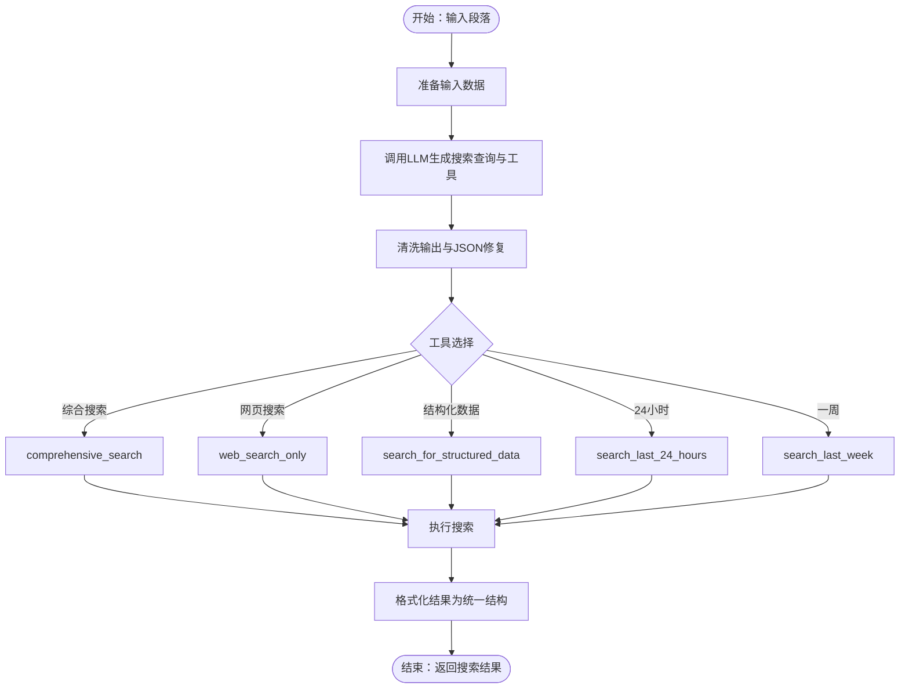

# Media Engine（多模态内容分析引擎）

<cite>
**本文档引用的文件**
- [MediaEngine/__init__.py](file://MediaEngine/__init__.py)
- [MediaEngine/agent.py](file://MediaEngine/agent.py)
- [MediaEngine/nodes/base_node.py](file://MediaEngine/nodes/base_node.py)
- [MediaEngine/nodes/search_node.py](file://MediaEngine/nodes/search_node.py)
- [MediaEngine/nodes/summary_node.py](file://MediaEngine/nodes/summary_node.py)
- [MediaEngine/nodes/report_structure_node.py](file://MediaEngine/nodes/report_structure_node.py)
- [MediaEngine/nodes/formatting_node.py](file://MediaEngine/nodes/formatting_node.py)
- [MediaEngine/state/state.py](file://MediaEngine/state/state.py)
- [MediaEngine/utils/config.py](file://MediaEngine/utils/config.py)
- [MediaEngine/utils/text_processing.py](file://MediaEngine/utils/text_processing.py)
- [MediaEngine/prompts/prompts.py](file://MediaEngine/prompts/prompts.py)
- [MediaEngine/llms/base.py](file://MediaEngine/llms/base.py)
- [MediaEngine/tools/search.py](file://MediaEngine/tools/search.py)
- [SingleEngineApp/media_engine_streamlit_app.py](file://SingleEngineApp/media_engine_streamlit_app.py)
- [README.md](file://README.md)
</cite>

## 目录
1. [简介](#简介)
2. [项目结构](#项目结构)
3. [核心组件](#核心组件)
4. [架构总览](#架构总览)
5. [详细组件分析](#详细组件分析)
6. [依赖关系分析](#依赖关系分析)
7. [性能考虑](#性能考虑)
8. [故障排查指南](#故障排查指南)
9. [结论](#结论)
10. [附录](#附录)

## 简介
Media Engine（多模态内容分析引擎）是一个节点化、状态驱动的多模态内容分析与报告生成系统。它通过“报告结构生成 → 段落级搜索与总结 → 反思迭代 → 报告格式化”的流水线，结合强大多模态搜索工具（Bocha/Anspire），实现对文本、图片、结构化数据等多模态信息的深度整合与分析。系统采用模块化节点设计与统一状态管理，支持可插拔的LLM客户端与多种搜索工具，具备良好的扩展性与稳定性。

## 项目结构
Media Engine 位于项目根目录下的 MediaEngine 子目录中，采用“引擎 + 节点 + 状态 + 工具 + 提示词 + LLM封装 + 配置”的分层组织方式。核心模块包括：
- agent：主控制器，编排节点与状态流转
- nodes：节点层，包含搜索、总结、报告结构、格式化等节点
- state：状态模型，承载查询、段落、研究历史与最终报告
- tools：多模态搜索工具集（Bocha/Anspire）
- utils：配置与文本处理工具
- prompts：各阶段提示词与JSON Schema
- llms：统一LLM客户端封装
- __init__.py：对外暴露入口与版本信息

**图表来源**
- [MediaEngine/agent.py](file://MediaEngine/agent.py#L26-L508)
- [MediaEngine/nodes/base_node.py](file://MediaEngine/nodes/base_node.py#L13-L95)
- [MediaEngine/state/state.py](file://MediaEngine/state/state.py#L12-L293)
- [MediaEngine/tools/search.py](file://MediaEngine/tools/search.py#L100-L519)
- [MediaEngine/utils/config.py](file://MediaEngine/utils/config.py#L16-L89)
- [MediaEngine/prompts/prompts.py](file://MediaEngine/prompts/prompts.py#L1-L451)
- [MediaEngine/llms/base.py](file://MediaEngine/llms/base.py#L31-L171)
- [MediaEngine/__init__.py](file://MediaEngine/__init__.py#L1-L13)

**章节来源**
- [MediaEngine/agent.py](file://MediaEngine/agent.py#L26-L508)
- [MediaEngine/nodes/base_node.py](file://MediaEngine/nodes/base_node.py#L13-L95)
- [MediaEngine/state/state.py](file://MediaEngine/state/state.py#L12-L293)
- [MediaEngine/tools/search.py](file://MediaEngine/tools/search.py#L100-L519)
- [MediaEngine/utils/config.py](file://MediaEngine/utils/config.py#L16-L89)
- [MediaEngine/prompts/prompts.py](file://MediaEngine/prompts/prompts.py#L1-L451)
- [MediaEngine/llms/base.py](file://MediaEngine/llms/base.py#L31-L171)
- [MediaEngine/__init__.py](file://MediaEngine/__init__.py#L1-L13)

## 核心组件
- 主控制器（DeepSearchAgent/AnspireSearchAgent）：负责整体流程编排、节点初始化、状态管理与报告保存
- 节点层（Search/Summary/ReportStructure/Formatting）：每个节点负责特定阶段的处理，遵循统一的输入/输出与状态变更接口
- 状态管理（State/Paragraph/Research/Search）：以数据类形式描述查询、段落、研究历史与最终报告
- 搜索工具（BochaMultimodalSearch/AnspireAISearch）：提供多模态搜索能力，支持结构化数据卡片与时效性检索
- LLM客户端（LLMClient）：统一OpenAI兼容接口，支持流式与重试机制
- 文本处理与提示词：清洗输出、修复JSON、格式化提示词与Schema约束

**章节来源**
- [MediaEngine/agent.py](file://MediaEngine/agent.py#L26-L508)
- [MediaEngine/nodes/search_node.py](file://MediaEngine/nodes/search_node.py#L21-L287)
- [MediaEngine/nodes/summary_node.py](file://MediaEngine/nodes/summary_node.py#L34-L369)
- [MediaEngine/nodes/report_structure_node.py](file://MediaEngine/nodes/report_structure_node.py#L22-L205)
- [MediaEngine/nodes/formatting_node.py](file://MediaEngine/nodes/formatting_node.py#L18-L169)
- [MediaEngine/state/state.py](file://MediaEngine/state/state.py#L12-L293)
- [MediaEngine/tools/search.py](file://MediaEngine/tools/search.py#L100-L519)
- [MediaEngine/llms/base.py](file://MediaEngine/llms/base.py#L31-L171)
- [MediaEngine/utils/text_processing.py](file://MediaEngine/utils/text_processing.py#L12-L309)
- [MediaEngine/prompts/prompts.py](file://MediaEngine/prompts/prompts.py#L1-L451)

## 架构总览
Media Engine 采用“节点化处理 + 状态驱动”的流水线架构。主控制器根据查询生成报告结构，逐段执行“首次搜索与总结 → 反思搜索与总结 → 反思迭代 → 格式化报告”的循环，最终输出Markdown报告并持久化状态。

**图表来源**
- [MediaEngine/agent.py](file://MediaEngine/agent.py#L133-L428)
- [MediaEngine/nodes/report_structure_node.py](file://MediaEngine/nodes/report_structure_node.py#L168-L205)
- [MediaEngine/nodes/search_node.py](file://MediaEngine/nodes/search_node.py#L45-L151)
- [MediaEngine/nodes/summary_node.py](file://MediaEngine/nodes/summary_node.py#L170-L200)
- [MediaEngine/nodes/formatting_node.py](file://MediaEngine/nodes/formatting_node.py#L48-L115)
- [MediaEngine/state/state.py](file://MediaEngine/state/state.py#L176-L293)

## 详细组件分析

### 节点化处理架构
- 节点基类（BaseNode/StateMutationNode）：定义统一的 run/process_output/validate_input 接口，支持状态变更节点的 mutate_state
- 搜索节点（FirstSearchNode/ReflectionNode）：根据段落与上下文生成搜索查询与工具选择，输出标准化JSON
- 总结节点（FirstSummaryNode/ReflectionSummaryNode）：基于搜索结果与提示词生成段落内容，支持HOST发言注入
- 报告结构节点（ReportStructureNode）：生成段落大纲，写入状态
- 报告格式化节点（ReportFormattingNode）：将段落内容格式化为Markdown报告，支持备用手动格式化

**图表来源**
- [MediaEngine/nodes/base_node.py](file://MediaEngine/nodes/base_node.py#L13-L95)
- [MediaEngine/nodes/search_node.py](file://MediaEngine/nodes/search_node.py#L21-L287)
- [MediaEngine/nodes/summary_node.py](file://MediaEngine/nodes/summary_node.py#L34-L369)
- [MediaEngine/nodes/report_structure_node.py](file://MediaEngine/nodes/report_structure_node.py#L22-L205)
- [MediaEngine/nodes/formatting_node.py](file://MediaEngine/nodes/formatting_node.py#L18-L169)

**章节来源**
- [MediaEngine/nodes/base_node.py](file://MediaEngine/nodes/base_node.py#L13-L95)
- [MediaEngine/nodes/search_node.py](file://MediaEngine/nodes/search_node.py#L21-L287)
- [MediaEngine/nodes/summary_node.py](file://MediaEngine/nodes/summary_node.py#L34-L369)
- [MediaEngine/nodes/report_structure_node.py](file://MediaEngine/nodes/report_structure_node.py#L22-L205)
- [MediaEngine/nodes/formatting_node.py](file://MediaEngine/nodes/formatting_node.py#L18-L169)

### 状态管理模式
- Search：单次搜索结果，包含查询、URL、标题、内容、评分、段落归属、工具与时间戳
- Research：段落研究过程，维护搜索历史、最新总结、反思次数与完成状态
- Paragraph：段落，包含标题、预期内容、研究进度与顺序
- State：全局状态，包含查询、报告标题、段落列表、最终报告、完成状态与时间戳；提供进度摘要与序列化

**图表来源**
- [MediaEngine/state/state.py](file://MediaEngine/state/state.py#L12-L293)

**章节来源**
- [MediaEngine/state/state.py](file://MediaEngine/state/state.py#L12-L293)

### 搜索节点：多平台内容检索
- 首次搜索节点（FirstSearchNode）：根据段落标题与内容生成搜索查询与工具选择，支持JSON Schema约束与输出清洗
- 反思节点（ReflectionNode）：基于当前段落最新状态反思缺失，生成新的搜索查询与工具
- 搜索工具集（BochaMultimodalSearch/AnspireAISearch）：提供综合搜索、网页搜索、结构化数据查询、24小时/一周时效检索等工具，统一响应结构

**图表来源**
- [MediaEngine/nodes/search_node.py](file://MediaEngine/nodes/search_node.py#L45-L151)
- [MediaEngine/tools/search.py](file://MediaEngine/tools/search.py#L213-L266)
- [MediaEngine/prompts/prompts.py](file://MediaEngine/prompts/prompts.py#L138-L182)

**章节来源**
- [MediaEngine/nodes/search_node.py](file://MediaEngine/nodes/search_node.py#L21-L287)
- [MediaEngine/tools/search.py](file://MediaEngine/tools/search.py#L100-L519)
- [MediaEngine/prompts/prompts.py](file://MediaEngine/prompts/prompts.py#L138-L182)

### 总结节点：内容理解与多模态整合
- 首次总结节点（FirstSummaryNode）：基于搜索结果与提示词生成段落内容，支持HOST发言注入与JSON修复
- 反思总结节点（ReflectionSummaryNode）：在反思基础上更新段落内容，维持最新状态并记录反思次数
- 提示词与Schema：严格定义输入/输出JSON Schema，确保LLM输出结构化与可解析

**图表来源**
- [MediaEngine/nodes/summary_node.py](file://MediaEngine/nodes/summary_node.py#L170-L200)
- [MediaEngine/nodes/summary_node.py](file://MediaEngine/nodes/summary_node.py#L338-L369)
- [MediaEngine/prompts/prompts.py](file://MediaEngine/prompts/prompts.py#L184-L262)
- [MediaEngine/prompts/prompts.py](file://MediaEngine/prompts/prompts.py#L297-L319)

**章节来源**
- [MediaEngine/nodes/summary_node.py](file://MediaEngine/nodes/summary_node.py#L34-L369)
- [MediaEngine/prompts/prompts.py](file://MediaEngine/prompts/prompts.py#L184-L262)
- [MediaEngine/prompts/prompts.py](file://MediaEngine/prompts/prompts.py#L297-L319)

### 报告结构节点：模板适配与大纲生成
- 报告结构节点（ReportStructureNode）：根据查询生成段落大纲，写入State并设置报告标题
- Schema约束：确保输出为段落数组，包含标题与内容字段
- 默认结构：当解析失败时回退到默认两段结构

**章节来源**
- [MediaEngine/nodes/report_structure_node.py](file://MediaEngine/nodes/report_structure_node.py#L22-L205)
- [MediaEngine/prompts/prompts.py](file://MediaEngine/prompts/prompts.py#L122-L136)

### 格式化节点：输出处理与报告渲染
- 报告格式化节点（ReportFormattingNode）：将段落内容格式化为Markdown报告，支持备用手动格式化
- 输出清洗：移除推理与Markdown标签，确保报告结构与可读性
- 手动格式化：在LLM失败时回退，按标题与内容顺序生成报告骨架

**章节来源**
- [MediaEngine/nodes/formatting_node.py](file://MediaEngine/nodes/formatting_node.py#L18-L169)
- [MediaEngine/prompts/prompts.py](file://MediaEngine/prompts/prompts.py#L321-L450)

### 多模态内容分析技术实现
- 文本预处理：移除推理文本、清理JSON/Markdown标签、修复不完整JSON、截断超长内容
- 特征提取：通过多模态搜索结果（网页、图片、结构化卡片）抽取关键信息
- 语义理解：借助提示词与Schema约束，引导LLM生成结构化、可解析的段落内容与报告

**章节来源**
- [MediaEngine/utils/text_processing.py](file://MediaEngine/utils/text_processing.py#L12-L309)
- [MediaEngine/prompts/prompts.py](file://MediaEngine/prompts/prompts.py#L184-L262)
- [MediaEngine/prompts/prompts.py](file://MediaEngine/prompts/prompts.py#L321-L450)

## 依赖关系分析
- 控制器依赖节点与状态：主控制器在执行流程中依赖各节点的 run/mutate_state 与状态的读写
- 节点依赖提示词与LLM：节点通过提示词与Schema约束LLM输出，使用LLM客户端进行调用
- 工具依赖配置：搜索工具根据配置选择API密钥与Base URL
- 文本处理与提示词：节点输出清洗与JSON修复依赖文本处理工具，提示词与Schema定义约束输入输出

**图表来源**
- [MediaEngine/agent.py](file://MediaEngine/agent.py#L133-L428)
- [MediaEngine/nodes/report_structure_node.py](file://MediaEngine/nodes/report_structure_node.py#L168-L205)
- [MediaEngine/nodes/search_node.py](file://MediaEngine/nodes/search_node.py#L45-L151)
- [MediaEngine/nodes/summary_node.py](file://MediaEngine/nodes/summary_node.py#L170-L200)
- [MediaEngine/nodes/formatting_node.py](file://MediaEngine/nodes/formatting_node.py#L48-L115)
- [MediaEngine/state/state.py](file://MediaEngine/state/state.py#L176-L293)
- [MediaEngine/prompts/prompts.py](file://MediaEngine/prompts/prompts.py#L122-L450)
- [MediaEngine/llms/base.py](file://MediaEngine/llms/base.py#L31-L171)
- [MediaEngine/tools/search.py](file://MediaEngine/tools/search.py#L100-L519)
- [MediaEngine/utils/config.py](file://MediaEngine/utils/config.py#L16-L89)
- [MediaEngine/utils/text_processing.py](file://MediaEngine/utils/text_processing.py#L12-L309)

**章节来源**
- [MediaEngine/agent.py](file://MediaEngine/agent.py#L133-L428)
- [MediaEngine/prompts/prompts.py](file://MediaEngine/prompts/prompts.py#L122-L450)
- [MediaEngine/llms/base.py](file://MediaEngine/llms/base.py#L31-L171)
- [MediaEngine/tools/search.py](file://MediaEngine/tools/search.py#L100-L519)
- [MediaEngine/utils/config.py](file://MediaEngine/utils/config.py#L16-L89)
- [MediaEngine/utils/text_processing.py](file://MediaEngine/utils/text_processing.py#L12-L309)

## 性能考虑
- LLM调用与流式处理：统一使用流式接口，避免UTF-8多字节截断，提高响应稳定性
- 搜索工具选择：根据任务类型选择合适工具（综合/网页/结构化/时效），减少无关信息与延迟
- 内容截断与清洗：对超长内容进行截断与清洗，降低提示词长度与LLM负担
- 状态持久化：支持保存中间状态与报告，便于中断恢复与复盘
- 配置参数：通过配置文件控制最大反思轮数、搜索结果数量与内容长度上限

**章节来源**
- [MediaEngine/llms/base.py](file://MediaEngine/llms/base.py#L136-L157)
- [MediaEngine/utils/text_processing.py](file://MediaEngine/utils/text_processing.py#L264-L309)
- [MediaEngine/utils/config.py](file://MediaEngine/utils/config.py#L42-L46)
- [MediaEngine/agent.py](file://MediaEngine/agent.py#L402-L424)

## 故障排查指南
- LLM输出解析失败：节点内置JSON清洗与修复逻辑，必要时回退默认查询或内容
- 搜索工具异常：检查API密钥与Base URL配置，确认网络连通性与重试机制
- 状态异常：通过状态序列化/反序列化定位问题，核对段落与研究历史
- Web界面问题：检查Streamlit端口占用与环境变量配置，确保报告输出目录存在

**章节来源**
- [MediaEngine/nodes/search_node.py](file://MediaEngine/nodes/search_node.py#L81-L151)
- [MediaEngine/nodes/summary_node.py](file://MediaEngine/nodes/summary_node.py#L118-L169)
- [MediaEngine/nodes/formatting_node.py](file://MediaEngine/nodes/formatting_node.py#L87-L115)
- [MediaEngine/state/state.py](file://MediaEngine/state/state.py#L282-L293)
- [SingleEngineApp/media_engine_streamlit_app.py](file://SingleEngineApp/media_engine_streamlit_app.py#L100-L147)

## 结论
Media Engine 通过节点化与状态驱动的设计，实现了从查询到报告的自动化、可扩展的多模态分析流水线。其统一的LLM客户端、严格的提示词与Schema约束、完善的文本处理与搜索工具集，确保了输出的结构化与可解析性。配合灵活的配置与状态持久化，系统能够在复杂多变的多模态信息环境中稳定运行并产出高质量报告。

## 附录

### 使用示例
- Web界面启动：通过Streamlit应用启动Media Engine，自动读取查询参数并执行分析
- 独立运行：可直接调用主控制器进行研究与报告生成，支持保存中间状态与报告

**章节来源**
- [SingleEngineApp/media_engine_streamlit_app.py](file://SingleEngineApp/media_engine_streamlit_app.py#L35-L275)
- [MediaEngine/agent.py](file://MediaEngine/agent.py#L133-L173)

### 配置选项
- LLM相关：API密钥、Base URL、模型名称、请求超时
- 搜索相关：搜索工具类型、Bocha/Anspire API密钥与Base URL
- 行为控制：最大反思轮数、最大段落数、搜索结果数量与内容长度上限、输出目录与状态保存开关

**章节来源**
- [MediaEngine/utils/config.py](file://MediaEngine/utils/config.py#L16-L89)

### 性能优化建议
- 合理选择搜索工具：根据任务需求选择综合/网页/结构化/时效工具，避免不必要的信息与延迟
- 控制提示词长度：通过内容截断与清洗减少LLM输入长度，提升响应速度
- 使用流式接口：统一使用流式LLM调用，避免大文本截断问题
- 状态持久化：在长时间运行中定期保存状态，便于中断恢复与调试

**章节来源**
- [MediaEngine/llms/base.py](file://MediaEngine/llms/base.py#L136-L157)
- [MediaEngine/utils/text_processing.py](file://MediaEngine/utils/text_processing.py#L264-L309)
- [MediaEngine/utils/config.py](file://MediaEngine/utils/config.py#L42-L52)