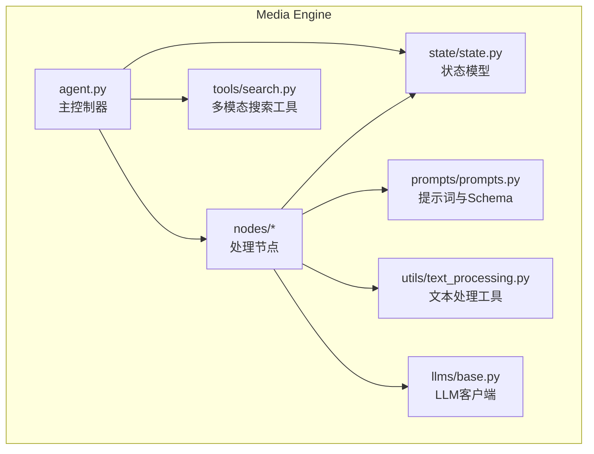
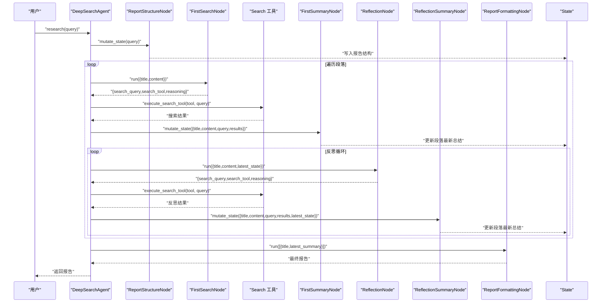
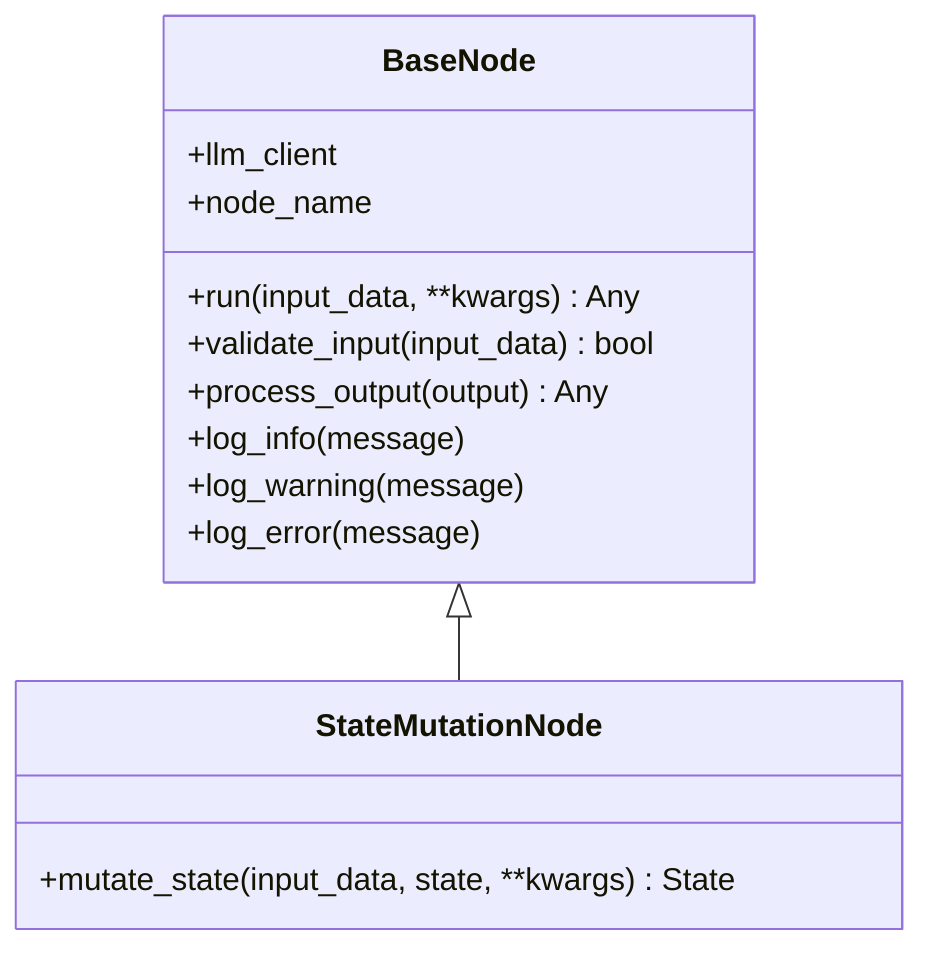
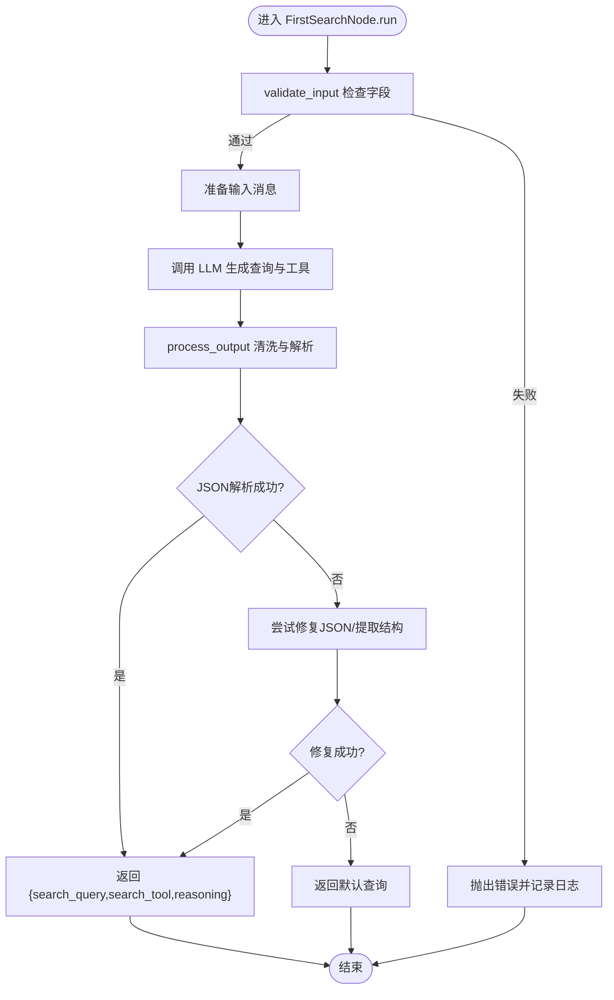
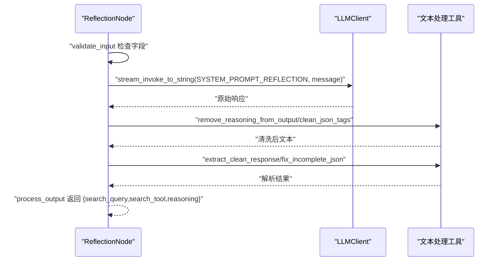
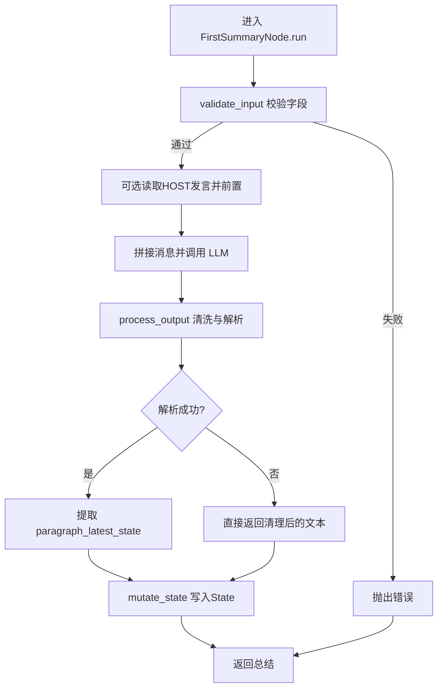
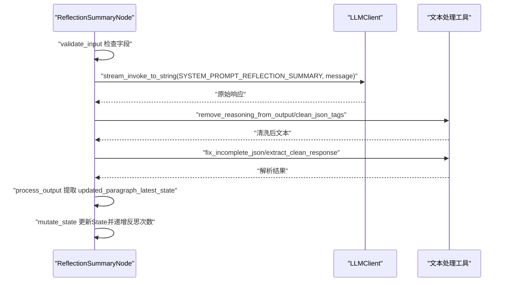
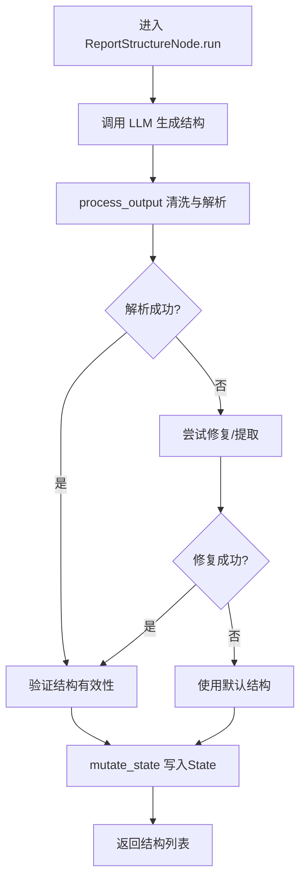
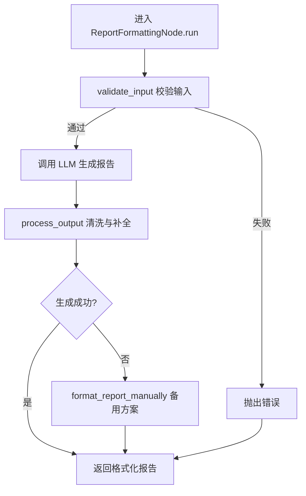
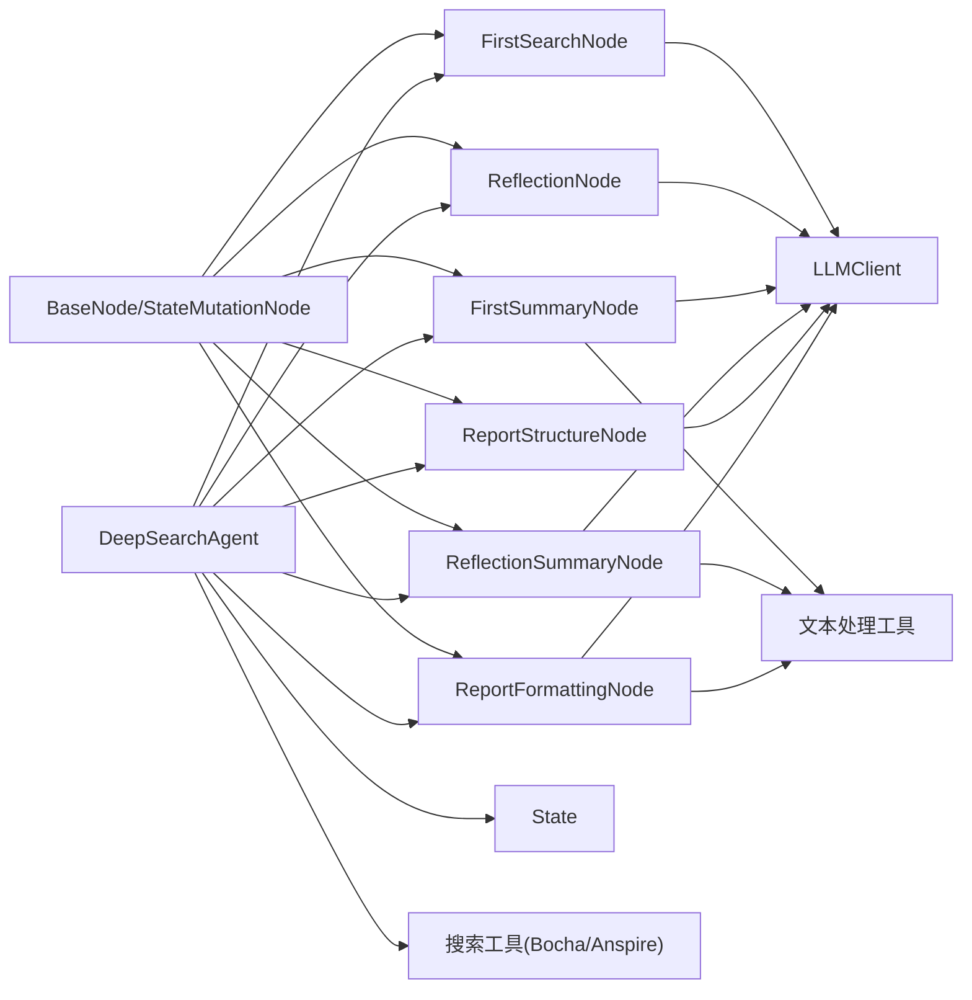

# 处理节点系统

<cite>
**本文档引用的文件**
- [MediaEngine/nodes/base_node.py](file://MediaEngine/nodes/base_node.py)
- [MediaEngine/nodes/search_node.py](file://MediaEngine/nodes/search_node.py)
- [MediaEngine/nodes/summary_node.py](file://MediaEngine/nodes/summary_node.py)
- [MediaEngine/nodes/formatting_node.py](file://MediaEngine/nodes/formatting_node.py)
- [MediaEngine/nodes/report_structure_node.py](file://MediaEngine/nodes/report_structure_node.py)
- [MediaEngine/state/state.py](file://MediaEngine/state/state.py)
- [MediaEngine/prompts/prompts.py](file://MediaEngine/prompts/prompts.py)
- [MediaEngine/utils/text_processing.py](file://MediaEngine/utils/text_processing.py)
- [MediaEngine/agent.py](file://MediaEngine/agent.py)
- [MediaEngine/tools/search.py](file://MediaEngine/tools/search.py)
- [MediaEngine/llms/base.py](file://MediaEngine/llms/base.py)
</cite>

## 目录
1. [简介](#简介)
2. [项目结构](#项目结构)
3. [核心组件](#核心组件)
4. [架构总览](#架构总览)
5. [详细组件分析](#详细组件分析)
6. [依赖关系分析](#依赖关系分析)
7. [性能考量](#性能考量)
8. [故障排查指南](#故障排查指南)
9. [结论](#结论)
10. [附录](#附录)

## 简介
本文件面向Media Engine的处理节点系统，系统化阐述节点化处理架构的设计原理与实现机制。重点覆盖：
- BaseNode基类的抽象设计与扩展点
- FirstSearchNode的多平台内容检索与工具选择
- FirstSummaryNode的语义理解与多模态信息整合算法
- ReflectionNode的反思机制与二次检索策略
- ReportFormattingNode的报告生成与格式化逻辑
- 节点间的数据流转、状态传递与错误处理
- 节点扩展开发与自定义处理逻辑的实现指导

## 项目结构
Media Engine采用“节点化流水线”的架构，将研究流程拆分为若干职责单一的处理节点，每个节点负责特定阶段的任务，并通过统一的基类接口进行编排。核心模块如下：
- nodes：处理节点集合（搜索、总结、格式化、结构生成）
- state：状态模型，承载报告结构、段落研究进度与最终报告
- prompts：系统提示词与JSON Schema定义
- utils：文本处理工具（JSON清洗、结构修复、内容截断等）
- tools：多模态搜索工具集（Bocha/Anspire）
- llms：LLM客户端（OpenAI兼容，支持流式）
- agent：主控制器，串联节点与工具，驱动完整研究流程

图表来源
- [MediaEngine/agent.py](file://MediaEngine/agent.py#L26-L508)
- [MediaEngine/nodes/base_node.py](file://MediaEngine/nodes/base_node.py#L13-L95)
- [MediaEngine/state/state.py](file://MediaEngine/state/state.py#L176-L293)
- [MediaEngine/prompts/prompts.py](file://MediaEngine/prompts/prompts.py#L1-L451)
- [MediaEngine/utils/text_processing.py](file://MediaEngine/utils/text_processing.py#L1-L309)
- [MediaEngine/tools/search.py](file://MediaEngine/tools/search.py#L100-L369)
- [MediaEngine/llms/base.py](file://MediaEngine/llms/base.py#L31-L171)

章节来源
- [MediaEngine/agent.py](file://MediaEngine/agent.py#L26-L508)
- [MediaEngine/nodes/base_node.py](file://MediaEngine/nodes/base_node.py#L13-L95)
- [MediaEngine/state/state.py](file://MediaEngine/state/state.py#L176-L293)
- [MediaEngine/prompts/prompts.py](file://MediaEngine/prompts/prompts.py#L1-L451)
- [MediaEngine/utils/text_processing.py](file://MediaEngine/utils/text_processing.py#L1-L309)
- [MediaEngine/tools/search.py](file://MediaEngine/tools/search.py#L100-L369)
- [MediaEngine/llms/base.py](file://MediaEngine/llms/base.py#L31-L171)

## 核心组件
- BaseNode与StateMutationNode：定义节点的统一接口、输入校验、输出处理与日志记录；StateMutationNode扩展了“状态变更”能力，用于在处理过程中更新全局状态。
- 节点族：
  - FirstSearchNode：为段落生成首次搜索查询与工具选择
  - ReflectionNode：基于段落最新状态生成反思查询
  - FirstSummaryNode：根据搜索结果生成段落首次总结
  - ReflectionSummaryNode：基于反思搜索结果更新段落总结
  - ReportStructureNode：根据用户查询生成报告结构
  - ReportFormattingNode：将最终段落总结格式化为Markdown报告
- LLMClient：OpenAI兼容的LLM客户端，支持流式调用与安全拼接
- 多模态搜索工具：BochaMultimodalSearch与AnspireAISearch，提供综合搜索、结构化数据查询、时效性搜索等工具集
- 文本处理工具：JSON清洗、结构修复、内容截断、提示词格式化等

章节来源
- [MediaEngine/nodes/base_node.py](file://MediaEngine/nodes/base_node.py#L13-L95)
- [MediaEngine/nodes/search_node.py](file://MediaEngine/nodes/search_node.py#L21-L287)
- [MediaEngine/nodes/summary_node.py](file://MediaEngine/nodes/summary_node.py#L34-L369)
- [MediaEngine/nodes/formatting_node.py](file://MediaEngine/nodes/formatting_node.py#L18-L169)
- [MediaEngine/nodes/report_structure_node.py](file://MediaEngine/nodes/report_structure_node.py#L22-L205)
- [MediaEngine/llms/base.py](file://MediaEngine/llms/base.py#L31-L171)
- [MediaEngine/tools/search.py](file://MediaEngine/tools/search.py#L100-L369)
- [MediaEngine/utils/text_processing.py](file://MediaEngine/utils/text_processing.py#L1-L309)

## 架构总览
节点化流水线由主控制器（DeepSearchAgent）编排，按阶段依次执行：生成报告结构、逐段初始搜索与总结、反思循环、最终报告格式化。节点之间通过输入/输出数据与状态对象传递信息，LLM与搜索工具贯穿各阶段。

图表来源
- [MediaEngine/agent.py](file://MediaEngine/agent.py#L133-L400)
- [MediaEngine/nodes/report_structure_node.py](file://MediaEngine/nodes/report_structure_node.py#L168-L205)
- [MediaEngine/nodes/search_node.py](file://MediaEngine/nodes/search_node.py#L45-L80)
- [MediaEngine/nodes/summary_node.py](file://MediaEngine/nodes/summary_node.py#L170-L200)
- [MediaEngine/nodes/formatting_node.py](file://MediaEngine/nodes/formatting_node.py#L48-L86)

章节来源
- [MediaEngine/agent.py](file://MediaEngine/agent.py#L133-L400)

## 详细组件分析

### BaseNode与StateMutationNode抽象设计
- BaseNode提供统一的run接口、输入校验validate_input、输出处理process_output与日志记录方法，保证节点行为的一致性与可观测性。
- StateMutationNode扩展了mutate_state接口，用于在节点处理过程中直接修改State对象，实现状态驱动的节点协作。
- 两个类均通过LLMClient与外部服务交互，通过日志记录关键事件，便于调试与审计。

图表来源
- [MediaEngine/nodes/base_node.py](file://MediaEngine/nodes/base_node.py#L13-L95)

章节来源
- [MediaEngine/nodes/base_node.py](file://MediaEngine/nodes/base_node.py#L13-L95)

### FirstSearchNode：多平台内容检索与工具选择
- 输入：段落标题与预期内容（title、content）
- 输出：搜索查询（search_query）、工具选择（search_tool）、推理（reasoning）
- 核心流程：
  - 输入校验：确保包含title与content字段
  - LLM生成：使用系统提示词生成查询与工具选择
  - 输出处理：清理JSON标签、移除推理文本、解析或修复JSON
  - 容错：解析失败时回退到默认查询
- 工具选择：支持综合搜索、网页搜索、结构化数据查询、最近24小时、最近一周等工具，Agent根据提示词选择最优工具。

图表来源
- [MediaEngine/nodes/search_node.py](file://MediaEngine/nodes/search_node.py#L33-L151)
- [MediaEngine/prompts/prompts.py](file://MediaEngine/prompts/prompts.py#L138-L182)
- [MediaEngine/utils/text_processing.py](file://MediaEngine/utils/text_processing.py#L48-L134)

章节来源
- [MediaEngine/nodes/search_node.py](file://MediaEngine/nodes/search_node.py#L21-L151)
- [MediaEngine/prompts/prompts.py](file://MediaEngine/prompts/prompts.py#L138-L182)
- [MediaEngine/utils/text_processing.py](file://MediaEngine/utils/text_processing.py#L48-L134)

### ReflectionNode：反思机制与二次检索策略
- 输入：段落标题、预期内容、段落最新状态（title、content、paragraph_latest_state）
- 输出：反思后的搜索查询与工具选择
- 核心流程：
  - 输入校验：确保包含title、content与paragraph_latest_state
  - LLM生成：基于最新状态反思缺失信息，生成精确查询与工具选择
  - 输出处理：与首次搜索一致的清洗与解析逻辑
- 作用：在初始总结后，通过反思驱动二次检索，提升内容完整性与深度。

图表来源
- [MediaEngine/nodes/search_node.py](file://MediaEngine/nodes/search_node.py#L166-L275)
- [MediaEngine/prompts/prompts.py](file://MediaEngine/prompts/prompts.py#L264-L295)
- [MediaEngine/utils/text_processing.py](file://MediaEngine/utils/text_processing.py#L85-L134)

章节来源
- [MediaEngine/nodes/search_node.py](file://MediaEngine/nodes/search_node.py#L154-L275)
- [MediaEngine/prompts/prompts.py](file://MediaEngine/prompts/prompts.py#L264-L295)
- [MediaEngine/utils/text_processing.py](file://MediaEngine/utils/text_processing.py#L85-L134)

### FirstSummaryNode：语义理解与多模态信息整合
- 输入：段落标题、预期内容、搜索查询、搜索结果（title、content、search_query、search_results）
- 输出：段落首次总结（paragraph_latest_state）
- 核心流程：
  - 可选读取论坛HOST发言并前置到提示词，增强上下文
  - LLM生成：使用系统提示词进行多模态信息整合（文字、图片、结构化数据、AI总结）
  - 输出处理：清理JSON标签与推理文本，解析或修复JSON，提取paragraph_latest_state
  - 状态更新：通过mutate_state将最新总结写入State，更新时间戳
- 设计要点：强调多源信息的结构化组织与深度分析，避免信息冗余，确保信息密度与多维度洞察。

图表来源
- [MediaEngine/nodes/summary_node.py](file://MediaEngine/nodes/summary_node.py#L46-L169)
- [MediaEngine/prompts/prompts.py](file://MediaEngine/prompts/prompts.py#L184-L262)
- [MediaEngine/utils/text_processing.py](file://MediaEngine/utils/text_processing.py#L11-L83)

章节来源
- [MediaEngine/nodes/summary_node.py](file://MediaEngine/nodes/summary_node.py#L34-L200)
- [MediaEngine/prompts/prompts.py](file://MediaEngine/prompts/prompts.py#L184-L262)
- [MediaEngine/utils/text_processing.py](file://MediaEngine/utils/text_processing.py#L11-L83)

### ReflectionSummaryNode：反思总结与迭代优化
- 输入：段落标题、预期内容、搜索查询、反思搜索结果、段落最新状态（title、content、search_query、search_results、paragraph_latest_state）
- 输出：更新后的段落最新状态（updated_paragraph_latest_state）
- 核心流程：
  - 与首次总结类似，但输入包含“最新状态”，用于迭代优化
  - LLM根据反思结果丰富现有状态，保持关键信息并补充缺失内容
  - 通过mutate_state更新State，递增反思迭代次数
- 设计要点：在反思循环中多次迭代，逐步完善段落内容，确保分析深度与覆盖面。

图表来源
- [MediaEngine/nodes/summary_node.py](file://MediaEngine/nodes/summary_node.py#L214-L337)
- [MediaEngine/prompts/prompts.py](file://MediaEngine/prompts/prompts.py#L297-L319)
- [MediaEngine/utils/text_processing.py](file://MediaEngine/utils/text_processing.py#L136-L196)

章节来源
- [MediaEngine/nodes/summary_node.py](file://MediaEngine/nodes/summary_node.py#L202-L369)
- [MediaEngine/prompts/prompts.py](file://MediaEngine/prompts/prompts.py#L297-L319)
- [MediaEngine/utils/text_processing.py](file://MediaEngine/utils/text_processing.py#L136-L196)

### ReportStructureNode：报告结构生成
- 输入：用户查询（query）
- 输出：报告段落结构列表（title、content）
- 核心流程：
  - LLM生成：根据查询规划报告结构，最多5个段落
  - 输出处理：清洗JSON标签与推理文本，解析或修复JSON，验证结构有效性
  - 状态更新：将结构写入State，设置报告标题与段落列表
- 容错：解析失败或结构无效时，回退到默认结构（研究概述、深度分析）

图表来源
- [MediaEngine/nodes/report_structure_node.py](file://MediaEngine/nodes/report_structure_node.py#L40-L147)
- [MediaEngine/prompts/prompts.py](file://MediaEngine/prompts/prompts.py#L122-L136)
- [MediaEngine/utils/text_processing.py](file://MediaEngine/utils/text_processing.py#L85-L196)

章节来源
- [MediaEngine/nodes/report_structure_node.py](file://MediaEngine/nodes/report_structure_node.py#L22-L205)
- [MediaEngine/prompts/prompts.py](file://MediaEngine/prompts/prompts.py#L122-L136)
- [MediaEngine/utils/text_processing.py](file://MediaEngine/utils/text_processing.py#L85-L196)

### ReportFormattingNode：报告生成与格式化
- 输入：段落列表（title、paragraph_latest_state）
- 输出：格式化后的Markdown报告
- 核心流程：
  - 输入校验：确保列表中每个元素包含title与paragraph_latest_state
  - LLM生成：使用系统提示词生成多维多媒体分析报告
  - 输出处理：清理Markdown标签与推理文本，确保报告有基本结构与标题
  - 备用方案：LLM失败时使用手动格式化方法，保证输出可用性

图表来源
- [MediaEngine/nodes/formatting_node.py](file://MediaEngine/nodes/formatting_node.py#L48-L115)
- [MediaEngine/prompts/prompts.py](file://MediaEngine/prompts/prompts.py#L321-L450)
- [MediaEngine/utils/text_processing.py](file://MediaEngine/utils/text_processing.py#L30-L46)

章节来源
- [MediaEngine/nodes/formatting_node.py](file://MediaEngine/nodes/formatting_node.py#L18-L169)
- [MediaEngine/prompts/prompts.py](file://MediaEngine/prompts/prompts.py#L321-L450)
- [MediaEngine/utils/text_processing.py](file://MediaEngine/utils/text_processing.py#L30-L46)

## 依赖关系分析
- 节点依赖关系：各节点均依赖BaseNode/StateMutationNode抽象，通过LLMClient与提示词交互；FirstSummaryNode与ReflectionSummaryNode还依赖文本处理工具与论坛读取模块。
- 状态依赖：ReportStructureNode与各总结节点通过mutate_state写入State；Agent在流程中维护State并驱动节点。
- 工具依赖：Agent根据配置选择Bocha或Anspire搜索工具，节点通过Agent间接调用工具执行搜索。
- LLM依赖：所有节点通过LLMClient进行对话式调用，支持流式与非流式两种模式。

图表来源
- [MediaEngine/nodes/base_node.py](file://MediaEngine/nodes/base_node.py#L13-L95)
- [MediaEngine/nodes/search_node.py](file://MediaEngine/nodes/search_node.py#L21-L287)
- [MediaEngine/nodes/summary_node.py](file://MediaEngine/nodes/summary_node.py#L34-L369)
- [MediaEngine/nodes/formatting_node.py](file://MediaEngine/nodes/formatting_node.py#L18-L169)
- [MediaEngine/nodes/report_structure_node.py](file://MediaEngine/nodes/report_structure_node.py#L22-L205)
- [MediaEngine/agent.py](file://MediaEngine/agent.py#L26-L508)
- [MediaEngine/state/state.py](file://MediaEngine/state/state.py#L176-L293)
- [MediaEngine/tools/search.py](file://MediaEngine/tools/search.py#L100-L369)
- [MediaEngine/llms/base.py](file://MediaEngine/llms/base.py#L31-L171)
- [MediaEngine/utils/text_processing.py](file://MediaEngine/utils/text_processing.py#L1-L309)

章节来源
- [MediaEngine/agent.py](file://MediaEngine/agent.py#L26-L508)
- [MediaEngine/state/state.py](file://MediaEngine/state/state.py#L176-L293)
- [MediaEngine/tools/search.py](file://MediaEngine/tools/search.py#L100-L369)
- [MediaEngine/llms/base.py](file://MediaEngine/llms/base.py#L31-L171)
- [MediaEngine/utils/text_processing.py](file://MediaEngine/utils/text_processing.py#L1-L309)

## 性能考量
- 流式调用：LLMClient支持流式调用，避免长文本阻塞；在节点中使用stream_invoke_to_string安全拼接UTF-8，防止多字节字符截断。
- 搜索工具选择：根据任务意图选择合适工具（综合/网页/结构化/时效性），平衡结果质量与延迟。
- 内容截断：文本处理工具提供内容截断与提示词格式化，控制输入长度，避免超出模型上下文限制。
- 重试与容错：LLM与搜索工具均具备重试机制，节点输出处理包含JSON修复与默认回退策略，提升鲁棒性。

[本节为通用性能建议，不直接分析具体文件]

## 故障排查指南
- LLM调用失败
  - 现象：节点抛出异常或返回空响应
  - 排查：检查API密钥、模型名称与基础URL配置；查看流式调用日志；确认提示词与Schema正确
  - 参考：LLMClient的invoke/stream_invoke/stream_invoke_to_string
- JSON解析失败
  - 现象：节点process_output抛出解析错误
  - 排查：使用文本处理工具的JSON清洗与修复函数；检查提示词输出是否包含推理文本；必要时启用默认回退
  - 参考：clean_json_tags/remove_reasoning_from_output/fix_incomplete_json
- 搜索工具异常
  - 现象：搜索无结果或返回格式不符
  - 排查：确认API Key与基础URL；检查工具参数（max_results等）；验证返回对象结构
  - 参考：BochaMultimodalSearch/AnspireAISearch
- 状态更新失败
  - 现象：mutate_state抛出索引越界或状态异常
  - 排查：确认段落索引与State结构；检查段落是否存在；查看日志定位具体节点
  - 参考：各SummaryNode的mutate_state实现

章节来源
- [MediaEngine/llms/base.py](file://MediaEngine/llms/base.py#L89-L157)
- [MediaEngine/utils/text_processing.py](file://MediaEngine/utils/text_processing.py#L136-L196)
- [MediaEngine/tools/search.py](file://MediaEngine/tools/search.py#L183-L332)
- [MediaEngine/nodes/summary_node.py](file://MediaEngine/nodes/summary_node.py#L170-L200)

## 结论
Media Engine的处理节点系统通过抽象的BaseNode与StateMutationNode，实现了高度模块化与可扩展的节点化流水线。各节点职责清晰、输入输出规范、状态驱动、容错完备，配合多模态搜索与LLM能力，能够高效完成从报告结构生成到最终报告格式化的全流程任务。通过合理的扩展点与工具链，开发者可轻松定制新节点与处理逻辑，满足复杂场景需求。

[本节为总结性内容，不直接分析具体文件]

## 附录

### 节点扩展开发与自定义处理逻辑实现指导
- 继承基类
  - 若仅需处理数据，继承BaseNode并实现run/validate_input/process_output
  - 若需修改状态，继承StateMutationNode并实现mutate_state
- 输入输出约定
  - 明确输入Schema与输出Schema，确保与其他节点的契约一致
  - 使用validate_input严格校验输入字段，避免运行期错误
- LLM与工具集成
  - 通过LLMClient进行对话式调用，必要时使用流式调用
  - 在节点中调用搜索工具时，遵循Agent的工具选择与参数约定
- 文本处理与容错
  - 使用文本处理工具进行JSON清洗、修复与内容截断
  - 在process_output中实现解析与回退策略，保证输出稳定性
- 状态管理
  - 通过mutate_state直接更新State，确保状态一致性
  - 更新状态后调用update_timestamp，便于进度跟踪
- 日志与监控
  - 在关键节点记录日志，便于问题定位与性能分析
  - 对异常进行捕获与重试，提升系统鲁棒性

章节来源
- [MediaEngine/nodes/base_node.py](file://MediaEngine/nodes/base_node.py#L13-L95)
- [MediaEngine/nodes/search_node.py](file://MediaEngine/nodes/search_node.py#L45-L80)
- [MediaEngine/nodes/summary_node.py](file://MediaEngine/nodes/summary_node.py#L118-L169)
- [MediaEngine/nodes/formatting_node.py](file://MediaEngine/nodes/formatting_node.py#L87-L115)
- [MediaEngine/nodes/report_structure_node.py](file://MediaEngine/nodes/report_structure_node.py#L67-L147)
- [MediaEngine/agent.py](file://MediaEngine/agent.py#L65-L72)
- [MediaEngine/utils/text_processing.py](file://MediaEngine/utils/text_processing.py#L1-L309)