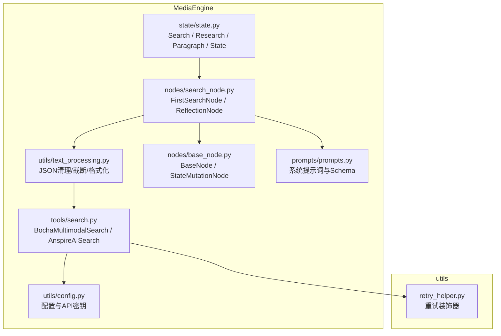
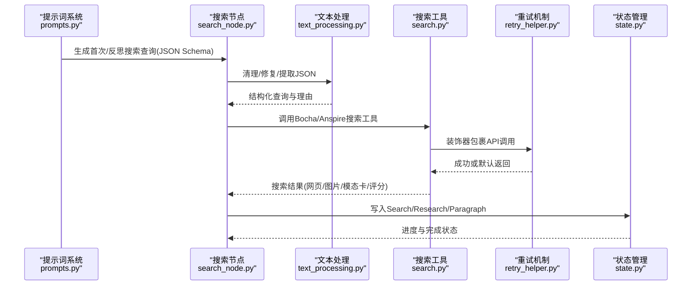
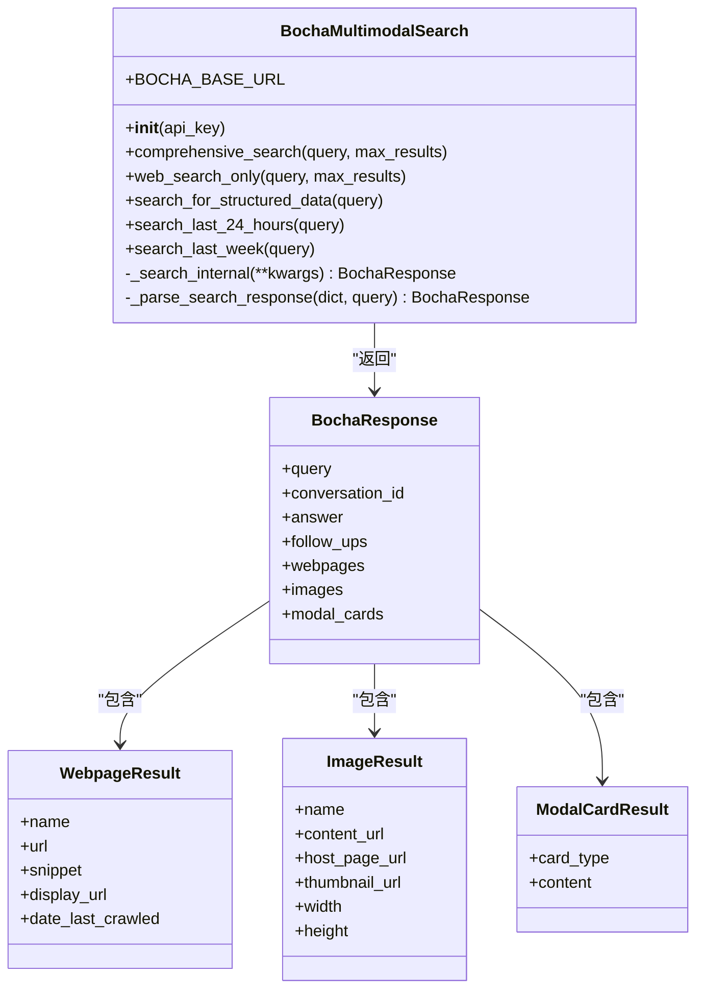
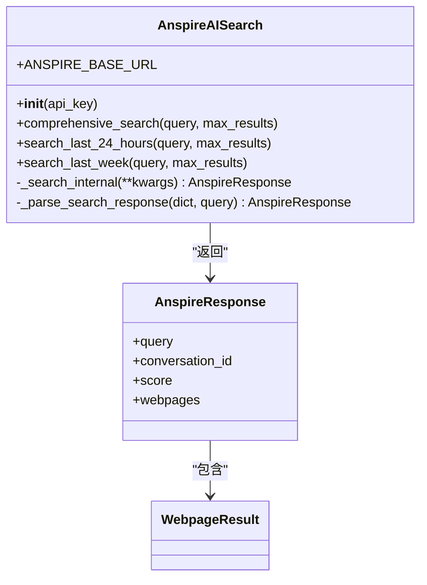
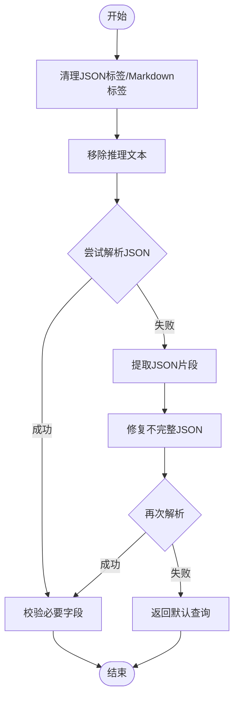
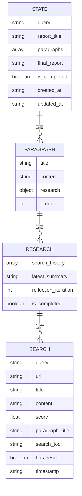
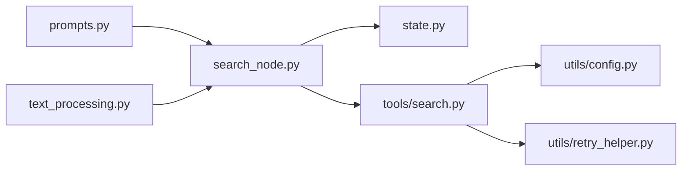

# 搜索工具集成

<cite>
**本文档引用的文件**
- [MediaEngine/tools/search.py](file://MediaEngine/tools/search.py)
- [MediaEngine/utils/config.py](file://MediaEngine/utils/config.py)
- [MediaEngine/utils/text_processing.py](file://MediaEngine/utils/text_processing.py)
- [MediaEngine/nodes/search_node.py](file://MediaEngine/nodes/search_node.py)
- [MediaEngine/nodes/base_node.py](file://MediaEngine/nodes/base_node.py)
- [MediaEngine/state/state.py](file://MediaEngine/state/state.py)
- [MediaEngine/prompts/prompts.py](file://MediaEngine/prompts/prompts.py)
- [utils/retry_helper.py](file://utils/retry_helper.py)
</cite>

## 目录
1. [简介](#简介)
2. [项目结构](#项目结构)
3. [核心组件](#核心组件)
4. [架构总览](#架构总览)
5. [组件详解](#组件详解)
6. [依赖关系分析](#依赖关系分析)
7. [性能考量](#性能考量)
8. [故障排除指南](#故障排除指南)
9. [结论](#结论)
10. [附录](#附录)

## 简介
本文件面向Media Engine的搜索工具集成，系统性阐述多平台搜索工具的架构与实现，重点覆盖BochaMultimodalSearch与AnspireAISearch两大API封装，以及配套的搜索节点、状态管理与文本处理工具。文档将详细说明：
- 多模态搜索工具的分类与适用场景（全面综合搜索、网页搜索、结构化数据查询、时间范围搜索）
- 搜索结果的数据结构、格式转换与内容过滤策略
- 配置管理、重试机制与性能优化
- 故障排除与最佳实践

## 项目结构
Media Engine的搜索工具位于MediaEngine/tools/search.py，配合配置、文本处理、节点与状态管理模块协同工作。整体结构如下：

图表来源
- [MediaEngine/tools/search.py](file://MediaEngine/tools/search.py#L1-L519)
- [MediaEngine/utils/config.py](file://MediaEngine/utils/config.py#L1-L89)
- [MediaEngine/utils/text_processing.py](file://MediaEngine/utils/text_processing.py#L1-L309)
- [MediaEngine/nodes/search_node.py](file://MediaEngine/nodes/search_node.py#L1-L287)
- [MediaEngine/nodes/base_node.py](file://MediaEngine/nodes/base_node.py#L1-L95)
- [MediaEngine/state/state.py](file://MediaEngine/state/state.py#L1-L293)
- [MediaEngine/prompts/prompts.py](file://MediaEngine/prompts/prompts.py#L1-L451)
- [utils/retry_helper.py](file://utils/retry_helper.py#L1-L248)

章节来源
- [MediaEngine/tools/search.py](file://MediaEngine/tools/search.py#L1-L519)
- [MediaEngine/utils/config.py](file://MediaEngine/utils/config.py#L1-L89)

## 核心组件
- 多模态搜索客户端
  - BochaMultimodalSearch：提供全面综合搜索、网页搜索、结构化数据查询、最近24小时/一周搜索等工具
  - AnspireAISearch：提供综合搜索、最近24小时/一周搜索等工具
- 搜索节点
  - FirstSearchNode：根据段落生成首次搜索查询
  - ReflectionNode：反思并生成新的搜索查询
- 状态管理
  - Search、Research、Paragraph、State：统一管理搜索历史、反思迭代、段落与报告状态
- 文本处理与格式化
  - JSON清理、Markdown标签移除、推理文本剥离、不完整JSON修复、内容截断与格式化
- 配置与重试
  - 配置加载与API密钥管理
  - 优雅重试装饰器，保障非关键API调用的稳定性

章节来源
- [MediaEngine/tools/search.py](file://MediaEngine/tools/search.py#L100-L382)
- [MediaEngine/nodes/search_node.py](file://MediaEngine/nodes/search_node.py#L21-L287)
- [MediaEngine/state/state.py](file://MediaEngine/state/state.py#L12-L293)
- [MediaEngine/utils/text_processing.py](file://MediaEngine/utils/text_processing.py#L12-L309)
- [MediaEngine/utils/config.py](file://MediaEngine/utils/config.py#L16-L89)
- [utils/retry_helper.py](file://utils/retry_helper.py#L141-L248)

## 架构总览
下图展示了从提示词到搜索工具再到状态管理的端到端流程：

图表来源
- [MediaEngine/prompts/prompts.py](file://MediaEngine/prompts/prompts.py#L139-L182)
- [MediaEngine/nodes/search_node.py](file://MediaEngine/nodes/search_node.py#L45-L151)
- [MediaEngine/utils/text_processing.py](file://MediaEngine/utils/text_processing.py#L85-L134)
- [MediaEngine/tools/search.py](file://MediaEngine/tools/search.py#L183-L210)
- [utils/retry_helper.py](file://utils/retry_helper.py#L141-L199)
- [MediaEngine/state/state.py](file://MediaEngine/state/state.py#L67-L102)

## 组件详解

### BochaMultimodalSearch：多模态搜索客户端
- 支持的工具
  - comprehensive_search：全面综合搜索，返回网页、图片、AI总结、追问建议与模态卡
  - web_search_only：纯网页搜索，关闭AI总结，适合快速获取原始网页
  - search_for_structured_data：结构化数据查询，聚焦天气、股票、百科等模态卡
  - search_last_24_hours：检索过去24小时内的最新信息
  - search_last_week：检索过去一周内的主要报道
- 数据结构
  - BochaResponse：封装查询、会话ID、AI总结、追问、网页、图片、模态卡
  - WebpageResult/ImageResult/ModalCardResult：标准化结果载体
- 配置与认证
  - 通过配置读取BOCHA_BASE_URL与BOCHA_WEB_SEARCH_API_KEY
  - 请求头包含Authorization与Content-Type
- 错误处理与重试
  - 使用with_graceful_retry装饰器，失败返回默认响应，避免中断流程
  - 内部统一解析API响应，兼容answer/follow_up/source等消息类型

图表来源
- [MediaEngine/tools/search.py](file://MediaEngine/tools/search.py#L100-L267)
- [MediaEngine/tools/search.py](file://MediaEngine/tools/search.py#L79-L96)

章节来源
- [MediaEngine/tools/search.py](file://MediaEngine/tools/search.py#L100-L267)
- [MediaEngine/tools/search.py](file://MediaEngine/tools/search.py#L125-L210)

### AnspireAISearch：结构化搜索客户端
- 支持的工具
  - comprehensive_search：综合搜索，返回网页与评分
  - search_last_24_hours：按时间范围检索最近24小时
  - search_last_week：按时间范围检索最近一周
- 数据结构
  - AnspireResponse：封装查询、会话ID、评分与网页结果
- 配置与认证
  - 通过配置读取ANSPIRE_BASE_URL与ANSPIRE_API_KEY
  - 请求头包含Authorization与Content-Type
- 时间范围搜索
  - 自动计算FromTime/ToTime并传参
- 错误处理与重试
  - 使用with_graceful_retry装饰器，失败返回默认响应

图表来源
- [MediaEngine/tools/search.py](file://MediaEngine/tools/search.py#L268-L369)
- [MediaEngine/tools/search.py](file://MediaEngine/tools/search.py#L90-L96)

章节来源
- [MediaEngine/tools/search.py](file://MediaEngine/tools/search.py#L268-L369)
- [MediaEngine/tools/search.py](file://MediaEngine/tools/search.py#L292-L332)

### 搜索节点：查询生成与反思
- FirstSearchNode
  - 输入：段落标题与内容
  - 输出：search_query与reasoning（JSON Schema）
  - 处理：清理JSON标签、移除推理文本、提取/修复JSON、默认回退
- ReflectionNode
  - 输入：段落标题、内容、最新状态
  - 输出：新的search_query与reasoning
  - 处理：与FirstSearchNode一致的文本清理与修复流程

图表来源
- [MediaEngine/nodes/search_node.py](file://MediaEngine/nodes/search_node.py#L81-L140)
- [MediaEngine/utils/text_processing.py](file://MediaEngine/utils/text_processing.py#L85-L134)

章节来源
- [MediaEngine/nodes/search_node.py](file://MediaEngine/nodes/search_node.py#L21-L287)
- [MediaEngine/utils/text_processing.py](file://MediaEngine/utils/text_processing.py#L12-L309)

### 状态管理：搜索历史与段落进度
- Search：单条搜索结果，包含URL、标题、内容、评分、所属段落、工具与时间戳
- Research：段落研究历史，支持批量添加搜索结果、反思计数与完成标记
- Paragraph：段落标题、预期内容、研究进度与序号
- State：报告级状态，包含段落数、完成度、创建/更新时间戳

图表来源
- [MediaEngine/state/state.py](file://MediaEngine/state/state.py#L12-L293)

章节来源
- [MediaEngine/state/state.py](file://MediaEngine/state/state.py#L12-L293)

### 配置与重试机制
- 配置
  - 支持从.env或环境变量加载API密钥与Base URL
  - 搜索工具类型可选BochaAPI或AnspireAPI
  - 超时与内容长度限制等全局参数
- 重试
  - with_graceful_retry：非关键API失败返回默认值，保证系统继续运行
  - SEARCH_API_RETRY_CONFIG：预设搜索API重试策略（最大重试、初始延迟、退避因子、最大延迟）

章节来源
- [MediaEngine/utils/config.py](file://MediaEngine/utils/config.py#L16-L89)
- [utils/retry_helper.py](file://utils/retry_helper.py#L141-L248)

## 依赖关系分析
- 工具层
  - search.py依赖配置与重试模块，封装Bocha与Anspire两类搜索客户端
- 节点层
  - search_node.py依赖prompts与text_processing，负责查询生成与JSON处理
- 状态层
  - state.py被节点层写入，形成闭环
- 文本处理
  - text_processing.py被节点与工具共同使用，提供统一的清理与格式化能力

图表来源
- [MediaEngine/prompts/prompts.py](file://MediaEngine/prompts/prompts.py#L1-L451)
- [MediaEngine/nodes/search_node.py](file://MediaEngine/nodes/search_node.py#L1-L287)
- [MediaEngine/utils/text_processing.py](file://MediaEngine/utils/text_processing.py#L1-L309)
- [MediaEngine/state/state.py](file://MediaEngine/state/state.py#L1-L293)
- [MediaEngine/tools/search.py](file://MediaEngine/tools/search.py#L1-L519)
- [MediaEngine/utils/config.py](file://MediaEngine/utils/config.py#L1-L89)
- [utils/retry_helper.py](file://utils/retry_helper.py#L1-L248)

## 性能考量
- API调用
  - 使用with_graceful_retry减少因网络抖动导致的中断
  - 通过SEARCH_API_RETRY_CONFIG平衡重试次数与延迟
- 结果处理
  - 使用format_search_results_for_prompt与truncate_content控制提示词长度，避免LLM输入过长
  - 优先使用web_search_only在不需要AI总结时降低延迟与成本
- 并发与批处理
  - 建议在上层调用层进行并发控制，避免过多API并发导致限流
- 缓存与去重
  - 可在应用层引入缓存策略，对相同查询进行去重与复用

[本节为通用性能建议，不直接分析具体文件]

## 故障排除指南
- API密钥与Base URL
  - 确认环境变量或.env中已设置正确的BOCHA_WEB_SEARCH_API_KEY/BOCHA_BASE_URL或ANSPIRE_API_KEY/ANSPIRE_BASE_URL
  - 若未配置任何搜索工具，load_agent_from_config会抛出错误
- 网络与超时
  - 检查网络连通性与代理设置
  - 调整SEARCH_TIMEOUT与SEARCH_API_RETRY_CONFIG以适应网络环境
- JSON解析失败
  - FirstSearchNode/ReflectionNode会尝试清理标签、移除推理文本、修复不完整JSON
  - 若仍失败，将返回默认查询，可在日志中查看具体错误
- 搜索结果为空
  - Research.add_search_results会记录“无结果”搜索，便于前端展示与追踪
- 模态卡解析
  - BochaResponse.modal_cards包含card_type与content，可根据类型进行差异化处理

章节来源
- [MediaEngine/utils/config.py](file://MediaEngine/utils/config.py#L39-L80)
- [MediaEngine/tools/search.py](file://MediaEngine/tools/search.py#L372-L382)
- [MediaEngine/nodes/search_node.py](file://MediaEngine/nodes/search_node.py#L81-L140)
- [MediaEngine/state/state.py](file://MediaEngine/state/state.py#L67-L102)

## 结论
Media Engine的搜索工具集成以“工具+节点+状态+文本处理+配置+重试”为核心，实现了多模态搜索的统一抽象与稳健执行。BochaMultimodalSearch与AnspireAISearch分别覆盖全面搜索与结构化搜索场景，配合FirstSearchNode/ReflectionNode与状态管理，形成从查询生成到结果沉淀的完整闭环。通过合理的配置、重试与内容处理策略，系统在复杂网络环境下仍能保持稳定与高效。

[本节为总结性内容，不直接分析具体文件]

## 附录

### 搜索工具适用场景速览
- 全面综合搜索：需要多模态信息（网页、图片、AI总结、追问、模态卡）
- 纯网页搜索：仅需原始网页链接与摘要，速度快、成本低
- 结构化数据查询：天气、股票、百科等触发模态卡的场景
- 最近24小时/一周搜索：追踪最新进展或回顾近期趋势

章节来源
- [MediaEngine/prompts/prompts.py](file://MediaEngine/prompts/prompts.py#L146-L167)
- [MediaEngine/tools/search.py](file://MediaEngine/tools/search.py#L213-L266)

### 搜索结果格式转换与内容过滤
- 格式转换
  - WebpageResult/ImageResult/ModalCardResult标准化结果字段
  - AnspireResponse.score用于相关度评估
- 内容过滤
  - truncate_content按单词边界截断，避免破坏语义
  - format_search_results_for_prompt将内容切分为提示词可用的片段
- 质量评估
  - 通过模态卡类型与评分辅助判断信息质量
  - FirstSearchNode/ReflectionNode的JSON清理与修复提升后续处理稳定性

章节来源
- [MediaEngine/utils/text_processing.py](file://MediaEngine/utils/text_processing.py#L264-L309)
- [MediaEngine/tools/search.py](file://MediaEngine/tools/search.py#L79-L96)