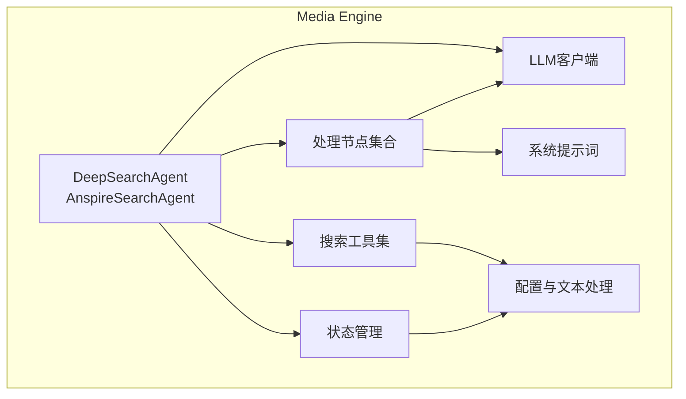
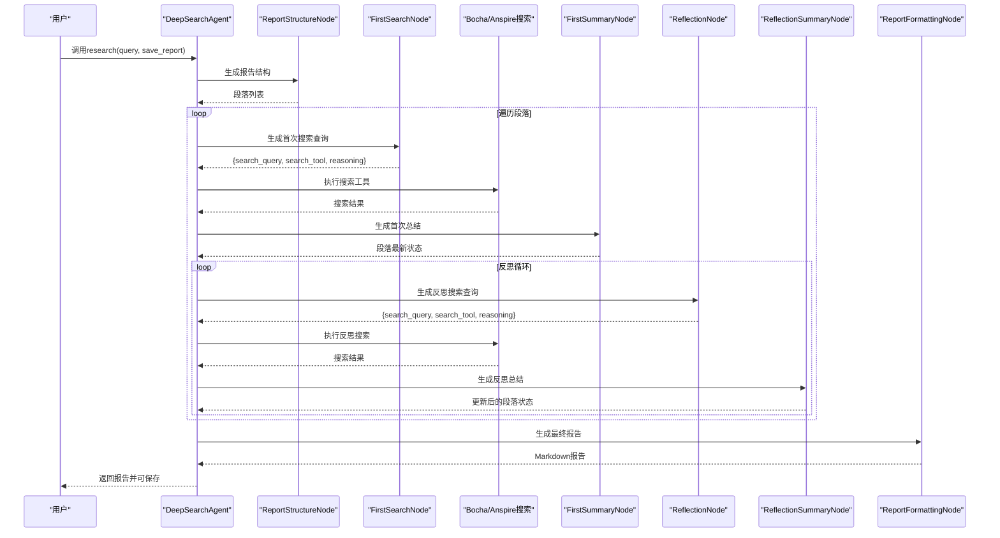
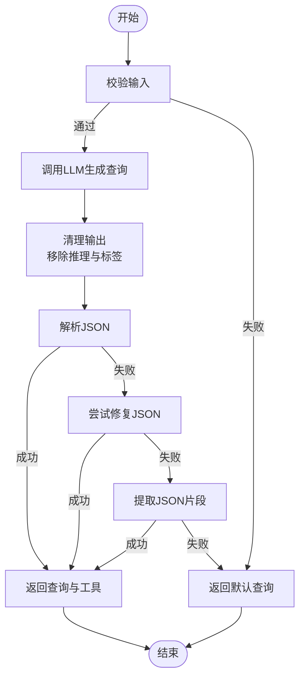
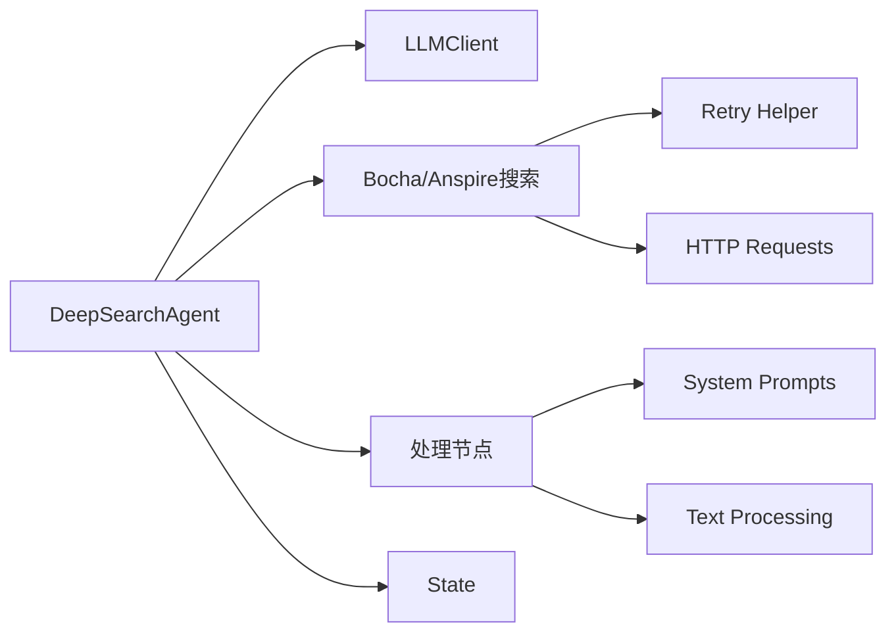

# 核心代理类设计

<cite>
**本文档引用的文件**
- [MediaEngine/agent.py](file://MediaEngine/agent.py)
- [MediaEngine/nodes/search_node.py](file://MediaEngine/nodes/search_node.py)
- [MediaEngine/nodes/report_structure_node.py](file://MediaEngine/nodes/report_structure_node.py)
- [MediaEngine/nodes/summary_node.py](file://MediaEngine/nodes/summary_node.py)
- [MediaEngine/nodes/formatting_node.py](file://MediaEngine/nodes/formatting_node.py)
- [MediaEngine/tools/search.py](file://MediaEngine/tools/search.py)
- [MediaEngine/state/state.py](file://MediaEngine/state/state.py)
- [MediaEngine/utils/config.py](file://MediaEngine/utils/config.py)
- [MediaEngine/utils/text_processing.py](file://MediaEngine/utils/text_processing.py)
- [MediaEngine/llms/base.py](file://MediaEngine/llms/base.py)
- [MediaEngine/prompts/prompts.py](file://MediaEngine/prompts/prompts.py)
</cite>

## 目录
1. [简介](#简介)
2. [项目结构](#项目结构)
3. [核心组件](#核心组件)
4. [架构总览](#架构总览)
5. [详细组件分析](#详细组件分析)
6. [依赖关系分析](#依赖关系分析)
7. [性能考虑](#性能考虑)
8. [故障排除指南](#故障排除指南)
9. [结论](#结论)
10. [附录](#附录)

## 简介
本文档面向Media Engine的核心代理类，重点阐述DeepSearchAgent与AnspireSearchAgent的设计架构与实现细节。内容涵盖：
- 多模态内容处理流程：从报告结构生成、段落搜索与总结，到反思循环与最终报告格式化
- 节点初始化与状态管理机制：各处理节点职责、状态数据结构与生命周期
- LLM客户端集成：统一的OpenAI兼容客户端、提示词系统与文本处理工具
- 搜索工具集配置：BochaMultimodalSearch与AnspireAISearch的多平台内容获取
- 代理类生命周期管理、错误处理机制与性能优化策略
- 使用示例、配置参数说明与最佳实践指导

## 项目结构
Media Engine采用模块化设计，按功能域划分：
- agent.py：核心代理类（DeepSearchAgent、AnspireSearchAgent）
- nodes/：处理节点（报告结构、首次搜索、反思、首次总结、反思总结、报告格式化）
- tools/search.py：多模态搜索工具集（BochaMultimodalSearch、AnspireAISearch）
- state/state.py：状态管理（Search、Research、Paragraph、State）
- utils/config.py：配置管理（Settings）
- utils/text_processing.py：文本处理工具（JSON清理、修复、截断）
- llms/base.py：LLM客户端（OpenAI兼容）
- prompts/prompts.py：系统提示词定义

图表来源
- [MediaEngine/agent.py](file://MediaEngine/agent.py#L26-L508)
- [MediaEngine/nodes/search_node.py](file://MediaEngine/nodes/search_node.py#L21-L287)
- [MediaEngine/tools/search.py](file://MediaEngine/tools/search.py#L100-L519)
- [MediaEngine/state/state.py](file://MediaEngine/state/state.py#L176-L293)
- [MediaEngine/utils/config.py](file://MediaEngine/utils/config.py#L16-L89)
- [MediaEngine/utils/text_processing.py](file://MediaEngine/utils/text_processing.py#L1-L309)
- [MediaEngine/llms/base.py](file://MediaEngine/llms/base.py#L31-L171)
- [MediaEngine/prompts/prompts.py](file://MediaEngine/prompts/prompts.py#L1-L451)

章节来源
- [MediaEngine/agent.py](file://MediaEngine/agent.py#L1-L508)
- [MediaEngine/utils/config.py](file://MediaEngine/utils/config.py#L1-L89)

## 核心组件
- DeepSearchAgent：主代理类，负责协调LLM、搜索工具与节点，执行深度研究流程
- AnspireSearchAgent：继承DeepSearchAgent，切换为Anspire搜索引擎
- 处理节点：ReportStructureNode、FirstSearchNode、ReflectionNode、FirstSummaryNode、ReflectionSummaryNode、ReportFormattingNode
- 搜索工具集：BochaMultimodalSearch（支持网页、图片、模态卡、结构化数据）、AnspireAISearch
- 状态管理：Search、Research、Paragraph、State四层数据结构
- LLM客户端：统一OpenAI兼容接口，支持流式与非流式调用
- 配置与工具：Settings、文本处理工具（JSON清理、修复、截断）

章节来源
- [MediaEngine/agent.py](file://MediaEngine/agent.py#L26-L508)
- [MediaEngine/nodes/search_node.py](file://MediaEngine/nodes/search_node.py#L21-L287)
- [MediaEngine/nodes/report_structure_node.py](file://MediaEngine/nodes/report_structure_node.py#L22-L205)
- [MediaEngine/nodes/summary_node.py](file://MediaEngine/nodes/summary_node.py#L34-L369)
- [MediaEngine/nodes/formatting_node.py](file://MediaEngine/nodes/formatting_node.py#L18-L169)
- [MediaEngine/tools/search.py](file://MediaEngine/tools/search.py#L100-L519)
- [MediaEngine/state/state.py](file://MediaEngine/state/state.py#L12-L293)
- [MediaEngine/llms/base.py](file://MediaEngine/llms/base.py#L31-L171)
- [MediaEngine/utils/config.py](file://MediaEngine/utils/config.py#L16-L89)
- [MediaEngine/utils/text_processing.py](file://MediaEngine/utils/text_processing.py#L1-L309)

## 架构总览
代理类采用“节点驱动 + 状态机”的架构模式：
- 代理类负责编排：初始化LLM、搜索工具、节点与状态，执行研究流程
- 节点负责专业化：每个节点专注特定任务（生成结构、搜索查询、总结、格式化）
- 状态负责持久化：贯穿整个流程，记录搜索历史、最新总结、反思次数与完成状态
- 搜索工具负责多平台内容获取：Bocha提供多模态能力，Anspire提供简洁API

```mermaid
classDiagram
class DeepSearchAgent {
+config
+llm_client
+search_agency
+state
+research(query, save_report) str
+execute_search_tool(tool_name, query, **kwargs) BochaResponse|AnspireResponse
}
class AnspireSearchAgent {
+config
+llm_client
+search_agency
+state
+execute_search_tool(tool_name, query, **kwargs) AnspireResponse
}
class LLMClient {
+invoke(system_prompt, user_prompt, **kwargs) str
+stream_invoke(system_prompt, user_prompt, **kwargs) Generator
+stream_invoke_to_string(system_prompt, user_prompt, **kwargs) str
+get_model_info() Dict
}
class BochaMultimodalSearch {
+comprehensive_search(query, max_results) BochaResponse
+web_search_only(query, max_results) BochaResponse
+search_for_structured_data(query) BochaResponse
+search_last_24_hours(query) BochaResponse
+search_last_week(query) BochaResponse
}
class AnspireAISearch {
+comprehensive_search(query, max_results) AnspireResponse
+search_last_24_hours(query, max_results) AnspireResponse
+search_last_week(query, max_results) AnspireResponse
}
class ReportStructureNode {
+run(input_data) List[Dict]
+mutate_state(input_data, state) State
}
class FirstSearchNode {
+run(input_data) Dict[str,str]
+process_output(output) Dict[str,str]
}
class ReflectionNode {
+run(input_data) Dict[str,str]
+process_output(output) Dict[str,str]
}
class FirstSummaryNode {
+run(input_data) str
+mutate_state(input_data, state, paragraph_index) State
}
class ReflectionSummaryNode {
+run(input_data) str
+mutate_state(input_data, state, paragraph_index) State
}
class ReportFormattingNode {
+run(input_data) str
+process_output(output) str
+format_report_manually(paragraphs_data, report_title) str
}
class State {
+query
+report_title
+paragraphs
+final_report
+is_completed
+mark_completed()
+get_progress_summary() Dict
+save_to_file(filepath)
+load_from_file(filepath)
}
DeepSearchAgent --> LLMClient : "使用"
DeepSearchAgent --> BochaMultimodalSearch : "使用"
AnspireSearchAgent --> LLMClient : "使用"
AnspireSearchAgent --> AnspireAISearch : "使用"
DeepSearchAgent --> ReportStructureNode : "调用"
DeepSearchAgent --> FirstSearchNode : "调用"
DeepSearchAgent --> ReflectionNode : "调用"
DeepSearchAgent --> FirstSummaryNode : "调用"
DeepSearchAgent --> ReflectionSummaryNode : "调用"
DeepSearchAgent --> ReportFormattingNode : "调用"
ReportStructureNode --> State : "修改"
FirstSummaryNode --> State : "修改"
ReflectionSummaryNode --> State : "修改"
```

图表来源
- [MediaEngine/agent.py](file://MediaEngine/agent.py#L26-L508)
- [MediaEngine/nodes/search_node.py](file://MediaEngine/nodes/search_node.py#L21-L287)
- [MediaEngine/nodes/report_structure_node.py](file://MediaEngine/nodes/report_structure_node.py#L22-L205)
- [MediaEngine/nodes/summary_node.py](file://MediaEngine/nodes/summary_node.py#L34-L369)
- [MediaEngine/nodes/formatting_node.py](file://MediaEngine/nodes/formatting_node.py#L18-L169)
- [MediaEngine/tools/search.py](file://MediaEngine/tools/search.py#L100-L519)
- [MediaEngine/state/state.py](file://MediaEngine/state/state.py#L176-L293)
- [MediaEngine/llms/base.py](file://MediaEngine/llms/base.py#L31-L171)

## 详细组件分析

### DeepSearchAgent与AnspireSearchAgent
- 初始化流程
  - LLM客户端：从配置读取API Key、Base URL与模型名，构造OpenAI兼容客户端
  - 搜索工具集：根据配置选择BochaMultimodalSearch或AnspireAISearch
  - 节点初始化：创建报告结构、首次搜索、反思、首次总结、反思总结、报告格式化节点
  - 状态初始化：创建State对象，确保输出目录存在
- 研究流程
  - 生成报告结构：调用ReportStructureNode，将段落写入State
  - 处理段落：对每个段落执行初始搜索与总结，进入反思循环
  - 反思循环：根据最新总结生成新的搜索查询，执行搜索并更新总结
  - 生成最终报告：调用ReportFormattingNode，回退到手动格式化
  - 保存报告：写入Markdown文件，可选保存中间状态
- 搜索工具调用
  - 支持工具：comprehensive_search、web_search_only、search_for_structured_data、search_last_24_hours、search_last_week
  - 参数处理：max_results、freshness等参数映射
  - 结果转换：统一为兼容格式，便于后续处理
- 生命周期管理
  - 状态持久化：支持保存与加载中间状态
  - 进度查询：get_progress_summary返回完成度
  - 错误处理：捕获异常并记录堆栈，向上抛出

图表来源
- [MediaEngine/agent.py](file://MediaEngine/agent.py#L133-L400)
- [MediaEngine/nodes/report_structure_node.py](file://MediaEngine/nodes/report_structure_node.py#L168-L205)
- [MediaEngine/nodes/search_node.py](file://MediaEngine/nodes/search_node.py#L45-L151)
- [MediaEngine/nodes/summary_node.py](file://MediaEngine/nodes/summary_node.py#L170-L200)
- [MediaEngine/nodes/formatting_node.py](file://MediaEngine/nodes/formatting_node.py#L48-L86)
- [MediaEngine/tools/search.py](file://MediaEngine/tools/search.py#L213-L267)

章节来源
- [MediaEngine/agent.py](file://MediaEngine/agent.py#L26-L508)

### 搜索节点（FirstSearchNode、ReflectionNode）
- 职责
  - FirstSearchNode：为段落生成首次搜索查询与工具选择
  - ReflectionNode：基于最新总结生成反思搜索查询
- 输入校验
  - 首次搜索：title、content必填
  - 反思：title、content、paragraph_latest_state必填
- 输出处理
  - 清理推理文本与JSON标签
  - 解析JSON，失败时尝试修复或提取
  - 默认查询兜底，保证输出稳定性

图表来源
- [MediaEngine/nodes/search_node.py](file://MediaEngine/nodes/search_node.py#L45-L151)
- [MediaEngine/utils/text_processing.py](file://MediaEngine/utils/text_processing.py#L85-L134)

章节来源
- [MediaEngine/nodes/search_node.py](file://MediaEngine/nodes/search_node.py#L21-L287)
- [MediaEngine/utils/text_processing.py](file://MediaEngine/utils/text_processing.py#L1-L309)

### 报告结构节点（ReportStructureNode）
- 职责：根据查询生成报告结构（段落数量、标题、内容概要）
- 输入校验：查询字符串非空
- 输出处理：清理与修复JSON，验证结构有效性，生成默认结构兜底
- 状态变更：设置query、report_title，批量添加段落到State

章节来源
- [MediaEngine/nodes/report_structure_node.py](file://MediaEngine/nodes/report_structure_node.py#L22-L205)

### 首次总结与反思总结节点（FirstSummaryNode、ReflectionSummaryNode）
- 职责：基于搜索结果与段落预期内容生成或更新段落总结
- 输入校验：title、content、search_query、search_results必填
- HOST发言集成：可选读取论坛最新HOST发言并注入提示词
- 输出处理：清理与修复JSON，提取paragraph_latest_state或updated_paragraph_latest_state
- 状态变更：更新段落最新总结与反思次数

章节来源
- [MediaEngine/nodes/summary_node.py](file://MediaEngine/nodes/summary_node.py#L34-L369)

### 报告格式化节点（ReportFormattingNode）
- 职责：将各段落最新状态格式化为Markdown报告
- 输入校验：段落列表，每项包含title与paragraph_latest_state
- 输出处理：清理Markdown标签，确保有标题，失败时返回默认占位
- 备用方法：format_report_manually，按固定结构生成报告

章节来源
- [MediaEngine/nodes/formatting_node.py](file://MediaEngine/nodes/formatting_node.py#L18-L169)

### 搜索工具集（BochaMultimodalSearch、AnspireAISearch）
- BochaMultimodalSearch
  - 工具：comprehensive_search、web_search_only、search_for_structured_data、search_last_24_hours、search_last_week
  - 结果：BochaResponse，包含answer、follow_ups、webpages、images、modal_cards
  - 重试：统一的重试装饰器，失败返回默认响应
- AnspireAISearch
  - 工具：comprehensive_search、search_last_24_hours、search_last_week
  - 结果：AnspireResponse，包含webpages与分数
  - 参数：top_k、时间范围（FromTime/ToTime）

章节来源
- [MediaEngine/tools/search.py](file://MediaEngine/tools/search.py#L100-L519)

### 状态管理（State、Paragraph、Research、Search）
- State：顶层状态，包含query、report_title、paragraphs、final_report、完成标志与时间戳
- Paragraph：段落标题、内容、研究进度、顺序
- Research：搜索历史、最新总结、反思次数、完成标志
- Search：单条搜索结果，包含查询、URL、标题、内容、评分、段落归属、工具、结果标志与时间戳
- 方法：to_dict/from_dict、to_json/from_json、保存与加载文件、进度查询

章节来源
- [MediaEngine/state/state.py](file://MediaEngine/state/state.py#L12-L293)

### LLM客户端（LLMClient）
- 统一OpenAI兼容接口，支持invoke与流式stream_invoke/stream_invoke_to_string
- 自动注入当前时间前缀，增强上下文时效性
- 重试装饰器：with_retry，配置来自retry_helper
- 模型信息：get_model_info返回provider、model、base_url

章节来源
- [MediaEngine/llms/base.py](file://MediaEngine/llms/base.py#L31-L171)

### 配置与文本处理
- 配置（Settings）：数据库、LLM、搜索工具、输出目录、最大反思轮数、最大段落数等
- 文本处理：JSON标签清理、Markdown标签清理、推理文本移除、JSON修复、内容截断、格式化搜索结果

章节来源
- [MediaEngine/utils/config.py](file://MediaEngine/utils/config.py#L16-L89)
- [MediaEngine/utils/text_processing.py](file://MediaEngine/utils/text_processing.py#L1-L309)

## 依赖关系分析
- 代理类依赖
  - LLMClient：统一LLM调用入口
  - 搜索工具集：BochaMultimodalSearch或AnspireAISearch
  - 处理节点：报告结构、搜索查询、总结、格式化
  - 状态管理：贯穿流程的状态持久化
- 节点依赖
  - BaseNode/StateMutationNode：抽象基类，定义run与mutate_state接口
  - Prompts：系统提示词，约束LLM输出结构
  - TextProcessing：输出清理与修复
- 工具依赖
  - requests：HTTP请求
  - retry_helper：重试装饰器
  - loguru：日志记录

图表来源
- [MediaEngine/agent.py](file://MediaEngine/agent.py#L12-L23)
- [MediaEngine/tools/search.py](file://MediaEngine/tools/search.py#L32-L45)
- [MediaEngine/nodes/base_node.py](file://MediaEngine/nodes/base_node.py#L13-L95)
- [MediaEngine/prompts/prompts.py](file://MediaEngine/prompts/prompts.py#L1-L451)
- [MediaEngine/utils/text_processing.py](file://MediaEngine/utils/text_processing.py#L1-L309)

章节来源
- [MediaEngine/agent.py](file://MediaEngine/agent.py#L12-L23)
- [MediaEngine/tools/search.py](file://MediaEngine/tools/search.py#L32-L45)

## 性能考虑
- 流式调用：LLMClient支持流式返回，避免长文本拼接的内存压力
- 内容截断：format_search_results_for_prompt限制单条结果长度，降低提示词体积
- 重试机制：搜索工具统一重试装饰器，提升网络不稳定场景下的成功率
- 并发与批处理：当前实现为串行流程，可根据业务需求扩展为并行搜索与总结
- 缓存策略：可引入搜索结果缓存与LLM输出缓存，减少重复调用
- 超时控制：LLM与搜索工具均支持超时配置，避免长时间阻塞

## 故障排除指南
- LLM调用失败
  - 检查API Key、Base URL与模型名配置
  - 查看重试日志与异常堆栈
  - 使用stream_invoke_to_string替代普通invoke，避免编码问题
- 搜索工具失败
  - 确认API Key与Base URL正确
  - 检查网络连通性与超时设置
  - 使用默认响应兜底（Bocha/AnspireResponse）
- JSON解析失败
  - 使用remove_reasoning_from_output、clean_json_tags清理输出
  - 通过fix_incomplete_json尝试修复
  - 回退到默认查询或默认结构
- 状态保存/加载失败
  - 检查输出目录权限
  - 确认JSON序列化/反序列化正常
- 报告格式化失败
  - 使用format_report_manually作为备用方案
  - 检查段落最新状态是否为空

章节来源
- [MediaEngine/llms/base.py](file://MediaEngine/llms/base.py#L60-L88)
- [MediaEngine/tools/search.py](file://MediaEngine/tools/search.py#L183-L210)
- [MediaEngine/utils/text_processing.py](file://MediaEngine/utils/text_processing.py#L85-L134)
- [MediaEngine/state/state.py](file://MediaEngine/state/state.py#L282-L293)
- [MediaEngine/nodes/formatting_node.py](file://MediaEngine/nodes/formatting_node.py#L116-L169)

## 结论
DeepSearchAgent与AnspireSearchAgent通过模块化节点与状态管理，实现了从报告结构生成到最终报告格式化的完整多模态研究流程。代理类将LLM、搜索工具与节点解耦，具备良好的可扩展性与可维护性。通过统一的配置、文本处理与错误恢复机制，系统在复杂场景下仍能保持稳定与高效。

## 附录

### 使用示例
- 创建代理
  - 使用create_agent根据配置自动选择Bocha或Anspire
  - 或直接实例化DeepSearchAgent/AnspireSearchAgent
- 执行研究
  - 调用research(query, save_report=True)，返回Markdown报告
  - 可选保存中间状态与最终报告
- 进度查询
  - 调用get_progress_summary获取完成度与时间戳

章节来源
- [MediaEngine/agent.py](file://MediaEngine/agent.py#L494-L508)
- [MediaEngine/agent.py](file://MediaEngine/agent.py#L133-L428)

### 配置参数说明
- LLM相关：MEDIA_ENGINE_API_KEY、MEDIA_ENGINE_BASE_URL、MEDIA_ENGINE_MODEL_NAME
- 搜索工具：SEARCH_TOOL_TYPE、BOCHA_WEB_SEARCH_API_KEY、BOCHA_BASE_URL、ANSPIRE_API_KEY、ANSPIRE_BASE_URL
- 行为控制：SEARCH_TIMEOUT、SEARCH_CONTENT_MAX_LENGTH、MAX_REFLECTIONS、MAX_PARAGRAPHS、OUTPUT_DIR、SAVE_INTERMEDIATE_STATES

章节来源
- [MediaEngine/utils/config.py](file://MediaEngine/utils/config.py#L16-L89)

### 最佳实践
- 明确提示词schema，确保LLM输出结构化
- 合理设置MAX_REFLECTIONS与MAX_PARAGRAPHS，平衡质量与性能
- 使用流式调用与内容截断，避免提示词过长
- 保留中间状态，便于调试与复盘
- 在生产环境启用重试与超时，提升鲁棒性