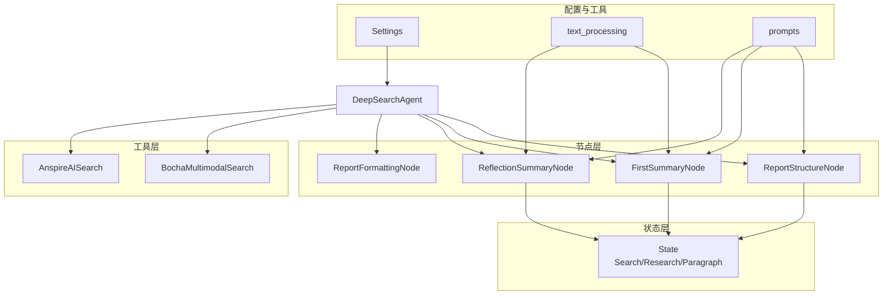
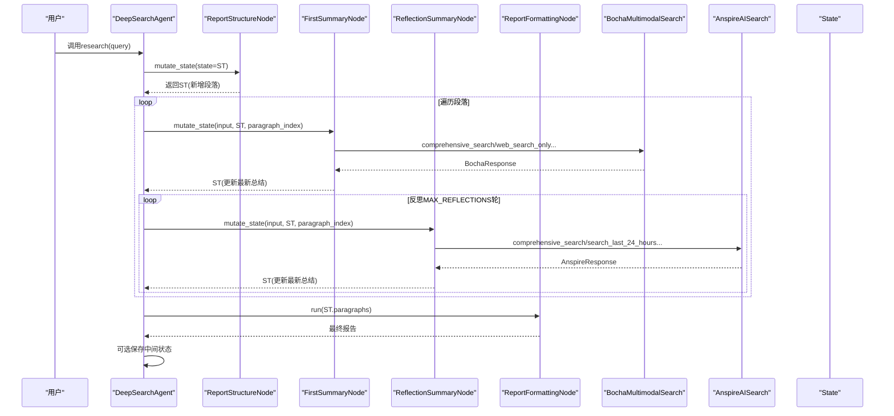
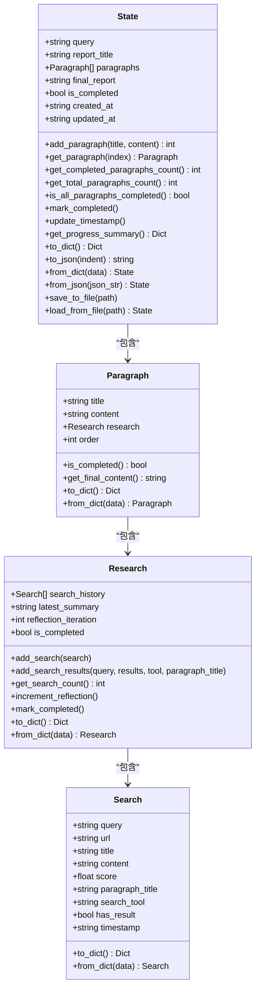
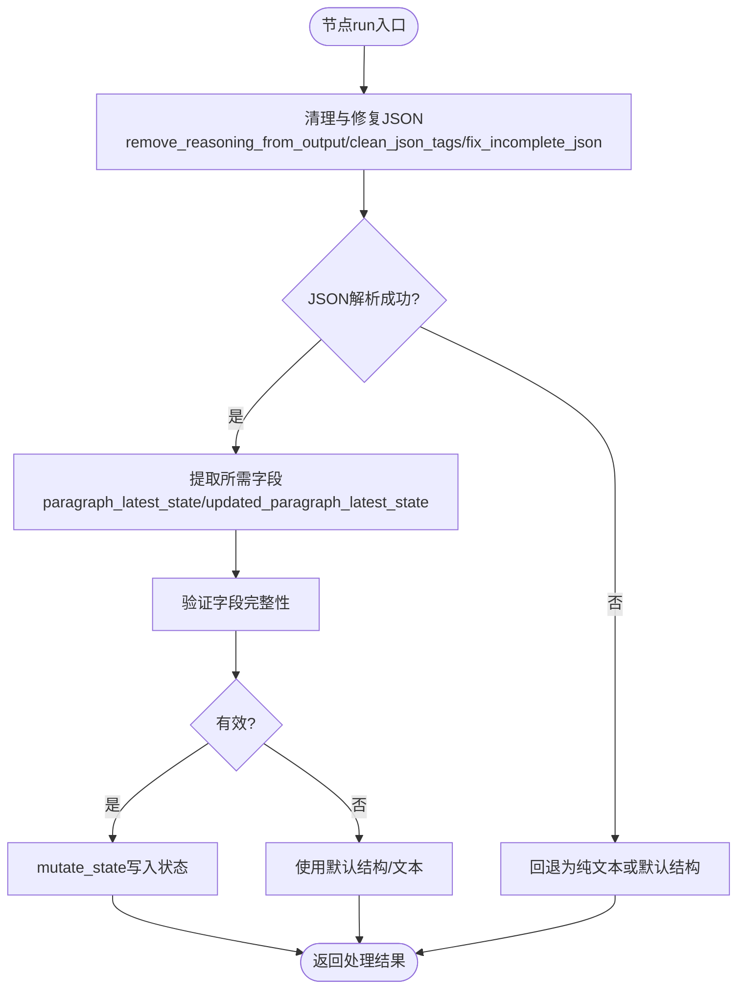
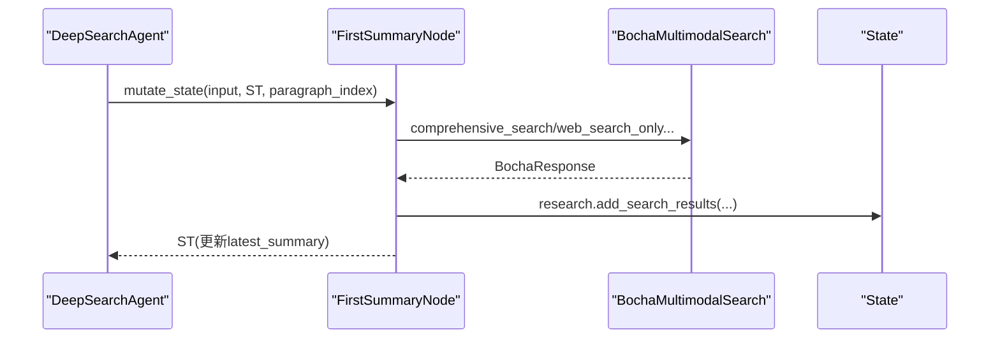
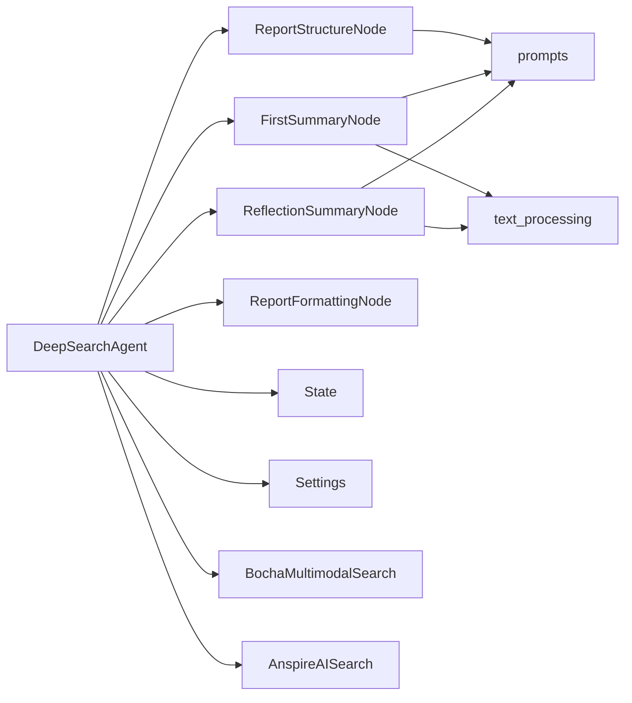

# 状态管理与数据流

<cite>
**本文引用的文件**
- [MediaEngine/state/state.py](file://MediaEngine/state/state.py)
- [MediaEngine/agent.py](file://MediaEngine/agent.py)
- [MediaEngine/nodes/base_node.py](file://MediaEngine/nodes/base_node.py)
- [MediaEngine/nodes/report_structure_node.py](file://MediaEngine/nodes/report_structure_node.py)
- [MediaEngine/nodes/summary_node.py](file://MediaEngine/nodes/summary_node.py)
- [MediaEngine/tools/search.py](file://MediaEngine/tools/search.py)
- [MediaEngine/utils/config.py](file://MediaEngine/utils/config.py)
- [MediaEngine/utils/text_processing.py](file://MediaEngine/utils/text_processing.py)
- [MediaEngine/prompts/prompts.py](file://MediaEngine/prompts/prompts.py)
</cite>

## 目录
1. [简介](#简介)
2. [项目结构](#项目结构)
3. [核心组件](#核心组件)
4. [架构总览](#架构总览)
5. [详细组件分析](#详细组件分析)
6. [依赖关系分析](#依赖关系分析)
7. [性能考量](#性能考量)
8. [故障排查指南](#故障排查指南)
9. [结论](#结论)
10. [附录](#附录)

## 简介
本文件面向Media Engine的状态管理与数据流，系统性阐述状态数据结构设计、多模态处理流程中的状态传递机制、序列化与持久化策略、并发控制思路、状态扩展与自定义方案、状态验证与完整性检查，以及调试、性能优化与故障排除实践。文档旨在帮助开发者与使用者理解并高效使用Media Engine的状态管理能力。

## 项目结构
Media Engine采用“状态驱动的节点流水线”架构：
- 状态层：集中定义媒体内容状态、分析过程状态与输出结果状态的数据结构与序列化/反序列化方法。
- 节点层：各处理节点负责执行具体任务（生成报告结构、首次/反思总结、格式化报告等），并通过mutate_state修改状态。
- 工具层：封装多模态搜索工具（Bocha/Anspire），统一返回结构化结果。
- 配置与工具：配置管理、文本处理工具（JSON修复、截断、清理）、提示词定义。

图表来源
- [MediaEngine/state/state.py](file://MediaEngine/state/state.py#L176-L293)
- [MediaEngine/agent.py](file://MediaEngine/agent.py#L26-L508)
- [MediaEngine/nodes/report_structure_node.py](file://MediaEngine/nodes/report_structure_node.py#L22-L205)
- [MediaEngine/nodes/summary_node.py](file://MediaEngine/nodes/summary_node.py#L34-L369)
- [MediaEngine/tools/search.py](file://MediaEngine/tools/search.py#L100-L519)
- [MediaEngine/utils/config.py](file://MediaEngine/utils/config.py#L16-L89)
- [MediaEngine/utils/text_processing.py](file://MediaEngine/utils/text_processing.py#L12-L309)
- [MediaEngine/prompts/prompts.py](file://MediaEngine/prompts/prompts.py#L122-L451)

章节来源
- [MediaEngine/state/state.py](file://MediaEngine/state/state.py#L1-L293)
- [MediaEngine/agent.py](file://MediaEngine/agent.py#L26-L508)

## 核心组件
- 状态数据结构
  - Search：单个搜索结果状态，包含查询、URL、标题、内容、评分、段落标题、工具、结果标志、时间戳等。
  - Research：段落研究过程状态，包含搜索历史、最新总结、反思迭代次数、完成标志。
  - Paragraph：报告段落状态，包含标题、预期内容、研究进度、顺序。
  - State：整体报告状态，包含原始查询、报告标题、段落列表、最终报告、完成标志、创建/更新时间戳。
- 节点基类
  - BaseNode：抽象节点接口，提供run、输入校验、输出处理、日志记录。
  - StateMutationNode：继承BaseNode，定义mutate_state接口，用于修改状态。
- Agent
  - DeepSearchAgent：编排流程，协调节点、搜索工具、状态持久化。
  - AnspireSearchAgent：基于Anspire搜索工具的变体实现。
- 工具
  - BochaMultimodalSearch/AnspireAISearch：封装多模态搜索API，统一返回结构化结果。
- 配置与工具
  - Settings：集中配置，支持.env与环境变量加载。
  - text_processing：JSON清理、修复、截断、格式化等。
  - prompts：各阶段系统提示词与JSON Schema。

章节来源
- [MediaEngine/state/state.py](file://MediaEngine/state/state.py#L12-L293)
- [MediaEngine/nodes/base_node.py](file://MediaEngine/nodes/base_node.py#L13-L95)
- [MediaEngine/agent.py](file://MediaEngine/agent.py#L26-L508)
- [MediaEngine/tools/search.py](file://MediaEngine/tools/search.py#L100-L519)
- [MediaEngine/utils/config.py](file://MediaEngine/utils/config.py#L16-L89)
- [MediaEngine/utils/text_processing.py](file://MediaEngine/utils/text_processing.py#L12-L309)
- [MediaEngine/prompts/prompts.py](file://MediaEngine/prompts/prompts.py#L10-L451)

## 架构总览
Media Engine以“状态为中心”的流水线架构：
- Agent作为编排者，按步骤调用节点，节点通过mutate_state修改State。
- 搜索工具返回结构化结果，节点将其注入State的Research/Search历史。
- 状态具备to_dict/to_json/from_dict/from_json/save/load能力，支持中间状态持久化与恢复。
- 配置Settings贯穿Agent、节点、工具，决定行为参数（如最大反思轮数、最大段落数、输出目录、是否保存中间状态等）。

图表来源
- [MediaEngine/agent.py](file://MediaEngine/agent.py#L133-L438)
- [MediaEngine/nodes/report_structure_node.py](file://MediaEngine/nodes/report_structure_node.py#L168-L205)
- [MediaEngine/nodes/summary_node.py](file://MediaEngine/nodes/summary_node.py#L170-L200)
- [MediaEngine/nodes/summary_node.py](file://MediaEngine/nodes/summary_node.py#L338-L369)
- [MediaEngine/tools/search.py](file://MediaEngine/tools/search.py#L100-L519)
- [MediaEngine/state/state.py](file://MediaEngine/state/state.py#L176-L293)

## 详细组件分析

### 状态数据结构与序列化
- Search
  - 字段：查询、URL、标题、内容、评分、段落标题、工具、结果标志、时间戳。
  - 方法：to_dict/from_dict，便于JSON序列化与反序列化。
- Research
  - 字段：搜索历史列表、最新总结、反思次数、完成标志。
  - 方法：add_search/add_search_results/get_search_count/increment_reflection/mark_completed，以及to_dict/from_dict。
- Paragraph
  - 字段：标题、预期内容、研究进度、顺序。
  - 方法：is_completed/get_final_content，以及to_dict/from_dict。
- State
  - 字段：原始查询、报告标题、段落列表、最终报告、完成标志、创建/更新时间戳。
  - 方法：add_paragraph/get_paragraph/get_completed_paragraphs_count/get_total_paragraphs_count/is_all_paragraphs_completed/mark_completed/update_timestamp/get_progress_summary，以及to_dict/to_json/from_dict/from_json/save_to_file/load_from_file。

图表来源
- [MediaEngine/state/state.py](file://MediaEngine/state/state.py#L12-L293)

章节来源
- [MediaEngine/state/state.py](file://MediaEngine/state/state.py#L12-L293)

### 节点与状态修改
- BaseNode
  - run：抽象执行入口。
  - validate_input/process_output：输入校验与输出处理钩子。
  - 日志记录方法：info/warning/error。
- StateMutationNode
  - mutate_state：抽象的状态修改接口，由具体节点实现。
- ReportStructureNode
  - 作用：根据查询生成报告结构，写入State。
  - 输出处理：清理与修复JSON，验证结构有效性，必要时回退默认结构。
  - mutate_state：设置查询、标题、添加段落。
- FirstSummaryNode / ReflectionSummaryNode
  - 作用：首次/反思总结，更新段落最新总结。
  - 输入校验：严格检查必需字段。
  - 输出处理：清理与修复JSON，提取所需字段，必要时回退为纯文本。
  - mutate_state：更新指定段落的latest_summary，递增反思次数，刷新时间戳。

图表来源
- [MediaEngine/nodes/report_structure_node.py](file://MediaEngine/nodes/report_structure_node.py#L67-L148)
- [MediaEngine/nodes/summary_node.py](file://MediaEngine/nodes/summary_node.py#L118-L169)
- [MediaEngine/nodes/summary_node.py](file://MediaEngine/nodes/summary_node.py#L286-L337)

章节来源
- [MediaEngine/nodes/base_node.py](file://MediaEngine/nodes/base_node.py#L13-L95)
- [MediaEngine/nodes/report_structure_node.py](file://MediaEngine/nodes/report_structure_node.py#L22-L205)
- [MediaEngine/nodes/summary_node.py](file://MediaEngine/nodes/summary_node.py#L34-L369)

### 搜索工具与状态注入
- BochaMultimodalSearch
  - 提供comprehensive_search/web_search_only/search_for_structured_data/search_last_24_hours/search_last_week。
  - 统一解析API响应为BochaResponse，包含网页、图片、模态卡、AI总结、追问建议等。
- AnspireAISearch
  - 提供comprehensive_search/search_last_24_hours/search_last_week。
  - 统一解析API响应为AnspireResponse，包含网页结果与分数。
- Agent在各阶段将搜索结果注入State：
  - 初始搜索：FirstSummaryNode.mutate_state调用，写入Research.search_history与latest_summary。
  - 反思搜索：ReflectionSummaryNode.mutate_state调用，追加搜索历史并更新latest_summary。

图表来源
- [MediaEngine/agent.py](file://MediaEngine/agent.py#L209-L290)
- [MediaEngine/nodes/summary_node.py](file://MediaEngine/nodes/summary_node.py#L170-L200)
- [MediaEngine/tools/search.py](file://MediaEngine/tools/search.py#L213-L267)

章节来源
- [MediaEngine/tools/search.py](file://MediaEngine/tools/search.py#L100-L519)
- [MediaEngine/agent.py](file://MediaEngine/agent.py#L209-L373)

### 状态持久化与恢复
- State提供to_json/from_json与save_to_file/load_from_file，便于中间状态落地与恢复。
- Agent在保存报告的同时可选择保存中间状态（受配置控制）。
- Agent提供load_state/save_state便捷方法。

章节来源
- [MediaEngine/state/state.py](file://MediaEngine/state/state.py#L257-L293)
- [MediaEngine/agent.py](file://MediaEngine/agent.py#L402-L438)

### 并发控制策略
- 当前实现为单线程顺序执行，Agent按步骤串行调用节点与搜索工具。
- 若需并发：
  - 段落级别：可并行处理不同段落（需保证State访问的线程安全，或为每个段落维护独立State副本）。
  - 搜索级别：对不同工具的API调用可并发，但需考虑限流与重试策略。
  - 建议：引入轻量级锁或队列，避免竞态条件；对I/O密集型搜索使用异步模式。

章节来源
- [MediaEngine/agent.py](file://MediaEngine/agent.py#L189-L208)
- [MediaEngine/agent.py](file://MediaEngine/agent.py#L291-L373)

### 状态扩展与自定义
- 新增状态字段：在对应dataclass中添加字段，并在to_dict/from_dict中同步处理。
- 新增状态类型：定义新的dataclass，实现to_dict/from_dict，接入现有序列化/反序列化链路。
- 新增节点：继承StateMutationNode，实现mutate_state，按需读取/写入State的新增字段。
- 新增搜索工具：新增工具类，遵循统一响应结构（如BochaResponse/AnspireResponse），并在Agent中注册与调用。

章节来源
- [MediaEngine/state/state.py](file://MediaEngine/state/state.py#L12-L293)
- [MediaEngine/nodes/base_node.py](file://MediaEngine/nodes/base_node.py#L78-L95)
- [MediaEngine/tools/search.py](file://MediaEngine/tools/search.py#L100-L519)

### 状态验证与完整性检查
- 输入校验：节点run前调用validate_input，确保输入满足必需字段与格式。
- 输出修复：使用remove_reasoning_from_output/clean_json_tags/fix_incomplete_json等工具修复LLM输出。
- 结构验证：ReportStructureNode对解析后的结构进行字段完整性检查，必要时回退默认结构。
- 状态完整性：State提供进度摘要、完成标志、时间戳，便于外部监控与恢复。

章节来源
- [MediaEngine/nodes/report_structure_node.py](file://MediaEngine/nodes/report_structure_node.py#L36-L148)
- [MediaEngine/nodes/summary_node.py](file://MediaEngine/nodes/summary_node.py#L46-L227)
- [MediaEngine/utils/text_processing.py](file://MediaEngine/utils/text_processing.py#L12-L309)
- [MediaEngine/state/state.py](file://MediaEngine/state/state.py#L231-L243)

## 依赖关系分析
- Agent依赖节点、工具、状态与配置。
- 节点依赖LLM客户端与提示词Schema。
- 工具依赖配置中的API密钥与Base URL。
- 状态被节点与Agent频繁读写，是数据流的核心枢纽。

图表来源
- [MediaEngine/agent.py](file://MediaEngine/agent.py#L26-L508)
- [MediaEngine/nodes/report_structure_node.py](file://MediaEngine/nodes/report_structure_node.py#L22-L205)
- [MediaEngine/nodes/summary_node.py](file://MediaEngine/nodes/summary_node.py#L34-L369)
- [MediaEngine/tools/search.py](file://MediaEngine/tools/search.py#L100-L519)
- [MediaEngine/utils/config.py](file://MediaEngine/utils/config.py#L16-L89)
- [MediaEngine/utils/text_processing.py](file://MediaEngine/utils/text_processing.py#L12-L309)
- [MediaEngine/prompts/prompts.py](file://MediaEngine/prompts/prompts.py#L10-L451)

章节来源
- [MediaEngine/agent.py](file://MediaEngine/agent.py#L26-L508)
- [MediaEngine/nodes/base_node.py](file://MediaEngine/nodes/base_node.py#L13-L95)

## 性能考量
- I/O与网络
  - 搜索工具调用为I/O密集型，建议使用合理的超时与重试策略（工具已内置重试装饰器）。
  - 控制单次搜索结果数量与内容长度，避免提示词过长导致LLM调用成本上升。
- LLM调用
  - 使用流式输出与及时清理，减少内存占用。
  - 合理设置MAX_REFLECTIONS与MAX_PARAGRAPHS，避免过度迭代。
- 状态序列化
  - 大体量状态建议分批保存，或仅保存关键节点状态。
  - 使用to_json时适当调整缩进，兼顾可读性与存储空间。
- 并发与缓存
  - 对相同查询的搜索结果可做缓存，避免重复调用。
  - 并行处理段落时，注意状态写入的原子性与一致性。

[本节为通用性能建议，不直接分析具体文件]

## 故障排查指南
- LLM输出异常
  - 症状：节点输出解析失败或为空。
  - 处理：启用remove_reasoning_from_output/clean_json_tags/fix_incomplete_json；必要时回退默认结构或文本。
- 搜索工具不可用
  - 症状：API密钥未配置或网络异常。
  - 处理：检查.env或环境变量；确认API密钥与Base URL；查看工具内部异常日志。
- 状态恢复失败
  - 症状：加载JSON失败或字段缺失。
  - 处理：确认保存的JSON格式；必要时手动修正或重建State。
- 进度与完成状态异常
  - 症状：进度百分比不正确或完成标志未更新。
  - 处理：检查State.update_timestamp与mark_completed调用；核对段落数与完成标志。

章节来源
- [MediaEngine/nodes/report_structure_node.py](file://MediaEngine/nodes/report_structure_node.py#L67-L148)
- [MediaEngine/nodes/summary_node.py](file://MediaEngine/nodes/summary_node.py#L118-L169)
- [MediaEngine/tools/search.py](file://MediaEngine/tools/search.py#L183-L210)
- [MediaEngine/state/state.py](file://MediaEngine/state/state.py#L257-L293)
- [MediaEngine/agent.py](file://MediaEngine/agent.py#L425-L438)

## 结论
Media Engine通过清晰的状态数据结构与节点化的处理流程，实现了多模态内容研究的可追踪、可恢复与可扩展。状态的序列化/反序列化与持久化为调试与恢复提供了基础；严格的输入/输出校验与JSON修复机制提升了鲁棒性；配置中心化使得行为可控。未来可在并发与缓存层面进一步优化，以支撑更大规模的多模态分析任务。

[本节为总结性内容，不直接分析具体文件]

## 附录
- 关键配置项
  - SEARCH_TIMEOUT、SEARCH_CONTENT_MAX_LENGTH、MAX_REFLECTIONS、MAX_PARAGRAPHS、OUTPUT_DIR、SAVE_INTERMEDIATE_STATES、SEARCH_TOOL_TYPE、API密钥与Base URL等。
- 常用方法速览
  - State：add_paragraph/get_progress_summary/save_to_file/load_from_file
  - Research：add_search_results/increment_reflection/mark_completed
  - 节点：run/process_output/mutate_state(validate_input)

章节来源
- [MediaEngine/utils/config.py](file://MediaEngine/utils/config.py#L16-L89)
- [MediaEngine/state/state.py](file://MediaEngine/state/state.py#L176-L293)
- [MediaEngine/nodes/base_node.py](file://MediaEngine/nodes/base_node.py#L78-L95)